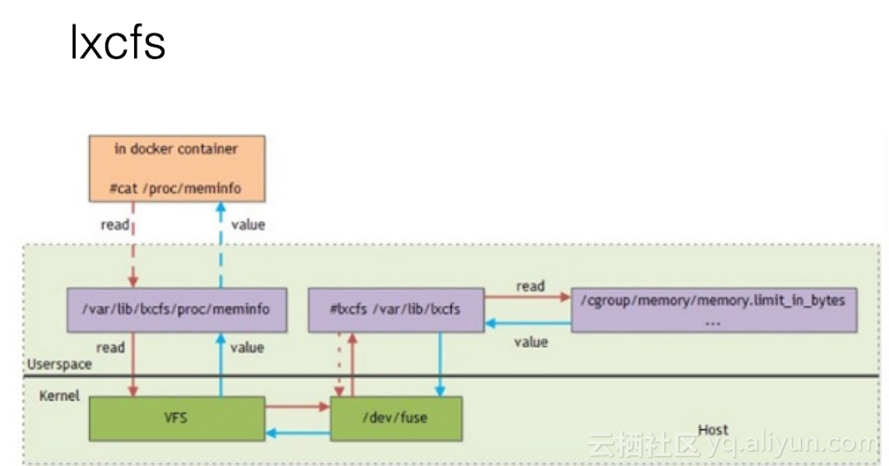
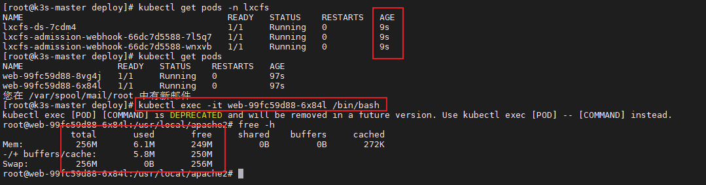
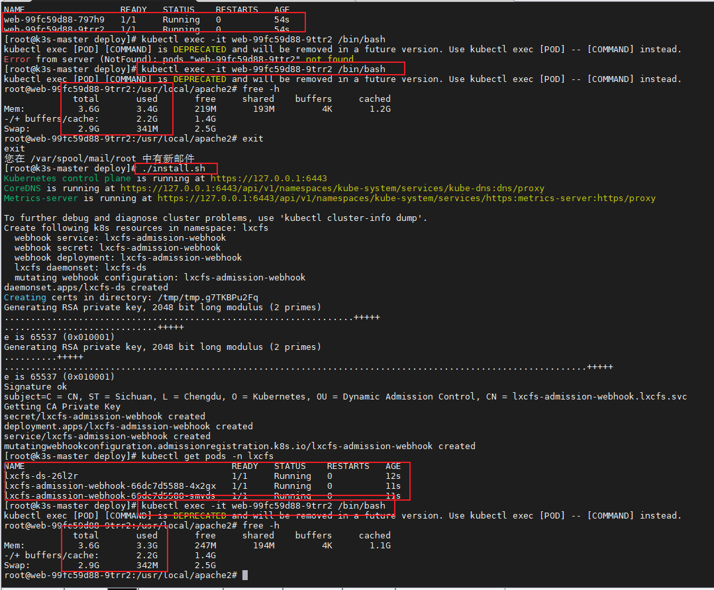
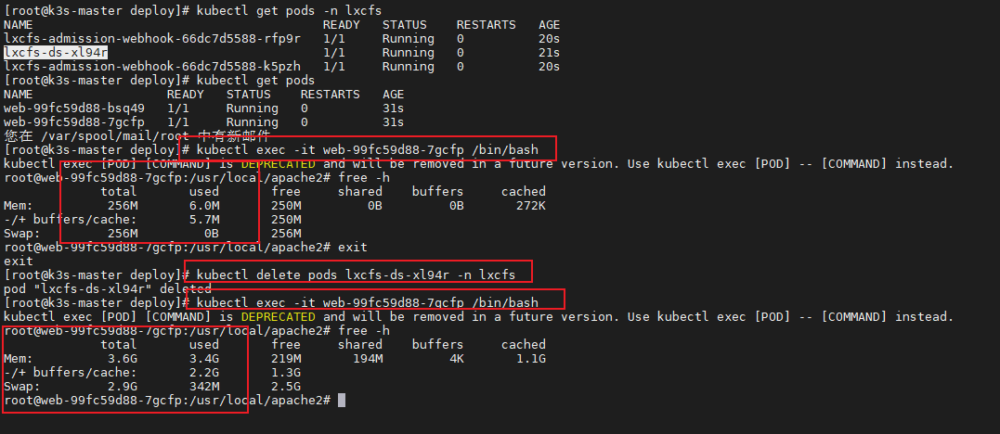
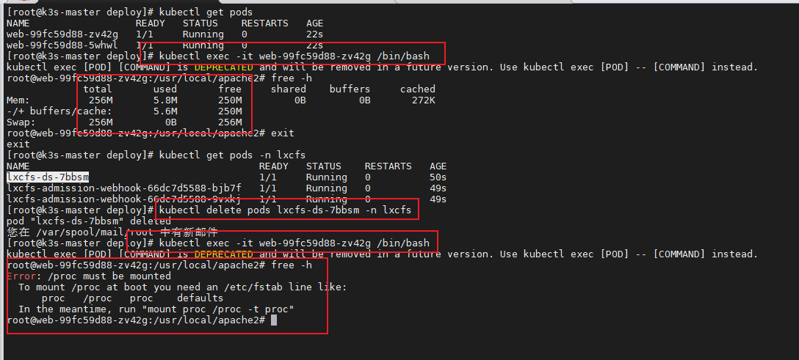

# 1. 背景
Linux 利用 Cgroup 实现了对[容器](https://cloud.tencent.com/product/tke?from=10680)的资源限制，但在容器内部依然缺省挂载了[宿主机](https://cloud.tencent.com/product/cdh?from=10680)上的 procfs 的 /proc 目录，其包含如：meminfo、cpuinfo、stat、uptime 等资源信息。一些监控工具如 free、top 或 业务应用还依赖上述文件内容获取资源配置和使用情况。当它们在容器中运行时，就会把宿主机的资源状态读取出来，导致资源设置不对。
>上面提到的问题，可以通过 LXCFS 方法来解决。

## 1.1 **LXCFS 简介**
> 社区中常见的做法是利用 lxcfs 来提供容器中的资源可见性。lxcfs 是一个开源的FUSE（用户态文件系统）实现来支持LXC容器，它也可以支持Docker容器。

LXCFS通过用户态文件系统，在容器中提供下列 procfs 的文件。
```bash
/proc/cpuinfo
/proc/diskstats
/proc/meminfo
/proc/stat
/proc/swaps
/proc/uptime
```
LXCFS工作示意图如下：


# 2. 前提
LXCFS使用需在物理机安装以下包：
```bash
yum install -y fuse-libs
```

# 3. （Kubernetes 1.22.x以前）lxcfs-admissino-webhook配置
> [https://github.com/denverdino/lxcfs-admission-webhook](https://github.com/denverdino/lxcfs-admission-webhook)

## 3.1 Kubernetes api-versions 需要启用 admissionregistration.k8s.io/v1beta1。（Kubernetes 1.9.0+ 版本默认都启用）
```bash
# 查看是否开启
kubectl api-versions | grep 'admissionregistration.k8s.io/v1beta1'

admissionregistration.k8s.io/v1beta1
```

## 3.2 在k8s集群部署LXCFS
> 下载 lxcfs-admission-webhook 项目

```bash
git clone https://github.com/denverdino/lxcfs-admission-webhook.git
cd lxcfs-admission-webhook
```
> 部署lxcfs

```bash
kubectl apply -f deployment/lxcfs-daemonset.yaml

# 查看 lxcfs 是否部署成功
kubectl  get pods -n default  | grep lxcfs

lxcfs-4crr4    1/1     Running   0  153m
lxcfs-jmzpk    1/1     Running   0  155m
```
> 部署 lxcfs-admission-webhook injector

```bash
# 执行 shell 部署脚本
./deployment/install.sh

# 查看
kubectl get secrets,pods,svc,mutatingwebhookconfigurations
```

## 3.3 给需注入lxcfs的命名空间打标签
```bash
kubectl label namespace ai-education lxcfs-admission-webhook=enabled
```

## 3.4 卸载
```bash
./deployment/uninstall.sh

kubectl delete -f deployment/lxcfs-daemonset.yaml
```

# 4. （Kubernetes 1.22.x以后）lxcfs-admissino-webhook配置
> [https://github.com/ymping/lxcfs-admission-webhook](https://github.com/ymping/lxcfs-admission-webhook)


## 4.1 准备工作
```bash
#安装python3
yum install python3

#创建lxcfs命名空间
kubectl create ns lxcfs
```

## 4.2 Kubernetes api-versions 需要启用 admissionregistration.k8s.io/v1。（Kubernetes v1.16 or above  版本默认都启用）
```bash
# 查看是否开启
kubectl api-versions | grep 'admissionregistration.k8s.io/v1'


admissionregistration.k8s.io/v1
```

## 4.3 在k8s集群部署LXCFS
> 下载 lxcfs-admission-webhook 项目

```bash
git clone https://github.com/ymping/lxcfs-admission-webhook.git
cd lxcfs-admission-webhook
```
> 部署lxcfs

```bash
./deploy/install.sh

# 查看 lxcfs 是否部署成功
kubectl  get pods -n lxcfs  | grep lxcfs


NAME                                       READY   STATUS    RESTARTS   AGE
lxcfs-ds-r5m54                             1/1     Running   0          84m
lxcfs-admission-webhook-66dc7d5588-2ngfd   1/1     Running   0          84m
lxcfs-admission-webhook-66dc7d5588-n46vg   1/1     Running   0          84m
```
```bash
# 查看
kubectl get secrets,pods,svc,mutatingwebhookconfigurations -n lxcfs
```

## 4.4 给需注入lxcfs的命名空间打标签
```bash
kubectl label namespace ai-education lxcfs-admission-webhook=enabled
```

## 4.5 卸载
```bash
./deploy/uninstall.sh
```

## 4.6 测试
| k8s集群：v1.25.4+k3s1 |  |  |  |  |
| --- | --- | --- | --- | --- |
| 场景 | 镜像中是否采用remount | 步骤 | 测试容器内内存显示是否正确 | 图例 |
| 安装lxcfs后，起pod是否能正确显示内存信息 | √ | lxcfs先于测试容器安装 | 正确 | 1 |
| 安装lxcfs后，已存在pod是否能正确显示内存信息 | √ | lxcfs后于测试容器安装 | 不正确且重启测试容器后正确 | 2 |
| 安装lxcfs并删除lxcfs pod，之前能正确显示内存信息的pod是否已然可以正确显示 | √ | lxcfs先于测试容器安装->卸载重安 | 正确->不正确 | 3 |
| 安装lxcfs并删除lxcfs pod，之前能正确显示内存信息的pod是否已然可以正确显示 | x | lxcfs先于测试容器安装->卸载重安 | 正确-内存显示命令无法使用 | 4 |

图例1：

图例2：

图例3：

图例4：


