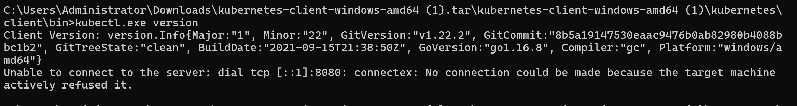
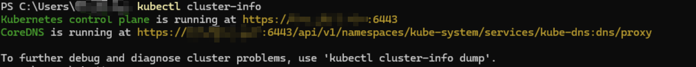
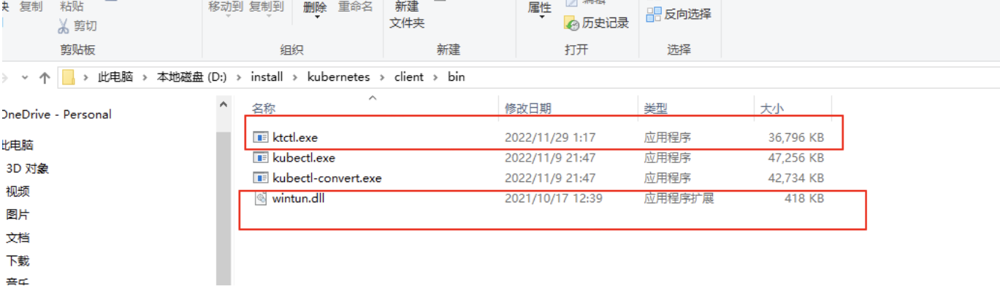
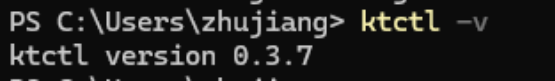
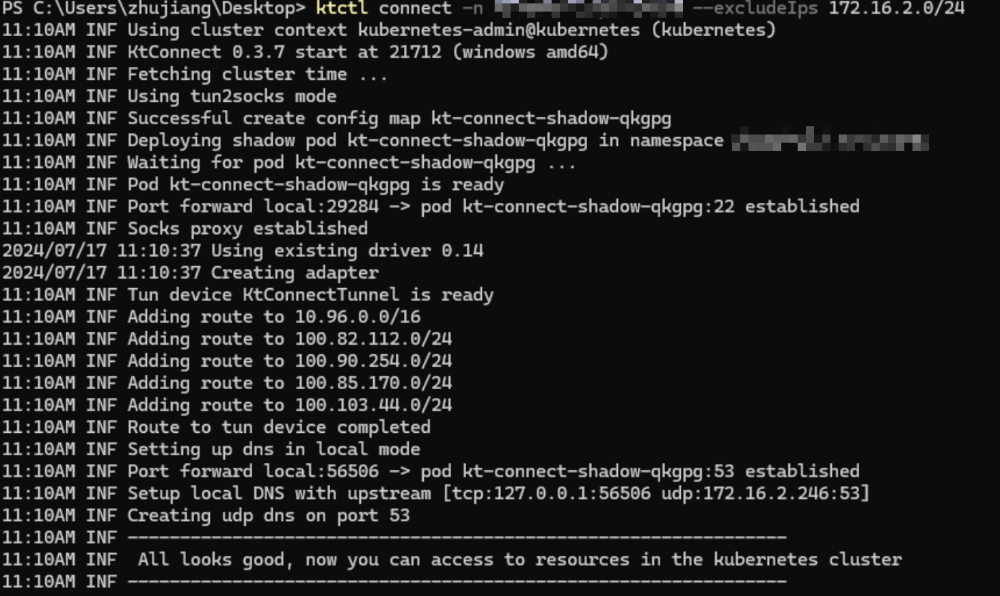

# 0. 前言
>随着Kubernetes技术的普及，越来越多的应用被容器化，并部署到Kubernetes上。随之而来的问题是当容器中发生错误时，对错误的定位和调试也变得很复杂。当一个工具给你带来便利时，它也可能给你带来另一些麻烦。

- 而KTConnect就可以在本地联通Kubernetes集群并进行调试。

KTConnect是阿里巴巴开源的一款云原生协同开发测试解决方案，目前的功能包括：
- 直接访问 Kubernetes 集群
- 转发集群流量到本地
- Service Mesh 支持
- 基于 SSH 的轻量级 VPN 网络
- 作为 kubectl 插件，集成到 Kubectl

（以上内容来自官方文档）

其中最实用的功能就是直连Kubernetes网络，从而实现在本地使用Kubernetes自定义内网域名调用Kubernetes集群内的服务以及将Kubernetes集群中的流量转发到开发机本地，作用类似于一个VPN代理，将开发机本地网络与Kubernetes集群网络连接。


# 1. 下载kubectl client命令行工具
- [Kubernets-github-页面](https://github.com/kubernetes/kubernetes/blob/master/CHANGELOG/CHANGELOG-1.22.md#v1222)
- [Kubernets-windows-client-1.22.2](https://dl.k8s.io/v1.22.2/kubernetes-client-windows-amd64.tar.gz)
# 2. 配置kubectl环境变量并验证是否安装成功
- 配置环境变量
  - 将kubectl解压到软件目录
  - windows配置环境变量
- 检查是否成功
```bash
kubectl version --client
```

# 3. 配置kube's config
- 将k8s集群的config文件拷贝到Windows的`C:\Users\username\.kube`文件夹中
  - config文件路径：`$HOME/.kube/config`
```conf
apiVersion: v1
clusters:
- cluster:
    certificate-authority-data: LS0tLS......o=
    server: https://xxx.xxx.xxx:6443
  name: kubernetes
contexts:
- context:
    cluster: kubernetes
    user: kubernetes-admin
  name: kubernetes-admin@kubernetes
current-context: kubernetes-admin@kubernetes
kind: Config
preferences: {}
users:
- name: kubernetes-admin
  user:
    client-certificate-data: LS0tLS1CRUdJTiBDRVJ......K
    client-key-data: LS0tLS1CRUdJTiBSU0EgUFJJVkFURSBLRVktLS0tLQ.....=
```
# 4. 验证是否能连接k8s集群
- 命令如下
```bash
kubectl cluster-info
```

# 5. KTConnect下载安装
- [KTConnect下载地址](https://alibaba.github.io/kt-connect/#/zh-cn/guide/downloads)
- 下载KTConnect并将其放到和kubectl-windows-client的同一个bin目录下

# 6. 验证是否安装成功：

# 7. 通过管理员启动PowerShell并启动KTConnect
- 启动命令
```bash
ktctl connect -n test --excludeIps 172.16.2.0/24
```

