# 0. 前言
> 相比其他传统备份工具，Velero 并不仅仅备份存储数据，它还能够备份 Kubernetes 中的应用状态和集群资源。Kubernetes 集群中的资源包括 Pod、Service、ConfigMap、Ingress 等，它们共同定义了应用的状态和行为。Velero 可以将这些资源与持久化卷（Persistent Volume，PV）的数据一起备份，保证整个应用环境的完整性.

- [velero官网](https://velero.io/docs)
- 集群备份：Velero允许对Kubernetes集群中的所有资源（如Deployment、Service、ConfigMap等）以及数据卷（PVC）进行备份。可以执行一次性备份或通过定期任务实现自动备份，确保集群始终有最新的可用备份。
- 灾难恢复：如果集群由于硬件故障、系统崩溃或误操作而丢失数据或配置，Velero可以快速恢复之前备份的资源和数据，减少宕机时间和业务损失。
- 数据迁移：Velero可以在不同的Kubernetes集群之间迁移资源和数据。例如，可以将开发环境中的工作负载迁移到生产环境，或者将工作负载从一个云服务商迁移到另一个云服务商。


# 1. 准备工作
## 1.1 创建velero命名空间
- 创建命令空间
```bash
kubectl create ns velero
```

## 1.2 安装备份数据载体
- 本例通过minio作为备份数据存储
  - 生产环境中建议定期将minio上的数据保存至可靠本地存储介质存储
- 本例通过`rook-ceph`提供pv给minio使用
  - `kubectl create -f velero-pvc.yaml`
```yaml
kind: PersistentVolumeClaim
apiVersion: v1
metadata:
  name: velero-pvc
  namespace: velero
spec:
  accessModes:
    - ReadWriteMany
  resources:
    requests:
      storage: 300Gi
  storageClassName: rook-cephfs
  volumeMode: Filesystem
```
- minio安装文件
  - `kubectl create -f minio.yaml`
```yaml
kind: Deployment
apiVersion: apps/v1
metadata:
  name: minio
  namespace: velero
  labels:
    component: minio
spec:
  replicas: 1
  selector:
    matchLabels:
      component: minio
  template:
    metadata:
      creationTimestamp: null
      labels:
        component: minio
    spec:
      volumes:
        - name: storage
          persistentVolumeClaim:
            claimName: velero-pvc
        - name: config
          emptyDir: {}
      containers:
        - name: minio
          image: 'minio/minio:RELEASE.2023-03-20T20-16-18Z'
          args:
            - server
            - /data
            - '--config-dir=/config'
            - '--console-address=:9001'
          ports:
            - containerPort: 9000
              protocol: TCP
            - containerPort: 9001
              protocol: TCP
          env:
            - name: MINIO_ROOT_USER
              value: admin
            - name: MINIO_ROOT_PASSWORD
              value: admin123456
          resources:
            limits:
              cpu: '2'
              memory: 4Gi
            requests:
              cpu: 500m
              memory: 512Mi
          volumeMounts:
            - name: storage
              mountPath: /data
            - name: config
              mountPath: /config
---
kind: Service
apiVersion: v1
metadata:
  namespace: velero
  name: minio
  labels:
    component: minio
spec:
  type: Nodeport
  ports:
  - name: port
    port: 9000
    protocol: TCP
    targetPort: 9000
  - name: console
    port: 9001
    protocol: TCP
    targetPort: 9001
  selector:
    component: minio
```

## 1.3 minio上创建bucket
- 待minio部署完毕后，登陆minio
  - 创建velero存储bucket：`velero`
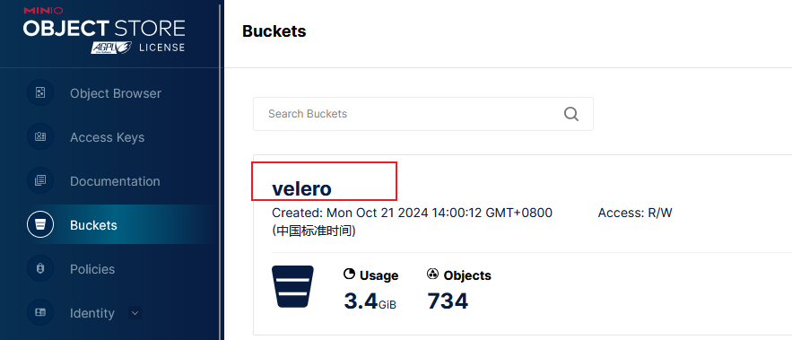

# 2. 安装velero
- 根据自己的k8s集群版本，选择对应的velero版本
  - 因为我的k8s集群为`v1.22.5`，版本列表中最新的支持到`v1.23.10`
  - 因此，我选用了`velero-1.10.0版本`，幸运的是也可以正常使用
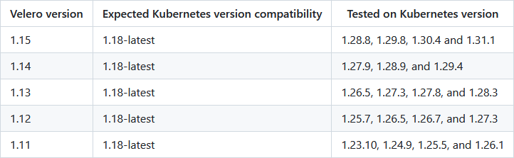
## 2.1 安装velero客户端
- 下载velero客户端二进制文件包
```bash
wget https://github.com/vmware-tanzu/velero/releases/download/v1.10.0/velero-v1.10.0-linux-amd64.tar.gz
```
- 解压至`/usr/local/bin`
```bash
tar -zxvf velero-v1.10.0-linux-amd64.tar.gz 
chmod +x velero-v1.10.0-linux-amd64/velero 
mv velero-v1.10.0-linux-amd64/velero /usr/local/bin/
```
- 验证客户端是否正常
```bash
velero version
```
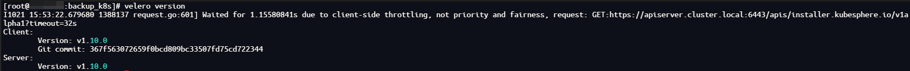
## 2.2 创建velero访问minio密钥文件
- 创建文件：`velero-secret`
```ini
[default]
aws_access_key_id = admin
aws_secret_access_key = admin123456
```
## 2.3 安装velero服务端
- s3插件`velero-plugin-for-aws`与velero版本对应关系如下
  - 本文选择`1.6.2`版本

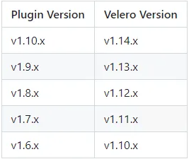

- 通过客户端命令安装服务端
```bash
velero install --provider aws --plugins velero/velero-plugin-for-aws:v1.6.2 --image velero/velero:v1.10.0 --namespace velero  --bucket velero --default-volumes-to-fs-backup --use-volume-snapshots=false --secret-file ./velero-secret --use-node-agent  --backup-location-config region=minio,s3ForcePathStyle="true",s3Url=http://minio.velero:9000
```
- 查看部署状态，是否正常运行
  - `kubectl get pod -n velero`

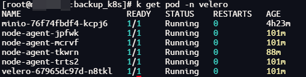

# 3. 备份及还原
## 3.1 备份
### 3.1.1 备份指令说明
- 命令不指定namespace和资源的情况下，将备份整个集群的所有资源
```bash
velero backup create backup-k8s-all
```
- 备份指定namespace资源
```bash
velero backup create backup-k8s-test --include-namespaces test
```

## 3.2 还原
### 3.2.1 锁定备份文件为只读(可选)
- (备份前操作)查看本地备份资料
```bash
[root@master01:~]# kubectl get backupstoragelocations -A 
NAMESPACE   NAME      PHASE       LAST VALIDATED   AGE   DEFAULT
velero      default   Available   49s              21h   true
```

- (备份前操作)将备份存储位置更新为只读模式（这可以防止在恢复过程中在备份存储位置中创建或删除备份对象）
```bash
kubectl patch backupstoragelocation <STORAGE LOCATION NAME> \
    --namespace velero \
    --type merge \
    --patch '{"spec":{"accessMode":"ReadOnly"}}'
```

- (备份后操作)准备就绪后，将备份存储位置恢复为读写模式
```bash
kubectl patch backupstoragelocation <STORAGE LOCATION NAME> \
   --namespace velero \
   --type merge \
   --patch '{"spec":{"accessMode":"ReadWrite"}}'
```

### 3.2.2 还原操作
- 删除集群中已经存在的`Postgres`的deployment及其pvc
- 恢复命令
```bash
velero restore create --from-backup backup-k8s-test --include-namespaces test
```
- 首先会按照原先pvc定义创建一个pvc
- 其次会启动一个velero的边车容器用于恢复数据状态
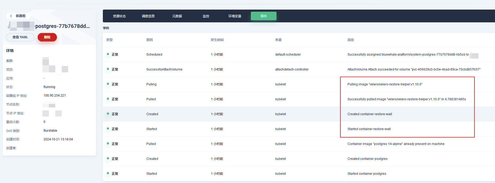
- 最后按照原先集群中的`Postgres`状态恢复
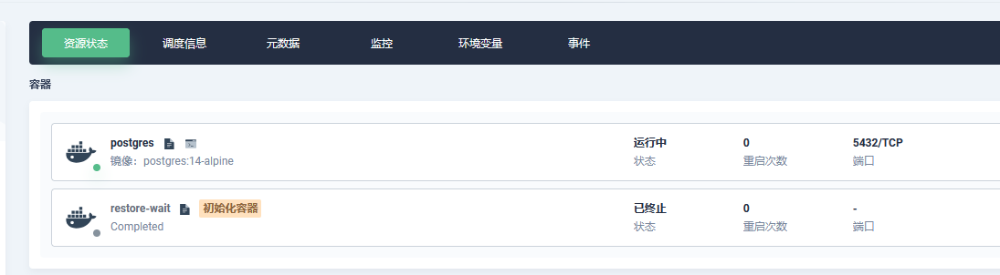

### 3.2.1 将备份资源还原至来源不同的namespace
- velero可以将资源还原到与其备份来源不同的命名空间中。
  - 通过使用`–namespace-mappings`
  - 需要注意的是，需提前创建好与`旧pvc`及`旧pv`同名的`新pvc`及`新pv`，否则velero会创建绑定`旧pv`的`新pvc`，导致`新pvc`绑定已经被`旧pvc`绑定的`旧pv`失败
```bash
velero restore create RESTORE_NAME --from-backup BACKUP_NAME --namespace-mappings old-ns-1:new-ns-1,old-ns-2:new-ns-2
```

## 3.3 定时备份
`设置定时备份前，请注意服务器时间与velero内部时间是否一致，比如本例中设置了cst凌晨2点进行备份，但因为容器内部时间为utc时间，因此到了cst10点才开始备份，需要注意这个坑，解决方案（方案一：部署velero时指定时区为cst；方案二：将utc时间转换为cst时间去设置定时任务）`
- 设置定时任务，每天凌晨2点进行备份
  - velero schedule create backup-k8s-all：这部分是命令的开头，它告诉 Velero 要创建一个新的备份调度任务，并将这个任务命名为 k8s-dev。
  - --schedule="0 2 * * *"：这个参数指定了备份任务的调度时间。它使用的是一个 cron 表达式，用于定义任务应该何时运行。在这个例子中，0 2 * * * 的含义是每天的凌晨 2 点执行一次备份。cron 表达式的格式通常是 分钟 小时 日 月 星期，其中星号（*）表示任意值。
  - --exclude-resources pods：这个参数指定了在备份过程中应该排除的资源类型。在这个例子中，它告诉 Velero 在执行备份时不要包括 pods。这通常是因为 pods 是短命的，它们的状态不应被持久化备份，而且 pods 的数据通常存储在持久卷中，这些卷可以被单独备份。
  - --ttl 240h：这个参数设置了备份的保留时间（Time-To-Live, TTL）。在这个例子中，它告诉 Velero 保留备份 240 小时（即 10 天）后删除它们。这有助于管理备份存储的空间，确保旧的、不再需要的备份不会无限期地保留下来。
```bash
velero schedule create backup-k8s-all --schedule="0 2 * * *"  --exclude-resources pods --ttl 240h
```

## 3.4 查看备份资源
- 查看普通备份
```bash
velero get backup
```
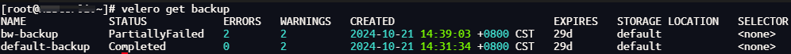

- 查看定时备份
```bash
velero get schedule
```
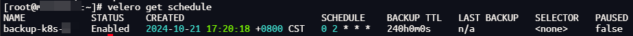

- 查看已有恢复
```bash
velero get restore
```
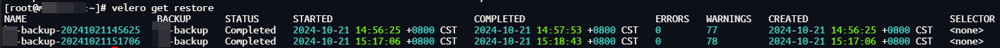

- 查看插件
```bash
velero get plugins
```
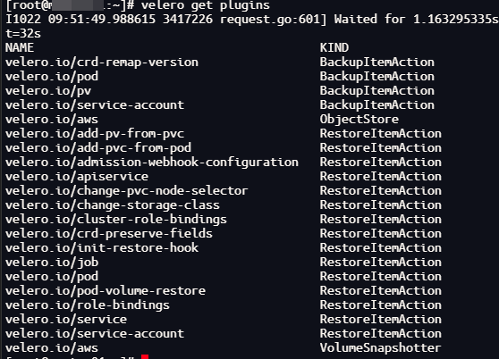

- 批量删除定时备份的所有备份
```bash
velero backup get --selector velero.io/schedule-name=backup-k8s-xxx | awk 'NR>1{print $1}' | xargs -I % velero backup delete % --confirm
```

- 删除定时备份任务
```bash
velero schedule delete backup-k8s-xxx
```

# 4. 卸载velero
- 卸载
```bash
kubectl delete namespace/velero clusterrolebinding/velero
kubectl delete crds -l component=velero
```

# 5. 注意事项
备份前注意：
- 在velero备份的时候，备份过程中创建的对象是不会被备份的
- 可以将velero作为一个cronjob来运行，定期备份数据
- velero restore 恢复`不会覆盖已有的资源`，只恢复当前集群中不存在的资源。已有的资源不会回滚到之前的版本，如需要回滚，需在restore之前提前删除现有的资源
- restore： 对历史备份的 Kubernetes 资源对象和持久卷进行还原，且允许按需选择指定部分资源对象还原到指定命名空间（namespace）中。且可以选择在备份还原期间或还原后执行 restore hook 操作（比如：执行自定义数据库的还原操作之后，再执行数据库应用容器启动动作）

Tips： 默认情况下，Velero 进行的是非破坏性还原操作（non-destructive restore），这意味着它不会删除目标集群上的任何数据，即如果备份中的资源对象已经存在于目标集群中，restore 操作将会跳过该资源的还原。当然，也可通配置更新策略 (`–existing-resource-policy=update`)，尝试更新目标集群中已存在资源，以匹配备份中的资源数据
- 备份使用volumes的Pod，需要给Pod加上注解
- 备份时禁用快照，可指定参数–snapshot-volumes=false
- [各云厂商Volumes快照插件](https://velero.io/plugins/)

使用 Velero 跨集群迁移资源，确保如下检查工作:
- 确保镜像资源在迁移后可以正常拉取
- 确保`两个集群`的 K8S 版本的 API 兼容，最好是`相同版本`
- 绑定集群外部资源的无法迁移，例如 LoadBalancer 类型的service，创建备份建议忽略