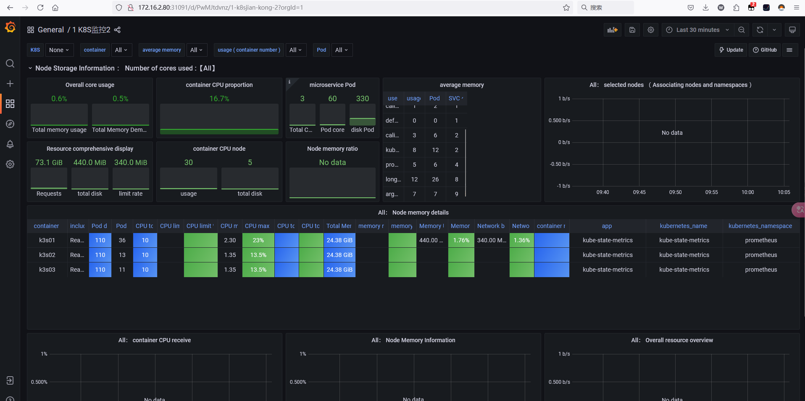
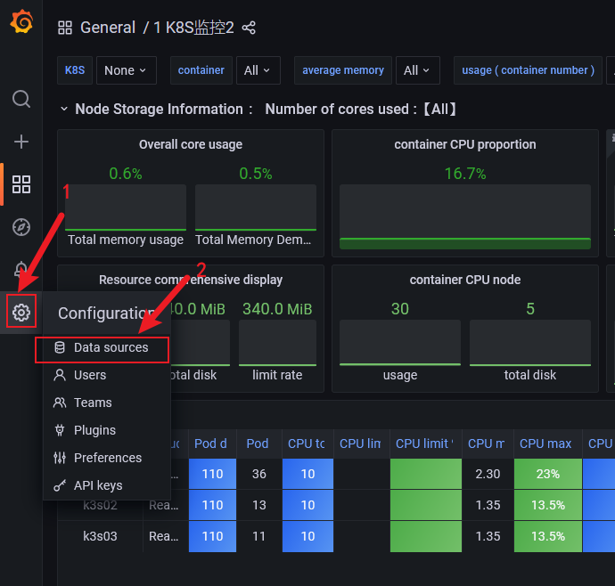
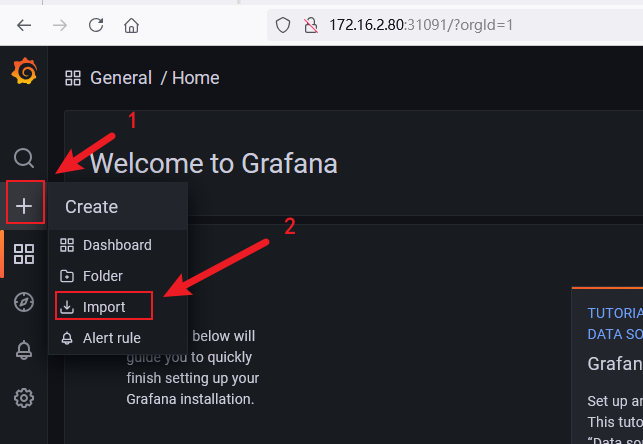
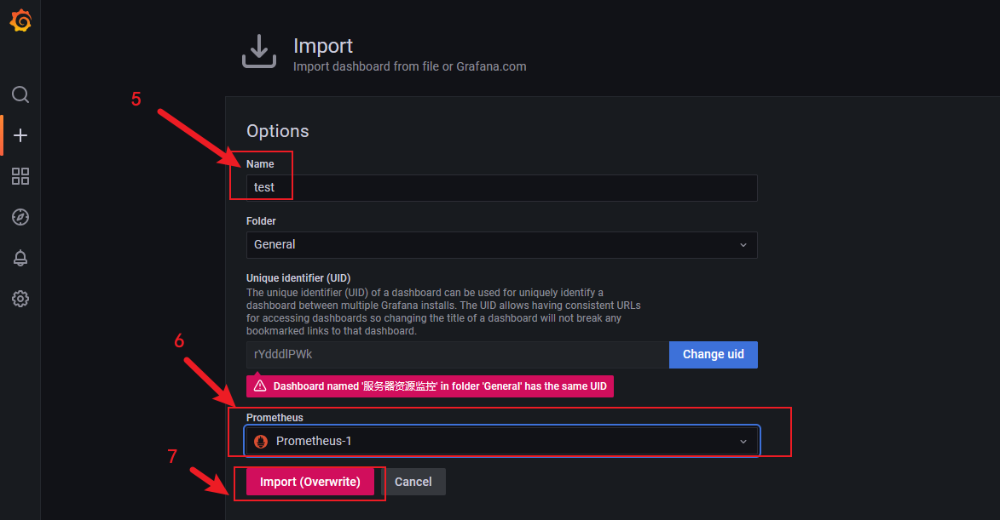
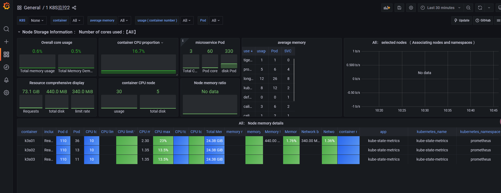
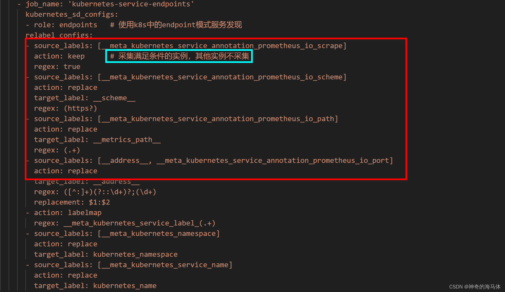
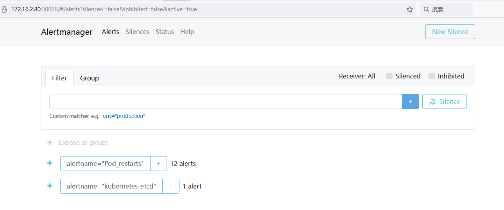
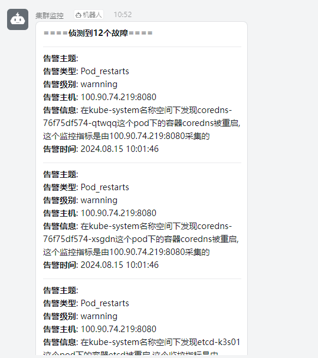

# 1. 环境信息
## 1.1 集群信息
| IP地址 | 主机名称 | 角色 | K8S版本 | Docker版本 |
| --- | --- | --- | --- | --- |
| 172.16.2.80 | k8s01 | master | v1.29.7 | 26.1.4 |
| 172.16.2.81 | k8s02 | worker | v1.29.7 | 26.1.4 |
| 172.16.2.82 | k8s03 | worker | v1.29.7 | 26.1.4 |


## 1.2 部署组件版本
| 序号 | 名称 | 版本 | 作用 |
| --- | --- | --- | --- |
| 1 | Prometheus | v2.33.5 | 收集、存储和处理指标数据 |
| 2 | Node_exporter | v0.16.0 | 采集服务器指标，如CPU、内存、磁盘、网络等 |
| 3 | Kube-state-metrics | v1.9.0 | 采集K8S资源指标，如Pod、Node、Deployment、Service等 |
| 4 | Grafana | v8.4.5 | 可视化展示Prometheus收集数据 |
| 5 |  webhook-dingtalk插件  ( 非容器化  ) | [v2.1.0](https://github.com/timonwong/prometheus-webhook-dingtalk/releases/download/v2.1.0/prometheus-webhook-dingtalk-2.1.0.linux-amd64.tar.) | 用于发送集群告警信息给钉钉机器人 |
| 6 | AlterManager | v0.23.0 |  建新的Prometheus ConfigMap资源清单，添加监控K8S集群告警规则   |

# 2. 准备工作
## 2.1 创建名称空间，下面所有资源都放到这里  
```bash
kubectl create ns prometheus
```
## 2.2 创建ServiceAccount账号，并绑定cluster-admin集群角色(Prometheus中需要指定)  
```bash
kubectl create serviceaccount prometheus -n prometheus

kubectl create clusterrolebinding prometheus-clusterrolebinding -n prometheus --clusterrole=cluster-admin  --serviceaccount=prometheus:prometheus

kubectl create clusterrolebinding prometheus-clusterrolebinding-1 -n prometheus --clusterrole=cluster-admin --user=system:serviceaccount:prometheus:prometheus
```
## 2.3 创建Prometheus存放数据目录  
 注意：我准备将`Prometheus`服务部署在`k8s01`节点，所以此步骤在`k8s01`节点执行  
```bash
mkdir -p /data/monitor_files/data/prometheus
chmod -R 777 /data/monitor_files/data/prometheus
```
## 2.4 创建Grafana存放数据目录  
 注意：我准备将`Grafana`服务部署在`k8s01`节点，所以此步骤在`k8s01`节点执行  
```bash
mkdir -p /data/monitor_files/data/grafana
chmod -R 777 /data/monitor_files/data/grafana
```
## 2.5 镜像版本说明
```bash
prom/prometheus:v2.33.5
prom/node-exporter:v0.16.0
bitnami/kube-state-metrics:1.9.8
grafana/grafana:8.4.5
prom/alertmanager:v0.27.0
```
# 3. 部署Prometheus监控系统
## 3.1 创建 ConfigMap资源  
- kubectl applly -f prometheus-cfg.yaml
```yaml
---
kind: ConfigMap
apiVersion: v1
metadata:
  labels:
    app: prometheus
  name: prometheus-config
  namespace: prometheus
data:
  prometheus.yml: |
    global:
      scrape_interval: 15s           # 采集目标主机监控据的时间间隔
      scrape_timeout: 10s            # 数据采集超时时间，默认10s
      evaluation_interval: 1m        # 触发告警检测的时间，默认是1m
    scrape_configs:
    - job_name: 'kubernetes-node'
      kubernetes_sd_configs:          # 基于K8S的服务发现
      - role: node                    # 使用node模式服务发现
      relabel_configs:                # 正则匹配
      - source_labels: [__address__]  # 匹配带有IP的标签
        regex: '(.*):10250'           # 10250端口(kubelet端口)
        replacement: '${1}:9100'      # 替换成9100
        target_label: __address__
        action: replace
      - action: labelmap
        regex: __meta_kubernetes_node_label_(.+)
    - job_name: 'kubernetes-node-cadvisor' # cadvisor容器用于收集和提供有关节点上运行的容器的资源使用情况和性能指标
      kubernetes_sd_configs:
      - role:  node
      scheme: https
      tls_config:
        ca_file: /var/run/secrets/kubernetes.io/serviceaccount/ca.crt
      bearer_token_file: /var/run/secrets/kubernetes.io/serviceaccount/token
      relabel_configs:
      - action: labelmap   # 把匹配到的标签保留
        regex: __meta_kubernetes_node_label_(.+) # 保留匹配到的具有__meta_kubernetes_node_label的标签
      - target_label: __address__               
        replacement: kubernetes.default.svc:443
      - source_labels: [__meta_kubernetes_node_name]
        regex: (.+)
        target_label: __metrics_path__
        replacement: /api/v1/nodes/${1}/proxy/metrics/cadvisor
    - job_name: 'kubernetes-apiserver'
      kubernetes_sd_configs:
      - role: endpoints
      scheme: https
      tls_config:
        ca_file: /var/run/secrets/kubernetes.io/serviceaccount/ca.crt
      bearer_token_file: /var/run/secrets/kubernetes.io/serviceaccount/token
      relabel_configs:
      - source_labels: [__meta_kubernetes_namespace, __meta_kubernetes_service_name, __meta_kubernetes_endpoint_port_name]
        action: keep
        regex: default;kubernetes;https
    - job_name: 'kubernetes-service-endpoints'
      kubernetes_sd_configs:
      - role: endpoints   # 使用k8s中的endpoint模式服务发现
      relabel_configs:
      - source_labels: [__meta_kubernetes_service_annotation_prometheus_io_scrape]
        action: keep      # 采集满足条件的实例，其他实例不采集
        regex: true
      - source_labels: [__meta_kubernetes_service_annotation_prometheus_io_scheme]
        action: replace
        target_label: __scheme__
        regex: (https?)
      - source_labels: [__meta_kubernetes_service_annotation_prometheus_io_path]
        action: replace
        target_label: __metrics_path__
        regex: (.+)
      - source_labels: [__address__, __meta_kubernetes_service_annotation_prometheus_io_port]
        action: replace
        target_label: __address__
        regex: ([^:]+)(?::\d+)?;(\d+)
        replacement: $1:$2
      - action: labelmap
        regex: __meta_kubernetes_service_label_(.+)
      - source_labels: [__meta_kubernetes_namespace]
        action: replace
        target_label: kubernetes_namespace
      - source_labels: [__meta_kubernetes_service_name]
        action: replace
        target_label: kubernetes_name
```
## 3.2 创建 Deployment资源  
- kubectl apply -f prometheus-deploy.yaml 
```yaml
---
apiVersion: apps/v1
kind: Deployment
metadata:
  name: prometheus-server
  namespace: prometheus
  labels:
    app: prometheus
spec:
  replicas: 1
  selector:
    matchLabels:
      app: prometheus
      component: server
  template:
    metadata:
      labels:
        app: prometheus
        component: server
      annotations:
        prometheus.io/scrape: 'false'
    spec:
      nodeName: k8s01                # 调度到k8s01节点
      serviceAccountName: prometheus  # 指定sa服务账号
      containers:
      - name: prometheus
        image: prom/prometheus:v2.33.5
        imagePullPolicy: IfNotPresent
        command:                       # 启动时运行的命令
          - prometheus
          - --config.file=/etc/prometheus/prometheus.yml  # 指定配置文件
          - --storage.tsdb.path=/prometheus               # 数据存放目录
          - --storage.tsdb.retention=720h                 # 暴露720小时(30天)
          - --web.enable-lifecycle                        # 开启热加载
        ports:
        - containerPort: 9090
          protocol: TCP
        volumeMounts:
        - mountPath: /etc/prometheus       # 将prometheus-config卷挂载至/etc/prometheus
          name: prometheus-config
        - mountPath: /prometheus/
          name: prometheus-storage-volume
        #- name: localtime
        #  mountPath: /etc/localtime
      volumes:                           
        #- name: localtime
          #hostPath:
            #path: /etc/localtime
            #type: File
        - name: prometheus-config          # 将prometheus-config做成卷
          configMap:
            name: prometheus-config
        - name: prometheus-storage-volume 
          hostPath:
           path: /data/monitor_files/data/prometheus
           type: Directory
```
 **注意：我把Prometheus部署到`k8s01`节点，这里填写节点名称，根据自己当前的环境写，其他配置如果是跟做，都不用改！！**  
## 3.3 创建 Service资源  
- kubectl apply -f prometheus-svc.yaml
```yaml
---
apiVersion: v1
kind: Service
metadata:
  name: prometheus-svc
  namespace: prometheus
  labels:
    app: prometheus
spec:
  type: NodePort
  ports:
    - port: 9090
      targetPort: 9090
      nodePort: 31090
      protocol: TCP
  selector:
    app: prometheus
    component: server
```

# 4. 部署Node_exporter组件
- kubectl apply -f node-export.yaml
   - tolerations: 如果master节点不允许调度，则需使用此项配置
```yaml
---
apiVersion: apps/v1
kind: DaemonSet
metadata:
  name: node-exporter
  namespace: prometheus
  labels:
    name: node-exporter
spec:
  selector:
    matchLabels:
     name: node-exporter
  template:
    metadata:
      labels:
        name: node-exporter
    spec:
      hostPID: true
      hostIPC: true
      # 使用物理机IP地址(调度到那个节点,就使用该节点IP地址)
      hostNetwork: true
      containers:
      - name: node-exporter
        image: prom/node-exporter:v0.16.0
        imagePullPolicy: IfNotPresent
        ports:
        # 暴露端口
        - containerPort: 9100
        resources:
          requests:
            cpu: 0.15
        securityContext:
          privileged: true
        args:
        - --path.procfs
        - /host/proc
        - --path.sysfs
        - /host/sys
        - --collector.filesystem.ignored-mount-points
        - '"^/(sys|proc|dev|host|etc)($|/)"'
        volumeMounts:
        - name: dev
          mountPath: /host/dev
        - name: proc
          mountPath: /host/proc
        - name: sys
          mountPath: /host/sys
        - name: rootfs
          mountPath: /rootfs
        - name: localtime
          mountPath: /etc/localtime
      # 指定容忍度,允许调度到master节点
      tolerations:
      - key: "node-role.kubernetes.io/master"
        operator: "Exists"
        effect: "NoSchedule"
      volumes:
        - name: proc
          hostPath:
            path: /proc
        - name: dev
          hostPath:
            path: /dev
        - name: sys
          hostPath:
            path: /sys
        - name: rootfs
          hostPath:
            path: /
        - name: localtime
          hostPath:
            path: /etc/localtime
            type: File
```
# 5. 部署Kube_state_metrics组件
- kubectl apply -f kube-state-metrics.yaml
```yaml
---
apiVersion: v1
kind: ServiceAccount
metadata:
  name: kube-state-metrics
  namespace: prometheus
---
apiVersion: rbac.authorization.k8s.io/v1
kind: ClusterRole
metadata:
  name: kube-state-metrics
rules:
- apiGroups: [""]
  resources: ["nodes", "pods", "services", "resourcequotas", "replicationcontrollers", "limitranges", "persistentvolumeclaims", "persistentvolumes", "namespaces", "endpoints"]
  verbs: ["list", "watch"]
- apiGroups: ["extensions"]
  resources: ["daemonsets", "deployments", "replicasets"]
  verbs: ["list", "watch"]
- apiGroups: ["apps"]
  resources: ["statefulsets"]
  verbs: ["list", "watch"]
- apiGroups: ["batch"]
  resources: ["cronjobs", "jobs"]
  verbs: ["list", "watch"]
- apiGroups: ["autoscaling"]
  resources: ["horizontalpodautoscalers"]
  verbs: ["list", "watch"]
---
apiVersion: rbac.authorization.k8s.io/v1
kind: ClusterRoleBinding
metadata:
  name: kube-state-metrics
roleRef:
  apiGroup: rbac.authorization.k8s.io
  kind: ClusterRole
  name: kube-state-metrics
subjects:
- kind: ServiceAccount
  name: kube-state-metrics
  namespace: prometheus
---
apiVersion: apps/v1
kind: Deployment
metadata:
  name: kube-state-metrics
  namespace: prometheus
spec:
  replicas: 1
  selector:
    matchLabels:
      app: kube-state-metrics
  template:
    metadata:
      labels:
        app: kube-state-metrics
    spec:
      serviceAccountName: kube-state-metrics
      containers:
      - name: kube-state-metrics
        image: bitnami/kube-state-metrics:1.9.8
        imagePullPolicy: IfNotPresent
        ports:
        - containerPort: 8080
---
apiVersion: v1
kind: Service
metadata:
  annotations:
    prometheus.io/scrape: 'true'
  name: kube-state-metrics
  namespace: prometheus
  labels:
    app: kube-state-metrics
spec:
  ports:
  - name: kube-state-metrics
    port: 8080
    protocol: TCP
  selector:
    app: kube-state-metrics
```
# 6. 部署Grafana可视化平台
> 注意：修改`nodeName`指定部署到Node节点，其他不用修改！！ 
- kubectl apply -f grafana.yaml
```yaml
---
apiVersion: apps/v1
kind: Deployment
metadata:
  name: grafana-server
  namespace: prometheus
spec:
  replicas: 1
  selector:
    matchLabels:
      task: monitoring
      k8s-app: grafana
  template:
    metadata:
      labels:
        task: monitoring
        k8s-app: grafana
    spec:
      nodeName: k8s01 # 部署到k8s01节点
      containers:
      - name: grafana
        image: grafana/grafana:8.4.5
        imagePullPolicy: IfNotPresent
        ports:
        - containerPort: 3000
          protocol: TCP
        volumeMounts:
        - mountPath: /etc/ssl/certs
          name: ca-certificates
          readOnly: true
        - mountPath: /var
          name: grafana-storage
        - mountPath: /var/lib/grafana/
          name: lib
        #- name: localtime
         #mountPath: /etc/localtime
        env:
        - name: INFLUXDB_HOST
          value: monitoring-influxdb
        - name: GF_SERVER_HTTP_PORT
          value: "3000"
          # The following env variables are required to make Grafana accessible via
          # the kubernetes api-server proxy. On production clusters, we recommend
          # removing these env variables, setup auth for grafana, and expose the grafana
          # service using a LoadBalancer or a public IP.
        - name: GF_AUTH_BASIC_ENABLED
          value: "false"
        - name: GF_AUTH_ANONYMOUS_ENABLED
          value: "true"
        - name: GF_AUTH_ANONYMOUS_ORG_ROLE
          value: Admin
        - name: GF_SERVER_ROOT_URL
          # If you're only using the API Server proxy, set this value instead:
          # value: /api/v1/namespaces/kube-system/services/monitoring-grafana/proxy
          value: /
      volumes:
      #- name: localtime
        #hostPath:
          #path: /etc/localtime
      - name: ca-certificates
        hostPath:
          path: /etc/ssl/certs
      - name: grafana-storage
        emptyDir: {}
      - name: lib
        hostPath:
         path: /data/monitor_files/data/grafana/
         type: DirectoryOrCreate
---
apiVersion: v1
kind: Service
metadata:
  labels:
    # For use as a Cluster add-on (https://github.com/kubernetes/kubernetes/tree/master/cluster/addons)
    # If you are NOT using this as an addon, you should comment out this line.
    kubernetes.io/cluster-service: 'true'
    kubernetes.io/name: monitoring-grafana
  name: grafana-svc
  namespace: prometheus
spec:
  # In a production setup, we recommend accessing Grafana through an external Loadbalancer
  # or through a public IP.
  # type: LoadBalancer
  # You could also use NodePort to expose the service at a randomly-generated port
  # type: NodePort
  ports:
  - port: 80
    targetPort: 3000
    nodePort: 31091
  selector:
    k8s-app: grafana
  type: NodePort
```
## 6.1 浏览器访问：
> 地址：172.16.2.80:31091

## 6.2 Grafana接入Prometheus数据
### 6.2.1 点击 `设置` > `Data Sources` > `Add data source` > `选择Prometheus`

## 6.3 Grafana添加监控模板
 模板可以去这个地址下载，[Grafana模板下载地址：](https://grafana.com/grafana/dashboards/?dataSource=prometheus)，下面我推荐几个对我来说比较满意的。  

| 序号 | 模板文件 | 备注 |
| --- | --- | --- |
| 1 | `1860_rev32.json` | 服务器监控模板-1 |
| 2 | `node_exporter.json` | 服务器监控模板-2 |
| 3 | `docker_rev1.json` | Docker监控模板 |
| 4 | `Kubernetes-1577674936972.json` | K8S集群监控模板 |
| 5 | `Kubernetes-1577691996738.json` | K8S集群监控模板 |

已用模板

- 8171_rev1.json
```json
{
  "__inputs": [
    {
      "name": "DS_PROMETHEUS",
      "label": "Prometheus",
      "description": "You need to have node_exporter > 0.16 that gets scraped by prometheus",
      "type": "datasource",
      "pluginId": "prometheus",
      "pluginName": "Prometheus"
    }
  ],
  "__requires": [
    {
      "type": "grafana",
      "id": "grafana",
      "name": "Grafana",
      "version": "5.2.4"
    },
    {
      "type": "panel",
      "id": "graph",
      "name": "Graph",
      "version": "5.0.0"
    },
    {
      "type": "datasource",
      "id": "prometheus",
      "name": "Prometheus",
      "version": "5.0.0"
    },
    {
      "type": "panel",
      "id": "singlestat",
      "name": "Singlestat",
      "version": "5.0.0"
    }
  ],
  "annotations": {
    "list": [
      {
        "builtIn": 1,
        "datasource": "-- Grafana --",
        "enable": true,
        "hide": true,
        "iconColor": "rgba(0, 211, 255, 1)",
        "name": "Annotations & Alerts",
        "type": "dashboard"
      }
    ]
  },
  "description": "Kubernetes Nodes for node exporter 0.16+ (via Prometheus)\r\n",
  "editable": true,
  "gnetId": 8171,
  "graphTooltip": 0,
  "id": null,
  "iteration": 1538376371844,
  "links": [],
  "panels": [
    {
      "aliasColors": {},
      "bars": false,
      "dashLength": 10,
      "dashes": false,
      "datasource": "${DS_PROMETHEUS}",
      "editable": true,
      "error": false,
      "fill": 1,
      "grid": {
        "threshold1Color": "rgba(216, 200, 27, 0.27)",
        "threshold2Color": "rgba(234, 112, 112, 0.22)"
      },
      "gridPos": {
        "h": 7,
        "w": 12,
        "x": 0,
        "y": 0
      },
      "id": 3,
      "isNew": false,
      "legend": {
        "alignAsTable": false,
        "avg": false,
        "current": false,
        "hideEmpty": false,
        "hideZero": false,
        "max": false,
        "min": false,
        "rightSide": false,
        "show": true,
        "total": false,
        "values": false
      },
      "lines": true,
      "linewidth": 2,
      "links": [],
      "nullPointMode": "connected",
      "percentage": false,
      "pointradius": 5,
      "points": false,
      "renderer": "flot",
      "seriesOverrides": [],
      "spaceLength": 10,
      "stack": false,
      "steppedLine": false,
      "targets": [
        {
          "expr": "100 - (avg by (cpu) (irate(node_cpu_seconds_total{mode=\"idle\", instance=\"$server\"}[5m])) * 100)",
          "format": "time_series",
          "hide": false,
          "intervalFactor": 10,
          "legendFormat": "{{cpu}}",
          "refId": "A",
          "step": 50
        }
      ],
      "thresholds": [],
      "timeFrom": null,
      "timeShift": null,
      "title": "Idle CPU",
      "tooltip": {
        "msResolution": false,
        "shared": true,
        "sort": 0,
        "value_type": "cumulative"
      },
      "type": "graph",
      "xaxis": {
        "buckets": null,
        "mode": "time",
        "name": null,
        "show": true,
        "values": []
      },
      "yaxes": [
        {
          "format": "percent",
          "label": "cpu usage",
          "logBase": 1,
          "max": 100,
          "min": 0,
          "show": true
        },
        {
          "format": "short",
          "logBase": 1,
          "show": true
        }
      ],
      "yaxis": {
        "align": false,
        "alignLevel": null
      }
    },
    {
      "aliasColors": {},
      "bars": false,
      "dashLength": 10,
      "dashes": false,
      "datasource": "${DS_PROMETHEUS}",
      "editable": true,
      "error": false,
      "fill": 1,
      "grid": {
        "threshold1Color": "rgba(216, 200, 27, 0.27)",
        "threshold2Color": "rgba(234, 112, 112, 0.22)"
      },
      "gridPos": {
        "h": 7,
        "w": 12,
        "x": 12,
        "y": 0
      },
      "id": 9,
      "isNew": false,
      "legend": {
        "alignAsTable": false,
        "avg": false,
        "current": false,
        "hideEmpty": false,
        "hideZero": false,
        "max": false,
        "min": false,
        "rightSide": false,
        "show": true,
        "total": false,
        "values": false
      },
      "lines": true,
      "linewidth": 2,
      "links": [],
      "nullPointMode": "connected",
      "percentage": false,
      "pointradius": 5,
      "points": false,
      "renderer": "flot",
      "seriesOverrides": [],
      "spaceLength": 10,
      "stack": false,
      "steppedLine": false,
      "targets": [
        {
          "expr": "node_load1{instance=\"$server\"}",
          "intervalFactor": 4,
          "legendFormat": "load 1m",
          "refId": "A",
          "step": 20,
          "target": ""
        },
        {
          "expr": "node_load5{instance=\"$server\"}",
          "intervalFactor": 4,
          "legendFormat": "load 5m",
          "refId": "B",
          "step": 20,
          "target": ""
        },
        {
          "expr": "node_load15{instance=\"$server\"}",
          "intervalFactor": 4,
          "legendFormat": "load 15m",
          "refId": "C",
          "step": 20,
          "target": ""
        }
      ],
      "thresholds": [],
      "timeFrom": null,
      "timeShift": null,
      "title": "System Load",
      "tooltip": {
        "msResolution": false,
        "shared": true,
        "sort": 0,
        "value_type": "cumulative"
      },
      "type": "graph",
      "xaxis": {
        "buckets": null,
        "mode": "time",
        "name": null,
        "show": true,
        "values": []
      },
      "yaxes": [
        {
          "format": "percentunit",
          "logBase": 1,
          "show": true
        },
        {
          "format": "short",
          "logBase": 1,
          "show": true
        }
      ],
      "yaxis": {
        "align": false,
        "alignLevel": null
      }
    },
    {
      "aliasColors": {},
      "bars": false,
      "dashLength": 10,
      "dashes": false,
      "datasource": "${DS_PROMETHEUS}",
      "editable": true,
      "error": false,
      "fill": 1,
      "grid": {
        "threshold1Color": "rgba(216, 200, 27, 0.27)",
        "threshold2Color": "rgba(234, 112, 112, 0.22)"
      },
      "gridPos": {
        "h": 7,
        "w": 18,
        "x": 0,
        "y": 7
      },
      "id": 4,
      "isNew": false,
      "legend": {
        "alignAsTable": false,
        "avg": false,
        "current": false,
        "hideEmpty": false,
        "hideZero": false,
        "max": false,
        "min": false,
        "rightSide": false,
        "show": true,
        "total": false,
        "values": false
      },
      "lines": true,
      "linewidth": 2,
      "links": [],
      "nullPointMode": "connected",
      "percentage": false,
      "pointradius": 5,
      "points": false,
      "renderer": "flot",
      "seriesOverrides": [
        {
          "alias": "node_memory_SwapFree{instance=\"172.17.0.1:9100\",job=\"prometheus\"}",
          "yaxis": 2
        }
      ],
      "spaceLength": 10,
      "stack": true,
      "steppedLine": false,
      "targets": [
        {
          "expr": "node_memory_MemTotal_bytes{instance=\"$server\"} - node_memory_MemFree_bytes{instance=\"$server\"} - node_memory_Buffers_bytes{instance=\"$server\"} - node_memory_Cached_bytes{instance=\"$server\"}",
          "format": "time_series",
          "hide": false,
          "interval": "",
          "intervalFactor": 2,
          "legendFormat": "memory used",
          "metric": "",
          "refId": "C",
          "step": 10
        },
        {
          "expr": "node_memory_Buffers_bytes{instance=\"$server\"}",
          "format": "time_series",
          "interval": "",
          "intervalFactor": 2,
          "legendFormat": "memory buffers",
          "metric": "",
          "refId": "E",
          "step": 10
        },
        {
          "expr": "node_memory_Cached_bytes{instance=\"$server\"}",
          "format": "time_series",
          "intervalFactor": 2,
          "legendFormat": "memory cached",
          "metric": "",
          "refId": "F",
          "step": 10
        },
        {
          "expr": "node_memory_MemFree_bytes{instance=\"$server\"}",
          "format": "time_series",
          "intervalFactor": 2,
          "legendFormat": "memory free",
          "metric": "",
          "refId": "D",
          "step": 10
        }
      ],
      "thresholds": [],
      "timeFrom": null,
      "timeShift": null,
      "title": "Memory Usage",
      "tooltip": {
        "msResolution": false,
        "shared": true,
        "sort": 0,
        "value_type": "individual"
      },
      "type": "graph",
      "xaxis": {
        "buckets": null,
        "mode": "time",
        "name": null,
        "show": true,
        "values": []
      },
      "yaxes": [
        {
          "format": "bytes",
          "logBase": 1,
          "min": "0",
          "show": true
        },
        {
          "format": "short",
          "logBase": 1,
          "show": true
        }
      ],
      "yaxis": {
        "align": false,
        "alignLevel": null
      }
    },
    {
      "cacheTimeout": null,
      "colorBackground": false,
      "colorValue": false,
      "colors": [
        "rgba(50, 172, 45, 0.97)",
        "rgba(237, 129, 40, 0.89)",
        "rgba(245, 54, 54, 0.9)"
      ],
      "datasource": "${DS_PROMETHEUS}",
      "editable": true,
      "format": "percent",
      "gauge": {
        "maxValue": 100,
        "minValue": 0,
        "show": true,
        "thresholdLabels": false,
        "thresholdMarkers": true
      },
      "gridPos": {
        "h": 7,
        "w": 6,
        "x": 18,
        "y": 7
      },
      "hideTimeOverride": false,
      "id": 5,
      "interval": null,
      "links": [],
      "mappingType": 1,
      "mappingTypes": [
        {
          "name": "value to text",
          "value": 1
        },
        {
          "name": "range to text",
          "value": 2
        }
      ],
      "maxDataPoints": 100,
      "nullPointMode": "connected",
      "nullText": null,
      "postfix": "",
      "postfixFontSize": "50%",
      "prefix": "",
      "prefixFontSize": "50%",
      "rangeMaps": [
        {
          "from": "null",
          "text": "N/A",
          "to": "null"
        }
      ],
      "sparkline": {
        "fillColor": "rgba(31, 118, 189, 0.18)",
        "full": false,
        "lineColor": "rgb(31, 120, 193)",
        "show": false
      },
      "tableColumn": "",
      "targets": [
        {
          "expr": "((node_memory_MemTotal_bytes{instance=\"$server\"} - node_memory_MemFree_bytes{instance=\"$server\"}  - node_memory_Buffers_bytes{instance=\"$server\"} - node_memory_Cached_bytes{instance=\"$server\"}) / node_memory_MemTotal_bytes{instance=\"$server\"}) * 100",
          "format": "time_series",
          "intervalFactor": 2,
          "refId": "A",
          "step": 60,
          "target": ""
        }
      ],
      "thresholds": "80, 90",
      "title": "Memory Usage",
      "transparent": false,
      "type": "singlestat",
      "valueFontSize": "80%",
      "valueMaps": [
        {
          "op": "=",
          "text": "N/A",
          "value": "null"
        }
      ],
      "valueName": "avg"
    },
    {
      "aliasColors": {},
      "bars": false,
      "dashLength": 10,
      "dashes": false,
      "datasource": "${DS_PROMETHEUS}",
      "editable": true,
      "error": false,
      "fill": 1,
      "grid": {
        "threshold1Color": "rgba(216, 200, 27, 0.27)",
        "threshold2Color": "rgba(234, 112, 112, 0.22)"
      },
      "gridPos": {
        "h": 7,
        "w": 18,
        "x": 0,
        "y": 14
      },
      "id": 6,
      "isNew": true,
      "legend": {
        "alignAsTable": false,
        "avg": false,
        "current": false,
        "hideEmpty": false,
        "hideZero": false,
        "max": false,
        "min": false,
        "rightSide": false,
        "show": true,
        "total": false,
        "values": false
      },
      "lines": true,
      "linewidth": 2,
      "links": [],
      "nullPointMode": "connected",
      "percentage": false,
      "pointradius": 5,
      "points": false,
      "renderer": "flot",
      "seriesOverrides": [
        {
          "alias": "read",
          "yaxis": 1
        },
        {
          "alias": "{instance=\"172.17.0.1:9100\"}",
          "yaxis": 2
        },
        {
          "alias": "io time",
          "yaxis": 2
        }
      ],
      "spaceLength": 10,
      "stack": false,
      "steppedLine": false,
      "targets": [
        {
          "expr": "sum by (instance) (rate(node_nfsd_disk_bytes_read_total{instance=\"$server\"}[2m]))",
          "format": "time_series",
          "hide": false,
          "intervalFactor": 4,
          "legendFormat": "read",
          "refId": "A",
          "step": 20,
          "target": ""
        },
        {
          "expr": "sum by (instance) (rate(node_nfsd_disk_bytes_written_total{instance=\"$server\"}[2m]))",
          "format": "time_series",
          "intervalFactor": 4,
          "legendFormat": "written",
          "refId": "B",
          "step": 20
        },
        {
          "expr": "sum by (instance) (rate(node_disk_io_time_seconds_total{instance=\"$server\"}[2m]))",
          "format": "time_series",
          "intervalFactor": 4,
          "legendFormat": "io time",
          "refId": "C",
          "step": 20
        }
      ],
      "thresholds": [],
      "timeFrom": null,
      "timeShift": null,
      "title": "Disk I/O",
      "tooltip": {
        "msResolution": false,
        "shared": true,
        "sort": 0,
        "value_type": "cumulative"
      },
      "type": "graph",
      "xaxis": {
        "buckets": null,
        "mode": "time",
        "name": null,
        "show": true,
        "values": []
      },
      "yaxes": [
        {
          "format": "bytes",
          "logBase": 1,
          "show": true
        },
        {
          "format": "ms",
          "logBase": 1,
          "show": true
        }
      ],
      "yaxis": {
        "align": false,
        "alignLevel": null
      }
    },
    {
      "cacheTimeout": null,
      "colorBackground": false,
      "colorValue": false,
      "colors": [
        "rgba(50, 172, 45, 0.97)",
        "rgba(237, 129, 40, 0.89)",
        "rgba(245, 54, 54, 0.9)"
      ],
      "datasource": "${DS_PROMETHEUS}",
      "editable": true,
      "format": "percentunit",
      "gauge": {
        "maxValue": 1,
        "minValue": 0,
        "show": true,
        "thresholdLabels": false,
        "thresholdMarkers": true
      },
      "gridPos": {
        "h": 7,
        "w": 6,
        "x": 18,
        "y": 14
      },
      "hideTimeOverride": false,
      "id": 7,
      "interval": null,
      "links": [],
      "mappingType": 1,
      "mappingTypes": [
        {
          "name": "value to text",
          "value": 1
        },
        {
          "name": "range to text",
          "value": 2
        }
      ],
      "maxDataPoints": 100,
      "nullPointMode": "connected",
      "nullText": null,
      "postfix": "",
      "postfixFontSize": "50%",
      "prefix": "",
      "prefixFontSize": "50%",
      "rangeMaps": [
        {
          "from": "null",
          "text": "N/A",
          "to": "null"
        }
      ],
      "sparkline": {
        "fillColor": "rgba(31, 118, 189, 0.18)",
        "full": false,
        "lineColor": "rgb(31, 120, 193)",
        "show": false
      },
      "tableColumn": "",
      "targets": [
        {
          "expr": "(sum(node_filesystem_size_bytes{device!=\"rootfs\",instance=\"$server\"}) - sum(node_filesystem_free_bytes{device!=\"rootfs\",instance=\"$server\"})) / sum(node_filesystem_size_bytes{device!=\"rootfs\",instance=\"$server\"})",
          "format": "time_series",
          "intervalFactor": 2,
          "refId": "A",
          "step": 60,
          "target": ""
        }
      ],
      "thresholds": "0.75, 0.9",
      "title": "Disk Space Usage",
      "transparent": false,
      "type": "singlestat",
      "valueFontSize": "80%",
      "valueMaps": [
        {
          "op": "=",
          "text": "N/A",
          "value": "null"
        }
      ],
      "valueName": "current"
    },
    {
      "aliasColors": {},
      "bars": false,
      "dashLength": 10,
      "dashes": false,
      "datasource": "${DS_PROMETHEUS}",
      "editable": true,
      "error": false,
      "fill": 1,
      "grid": {
        "threshold1Color": "rgba(216, 200, 27, 0.27)",
        "threshold2Color": "rgba(234, 112, 112, 0.22)"
      },
      "gridPos": {
        "h": 7,
        "w": 12,
        "x": 0,
        "y": 21
      },
      "id": 8,
      "isNew": false,
      "legend": {
        "alignAsTable": false,
        "avg": false,
        "current": false,
        "hideEmpty": false,
        "hideZero": false,
        "max": false,
        "min": false,
        "rightSide": false,
        "show": true,
        "total": false,
        "values": false
      },
      "lines": true,
      "linewidth": 2,
      "links": [],
      "nullPointMode": "connected",
      "percentage": false,
      "pointradius": 5,
      "points": false,
      "renderer": "flot",
      "seriesOverrides": [
        {
          "alias": "transmitted",
          "yaxis": 2
        }
      ],
      "spaceLength": 10,
      "stack": false,
      "steppedLine": false,
      "targets": [
        {
          "expr": "rate(node_network_receive_bytes_total{instance=\"$server\",device!~\"lo\"}[5m])",
          "format": "time_series",
          "hide": false,
          "intervalFactor": 2,
          "legendFormat": "{{device}}",
          "refId": "A",
          "step": 10,
          "target": ""
        }
      ],
      "thresholds": [],
      "timeFrom": null,
      "timeShift": null,
      "title": "Network Received",
      "tooltip": {
        "msResolution": false,
        "shared": true,
        "sort": 0,
        "value_type": "cumulative"
      },
      "type": "graph",
      "xaxis": {
        "buckets": null,
        "mode": "time",
        "name": null,
        "show": true,
        "values": []
      },
      "yaxes": [
        {
          "format": "bytes",
          "logBase": 1,
          "show": true
        },
        {
          "format": "bytes",
          "logBase": 1,
          "show": true
        }
      ],
      "yaxis": {
        "align": false,
        "alignLevel": null
      }
    },
    {
      "aliasColors": {},
      "bars": false,
      "dashLength": 10,
      "dashes": false,
      "datasource": "${DS_PROMETHEUS}",
      "editable": true,
      "error": false,
      "fill": 1,
      "grid": {
        "threshold1Color": "rgba(216, 200, 27, 0.27)",
        "threshold2Color": "rgba(234, 112, 112, 0.22)"
      },
      "gridPos": {
        "h": 7,
        "w": 12,
        "x": 12,
        "y": 21
      },
      "id": 10,
      "isNew": false,
      "legend": {
        "alignAsTable": false,
        "avg": false,
        "current": false,
        "hideEmpty": false,
        "hideZero": false,
        "max": false,
        "min": false,
        "rightSide": false,
        "show": true,
        "total": false,
        "values": false
      },
      "lines": true,
      "linewidth": 2,
      "links": [],
      "nullPointMode": "connected",
      "percentage": false,
      "pointradius": 5,
      "points": false,
      "renderer": "flot",
      "seriesOverrides": [
        {
          "alias": "transmitted",
          "yaxis": 2
        }
      ],
      "spaceLength": 10,
      "stack": false,
      "steppedLine": false,
      "targets": [
        {
          "expr": "rate(node_network_transmit_bytes_total{instance=\"$server\",device!~\"lo\"}[5m])",
          "format": "time_series",
          "hide": false,
          "intervalFactor": 2,
          "legendFormat": "{{device}}",
          "refId": "B",
          "step": 10,
          "target": ""
        }
      ],
      "thresholds": [],
      "timeFrom": null,
      "timeShift": null,
      "title": "Network Transmitted",
      "tooltip": {
        "msResolution": false,
        "shared": true,
        "sort": 0,
        "value_type": "cumulative"
      },
      "type": "graph",
      "xaxis": {
        "buckets": null,
        "mode": "time",
        "name": null,
        "show": true,
        "values": []
      },
      "yaxes": [
        {
          "format": "bytes",
          "logBase": 1,
          "show": true
        },
        {
          "format": "bytes",
          "logBase": 1,
          "show": true
        }
      ],
      "yaxis": {
        "align": false,
        "alignLevel": null
      }
    }
  ],
  "refresh": false,
  "schemaVersion": 16,
  "style": "dark",
  "tags": [
    "nodes",
    "prometheus"
  ],
  "templating": {
    "list": [
      {
        "allValue": null,
        "current": {},
        "datasource": "${DS_PROMETHEUS}",
        "hide": 0,
        "includeAll": false,
        "label": null,
        "multi": false,
        "name": "server",
        "options": [],
        "query": "label_values(node_boot_time_seconds, instance)",
        "refresh": 1,
        "regex": "",
        "sort": 0,
        "tagValuesQuery": "",
        "tags": [],
        "tagsQuery": "",
        "type": "query",
        "useTags": false
      }
    ]
  },
  "time": {
    "from": "now-1h",
    "to": "now"
  },
  "timepicker": {
    "refresh_intervals": [
      "5s",
      "10s",
      "30s",
      "1m",
      "5m",
      "15m",
      "30m",
      "1h",
      "2h",
      "1d"
    ],
    "time_options": [
      "5m",
      "15m",
      "1h",
      "6h",
      "12h",
      "24h",
      "2d",
      "7d",
      "30d"
    ]
  },
  "timezone": "browser",
  "title": "Kubernetes Nodes",
  "uid": "dUMN5x0mk",
  "version": 3
}
```

- 15661_rev1.json
```json
{
  "__inputs": [
    {
      "name": "DS_PROMETHEUS",
      "label": "Prometheus",
      "description": "",
      "type": "datasource",
      "pluginId": "prometheus",
      "pluginName": "Prometheus"
    }
  ],
  "__requires": [
    {
      "type": "panel",
      "id": "bargauge",
      "name": "Bar gauge",
      "version": ""
    },
    {
      "type": "grafana",
      "id": "grafana",
      "name": "Grafana",
      "version": "7.5.11"
    },
    {
      "type": "panel",
      "id": "graph",
      "name": "Graph",
      "version": ""
    },
    {
      "type": "datasource",
      "id": "prometheus",
      "name": "Prometheus",
      "version": "1.0.0"
    },
    {
      "type": "panel",
      "id": "table",
      "name": "Table",
      "version": ""
    }
  ],
  "annotations": {
    "list": [
      {
        "$$hashKey": "object:247",
        "builtIn": 1,
        "datasource": "-- Grafana --",
        "enable": true,
        "hide": true,
        "iconColor": "rgba(0, 211, 255, 1)",
        "name": "Annotations & Alerts",
        "target": {
          "limit": 100,
          "matchAny": false,
          "tags": [],
          "type": "dashboard"
        },
        "type": "dashboard"
      }
    ]
  },
  "description": "【 resource overview 】2021.10.10 detail ，kubernetes Node information details ！ outflow K8S Node resource overview 、 Network bandwidth per second 、Pod Resource details K8S Network overview ， Optimizing important metrics display 。https://github.com/starsliao/Prometheus",
  "editable": true,
  "gnetId": 15661,
  "graphTooltip": 0,
  "id": null,
  "iteration": 1633873748245,
  "links": [
    {
      "icon": "bolt",
      "tags": [],
      "targetBlank": true,
      "title": "Update",
      "tooltip": " Update current dashboard ",
      "type": "link",
      "url": "https://grafana.com/dashboards/13105"
    },
    {
      "$$hashKey": "object:831",
      "icon": "question",
      "tags": [
        "node_exporter"
      ],
      "targetBlank": true,
      "title": "GitHub",
      "tooltip": " Overall memory usage  ",
      "type": "link",
      "url": "https://github.com/starsliao/Prometheus"
    },
    {
      "$$hashKey": "object:1091",
      "asDropdown": true,
      "icon": "external link",
      "tags": [],
      "targetBlank": true,
      "type": "dashboards"
    }
  ],
  "panels": [
    {
      "collapsed": false,
      "datasource": "${DS_PROMETHEUS}",
      "gridPos": {
        "h": 1,
        "w": 24,
        "x": 0,
        "y": 0
      },
      "id": 54,
      "panels": [],
      "title": " Node Storage Information ： Number of cores used :【$Node】",
      "type": "row"
    },
    {
      "cacheTimeout": null,
      "datasource": "${DS_PROMETHEUS}",
      "fieldConfig": {
        "defaults": {
          "decimals": 1,
          "mappings": [],
          "max": 1,
          "min": 0,
          "thresholds": {
            "mode": "absolute",
            "steps": [
              {
                "color": "rgba(50, 172, 45, 0.97)",
                "value": null
              },
              {
                "color": "rgba(237, 129, 40, 0.89)",
                "value": 0.8
              },
              {
                "color": "rgba(245, 54, 54, 0.9)",
                "value": 0.99
              }
            ]
          },
          "unit": "percentunit"
        },
        "overrides": []
      },
      "gridPos": {
        "h": 4,
        "w": 4,
        "x": 0,
        "y": 1
      },
      "id": 44,
      "links": [],
      "options": {
        "displayMode": "basic",
        "orientation": "vertical",
        "reduceOptions": {
          "calcs": [
            "last"
          ],
          "fields": "",
          "values": false
        },
        "showUnfilled": true,
        "text": {}
      },
      "pluginVersion": "7.5.11",
      "targets": [
        {
          "exemplar": true,
          "expr": "sum(container_memory_working_set_bytes{origin_prometheus=~\"$origin_prometheus\",container!=\"\",node=~\"^$Node$\"}) / sum(kube_node_status_allocatable{origin_prometheus=~\"$origin_prometheus\",resource=\"memory\", unit=\"byte\", node=~\"^$Node$\"})",
          "hide": false,
          "instant": true,
          "interval": "",
          "legendFormat": " Memory Limit Rate ",
          "refId": "C"
        },
        {
          "exemplar": true,
          "expr": "sum(kube_pod_container_resource_requests{origin_prometheus=~\"$origin_prometheus\",resource=\"memory\", unit=\"byte\",node=~\"^$Node$\"}) / sum(kube_node_status_allocatable{origin_prometheus=~\"$origin_prometheus\",resource=\"memory\", unit=\"byte\", node=~\"^$Node$\"})",
          "hide": false,
          "instant": true,
          "interval": "",
          "legendFormat": " Total memory usage ",
          "refId": "A"
        },
        {
          "exemplar": true,
          "expr": "sum(kube_pod_container_resource_limits{origin_prometheus=~\"$origin_prometheus\",resource=\"memory\", unit=\"byte\",node=~\"^$Node$\"}) / sum(kube_node_status_allocatable{origin_prometheus=~\"$origin_prometheus\",resource=\"memory\", unit=\"byte\", node=~\"^$Node$\"})",
          "hide": false,
          "instant": true,
          "interval": "10s",
          "intervalFactor": 1,
          "legendFormat": " Total Memory Demand ",
          "refId": "B",
          "step": 10
        }
      ],
      "title": " Overall core usage ",
      "type": "bargauge"
    },
    {
      "cacheTimeout": null,
      "datasource": "${DS_PROMETHEUS}",
      "fieldConfig": {
        "defaults": {
          "decimals": 1,
          "mappings": [],
          "max": 1,
          "min": 0,
          "thresholds": {
            "mode": "absolute",
            "steps": [
              {
                "color": "rgba(50, 172, 45, 0.97)",
                "value": null
              },
              {
                "color": "rgba(237, 129, 40, 0.89)",
                "value": 0.8
              },
              {
                "color": "rgba(245, 54, 54, 0.9)",
                "value": 0.99
              }
            ]
          },
          "unit": "percentunit"
        },
        "overrides": []
      },
      "gridPos": {
        "h": 4,
        "w": 4,
        "x": 4,
        "y": 1
      },
      "id": 45,
      "links": [],
      "options": {
        "displayMode": "basic",
        "orientation": "vertical",
        "reduceOptions": {
          "calcs": [
            "lastNotNull"
          ],
          "fields": "",
          "values": false
        },
        "showUnfilled": true,
        "text": {}
      },
      "pluginVersion": "7.5.11",
      "targets": [
        {
          "exemplar": true,
          "expr": "sum (irate(container_cpu_usage_seconds_total{origin_prometheus=~\"$origin_prometheus\",container!=\"\",node=~\"^$Node$\"}[2m])) / sum(kube_node_status_allocatable{origin_prometheus=~\"$origin_prometheus\",resource=\"cpu\", unit=\"core\", node=~\"^$Node$\"})",
          "hide": false,
          "instant": true,
          "interval": "",
          "legendFormat": "CPU Request Rate ",
          "refId": "C"
        },
        {
          "exemplar": true,
          "expr": "sum(kube_pod_container_resource_requests{origin_prometheus=~\"$origin_prometheus\",resource=\"cpu\", unit=\"core\",node=~\"^$Node$\"}) / sum(kube_node_status_allocatable{origin_prometheus=~\"$origin_prometheus\",resource=\"cpu\", unit=\"core\", node=~\"^$Node$\"})",
          "instant": true,
          "interval": "",
          "legendFormat": "CPU total memory ",
          "refId": "A"
        },
        {
          "exemplar": true,
          "expr": "sum(kube_pod_container_resource_limits{origin_prometheus=~\"$origin_prometheus\",resource=\"cpu\", unit=\"core\",node=~\"^$Node$\"}) / sum(kube_node_status_allocatable{origin_prometheus=~\"$origin_prometheus\",resource=\"cpu\", unit=\"core\", node=~\"^$Node$\"})",
          "instant": true,
          "interval": "",
          "legendFormat": "CPU Nodes ",
          "refId": "B"
        }
      ],
      "title": " container CPU proportion ",
      "type": "bargauge"
    },
    {
      "datasource": "${DS_PROMETHEUS}",
      "description": " Memory Request Rate ， container POD core ， container POD disk ",
      "fieldConfig": {
        "defaults": {
          "mappings": [],
          "max": 1000,
          "min": 1,
          "thresholds": {
            "mode": "absolute",
            "steps": [
              {
                "color": "green",
                "value": null
              },
              {
                "color": "#EAB839",
                "value": 1000
              },
              {
                "color": "red",
                "value": 2000
              }
            ]
          },
          "unit": "none"
        },
        "overrides": []
      },
      "gridPos": {
        "h": 4,
        "w": 3,
        "x": 8,
        "y": 1
      },
      "id": 74,
      "options": {
        "displayMode": "basic",
        "orientation": "vertical",
        "reduceOptions": {
          "calcs": [
            "last"
          ],
          "fields": "",
          "values": false
        },
        "showUnfilled": true,
        "text": {}
      },
      "pluginVersion": "7.5.11",
      "targets": [
        {
          "expr": "count(kube_node_info{origin_prometheus=~\"$origin_prometheus\"})",
          "instant": true,
          "interval": "",
          "legendFormat": " Total Cores ",
          "refId": "A"
        },
        {
          "expr": "count(kube_pod_info{origin_prometheus=~\"$origin_prometheus\",created_by_kind!~\"<none>|Job\",node=~\"^$Node$\"})",
          "hide": false,
          "instant": true,
          "interval": "",
          "legendFormat": "Pod core ",
          "refId": "B"
        },
        {
          "exemplar": true,
          "expr": "sum(kube_node_status_allocatable{origin_prometheus=~\"$origin_prometheus\",resource=\"pods\", unit=\"integer\",node=~\"^$Node$\"})",
          "hide": false,
          "instant": true,
          "interval": "",
          "legendFormat": " disk Pod",
          "refId": "C"
        }
      ],
      "timeFrom": null,
      "timeShift": null,
      "title": " microservice Pod",
      "type": "bargauge"
    },
    {
      "datasource": "${DS_PROMETHEUS}",
      "fieldConfig": {
        "defaults": {
          "custom": {
            "align": "center",
            "displayMode": "auto",
            "filterable": false
          },
          "mappings": [],
          "noValue": "0",
          "thresholds": {
            "mode": "absolute",
            "steps": [
              {
                "color": "green",
                "value": null
              },
              {
                "color": "red",
                "value": 80
              }
            ]
          }
        },
        "overrides": [
          {
            "matcher": {
              "id": "byName",
              "options": " use "
            },
            "properties": [
              {
                "id": "custom.width",
                "value": 8
              }
            ]
          },
          {
            "matcher": {
              "id": "byName",
              "options": "Pod"
            },
            "properties": [
              {
                "id": "custom.width",
                "value": 21
              }
            ]
          },
          {
            "matcher": {
              "id": "byName",
              "options": "SVC"
            },
            "properties": [
              {
                "id": "custom.width",
                "value": 7
              }
            ]
          },
          {
            "matcher": {
              "id": "byName",
              "options": " usage "
            },
            "properties": [
              {
                "id": "custom.width",
                "value": 4
              }
            ]
          },
          {
            "matcher": {
              "id": "byName",
              "options": " memory "
            },
            "properties": [
              {
                "id": "custom.width",
                "value": 16
              }
            ]
          },
          {
            "matcher": {
              "id": "byName",
              "options": " request "
            },
            "properties": [
              {
                "id": "custom.width",
                "value": 33
              }
            ]
          }
        ]
      },
      "gridPos": {
        "h": 8,
        "w": 5,
        "x": 11,
        "y": 1
      },
      "id": 51,
      "options": {
        "showHeader": true,
        "sortBy": [
          {
            "desc": true,
            "displayName": " use "
          }
        ]
      },
      "pluginVersion": "7.5.11",
      "targets": [
        {
          "expr": "count(kube_pod_info{origin_prometheus=~\"$origin_prometheus\",node=~\"^$Node$\"}) by (namespace)",
          "format": "table",
          "instant": true,
          "interval": "",
          "legendFormat": "",
          "refId": "A"
        },
        {
          "expr": "count(kube_service_info{origin_prometheus=~\"$origin_prometheus\"}) by(namespace)",
          "format": "table",
          "hide": false,
          "instant": true,
          "interval": "",
          "legendFormat": "",
          "refId": "C"
        },
        {
          "expr": "count(count(kube_pod_container_info{origin_prometheus=~\"$origin_prometheus\"}) by(container,namespace))by(namespace)",
          "format": "table",
          "hide": false,
          "instant": true,
          "interval": "",
          "legendFormat": "",
          "refId": "D"
        },
        {
          "expr": "count(kube_configmap_info{origin_prometheus=~\"$origin_prometheus\"}) by(namespace)",
          "format": "table",
          "hide": false,
          "instant": true,
          "interval": "",
          "legendFormat": "configmap",
          "refId": "B"
        },
        {
          "expr": "count(kube_secret_info{origin_prometheus=~\"$origin_prometheus\"}) by(namespace)",
          "format": "table",
          "hide": false,
          "instant": true,
          "interval": "",
          "legendFormat": "secret",
          "refId": "E"
        }
      ],
      "timeFrom": null,
      "timeShift": null,
      "title": " average memory ",
      "transformations": [
        {
          "id": "seriesToColumns",
          "options": {
            "byField": "namespace"
          }
        },
        {
          "id": "organize",
          "options": {
            "excludeByName": {
              "Time 1": true,
              "Time 2": true,
              "Time 3": true,
              "Time 4": true,
              "Time 5": true
            },
            "indexByName": {
              "Time 1": 2,
              "Time 2": 4,
              "Time 3": 6,
              "Value #A": 3,
              "Value #C": 5,
              "Value #D": 1,
              "namespace": 0
            },
            "renameByName": {
              "Time 1": "",
              "Time 2": "",
              "Value #A": "Pod",
              "Value #B": " memory ",
              "Value #C": "SVC",
              "Value #D": " usage ",
              "Value #E": " request ",
              "namespace": " use "
            }
          }
        }
      ],
      "type": "table"
    },
    {
      "aliasColors": {},
      "bars": false,
      "dashLength": 10,
      "dashes": false,
      "datasource": "${DS_PROMETHEUS}",
      "decimals": 2,
      "editable": true,
      "error": false,
      "fieldConfig": {
        "defaults": {
          "links": []
        },
        "overrides": []
      },
      "fill": 1,
      "fillGradient": 0,
      "grid": {},
      "gridPos": {
        "h": 8,
        "w": 8,
        "x": 16,
        "y": 1
      },
      "height": "200px",
      "hiddenSeries": false,
      "id": 32,
      "isNew": true,
      "legend": {
        "alignAsTable": false,
        "avg": true,
        "current": true,
        "max": false,
        "min": false,
        "rightSide": false,
        "show": false,
        "sideWidth": 200,
        "sort": "current",
        "sortDesc": true,
        "total": false,
        "values": true
      },
      "lines": true,
      "linewidth": 2,
      "links": [],
      "nullPointMode": "null",
      "options": {
        "alertThreshold": true
      },
      "percentage": false,
      "pluginVersion": "7.5.11",
      "pointradius": 5,
      "points": false,
      "renderer": "flot",
      "seriesOverrides": [],
      "spaceLength": 10,
      "stack": false,
      "steppedLine": false,
      "targets": [
        {
          "exemplar": true,
          "expr": "sum (rate(container_network_receive_bytes_total{origin_prometheus=~\"$origin_prometheus\",node=~\"^$Node$\",namespace=~\"$NameSpace\"}[2m]))*8",
          "format": "time_series",
          "interval": "",
          "intervalFactor": 1,
          "legendFormat": " inflow ",
          "metric": "network",
          "refId": "A",
          "step": 10
        },
        {
          "exemplar": true,
          "expr": "sum (rate(container_network_transmit_bytes_total{origin_prometheus=~\"$origin_prometheus\",node=~\"^$Node$\",namespace=~\"$NameSpace\"}[2m]))*8",
          "instant": false,
          "interval": "",
          "intervalFactor": 1,
          "legendFormat": " status ",
          "metric": "network",
          "refId": "B",
          "step": 10
        }
      ],
      "thresholds": [],
      "timeFrom": null,
      "timeRegions": [],
      "timeShift": null,
      "title": "$NameSpace： selected nodes （ Associating nodes and namespaces ）",
      "tooltip": {
        "msResolution": false,
        "shared": true,
        "sort": 0,
        "value_type": "cumulative"
      },
      "type": "graph",
      "xaxis": {
        "buckets": null,
        "mode": "time",
        "name": null,
        "show": true,
        "values": []
      },
      "yaxes": [
        {
          "$$hashKey": "object:750",
          "format": "binbps",
          "label": null,
          "logBase": 1,
          "max": null,
          "min": null,
          "show": true
        },
        {
          "$$hashKey": "object:751",
          "format": "Bps",
          "label": null,
          "logBase": 1,
          "max": null,
          "min": null,
          "show": false
        }
      ],
      "yaxis": {
        "align": false,
        "alignLevel": null
      }
    },
    {
      "datasource": "${DS_PROMETHEUS}",
      "fieldConfig": {
        "defaults": {
          "decimals": 1,
          "mappings": [],
          "max": 1000000000000,
          "min": 1,
          "thresholds": {
            "mode": "absolute",
            "steps": [
              {
                "color": "green",
                "value": null
              },
              {
                "color": "#EAB839",
                "value": 800000000000
              },
              {
                "color": "red",
                "value": 1000000000000
              }
            ]
          },
          "unit": "bytes"
        },
        "overrides": []
      },
      "gridPos": {
        "h": 4,
        "w": 4,
        "x": 0,
        "y": 5
      },
      "id": 71,
      "options": {
        "displayMode": "basic",
        "orientation": "vertical",
        "reduceOptions": {
          "calcs": [
            "lastNotNull"
          ],
          "fields": "",
          "values": false
        },
        "showUnfilled": true,
        "text": {}
      },
      "pluginVersion": "7.5.11",
      "targets": [
        {
          "exemplar": true,
          "expr": "sum(kube_node_status_allocatable{origin_prometheus=~\"$origin_prometheus\",resource=\"memory\", unit=\"byte\", node=~\"^$Node$\"})",
          "instant": true,
          "interval": "",
          "legendFormat": " Requests ",
          "refId": "A"
        },
        {
          "exemplar": true,
          "expr": "sum (container_memory_working_set_bytes{origin_prometheus=~\"$origin_prometheus\",container!=\"\",node=~\"^$Node$\"})",
          "instant": true,
          "interval": "",
          "legendFormat": " Nodes ",
          "refId": "C"
        },
        {
          "exemplar": true,
          "expr": "sum(kube_pod_container_resource_requests{origin_prometheus=~\"$origin_prometheus\",resource=\"memory\", unit=\"byte\",node=~\"^$Node$\"})",
          "instant": true,
          "interval": "",
          "legendFormat": " total disk ",
          "refId": "D"
        },
        {
          "exemplar": true,
          "expr": "sum(kube_pod_container_resource_limits{origin_prometheus=~\"$origin_prometheus\",resource=\"memory\", unit=\"byte\",node=~\"^$Node$\"})",
          "instant": true,
          "interval": "",
          "legendFormat": " limit rate ",
          "refId": "B"
        }
      ],
      "timeFrom": null,
      "timeShift": null,
      "title": " Resource comprehensive display ",
      "type": "bargauge"
    },
    {
      "datasource": "${DS_PROMETHEUS}",
      "fieldConfig": {
        "defaults": {
          "decimals": 1,
          "mappings": [],
          "max": 500,
          "min": 1,
          "thresholds": {
            "mode": "absolute",
            "steps": [
              {
                "color": "green",
                "value": null
              },
              {
                "color": "#EAB839",
                "value": 500
              },
              {
                "color": "red",
                "value": 1000
              }
            ]
          },
          "unit": "locale"
        },
        "overrides": []
      },
      "gridPos": {
        "h": 4,
        "w": 4,
        "x": 4,
        "y": 5
      },
      "id": 72,
      "options": {
        "displayMode": "basic",
        "orientation": "vertical",
        "reduceOptions": {
          "calcs": [
            "last"
          ],
          "fields": "",
          "values": false
        },
        "showUnfilled": true,
        "text": {}
      },
      "pluginVersion": "7.5.11",
      "targets": [
        {
          "exemplar": true,
          "expr": "sum(kube_node_status_allocatable{origin_prometheus=~\"$origin_prometheus\",resource=\"cpu\", unit=\"core\", node=~\"^$Node$\"})",
          "instant": true,
          "interval": "",
          "legendFormat": " usage ",
          "refId": "A"
        },
        {
          "exemplar": true,
          "expr": "sum (irate(container_cpu_usage_seconds_total{origin_prometheus=~\"$origin_prometheus\",id=\"/\",node=~\"^$Node$\"}[2m]))",
          "instant": true,
          "interval": "",
          "legendFormat": " Nodes ",
          "refId": "C"
        },
        {
          "exemplar": true,
          "expr": "sum(kube_pod_container_resource_requests{origin_prometheus=~\"$origin_prometheus\",resource=\"cpu\", unit=\"core\",node=~\"^$Node$\"})",
          "instant": true,
          "interval": "",
          "legendFormat": " total disk ",
          "refId": "D"
        },
        {
          "exemplar": true,
          "expr": "sum(kube_pod_container_resource_limits{origin_prometheus=~\"$origin_prometheus\",resource=\"cpu\", unit=\"core\",node=~\"^$Node$\"})",
          "instant": true,
          "interval": "",
          "legendFormat": " limit rate ",
          "refId": "B"
        }
      ],
      "timeFrom": null,
      "timeShift": null,
      "title": " container CPU node ",
      "type": "bargauge"
    },
    {
      "datasource": "${DS_PROMETHEUS}",
      "fieldConfig": {
        "defaults": {
          "decimals": 2,
          "mappings": [],
          "max": 8000000000000,
          "min": 1,
          "thresholds": {
            "mode": "absolute",
            "steps": [
              {
                "color": "green",
                "value": null
              },
              {
                "color": "#EAB839",
                "value": 5000000000000
              },
              {
                "color": "red",
                "value": 10000000000000
              }
            ]
          },
          "unit": "bytes"
        },
        "overrides": [
          {
            "matcher": {
              "id": "byName",
              "options": " Request Rate "
            },
            "properties": [
              {
                "id": "unit",
                "value": "percentunit"
              },
              {
                "id": "max",
                "value": 1
              },
              {
                "id": "min",
                "value": 0
              },
              {
                "id": "thresholds",
                "value": {
                  "mode": "percentage",
                  "steps": [
                    {
                      "color": "green",
                      "value": null
                    },
                    {
                      "color": "orange",
                      "value": 80
                    },
                    {
                      "color": "red",
                      "value": 90
                    }
                  ]
                }
              }
            ]
          }
        ]
      },
      "gridPos": {
        "h": 4,
        "w": 3,
        "x": 8,
        "y": 5
      },
      "id": 73,
      "options": {
        "displayMode": "basic",
        "orientation": "vertical",
        "reduceOptions": {
          "calcs": [
            "lastNotNull"
          ],
          "fields": "",
          "values": false
        },
        "showUnfilled": true,
        "text": {}
      },
      "pluginVersion": "7.5.11",
      "targets": [
        {
          "expr": "sum (container_fs_usage_bytes{origin_prometheus=~\"$origin_prometheus\",device=~\"^/dev/.*$\",id=\"/\",node=~\"^$Node$\"}) / sum (container_fs_limit_bytes{origin_prometheus=~\"$origin_prometheus\",device=~\"^/dev/.*$\",id=\"/\",node=~\"^$Node$\"})",
          "instant": true,
          "interval": "",
          "legendFormat": " Request Rate ",
          "refId": "C"
        },
        {
          "expr": "sum (container_fs_usage_bytes{origin_prometheus=~\"$origin_prometheus\",device=~\"^/dev/.*$\",id=\"/\",node=~\"^$Node$\"})",
          "instant": true,
          "interval": "",
          "legendFormat": " Nodes ",
          "refId": "A"
        },
        {
          "expr": "sum (container_fs_limit_bytes{origin_prometheus=~\"$origin_prometheus\",device=~\"^/dev/.*$\",id=\"/\",node=~\"^$Node$\"})",
          "instant": true,
          "interval": "",
          "legendFormat": " name ",
          "refId": "B"
        }
      ],
      "timeFrom": null,
      "timeShift": null,
      "title": " Node memory ratio ",
      "type": "bargauge"
    },
    {
      "datasource": "${DS_PROMETHEUS}",
      "fieldConfig": {
        "defaults": {
          "color": {
            "mode": "thresholds"
          },
          "custom": {
            "align": "center",
            "displayMode": "auto",
            "filterable": false
          },
          "mappings": [],
          "thresholds": {
            "mode": "absolute",
            "steps": [
              {
                "color": "green",
                "value": null
              },
              {
                "color": "red",
                "value": 80
              }
            ]
          }
        },
        "overrides": [
          {
            "matcher": {
              "id": "byName",
              "options": "Pod"
            },
            "properties": [
              {
                "id": "custom.width",
                "value": 51
              }
            ]
          },
          {
            "matcher": {
              "id": "byName",
              "options": " include "
            },
            "properties": [
              {
                "id": "custom.width",
                "value": 51
              }
            ]
          },
          {
            "matcher": {
              "id": "byName",
              "options": "CPU limit ( number )"
            },
            "properties": [
              {
                "id": "custom.width",
                "value": 63
              }
            ]
          },
          {
            "matcher": {
              "id": "byName",
              "options": "CPU total "
            },
            "properties": [
              {
                "id": "custom.width",
                "value": 54
              }
            ]
          },
          {
            "matcher": {
              "id": "byName",
              "options": "CPU total "
            },
            "properties": [
              {
                "id": "custom.width",
                "value": 58
              }
            ]
          },
          {
            "matcher": {
              "id": "byName",
              "options": " memory request "
            },
            "properties": [
              {
                "id": "custom.width",
                "value": 78
              }
            ]
          },
          {
            "matcher": {
              "id": "byName",
              "options": " Total Memory "
            },
            "properties": [
              {
                "id": "custom.width",
                "value": 76
              }
            ]
          },
          {
            "matcher": {
              "id": "byName",
              "options": " Network bandwidth "
            },
            "properties": [
              {
                "id": "custom.width",
                "value": 83
              }
            ]
          },
          {
            "matcher": {
              "id": "byName",
              "options": " English version "
            },
            "properties": [
              {
                "id": "custom.width",
                "value": 85
              }
            ]
          },
          {
            "matcher": {
              "id": "byName",
              "options": " container name "
            },
            "properties": [
              {
                "id": "custom.width",
                "value": 84
              }
            ]
          },
          {
            "matcher": {
              "id": "byName",
              "options": " config %"
            },
            "properties": [
              {
                "id": "custom.width",
                "value": 92
              }
            ]
          },
          {
            "matcher": {
              "id": "byName",
              "options": " Memory Usage %"
            },
            "properties": [
              {
                "id": "custom.width",
                "value": 63
              }
            ]
          },
          {
            "matcher": {
              "id": "byName",
              "options": " Network bandwidth %"
            },
            "properties": [
              {
                "id": "custom.width",
                "value": 59
              }
            ]
          },
          {
            "matcher": {
              "id": "byName",
              "options": "CPU limit %"
            },
            "properties": [
              {
                "id": "custom.width",
                "value": 81
              }
            ]
          },
          {
            "matcher": {
              "id": "byName",
              "options": "CPU max %"
            },
            "properties": [
              {
                "id": "custom.width",
                "value": 77
              }
            ]
          },
          {
            "matcher": {
              "id": "byName",
              "options": "CPU total %"
            },
            "properties": [
              {
                "id": "custom.width",
                "value": 59
              }
            ]
          },
          {
            "matcher": {
              "id": "byName",
              "options": " English version %"
            },
            "properties": [
              {
                "id": "custom.width",
                "value": 72
              }
            ]
          },
          {
            "matcher": {
              "id": "byRegexp",
              "options": ".*%"
            },
            "properties": [
              {
                "id": "unit",
                "value": "percentunit"
              },
              {
                "id": "thresholds",
                "value": {
                  "mode": "percentage",
                  "steps": [
                    {
                      "color": "green",
                      "value": null
                    },
                    {
                      "color": "orange",
                      "value": 80
                    },
                    {
                      "color": "red",
                      "value": 90
                    }
                  ]
                }
              },
              {
                "id": "custom.displayMode",
                "value": "color-background"
              }
            ]
          },
          {
            "matcher": {
              "id": "byRegexp",
              "options": "( memory request | Total Memory | Memory Usage | Network bandwidth | English version | container name )"
            },
            "properties": [
              {
                "id": "unit",
                "value": "bytes"
              },
              {
                "id": "decimals",
                "value": 2
              }
            ]
          },
          {
            "matcher": {
              "id": "byName",
              "options": " container "
            },
            "properties": [
              {
                "id": "custom.width",
                "value": 96
              }
            ]
          },
          {
            "matcher": {
              "id": "byName",
              "options": " memory request %"
            },
            "properties": [
              {
                "id": "custom.width",
                "value": 67
              }
            ]
          },
          {
            "matcher": {
              "id": "byName",
              "options": " Memory Usage "
            },
            "properties": [
              {
                "id": "custom.width",
                "value": 75
              }
            ]
          },
          {
            "matcher": {
              "id": "byName",
              "options": "CPU max "
            },
            "properties": [
              {
                "id": "custom.width",
                "value": 58
              }
            ]
          },
          {
            "matcher": {
              "id": "byRegexp",
              "options": "(CPU total | Total Memory | container name |Pod disk )"
            },
            "properties": [
              {
                "id": "custom.displayMode",
                "value": "color-background"
              },
              {
                "id": "thresholds",
                "value": {
                  "mode": "absolute",
                  "steps": [
                    {
                      "color": "blue",
                      "value": null
                    }
                  ]
                }
              }
            ]
          },
          {
            "matcher": {
              "id": "byName",
              "options": "Pod disk "
            },
            "properties": [
              {
                "id": "custom.width",
                "value": 54
              }
            ]
          },
          {
            "matcher": {
              "id": "byRegexp",
              "options": "CPU limit \\( number \\)$| memory request $| English version $"
            },
            "properties": [
              {
                "id": "custom.displayMode",
                "value": "color-text"
              },
              {
                "id": "color",
                "value": {
                  "fixedColor": "orange",
                  "mode": "fixed"
                }
              }
            ]
          }
        ]
      },
      "gridPos": {
        "h": 8,
        "w": 24,
        "x": 0,
        "y": 9
      },
      "id": 52,
      "options": {
        "showHeader": true,
        "sortBy": [
          {
            "desc": true,
            "displayName": " English version %"
          }
        ]
      },
      "pluginVersion": "7.5.11",
      "targets": [
        {
          "expr": "count(kube_pod_info{origin_prometheus=~\"$origin_prometheus\",created_by_kind!~\"<none>|Job\",node=~\"^$Node$\"}) by (node)",
          "format": "table",
          "hide": false,
          "instant": true,
          "interval": "",
          "legendFormat": "pod core ",
          "refId": "A"
        },
        {
          "exemplar": true,
          "expr": "kube_node_status_condition{origin_prometheus=~\"$origin_prometheus\",status=\"true\",node=~\"^$Node$\"}  == 1",
          "format": "table",
          "instant": true,
          "interval": "",
          "legendFormat": " include ",
          "refId": "B"
        },
        {
          "exemplar": true,
          "expr": "sum (irate(container_cpu_usage_seconds_total{origin_prometheus=~\"$origin_prometheus\",container!=\"\",node=~\"^$Node$\"}[2m])) by (node)",
          "format": "table",
          "hide": false,
          "instant": true,
          "interval": "",
          "legendFormat": "",
          "refId": "I"
        },
        {
          "exemplar": true,
          "expr": "kube_node_status_allocatable{origin_prometheus=~\"$origin_prometheus\",resource=\"cpu\", unit=\"core\", node=~\"^$Node$\"} - 0",
          "format": "table",
          "hide": false,
          "instant": true,
          "interval": "",
          "legendFormat": "",
          "refId": "C"
        },
        {
          "exemplar": true,
          "expr": "sum(kube_pod_container_resource_requests{origin_prometheus=~\"$origin_prometheus\",resource=\"cpu\", unit=\"core\",node=~\"^$Node$\"}) by (node)",
          "format": "table",
          "hide": false,
          "instant": true,
          "interval": "",
          "legendFormat": "",
          "refId": "E"
        },
        {
          "exemplar": true,
          "expr": "sum(kube_pod_container_resource_limits{origin_prometheus=~\"$origin_prometheus\",resource=\"cpu\", unit=\"core\",node=~\"^$Node$\"}) by (node)",
          "format": "table",
          "hide": false,
          "instant": true,
          "interval": "",
          "legendFormat": "",
          "refId": "F"
        },
        {
          "exemplar": true,
          "expr": "sum (container_memory_working_set_bytes{origin_prometheus=~\"$origin_prometheus\",container!=\"\",node=~\"^$Node$\"}) by (node)",
          "format": "table",
          "hide": false,
          "instant": true,
          "interval": "",
          "legendFormat": "",
          "refId": "J"
        },
        {
          "exemplar": true,
          "expr": "sum(kube_node_status_allocatable{origin_prometheus=~\"$origin_prometheus\",resource=\"memory\", unit=\"byte\", node=~\"^$Node$\"}) by (node) - 0",
          "format": "table",
          "hide": false,
          "instant": true,
          "interval": "",
          "legendFormat": "",
          "refId": "D"
        },
        {
          "exemplar": true,
          "expr": "sum(kube_pod_container_resource_requests{origin_prometheus=~\"$origin_prometheus\",resource=\"memory\", unit=\"byte\",node=~\"^$Node$\"}) by (node)",
          "format": "table",
          "hide": false,
          "instant": true,
          "interval": "",
          "legendFormat": "",
          "refId": "G"
        },
        {
          "exemplar": true,
          "expr": "sum(kube_pod_container_resource_limits{origin_prometheus=~\"$origin_prometheus\",resource=\"memory\", unit=\"byte\",node=~\"^$Node$\"}) by (node)",
          "format": "table",
          "hide": false,
          "instant": true,
          "interval": "",
          "legendFormat": "",
          "refId": "H"
        },
        {
          "expr": "sum (container_fs_usage_bytes{origin_prometheus=~\"$origin_prometheus\",device=~\"^/dev/.*$\",id=\"/\",node=~\"^$Node$\"}) by (node)",
          "format": "table",
          "hide": false,
          "instant": true,
          "interval": "",
          "legendFormat": "",
          "refId": "K"
        },
        {
          "exemplar": true,
          "expr": "sum (container_fs_limit_bytes{origin_prometheus=~\"$origin_prometheus\",device=~\"^/dev/.*$\",id=\"/\",node=~\"^$Node$\"}) by (node)",
          "format": "table",
          "hide": false,
          "instant": true,
          "interval": "",
          "legendFormat": "",
          "refId": "L"
        },
        {
          "exemplar": true,
          "expr": "sum (container_memory_working_set_bytes{origin_prometheus=~\"$origin_prometheus\",container!=\"\",node=~\"^$Node$\"})by (node) / sum(kube_node_status_allocatable{origin_prometheus=~\"$origin_prometheus\",resource=\"memory\", unit=\"byte\", node=~\"^$Node$\"})by (node)",
          "format": "table",
          "hide": false,
          "instant": true,
          "interval": "",
          "legendFormat": " memory request %",
          "refId": "M"
        },
        {
          "exemplar": true,
          "expr": "sum(kube_pod_container_resource_requests{origin_prometheus=~\"$origin_prometheus\",resource=\"memory\", unit=\"byte\",node=~\"^$Node$\"})by (node) / sum(kube_node_status_allocatable{origin_prometheus=~\"$origin_prometheus\",resource=\"memory\", unit=\"byte\", node=~\"^$Node$\"})by (node)",
          "format": "table",
          "hide": false,
          "instant": true,
          "interval": "",
          "legendFormat": " Memory Usage %",
          "refId": "N"
        },
        {
          "exemplar": true,
          "expr": "sum(kube_pod_container_resource_limits{origin_prometheus=~\"$origin_prometheus\",resource=\"memory\", unit=\"byte\",node=~\"^$Node$\"})by (node) / sum(kube_node_status_allocatable{origin_prometheus=~\"$origin_prometheus\",resource=\"memory\", unit=\"byte\", node=~\"^$Node$\"})by (node)",
          "format": "table",
          "hide": false,
          "instant": true,
          "interval": "",
          "legendFormat": " Network bandwidth %",
          "refId": "O"
        },
        {
          "exemplar": true,
          "expr": "sum (irate(container_cpu_usage_seconds_total{origin_prometheus=~\"$origin_prometheus\",container!=\"\",node=~\"^$Node$\"}[2m]))by (node) / sum(kube_node_status_allocatable{origin_prometheus=~\"$origin_prometheus\",resource=\"cpu\", unit=\"core\", node=~\"^$Node$\"})by (node)",
          "format": "table",
          "hide": false,
          "instant": true,
          "interval": "",
          "legendFormat": "CPU limit %",
          "refId": "P"
        },
        {
          "exemplar": true,
          "expr": "sum(kube_pod_container_resource_requests{origin_prometheus=~\"$origin_prometheus\",resource=\"cpu\", unit=\"core\",node=~\"^$Node$\"})by (node) / sum(kube_node_status_allocatable{origin_prometheus=~\"$origin_prometheus\",resource=\"cpu\", unit=\"core\", node=~\"^$Node$\"})by (node)",
          "format": "table",
          "hide": false,
          "instant": true,
          "interval": "",
          "legendFormat": "CPU max %",
          "refId": "Q"
        },
        {
          "exemplar": true,
          "expr": "sum(kube_pod_container_resource_limits{origin_prometheus=~\"$origin_prometheus\",resource=\"cpu\", unit=\"core\",node=~\"^$Node$\"})by (node) / sum(kube_node_status_allocatable{origin_prometheus=~\"$origin_prometheus\",resource=\"cpu\", unit=\"core\", node=~\"^$Node$\"})by (node)",
          "format": "table",
          "hide": false,
          "instant": true,
          "interval": "",
          "legendFormat": " Network bandwidth %",
          "refId": "R"
        },
        {
          "expr": "sum (container_fs_usage_bytes{origin_prometheus=~\"$origin_prometheus\",device=~\"^/dev/.*$\",id=\"/\",node=~\"^$Node$\"})by (node) / sum (container_fs_limit_bytes{origin_prometheus=~\"$origin_prometheus\",device=~\"^/dev/.*$\",id=\"/\",node=~\"^$Node$\"})by (node)",
          "format": "table",
          "hide": false,
          "instant": true,
          "interval": "",
          "legendFormat": " English version %",
          "refId": "S"
        },
        {
          "exemplar": true,
          "expr": "sum(kube_node_status_allocatable{origin_prometheus=~\"$origin_prometheus\",resource=\"pods\", unit=\"integer\",node=~\"^$Node$\"})by (node)",
          "format": "table",
          "hide": false,
          "instant": true,
          "interval": "",
          "legendFormat": "Pod disk ",
          "refId": "T"
        }
      ],
      "timeFrom": null,
      "timeShift": null,
      "title": "$Node： Node memory details ",
      "transformations": [
        {
          "id": "merge",
          "options": {}
        },
        {
          "id": "organize",
          "options": {
            "excludeByName": {
              "Time": true,
              "Time 1": true,
              "Time 10": true,
              "Time 11": true,
              "Time 12": true,
              "Time 13": true,
              "Time 14": true,
              "Time 15": true,
              "Time 16": true,
              "Time 17": true,
              "Time 18": true,
              "Time 19": true,
              "Time 2": true,
              "Time 20": true,
              "Time 3": true,
              "Time 4": true,
              "Time 5": true,
              "Time 6": true,
              "Time 7": true,
              "Time 8": true,
              "Time 9": true,
              "Value #B": true,
              "Value #E": false,
              "Value #F": false,
              "__name__": true,
              "app_kubernetes_io_name": true,
              "app_kubernetes_io_name 1": true,
              "app_kubernetes_io_name 2": true,
              "app_kubernetes_io_name 3": true,
              "app_kubernetes_io_version": true,
              "app_kubernetes_io_version 1": true,
              "app_kubernetes_io_version 2": true,
              "app_kubernetes_io_version 3": true,
              "condition": false,
              "instance": true,
              "instance 1": true,
              "instance 2": true,
              "instance 3": true,
              "job": true,
              "job 1": true,
              "job 2": true,
              "job 3": true,
              "k8s_namespace": true,
              "k8s_namespace 1": true,
              "k8s_namespace 2": true,
              "k8s_namespace 3": true,
              "k8s_sname": true,
              "k8s_sname 1": true,
              "k8s_sname 2": true,
              "k8s_sname 3": true,
              "origin_prometheus": true,
              "origin_prometheus 1": true,
              "origin_prometheus 2": true,
              "origin_prometheus 3": true,
              "resource": true,
              "status": true,
              "unit": true
            },
            "indexByName": {
              "Time": 26,
              "Value #A": 3,
              "Value #B": 6,
              "Value #C": 7,
              "Value #D": 14,
              "Value #E": 10,
              "Value #F": 12,
              "Value #G": 17,
              "Value #H": 19,
              "Value #I": 8,
              "Value #J": 15,
              "Value #K": 22,
              "Value #L": 21,
              "Value #M": 16,
              "Value #N": 18,
              "Value #O": 20,
              "Value #P": 9,
              "Value #Q": 11,
              "Value #R": 13,
              "Value #S": 23,
              "Value #T": 2,
              "__name__": 4,
              "app_kubernetes_io_name": 27,
              "app_kubernetes_io_version": 28,
              "condition": 1,
              "instance": 29,
              "job": 30,
              "k8s_namespace": 31,
              "k8s_sname": 32,
              "node": 0,
              "origin_prometheus": 33,
              "resource": 24,
              "status": 5,
              "unit": 25
            },
            "renameByName": {
              "Value #A": "Pod",
              "Value #C": "CPU total ",
              "Value #D": " Total Memory ",
              "Value #E": "CPU max ",
              "Value #F": "CPU total ",
              "Value #G": " Memory Usage ",
              "Value #H": " Network bandwidth ",
              "Value #I": "CPU limit ( number )",
              "Value #J": " memory request ",
              "Value #K": " English version ",
              "Value #L": " container name ",
              "Value #M": " memory request %",
              "Value #N": " Memory Usage %",
              "Value #O": " Network bandwidth %",
              "Value #P": "CPU limit %",
              "Value #Q": "CPU max %",
              "Value #R": "CPU total %",
              "Value #S": " English version %",
              "Value #T": "Pod disk ",
              "condition": " include ",
              "node": " container "
            }
          }
        },
        {
          "id": "filterFieldsByName",
          "options": {}
        }
      ],
      "type": "table"
    },
    {
      "aliasColors": {},
      "bars": false,
      "dashLength": 10,
      "dashes": false,
      "datasource": "${DS_PROMETHEUS}",
      "fieldConfig": {
        "defaults": {},
        "overrides": []
      },
      "fill": 0,
      "fillGradient": 0,
      "gridPos": {
        "h": 10,
        "w": 8,
        "x": 0,
        "y": 17
      },
      "hiddenSeries": false,
      "id": 75,
      "legend": {
        "alignAsTable": true,
        "avg": true,
        "current": true,
        "max": true,
        "min": false,
        "rightSide": false,
        "show": true,
        "total": false,
        "values": true
      },
      "lines": true,
      "linewidth": 1,
      "nullPointMode": "null",
      "options": {
        "alertThreshold": true
      },
      "percentage": false,
      "pluginVersion": "7.5.11",
      "pointradius": 2,
      "points": false,
      "renderer": "flot",
      "seriesOverrides": [
        {
          "$$hashKey": "object:2068",
          "alias": "/ usage .*/",
          "color": "#C4162A"
        }
      ],
      "spaceLength": 10,
      "stack": false,
      "steppedLine": false,
      "targets": [
        {
          "exemplar": true,
          "expr": "sum (irate(container_cpu_usage_seconds_total{origin_prometheus=~\"$origin_prometheus\",container!=\"\",node=~\"^$Node$\"}[2m]))by (node) / sum(kube_node_status_allocatable{origin_prometheus=~\"$origin_prometheus\",resource=\"cpu\", unit=\"core\", node=~\"^$Node$\"})by (node)*100",
          "format": "time_series",
          "hide": false,
          "instant": false,
          "interval": "",
          "legendFormat": "{{node}}",
          "refId": "I"
        }
      ],
      "thresholds": [],
      "timeFrom": null,
      "timeRegions": [],
      "timeShift": null,
      "title": "$Node： container CPU receive ",
      "tooltip": {
        "shared": true,
        "sort": 2,
        "value_type": "individual"
      },
      "transformations": [],
      "type": "graph",
      "xaxis": {
        "buckets": null,
        "mode": "time",
        "name": null,
        "show": true,
        "values": []
      },
      "yaxes": [
        {
          "$$hashKey": "object:1711",
          "format": "percent",
          "label": null,
          "logBase": 1,
          "max": null,
          "min": null,
          "show": true
        },
        {
          "$$hashKey": "object:1712",
          "format": "short",
          "label": null,
          "logBase": 1,
          "max": null,
          "min": null,
          "show": true
        }
      ],
      "yaxis": {
        "align": false,
        "alignLevel": null
      }
    },
    {
      "aliasColors": {},
      "bars": false,
      "dashLength": 10,
      "dashes": false,
      "datasource": "${DS_PROMETHEUS}",
      "fieldConfig": {
        "defaults": {},
        "overrides": []
      },
      "fill": 0,
      "fillGradient": 0,
      "gridPos": {
        "h": 10,
        "w": 8,
        "x": 8,
        "y": 17
      },
      "hiddenSeries": false,
      "id": 76,
      "legend": {
        "alignAsTable": true,
        "avg": true,
        "current": true,
        "max": true,
        "min": false,
        "rightSide": false,
        "show": true,
        "sort": "current",
        "sortDesc": true,
        "total": false,
        "values": true
      },
      "lines": true,
      "linewidth": 1,
      "nullPointMode": "null",
      "options": {
        "alertThreshold": true
      },
      "percentage": false,
      "pluginVersion": "7.5.11",
      "pointradius": 2,
      "points": false,
      "renderer": "flot",
      "seriesOverrides": [],
      "spaceLength": 10,
      "stack": false,
      "steppedLine": false,
      "targets": [
        {
          "exemplar": true,
          "expr": "sum (container_memory_working_set_bytes{origin_prometheus=~\"$origin_prometheus\",container!=\"\",node=~\"^$Node$\"})by (node) / sum(kube_node_status_allocatable{origin_prometheus=~\"$origin_prometheus\",resource=\"memory\", unit=\"byte\", node=~\"^$Node$\"})by (node)*100",
          "format": "time_series",
          "hide": false,
          "instant": false,
          "interval": "",
          "legendFormat": "{{node}}",
          "refId": "I"
        }
      ],
      "thresholds": [],
      "timeFrom": null,
      "timeRegions": [],
      "timeShift": null,
      "title": "$Node： Node Memory Information ",
      "tooltip": {
        "shared": true,
        "sort": 2,
        "value_type": "individual"
      },
      "transformations": [],
      "type": "graph",
      "xaxis": {
        "buckets": null,
        "mode": "time",
        "name": null,
        "show": true,
        "values": []
      },
      "yaxes": [
        {
          "$$hashKey": "object:1711",
          "format": "percent",
          "label": null,
          "logBase": 1,
          "max": null,
          "min": null,
          "show": true
        },
        {
          "$$hashKey": "object:1712",
          "format": "short",
          "label": null,
          "logBase": 1,
          "max": null,
          "min": null,
          "show": false
        }
      ],
      "yaxis": {
        "align": false,
        "alignLevel": null
      }
    },
    {
      "aliasColors": {},
      "bars": false,
      "dashLength": 10,
      "dashes": false,
      "datasource": "${DS_PROMETHEUS}",
      "decimals": 2,
      "editable": true,
      "error": false,
      "fieldConfig": {
        "defaults": {
          "links": []
        },
        "overrides": []
      },
      "fill": 0,
      "fillGradient": 0,
      "grid": {},
      "gridPos": {
        "h": 10,
        "w": 8,
        "x": 16,
        "y": 17
      },
      "height": "200px",
      "hiddenSeries": false,
      "id": 78,
      "isNew": true,
      "legend": {
        "alignAsTable": true,
        "avg": true,
        "current": true,
        "max": true,
        "min": false,
        "rightSide": false,
        "show": true,
        "sideWidth": null,
        "total": false,
        "values": true
      },
      "lines": true,
      "linewidth": 1,
      "links": [],
      "nullPointMode": "null",
      "options": {
        "alertThreshold": true
      },
      "percentage": false,
      "pluginVersion": "7.5.11",
      "pointradius": 5,
      "points": false,
      "renderer": "flot",
      "seriesOverrides": [],
      "spaceLength": 10,
      "stack": false,
      "steppedLine": false,
      "targets": [
        {
          "exemplar": true,
          "expr": "sum (irate(container_network_receive_bytes_total{origin_prometheus=~\"$origin_prometheus\",node=~\"^$Node$\"}[2m]))by (node) *8",
          "format": "time_series",
          "interval": "",
          "intervalFactor": 1,
          "legendFormat": " update :{{node}}",
          "metric": "network",
          "refId": "A",
          "step": 10
        },
        {
          "exemplar": true,
          "expr": "sum (irate(container_network_transmit_bytes_total{origin_prometheus=~\"$origin_prometheus\",node=~\"^$Node$\"}[2m]))by (node) *8",
          "instant": false,
          "interval": "",
          "intervalFactor": 1,
          "legendFormat": " restart :{{node}}",
          "metric": "network",
          "refId": "B",
          "step": 10
        }
      ],
      "thresholds": [],
      "timeFrom": null,
      "timeRegions": [],
      "timeShift": null,
      "title": "$Node： Overall resource overview ",
      "tooltip": {
        "msResolution": false,
        "shared": true,
        "sort": 2,
        "value_type": "cumulative"
      },
      "type": "graph",
      "xaxis": {
        "buckets": null,
        "mode": "time",
        "name": null,
        "show": true,
        "values": []
      },
      "yaxes": [
        {
          "$$hashKey": "object:750",
          "format": "binbps",
          "label": null,
          "logBase": 1,
          "max": null,
          "min": null,
          "show": true
        },
        {
          "$$hashKey": "object:751",
          "format": "Bps",
          "label": null,
          "logBase": 1,
          "max": null,
          "min": null,
          "show": false
        }
      ],
      "yaxis": {
        "align": false,
        "alignLevel": null
      }
    },
    {
      "collapsed": true,
      "datasource": "${DS_PROMETHEUS}",
      "gridPos": {
        "h": 1,
        "w": 24,
        "x": 0,
        "y": 27
      },
      "id": 61,
      "panels": [
        {
          "datasource": "${DS_PROMETHEUS}",
          "fieldConfig": {
            "defaults": {
              "color": {
                "mode": "thresholds"
              },
              "custom": {
                "align": "center",
                "displayMode": "auto",
                "filterable": false
              },
              "displayName": "",
              "mappings": [],
              "thresholds": {
                "mode": "percentage",
                "steps": [
                  {
                    "color": "green",
                    "value": null
                  },
                  {
                    "color": "orange",
                    "value": 70
                  },
                  {
                    "color": "red",
                    "value": 90
                  }
                ]
              },
              "unit": "short"
            },
            "overrides": [
              {
                "matcher": {
                  "id": "byRegexp",
                  "options": ".*%.*"
                },
                "properties": [
                  {
                    "id": "unit",
                    "value": "percent"
                  },
                  {
                    "id": "custom.displayMode",
                    "value": "gradient-gauge"
                  }
                ]
              },
              {
                "matcher": {
                  "id": "byRegexp",
                  "options": " Requests .*"
                },
                "properties": [
                  {
                    "id": "unit",
                    "value": "bytes"
                  }
                ]
              },
              {
                "matcher": {
                  "id": "byName",
                  "options": " Number of cluster nodes "
                },
                "properties": [
                  {
                    "id": "unit",
                    "value": "bytes"
                  },
                  {
                    "id": "thresholds",
                    "value": {
                      "mode": "absolute",
                      "steps": [
                        {
                          "color": "green",
                          "value": null
                        },
                        {
                          "color": "orange",
                          "value": 10737418240
                        },
                        {
                          "color": "red",
                          "value": 16106127360
                        }
                      ]
                    }
                  },
                  {
                    "id": "custom.displayMode",
                    "value": "color-background"
                  },
                  {
                    "id": "custom.width",
                    "value": 90
                  }
                ]
              },
              {
                "matcher": {
                  "id": "byRegexp",
                  "options": ".* total "
                },
                "properties": [
                  {
                    "id": "color",
                    "value": {
                      "fixedColor": "blue",
                      "mode": "fixed"
                    }
                  },
                  {
                    "id": "custom.displayMode",
                    "value": "color-background"
                  }
                ]
              },
              {
                "matcher": {
                  "id": "byName",
                  "options": " total CPU total "
                },
                "properties": [
                  {
                    "id": "custom.width",
                    "value": 84
                  }
                ]
              },
              {
                "matcher": {
                  "id": "byName",
                  "options": " Total Disk Usage "
                },
                "properties": [
                  {
                    "id": "custom.width",
                    "value": 77
                  }
                ]
              },
              {
                "matcher": {
                  "id": "byName",
                  "options": " Selected microservices (RSS) "
                },
                "properties": [
                  {
                    "id": "custom.width",
                    "value": 119
                  }
                ]
              },
              {
                "matcher": {
                  "id": "byName",
                  "options": " Total memory limit "
                },
                "properties": [
                  {
                    "id": "custom.width",
                    "value": 82
                  }
                ]
              },
              {
                "matcher": {
                  "id": "byName",
                  "options": " limit amount "
                },
                "properties": [
                  {
                    "id": "custom.width",
                    "value": 69
                  },
                  {
                    "id": "thresholds",
                    "value": {
                      "mode": "absolute",
                      "steps": [
                        {
                          "color": "orange",
                          "value": null
                        },
                        {
                          "color": "green",
                          "value": 2
                        }
                      ]
                    }
                  },
                  {
                    "id": "custom.displayMode",
                    "value": "color-background"
                  }
                ]
              },
              {
                "matcher": {
                  "id": "byName",
                  "options": " Resource Details %(RSS)"
                },
                "properties": [
                  {
                    "id": "custom.width",
                    "value": 112
                  }
                ]
              },
              {
                "matcher": {
                  "id": "byName",
                  "options": " password CPU%( overall 100%)"
                },
                "properties": [
                  {
                    "id": "custom.width",
                    "value": 150
                  }
                ]
              },
              {
                "matcher": {
                  "id": "byName",
                  "options": " Node Network Overview "
                },
                "properties": [
                  {
                    "id": "custom.width",
                    "value": 100
                  }
                ]
              },
              {
                "matcher": {
                  "id": "byName",
                  "options": " total CPU selected "
                },
                "properties": [
                  {
                    "id": "custom.width",
                    "value": 82
                  }
                ]
              },
              {
                "matcher": {
                  "id": "byName",
                  "options": " Resource Details %(WSS)"
                },
                "properties": [
                  {
                    "id": "custom.width",
                    "value": 130
                  }
                ]
              },
              {
                "matcher": {
                  "id": "byName",
                  "options": " Selected microservices (WSS)"
                },
                "properties": [
                  {
                    "id": "custom.width",
                    "value": 120
                  }
                ]
              },
              {
                "matcher": {
                  "id": "byName",
                  "options": " average memory "
                },
                "properties": [
                  {
                    "id": "custom.width",
                    "value": 79
                  }
                ]
              },
              {
                "matcher": {
                  "id": "byRegexp",
                  "options": " Node Network Overview $| Selected microservices \\(WSS\\)$| Selected microservices \\(RSS\\) $"
                },
                "properties": [
                  {
                    "id": "color",
                    "value": {
                      "fixedColor": "orange",
                      "mode": "fixed"
                    }
                  },
                  {
                    "id": "custom.displayMode",
                    "value": "color-text"
                  }
                ]
              },
              {
                "matcher": {
                  "id": "byName",
                  "options": " container number "
                },
                "properties": [
                  {
                    "id": "custom.width",
                    "value": 149
                  }
                ]
              }
            ]
          },
          "gridPos": {
            "h": 8,
            "w": 24,
            "x": 0,
            "y": 2
          },
          "id": 57,
          "options": {
            "showHeader": true,
            "sortBy": [
              {
                "desc": true,
                "displayName": " container number "
              }
            ]
          },
          "pluginVersion": "7.5.11",
          "targets": [
            {
              "exemplar": true,
              "expr": "sum(irate(container_cpu_usage_seconds_total{origin_prometheus=~\"$origin_prometheus\",container =~\"$Container\",container !=\"\",container!=\"POD\",namespace=~\"$NameSpace\"}[2m])) by (container) / (sum(container_spec_cpu_quota{origin_prometheus=~\"$origin_prometheus\",container =~\"$Container\",container !=\"\",container!=\"POD\",namespace=~\"$NameSpace\"}/100000) by (container)) * 100",
              "format": "table",
              "hide": false,
              "instant": true,
              "interval": "",
              "legendFormat": "",
              "refId": "A"
            },
            {
              "exemplar": true,
              "expr": "sum(irate(container_cpu_usage_seconds_total{origin_prometheus=~\"$origin_prometheus\",container =~\"$Container\",container !=\"\",container!=\"POD\",namespace=~\"$NameSpace\"}[2m])) by (container)",
              "format": "table",
              "hide": false,
              "instant": true,
              "interval": "",
              "legendFormat": " Node Network Overview ",
              "refId": "L"
            },
            {
              "exemplar": true,
              "expr": "sum(kube_pod_container_resource_requests{origin_prometheus=~\"$origin_prometheus\",resource=\"cpu\", unit=\"core\",container =~\"$Container\",container !=\"\",container!=\"POD\",namespace=~\"$NameSpace\"}) by (container)",
              "format": "table",
              "hide": false,
              "instant": true,
              "interval": "",
              "legendFormat": "",
              "refId": "B"
            },
            {
              "exemplar": true,
              "expr": "sum(kube_pod_container_resource_limits{origin_prometheus=~\"$origin_prometheus\",resource=\"cpu\", unit=\"core\",container =~\"$Container\",container !=\"\",container!=\"POD\",namespace=~\"$NameSpace\"}) by (container)",
              "format": "table",
              "instant": true,
              "interval": "",
              "legendFormat": "",
              "refId": "C"
            },
            {
              "expr": "sum (container_memory_working_set_bytes{origin_prometheus=~\"$origin_prometheus\",container =~\"$Container\",container !=\"\",container!=\"POD\",namespace=~\"$NameSpace\"}) by (container)/ sum(container_spec_memory_limit_bytes{origin_prometheus=~\"$origin_prometheus\",container =~\"$Container\",container !=\"\",container!=\"POD\",namespace=~\"$NameSpace\"}) by (container) * 100",
              "format": "table",
              "hide": false,
              "instant": true,
              "interval": "",
              "legendFormat": "",
              "refId": "I"
            },
            {
              "expr": "sum (container_memory_working_set_bytes{origin_prometheus=~\"$origin_prometheus\",container =~\"$Container\",container !=\"\",container!=\"POD\",namespace=~\"$NameSpace\"}) by (container)",
              "format": "table",
              "hide": false,
              "instant": true,
              "interval": "",
              "legendFormat": "",
              "refId": "D"
            },
            {
              "expr": "sum (container_memory_rss{origin_prometheus=~\"$origin_prometheus\",container =~\"$Container\",container !=\"\",container!=\"POD\",namespace=~\"$NameSpace\"}) by (container)/ sum(container_spec_memory_limit_bytes{origin_prometheus=~\"$origin_prometheus\",container =~\"$Container\",container !=\"\",container!=\"POD\",namespace=~\"$NameSpace\"}) by (container) * 100",
              "format": "table",
              "hide": false,
              "instant": true,
              "interval": "",
              "legendFormat": " Resource Details %(RSS)",
              "refId": "H"
            },
            {
              "expr": "sum (container_memory_rss{origin_prometheus=~\"$origin_prometheus\",container =~\"$Container\",container !=\"\",container!=\"POD\",namespace=~\"$NameSpace\"}) by (container)",
              "format": "table",
              "hide": false,
              "instant": true,
              "interval": "",
              "legendFormat": " Selected microservices (RSS) ",
              "refId": "K"
            },
            {
              "exemplar": true,
              "expr": "sum(kube_pod_container_resource_requests{origin_prometheus=~\"$origin_prometheus\",resource=\"memory\", unit=\"byte\",container =~\"$Container\",container !=\"\",container!=\"POD\",namespace=~\"$NameSpace\"}) by (container)",
              "format": "table",
              "hide": false,
              "instant": true,
              "interval": "",
              "legendFormat": "",
              "refId": "E"
            },
            {
              "exemplar": true,
              "expr": "sum(kube_pod_container_resource_limits{origin_prometheus=~\"$origin_prometheus\",resource=\"memory\", unit=\"byte\",container =~\"$Container\",container !=\"\",container!=\"POD\",namespace=~\"$NameSpace\"}) by (container)",
              "format": "table",
              "hide": false,
              "instant": true,
              "interval": "",
              "legendFormat": "",
              "refId": "F"
            },
            {
              "expr": "sum(container_fs_usage_bytes{origin_prometheus=~\"$origin_prometheus\",container =~\"$Container\",container !=\"\",container!=\"POD\",namespace=~\"$NameSpace\"}) by (container)",
              "format": "table",
              "instant": true,
              "interval": "",
              "legendFormat": "",
              "refId": "J"
            },
            {
              "exemplar": true,
              "expr": "count(kube_pod_container_info{origin_prometheus=~\"$origin_prometheus\",container =~\"$Container\",container !=\"\",container!=\"POD\",namespace=~\"$NameSpace\"}) by(container,namespace) - 0",
              "format": "table",
              "instant": true,
              "interval": "",
              "legendFormat": "",
              "refId": "G"
            }
          ],
          "timeFrom": null,
          "timeShift": null,
          "title": " usage ( container number ) namespace ",
          "transformations": [
            {
              "id": "merge",
              "options": {}
            },
            {
              "id": "organize",
              "options": {
                "excludeByName": {
                  "Time": true,
                  "Time 1": true,
                  "Time 10": true,
                  "Time 11": true,
                  "Time 12": true,
                  "Time 2": true,
                  "Time 3": true,
                  "Time 4": true,
                  "Time 5": true,
                  "Time 6": true,
                  "Time 7": true,
                  "Time 8": true,
                  "Time 9": true
                },
                "indexByName": {
                  "Time 1": 2,
                  "Time 10": 20,
                  "Time 11": 22,
                  "Time 12": 24,
                  "Time 2": 4,
                  "Time 3": 6,
                  "Time 4": 8,
                  "Time 5": 10,
                  "Time 6": 12,
                  "Time 7": 14,
                  "Time 8": 16,
                  "Time 9": 18,
                  "Value #A": 3,
                  "Value #B": 7,
                  "Value #C": 9,
                  "Value #D": 13,
                  "Value #E": 19,
                  "Value #F": 21,
                  "Value #G": 25,
                  "Value #H": 15,
                  "Value #I": 11,
                  "Value #J": 23,
                  "Value #K": 17,
                  "Value #L": 5,
                  "container": 1,
                  "namespace": 0
                },
                "renameByName": {
                  "Time 1": "",
                  "Value #A": " password CPU%( overall 100%)",
                  "Value #B": " total CPU selected ",
                  "Value #C": " total CPU total ",
                  "Value #D": " Selected microservices (WSS)",
                  "Value #E": " Total memory limit ",
                  "Value #F": " Total Disk Usage ",
                  "Value #G": " limit amount ",
                  "Value #H": " Resource Details %(RSS)",
                  "Value #I": " Resource Details %(WSS)",
                  "Value #J": " Number of cluster nodes ",
                  "Value #K": " Selected microservices (RSS) ",
                  "Value #L": " Node Network Overview ",
                  "container": " container number ",
                  "namespace": " average memory "
                }
              }
            },
            {
              "id": "filterFieldsByName",
              "options": {}
            }
          ],
          "type": "table"
        },
        {
          "aliasColors": {},
          "bars": false,
          "dashLength": 10,
          "dashes": false,
          "datasource": "${DS_PROMETHEUS}",
          "decimals": 3,
          "editable": true,
          "error": false,
          "fieldConfig": {
            "defaults": {
              "links": []
            },
            "overrides": []
          },
          "fill": 0,
          "fillGradient": 0,
          "grid": {},
          "gridPos": {
            "h": 9,
            "w": 8,
            "x": 0,
            "y": 10
          },
          "height": "",
          "hiddenSeries": false,
          "id": 24,
          "isNew": true,
          "legend": {
            "alignAsTable": true,
            "avg": true,
            "current": true,
            "hideEmpty": false,
            "hideZero": false,
            "max": true,
            "min": true,
            "rightSide": false,
            "show": true,
            "sideWidth": null,
            "sort": "current",
            "sortDesc": true,
            "total": false,
            "values": true
          },
          "lines": true,
          "linewidth": 1,
          "links": [],
          "nullPointMode": "null",
          "options": {
            "alertThreshold": true
          },
          "percentage": false,
          "pluginVersion": "7.5.11",
          "pointradius": 5,
          "points": false,
          "renderer": "flot",
          "seriesOverrides": [],
          "spaceLength": 10,
          "stack": false,
          "steppedLine": false,
          "targets": [
            {
              "expr": "sum(rate(container_cpu_usage_seconds_total{origin_prometheus=~\"$origin_prometheus\",container =~\"$Container\",container !=\"\",container!=\"POD\",namespace=~\"$NameSpace\"}[2m])) by (container) / (sum(container_spec_cpu_quota{origin_prometheus=~\"$origin_prometheus\",container =~\"$Container\",container !=\"\",container!=\"POD\",namespace=~\"$NameSpace\"}/100000) by (container)) * 100",
              "hide": false,
              "instant": false,
              "interval": "",
              "intervalFactor": 1,
              "legendFormat": "{{ container}}",
              "metric": "container_cpu",
              "refId": "A",
              "step": 10
            }
          ],
          "thresholds": [],
          "timeFrom": null,
          "timeRegions": [],
          "timeShift": null,
          "title": " usage ( container number ) password CPU Request Rate ( overall 100%)",
          "tooltip": {
            "msResolution": true,
            "shared": true,
            "sort": 2,
            "value_type": "cumulative"
          },
          "type": "graph",
          "xaxis": {
            "buckets": null,
            "mode": "time",
            "name": null,
            "show": true,
            "values": []
          },
          "yaxes": [
            {
              "$$hashKey": "object:5607",
              "format": "percent",
              "label": "",
              "logBase": 1,
              "max": null,
              "min": null,
              "show": true
            },
            {
              "$$hashKey": "object:5608",
              "format": "short",
              "label": null,
              "logBase": 1,
              "max": null,
              "min": null,
              "show": false
            }
          ],
          "yaxis": {
            "align": false,
            "alignLevel": null
          }
        },
        {
          "aliasColors": {},
          "bars": false,
          "dashLength": 10,
          "dashes": false,
          "datasource": "${DS_PROMETHEUS}",
          "decimals": 2,
          "editable": true,
          "error": false,
          "fieldConfig": {
            "defaults": {
              "links": []
            },
            "overrides": []
          },
          "fill": 0,
          "fillGradient": 0,
          "grid": {},
          "gridPos": {
            "h": 9,
            "w": 8,
            "x": 8,
            "y": 10
          },
          "hiddenSeries": false,
          "id": 59,
          "isNew": true,
          "legend": {
            "alignAsTable": true,
            "avg": true,
            "current": true,
            "max": true,
            "min": true,
            "rightSide": false,
            "show": true,
            "sideWidth": null,
            "sort": "current",
            "sortDesc": true,
            "total": false,
            "values": true
          },
          "lines": true,
          "linewidth": 2,
          "links": [],
          "nullPointMode": "null",
          "options": {
            "alertThreshold": true
          },
          "percentage": false,
          "pluginVersion": "7.5.11",
          "pointradius": 5,
          "points": false,
          "renderer": "flot",
          "seriesOverrides": [],
          "spaceLength": 10,
          "stack": false,
          "steppedLine": false,
          "targets": [
            {
              "expr": "sum (container_memory_working_set_bytes{origin_prometheus=~\"$origin_prometheus\",container =~\"$Container\",container !=\"\",container!=\"POD\",namespace=~\"$NameSpace\"}) by (container)/ sum(container_spec_memory_limit_bytes{origin_prometheus=~\"$origin_prometheus\",container =~\"$Container\",container !=\"\",container!=\"POD\",namespace=~\"$NameSpace\"}) by (container) * 100",
              "interval": "",
              "intervalFactor": 1,
              "legendFormat": "WSS：{{ container }}",
              "metric": "container_memory_usage:sort_desc",
              "refId": "A",
              "step": 10
            },
            {
              "expr": "sum (container_memory_rss{origin_prometheus=~\"$origin_prometheus\",container =~\"$Container\",container !=\"\",container!=\"POD\",namespace=~\"$NameSpace\"}) by (container)/ sum(container_spec_memory_limit_bytes{origin_prometheus=~\"$origin_prometheus\",container =~\"$Container\",container !=\"\",container!=\"POD\",namespace=~\"$NameSpace\"}) by (container) * 100",
              "interval": "",
              "intervalFactor": 1,
              "legendFormat": "RSS：{{ container }}",
              "metric": "container_memory_usage:sort_desc",
              "refId": "B",
              "step": 10
            }
          ],
          "thresholds": [],
          "timeFrom": null,
          "timeRegions": [],
          "timeShift": null,
          "title": " usage ( container number ) Microservice resource details ",
          "tooltip": {
            "msResolution": false,
            "shared": true,
            "sort": 2,
            "value_type": "cumulative"
          },
          "type": "graph",
          "xaxis": {
            "buckets": null,
            "mode": "time",
            "name": null,
            "show": true,
            "values": []
          },
          "yaxes": [
            {
              "$$hashKey": "object:5686",
              "format": "percent",
              "label": null,
              "logBase": 1,
              "max": null,
              "min": null,
              "show": true
            },
            {
              "$$hashKey": "object:5687",
              "format": "short",
              "label": null,
              "logBase": 1,
              "max": null,
              "min": null,
              "show": false
            }
          ],
          "yaxis": {
            "align": false,
            "alignLevel": null
          }
        },
        {
          "aliasColors": {
            " update :wholion-lbs": "purple",
            " restart :wholion-lbs": "green"
          },
          "bars": false,
          "dashLength": 10,
          "dashes": false,
          "datasource": "${DS_PROMETHEUS}",
          "decimals": 2,
          "editable": true,
          "error": false,
          "fieldConfig": {
            "defaults": {
              "links": []
            },
            "overrides": []
          },
          "fill": 0,
          "fillGradient": 0,
          "grid": {},
          "gridPos": {
            "h": 9,
            "w": 8,
            "x": 16,
            "y": 10
          },
          "hiddenSeries": false,
          "id": 16,
          "isNew": true,
          "legend": {
            "alignAsTable": true,
            "avg": true,
            "current": true,
            "max": true,
            "min": false,
            "rightSide": false,
            "show": true,
            "sideWidth": null,
            "sort": "current",
            "sortDesc": true,
            "total": false,
            "values": true
          },
          "lines": true,
          "linewidth": 1,
          "links": [],
          "nullPointMode": "null",
          "options": {
            "alertThreshold": true
          },
          "percentage": false,
          "pluginVersion": "7.5.11",
          "pointradius": 5,
          "points": false,
          "renderer": "flot",
          "seriesOverrides": [],
          "spaceLength": 10,
          "stack": false,
          "steppedLine": false,
          "targets": [
            {
              "exemplar": true,
              "expr": "sum(sum(irate(container_network_receive_bytes_total{origin_prometheus=~\"$origin_prometheus\",image!=\"\",name=~\"^k8s_.*\",node=~\"^$Node$\",namespace=~\"$NameSpace\",pod=~\".*$Container.*\"}[2m])) by (pod)* on(pod) group_right kube_pod_container_info) by(container) *8",
              "hide": false,
              "interval": "",
              "intervalFactor": 1,
              "legendFormat": " update :{{ container }}",
              "metric": "network",
              "refId": "A",
              "step": 10
            },
            {
              "exemplar": true,
              "expr": "sum(sum(irate(container_network_transmit_bytes_total{origin_prometheus=~\"$origin_prometheus\",image!=\"\",name=~\"^k8s_.*\",node=~\"^$Node$\",namespace=~\"$NameSpace\",pod=~\".*$Container.*\"}[2m])) by (pod)* on(pod) group_right kube_pod_container_info) by(container) *8",
              "interval": "",
              "intervalFactor": 1,
              "legendFormat": " restart :{{ container }}",
              "metric": "network",
              "refId": "B",
              "step": 10
            },
            {
              "expr": "sum (rate (container_network_receive_bytes_total{origin_prometheus=~\"$origin_prometheus\",pod=~\"$Pod\",image!=\"\",name=~\"^k8s_.*\",node=~\"^$Node$\",namespace=~\"$NameSpace\",pod=~\".*$Container.*\"}[2m])) by (pod)",
              "hide": true,
              "interval": "",
              "intervalFactor": 1,
              "legendFormat": "-> {{ pod }}",
              "metric": "network",
              "refId": "C",
              "step": 10
            },
            {
              "expr": "- sum (rate (container_network_transmit_bytes_total{origin_prometheus=~\"$origin_prometheus\",pod=~\"$Pod\",image!=\"\",name=~\"^k8s_.*\",node=~\"^$Node$\",namespace=~\"$NameSpace\",pod=~\".*$Container.*\"}[2m])) by (pod)",
              "hide": true,
              "interval": "",
              "intervalFactor": 1,
              "legendFormat": "<- {{ pod }}",
              "metric": "network",
              "refId": "D",
              "step": 10
            }
          ],
          "thresholds": [],
          "timeFrom": null,
          "timeRegions": [],
          "timeShift": null,
          "title": " usage ( container number ) Container memory usage ( Memory Usage )",
          "tooltip": {
            "msResolution": false,
            "shared": true,
            "sort": 2,
            "value_type": "cumulative"
          },
          "type": "graph",
          "xaxis": {
            "buckets": null,
            "mode": "time",
            "name": null,
            "show": true,
            "values": []
          },
          "yaxes": [
            {
              "$$hashKey": "object:8106",
              "format": "binbps",
              "label": null,
              "logBase": 1,
              "max": null,
              "min": null,
              "show": true
            },
            {
              "$$hashKey": "object:8107",
              "format": "short",
              "label": null,
              "logBase": 1,
              "max": null,
              "min": null,
              "show": false
            }
          ],
          "yaxis": {
            "align": false,
            "alignLevel": null
          }
        }
      ],
      "title": " usage ( container number ) Memory Requirements ： Associated nodes :【$Container】",
      "type": "row"
    },
    {
      "collapsed": true,
      "datasource": "${DS_PROMETHEUS}",
      "gridPos": {
        "h": 1,
        "w": 24,
        "x": 0,
        "y": 28
      },
      "id": 49,
      "panels": [
        {
          "datasource": "${DS_PROMETHEUS}",
          "fieldConfig": {
            "defaults": {
              "color": {
                "mode": "thresholds"
              },
              "custom": {
                "align": "center",
                "displayMode": "auto",
                "filterable": false
              },
              "displayName": "",
              "mappings": [],
              "thresholds": {
                "mode": "percentage",
                "steps": [
                  {
                    "color": "green",
                    "value": null
                  },
                  {
                    "color": "#EAB839",
                    "value": 80
                  },
                  {
                    "color": "red",
                    "value": 90
                  }
                ]
              },
              "unit": "short"
            },
            "overrides": [
              {
                "matcher": {
                  "id": "byName",
                  "options": "CPU%( overall 100%)"
                },
                "properties": [
                  {
                    "id": "custom.width",
                    "value": 140
                  }
                ]
              },
              {
                "matcher": {
                  "id": "byName",
                  "options": " average memory "
                },
                "properties": [
                  {
                    "id": "custom.width",
                    "value": 78
                  }
                ]
              },
              {
                "matcher": {
                  "id": "byName",
                  "options": "Pod core count "
                },
                "properties": [
                  {
                    "id": "custom.width",
                    "value": 136
                  }
                ]
              },
              {
                "matcher": {
                  "id": "byName",
                  "options": " core usage "
                },
                "properties": [
                  {
                    "id": "custom.width",
                    "value": 71
                  }
                ]
              },
              {
                "matcher": {
                  "id": "byName",
                  "options": "CPU selected "
                },
                "properties": [
                  {
                    "id": "custom.width",
                    "value": 68
                  }
                ]
              },
              {
                "matcher": {
                  "id": "byName",
                  "options": "CPU total "
                },
                "properties": [
                  {
                    "id": "custom.width",
                    "value": 65
                  }
                ]
              },
              {
                "matcher": {
                  "id": "byName",
                  "options": "WSS%"
                },
                "properties": [
                  {
                    "id": "custom.width",
                    "value": 129
                  }
                ]
              },
              {
                "matcher": {
                  "id": "byName",
                  "options": "WSS"
                },
                "properties": [
                  {
                    "id": "custom.width",
                    "value": 73
                  }
                ]
              },
              {
                "matcher": {
                  "id": "byName",
                  "options": "RSS%"
                },
                "properties": [
                  {
                    "id": "custom.width",
                    "value": 132
                  }
                ]
              },
              {
                "matcher": {
                  "id": "byName",
                  "options": "RSS"
                },
                "properties": [
                  {
                    "id": "custom.width",
                    "value": 68
                  }
                ]
              },
              {
                "matcher": {
                  "id": "byName",
                  "options": " resource statistics "
                },
                "properties": [
                  {
                    "id": "custom.width",
                    "value": 69
                  }
                ]
              },
              {
                "matcher": {
                  "id": "byName",
                  "options": " Network bandwidth "
                },
                "properties": [
                  {
                    "id": "custom.width",
                    "value": 71
                  }
                ]
              },
              {
                "matcher": {
                  "id": "byName",
                  "options": " send "
                },
                "properties": [
                  {
                    "id": "custom.width",
                    "value": 67
                  },
                  {
                    "id": "thresholds",
                    "value": {
                      "mode": "absolute",
                      "steps": [
                        {
                          "color": "green",
                          "value": null
                        },
                        {
                          "color": "#EAB839",
                          "value": 1
                        },
                        {
                          "color": "red",
                          "value": 3
                        }
                      ]
                    }
                  },
                  {
                    "id": "custom.displayMode",
                    "value": "color-background"
                  }
                ]
              },
              {
                "matcher": {
                  "id": "byName",
                  "options": " demand "
                },
                "properties": [
                  {
                    "id": "custom.width",
                    "value": 71
                  },
                  {
                    "id": "unit",
                    "value": "bytes"
                  },
                  {
                    "id": "thresholds",
                    "value": {
                      "mode": "absolute",
                      "steps": [
                        {
                          "color": "green",
                          "value": null
                        },
                        {
                          "color": "#EAB839",
                          "value": 10737418240
                        },
                        {
                          "color": "red",
                          "value": 16106127360
                        }
                      ]
                    }
                  },
                  {
                    "id": "custom.displayMode",
                    "value": "color-background"
                  }
                ]
              },
              {
                "matcher": {
                  "id": "byRegexp",
                  "options": ".*%.*"
                },
                "properties": [
                  {
                    "id": "unit",
                    "value": "percent"
                  },
                  {
                    "id": "custom.displayMode",
                    "value": "gradient-gauge"
                  }
                ]
              },
              {
                "matcher": {
                  "id": "byRegexp",
                  "options": " config .*|WSS$|RSS$"
                },
                "properties": [
                  {
                    "id": "unit",
                    "value": "bytes"
                  }
                ]
              },
              {
                "matcher": {
                  "id": "byRegexp",
                  "options": ".* total "
                },
                "properties": [
                  {
                    "id": "color",
                    "value": {
                      "fixedColor": "blue",
                      "mode": "fixed"
                    }
                  },
                  {
                    "id": "custom.displayMode",
                    "value": "color-background"
                  }
                ]
              },
              {
                "matcher": {
                  "id": "byName",
                  "options": " container "
                },
                "properties": [
                  {
                    "id": "custom.width",
                    "value": 87
                  }
                ]
              },
              {
                "matcher": {
                  "id": "byRegexp",
                  "options": " core usage $|WSS$|RSS$"
                },
                "properties": [
                  {
                    "id": "custom.displayMode",
                    "value": "color-text"
                  },
                  {
                    "id": "color",
                    "value": {
                      "fixedColor": "orange",
                      "mode": "fixed"
                    }
                  }
                ]
              },
              {
                "matcher": {
                  "id": "byName",
                  "options": " container number "
                },
                "properties": [
                  {
                    "id": "custom.width",
                    "value": 116
                  }
                ]
              }
            ]
          },
          "gridPos": {
            "h": 8,
            "w": 24,
            "x": 0,
            "y": 3
          },
          "id": 47,
          "options": {
            "showHeader": true,
            "sortBy": []
          },
          "pluginVersion": "7.5.11",
          "targets": [
            {
              "exemplar": true,
              "expr": "sum(irate(container_cpu_usage_seconds_total{origin_prometheus=~\"$origin_prometheus\",pod=~\"$Pod\",container =~\"$Container\",container !=\"\",container!=\"POD\",node=~\"^$Node$\",namespace=~\"$NameSpace\"}[2m])) by (container, pod,node,namespace) / (sum(container_spec_cpu_quota{origin_prometheus=~\"$origin_prometheus\",pod=~\"$Pod\",container =~\"$Container\",container !=\"\",container!=\"POD\",node=~\"^$Node$\",namespace=~\"$NameSpace\"}/100000) by (container, pod,node,namespace)) * 100",
              "format": "table",
              "hide": false,
              "instant": true,
              "interval": "",
              "legendFormat": "",
              "refId": "A"
            },
            {
              "exemplar": true,
              "expr": "sum(irate(container_cpu_usage_seconds_total{origin_prometheus=~\"$origin_prometheus\",pod=~\"$Pod\",container =~\"$Container\",container !=\"\",container!=\"POD\",node=~\"^$Node$\",namespace=~\"$NameSpace\"}[2m])) by (container, pod,node,namespace)",
              "format": "table",
              "hide": false,
              "instant": true,
              "interval": "",
              "legendFormat": "CPU disk usage ",
              "refId": "Q"
            },
            {
              "exemplar": true,
              "expr": "sum(kube_pod_container_resource_requests{origin_prometheus=~\"$origin_prometheus\",resource=\"cpu\", unit=\"core\",pod=~\"$Pod\",container =~\"$Container\",node=~\"^$Node$\",namespace=~\"$NameSpace\"}) by (container,pod,node,namespace)",
              "format": "table",
              "hide": false,
              "instant": true,
              "interval": "",
              "legendFormat": "",
              "refId": "B"
            },
            {
              "exemplar": true,
              "expr": "sum(kube_pod_container_resource_limits{origin_prometheus=~\"$origin_prometheus\",resource=\"cpu\", unit=\"core\",pod=~\"$Pod\",container =~\"$Container\",node=~\"^$Node$\",namespace=~\"$NameSpace\"}) by (container,pod,node,namespace)",
              "format": "table",
              "instant": true,
              "interval": "",
              "legendFormat": "",
              "refId": "C"
            },
            {
              "exemplar": true,
              "expr": "sum (container_memory_working_set_bytes{origin_prometheus=~\"$origin_prometheus\",pod=~\"$Pod\",container =~\"$Container\",container !=\"\",container!=\"POD\",node=~\"^$Node$\",namespace=~\"$NameSpace\"}) by (container, pod,node,namespace)/ sum(container_spec_memory_limit_bytes{origin_prometheus=~\"$origin_prometheus\",pod=~\"$Pod\",container =~\"$Container\",container !=\"\",container!=\"POD\",node=~\"^$Node$\",namespace=~\"$NameSpace\"}) by (container, pod,node,namespace) * 100",
              "format": "table",
              "hide": false,
              "instant": true,
              "interval": "",
              "legendFormat": "wss%",
              "refId": "I"
            },
            {
              "exemplar": true,
              "expr": "sum (container_memory_working_set_bytes{origin_prometheus=~\"$origin_prometheus\",pod=~\"$Pod\",container =~\"$Container\",container !=\"\",container!=\"POD\",node=~\"^$Node$\",namespace=~\"$NameSpace\"}) by (container, pod,node,namespace)",
              "format": "table",
              "hide": false,
              "instant": true,
              "interval": "",
              "legendFormat": "wss",
              "refId": "D"
            },
            {
              "exemplar": true,
              "expr": "sum (container_memory_rss{origin_prometheus=~\"$origin_prometheus\",pod=~\"$Pod\",container =~\"$Container\",container !=\"\",container!=\"POD\",node=~\"^$Node$\",namespace=~\"$NameSpace\"}) by (container, pod,node,namespace)/ sum(container_spec_memory_limit_bytes{origin_prometheus=~\"$origin_prometheus\",pod=~\"$Pod\",container =~\"$Container\",container !=\"\",container!=\"POD\",node=~\"^$Node$\",namespace=~\"$NameSpace\"}) by (container, pod,node,namespace) * 100",
              "format": "table",
              "hide": false,
              "instant": true,
              "interval": "",
              "legendFormat": "rss%",
              "refId": "L"
            },
            {
              "exemplar": true,
              "expr": "sum (container_memory_rss{origin_prometheus=~\"$origin_prometheus\",pod=~\"$Pod\",container =~\"$Container\",container !=\"\",container!=\"POD\",node=~\"^$Node$\",namespace=~\"$NameSpace\"}) by (container, pod,node,namespace)",
              "format": "table",
              "hide": false,
              "instant": true,
              "interval": "",
              "legendFormat": "rss",
              "refId": "K"
            },
            {
              "exemplar": true,
              "expr": "sum(kube_pod_container_resource_requests{origin_prometheus=~\"$origin_prometheus\",resource=\"memory\", unit=\"byte\",pod=~\"$Pod\",container =~\"$Container\",node=~\"^$Node$\",namespace=~\"$NameSpace\"}) by (container,pod,node,namespace)",
              "format": "table",
              "hide": false,
              "instant": true,
              "interval": "",
              "legendFormat": "",
              "refId": "E"
            },
            {
              "exemplar": true,
              "expr": "sum(kube_pod_container_resource_limits{origin_prometheus=~\"$origin_prometheus\",resource=\"memory\", unit=\"byte\",pod=~\"$Pod\",container =~\"$Container\",node=~\"^$Node$\",namespace=~\"$NameSpace\"}) by (container,pod,node,namespace)",
              "format": "table",
              "hide": false,
              "instant": true,
              "interval": "",
              "legendFormat": "",
              "refId": "F"
            },
            {
              "exemplar": true,
              "expr": "sum(container_fs_usage_bytes{origin_prometheus=~\"$origin_prometheus\",pod=~\"$Pod\",container =~\"$Container\",container !=\"\",container!=\"POD\",node=~\"^$Node$\",namespace=~\"$NameSpace\"}) by (container,pod,node,namespace)",
              "format": "table",
              "instant": true,
              "interval": "",
              "legendFormat": "",
              "refId": "J"
            },
            {
              "exemplar": true,
              "expr": "kube_pod_container_status_restarts_total{origin_prometheus=~\"$origin_prometheus\",pod=~\"$Pod\",container =~\"$Container\",container !=\"\",container!=\"POD\",namespace=~\"$NameSpace\"} * on (pod) group_left(node) kube_pod_info{origin_prometheus=~\"$origin_prometheus\",pod=~\"$Pod\",node=~\"^$Node$\",namespace=~\"$NameSpace\"}",
              "format": "table",
              "hide": false,
              "instant": true,
              "interval": "",
              "legendFormat": "",
              "refId": "H"
            },
            {
              "exemplar": true,
              "expr": "cass_jvm_heap{service=~\"$Container\"} * on (pod_ip) group_right(service) kube_pod_info{origin_prometheus=~\"$origin_prometheus\",pod=~\"$Pod\",namespace=~\"$NameSpace\"}",
              "format": "table",
              "hide": true,
              "instant": true,
              "interval": "",
              "legendFormat": "",
              "refId": "M"
            },
            {
              "exemplar": true,
              "expr": "cass_jvm_heap_max{service=~\"$Container\"} * on (pod_ip) group_right(service) kube_pod_info{origin_prometheus=~\"$origin_prometheus\",pod=~\"$Pod\",namespace=~\"$NameSpace\"}",
              "format": "table",
              "hide": true,
              "instant": true,
              "interval": "",
              "legendFormat": "",
              "refId": "N"
            },
            {
              "expr": "cass_jvm_noheap{service=~\"$Container\"} * on (pod_ip) group_right(service) kube_pod_info{origin_prometheus=~\"$origin_prometheus\",pod=~\"$Pod\",namespace=~\"$NameSpace\"}",
              "format": "table",
              "hide": true,
              "instant": true,
              "interval": "",
              "legendFormat": "",
              "refId": "O"
            },
            {
              "expr": "cass_jvm_noheap_max{service=~\"$Container\"} * on (pod_ip) group_right(service) kube_pod_info{origin_prometheus=~\"$origin_prometheus\",pod=~\"$Pod\",namespace=~\"$NameSpace\"}",
              "format": "table",
              "hide": true,
              "instant": true,
              "interval": "",
              "legendFormat": "",
              "refId": "P"
            }
          ],
          "timeFrom": null,
          "timeShift": null,
          "title": "$Node：Pod Memory Limit ( Memory Usage )",
          "transformations": [
            {
              "id": "merge",
              "options": {}
            },
            {
              "id": "organize",
              "options": {
                "excludeByName": {
                  "Time": true,
                  "Time 1": true,
                  "Time 10": true,
                  "Time 11": true,
                  "Time 12": true,
                  "Time 13": true,
                  "Time 2": true,
                  "Time 3": true,
                  "Time 4": true,
                  "Time 5": true,
                  "Time 6": true,
                  "Time 7": true,
                  "Time 8": true,
                  "Time 9": true,
                  "Value #G": true,
                  "__name__": true,
                  "app_kubernetes_io_name": true,
                  "app_kubernetes_io_name 1": true,
                  "app_kubernetes_io_name 2": true,
                  "app_kubernetes_io_version": true,
                  "app_kubernetes_io_version 1": true,
                  "app_kubernetes_io_version 2": true,
                  "container 1": true,
                  "container 10": true,
                  "container 11": true,
                  "container 12": true,
                  "container 2": true,
                  "container 3": true,
                  "container 4": true,
                  "container 5": true,
                  "container 6": true,
                  "container 7": true,
                  "container 8": true,
                  "container 9": true,
                  "created_by_kind": true,
                  "created_by_name": true,
                  "host_ip": true,
                  "instance": true,
                  "instance 1": true,
                  "instance 2": true,
                  "job": true,
                  "job 1": true,
                  "job 2": true,
                  "k8s_namespace": true,
                  "k8s_namespace 1": true,
                  "k8s_namespace 2": true,
                  "k8s_sname": true,
                  "k8s_sname 1": true,
                  "k8s_sname 2": true,
                  "namespace": false,
                  "namespace 1": true,
                  "namespace 10": true,
                  "namespace 11": true,
                  "namespace 12": false,
                  "namespace 2": true,
                  "namespace 3": true,
                  "namespace 4": true,
                  "namespace 5": true,
                  "namespace 6": true,
                  "namespace 7": true,
                  "namespace 8": true,
                  "namespace 9": true,
                  "node 1": true,
                  "node 10": true,
                  "node 11": false,
                  "node 12": true,
                  "node 2": true,
                  "node 3": true,
                  "node 4": true,
                  "node 5": true,
                  "node 6": true,
                  "node 7": true,
                  "node 8": true,
                  "node 9": true,
                  "origin_prometheus": true,
                  "origin_prometheus 1": true,
                  "origin_prometheus 2": true,
                  "phase": true,
                  "pod_ip": true,
                  "priority_class": true,
                  "uid": true
                },
                "indexByName": {
                  "Time": 23,
                  "Value #A": 4,
                  "Value #B": 6,
                  "Value #C": 7,
                  "Value #D": 9,
                  "Value #E": 12,
                  "Value #F": 13,
                  "Value #H": 22,
                  "Value #I": 8,
                  "Value #J": 14,
                  "Value #K": 11,
                  "Value #L": 10,
                  "Value #Q": 5,
                  "app_kubernetes_io_name": 15,
                  "app_kubernetes_io_version": 16,
                  "container": 2,
                  "instance": 17,
                  "job": 18,
                  "k8s_namespace": 19,
                  "k8s_sname": 20,
                  "namespace": 1,
                  "node": 0,
                  "origin_prometheus": 21,
                  "pod": 3
                },
                "renameByName": {
                  "Value #A": "CPU%( overall 100%)",
                  "Value #B": "CPU selected ",
                  "Value #C": "CPU total ",
                  "Value #D": "WSS",
                  "Value #E": " resource statistics ",
                  "Value #F": " Network bandwidth ",
                  "Value #H": " send ",
                  "Value #I": "WSS%",
                  "Value #J": " demand ",
                  "Value #K": "RSS",
                  "Value #L": "RSS%",
                  "Value #Q": " core usage ",
                  "container": " container number ",
                  "namespace": " average memory ",
                  "namespace 1": "",
                  "namespace 12": " average memory ",
                  "node": " container ",
                  "node 1": "",
                  "node 11": " container ",
                  "pod": "Pod core count ",
                  "priority_class": ""
                }
              }
            },
            {
              "id": "filterFieldsByName",
              "options": {
                "include": {
                  "names": [
                    " container ",
                    " average memory ",
                    "Pod core count ",
                    "CPU%( overall 100%)",
                    " core usage ",
                    "CPU selected ",
                    "CPU total ",
                    "WSS%",
                    "WSS",
                    "RSS%",
                    "RSS",
                    " resource statistics ",
                    " Network bandwidth ",
                    " demand ",
                    " send ",
                    " container number "
                  ]
                }
              }
            }
          ],
          "type": "table"
        },
        {
          "aliasColors": {},
          "bars": false,
          "dashLength": 10,
          "dashes": false,
          "datasource": "${DS_PROMETHEUS}",
          "decimals": 2,
          "editable": true,
          "error": false,
          "fieldConfig": {
            "defaults": {
              "links": []
            },
            "overrides": []
          },
          "fill": 0,
          "fillGradient": 0,
          "grid": {},
          "gridPos": {
            "h": 9,
            "w": 8,
            "x": 0,
            "y": 11
          },
          "height": "",
          "hiddenSeries": false,
          "id": 58,
          "isNew": true,
          "legend": {
            "alignAsTable": true,
            "avg": true,
            "current": true,
            "hideEmpty": false,
            "hideZero": false,
            "max": true,
            "min": false,
            "rightSide": false,
            "show": true,
            "sideWidth": null,
            "sort": "current",
            "sortDesc": true,
            "total": false,
            "values": true
          },
          "lines": true,
          "linewidth": 1,
          "links": [],
          "nullPointMode": "null",
          "options": {
            "alertThreshold": true
          },
          "percentage": false,
          "pluginVersion": "7.5.11",
          "pointradius": 5,
          "points": false,
          "renderer": "flot",
          "seriesOverrides": [],
          "spaceLength": 10,
          "stack": false,
          "steppedLine": false,
          "targets": [
            {
              "exemplar": true,
              "expr": "sum(irate(container_cpu_usage_seconds_total{origin_prometheus=~\"$origin_prometheus\",pod=~\"$Pod\",container =~\"$Container\",container !=\"\",container!=\"POD\",node=~\"^$Node$\",namespace=~\"$NameSpace\"}[2m])) by (container, pod) / (sum(container_spec_cpu_quota{origin_prometheus=~\"$origin_prometheus\",pod=~\"$Pod\",container =~\"$Container\",container !=\"\",container!=\"POD\",node=~\"^$Node$\",namespace=~\"$NameSpace\"}/100000) by (container, pod)) * 100",
              "hide": false,
              "instant": false,
              "interval": "",
              "intervalFactor": 1,
              "legendFormat": "{{ pod }}",
              "metric": "container_cpu",
              "refId": "A",
              "step": 10
            }
          ],
          "thresholds": [],
          "timeFrom": null,
          "timeRegions": [],
          "timeShift": null,
          "title": "Pod upper limit CPU Request Rate ( overall 100% Memory Usage )",
          "tooltip": {
            "msResolution": true,
            "shared": true,
            "sort": 2,
            "value_type": "cumulative"
          },
          "type": "graph",
          "xaxis": {
            "buckets": null,
            "mode": "time",
            "name": null,
            "show": true,
            "values": []
          },
          "yaxes": [
            {
              "$$hashKey": "object:5607",
              "format": "percent",
              "label": "",
              "logBase": 1,
              "max": null,
              "min": null,
              "show": true
            },
            {
              "$$hashKey": "object:5608",
              "format": "short",
              "label": null,
              "logBase": 1,
              "max": null,
              "min": null,
              "show": false
            }
          ],
          "yaxis": {
            "align": false,
            "alignLevel": null
          }
        },
        {
          "aliasColors": {},
          "bars": false,
          "dashLength": 10,
          "dashes": false,
          "datasource": "${DS_PROMETHEUS}",
          "decimals": 2,
          "editable": true,
          "error": false,
          "fieldConfig": {
            "defaults": {
              "links": []
            },
            "overrides": []
          },
          "fill": 0,
          "fillGradient": 0,
          "grid": {},
          "gridPos": {
            "h": 9,
            "w": 8,
            "x": 8,
            "y": 11
          },
          "hiddenSeries": false,
          "id": 27,
          "isNew": true,
          "legend": {
            "alignAsTable": true,
            "avg": false,
            "current": true,
            "max": true,
            "min": false,
            "rightSide": false,
            "show": true,
            "sideWidth": null,
            "sort": "current",
            "sortDesc": false,
            "total": false,
            "values": true
          },
          "lines": true,
          "linewidth": 2,
          "links": [],
          "nullPointMode": "null",
          "options": {
            "alertThreshold": true
          },
          "percentage": false,
          "pluginVersion": "7.5.11",
          "pointradius": 5,
          "points": false,
          "renderer": "flot",
          "seriesOverrides": [],
          "spaceLength": 10,
          "stack": false,
          "steppedLine": false,
          "targets": [
            {
              "exemplar": true,
              "expr": "sum (container_memory_working_set_bytes{origin_prometheus=~\"$origin_prometheus\",pod=~\"$Pod\",container =~\"$Container\",container !=\"\",container!=\"POD\",node=~\"^$Node$\",namespace=~\"$NameSpace\"}) by (container, pod)/ sum(container_spec_memory_limit_bytes{origin_prometheus=~\"$origin_prometheus\",pod=~\"$Pod\",container =~\"$Container\",container !=\"\",container!=\"POD\",node=~\"^$Node$\",namespace=~\"$NameSpace\"}) by (container, pod) * 100",
              "interval": "",
              "intervalFactor": 1,
              "legendFormat": "WSS：{{ pod }}",
              "metric": "container_memory_usage:sort_desc",
              "refId": "A",
              "step": 10
            },
            {
              "exemplar": true,
              "expr": "sum (container_memory_rss{origin_prometheus=~\"$origin_prometheus\",pod=~\"$Pod\",container =~\"$Container\",container !=\"\",container!=\"POD\",node=~\"^$Node$\",namespace=~\"$NameSpace\"}) by (container, pod)/ sum(container_spec_memory_limit_bytes{origin_prometheus=~\"$origin_prometheus\",pod=~\"$Pod\",container =~\"$Container\",container !=\"\",container!=\"POD\",node=~\"^$Node$\",namespace=~\"$NameSpace\"}) by (container, pod) * 100",
              "interval": "",
              "intervalFactor": 1,
              "legendFormat": "RSS：{{ pod }}",
              "metric": "container_memory_usage:sort_desc",
              "refId": "B",
              "step": 10
            },
            {
              "exemplar": true,
              "expr": "(cass_jvm_heap{service=~\"$Container\"} * on (pod_ip) group_right(service) kube_pod_info{origin_prometheus=~\"$origin_prometheus\",pod=~\"$Pod\",namespace=~\"$NameSpace\"}) / (cass_jvm_heap_max{service=~\"$Container\"} * on (pod_ip) group_right(service) kube_pod_info{origin_prometheus=~\"$origin_prometheus\",pod=~\"$Pod\",namespace=~\"$NameSpace\"}) * 100",
              "instant": false,
              "interval": "",
              "intervalFactor": 1,
              "legendFormat": "Heap：{{ pod }}",
              "metric": "container_memory_usage:sort_desc",
              "refId": "C",
              "step": 10
            }
          ],
          "thresholds": [],
          "timeFrom": null,
          "timeRegions": [],
          "timeShift": null,
          "title": "Pod View more dashboards ( Memory Usage )",
          "tooltip": {
            "msResolution": false,
            "shared": true,
            "sort": 2,
            "value_type": "cumulative"
          },
          "type": "graph",
          "xaxis": {
            "buckets": null,
            "mode": "time",
            "name": null,
            "show": true,
            "values": []
          },
          "yaxes": [
            {
              "$$hashKey": "object:5686",
              "format": "percent",
              "label": null,
              "logBase": 1,
              "max": "100",
              "min": null,
              "show": true
            },
            {
              "$$hashKey": "object:5687",
              "format": "short",
              "label": null,
              "logBase": 1,
              "max": null,
              "min": null,
              "show": false
            }
          ],
          "yaxis": {
            "align": false,
            "alignLevel": null
          }
        },
        {
          "aliasColors": {
            " update :wholion-lbs": "purple",
            " restart :wholion-lbs": "green"
          },
          "bars": false,
          "dashLength": 10,
          "dashes": false,
          "datasource": "${DS_PROMETHEUS}",
          "decimals": 2,
          "editable": true,
          "error": false,
          "fieldConfig": {
            "defaults": {
              "links": []
            },
            "overrides": []
          },
          "fill": 0,
          "fillGradient": 0,
          "grid": {},
          "gridPos": {
            "h": 9,
            "w": 8,
            "x": 16,
            "y": 11
          },
          "hiddenSeries": false,
          "id": 77,
          "isNew": true,
          "legend": {
            "alignAsTable": true,
            "avg": true,
            "current": true,
            "max": true,
            "min": false,
            "rightSide": false,
            "show": true,
            "sideWidth": null,
            "sort": "current",
            "sortDesc": true,
            "total": false,
            "values": true
          },
          "lines": true,
          "linewidth": 1,
          "links": [],
          "nullPointMode": "null",
          "options": {
            "alertThreshold": true
          },
          "percentage": false,
          "pluginVersion": "7.5.11",
          "pointradius": 5,
          "points": false,
          "renderer": "flot",
          "seriesOverrides": [],
          "spaceLength": 10,
          "stack": false,
          "steppedLine": false,
          "targets": [
            {
              "exemplar": true,
              "expr": "sum(sum(irate(container_network_receive_bytes_total{origin_prometheus=~\"$origin_prometheus\",pod=~\"$Pod\",image!=\"\",name=~\"^k8s_.*\",node=~\"^$Node$\",namespace=~\"$NameSpace\",pod=~\".*$Container.*\"}[2m])) by (pod)* on(pod) group_right kube_pod_container_info) by(pod) *8",
              "hide": false,
              "interval": "",
              "intervalFactor": 1,
              "legendFormat": " update :{{ pod}}",
              "metric": "network",
              "refId": "A",
              "step": 10
            },
            {
              "exemplar": true,
              "expr": "sum(sum(irate(container_network_transmit_bytes_total{origin_prometheus=~\"$origin_prometheus\",pod=~\"$Pod\",image!=\"\",name=~\"^k8s_.*\",node=~\"^$Node$\",namespace=~\"$NameSpace\",pod=~\".*$Container.*\"}[2m])) by (pod)* on(pod) group_right kube_pod_container_info) by(pod) *8",
              "interval": "",
              "intervalFactor": 1,
              "legendFormat": " restart :{{ pod}}",
              "metric": "network",
              "refId": "B",
              "step": 10
            },
            {
              "expr": "sum (rate (container_network_receive_bytes_total{origin_prometheus=~\"$origin_prometheus\",pod=~\"$Pod\",image!=\"\",name=~\"^k8s_.*\",node=~\"^$Node$\",namespace=~\"$NameSpace\",pod=~\".*$Container.*\"}[2m])) by (pod)",
              "hide": true,
              "interval": "",
              "intervalFactor": 1,
              "legendFormat": "-> {{ pod }}",
              "metric": "network",
              "refId": "C",
              "step": 10
            },
            {
              "expr": "- sum (rate (container_network_transmit_bytes_total{origin_prometheus=~\"$origin_prometheus\",pod=~\"$Pod\",image!=\"\",name=~\"^k8s_.*\",node=~\"^$Node$\",namespace=~\"$NameSpace\",pod=~\".*$Container.*\"}[2m])) by (pod)",
              "hide": true,
              "interval": "",
              "intervalFactor": 1,
              "legendFormat": "<- {{ pod }}",
              "metric": "network",
              "refId": "D",
              "step": 10
            }
          ],
          "thresholds": [],
          "timeFrom": null,
          "timeRegions": [],
          "timeShift": null,
          "title": "Pod Container memory usage ( Memory Usage )",
          "tooltip": {
            "msResolution": false,
            "shared": true,
            "sort": 2,
            "value_type": "cumulative"
          },
          "type": "graph",
          "xaxis": {
            "buckets": null,
            "mode": "time",
            "name": null,
            "show": true,
            "values": []
          },
          "yaxes": [
            {
              "$$hashKey": "object:8106",
              "format": "binbps",
              "label": null,
              "logBase": 1,
              "max": null,
              "min": null,
              "show": true
            },
            {
              "$$hashKey": "object:8107",
              "format": "short",
              "label": null,
              "logBase": 1,
              "max": null,
              "min": null,
              "show": false
            }
          ],
          "yaxis": {
            "align": false,
            "alignLevel": null
          }
        }
      ],
      "title": "Pod Memory Requirements ： space Pod:【$Pod】",
      "type": "row"
    }
  ],
  "refresh": "",
  "schemaVersion": 27,
  "style": "dark",
  "tags": [
    "StarsL.cn",
    "Prometheus",
    "Kubernetes"
  ],
  "templating": {
    "list": [
      {
        "allValue": "",
        "current": {},
        "datasource": "${DS_PROMETHEUS}",
        "definition": "label_values(origin_prometheus)",
        "description": null,
        "error": null,
        "hide": 0,
        "includeAll": false,
        "label": "K8S",
        "multi": false,
        "name": "origin_prometheus",
        "options": [],
        "query": {
          "query": "label_values(origin_prometheus)",
          "refId": "Prometheus-origin_prometheus-Variable-Query"
        },
        "refresh": 2,
        "regex": "",
        "skipUrlSync": false,
        "sort": 5,
        "tagValuesQuery": "",
        "tags": [],
        "tagsQuery": "",
        "type": "query",
        "useTags": false
      },
      {
        "allValue": "",
        "current": {},
        "datasource": "${DS_PROMETHEUS}",
        "definition": "label_values(kube_node_info{origin_prometheus=~\"$origin_prometheus\"},node)",
        "description": null,
        "error": null,
        "hide": 0,
        "includeAll": true,
        "label": " container ",
        "multi": false,
        "name": "Node",
        "options": [],
        "query": {
          "query": "label_values(kube_node_info{origin_prometheus=~\"$origin_prometheus\"},node)",
          "refId": "Prometheus-Node-Variable-Query"
        },
        "refresh": 1,
        "regex": "",
        "skipUrlSync": false,
        "sort": 5,
        "tagValuesQuery": "",
        "tags": [],
        "tagsQuery": "",
        "type": "query",
        "useTags": false
      },
      {
        "allValue": "",
        "current": {},
        "datasource": "${DS_PROMETHEUS}",
        "definition": "label_values(kube_namespace_labels{origin_prometheus=~\"$origin_prometheus\"},namespace)",
        "description": null,
        "error": null,
        "hide": 0,
        "includeAll": true,
        "label": " average memory ",
        "multi": false,
        "name": "NameSpace",
        "options": [],
        "query": {
          "query": "label_values(kube_namespace_labels{origin_prometheus=~\"$origin_prometheus\"},namespace)",
          "refId": "Prometheus-NameSpace-Variable-Query"
        },
        "refresh": 1,
        "regex": "",
        "skipUrlSync": false,
        "sort": 5,
        "tagValuesQuery": "",
        "tags": [],
        "tagsQuery": "",
        "type": "query",
        "useTags": false
      },
      {
        "allValue": ".*",
        "current": {},
        "datasource": "${DS_PROMETHEUS}",
        "definition": "label_values(kube_pod_container_info{origin_prometheus=~\"$origin_prometheus\",namespace=~\"$NameSpace\"},container)",
        "description": null,
        "error": null,
        "hide": 0,
        "includeAll": true,
        "label": " usage ( container number )",
        "multi": false,
        "name": "Container",
        "options": [],
        "query": {
          "query": "label_values(kube_pod_container_info{origin_prometheus=~\"$origin_prometheus\",namespace=~\"$NameSpace\"},container)",
          "refId": "Prometheus-Container-Variable-Query"
        },
        "refresh": 1,
        "regex": "",
        "skipUrlSync": false,
        "sort": 5,
        "tagValuesQuery": "",
        "tags": [],
        "tagsQuery": "",
        "type": "query",
        "useTags": false
      },
      {
        "allValue": ".*",
        "current": {},
        "datasource": "${DS_PROMETHEUS}",
        "definition": "label_values(kube_pod_container_info{origin_prometheus=~\"$origin_prometheus\",namespace=~\"$NameSpace\",container=~\"$Container\"},pod)",
        "description": null,
        "error": null,
        "hide": 0,
        "includeAll": true,
        "label": "Pod",
        "multi": false,
        "name": "Pod",
        "options": [],
        "query": {
          "query": "label_values(kube_pod_container_info{origin_prometheus=~\"$origin_prometheus\",namespace=~\"$NameSpace\",container=~\"$Container\"},pod)",
          "refId": "Prometheus-Pod-Variable-Query"
        },
        "refresh": 1,
        "regex": "",
        "skipUrlSync": false,
        "sort": 5,
        "tagValuesQuery": "",
        "tags": [],
        "tagsQuery": "",
        "type": "query",
        "useTags": false
      }
    ]
  },
  "time": {
    "from": "now-30m",
    "to": "now"
  },
  "timepicker": {
    "refresh_intervals": [
      "5s",
      "10s",
      "30s",
      "1m",
      "5m",
      "15m",
      "30m",
      "1h",
      "2h",
      "1d"
    ],
    "time_options": [
      "5m",
      "15m",
      "1h",
      "6h",
      "12h",
      "24h",
      "2d",
      "7d",
      "30d"
    ]
  },
  "timezone": "browser",
  "title": "1     K8S for Prometheus Dashboard 20211010 EN",
  "uid": "PwMJtdvnz",
  "version": 10
}
```

- 1860_rev37.json
```json
{
  "__inputs": [
    {
      "name": "DS_PROMETHEUS",
      "label": "Prometheus",
      "description": "",
      "type": "datasource",
      "pluginId": "prometheus",
      "pluginName": "Prometheus"
    }
  ],
  "__elements": {},
  "__requires": [
    {
      "type": "panel",
      "id": "bargauge",
      "name": "Bar gauge",
      "version": ""
    },
    {
      "type": "panel",
      "id": "gauge",
      "name": "Gauge",
      "version": ""
    },
    {
      "type": "grafana",
      "id": "grafana",
      "name": "Grafana",
      "version": "9.4.3"
    },
    {
      "type": "datasource",
      "id": "prometheus",
      "name": "Prometheus",
      "version": "1.0.0"
    },
    {
      "type": "panel",
      "id": "stat",
      "name": "Stat",
      "version": ""
    },
    {
      "type": "panel",
      "id": "timeseries",
      "name": "Time series",
      "version": ""
    }
  ],
  "annotations": {
    "list": [
      {
        "$$hashKey": "object:1058",
        "builtIn": 1,
        "datasource": {
          "type": "datasource",
          "uid": "grafana"
        },
        "enable": true,
        "hide": true,
        "iconColor": "rgba(0, 211, 255, 1)",
        "name": "Annotations & Alerts",
        "target": {
          "limit": 100,
          "matchAny": false,
          "tags": [],
          "type": "dashboard"
        },
        "type": "dashboard"
      }
    ]
  },
  "editable": true,
  "fiscalYearStartMonth": 0,
  "gnetId": 1860,
  "graphTooltip": 1,
  "id": null,
  "links": [
    {
      "icon": "external link",
      "tags": [],
      "targetBlank": true,
      "title": "GitHub",
      "type": "link",
      "url": "https://github.com/rfmoz/grafana-dashboards"
    },
    {
      "icon": "external link",
      "tags": [],
      "targetBlank": true,
      "title": "Grafana",
      "type": "link",
      "url": "https://grafana.com/grafana/dashboards/1860"
    }
  ],
  "liveNow": false,
  "panels": [
    {
      "collapsed": false,
      "datasource": {
        "type": "prometheus",
        "uid": "000000001"
      },
      "gridPos": {
        "h": 1,
        "w": 24,
        "x": 0,
        "y": 0
      },
      "id": 261,
      "panels": [],
      "targets": [
        {
          "datasource": {
            "type": "prometheus",
            "uid": "000000001"
          },
          "refId": "A"
        }
      ],
      "title": "Quick CPU / Mem / Disk",
      "type": "row"
    },
    {
      "datasource": {
        "type": "prometheus",
        "uid": "${datasource}"
      },
      "description": "Resource pressure via PSI",
      "fieldConfig": {
        "defaults": {
          "color": {
            "mode": "thresholds"
          },
          "decimals": 1,
          "links": [],
          "mappings": [],
          "max": 1,
          "min": 0,
          "thresholds": {
            "mode": "percentage",
            "steps": [
              {
                "color": "green",
                "value": null
              },
              {
                "color": "dark-yellow",
                "value": 70
              },
              {
                "color": "dark-red",
                "value": 90
              }
            ]
          },
          "unit": "percentunit"
        },
        "overrides": []
      },
      "gridPos": {
        "h": 4,
        "w": 3,
        "x": 0,
        "y": 1
      },
      "id": 323,
      "links": [],
      "options": {
        "displayMode": "basic",
        "minVizHeight": 10,
        "minVizWidth": 0,
        "orientation": "horizontal",
        "reduceOptions": {
          "calcs": [
            "lastNotNull"
          ],
          "fields": "",
          "values": false
        },
        "showUnfilled": true,
        "text": {}
      },
      "pluginVersion": "9.4.3",
      "targets": [
        {
          "datasource": {
            "type": "prometheus",
            "uid": "${datasource}"
          },
          "editorMode": "code",
          "exemplar": false,
          "expr": "irate(node_pressure_cpu_waiting_seconds_total{instance=\"$node\",job=\"$job\"}[$__rate_interval])",
          "format": "time_series",
          "instant": true,
          "intervalFactor": 1,
          "legendFormat": "CPU",
          "range": false,
          "refId": "CPU some",
          "step": 240
        },
        {
          "datasource": {
            "type": "prometheus",
            "uid": "${datasource}"
          },
          "editorMode": "code",
          "exemplar": false,
          "expr": "irate(node_pressure_memory_waiting_seconds_total{instance=\"$node\",job=\"$job\"}[$__rate_interval])",
          "format": "time_series",
          "hide": false,
          "instant": true,
          "intervalFactor": 1,
          "legendFormat": "Mem",
          "range": false,
          "refId": "Memory some",
          "step": 240
        },
        {
          "datasource": {
            "type": "prometheus",
            "uid": "${datasource}"
          },
          "editorMode": "code",
          "exemplar": false,
          "expr": "irate(node_pressure_io_waiting_seconds_total{instance=\"$node\",job=\"$job\"}[$__rate_interval])",
          "format": "time_series",
          "hide": false,
          "instant": true,
          "intervalFactor": 1,
          "legendFormat": "I/O",
          "range": false,
          "refId": "I/O some",
          "step": 240
        }
      ],
      "title": "Pressure",
      "type": "bargauge"
    },
    {
      "datasource": {
        "type": "prometheus",
        "uid": "${datasource}"
      },
      "description": "Busy state of all CPU cores together",
      "fieldConfig": {
        "defaults": {
          "color": {
            "mode": "thresholds"
          },
          "decimals": 1,
          "mappings": [
            {
              "options": {
                "match": "null",
                "result": {
                  "text": "N/A"
                }
              },
              "type": "special"
            }
          ],
          "max": 100,
          "min": 0,
          "thresholds": {
            "mode": "absolute",
            "steps": [
              {
                "color": "rgba(50, 172, 45, 0.97)",
                "value": null
              },
              {
                "color": "rgba(237, 129, 40, 0.89)",
                "value": 85
              },
              {
                "color": "rgba(245, 54, 54, 0.9)",
                "value": 95
              }
            ]
          },
          "unit": "percent"
        },
        "overrides": []
      },
      "gridPos": {
        "h": 4,
        "w": 3,
        "x": 3,
        "y": 1
      },
      "id": 20,
      "links": [],
      "options": {
        "orientation": "auto",
        "reduceOptions": {
          "calcs": [
            "lastNotNull"
          ],
          "fields": "",
          "values": false
        },
        "showThresholdLabels": false,
        "showThresholdMarkers": true
      },
      "pluginVersion": "9.4.3",
      "targets": [
        {
          "datasource": {
            "type": "prometheus",
            "uid": "${datasource}"
          },
          "editorMode": "code",
          "exemplar": false,
          "expr": "100 * (1 - avg(rate(node_cpu_seconds_total{mode=\"idle\", instance=\"$node\"}[$__rate_interval])))",
          "hide": false,
          "instant": true,
          "intervalFactor": 1,
          "legendFormat": "",
          "range": false,
          "refId": "A",
          "step": 240
        }
      ],
      "title": "CPU Busy",
      "type": "gauge"
    },
    {
      "datasource": {
        "type": "prometheus",
        "uid": "${datasource}"
      },
      "description": "System load  over all CPU cores together",
      "fieldConfig": {
        "defaults": {
          "color": {
            "mode": "thresholds"
          },
          "decimals": 1,
          "mappings": [
            {
              "options": {
                "match": "null",
                "result": {
                  "text": "N/A"
                }
              },
              "type": "special"
            }
          ],
          "max": 100,
          "min": 0,
          "thresholds": {
            "mode": "absolute",
            "steps": [
              {
                "color": "rgba(50, 172, 45, 0.97)",
                "value": null
              },
              {
                "color": "rgba(237, 129, 40, 0.89)",
                "value": 85
              },
              {
                "color": "rgba(245, 54, 54, 0.9)",
                "value": 95
              }
            ]
          },
          "unit": "percent"
        },
        "overrides": []
      },
      "gridPos": {
        "h": 4,
        "w": 3,
        "x": 6,
        "y": 1
      },
      "id": 155,
      "links": [],
      "options": {
        "orientation": "auto",
        "reduceOptions": {
          "calcs": [
            "lastNotNull"
          ],
          "fields": "",
          "values": false
        },
        "showThresholdLabels": false,
        "showThresholdMarkers": true
      },
      "pluginVersion": "9.4.3",
      "targets": [
        {
          "datasource": {
            "type": "prometheus",
            "uid": "${datasource}"
          },
          "editorMode": "code",
          "exemplar": false,
          "expr": "scalar(node_load1{instance=\"$node\",job=\"$job\"}) * 100 / count(count(node_cpu_seconds_total{instance=\"$node\",job=\"$job\"}) by (cpu))",
          "format": "time_series",
          "hide": false,
          "instant": true,
          "intervalFactor": 1,
          "range": false,
          "refId": "A",
          "step": 240
        }
      ],
      "title": "Sys Load",
      "type": "gauge"
    },
    {
      "datasource": {
        "type": "prometheus",
        "uid": "${datasource}"
      },
      "description": "Non available RAM memory",
      "fieldConfig": {
        "defaults": {
          "color": {
            "mode": "thresholds"
          },
          "decimals": 1,
          "mappings": [],
          "max": 100,
          "min": 0,
          "thresholds": {
            "mode": "absolute",
            "steps": [
              {
                "color": "rgba(50, 172, 45, 0.97)",
                "value": null
              },
              {
                "color": "rgba(237, 129, 40, 0.89)",
                "value": 80
              },
              {
                "color": "rgba(245, 54, 54, 0.9)",
                "value": 90
              }
            ]
          },
          "unit": "percent"
        },
        "overrides": []
      },
      "gridPos": {
        "h": 4,
        "w": 3,
        "x": 9,
        "y": 1
      },
      "hideTimeOverride": false,
      "id": 16,
      "links": [],
      "options": {
        "orientation": "auto",
        "reduceOptions": {
          "calcs": [
            "lastNotNull"
          ],
          "fields": "",
          "values": false
        },
        "showThresholdLabels": false,
        "showThresholdMarkers": true
      },
      "pluginVersion": "9.4.3",
      "targets": [
        {
          "datasource": {
            "type": "prometheus",
            "uid": "${datasource}"
          },
          "editorMode": "code",
          "exemplar": false,
          "expr": "((node_memory_MemTotal_bytes{instance=\"$node\", job=\"$job\"} - node_memory_MemFree_bytes{instance=\"$node\", job=\"$job\"}) / node_memory_MemTotal_bytes{instance=\"$node\", job=\"$job\"}) * 100",
          "format": "time_series",
          "hide": true,
          "instant": true,
          "intervalFactor": 1,
          "range": false,
          "refId": "A",
          "step": 240
        },
        {
          "datasource": {
            "type": "prometheus",
            "uid": "${datasource}"
          },
          "editorMode": "code",
          "exemplar": false,
          "expr": "(1 - (node_memory_MemAvailable_bytes{instance=\"$node\", job=\"$job\"} / node_memory_MemTotal_bytes{instance=\"$node\", job=\"$job\"})) * 100",
          "format": "time_series",
          "hide": false,
          "instant": true,
          "intervalFactor": 1,
          "range": false,
          "refId": "B",
          "step": 240
        }
      ],
      "title": "RAM Used",
      "type": "gauge"
    },
    {
      "datasource": {
        "type": "prometheus",
        "uid": "${datasource}"
      },
      "description": "Used Swap",
      "fieldConfig": {
        "defaults": {
          "color": {
            "mode": "thresholds"
          },
          "decimals": 1,
          "mappings": [
            {
              "options": {
                "match": "null",
                "result": {
                  "text": "N/A"
                }
              },
              "type": "special"
            }
          ],
          "max": 100,
          "min": 0,
          "thresholds": {
            "mode": "absolute",
            "steps": [
              {
                "color": "rgba(50, 172, 45, 0.97)",
                "value": null
              },
              {
                "color": "rgba(237, 129, 40, 0.89)",
                "value": 10
              },
              {
                "color": "rgba(245, 54, 54, 0.9)",
                "value": 25
              }
            ]
          },
          "unit": "percent"
        },
        "overrides": []
      },
      "gridPos": {
        "h": 4,
        "w": 3,
        "x": 12,
        "y": 1
      },
      "id": 21,
      "links": [],
      "options": {
        "orientation": "auto",
        "reduceOptions": {
          "calcs": [
            "lastNotNull"
          ],
          "fields": "",
          "values": false
        },
        "showThresholdLabels": false,
        "showThresholdMarkers": true
      },
      "pluginVersion": "9.4.3",
      "targets": [
        {
          "datasource": {
            "type": "prometheus",
            "uid": "${datasource}"
          },
          "editorMode": "code",
          "exemplar": false,
          "expr": "((node_memory_SwapTotal_bytes{instance=\"$node\",job=\"$job\"} - node_memory_SwapFree_bytes{instance=\"$node\",job=\"$job\"}) / (node_memory_SwapTotal_bytes{instance=\"$node\",job=\"$job\"})) * 100",
          "instant": true,
          "intervalFactor": 1,
          "range": false,
          "refId": "A",
          "step": 240
        }
      ],
      "title": "SWAP Used",
      "type": "gauge"
    },
    {
      "datasource": {
        "type": "prometheus",
        "uid": "${datasource}"
      },
      "description": "Used Root FS",
      "fieldConfig": {
        "defaults": {
          "color": {
            "mode": "thresholds"
          },
          "decimals": 1,
          "mappings": [
            {
              "options": {
                "match": "null",
                "result": {
                  "text": "N/A"
                }
              },
              "type": "special"
            }
          ],
          "max": 100,
          "min": 0,
          "thresholds": {
            "mode": "absolute",
            "steps": [
              {
                "color": "rgba(50, 172, 45, 0.97)",
                "value": null
              },
              {
                "color": "rgba(237, 129, 40, 0.89)",
                "value": 80
              },
              {
                "color": "rgba(245, 54, 54, 0.9)",
                "value": 90
              }
            ]
          },
          "unit": "percent"
        },
        "overrides": []
      },
      "gridPos": {
        "h": 4,
        "w": 3,
        "x": 15,
        "y": 1
      },
      "id": 154,
      "links": [],
      "options": {
        "orientation": "auto",
        "reduceOptions": {
          "calcs": [
            "lastNotNull"
          ],
          "fields": "",
          "values": false
        },
        "showThresholdLabels": false,
        "showThresholdMarkers": true
      },
      "pluginVersion": "9.4.3",
      "targets": [
        {
          "datasource": {
            "type": "prometheus",
            "uid": "${datasource}"
          },
          "editorMode": "code",
          "exemplar": false,
          "expr": "100 - ((node_filesystem_avail_bytes{instance=\"$node\",job=\"$job\",mountpoint=\"/\",fstype!=\"rootfs\"} * 100) / node_filesystem_size_bytes{instance=\"$node\",job=\"$job\",mountpoint=\"/\",fstype!=\"rootfs\"})",
          "format": "time_series",
          "instant": true,
          "intervalFactor": 1,
          "range": false,
          "refId": "A",
          "step": 240
        }
      ],
      "title": "Root FS Used",
      "type": "gauge"
    },
    {
      "datasource": {
        "type": "prometheus",
        "uid": "${datasource}"
      },
      "description": "Total number of CPU cores",
      "fieldConfig": {
        "defaults": {
          "color": {
            "mode": "thresholds"
          },
          "mappings": [
            {
              "options": {
                "match": "null",
                "result": {
                  "text": "N/A"
                }
              },
              "type": "special"
            }
          ],
          "thresholds": {
            "mode": "absolute",
            "steps": [
              {
                "color": "green",
                "value": null
              },
              {
                "color": "red",
                "value": 80
              }
            ]
          },
          "unit": "short"
        },
        "overrides": []
      },
      "gridPos": {
        "h": 2,
        "w": 2,
        "x": 18,
        "y": 1
      },
      "id": 14,
      "links": [],
      "maxDataPoints": 100,
      "options": {
        "colorMode": "none",
        "graphMode": "none",
        "justifyMode": "auto",
        "orientation": "horizontal",
        "reduceOptions": {
          "calcs": [
            "lastNotNull"
          ],
          "fields": "",
          "values": false
        },
        "textMode": "auto"
      },
      "pluginVersion": "9.4.3",
      "targets": [
        {
          "datasource": {
            "type": "prometheus",
            "uid": "${datasource}"
          },
          "editorMode": "code",
          "exemplar": false,
          "expr": "count(count(node_cpu_seconds_total{instance=\"$node\",job=\"$job\"}) by (cpu))",
          "instant": true,
          "legendFormat": "__auto",
          "range": false,
          "refId": "A"
        }
      ],
      "title": "CPU Cores",
      "type": "stat"
    },
    {
      "datasource": {
        "type": "prometheus",
        "uid": "${datasource}"
      },
      "description": "System uptime",
      "fieldConfig": {
        "defaults": {
          "color": {
            "mode": "thresholds"
          },
          "decimals": 1,
          "mappings": [
            {
              "options": {
                "match": "null",
                "result": {
                  "text": "N/A"
                }
              },
              "type": "special"
            }
          ],
          "thresholds": {
            "mode": "absolute",
            "steps": [
              {
                "color": "green",
                "value": null
              },
              {
                "color": "red",
                "value": 80
              }
            ]
          },
          "unit": "s"
        },
        "overrides": []
      },
      "gridPos": {
        "h": 2,
        "w": 4,
        "x": 20,
        "y": 1
      },
      "hideTimeOverride": true,
      "id": 15,
      "links": [],
      "maxDataPoints": 100,
      "options": {
        "colorMode": "none",
        "graphMode": "none",
        "justifyMode": "auto",
        "orientation": "horizontal",
        "reduceOptions": {
          "calcs": [
            "lastNotNull"
          ],
          "fields": "",
          "values": false
        },
        "textMode": "auto"
      },
      "pluginVersion": "9.4.3",
      "targets": [
        {
          "datasource": {
            "type": "prometheus",
            "uid": "${datasource}"
          },
          "editorMode": "code",
          "exemplar": false,
          "expr": "node_time_seconds{instance=\"$node\",job=\"$job\"} - node_boot_time_seconds{instance=\"$node\",job=\"$job\"}",
          "instant": true,
          "intervalFactor": 1,
          "range": false,
          "refId": "A",
          "step": 240
        }
      ],
      "title": "Uptime",
      "type": "stat"
    },
    {
      "datasource": {
        "type": "prometheus",
        "uid": "${datasource}"
      },
      "description": "Total RootFS",
      "fieldConfig": {
        "defaults": {
          "color": {
            "mode": "thresholds"
          },
          "decimals": 0,
          "mappings": [
            {
              "options": {
                "match": "null",
                "result": {
                  "text": "N/A"
                }
              },
              "type": "special"
            }
          ],
          "thresholds": {
            "mode": "absolute",
            "steps": [
              {
                "color": "rgba(50, 172, 45, 0.97)",
                "value": null
              },
              {
                "color": "rgba(237, 129, 40, 0.89)",
                "value": 70
              },
              {
                "color": "rgba(245, 54, 54, 0.9)",
                "value": 90
              }
            ]
          },
          "unit": "bytes"
        },
        "overrides": []
      },
      "gridPos": {
        "h": 2,
        "w": 2,
        "x": 18,
        "y": 3
      },
      "id": 23,
      "links": [],
      "maxDataPoints": 100,
      "options": {
        "colorMode": "none",
        "graphMode": "none",
        "justifyMode": "auto",
        "orientation": "horizontal",
        "reduceOptions": {
          "calcs": [
            "lastNotNull"
          ],
          "fields": "",
          "values": false
        },
        "textMode": "auto"
      },
      "pluginVersion": "9.4.3",
      "targets": [
        {
          "datasource": {
            "type": "prometheus",
            "uid": "${datasource}"
          },
          "editorMode": "code",
          "exemplar": false,
          "expr": "node_filesystem_size_bytes{instance=\"$node\",job=\"$job\",mountpoint=\"/\",fstype!=\"rootfs\"}",
          "format": "time_series",
          "hide": false,
          "instant": true,
          "intervalFactor": 1,
          "range": false,
          "refId": "A",
          "step": 240
        }
      ],
      "title": "RootFS Total",
      "type": "stat"
    },
    {
      "datasource": {
        "type": "prometheus",
        "uid": "${datasource}"
      },
      "description": "Total RAM",
      "fieldConfig": {
        "defaults": {
          "color": {
            "mode": "thresholds"
          },
          "decimals": 0,
          "mappings": [
            {
              "options": {
                "match": "null",
                "result": {
                  "text": "N/A"
                }
              },
              "type": "special"
            }
          ],
          "thresholds": {
            "mode": "absolute",
            "steps": [
              {
                "color": "green",
                "value": null
              },
              {
                "color": "red",
                "value": 80
              }
            ]
          },
          "unit": "bytes"
        },
        "overrides": []
      },
      "gridPos": {
        "h": 2,
        "w": 2,
        "x": 20,
        "y": 3
      },
      "id": 75,
      "links": [],
      "maxDataPoints": 100,
      "options": {
        "colorMode": "none",
        "graphMode": "none",
        "justifyMode": "auto",
        "orientation": "horizontal",
        "reduceOptions": {
          "calcs": [
            "lastNotNull"
          ],
          "fields": "",
          "values": false
        },
        "textMode": "auto"
      },
      "pluginVersion": "9.4.3",
      "targets": [
        {
          "datasource": {
            "type": "prometheus",
            "uid": "${datasource}"
          },
          "editorMode": "code",
          "exemplar": false,
          "expr": "node_memory_MemTotal_bytes{instance=\"$node\",job=\"$job\"}",
          "instant": true,
          "intervalFactor": 1,
          "range": false,
          "refId": "A",
          "step": 240
        }
      ],
      "title": "RAM Total",
      "type": "stat"
    },
    {
      "datasource": {
        "type": "prometheus",
        "uid": "${datasource}"
      },
      "description": "Total SWAP",
      "fieldConfig": {
        "defaults": {
          "color": {
            "mode": "thresholds"
          },
          "decimals": 0,
          "mappings": [
            {
              "options": {
                "match": "null",
                "result": {
                  "text": "N/A"
                }
              },
              "type": "special"
            }
          ],
          "thresholds": {
            "mode": "absolute",
            "steps": [
              {
                "color": "green",
                "value": null
              },
              {
                "color": "red",
                "value": 80
              }
            ]
          },
          "unit": "bytes"
        },
        "overrides": []
      },
      "gridPos": {
        "h": 2,
        "w": 2,
        "x": 22,
        "y": 3
      },
      "id": 18,
      "links": [],
      "maxDataPoints": 100,
      "options": {
        "colorMode": "none",
        "graphMode": "none",
        "justifyMode": "auto",
        "orientation": "horizontal",
        "reduceOptions": {
          "calcs": [
            "lastNotNull"
          ],
          "fields": "",
          "values": false
        },
        "textMode": "auto"
      },
      "pluginVersion": "9.4.3",
      "targets": [
        {
          "datasource": {
            "type": "prometheus",
            "uid": "${datasource}"
          },
          "editorMode": "code",
          "exemplar": false,
          "expr": "node_memory_SwapTotal_bytes{instance=\"$node\",job=\"$job\"}",
          "instant": true,
          "intervalFactor": 1,
          "range": false,
          "refId": "A",
          "step": 240
        }
      ],
      "title": "SWAP Total",
      "type": "stat"
    },
    {
      "collapsed": false,
      "datasource": {
        "type": "prometheus",
        "uid": "000000001"
      },
      "gridPos": {
        "h": 1,
        "w": 24,
        "x": 0,
        "y": 5
      },
      "id": 263,
      "panels": [],
      "targets": [
        {
          "datasource": {
            "type": "prometheus",
            "uid": "000000001"
          },
          "refId": "A"
        }
      ],
      "title": "Basic CPU / Mem / Net / Disk",
      "type": "row"
    },
    {
      "datasource": {
        "type": "prometheus",
        "uid": "${datasource}"
      },
      "description": "Basic CPU info",
      "fieldConfig": {
        "defaults": {
          "color": {
            "mode": "palette-classic"
          },
          "custom": {
            "axisCenteredZero": false,
            "axisColorMode": "text",
            "axisLabel": "",
            "axisPlacement": "auto",
            "barAlignment": 0,
            "drawStyle": "line",
            "fillOpacity": 40,
            "gradientMode": "none",
            "hideFrom": {
              "legend": false,
              "tooltip": false,
              "viz": false
            },
            "lineInterpolation": "smooth",
            "lineWidth": 1,
            "pointSize": 5,
            "scaleDistribution": {
              "type": "linear"
            },
            "showPoints": "never",
            "spanNulls": false,
            "stacking": {
              "group": "A",
              "mode": "percent"
            },
            "thresholdsStyle": {
              "mode": "off"
            }
          },
          "links": [],
          "mappings": [],
          "min": 0,
          "thresholds": {
            "mode": "absolute",
            "steps": [
              {
                "color": "green",
                "value": null
              },
              {
                "color": "red",
                "value": 80
              }
            ]
          },
          "unit": "percentunit"
        },
        "overrides": [
          {
            "matcher": {
              "id": "byName",
              "options": "Busy Iowait"
            },
            "properties": [
              {
                "id": "color",
                "value": {
                  "fixedColor": "#890F02",
                  "mode": "fixed"
                }
              }
            ]
          },
          {
            "matcher": {
              "id": "byName",
              "options": "Idle"
            },
            "properties": [
              {
                "id": "color",
                "value": {
                  "fixedColor": "#052B51",
                  "mode": "fixed"
                }
              }
            ]
          },
          {
            "matcher": {
              "id": "byName",
              "options": "Busy Iowait"
            },
            "properties": [
              {
                "id": "color",
                "value": {
                  "fixedColor": "#890F02",
                  "mode": "fixed"
                }
              }
            ]
          },
          {
            "matcher": {
              "id": "byName",
              "options": "Idle"
            },
            "properties": [
              {
                "id": "color",
                "value": {
                  "fixedColor": "#7EB26D",
                  "mode": "fixed"
                }
              }
            ]
          },
          {
            "matcher": {
              "id": "byName",
              "options": "Busy System"
            },
            "properties": [
              {
                "id": "color",
                "value": {
                  "fixedColor": "#EAB839",
                  "mode": "fixed"
                }
              }
            ]
          },
          {
            "matcher": {
              "id": "byName",
              "options": "Busy User"
            },
            "properties": [
              {
                "id": "color",
                "value": {
                  "fixedColor": "#0A437C",
                  "mode": "fixed"
                }
              }
            ]
          },
          {
            "matcher": {
              "id": "byName",
              "options": "Busy Other"
            },
            "properties": [
              {
                "id": "color",
                "value": {
                  "fixedColor": "#6D1F62",
                  "mode": "fixed"
                }
              }
            ]
          }
        ]
      },
      "gridPos": {
        "h": 7,
        "w": 12,
        "x": 0,
        "y": 6
      },
      "id": 77,
      "links": [],
      "options": {
        "legend": {
          "calcs": [],
          "displayMode": "list",
          "placement": "bottom",
          "showLegend": true,
          "width": 250
        },
        "tooltip": {
          "mode": "multi",
          "sort": "desc"
        }
      },
      "pluginVersion": "9.2.0",
      "targets": [
        {
          "datasource": {
            "type": "prometheus",
            "uid": "${datasource}"
          },
          "editorMode": "code",
          "exemplar": false,
          "expr": "sum(irate(node_cpu_seconds_total{instance=\"$node\",job=\"$job\", mode=\"system\"}[$__rate_interval])) / scalar(count(count(node_cpu_seconds_total{instance=\"$node\",job=\"$job\"}) by (cpu)))",
          "format": "time_series",
          "hide": false,
          "instant": false,
          "intervalFactor": 1,
          "legendFormat": "Busy System",
          "range": true,
          "refId": "A",
          "step": 240
        },
        {
          "datasource": {
            "type": "prometheus",
            "uid": "${datasource}"
          },
          "editorMode": "code",
          "expr": "sum(irate(node_cpu_seconds_total{instance=\"$node\",job=\"$job\", mode=\"user\"}[$__rate_interval])) / scalar(count(count(node_cpu_seconds_total{instance=\"$node\",job=\"$job\"}) by (cpu)))",
          "format": "time_series",
          "hide": false,
          "intervalFactor": 1,
          "legendFormat": "Busy User",
          "range": true,
          "refId": "B",
          "step": 240
        },
        {
          "datasource": {
            "type": "prometheus",
            "uid": "${datasource}"
          },
          "editorMode": "code",
          "expr": "sum(irate(node_cpu_seconds_total{instance=\"$node\",job=\"$job\", mode=\"iowait\"}[$__rate_interval])) / scalar(count(count(node_cpu_seconds_total{instance=\"$node\",job=\"$job\"}) by (cpu)))",
          "format": "time_series",
          "intervalFactor": 1,
          "legendFormat": "Busy Iowait",
          "range": true,
          "refId": "C",
          "step": 240
        },
        {
          "datasource": {
            "type": "prometheus",
            "uid": "${datasource}"
          },
          "editorMode": "code",
          "expr": "sum(irate(node_cpu_seconds_total{instance=\"$node\",job=\"$job\", mode=~\".*irq\"}[$__rate_interval])) / scalar(count(count(node_cpu_seconds_total{instance=\"$node\",job=\"$job\"}) by (cpu)))",
          "format": "time_series",
          "intervalFactor": 1,
          "legendFormat": "Busy IRQs",
          "range": true,
          "refId": "D",
          "step": 240
        },
        {
          "datasource": {
            "type": "prometheus",
            "uid": "${datasource}"
          },
          "editorMode": "code",
          "expr": "sum(irate(node_cpu_seconds_total{instance=\"$node\",job=\"$job\",  mode!='idle',mode!='user',mode!='system',mode!='iowait',mode!='irq',mode!='softirq'}[$__rate_interval])) / scalar(count(count(node_cpu_seconds_total{instance=\"$node\",job=\"$job\"}) by (cpu)))",
          "format": "time_series",
          "intervalFactor": 1,
          "legendFormat": "Busy Other",
          "range": true,
          "refId": "E",
          "step": 240
        },
        {
          "datasource": {
            "type": "prometheus",
            "uid": "${datasource}"
          },
          "editorMode": "code",
          "expr": "sum(irate(node_cpu_seconds_total{instance=\"$node\",job=\"$job\", mode=\"idle\"}[$__rate_interval])) / scalar(count(count(node_cpu_seconds_total{instance=\"$node\",job=\"$job\"}) by (cpu)))",
          "format": "time_series",
          "intervalFactor": 1,
          "legendFormat": "Idle",
          "range": true,
          "refId": "F",
          "step": 240
        }
      ],
      "title": "CPU Basic",
      "type": "timeseries"
    },
    {
      "datasource": {
        "type": "prometheus",
        "uid": "${datasource}"
      },
      "description": "Basic memory usage",
      "fieldConfig": {
        "defaults": {
          "color": {
            "mode": "palette-classic"
          },
          "custom": {
            "axisCenteredZero": false,
            "axisColorMode": "text",
            "axisLabel": "",
            "axisPlacement": "auto",
            "barAlignment": 0,
            "drawStyle": "line",
            "fillOpacity": 40,
            "gradientMode": "none",
            "hideFrom": {
              "legend": false,
              "tooltip": false,
              "viz": false
            },
            "lineInterpolation": "linear",
            "lineWidth": 1,
            "pointSize": 5,
            "scaleDistribution": {
              "type": "linear"
            },
            "showPoints": "never",
            "spanNulls": false,
            "stacking": {
              "group": "A",
              "mode": "normal"
            },
            "thresholdsStyle": {
              "mode": "off"
            }
          },
          "links": [],
          "mappings": [],
          "min": 0,
          "thresholds": {
            "mode": "absolute",
            "steps": [
              {
                "color": "green",
                "value": null
              },
              {
                "color": "red",
                "value": 80
              }
            ]
          },
          "unit": "bytes"
        },
        "overrides": [
          {
            "matcher": {
              "id": "byName",
              "options": "Apps"
            },
            "properties": [
              {
                "id": "color",
                "value": {
                  "fixedColor": "#629E51",
                  "mode": "fixed"
                }
              }
            ]
          },
          {
            "matcher": {
              "id": "byName",
              "options": "Buffers"
            },
            "properties": [
              {
                "id": "color",
                "value": {
                  "fixedColor": "#614D93",
                  "mode": "fixed"
                }
              }
            ]
          },
          {
            "matcher": {
              "id": "byName",
              "options": "Cache"
            },
            "properties": [
              {
                "id": "color",
                "value": {
                  "fixedColor": "#6D1F62",
                  "mode": "fixed"
                }
              }
            ]
          },
          {
            "matcher": {
              "id": "byName",
              "options": "Cached"
            },
            "properties": [
              {
                "id": "color",
                "value": {
                  "fixedColor": "#511749",
                  "mode": "fixed"
                }
              }
            ]
          },
          {
            "matcher": {
              "id": "byName",
              "options": "Committed"
            },
            "properties": [
              {
                "id": "color",
                "value": {
                  "fixedColor": "#508642",
                  "mode": "fixed"
                }
              }
            ]
          },
          {
            "matcher": {
              "id": "byName",
              "options": "Free"
            },
            "properties": [
              {
                "id": "color",
                "value": {
                  "fixedColor": "#0A437C",
                  "mode": "fixed"
                }
              }
            ]
          },
          {
            "matcher": {
              "id": "byName",
              "options": "Hardware Corrupted - Amount of RAM that the kernel identified as corrupted / not working"
            },
            "properties": [
              {
                "id": "color",
                "value": {
                  "fixedColor": "#CFFAFF",
                  "mode": "fixed"
                }
              }
            ]
          },
          {
            "matcher": {
              "id": "byName",
              "options": "Inactive"
            },
            "properties": [
              {
                "id": "color",
                "value": {
                  "fixedColor": "#584477",
                  "mode": "fixed"
                }
              }
            ]
          },
          {
            "matcher": {
              "id": "byName",
              "options": "PageTables"
            },
            "properties": [
              {
                "id": "color",
                "value": {
                  "fixedColor": "#0A50A1",
                  "mode": "fixed"
                }
              }
            ]
          },
          {
            "matcher": {
              "id": "byName",
              "options": "Page_Tables"
            },
            "properties": [
              {
                "id": "color",
                "value": {
                  "fixedColor": "#0A50A1",
                  "mode": "fixed"
                }
              }
            ]
          },
          {
            "matcher": {
              "id": "byName",
              "options": "RAM_Free"
            },
            "properties": [
              {
                "id": "color",
                "value": {
                  "fixedColor": "#E0F9D7",
                  "mode": "fixed"
                }
              }
            ]
          },
          {
            "matcher": {
              "id": "byName",
              "options": "SWAP Used"
            },
            "properties": [
              {
                "id": "color",
                "value": {
                  "fixedColor": "#BF1B00",
                  "mode": "fixed"
                }
              }
            ]
          },
          {
            "matcher": {
              "id": "byName",
              "options": "Slab"
            },
            "properties": [
              {
                "id": "color",
                "value": {
                  "fixedColor": "#806EB7",
                  "mode": "fixed"
                }
              }
            ]
          },
          {
            "matcher": {
              "id": "byName",
              "options": "Slab_Cache"
            },
            "properties": [
              {
                "id": "color",
                "value": {
                  "fixedColor": "#E0752D",
                  "mode": "fixed"
                }
              }
            ]
          },
          {
            "matcher": {
              "id": "byName",
              "options": "Swap"
            },
            "properties": [
              {
                "id": "color",
                "value": {
                  "fixedColor": "#BF1B00",
                  "mode": "fixed"
                }
              }
            ]
          },
          {
            "matcher": {
              "id": "byName",
              "options": "Swap Used"
            },
            "properties": [
              {
                "id": "color",
                "value": {
                  "fixedColor": "#BF1B00",
                  "mode": "fixed"
                }
              }
            ]
          },
          {
            "matcher": {
              "id": "byName",
              "options": "Swap_Cache"
            },
            "properties": [
              {
                "id": "color",
                "value": {
                  "fixedColor": "#C15C17",
                  "mode": "fixed"
                }
              }
            ]
          },
          {
            "matcher": {
              "id": "byName",
              "options": "Swap_Free"
            },
            "properties": [
              {
                "id": "color",
                "value": {
                  "fixedColor": "#2F575E",
                  "mode": "fixed"
                }
              }
            ]
          },
          {
            "matcher": {
              "id": "byName",
              "options": "Unused"
            },
            "properties": [
              {
                "id": "color",
                "value": {
                  "fixedColor": "#EAB839",
                  "mode": "fixed"
                }
              }
            ]
          },
          {
            "matcher": {
              "id": "byName",
              "options": "RAM Total"
            },
            "properties": [
              {
                "id": "color",
                "value": {
                  "fixedColor": "#E0F9D7",
                  "mode": "fixed"
                }
              },
              {
                "id": "custom.fillOpacity",
                "value": 0
              },
              {
                "id": "custom.stacking",
                "value": {
                  "group": false,
                  "mode": "normal"
                }
              }
            ]
          },
          {
            "matcher": {
              "id": "byName",
              "options": "RAM Cache + Buffer"
            },
            "properties": [
              {
                "id": "color",
                "value": {
                  "fixedColor": "#052B51",
                  "mode": "fixed"
                }
              }
            ]
          },
          {
            "matcher": {
              "id": "byName",
              "options": "RAM Free"
            },
            "properties": [
              {
                "id": "color",
                "value": {
                  "fixedColor": "#7EB26D",
                  "mode": "fixed"
                }
              }
            ]
          },
          {
            "matcher": {
              "id": "byName",
              "options": "Available"
            },
            "properties": [
              {
                "id": "color",
                "value": {
                  "fixedColor": "#DEDAF7",
                  "mode": "fixed"
                }
              },
              {
                "id": "custom.fillOpacity",
                "value": 0
              },
              {
                "id": "custom.stacking",
                "value": {
                  "group": false,
                  "mode": "normal"
                }
              }
            ]
          }
        ]
      },
      "gridPos": {
        "h": 7,
        "w": 12,
        "x": 12,
        "y": 6
      },
      "id": 78,
      "links": [],
      "options": {
        "legend": {
          "calcs": [],
          "displayMode": "list",
          "placement": "bottom",
          "showLegend": true,
          "width": 350
        },
        "tooltip": {
          "mode": "multi",
          "sort": "none"
        }
      },
      "pluginVersion": "9.2.0",
      "targets": [
        {
          "datasource": {
            "type": "prometheus",
            "uid": "${datasource}"
          },
          "expr": "node_memory_MemTotal_bytes{instance=\"$node\",job=\"$job\"}",
          "format": "time_series",
          "hide": false,
          "intervalFactor": 1,
          "legendFormat": "RAM Total",
          "refId": "A",
          "step": 240
        },
        {
          "datasource": {
            "type": "prometheus",
            "uid": "${datasource}"
          },
          "expr": "node_memory_MemTotal_bytes{instance=\"$node\",job=\"$job\"} - node_memory_MemFree_bytes{instance=\"$node\",job=\"$job\"} - (node_memory_Cached_bytes{instance=\"$node\",job=\"$job\"} + node_memory_Buffers_bytes{instance=\"$node\",job=\"$job\"} + node_memory_SReclaimable_bytes{instance=\"$node\",job=\"$job\"})",
          "format": "time_series",
          "hide": false,
          "intervalFactor": 1,
          "legendFormat": "RAM Used",
          "refId": "B",
          "step": 240
        },
        {
          "datasource": {
            "type": "prometheus",
            "uid": "${datasource}"
          },
          "expr": "node_memory_Cached_bytes{instance=\"$node\",job=\"$job\"} + node_memory_Buffers_bytes{instance=\"$node\",job=\"$job\"} + node_memory_SReclaimable_bytes{instance=\"$node\",job=\"$job\"}",
          "format": "time_series",
          "intervalFactor": 1,
          "legendFormat": "RAM Cache + Buffer",
          "refId": "C",
          "step": 240
        },
        {
          "datasource": {
            "type": "prometheus",
            "uid": "${datasource}"
          },
          "expr": "node_memory_MemFree_bytes{instance=\"$node\",job=\"$job\"}",
          "format": "time_series",
          "intervalFactor": 1,
          "legendFormat": "RAM Free",
          "refId": "D",
          "step": 240
        },
        {
          "datasource": {
            "type": "prometheus",
            "uid": "${datasource}"
          },
          "expr": "(node_memory_SwapTotal_bytes{instance=\"$node\",job=\"$job\"} - node_memory_SwapFree_bytes{instance=\"$node\",job=\"$job\"})",
          "format": "time_series",
          "intervalFactor": 1,
          "legendFormat": "SWAP Used",
          "refId": "E",
          "step": 240
        }
      ],
      "title": "Memory Basic",
      "type": "timeseries"
    },
    {
      "datasource": {
        "type": "prometheus",
        "uid": "${datasource}"
      },
      "description": "Basic network info per interface",
      "fieldConfig": {
        "defaults": {
          "color": {
            "mode": "palette-classic"
          },
          "custom": {
            "axisCenteredZero": false,
            "axisColorMode": "text",
            "axisLabel": "",
            "axisPlacement": "auto",
            "barAlignment": 0,
            "drawStyle": "line",
            "fillOpacity": 40,
            "gradientMode": "none",
            "hideFrom": {
              "legend": false,
              "tooltip": false,
              "viz": false
            },
            "lineInterpolation": "linear",
            "lineWidth": 1,
            "pointSize": 5,
            "scaleDistribution": {
              "type": "linear"
            },
            "showPoints": "never",
            "spanNulls": false,
            "stacking": {
              "group": "A",
              "mode": "none"
            },
            "thresholdsStyle": {
              "mode": "off"
            }
          },
          "links": [],
          "mappings": [],
          "thresholds": {
            "mode": "absolute",
            "steps": [
              {
                "color": "green",
                "value": null
              },
              {
                "color": "red",
                "value": 80
              }
            ]
          },
          "unit": "bps"
        },
        "overrides": [
          {
            "matcher": {
              "id": "byName",
              "options": "Recv_bytes_eth2"
            },
            "properties": [
              {
                "id": "color",
                "value": {
                  "fixedColor": "#7EB26D",
                  "mode": "fixed"
                }
              }
            ]
          },
          {
            "matcher": {
              "id": "byName",
              "options": "Recv_bytes_lo"
            },
            "properties": [
              {
                "id": "color",
                "value": {
                  "fixedColor": "#0A50A1",
                  "mode": "fixed"
                }
              }
            ]
          },
          {
            "matcher": {
              "id": "byName",
              "options": "Recv_drop_eth2"
            },
            "properties": [
              {
                "id": "color",
                "value": {
                  "fixedColor": "#6ED0E0",
                  "mode": "fixed"
                }
              }
            ]
          },
          {
            "matcher": {
              "id": "byName",
              "options": "Recv_drop_lo"
            },
            "properties": [
              {
                "id": "color",
                "value": {
                  "fixedColor": "#E0F9D7",
                  "mode": "fixed"
                }
              }
            ]
          },
          {
            "matcher": {
              "id": "byName",
              "options": "Recv_errs_eth2"
            },
            "properties": [
              {
                "id": "color",
                "value": {
                  "fixedColor": "#BF1B00",
                  "mode": "fixed"
                }
              }
            ]
          },
          {
            "matcher": {
              "id": "byName",
              "options": "Recv_errs_lo"
            },
            "properties": [
              {
                "id": "color",
                "value": {
                  "fixedColor": "#CCA300",
                  "mode": "fixed"
                }
              }
            ]
          },
          {
            "matcher": {
              "id": "byName",
              "options": "Trans_bytes_eth2"
            },
            "properties": [
              {
                "id": "color",
                "value": {
                  "fixedColor": "#7EB26D",
                  "mode": "fixed"
                }
              }
            ]
          },
          {
            "matcher": {
              "id": "byName",
              "options": "Trans_bytes_lo"
            },
            "properties": [
              {
                "id": "color",
                "value": {
                  "fixedColor": "#0A50A1",
                  "mode": "fixed"
                }
              }
            ]
          },
          {
            "matcher": {
              "id": "byName",
              "options": "Trans_drop_eth2"
            },
            "properties": [
              {
                "id": "color",
                "value": {
                  "fixedColor": "#6ED0E0",
                  "mode": "fixed"
                }
              }
            ]
          },
          {
            "matcher": {
              "id": "byName",
              "options": "Trans_drop_lo"
            },
            "properties": [
              {
                "id": "color",
                "value": {
                  "fixedColor": "#E0F9D7",
                  "mode": "fixed"
                }
              }
            ]
          },
          {
            "matcher": {
              "id": "byName",
              "options": "Trans_errs_eth2"
            },
            "properties": [
              {
                "id": "color",
                "value": {
                  "fixedColor": "#BF1B00",
                  "mode": "fixed"
                }
              }
            ]
          },
          {
            "matcher": {
              "id": "byName",
              "options": "Trans_errs_lo"
            },
            "properties": [
              {
                "id": "color",
                "value": {
                  "fixedColor": "#CCA300",
                  "mode": "fixed"
                }
              }
            ]
          },
          {
            "matcher": {
              "id": "byName",
              "options": "recv_bytes_lo"
            },
            "properties": [
              {
                "id": "color",
                "value": {
                  "fixedColor": "#0A50A1",
                  "mode": "fixed"
                }
              }
            ]
          },
          {
            "matcher": {
              "id": "byName",
              "options": "recv_drop_eth0"
            },
            "properties": [
              {
                "id": "color",
                "value": {
                  "fixedColor": "#99440A",
                  "mode": "fixed"
                }
              }
            ]
          },
          {
            "matcher": {
              "id": "byName",
              "options": "recv_drop_lo"
            },
            "properties": [
              {
                "id": "color",
                "value": {
                  "fixedColor": "#967302",
                  "mode": "fixed"
                }
              }
            ]
          },
          {
            "matcher": {
              "id": "byName",
              "options": "recv_errs_eth0"
            },
            "properties": [
              {
                "id": "color",
                "value": {
                  "fixedColor": "#BF1B00",
                  "mode": "fixed"
                }
              }
            ]
          },
          {
            "matcher": {
              "id": "byName",
              "options": "recv_errs_lo"
            },
            "properties": [
              {
                "id": "color",
                "value": {
                  "fixedColor": "#890F02",
                  "mode": "fixed"
                }
              }
            ]
          },
          {
            "matcher": {
              "id": "byName",
              "options": "trans_bytes_eth0"
            },
            "properties": [
              {
                "id": "color",
                "value": {
                  "fixedColor": "#7EB26D",
                  "mode": "fixed"
                }
              }
            ]
          },
          {
            "matcher": {
              "id": "byName",
              "options": "trans_bytes_lo"
            },
            "properties": [
              {
                "id": "color",
                "value": {
                  "fixedColor": "#0A50A1",
                  "mode": "fixed"
                }
              }
            ]
          },
          {
            "matcher": {
              "id": "byName",
              "options": "trans_drop_eth0"
            },
            "properties": [
              {
                "id": "color",
                "value": {
                  "fixedColor": "#99440A",
                  "mode": "fixed"
                }
              }
            ]
          },
          {
            "matcher": {
              "id": "byName",
              "options": "trans_drop_lo"
            },
            "properties": [
              {
                "id": "color",
                "value": {
                  "fixedColor": "#967302",
                  "mode": "fixed"
                }
              }
            ]
          },
          {
            "matcher": {
              "id": "byName",
              "options": "trans_errs_eth0"
            },
            "properties": [
              {
                "id": "color",
                "value": {
                  "fixedColor": "#BF1B00",
                  "mode": "fixed"
                }
              }
            ]
          },
          {
            "matcher": {
              "id": "byName",
              "options": "trans_errs_lo"
            },
            "properties": [
              {
                "id": "color",
                "value": {
                  "fixedColor": "#890F02",
                  "mode": "fixed"
                }
              }
            ]
          },
          {
            "matcher": {
              "id": "byRegexp",
              "options": "/.*trans.*/"
            },
            "properties": [
              {
                "id": "custom.transform",
                "value": "negative-Y"
              }
            ]
          }
        ]
      },
      "gridPos": {
        "h": 7,
        "w": 12,
        "x": 0,
        "y": 13
      },
      "id": 74,
      "links": [],
      "options": {
        "legend": {
          "calcs": [],
          "displayMode": "list",
          "placement": "bottom",
          "showLegend": true
        },
        "tooltip": {
          "mode": "multi",
          "sort": "none"
        }
      },
      "pluginVersion": "9.2.0",
      "targets": [
        {
          "datasource": {
            "type": "prometheus",
            "uid": "${datasource}"
          },
          "expr": "irate(node_network_receive_bytes_total{instance=\"$node\",job=\"$job\"}[$__rate_interval])*8",
          "format": "time_series",
          "intervalFactor": 1,
          "legendFormat": "recv {{device}}",
          "refId": "A",
          "step": 240
        },
        {
          "datasource": {
            "type": "prometheus",
            "uid": "${datasource}"
          },
          "expr": "irate(node_network_transmit_bytes_total{instance=\"$node\",job=\"$job\"}[$__rate_interval])*8",
          "format": "time_series",
          "intervalFactor": 1,
          "legendFormat": "trans {{device}} ",
          "refId": "B",
          "step": 240
        }
      ],
      "title": "Network Traffic Basic",
      "type": "timeseries"
    },
    {
      "datasource": {
        "type": "prometheus",
        "uid": "${datasource}"
      },
      "description": "Disk space used of all filesystems mounted",
      "fieldConfig": {
        "defaults": {
          "color": {
            "mode": "palette-classic"
          },
          "custom": {
            "axisCenteredZero": false,
            "axisColorMode": "text",
            "axisLabel": "",
            "axisPlacement": "auto",
            "barAlignment": 0,
            "drawStyle": "line",
            "fillOpacity": 40,
            "gradientMode": "none",
            "hideFrom": {
              "legend": false,
              "tooltip": false,
              "viz": false
            },
            "lineInterpolation": "linear",
            "lineWidth": 1,
            "pointSize": 5,
            "scaleDistribution": {
              "type": "linear"
            },
            "showPoints": "never",
            "spanNulls": false,
            "stacking": {
              "group": "A",
              "mode": "none"
            },
            "thresholdsStyle": {
              "mode": "off"
            }
          },
          "links": [],
          "mappings": [],
          "max": 100,
          "min": 0,
          "thresholds": {
            "mode": "absolute",
            "steps": [
              {
                "color": "green",
                "value": null
              },
              {
                "color": "red",
                "value": 80
              }
            ]
          },
          "unit": "percent"
        },
        "overrides": []
      },
      "gridPos": {
        "h": 7,
        "w": 12,
        "x": 12,
        "y": 13
      },
      "id": 152,
      "links": [],
      "options": {
        "legend": {
          "calcs": [],
          "displayMode": "list",
          "placement": "bottom",
          "showLegend": true
        },
        "tooltip": {
          "mode": "multi",
          "sort": "none"
        }
      },
      "pluginVersion": "9.2.0",
      "targets": [
        {
          "datasource": {
            "type": "prometheus",
            "uid": "${datasource}"
          },
          "expr": "100 - ((node_filesystem_avail_bytes{instance=\"$node\",job=\"$job\",device!~'rootfs'} * 100) / node_filesystem_size_bytes{instance=\"$node\",job=\"$job\",device!~'rootfs'})",
          "format": "time_series",
          "intervalFactor": 1,
          "legendFormat": "{{mountpoint}}",
          "refId": "A",
          "step": 240
        }
      ],
      "title": "Disk Space Used Basic",
      "type": "timeseries"
    },
    {
      "collapsed": true,
      "datasource": {
        "type": "prometheus",
        "uid": "000000001"
      },
      "gridPos": {
        "h": 1,
        "w": 24,
        "x": 0,
        "y": 20
      },
      "id": 265,
      "panels": [
        {
          "datasource": {
            "type": "prometheus",
            "uid": "${datasource}"
          },
          "description": "",
          "fieldConfig": {
            "defaults": {
              "color": {
                "mode": "palette-classic"
              },
              "custom": {
                "axisCenteredZero": false,
                "axisColorMode": "text",
                "axisLabel": "percentage",
                "axisPlacement": "auto",
                "barAlignment": 0,
                "drawStyle": "line",
                "fillOpacity": 70,
                "gradientMode": "none",
                "hideFrom": {
                  "legend": false,
                  "tooltip": false,
                  "viz": false
                },
                "lineInterpolation": "smooth",
                "lineWidth": 2,
                "pointSize": 5,
                "scaleDistribution": {
                  "type": "linear"
                },
                "showPoints": "never",
                "spanNulls": false,
                "stacking": {
                  "group": "A",
                  "mode": "percent"
                },
                "thresholdsStyle": {
                  "mode": "off"
                }
              },
              "links": [],
              "mappings": [],
              "min": 0,
              "thresholds": {
                "mode": "absolute",
                "steps": [
                  {
                    "color": "green"
                  },
                  {
                    "color": "red",
                    "value": 80
                  }
                ]
              },
              "unit": "percentunit"
            },
            "overrides": [
              {
                "matcher": {
                  "id": "byName",
                  "options": "Idle - Waiting for something to happen"
                },
                "properties": [
                  {
                    "id": "color",
                    "value": {
                      "fixedColor": "#052B51",
                      "mode": "fixed"
                    }
                  }
                ]
              },
              {
                "matcher": {
                  "id": "byName",
                  "options": "Iowait - Waiting for I/O to complete"
                },
                "properties": [
                  {
                    "id": "color",
                    "value": {
                      "fixedColor": "#EAB839",
                      "mode": "fixed"
                    }
                  }
                ]
              },
              {
                "matcher": {
                  "id": "byName",
                  "options": "Irq - Servicing interrupts"
                },
                "properties": [
                  {
                    "id": "color",
                    "value": {
                      "fixedColor": "#BF1B00",
                      "mode": "fixed"
                    }
                  }
                ]
              },
              {
                "matcher": {
                  "id": "byName",
                  "options": "Nice - Niced processes executing in user mode"
                },
                "properties": [
                  {
                    "id": "color",
                    "value": {
                      "fixedColor": "#C15C17",
                      "mode": "fixed"
                    }
                  }
                ]
              },
              {
                "matcher": {
                  "id": "byName",
                  "options": "Softirq - Servicing softirqs"
                },
                "properties": [
                  {
                    "id": "color",
                    "value": {
                      "fixedColor": "#E24D42",
                      "mode": "fixed"
                    }
                  }
                ]
              },
              {
                "matcher": {
                  "id": "byName",
                  "options": "Steal - Time spent in other operating systems when running in a virtualized environment"
                },
                "properties": [
                  {
                    "id": "color",
                    "value": {
                      "fixedColor": "#FCE2DE",
                      "mode": "fixed"
                    }
                  }
                ]
              },
              {
                "matcher": {
                  "id": "byName",
                  "options": "System - Processes executing in kernel mode"
                },
                "properties": [
                  {
                    "id": "color",
                    "value": {
                      "fixedColor": "#508642",
                      "mode": "fixed"
                    }
                  }
                ]
              },
              {
                "matcher": {
                  "id": "byName",
                  "options": "User - Normal processes executing in user mode"
                },
                "properties": [
                  {
                    "id": "color",
                    "value": {
                      "fixedColor": "#5195CE",
                      "mode": "fixed"
                    }
                  }
                ]
              }
            ]
          },
          "gridPos": {
            "h": 12,
            "w": 12,
            "x": 0,
            "y": 21
          },
          "id": 3,
          "links": [],
          "options": {
            "legend": {
              "calcs": [
                "mean",
                "lastNotNull",
                "max",
                "min"
              ],
              "displayMode": "table",
              "placement": "bottom",
              "showLegend": true,
              "width": 250
            },
            "tooltip": {
              "mode": "multi",
              "sort": "desc"
            }
          },
          "pluginVersion": "9.2.0",
          "targets": [
            {
              "datasource": {
                "type": "prometheus",
                "uid": "${datasource}"
              },
              "editorMode": "code",
              "expr": "sum(irate(node_cpu_seconds_total{instance=\"$node\",job=\"$job\", mode=\"system\"}[$__rate_interval])) / scalar(count(count(node_cpu_seconds_total{instance=\"$node\",job=\"$job\"}) by (cpu)))",
              "format": "time_series",
              "interval": "",
              "intervalFactor": 1,
              "legendFormat": "System - Processes executing in kernel mode",
              "range": true,
              "refId": "A",
              "step": 240
            },
            {
              "datasource": {
                "type": "prometheus",
                "uid": "${datasource}"
              },
              "editorMode": "code",
              "expr": "sum(irate(node_cpu_seconds_total{instance=\"$node\",job=\"$job\", mode=\"user\"}[$__rate_interval])) / scalar(count(count(node_cpu_seconds_total{instance=\"$node\",job=\"$job\"}) by (cpu)))",
              "format": "time_series",
              "intervalFactor": 1,
              "legendFormat": "User - Normal processes executing in user mode",
              "range": true,
              "refId": "B",
              "step": 240
            },
            {
              "datasource": {
                "type": "prometheus",
                "uid": "${datasource}"
              },
              "editorMode": "code",
              "expr": "sum(irate(node_cpu_seconds_total{instance=\"$node\",job=\"$job\", mode=\"nice\"}[$__rate_interval])) / scalar(count(count(node_cpu_seconds_total{instance=\"$node\",job=\"$job\"}) by (cpu)))",
              "format": "time_series",
              "intervalFactor": 1,
              "legendFormat": "Nice - Niced processes executing in user mode",
              "range": true,
              "refId": "C",
              "step": 240
            },
            {
              "datasource": {
                "type": "prometheus",
                "uid": "${datasource}"
              },
              "editorMode": "code",
              "expr": "sum by(instance) (irate(node_cpu_seconds_total{instance=\"$node\",job=\"$job\", mode=\"iowait\"}[$__rate_interval])) / scalar(count(count(node_cpu_seconds_total{instance=\"$node\",job=\"$job\"}) by (cpu)))",
              "format": "time_series",
              "intervalFactor": 1,
              "legendFormat": "Iowait - Waiting for I/O to complete",
              "range": true,
              "refId": "E",
              "step": 240
            },
            {
              "datasource": {
                "type": "prometheus",
                "uid": "${datasource}"
              },
              "editorMode": "code",
              "expr": "sum(irate(node_cpu_seconds_total{instance=\"$node\",job=\"$job\", mode=\"irq\"}[$__rate_interval])) / scalar(count(count(node_cpu_seconds_total{instance=\"$node\",job=\"$job\"}) by (cpu)))",
              "format": "time_series",
              "intervalFactor": 1,
              "legendFormat": "Irq - Servicing interrupts",
              "range": true,
              "refId": "F",
              "step": 240
            },
            {
              "datasource": {
                "type": "prometheus",
                "uid": "${datasource}"
              },
              "editorMode": "code",
              "expr": "sum(irate(node_cpu_seconds_total{instance=\"$node\",job=\"$job\", mode=\"softirq\"}[$__rate_interval])) / scalar(count(count(node_cpu_seconds_total{instance=\"$node\",job=\"$job\"}) by (cpu)))",
              "format": "time_series",
              "intervalFactor": 1,
              "legendFormat": "Softirq - Servicing softirqs",
              "range": true,
              "refId": "G",
              "step": 240
            },
            {
              "datasource": {
                "type": "prometheus",
                "uid": "${datasource}"
              },
              "editorMode": "code",
              "expr": "sum(irate(node_cpu_seconds_total{instance=\"$node\",job=\"$job\", mode=\"steal\"}[$__rate_interval])) / scalar(count(count(node_cpu_seconds_total{instance=\"$node\",job=\"$job\"}) by (cpu)))",
              "format": "time_series",
              "intervalFactor": 1,
              "legendFormat": "Steal - Time spent in other operating systems when running in a virtualized environment",
              "range": true,
              "refId": "H",
              "step": 240
            },
            {
              "datasource": {
                "type": "prometheus",
                "uid": "${datasource}"
              },
              "editorMode": "code",
              "expr": "sum(irate(node_cpu_seconds_total{instance=\"$node\",job=\"$job\", mode=\"idle\"}[$__rate_interval])) / scalar(count(count(node_cpu_seconds_total{instance=\"$node\",job=\"$job\"}) by (cpu)))",
              "format": "time_series",
              "hide": false,
              "intervalFactor": 1,
              "legendFormat": "Idle - Waiting for something to happen",
              "range": true,
              "refId": "J",
              "step": 240
            }
          ],
          "title": "CPU",
          "type": "timeseries"
        },
        {
          "datasource": {
            "type": "prometheus",
            "uid": "${datasource}"
          },
          "description": "",
          "fieldConfig": {
            "defaults": {
              "color": {
                "mode": "palette-classic"
              },
              "custom": {
                "axisCenteredZero": false,
                "axisColorMode": "text",
                "axisLabel": "bytes",
                "axisPlacement": "auto",
                "barAlignment": 0,
                "drawStyle": "line",
                "fillOpacity": 40,
                "gradientMode": "none",
                "hideFrom": {
                  "legend": false,
                  "tooltip": false,
                  "viz": false
                },
                "lineInterpolation": "linear",
                "lineWidth": 1,
                "pointSize": 5,
                "scaleDistribution": {
                  "type": "linear"
                },
                "showPoints": "never",
                "spanNulls": false,
                "stacking": {
                  "group": "A",
                  "mode": "normal"
                },
                "thresholdsStyle": {
                  "mode": "off"
                }
              },
              "links": [],
              "mappings": [],
              "min": 0,
              "thresholds": {
                "mode": "absolute",
                "steps": [
                  {
                    "color": "green"
                  },
                  {
                    "color": "red",
                    "value": 80
                  }
                ]
              },
              "unit": "bytes"
            },
            "overrides": [
              {
                "matcher": {
                  "id": "byName",
                  "options": "Apps"
                },
                "properties": [
                  {
                    "id": "color",
                    "value": {
                      "fixedColor": "#629E51",
                      "mode": "fixed"
                    }
                  }
                ]
              },
              {
                "matcher": {
                  "id": "byName",
                  "options": "Buffers"
                },
                "properties": [
                  {
                    "id": "color",
                    "value": {
                      "fixedColor": "#614D93",
                      "mode": "fixed"
                    }
                  }
                ]
              },
              {
                "matcher": {
                  "id": "byName",
                  "options": "Cache"
                },
                "properties": [
                  {
                    "id": "color",
                    "value": {
                      "fixedColor": "#6D1F62",
                      "mode": "fixed"
                    }
                  }
                ]
              },
              {
                "matcher": {
                  "id": "byName",
                  "options": "Cached"
                },
                "properties": [
                  {
                    "id": "color",
                    "value": {
                      "fixedColor": "#511749",
                      "mode": "fixed"
                    }
                  }
                ]
              },
              {
                "matcher": {
                  "id": "byName",
                  "options": "Committed"
                },
                "properties": [
                  {
                    "id": "color",
                    "value": {
                      "fixedColor": "#508642",
                      "mode": "fixed"
                    }
                  }
                ]
              },
              {
                "matcher": {
                  "id": "byName",
                  "options": "Free"
                },
                "properties": [
                  {
                    "id": "color",
                    "value": {
                      "fixedColor": "#0A437C",
                      "mode": "fixed"
                    }
                  }
                ]
              },
              {
                "matcher": {
                  "id": "byName",
                  "options": "Hardware Corrupted - Amount of RAM that the kernel identified as corrupted / not working"
                },
                "properties": [
                  {
                    "id": "color",
                    "value": {
                      "fixedColor": "#CFFAFF",
                      "mode": "fixed"
                    }
                  }
                ]
              },
              {
                "matcher": {
                  "id": "byName",
                  "options": "Inactive"
                },
                "properties": [
                  {
                    "id": "color",
                    "value": {
                      "fixedColor": "#584477",
                      "mode": "fixed"
                    }
                  }
                ]
              },
              {
                "matcher": {
                  "id": "byName",
                  "options": "PageTables"
                },
                "properties": [
                  {
                    "id": "color",
                    "value": {
                      "fixedColor": "#0A50A1",
                      "mode": "fixed"
                    }
                  }
                ]
              },
              {
                "matcher": {
                  "id": "byName",
                  "options": "Page_Tables"
                },
                "properties": [
                  {
                    "id": "color",
                    "value": {
                      "fixedColor": "#0A50A1",
                      "mode": "fixed"
                    }
                  }
                ]
              },
              {
                "matcher": {
                  "id": "byName",
                  "options": "RAM_Free"
                },
                "properties": [
                  {
                    "id": "color",
                    "value": {
                      "fixedColor": "#E0F9D7",
                      "mode": "fixed"
                    }
                  }
                ]
              },
              {
                "matcher": {
                  "id": "byName",
                  "options": "Slab"
                },
                "properties": [
                  {
                    "id": "color",
                    "value": {
                      "fixedColor": "#806EB7",
                      "mode": "fixed"
                    }
                  }
                ]
              },
              {
                "matcher": {
                  "id": "byName",
                  "options": "Slab_Cache"
                },
                "properties": [
                  {
                    "id": "color",
                    "value": {
                      "fixedColor": "#E0752D",
                      "mode": "fixed"
                    }
                  }
                ]
              },
              {
                "matcher": {
                  "id": "byName",
                  "options": "Swap"
                },
                "properties": [
                  {
                    "id": "color",
                    "value": {
                      "fixedColor": "#BF1B00",
                      "mode": "fixed"
                    }
                  }
                ]
              },
              {
                "matcher": {
                  "id": "byName",
                  "options": "Swap - Swap memory usage"
                },
                "properties": [
                  {
                    "id": "color",
                    "value": {
                      "fixedColor": "#BF1B00",
                      "mode": "fixed"
                    }
                  }
                ]
              },
              {
                "matcher": {
                  "id": "byName",
                  "options": "Swap_Cache"
                },
                "properties": [
                  {
                    "id": "color",
                    "value": {
                      "fixedColor": "#C15C17",
                      "mode": "fixed"
                    }
                  }
                ]
              },
              {
                "matcher": {
                  "id": "byName",
                  "options": "Swap_Free"
                },
                "properties": [
                  {
                    "id": "color",
                    "value": {
                      "fixedColor": "#2F575E",
                      "mode": "fixed"
                    }
                  }
                ]
              },
              {
                "matcher": {
                  "id": "byName",
                  "options": "Unused"
                },
                "properties": [
                  {
                    "id": "color",
                    "value": {
                      "fixedColor": "#EAB839",
                      "mode": "fixed"
                    }
                  }
                ]
              },
              {
                "matcher": {
                  "id": "byName",
                  "options": "Unused - Free memory unassigned"
                },
                "properties": [
                  {
                    "id": "color",
                    "value": {
                      "fixedColor": "#052B51",
                      "mode": "fixed"
                    }
                  }
                ]
              },
              {
                "matcher": {
                  "id": "byRegexp",
                  "options": "/.*Hardware Corrupted - *./"
                },
                "properties": [
                  {
                    "id": "custom.stacking",
                    "value": {
                      "group": false,
                      "mode": "normal"
                    }
                  }
                ]
              }
            ]
          },
          "gridPos": {
            "h": 12,
            "w": 12,
            "x": 12,
            "y": 21
          },
          "id": 24,
          "links": [],
          "options": {
            "legend": {
              "calcs": [
                "mean",
                "lastNotNull",
                "max",
                "min"
              ],
              "displayMode": "table",
              "placement": "bottom",
              "showLegend": true,
              "width": 350
            },
            "tooltip": {
              "mode": "multi",
              "sort": "none"
            }
          },
          "pluginVersion": "9.2.0",
          "targets": [
            {
              "datasource": {
                "type": "prometheus",
                "uid": "${datasource}"
              },
              "expr": "node_memory_MemTotal_bytes{instance=\"$node\",job=\"$job\"} - node_memory_MemFree_bytes{instance=\"$node\",job=\"$job\"} - node_memory_Buffers_bytes{instance=\"$node\",job=\"$job\"} - node_memory_Cached_bytes{instance=\"$node\",job=\"$job\"} - node_memory_Slab_bytes{instance=\"$node\",job=\"$job\"} - node_memory_PageTables_bytes{instance=\"$node\",job=\"$job\"} - node_memory_SwapCached_bytes{instance=\"$node\",job=\"$job\"}",
              "format": "time_series",
              "hide": false,
              "intervalFactor": 1,
              "legendFormat": "Apps - Memory used by user-space applications",
              "refId": "A",
              "step": 240
            },
            {
              "datasource": {
                "type": "prometheus",
                "uid": "${datasource}"
              },
              "expr": "node_memory_PageTables_bytes{instance=\"$node\",job=\"$job\"}",
              "format": "time_series",
              "hide": false,
              "intervalFactor": 1,
              "legendFormat": "PageTables - Memory used to map between virtual and physical memory addresses",
              "refId": "B",
              "step": 240
            },
            {
              "datasource": {
                "type": "prometheus",
                "uid": "${datasource}"
              },
              "expr": "node_memory_SwapCached_bytes{instance=\"$node\",job=\"$job\"}",
              "format": "time_series",
              "intervalFactor": 1,
              "legendFormat": "SwapCache - Memory that keeps track of pages that have been fetched from swap but not yet been modified",
              "refId": "C",
              "step": 240
            },
            {
              "datasource": {
                "type": "prometheus",
                "uid": "${datasource}"
              },
              "expr": "node_memory_Slab_bytes{instance=\"$node\",job=\"$job\"}",
              "format": "time_series",
              "hide": false,
              "intervalFactor": 1,
              "legendFormat": "Slab - Memory used by the kernel to cache data structures for its own use (caches like inode, dentry, etc)",
              "refId": "D",
              "step": 240
            },
            {
              "datasource": {
                "type": "prometheus",
                "uid": "${datasource}"
              },
              "expr": "node_memory_Cached_bytes{instance=\"$node\",job=\"$job\"}",
              "format": "time_series",
              "hide": false,
              "intervalFactor": 1,
              "legendFormat": "Cache - Parked file data (file content) cache",
              "refId": "E",
              "step": 240
            },
            {
              "datasource": {
                "type": "prometheus",
                "uid": "${datasource}"
              },
              "expr": "node_memory_Buffers_bytes{instance=\"$node\",job=\"$job\"}",
              "format": "time_series",
              "hide": false,
              "intervalFactor": 1,
              "legendFormat": "Buffers - Block device (e.g. harddisk) cache",
              "refId": "F",
              "step": 240
            },
            {
              "datasource": {
                "type": "prometheus",
                "uid": "${datasource}"
              },
              "expr": "node_memory_MemFree_bytes{instance=\"$node\",job=\"$job\"}",
              "format": "time_series",
              "hide": false,
              "intervalFactor": 1,
              "legendFormat": "Unused - Free memory unassigned",
              "refId": "G",
              "step": 240
            },
            {
              "datasource": {
                "type": "prometheus",
                "uid": "${datasource}"
              },
              "expr": "(node_memory_SwapTotal_bytes{instance=\"$node\",job=\"$job\"} - node_memory_SwapFree_bytes{instance=\"$node\",job=\"$job\"})",
              "format": "time_series",
              "hide": false,
              "intervalFactor": 1,
              "legendFormat": "Swap - Swap space used",
              "refId": "H",
              "step": 240
            },
            {
              "datasource": {
                "type": "prometheus",
                "uid": "${datasource}"
              },
              "expr": "node_memory_HardwareCorrupted_bytes{instance=\"$node\",job=\"$job\"}",
              "format": "time_series",
              "hide": false,
              "intervalFactor": 1,
              "legendFormat": "Hardware Corrupted - Amount of RAM that the kernel identified as corrupted / not working",
              "refId": "I",
              "step": 240
            }
          ],
          "title": "Memory Stack",
          "type": "timeseries"
        },
        {
          "datasource": {
            "type": "prometheus",
            "uid": "${datasource}"
          },
          "fieldConfig": {
            "defaults": {
              "color": {
                "mode": "palette-classic"
              },
              "custom": {
                "axisCenteredZero": false,
                "axisColorMode": "text",
                "axisLabel": "bits out (-) / in (+)",
                "axisPlacement": "auto",
                "barAlignment": 0,
                "drawStyle": "line",
                "fillOpacity": 40,
                "gradientMode": "none",
                "hideFrom": {
                  "legend": false,
                  "tooltip": false,
                  "viz": false
                },
                "lineInterpolation": "linear",
                "lineWidth": 1,
                "pointSize": 5,
                "scaleDistribution": {
                  "type": "linear"
                },
                "showPoints": "never",
                "spanNulls": false,
                "stacking": {
                  "group": "A",
                  "mode": "none"
                },
                "thresholdsStyle": {
                  "mode": "off"
                }
              },
              "links": [],
              "mappings": [],
              "thresholds": {
                "mode": "absolute",
                "steps": [
                  {
                    "color": "green"
                  },
                  {
                    "color": "red",
                    "value": 80
                  }
                ]
              },
              "unit": "bps"
            },
            "overrides": [
              {
                "matcher": {
                  "id": "byName",
                  "options": "receive_packets_eth0"
                },
                "properties": [
                  {
                    "id": "color",
                    "value": {
                      "fixedColor": "#7EB26D",
                      "mode": "fixed"
                    }
                  }
                ]
              },
              {
                "matcher": {
                  "id": "byName",
                  "options": "receive_packets_lo"
                },
                "properties": [
                  {
                    "id": "color",
                    "value": {
                      "fixedColor": "#E24D42",
                      "mode": "fixed"
                    }
                  }
                ]
              },
              {
                "matcher": {
                  "id": "byName",
                  "options": "transmit_packets_eth0"
                },
                "properties": [
                  {
                    "id": "color",
                    "value": {
                      "fixedColor": "#7EB26D",
                      "mode": "fixed"
                    }
                  }
                ]
              },
              {
                "matcher": {
                  "id": "byName",
                  "options": "transmit_packets_lo"
                },
                "properties": [
                  {
                    "id": "color",
                    "value": {
                      "fixedColor": "#E24D42",
                      "mode": "fixed"
                    }
                  }
                ]
              },
              {
                "matcher": {
                  "id": "byRegexp",
                  "options": "/.*Trans.*/"
                },
                "properties": [
                  {
                    "id": "custom.transform",
                    "value": "negative-Y"
                  }
                ]
              }
            ]
          },
          "gridPos": {
            "h": 12,
            "w": 12,
            "x": 0,
            "y": 33
          },
          "id": 84,
          "links": [],
          "options": {
            "legend": {
              "calcs": [
                "mean",
                "lastNotNull",
                "max",
                "min"
              ],
              "displayMode": "table",
              "placement": "bottom",
              "showLegend": true
            },
            "tooltip": {
              "mode": "multi",
              "sort": "none"
            }
          },
          "pluginVersion": "9.2.0",
          "targets": [
            {
              "datasource": {
                "type": "prometheus",
                "uid": "${datasource}"
              },
              "expr": "irate(node_network_receive_bytes_total{instance=\"$node\",job=\"$job\"}[$__rate_interval])*8",
              "format": "time_series",
              "intervalFactor": 1,
              "legendFormat": "{{device}} - Receive",
              "refId": "A",
              "step": 240
            },
            {
              "datasource": {
                "type": "prometheus",
                "uid": "${datasource}"
              },
              "expr": "irate(node_network_transmit_bytes_total{instance=\"$node\",job=\"$job\"}[$__rate_interval])*8",
              "format": "time_series",
              "intervalFactor": 1,
              "legendFormat": "{{device}} - Transmit",
              "refId": "B",
              "step": 240
            }
          ],
          "title": "Network Traffic",
          "type": "timeseries"
        },
        {
          "datasource": {
            "type": "prometheus",
            "uid": "${datasource}"
          },
          "description": "",
          "fieldConfig": {
            "defaults": {
              "color": {
                "mode": "palette-classic"
              },
              "custom": {
                "axisCenteredZero": false,
                "axisColorMode": "text",
                "axisLabel": "bytes",
                "axisPlacement": "auto",
                "barAlignment": 0,
                "drawStyle": "line",
                "fillOpacity": 40,
                "gradientMode": "none",
                "hideFrom": {
                  "legend": false,
                  "tooltip": false,
                  "viz": false
                },
                "lineInterpolation": "linear",
                "lineWidth": 1,
                "pointSize": 5,
                "scaleDistribution": {
                  "type": "linear"
                },
                "showPoints": "never",
                "spanNulls": false,
                "stacking": {
                  "group": "A",
                  "mode": "none"
                },
                "thresholdsStyle": {
                  "mode": "off"
                }
              },
              "links": [],
              "mappings": [],
              "min": 0,
              "thresholds": {
                "mode": "absolute",
                "steps": [
                  {
                    "color": "green"
                  },
                  {
                    "color": "red",
                    "value": 80
                  }
                ]
              },
              "unit": "bytes"
            },
            "overrides": []
          },
          "gridPos": {
            "h": 12,
            "w": 12,
            "x": 12,
            "y": 33
          },
          "id": 156,
          "links": [],
          "options": {
            "legend": {
              "calcs": [
                "mean",
                "lastNotNull",
                "max",
                "min"
              ],
              "displayMode": "table",
              "placement": "bottom",
              "showLegend": true
            },
            "tooltip": {
              "mode": "multi",
              "sort": "none"
            }
          },
          "pluginVersion": "9.2.0",
          "targets": [
            {
              "datasource": {
                "type": "prometheus",
                "uid": "${datasource}"
              },
              "expr": "node_filesystem_size_bytes{instance=\"$node\",job=\"$job\",device!~'rootfs'} - node_filesystem_avail_bytes{instance=\"$node\",job=\"$job\",device!~'rootfs'}",
              "format": "time_series",
              "intervalFactor": 1,
              "legendFormat": "{{mountpoint}}",
              "refId": "A",
              "step": 240
            }
          ],
          "title": "Disk Space Used",
          "type": "timeseries"
        },
        {
          "datasource": {
            "type": "prometheus",
            "uid": "${datasource}"
          },
          "description": "",
          "fieldConfig": {
            "defaults": {
              "color": {
                "mode": "palette-classic"
              },
              "custom": {
                "axisCenteredZero": false,
                "axisColorMode": "text",
                "axisLabel": "IO read (-) / write (+)",
                "axisPlacement": "auto",
                "barAlignment": 0,
                "drawStyle": "line",
                "fillOpacity": 20,
                "gradientMode": "none",
                "hideFrom": {
                  "legend": false,
                  "tooltip": false,
                  "viz": false
                },
                "lineInterpolation": "linear",
                "lineWidth": 1,
                "pointSize": 5,
                "scaleDistribution": {
                  "type": "linear"
                },
                "showPoints": "never",
                "spanNulls": false,
                "stacking": {
                  "group": "A",
                  "mode": "none"
                },
                "thresholdsStyle": {
                  "mode": "off"
                }
              },
              "links": [],
              "mappings": [],
              "thresholds": {
                "mode": "absolute",
                "steps": [
                  {
                    "color": "green"
                  },
                  {
                    "color": "red",
                    "value": 80
                  }
                ]
              },
              "unit": "iops"
            },
            "overrides": [
              {
                "matcher": {
                  "id": "byRegexp",
                  "options": "/.*Read.*/"
                },
                "properties": [
                  {
                    "id": "custom.transform",
                    "value": "negative-Y"
                  }
                ]
              },
              {
                "matcher": {
                  "id": "byRegexp",
                  "options": "/.*sda_.*/"
                },
                "properties": [
                  {
                    "id": "color",
                    "value": {
                      "fixedColor": "#7EB26D",
                      "mode": "fixed"
                    }
                  }
                ]
              },
              {
                "matcher": {
                  "id": "byRegexp",
                  "options": "/.*sdb_.*/"
                },
                "properties": [
                  {
                    "id": "color",
                    "value": {
                      "fixedColor": "#EAB839",
                      "mode": "fixed"
                    }
                  }
                ]
              },
              {
                "matcher": {
                  "id": "byRegexp",
                  "options": "/.*sdc_.*/"
                },
                "properties": [
                  {
                    "id": "color",
                    "value": {
                      "fixedColor": "#6ED0E0",
                      "mode": "fixed"
                    }
                  }
                ]
              },
              {
                "matcher": {
                  "id": "byRegexp",
                  "options": "/.*sdd_.*/"
                },
                "properties": [
                  {
                    "id": "color",
                    "value": {
                      "fixedColor": "#EF843C",
                      "mode": "fixed"
                    }
                  }
                ]
              },
              {
                "matcher": {
                  "id": "byRegexp",
                  "options": "/.*sde_.*/"
                },
                "properties": [
                  {
                    "id": "color",
                    "value": {
                      "fixedColor": "#E24D42",
                      "mode": "fixed"
                    }
                  }
                ]
              },
              {
                "matcher": {
                  "id": "byRegexp",
                  "options": "/.*sda1.*/"
                },
                "properties": [
                  {
                    "id": "color",
                    "value": {
                      "fixedColor": "#584477",
                      "mode": "fixed"
                    }
                  }
                ]
              },
              {
                "matcher": {
                  "id": "byRegexp",
                  "options": "/.*sda2_.*/"
                },
                "properties": [
                  {
                    "id": "color",
                    "value": {
                      "fixedColor": "#BA43A9",
                      "mode": "fixed"
                    }
                  }
                ]
              },
              {
                "matcher": {
                  "id": "byRegexp",
                  "options": "/.*sda3_.*/"
                },
                "properties": [
                  {
                    "id": "color",
                    "value": {
                      "fixedColor": "#F4D598",
                      "mode": "fixed"
                    }
                  }
                ]
              },
              {
                "matcher": {
                  "id": "byRegexp",
                  "options": "/.*sdb1.*/"
                },
                "properties": [
                  {
                    "id": "color",
                    "value": {
                      "fixedColor": "#0A50A1",
                      "mode": "fixed"
                    }
                  }
                ]
              },
              {
                "matcher": {
                  "id": "byRegexp",
                  "options": "/.*sdb2.*/"
                },
                "properties": [
                  {
                    "id": "color",
                    "value": {
                      "fixedColor": "#BF1B00",
                      "mode": "fixed"
                    }
                  }
                ]
              },
              {
                "matcher": {
                  "id": "byRegexp",
                  "options": "/.*sdb2.*/"
                },
                "properties": [
                  {
                    "id": "color",
                    "value": {
                      "fixedColor": "#BF1B00",
                      "mode": "fixed"
                    }
                  }
                ]
              },
              {
                "matcher": {
                  "id": "byRegexp",
                  "options": "/.*sdb3.*/"
                },
                "properties": [
                  {
                    "id": "color",
                    "value": {
                      "fixedColor": "#E0752D",
                      "mode": "fixed"
                    }
                  }
                ]
              },
              {
                "matcher": {
                  "id": "byRegexp",
                  "options": "/.*sdc1.*/"
                },
                "properties": [
                  {
                    "id": "color",
                    "value": {
                      "fixedColor": "#962D82",
                      "mode": "fixed"
                    }
                  }
                ]
              },
              {
                "matcher": {
                  "id": "byRegexp",
                  "options": "/.*sdc2.*/"
                },
                "properties": [
                  {
                    "id": "color",
                    "value": {
                      "fixedColor": "#614D93",
                      "mode": "fixed"
                    }
                  }
                ]
              },
              {
                "matcher": {
                  "id": "byRegexp",
                  "options": "/.*sdc3.*/"
                },
                "properties": [
                  {
                    "id": "color",
                    "value": {
                      "fixedColor": "#9AC48A",
                      "mode": "fixed"
                    }
                  }
                ]
              },
              {
                "matcher": {
                  "id": "byRegexp",
                  "options": "/.*sdd1.*/"
                },
                "properties": [
                  {
                    "id": "color",
                    "value": {
                      "fixedColor": "#65C5DB",
                      "mode": "fixed"
                    }
                  }
                ]
              },
              {
                "matcher": {
                  "id": "byRegexp",
                  "options": "/.*sdd2.*/"
                },
                "properties": [
                  {
                    "id": "color",
                    "value": {
                      "fixedColor": "#F9934E",
                      "mode": "fixed"
                    }
                  }
                ]
              },
              {
                "matcher": {
                  "id": "byRegexp",
                  "options": "/.*sdd3.*/"
                },
                "properties": [
                  {
                    "id": "color",
                    "value": {
                      "fixedColor": "#EA6460",
                      "mode": "fixed"
                    }
                  }
                ]
              },
              {
                "matcher": {
                  "id": "byRegexp",
                  "options": "/.*sde1.*/"
                },
                "properties": [
                  {
                    "id": "color",
                    "value": {
                      "fixedColor": "#E0F9D7",
                      "mode": "fixed"
                    }
                  }
                ]
              },
              {
                "matcher": {
                  "id": "byRegexp",
                  "options": "/.*sdd2.*/"
                },
                "properties": [
                  {
                    "id": "color",
                    "value": {
                      "fixedColor": "#FCEACA",
                      "mode": "fixed"
                    }
                  }
                ]
              },
              {
                "matcher": {
                  "id": "byRegexp",
                  "options": "/.*sde3.*/"
                },
                "properties": [
                  {
                    "id": "color",
                    "value": {
                      "fixedColor": "#F9E2D2",
                      "mode": "fixed"
                    }
                  }
                ]
              }
            ]
          },
          "gridPos": {
            "h": 12,
            "w": 12,
            "x": 0,
            "y": 45
          },
          "id": 229,
          "links": [],
          "options": {
            "legend": {
              "calcs": [
                "mean",
                "lastNotNull",
                "max",
                "min"
              ],
              "displayMode": "table",
              "placement": "bottom",
              "showLegend": true
            },
            "tooltip": {
              "mode": "single",
              "sort": "none"
            }
          },
          "pluginVersion": "9.2.0",
          "targets": [
            {
              "datasource": {
                "type": "prometheus",
                "uid": "${datasource}"
              },
              "expr": "irate(node_disk_reads_completed_total{instance=\"$node\",job=\"$job\",device=~\"$diskdevices\"}[$__rate_interval])",
              "intervalFactor": 4,
              "legendFormat": "{{device}} - Reads completed",
              "refId": "A",
              "step": 240
            },
            {
              "datasource": {
                "type": "prometheus",
                "uid": "${datasource}"
              },
              "expr": "irate(node_disk_writes_completed_total{instance=\"$node\",job=\"$job\",device=~\"$diskdevices\"}[$__rate_interval])",
              "intervalFactor": 1,
              "legendFormat": "{{device}} - Writes completed",
              "refId": "B",
              "step": 240
            }
          ],
          "title": "Disk IOps",
          "type": "timeseries"
        },
        {
          "datasource": {
            "type": "prometheus",
            "uid": "${datasource}"
          },
          "description": "",
          "fieldConfig": {
            "defaults": {
              "color": {
                "mode": "palette-classic"
              },
              "custom": {
                "axisCenteredZero": false,
                "axisColorMode": "text",
                "axisLabel": "bytes read (-) / write (+)",
                "axisPlacement": "auto",
                "barAlignment": 0,
                "drawStyle": "line",
                "fillOpacity": 40,
                "gradientMode": "none",
                "hideFrom": {
                  "legend": false,
                  "tooltip": false,
                  "viz": false
                },
                "lineInterpolation": "linear",
                "lineWidth": 1,
                "pointSize": 5,
                "scaleDistribution": {
                  "type": "linear"
                },
                "showPoints": "never",
                "spanNulls": false,
                "stacking": {
                  "group": "A",
                  "mode": "none"
                },
                "thresholdsStyle": {
                  "mode": "off"
                }
              },
              "links": [],
              "mappings": [],
              "thresholds": {
                "mode": "absolute",
                "steps": [
                  {
                    "color": "green"
                  },
                  {
                    "color": "red",
                    "value": 80
                  }
                ]
              },
              "unit": "Bps"
            },
            "overrides": [
              {
                "matcher": {
                  "id": "byName",
                  "options": "io time"
                },
                "properties": [
                  {
                    "id": "color",
                    "value": {
                      "fixedColor": "#890F02",
                      "mode": "fixed"
                    }
                  }
                ]
              },
              {
                "matcher": {
                  "id": "byRegexp",
                  "options": "/.*read*./"
                },
                "properties": [
                  {
                    "id": "custom.transform",
                    "value": "negative-Y"
                  }
                ]
              },
              {
                "matcher": {
                  "id": "byRegexp",
                  "options": "/.*sda.*/"
                },
                "properties": [
                  {
                    "id": "color",
                    "value": {
                      "fixedColor": "#7EB26D",
                      "mode": "fixed"
                    }
                  }
                ]
              },
              {
                "matcher": {
                  "id": "byRegexp",
                  "options": "/.*sdb.*/"
                },
                "properties": [
                  {
                    "id": "color",
                    "value": {
                      "fixedColor": "#EAB839",
                      "mode": "fixed"
                    }
                  }
                ]
              },
              {
                "matcher": {
                  "id": "byRegexp",
                  "options": "/.*sdc.*/"
                },
                "properties": [
                  {
                    "id": "color",
                    "value": {
                      "fixedColor": "#6ED0E0",
                      "mode": "fixed"
                    }
                  }
                ]
              },
              {
                "matcher": {
                  "id": "byRegexp",
                  "options": "/.*sdd.*/"
                },
                "properties": [
                  {
                    "id": "color",
                    "value": {
                      "fixedColor": "#EF843C",
                      "mode": "fixed"
                    }
                  }
                ]
              },
              {
                "matcher": {
                  "id": "byRegexp",
                  "options": "/.*sde.*/"
                },
                "properties": [
                  {
                    "id": "color",
                    "value": {
                      "fixedColor": "#E24D42",
                      "mode": "fixed"
                    }
                  }
                ]
              },
              {
                "matcher": {
                  "id": "byType",
                  "options": "time"
                },
                "properties": [
                  {
                    "id": "custom.axisPlacement",
                    "value": "hidden"
                  }
                ]
              }
            ]
          },
          "gridPos": {
            "h": 12,
            "w": 12,
            "x": 12,
            "y": 45
          },
          "id": 42,
          "links": [],
          "options": {
            "legend": {
              "calcs": [
                "mean",
                "lastNotNull",
                "max",
                "min"
              ],
              "displayMode": "table",
              "placement": "bottom",
              "showLegend": true
            },
            "tooltip": {
              "mode": "multi",
              "sort": "none"
            }
          },
          "pluginVersion": "9.2.0",
          "targets": [
            {
              "datasource": {
                "type": "prometheus",
                "uid": "${datasource}"
              },
              "expr": "irate(node_disk_read_bytes_total{instance=\"$node\",job=\"$job\",device=~\"$diskdevices\"}[$__rate_interval])",
              "format": "time_series",
              "hide": false,
              "intervalFactor": 1,
              "legendFormat": "{{device}} - Successfully read bytes",
              "refId": "A",
              "step": 240
            },
            {
              "datasource": {
                "type": "prometheus",
                "uid": "${datasource}"
              },
              "expr": "irate(node_disk_written_bytes_total{instance=\"$node\",job=\"$job\",device=~\"$diskdevices\"}[$__rate_interval])",
              "format": "time_series",
              "hide": false,
              "intervalFactor": 1,
              "legendFormat": "{{device}} - Successfully written bytes",
              "refId": "B",
              "step": 240
            }
          ],
          "title": "I/O Usage Read / Write",
          "type": "timeseries"
        },
        {
          "datasource": {
            "type": "prometheus",
            "uid": "${datasource}"
          },
          "description": "",
          "fieldConfig": {
            "defaults": {
              "color": {
                "mode": "palette-classic"
              },
              "custom": {
                "axisCenteredZero": false,
                "axisColorMode": "text",
                "axisLabel": "%util",
                "axisPlacement": "auto",
                "barAlignment": 0,
                "drawStyle": "line",
                "fillOpacity": 40,
                "gradientMode": "none",
                "hideFrom": {
                  "legend": false,
                  "tooltip": false,
                  "viz": false
                },
                "lineInterpolation": "linear",
                "lineWidth": 1,
                "pointSize": 5,
                "scaleDistribution": {
                  "type": "linear"
                },
                "showPoints": "never",
                "spanNulls": false,
                "stacking": {
                  "group": "A",
                  "mode": "none"
                },
                "thresholdsStyle": {
                  "mode": "off"
                }
              },
              "links": [],
              "mappings": [],
              "min": 0,
              "thresholds": {
                "mode": "absolute",
                "steps": [
                  {
                    "color": "green"
                  },
                  {
                    "color": "red",
                    "value": 80
                  }
                ]
              },
              "unit": "percentunit"
            },
            "overrides": [
              {
                "matcher": {
                  "id": "byName",
                  "options": "io time"
                },
                "properties": [
                  {
                    "id": "color",
                    "value": {
                      "fixedColor": "#890F02",
                      "mode": "fixed"
                    }
                  }
                ]
              },
              {
                "matcher": {
                  "id": "byType",
                  "options": "time"
                },
                "properties": [
                  {
                    "id": "custom.axisPlacement",
                    "value": "hidden"
                  }
                ]
              }
            ]
          },
          "gridPos": {
            "h": 12,
            "w": 12,
            "x": 0,
            "y": 57
          },
          "id": 127,
          "links": [],
          "options": {
            "legend": {
              "calcs": [
                "mean",
                "lastNotNull",
                "max",
                "min"
              ],
              "displayMode": "table",
              "placement": "bottom",
              "showLegend": true
            },
            "tooltip": {
              "mode": "multi",
              "sort": "none"
            }
          },
          "pluginVersion": "9.2.0",
          "targets": [
            {
              "datasource": {
                "type": "prometheus",
                "uid": "${datasource}"
              },
              "expr": "irate(node_disk_io_time_seconds_total{instance=\"$node\",job=\"$job\",device=~\"$diskdevices\"} [$__rate_interval])",
              "format": "time_series",
              "hide": false,
              "interval": "",
              "intervalFactor": 1,
              "legendFormat": "{{device}}",
              "refId": "A",
              "step": 240
            }
          ],
          "title": "I/O Utilization",
          "type": "timeseries"
        },
        {
          "datasource": {
            "type": "prometheus",
            "uid": "${datasource}"
          },
          "fieldConfig": {
            "defaults": {
              "color": {
                "mode": "palette-classic"
              },
              "custom": {
                "axisCenteredZero": false,
                "axisColorMode": "text",
                "axisLabel": "percentage",
                "axisPlacement": "auto",
                "barAlignment": 0,
                "drawStyle": "bars",
                "fillOpacity": 70,
                "gradientMode": "none",
                "hideFrom": {
                  "legend": false,
                  "tooltip": false,
                  "viz": false
                },
                "lineInterpolation": "smooth",
                "lineWidth": 2,
                "pointSize": 3,
                "scaleDistribution": {
                  "type": "linear"
                },
                "showPoints": "never",
                "spanNulls": false,
                "stacking": {
                  "group": "A",
                  "mode": "none"
                },
                "thresholdsStyle": {
                  "mode": "off"
                }
              },
              "mappings": [],
              "max": 1,
              "thresholds": {
                "mode": "absolute",
                "steps": [
                  {
                    "color": "green"
                  },
                  {
                    "color": "red",
                    "value": 80
                  }
                ]
              },
              "unit": "percentunit"
            },
            "overrides": [
              {
                "matcher": {
                  "id": "byRegexp",
                  "options": "/^Guest - /"
                },
                "properties": [
                  {
                    "id": "color",
                    "value": {
                      "fixedColor": "#5195ce",
                      "mode": "fixed"
                    }
                  }
                ]
              },
              {
                "matcher": {
                  "id": "byRegexp",
                  "options": "/^GuestNice - /"
                },
                "properties": [
                  {
                    "id": "color",
                    "value": {
                      "fixedColor": "#c15c17",
                      "mode": "fixed"
                    }
                  }
                ]
              }
            ]
          },
          "gridPos": {
            "h": 12,
            "w": 12,
            "x": 12,
            "y": 57
          },
          "id": 319,
          "options": {
            "legend": {
              "calcs": [
                "mean",
                "lastNotNull",
                "max",
                "min"
              ],
              "displayMode": "table",
              "placement": "bottom",
              "showLegend": true
            },
            "tooltip": {
              "mode": "multi",
              "sort": "desc"
            }
          },
          "targets": [
            {
              "datasource": {
                "type": "prometheus",
                "uid": "${datasource}"
              },
              "editorMode": "code",
              "expr": "sum by(instance) (irate(node_cpu_guest_seconds_total{instance=\"$node\",job=\"$job\", mode=\"user\"}[1m])) / on(instance) group_left sum by (instance)((irate(node_cpu_seconds_total{instance=\"$node\",job=\"$job\"}[1m])))",
              "hide": false,
              "legendFormat": "Guest - Time spent running a virtual CPU for a guest operating system",
              "range": true,
              "refId": "A"
            },
            {
              "datasource": {
                "type": "prometheus",
                "uid": "${datasource}"
              },
              "editorMode": "code",
              "expr": "sum by(instance) (irate(node_cpu_guest_seconds_total{instance=\"$node\",job=\"$job\", mode=\"nice\"}[1m])) / on(instance) group_left sum by (instance)((irate(node_cpu_seconds_total{instance=\"$node\",job=\"$job\"}[1m])))",
              "hide": false,
              "legendFormat": "GuestNice - Time spent running a niced guest  (virtual CPU for guest operating system)",
              "range": true,
              "refId": "B"
            }
          ],
          "title": "CPU spent seconds in guests (VMs)",
          "type": "timeseries"
        }
      ],
      "targets": [
        {
          "datasource": {
            "type": "prometheus",
            "uid": "000000001"
          },
          "refId": "A"
        }
      ],
      "title": "CPU / Memory / Net / Disk",
      "type": "row"
    },
    {
      "collapsed": true,
      "datasource": {
        "type": "prometheus",
        "uid": "000000001"
      },
      "gridPos": {
        "h": 1,
        "w": 24,
        "x": 0,
        "y": 21
      },
      "id": 266,
      "panels": [
        {
          "datasource": {
            "type": "prometheus",
            "uid": "${datasource}"
          },
          "fieldConfig": {
            "defaults": {
              "color": {
                "mode": "palette-classic"
              },
              "custom": {
                "axisCenteredZero": false,
                "axisColorMode": "text",
                "axisLabel": "bytes",
                "axisPlacement": "auto",
                "barAlignment": 0,
                "drawStyle": "line",
                "fillOpacity": 20,
                "gradientMode": "none",
                "hideFrom": {
                  "legend": false,
                  "tooltip": false,
                  "viz": false
                },
                "lineInterpolation": "linear",
                "lineWidth": 1,
                "pointSize": 5,
                "scaleDistribution": {
                  "type": "linear"
                },
                "showPoints": "never",
                "spanNulls": false,
                "stacking": {
                  "group": "A",
                  "mode": "normal"
                },
                "thresholdsStyle": {
                  "mode": "off"
                }
              },
              "links": [],
              "mappings": [],
              "min": 0,
              "thresholds": {
                "mode": "absolute",
                "steps": [
                  {
                    "color": "green"
                  },
                  {
                    "color": "red",
                    "value": 80
                  }
                ]
              },
              "unit": "bytes"
            },
            "overrides": [
              {
                "matcher": {
                  "id": "byName",
                  "options": "Apps"
                },
                "properties": [
                  {
                    "id": "color",
                    "value": {
                      "fixedColor": "#629E51",
                      "mode": "fixed"
                    }
                  }
                ]
              },
              {
                "matcher": {
                  "id": "byName",
                  "options": "Buffers"
                },
                "properties": [
                  {
                    "id": "color",
                    "value": {
                      "fixedColor": "#614D93",
                      "mode": "fixed"
                    }
                  }
                ]
              },
              {
                "matcher": {
                  "id": "byName",
                  "options": "Cache"
                },
                "properties": [
                  {
                    "id": "color",
                    "value": {
                      "fixedColor": "#6D1F62",
                      "mode": "fixed"
                    }
                  }
                ]
              },
              {
                "matcher": {
                  "id": "byName",
                  "options": "Cached"
                },
                "properties": [
                  {
                    "id": "color",
                    "value": {
                      "fixedColor": "#511749",
                      "mode": "fixed"
                    }
                  }
                ]
              },
              {
                "matcher": {
                  "id": "byName",
                  "options": "Committed"
                },
                "properties": [
                  {
                    "id": "color",
                    "value": {
                      "fixedColor": "#508642",
                      "mode": "fixed"
                    }
                  }
                ]
              },
              {
                "matcher": {
                  "id": "byName",
                  "options": "Free"
                },
                "properties": [
                  {
                    "id": "color",
                    "value": {
                      "fixedColor": "#0A437C",
                      "mode": "fixed"
                    }
                  }
                ]
              },
              {
                "matcher": {
                  "id": "byName",
                  "options": "Hardware Corrupted - Amount of RAM that the kernel identified as corrupted / not working"
                },
                "properties": [
                  {
                    "id": "color",
                    "value": {
                      "fixedColor": "#CFFAFF",
                      "mode": "fixed"
                    }
                  }
                ]
              },
              {
                "matcher": {
                  "id": "byName",
                  "options": "Inactive"
                },
                "properties": [
                  {
                    "id": "color",
                    "value": {
                      "fixedColor": "#584477",
                      "mode": "fixed"
                    }
                  }
                ]
              },
              {
                "matcher": {
                  "id": "byName",
                  "options": "PageTables"
                },
                "properties": [
                  {
                    "id": "color",
                    "value": {
                      "fixedColor": "#0A50A1",
                      "mode": "fixed"
                    }
                  }
                ]
              },
              {
                "matcher": {
                  "id": "byName",
                  "options": "Page_Tables"
                },
                "properties": [
                  {
                    "id": "color",
                    "value": {
                      "fixedColor": "#0A50A1",
                      "mode": "fixed"
                    }
                  }
                ]
              },
              {
                "matcher": {
                  "id": "byName",
                  "options": "RAM_Free"
                },
                "properties": [
                  {
                    "id": "color",
                    "value": {
                      "fixedColor": "#E0F9D7",
                      "mode": "fixed"
                    }
                  }
                ]
              },
              {
                "matcher": {
                  "id": "byName",
                  "options": "Slab"
                },
                "properties": [
                  {
                    "id": "color",
                    "value": {
                      "fixedColor": "#806EB7",
                      "mode": "fixed"
                    }
                  }
                ]
              },
              {
                "matcher": {
                  "id": "byName",
                  "options": "Slab_Cache"
                },
                "properties": [
                  {
                    "id": "color",
                    "value": {
                      "fixedColor": "#E0752D",
                      "mode": "fixed"
                    }
                  }
                ]
              },
              {
                "matcher": {
                  "id": "byName",
                  "options": "Swap"
                },
                "properties": [
                  {
                    "id": "color",
                    "value": {
                      "fixedColor": "#BF1B00",
                      "mode": "fixed"
                    }
                  }
                ]
              },
              {
                "matcher": {
                  "id": "byName",
                  "options": "Swap_Cache"
                },
                "properties": [
                  {
                    "id": "color",
                    "value": {
                      "fixedColor": "#C15C17",
                      "mode": "fixed"
                    }
                  }
                ]
              },
              {
                "matcher": {
                  "id": "byName",
                  "options": "Swap_Free"
                },
                "properties": [
                  {
                    "id": "color",
                    "value": {
                      "fixedColor": "#2F575E",
                      "mode": "fixed"
                    }
                  }
                ]
              },
              {
                "matcher": {
                  "id": "byName",
                  "options": "Unused"
                },
                "properties": [
                  {
                    "id": "color",
                    "value": {
                      "fixedColor": "#EAB839",
                      "mode": "fixed"
                    }
                  }
                ]
              }
            ]
          },
          "gridPos": {
            "h": 10,
            "w": 12,
            "x": 0,
            "y": 54
          },
          "id": 136,
          "links": [],
          "options": {
            "legend": {
              "calcs": [
                "mean",
                "lastNotNull",
                "max",
                "min"
              ],
              "displayMode": "table",
              "placement": "bottom",
              "showLegend": true,
              "width": 350
            },
            "tooltip": {
              "mode": "multi",
              "sort": "none"
            }
          },
          "pluginVersion": "9.2.0",
          "targets": [
            {
              "datasource": {
                "type": "prometheus",
                "uid": "${datasource}"
              },
              "expr": "node_memory_Inactive_bytes{instance=\"$node\",job=\"$job\"}",
              "format": "time_series",
              "intervalFactor": 1,
              "legendFormat": "Inactive - Memory which has been less recently used.  It is more eligible to be reclaimed for other purposes",
              "refId": "A",
              "step": 240
            },
            {
              "datasource": {
                "type": "prometheus",
                "uid": "${datasource}"
              },
              "expr": "node_memory_Active_bytes{instance=\"$node\",job=\"$job\"}",
              "format": "time_series",
              "intervalFactor": 1,
              "legendFormat": "Active - Memory that has been used more recently and usually not reclaimed unless absolutely necessary",
              "refId": "B",
              "step": 240
            }
          ],
          "title": "Memory Active / Inactive",
          "type": "timeseries"
        },
        {
          "datasource": {
            "type": "prometheus",
            "uid": "${datasource}"
          },
          "fieldConfig": {
            "defaults": {
              "color": {
                "mode": "palette-classic"
              },
              "custom": {
                "axisCenteredZero": false,
                "axisColorMode": "text",
                "axisLabel": "bytes",
                "axisPlacement": "auto",
                "barAlignment": 0,
                "drawStyle": "line",
                "fillOpacity": 20,
                "gradientMode": "none",
                "hideFrom": {
                  "legend": false,
                  "tooltip": false,
                  "viz": false
                },
                "lineInterpolation": "linear",
                "lineWidth": 1,
                "pointSize": 5,
                "scaleDistribution": {
                  "type": "linear"
                },
                "showPoints": "never",
                "spanNulls": false,
                "stacking": {
                  "group": "A",
                  "mode": "none"
                },
                "thresholdsStyle": {
                  "mode": "off"
                }
              },
              "links": [],
              "mappings": [],
              "min": 0,
              "thresholds": {
                "mode": "absolute",
                "steps": [
                  {
                    "color": "green"
                  },
                  {
                    "color": "red",
                    "value": 80
                  }
                ]
              },
              "unit": "bytes"
            },
            "overrides": [
              {
                "matcher": {
                  "id": "byName",
                  "options": "Apps"
                },
                "properties": [
                  {
                    "id": "color",
                    "value": {
                      "fixedColor": "#629E51",
                      "mode": "fixed"
                    }
                  }
                ]
              },
              {
                "matcher": {
                  "id": "byName",
                  "options": "Buffers"
                },
                "properties": [
                  {
                    "id": "color",
                    "value": {
                      "fixedColor": "#614D93",
                      "mode": "fixed"
                    }
                  }
                ]
              },
              {
                "matcher": {
                  "id": "byName",
                  "options": "Cache"
                },
                "properties": [
                  {
                    "id": "color",
                    "value": {
                      "fixedColor": "#6D1F62",
                      "mode": "fixed"
                    }
                  }
                ]
              },
              {
                "matcher": {
                  "id": "byName",
                  "options": "Cached"
                },
                "properties": [
                  {
                    "id": "color",
                    "value": {
                      "fixedColor": "#511749",
                      "mode": "fixed"
                    }
                  }
                ]
              },
              {
                "matcher": {
                  "id": "byName",
                  "options": "Committed"
                },
                "properties": [
                  {
                    "id": "color",
                    "value": {
                      "fixedColor": "#508642",
                      "mode": "fixed"
                    }
                  }
                ]
              },
              {
                "matcher": {
                  "id": "byName",
                  "options": "Free"
                },
                "properties": [
                  {
                    "id": "color",
                    "value": {
                      "fixedColor": "#0A437C",
                      "mode": "fixed"
                    }
                  }
                ]
              },
              {
                "matcher": {
                  "id": "byName",
                  "options": "Hardware Corrupted - Amount of RAM that the kernel identified as corrupted / not working"
                },
                "properties": [
                  {
                    "id": "color",
                    "value": {
                      "fixedColor": "#CFFAFF",
                      "mode": "fixed"
                    }
                  }
                ]
              },
              {
                "matcher": {
                  "id": "byName",
                  "options": "Inactive"
                },
                "properties": [
                  {
                    "id": "color",
                    "value": {
                      "fixedColor": "#584477",
                      "mode": "fixed"
                    }
                  }
                ]
              },
              {
                "matcher": {
                  "id": "byName",
                  "options": "PageTables"
                },
                "properties": [
                  {
                    "id": "color",
                    "value": {
                      "fixedColor": "#0A50A1",
                      "mode": "fixed"
                    }
                  }
                ]
              },
              {
                "matcher": {
                  "id": "byName",
                  "options": "Page_Tables"
                },
                "properties": [
                  {
                    "id": "color",
                    "value": {
                      "fixedColor": "#0A50A1",
                      "mode": "fixed"
                    }
                  }
                ]
              },
              {
                "matcher": {
                  "id": "byName",
                  "options": "RAM_Free"
                },
                "properties": [
                  {
                    "id": "color",
                    "value": {
                      "fixedColor": "#E0F9D7",
                      "mode": "fixed"
                    }
                  }
                ]
              },
              {
                "matcher": {
                  "id": "byName",
                  "options": "Slab"
                },
                "properties": [
                  {
                    "id": "color",
                    "value": {
                      "fixedColor": "#806EB7",
                      "mode": "fixed"
                    }
                  }
                ]
              },
              {
                "matcher": {
                  "id": "byName",
                  "options": "Slab_Cache"
                },
                "properties": [
                  {
                    "id": "color",
                    "value": {
                      "fixedColor": "#E0752D",
                      "mode": "fixed"
                    }
                  }
                ]
              },
              {
                "matcher": {
                  "id": "byName",
                  "options": "Swap"
                },
                "properties": [
                  {
                    "id": "color",
                    "value": {
                      "fixedColor": "#BF1B00",
                      "mode": "fixed"
                    }
                  }
                ]
              },
              {
                "matcher": {
                  "id": "byName",
                  "options": "Swap_Cache"
                },
                "properties": [
                  {
                    "id": "color",
                    "value": {
                      "fixedColor": "#C15C17",
                      "mode": "fixed"
                    }
                  }
                ]
              },
              {
                "matcher": {
                  "id": "byName",
                  "options": "Swap_Free"
                },
                "properties": [
                  {
                    "id": "color",
                    "value": {
                      "fixedColor": "#2F575E",
                      "mode": "fixed"
                    }
                  }
                ]
              },
              {
                "matcher": {
                  "id": "byName",
                  "options": "Unused"
                },
                "properties": [
                  {
                    "id": "color",
                    "value": {
                      "fixedColor": "#EAB839",
                      "mode": "fixed"
                    }
                  }
                ]
              },
              {
                "matcher": {
                  "id": "byRegexp",
                  "options": "/.*CommitLimit - *./"
                },
                "properties": [
                  {
                    "id": "color",
                    "value": {
                      "fixedColor": "#BF1B00",
                      "mode": "fixed"
                    }
                  },
                  {
                    "id": "custom.fillOpacity",
                    "value": 0
                  }
                ]
              }
            ]
          },
          "gridPos": {
            "h": 10,
            "w": 12,
            "x": 12,
            "y": 54
          },
          "id": 135,
          "links": [],
          "options": {
            "legend": {
              "calcs": [
                "mean",
                "lastNotNull",
                "max",
                "min"
              ],
              "displayMode": "table",
              "placement": "bottom",
              "showLegend": true,
              "width": 350
            },
            "tooltip": {
              "mode": "multi",
              "sort": "none"
            }
          },
          "pluginVersion": "9.2.0",
          "targets": [
            {
              "datasource": {
                "type": "prometheus",
                "uid": "${datasource}"
              },
              "expr": "node_memory_Committed_AS_bytes{instance=\"$node\",job=\"$job\"}",
              "format": "time_series",
              "intervalFactor": 1,
              "legendFormat": "Committed_AS - Amount of memory presently allocated on the system",
              "refId": "A",
              "step": 240
            },
            {
              "datasource": {
                "type": "prometheus",
                "uid": "${datasource}"
              },
              "expr": "node_memory_CommitLimit_bytes{instance=\"$node\",job=\"$job\"}",
              "format": "time_series",
              "intervalFactor": 1,
              "legendFormat": "CommitLimit - Amount of  memory currently available to be allocated on the system",
              "refId": "B",
              "step": 240
            }
          ],
          "title": "Memory Committed",
          "type": "timeseries"
        },
        {
          "datasource": {
            "type": "prometheus",
            "uid": "${datasource}"
          },
          "fieldConfig": {
            "defaults": {
              "color": {
                "mode": "palette-classic"
              },
              "custom": {
                "axisCenteredZero": false,
                "axisColorMode": "text",
                "axisLabel": "bytes",
                "axisPlacement": "auto",
                "barAlignment": 0,
                "drawStyle": "line",
                "fillOpacity": 20,
                "gradientMode": "none",
                "hideFrom": {
                  "legend": false,
                  "tooltip": false,
                  "viz": false
                },
                "lineInterpolation": "linear",
                "lineWidth": 1,
                "pointSize": 5,
                "scaleDistribution": {
                  "type": "linear"
                },
                "showPoints": "never",
                "spanNulls": false,
                "stacking": {
                  "group": "A",
                  "mode": "normal"
                },
                "thresholdsStyle": {
                  "mode": "off"
                }
              },
              "links": [],
              "mappings": [],
              "min": 0,
              "thresholds": {
                "mode": "absolute",
                "steps": [
                  {
                    "color": "green"
                  },
                  {
                    "color": "red",
                    "value": 80
                  }
                ]
              },
              "unit": "bytes"
            },
            "overrides": [
              {
                "matcher": {
                  "id": "byName",
                  "options": "Apps"
                },
                "properties": [
                  {
                    "id": "color",
                    "value": {
                      "fixedColor": "#629E51",
                      "mode": "fixed"
                    }
                  }
                ]
              },
              {
                "matcher": {
                  "id": "byName",
                  "options": "Buffers"
                },
                "properties": [
                  {
                    "id": "color",
                    "value": {
                      "fixedColor": "#614D93",
                      "mode": "fixed"
                    }
                  }
                ]
              },
              {
                "matcher": {
                  "id": "byName",
                  "options": "Cache"
                },
                "properties": [
                  {
                    "id": "color",
                    "value": {
                      "fixedColor": "#6D1F62",
                      "mode": "fixed"
                    }
                  }
                ]
              },
              {
                "matcher": {
                  "id": "byName",
                  "options": "Cached"
                },
                "properties": [
                  {
                    "id": "color",
                    "value": {
                      "fixedColor": "#511749",
                      "mode": "fixed"
                    }
                  }
                ]
              },
              {
                "matcher": {
                  "id": "byName",
                  "options": "Committed"
                },
                "properties": [
                  {
                    "id": "color",
                    "value": {
                      "fixedColor": "#508642",
                      "mode": "fixed"
                    }
                  }
                ]
              },
              {
                "matcher": {
                  "id": "byName",
                  "options": "Free"
                },
                "properties": [
                  {
                    "id": "color",
                    "value": {
                      "fixedColor": "#0A437C",
                      "mode": "fixed"
                    }
                  }
                ]
              },
              {
                "matcher": {
                  "id": "byName",
                  "options": "Hardware Corrupted - Amount of RAM that the kernel identified as corrupted / not working"
                },
                "properties": [
                  {
                    "id": "color",
                    "value": {
                      "fixedColor": "#CFFAFF",
                      "mode": "fixed"
                    }
                  }
                ]
              },
              {
                "matcher": {
                  "id": "byName",
                  "options": "Inactive"
                },
                "properties": [
                  {
                    "id": "color",
                    "value": {
                      "fixedColor": "#584477",
                      "mode": "fixed"
                    }
                  }
                ]
              },
              {
                "matcher": {
                  "id": "byName",
                  "options": "PageTables"
                },
                "properties": [
                  {
                    "id": "color",
                    "value": {
                      "fixedColor": "#0A50A1",
                      "mode": "fixed"
                    }
                  }
                ]
              },
              {
                "matcher": {
                  "id": "byName",
                  "options": "Page_Tables"
                },
                "properties": [
                  {
                    "id": "color",
                    "value": {
                      "fixedColor": "#0A50A1",
                      "mode": "fixed"
                    }
                  }
                ]
              },
              {
                "matcher": {
                  "id": "byName",
                  "options": "RAM_Free"
                },
                "properties": [
                  {
                    "id": "color",
                    "value": {
                      "fixedColor": "#E0F9D7",
                      "mode": "fixed"
                    }
                  }
                ]
              },
              {
                "matcher": {
                  "id": "byName",
                  "options": "Slab"
                },
                "properties": [
                  {
                    "id": "color",
                    "value": {
                      "fixedColor": "#806EB7",
                      "mode": "fixed"
                    }
                  }
                ]
              },
              {
                "matcher": {
                  "id": "byName",
                  "options": "Slab_Cache"
                },
                "properties": [
                  {
                    "id": "color",
                    "value": {
                      "fixedColor": "#E0752D",
                      "mode": "fixed"
                    }
                  }
                ]
              },
              {
                "matcher": {
                  "id": "byName",
                  "options": "Swap"
                },
                "properties": [
                  {
                    "id": "color",
                    "value": {
                      "fixedColor": "#BF1B00",
                      "mode": "fixed"
                    }
                  }
                ]
              },
              {
                "matcher": {
                  "id": "byName",
                  "options": "Swap_Cache"
                },
                "properties": [
                  {
                    "id": "color",
                    "value": {
                      "fixedColor": "#C15C17",
                      "mode": "fixed"
                    }
                  }
                ]
              },
              {
                "matcher": {
                  "id": "byName",
                  "options": "Swap_Free"
                },
                "properties": [
                  {
                    "id": "color",
                    "value": {
                      "fixedColor": "#2F575E",
                      "mode": "fixed"
                    }
                  }
                ]
              },
              {
                "matcher": {
                  "id": "byName",
                  "options": "Unused"
                },
                "properties": [
                  {
                    "id": "color",
                    "value": {
                      "fixedColor": "#EAB839",
                      "mode": "fixed"
                    }
                  }
                ]
              }
            ]
          },
          "gridPos": {
            "h": 10,
            "w": 12,
            "x": 0,
            "y": 64
          },
          "id": 191,
          "links": [],
          "options": {
            "legend": {
              "calcs": [
                "mean",
                "lastNotNull",
                "max",
                "min"
              ],
              "displayMode": "table",
              "placement": "bottom",
              "showLegend": true,
              "width": 350
            },
            "tooltip": {
              "mode": "multi",
              "sort": "none"
            }
          },
          "pluginVersion": "9.2.0",
          "targets": [
            {
              "datasource": {
                "type": "prometheus",
                "uid": "${datasource}"
              },
              "expr": "node_memory_Inactive_file_bytes{instance=\"$node\",job=\"$job\"}",
              "format": "time_series",
              "hide": false,
              "intervalFactor": 1,
              "legendFormat": "Inactive_file - File-backed memory on inactive LRU list",
              "refId": "A",
              "step": 240
            },
            {
              "datasource": {
                "type": "prometheus",
                "uid": "${datasource}"
              },
              "expr": "node_memory_Inactive_anon_bytes{instance=\"$node\",job=\"$job\"}",
              "format": "time_series",
              "hide": false,
              "intervalFactor": 1,
              "legendFormat": "Inactive_anon - Anonymous and swap cache on inactive LRU list, including tmpfs (shmem)",
              "refId": "B",
              "step": 240
            },
            {
              "datasource": {
                "type": "prometheus",
                "uid": "${datasource}"
              },
              "expr": "node_memory_Active_file_bytes{instance=\"$node\",job=\"$job\"}",
              "format": "time_series",
              "hide": false,
              "intervalFactor": 1,
              "legendFormat": "Active_file - File-backed memory on active LRU list",
              "refId": "C",
              "step": 240
            },
            {
              "datasource": {
                "type": "prometheus",
                "uid": "${datasource}"
              },
              "expr": "node_memory_Active_anon_bytes{instance=\"$node\",job=\"$job\"}",
              "format": "time_series",
              "hide": false,
              "intervalFactor": 1,
              "legendFormat": "Active_anon - Anonymous and swap cache on active least-recently-used (LRU) list, including tmpfs",
              "refId": "D",
              "step": 240
            }
          ],
          "title": "Memory Active / Inactive Detail",
          "type": "timeseries"
        },
        {
          "datasource": {
            "type": "prometheus",
            "uid": "${datasource}"
          },
          "fieldConfig": {
            "defaults": {
              "color": {
                "mode": "palette-classic"
              },
              "custom": {
                "axisCenteredZero": false,
                "axisColorMode": "text",
                "axisLabel": "bytes",
                "axisPlacement": "auto",
                "barAlignment": 0,
                "drawStyle": "line",
                "fillOpacity": 20,
                "gradientMode": "none",
                "hideFrom": {
                  "legend": false,
                  "tooltip": false,
                  "viz": false
                },
                "lineInterpolation": "linear",
                "lineWidth": 1,
                "pointSize": 5,
                "scaleDistribution": {
                  "type": "linear"
                },
                "showPoints": "never",
                "spanNulls": false,
                "stacking": {
                  "group": "A",
                  "mode": "none"
                },
                "thresholdsStyle": {
                  "mode": "off"
                }
              },
              "links": [],
              "mappings": [],
              "min": 0,
              "thresholds": {
                "mode": "absolute",
                "steps": [
                  {
                    "color": "green"
                  },
                  {
                    "color": "red",
                    "value": 80
                  }
                ]
              },
              "unit": "bytes"
            },
            "overrides": [
              {
                "matcher": {
                  "id": "byName",
                  "options": "Active"
                },
                "properties": [
                  {
                    "id": "color",
                    "value": {
                      "fixedColor": "#99440A",
                      "mode": "fixed"
                    }
                  }
                ]
              },
              {
                "matcher": {
                  "id": "byName",
                  "options": "Buffers"
                },
                "properties": [
                  {
                    "id": "color",
                    "value": {
                      "fixedColor": "#58140C",
                      "mode": "fixed"
                    }
                  }
                ]
              },
              {
                "matcher": {
                  "id": "byName",
                  "options": "Cache"
                },
                "properties": [
                  {
                    "id": "color",
                    "value": {
                      "fixedColor": "#6D1F62",
                      "mode": "fixed"
                    }
                  }
                ]
              },
              {
                "matcher": {
                  "id": "byName",
                  "options": "Cached"
                },
                "properties": [
                  {
                    "id": "color",
                    "value": {
                      "fixedColor": "#511749",
                      "mode": "fixed"
                    }
                  }
                ]
              },
              {
                "matcher": {
                  "id": "byName",
                  "options": "Committed"
                },
                "properties": [
                  {
                    "id": "color",
                    "value": {
                      "fixedColor": "#508642",
                      "mode": "fixed"
                    }
                  }
                ]
              },
              {
                "matcher": {
                  "id": "byName",
                  "options": "Dirty"
                },
                "properties": [
                  {
                    "id": "color",
                    "value": {
                      "fixedColor": "#6ED0E0",
                      "mode": "fixed"
                    }
                  }
                ]
              },
              {
                "matcher": {
                  "id": "byName",
                  "options": "Free"
                },
                "properties": [
                  {
                    "id": "color",
                    "value": {
                      "fixedColor": "#B7DBAB",
                      "mode": "fixed"
                    }
                  }
                ]
              },
              {
                "matcher": {
                  "id": "byName",
                  "options": "Inactive"
                },
                "properties": [
                  {
                    "id": "color",
                    "value": {
                      "fixedColor": "#EA6460",
                      "mode": "fixed"
                    }
                  }
                ]
              },
              {
                "matcher": {
                  "id": "byName",
                  "options": "Mapped"
                },
                "properties": [
                  {
                    "id": "color",
                    "value": {
                      "fixedColor": "#052B51",
                      "mode": "fixed"
                    }
                  }
                ]
              },
              {
                "matcher": {
                  "id": "byName",
                  "options": "PageTables"
                },
                "properties": [
                  {
                    "id": "color",
                    "value": {
                      "fixedColor": "#0A50A1",
                      "mode": "fixed"
                    }
                  }
                ]
              },
              {
                "matcher": {
                  "id": "byName",
                  "options": "Page_Tables"
                },
                "properties": [
                  {
                    "id": "color",
                    "value": {
                      "fixedColor": "#0A50A1",
                      "mode": "fixed"
                    }
                  }
                ]
              },
              {
                "matcher": {
                  "id": "byName",
                  "options": "Slab_Cache"
                },
                "properties": [
                  {
                    "id": "color",
                    "value": {
                      "fixedColor": "#EAB839",
                      "mode": "fixed"
                    }
                  }
                ]
              },
              {
                "matcher": {
                  "id": "byName",
                  "options": "Swap"
                },
                "properties": [
                  {
                    "id": "color",
                    "value": {
                      "fixedColor": "#BF1B00",
                      "mode": "fixed"
                    }
                  }
                ]
              },
              {
                "matcher": {
                  "id": "byName",
                  "options": "Swap_Cache"
                },
                "properties": [
                  {
                    "id": "color",
                    "value": {
                      "fixedColor": "#C15C17",
                      "mode": "fixed"
                    }
                  }
                ]
              },
              {
                "matcher": {
                  "id": "byName",
                  "options": "Total"
                },
                "properties": [
                  {
                    "id": "color",
                    "value": {
                      "fixedColor": "#511749",
                      "mode": "fixed"
                    }
                  }
                ]
              },
              {
                "matcher": {
                  "id": "byName",
                  "options": "Total RAM"
                },
                "properties": [
                  {
                    "id": "color",
                    "value": {
                      "fixedColor": "#052B51",
                      "mode": "fixed"
                    }
                  }
                ]
              },
              {
                "matcher": {
                  "id": "byName",
                  "options": "Total RAM + Swap"
                },
                "properties": [
                  {
                    "id": "color",
                    "value": {
                      "fixedColor": "#052B51",
                      "mode": "fixed"
                    }
                  }
                ]
              },
              {
                "matcher": {
                  "id": "byName",
                  "options": "Total Swap"
                },
                "properties": [
                  {
                    "id": "color",
                    "value": {
                      "fixedColor": "#614D93",
                      "mode": "fixed"
                    }
                  }
                ]
              },
              {
                "matcher": {
                  "id": "byName",
                  "options": "VmallocUsed"
                },
                "properties": [
                  {
                    "id": "color",
                    "value": {
                      "fixedColor": "#EA6460",
                      "mode": "fixed"
                    }
                  }
                ]
              }
            ]
          },
          "gridPos": {
            "h": 10,
            "w": 12,
            "x": 12,
            "y": 64
          },
          "id": 130,
          "links": [],
          "options": {
            "legend": {
              "calcs": [
                "mean",
                "lastNotNull",
                "max",
                "min"
              ],
              "displayMode": "table",
              "placement": "bottom",
              "showLegend": true
            },
            "tooltip": {
              "mode": "multi",
              "sort": "none"
            }
          },
          "pluginVersion": "9.2.0",
          "targets": [
            {
              "datasource": {
                "type": "prometheus",
                "uid": "${datasource}"
              },
              "expr": "node_memory_Writeback_bytes{instance=\"$node\",job=\"$job\"}",
              "format": "time_series",
              "intervalFactor": 1,
              "legendFormat": "Writeback - Memory which is actively being written back to disk",
              "refId": "A",
              "step": 240
            },
            {
              "datasource": {
                "type": "prometheus",
                "uid": "${datasource}"
              },
              "expr": "node_memory_WritebackTmp_bytes{instance=\"$node\",job=\"$job\"}",
              "format": "time_series",
              "intervalFactor": 1,
              "legendFormat": "WritebackTmp - Memory used by FUSE for temporary writeback buffers",
              "refId": "B",
              "step": 240
            },
            {
              "datasource": {
                "type": "prometheus",
                "uid": "${datasource}"
              },
              "expr": "node_memory_Dirty_bytes{instance=\"$node\",job=\"$job\"}",
              "format": "time_series",
              "intervalFactor": 1,
              "legendFormat": "Dirty - Memory which is waiting to get written back to the disk",
              "refId": "C",
              "step": 240
            }
          ],
          "title": "Memory Writeback and Dirty",
          "type": "timeseries"
        },
        {
          "datasource": {
            "type": "prometheus",
            "uid": "${datasource}"
          },
          "fieldConfig": {
            "defaults": {
              "color": {
                "mode": "palette-classic"
              },
              "custom": {
                "axisCenteredZero": false,
                "axisColorMode": "text",
                "axisLabel": "bytes",
                "axisPlacement": "auto",
                "barAlignment": 0,
                "drawStyle": "line",
                "fillOpacity": 20,
                "gradientMode": "none",
                "hideFrom": {
                  "legend": false,
                  "tooltip": false,
                  "viz": false
                },
                "lineInterpolation": "linear",
                "lineWidth": 1,
                "pointSize": 5,
                "scaleDistribution": {
                  "type": "linear"
                },
                "showPoints": "never",
                "spanNulls": false,
                "stacking": {
                  "group": "A",
                  "mode": "none"
                },
                "thresholdsStyle": {
                  "mode": "off"
                }
              },
              "links": [],
              "mappings": [],
              "min": 0,
              "thresholds": {
                "mode": "absolute",
                "steps": [
                  {
                    "color": "green"
                  },
                  {
                    "color": "red",
                    "value": 80
                  }
                ]
              },
              "unit": "bytes"
            },
            "overrides": [
              {
                "matcher": {
                  "id": "byName",
                  "options": "Apps"
                },
                "properties": [
                  {
                    "id": "color",
                    "value": {
                      "fixedColor": "#629E51",
                      "mode": "fixed"
                    }
                  }
                ]
              },
              {
                "matcher": {
                  "id": "byName",
                  "options": "Buffers"
                },
                "properties": [
                  {
                    "id": "color",
                    "value": {
                      "fixedColor": "#614D93",
                      "mode": "fixed"
                    }
                  }
                ]
              },
              {
                "matcher": {
                  "id": "byName",
                  "options": "Cache"
                },
                "properties": [
                  {
                    "id": "color",
                    "value": {
                      "fixedColor": "#6D1F62",
                      "mode": "fixed"
                    }
                  }
                ]
              },
              {
                "matcher": {
                  "id": "byName",
                  "options": "Cached"
                },
                "properties": [
                  {
                    "id": "color",
                    "value": {
                      "fixedColor": "#511749",
                      "mode": "fixed"
                    }
                  }
                ]
              },
              {
                "matcher": {
                  "id": "byName",
                  "options": "Committed"
                },
                "properties": [
                  {
                    "id": "color",
                    "value": {
                      "fixedColor": "#508642",
                      "mode": "fixed"
                    }
                  }
                ]
              },
              {
                "matcher": {
                  "id": "byName",
                  "options": "Free"
                },
                "properties": [
                  {
                    "id": "color",
                    "value": {
                      "fixedColor": "#0A437C",
                      "mode": "fixed"
                    }
                  }
                ]
              },
              {
                "matcher": {
                  "id": "byName",
                  "options": "Hardware Corrupted - Amount of RAM that the kernel identified as corrupted / not working"
                },
                "properties": [
                  {
                    "id": "color",
                    "value": {
                      "fixedColor": "#CFFAFF",
                      "mode": "fixed"
                    }
                  }
                ]
              },
              {
                "matcher": {
                  "id": "byName",
                  "options": "Inactive"
                },
                "properties": [
                  {
                    "id": "color",
                    "value": {
                      "fixedColor": "#584477",
                      "mode": "fixed"
                    }
                  }
                ]
              },
              {
                "matcher": {
                  "id": "byName",
                  "options": "PageTables"
                },
                "properties": [
                  {
                    "id": "color",
                    "value": {
                      "fixedColor": "#0A50A1",
                      "mode": "fixed"
                    }
                  }
                ]
              },
              {
                "matcher": {
                  "id": "byName",
                  "options": "Page_Tables"
                },
                "properties": [
                  {
                    "id": "color",
                    "value": {
                      "fixedColor": "#0A50A1",
                      "mode": "fixed"
                    }
                  }
                ]
              },
              {
                "matcher": {
                  "id": "byName",
                  "options": "RAM_Free"
                },
                "properties": [
                  {
                    "id": "color",
                    "value": {
                      "fixedColor": "#E0F9D7",
                      "mode": "fixed"
                    }
                  }
                ]
              },
              {
                "matcher": {
                  "id": "byName",
                  "options": "Slab"
                },
                "properties": [
                  {
                    "id": "color",
                    "value": {
                      "fixedColor": "#806EB7",
                      "mode": "fixed"
                    }
                  }
                ]
              },
              {
                "matcher": {
                  "id": "byName",
                  "options": "Slab_Cache"
                },
                "properties": [
                  {
                    "id": "color",
                    "value": {
                      "fixedColor": "#E0752D",
                      "mode": "fixed"
                    }
                  }
                ]
              },
              {
                "matcher": {
                  "id": "byName",
                  "options": "Swap"
                },
                "properties": [
                  {
                    "id": "color",
                    "value": {
                      "fixedColor": "#BF1B00",
                      "mode": "fixed"
                    }
                  }
                ]
              },
              {
                "matcher": {
                  "id": "byName",
                  "options": "Swap_Cache"
                },
                "properties": [
                  {
                    "id": "color",
                    "value": {
                      "fixedColor": "#C15C17",
                      "mode": "fixed"
                    }
                  }
                ]
              },
              {
                "matcher": {
                  "id": "byName",
                  "options": "Swap_Free"
                },
                "properties": [
                  {
                    "id": "color",
                    "value": {
                      "fixedColor": "#2F575E",
                      "mode": "fixed"
                    }
                  }
                ]
              },
              {
                "matcher": {
                  "id": "byName",
                  "options": "Unused"
                },
                "properties": [
                  {
                    "id": "color",
                    "value": {
                      "fixedColor": "#EAB839",
                      "mode": "fixed"
                    }
                  }
                ]
              },
              {
                "matcher": {
                  "id": "byName",
                  "options": "ShmemHugePages - Memory used by shared memory (shmem) and tmpfs allocated  with huge pages"
                },
                "properties": [
                  {
                    "id": "custom.fillOpacity",
                    "value": 0
                  }
                ]
              },
              {
                "matcher": {
                  "id": "byName",
                  "options": "ShmemHugePages - Memory used by shared memory (shmem) and tmpfs allocated  with huge pages"
                },
                "properties": [
                  {
                    "id": "custom.fillOpacity",
                    "value": 0
                  }
                ]
              }
            ]
          },
          "gridPos": {
            "h": 10,
            "w": 12,
            "x": 0,
            "y": 74
          },
          "id": 138,
          "links": [],
          "options": {
            "legend": {
              "calcs": [
                "mean",
                "lastNotNull",
                "max",
                "min"
              ],
              "displayMode": "table",
              "placement": "bottom",
              "showLegend": true,
              "width": 350
            },
            "tooltip": {
              "mode": "multi",
              "sort": "none"
            }
          },
          "pluginVersion": "9.2.0",
          "targets": [
            {
              "datasource": {
                "type": "prometheus",
                "uid": "${datasource}"
              },
              "expr": "node_memory_Mapped_bytes{instance=\"$node\",job=\"$job\"}",
              "format": "time_series",
              "intervalFactor": 1,
              "legendFormat": "Mapped - Used memory in mapped pages files which have been mapped, such as libraries",
              "refId": "A",
              "step": 240
            },
            {
              "datasource": {
                "type": "prometheus",
                "uid": "${datasource}"
              },
              "expr": "node_memory_Shmem_bytes{instance=\"$node\",job=\"$job\"}",
              "format": "time_series",
              "intervalFactor": 1,
              "legendFormat": "Shmem - Used shared memory (shared between several processes, thus including RAM disks)",
              "refId": "B",
              "step": 240
            },
            {
              "datasource": {
                "type": "prometheus",
                "uid": "${datasource}"
              },
              "expr": "node_memory_ShmemHugePages_bytes{instance=\"$node\",job=\"$job\"}",
              "format": "time_series",
              "interval": "",
              "intervalFactor": 1,
              "legendFormat": "ShmemHugePages - Memory used by shared memory (shmem) and tmpfs allocated  with huge pages",
              "refId": "C",
              "step": 240
            },
            {
              "datasource": {
                "type": "prometheus",
                "uid": "${datasource}"
              },
              "expr": "node_memory_ShmemPmdMapped_bytes{instance=\"$node\",job=\"$job\"}",
              "format": "time_series",
              "interval": "",
              "intervalFactor": 1,
              "legendFormat": "ShmemPmdMapped - Amount of shared (shmem/tmpfs) memory backed by huge pages",
              "refId": "D",
              "step": 240
            }
          ],
          "title": "Memory Shared and Mapped",
          "type": "timeseries"
        },
        {
          "datasource": {
            "type": "prometheus",
            "uid": "${datasource}"
          },
          "fieldConfig": {
            "defaults": {
              "color": {
                "mode": "palette-classic"
              },
              "custom": {
                "axisCenteredZero": false,
                "axisColorMode": "text",
                "axisLabel": "bytes",
                "axisPlacement": "auto",
                "barAlignment": 0,
                "drawStyle": "line",
                "fillOpacity": 20,
                "gradientMode": "none",
                "hideFrom": {
                  "legend": false,
                  "tooltip": false,
                  "viz": false
                },
                "lineInterpolation": "linear",
                "lineWidth": 1,
                "pointSize": 5,
                "scaleDistribution": {
                  "type": "linear"
                },
                "showPoints": "never",
                "spanNulls": false,
                "stacking": {
                  "group": "A",
                  "mode": "normal"
                },
                "thresholdsStyle": {
                  "mode": "off"
                }
              },
              "links": [],
              "mappings": [],
              "min": 0,
              "thresholds": {
                "mode": "absolute",
                "steps": [
                  {
                    "color": "green"
                  },
                  {
                    "color": "red",
                    "value": 80
                  }
                ]
              },
              "unit": "bytes"
            },
            "overrides": [
              {
                "matcher": {
                  "id": "byName",
                  "options": "Active"
                },
                "properties": [
                  {
                    "id": "color",
                    "value": {
                      "fixedColor": "#99440A",
                      "mode": "fixed"
                    }
                  }
                ]
              },
              {
                "matcher": {
                  "id": "byName",
                  "options": "Buffers"
                },
                "properties": [
                  {
                    "id": "color",
                    "value": {
                      "fixedColor": "#58140C",
                      "mode": "fixed"
                    }
                  }
                ]
              },
              {
                "matcher": {
                  "id": "byName",
                  "options": "Cache"
                },
                "properties": [
                  {
                    "id": "color",
                    "value": {
                      "fixedColor": "#6D1F62",
                      "mode": "fixed"
                    }
                  }
                ]
              },
              {
                "matcher": {
                  "id": "byName",
                  "options": "Cached"
                },
                "properties": [
                  {
                    "id": "color",
                    "value": {
                      "fixedColor": "#511749",
                      "mode": "fixed"
                    }
                  }
                ]
              },
              {
                "matcher": {
                  "id": "byName",
                  "options": "Committed"
                },
                "properties": [
                  {
                    "id": "color",
                    "value": {
                      "fixedColor": "#508642",
                      "mode": "fixed"
                    }
                  }
                ]
              },
              {
                "matcher": {
                  "id": "byName",
                  "options": "Dirty"
                },
                "properties": [
                  {
                    "id": "color",
                    "value": {
                      "fixedColor": "#6ED0E0",
                      "mode": "fixed"
                    }
                  }
                ]
              },
              {
                "matcher": {
                  "id": "byName",
                  "options": "Free"
                },
                "properties": [
                  {
                    "id": "color",
                    "value": {
                      "fixedColor": "#B7DBAB",
                      "mode": "fixed"
                    }
                  }
                ]
              },
              {
                "matcher": {
                  "id": "byName",
                  "options": "Inactive"
                },
                "properties": [
                  {
                    "id": "color",
                    "value": {
                      "fixedColor": "#EA6460",
                      "mode": "fixed"
                    }
                  }
                ]
              },
              {
                "matcher": {
                  "id": "byName",
                  "options": "Mapped"
                },
                "properties": [
                  {
                    "id": "color",
                    "value": {
                      "fixedColor": "#052B51",
                      "mode": "fixed"
                    }
                  }
                ]
              },
              {
                "matcher": {
                  "id": "byName",
                  "options": "PageTables"
                },
                "properties": [
                  {
                    "id": "color",
                    "value": {
                      "fixedColor": "#0A50A1",
                      "mode": "fixed"
                    }
                  }
                ]
              },
              {
                "matcher": {
                  "id": "byName",
                  "options": "Page_Tables"
                },
                "properties": [
                  {
                    "id": "color",
                    "value": {
                      "fixedColor": "#0A50A1",
                      "mode": "fixed"
                    }
                  }
                ]
              },
              {
                "matcher": {
                  "id": "byName",
                  "options": "Slab_Cache"
                },
                "properties": [
                  {
                    "id": "color",
                    "value": {
                      "fixedColor": "#EAB839",
                      "mode": "fixed"
                    }
                  }
                ]
              },
              {
                "matcher": {
                  "id": "byName",
                  "options": "Swap"
                },
                "properties": [
                  {
                    "id": "color",
                    "value": {
                      "fixedColor": "#BF1B00",
                      "mode": "fixed"
                    }
                  }
                ]
              },
              {
                "matcher": {
                  "id": "byName",
                  "options": "Swap_Cache"
                },
                "properties": [
                  {
                    "id": "color",
                    "value": {
                      "fixedColor": "#C15C17",
                      "mode": "fixed"
                    }
                  }
                ]
              },
              {
                "matcher": {
                  "id": "byName",
                  "options": "Total"
                },
                "properties": [
                  {
                    "id": "color",
                    "value": {
                      "fixedColor": "#511749",
                      "mode": "fixed"
                    }
                  }
                ]
              },
              {
                "matcher": {
                  "id": "byName",
                  "options": "Total RAM"
                },
                "properties": [
                  {
                    "id": "color",
                    "value": {
                      "fixedColor": "#052B51",
                      "mode": "fixed"
                    }
                  }
                ]
              },
              {
                "matcher": {
                  "id": "byName",
                  "options": "Total RAM + Swap"
                },
                "properties": [
                  {
                    "id": "color",
                    "value": {
                      "fixedColor": "#052B51",
                      "mode": "fixed"
                    }
                  }
                ]
              },
              {
                "matcher": {
                  "id": "byName",
                  "options": "Total Swap"
                },
                "properties": [
                  {
                    "id": "color",
                    "value": {
                      "fixedColor": "#614D93",
                      "mode": "fixed"
                    }
                  }
                ]
              },
              {
                "matcher": {
                  "id": "byName",
                  "options": "VmallocUsed"
                },
                "properties": [
                  {
                    "id": "color",
                    "value": {
                      "fixedColor": "#EA6460",
                      "mode": "fixed"
                    }
                  }
                ]
              }
            ]
          },
          "gridPos": {
            "h": 10,
            "w": 12,
            "x": 12,
            "y": 74
          },
          "id": 131,
          "links": [],
          "options": {
            "legend": {
              "calcs": [
                "mean",
                "lastNotNull",
                "max",
                "min"
              ],
              "displayMode": "table",
              "placement": "bottom",
              "showLegend": true
            },
            "tooltip": {
              "mode": "multi",
              "sort": "none"
            }
          },
          "pluginVersion": "9.2.0",
          "targets": [
            {
              "datasource": {
                "type": "prometheus",
                "uid": "${datasource}"
              },
              "expr": "node_memory_SUnreclaim_bytes{instance=\"$node\",job=\"$job\"}",
              "format": "time_series",
              "intervalFactor": 1,
              "legendFormat": "SUnreclaim - Part of Slab, that cannot be reclaimed on memory pressure",
              "refId": "A",
              "step": 240
            },
            {
              "datasource": {
                "type": "prometheus",
                "uid": "${datasource}"
              },
              "expr": "node_memory_SReclaimable_bytes{instance=\"$node\",job=\"$job\"}",
              "format": "time_series",
              "intervalFactor": 1,
              "legendFormat": "SReclaimable - Part of Slab, that might be reclaimed, such as caches",
              "refId": "B",
              "step": 240
            }
          ],
          "title": "Memory Slab",
          "type": "timeseries"
        },
        {
          "datasource": {
            "type": "prometheus",
            "uid": "${datasource}"
          },
          "fieldConfig": {
            "defaults": {
              "color": {
                "mode": "palette-classic"
              },
              "custom": {
                "axisCenteredZero": false,
                "axisColorMode": "text",
                "axisLabel": "bytes",
                "axisPlacement": "auto",
                "barAlignment": 0,
                "drawStyle": "line",
                "fillOpacity": 20,
                "gradientMode": "none",
                "hideFrom": {
                  "legend": false,
                  "tooltip": false,
                  "viz": false
                },
                "lineInterpolation": "linear",
                "lineWidth": 1,
                "pointSize": 5,
                "scaleDistribution": {
                  "type": "linear"
                },
                "showPoints": "never",
                "spanNulls": false,
                "stacking": {
                  "group": "A",
                  "mode": "none"
                },
                "thresholdsStyle": {
                  "mode": "off"
                }
              },
              "links": [],
              "mappings": [],
              "min": 0,
              "thresholds": {
                "mode": "absolute",
                "steps": [
                  {
                    "color": "green"
                  },
                  {
                    "color": "red",
                    "value": 80
                  }
                ]
              },
              "unit": "bytes"
            },
            "overrides": [
              {
                "matcher": {
                  "id": "byName",
                  "options": "Active"
                },
                "properties": [
                  {
                    "id": "color",
                    "value": {
                      "fixedColor": "#99440A",
                      "mode": "fixed"
                    }
                  }
                ]
              },
              {
                "matcher": {
                  "id": "byName",
                  "options": "Buffers"
                },
                "properties": [
                  {
                    "id": "color",
                    "value": {
                      "fixedColor": "#58140C",
                      "mode": "fixed"
                    }
                  }
                ]
              },
              {
                "matcher": {
                  "id": "byName",
                  "options": "Cache"
                },
                "properties": [
                  {
                    "id": "color",
                    "value": {
                      "fixedColor": "#6D1F62",
                      "mode": "fixed"
                    }
                  }
                ]
              },
              {
                "matcher": {
                  "id": "byName",
                  "options": "Cached"
                },
                "properties": [
                  {
                    "id": "color",
                    "value": {
                      "fixedColor": "#511749",
                      "mode": "fixed"
                    }
                  }
                ]
              },
              {
                "matcher": {
                  "id": "byName",
                  "options": "Committed"
                },
                "properties": [
                  {
                    "id": "color",
                    "value": {
                      "fixedColor": "#508642",
                      "mode": "fixed"
                    }
                  }
                ]
              },
              {
                "matcher": {
                  "id": "byName",
                  "options": "Dirty"
                },
                "properties": [
                  {
                    "id": "color",
                    "value": {
                      "fixedColor": "#6ED0E0",
                      "mode": "fixed"
                    }
                  }
                ]
              },
              {
                "matcher": {
                  "id": "byName",
                  "options": "Free"
                },
                "properties": [
                  {
                    "id": "color",
                    "value": {
                      "fixedColor": "#B7DBAB",
                      "mode": "fixed"
                    }
                  }
                ]
              },
              {
                "matcher": {
                  "id": "byName",
                  "options": "Inactive"
                },
                "properties": [
                  {
                    "id": "color",
                    "value": {
                      "fixedColor": "#EA6460",
                      "mode": "fixed"
                    }
                  }
                ]
              },
              {
                "matcher": {
                  "id": "byName",
                  "options": "Mapped"
                },
                "properties": [
                  {
                    "id": "color",
                    "value": {
                      "fixedColor": "#052B51",
                      "mode": "fixed"
                    }
                  }
                ]
              },
              {
                "matcher": {
                  "id": "byName",
                  "options": "PageTables"
                },
                "properties": [
                  {
                    "id": "color",
                    "value": {
                      "fixedColor": "#0A50A1",
                      "mode": "fixed"
                    }
                  }
                ]
              },
              {
                "matcher": {
                  "id": "byName",
                  "options": "Page_Tables"
                },
                "properties": [
                  {
                    "id": "color",
                    "value": {
                      "fixedColor": "#0A50A1",
                      "mode": "fixed"
                    }
                  }
                ]
              },
              {
                "matcher": {
                  "id": "byName",
                  "options": "Slab_Cache"
                },
                "properties": [
                  {
                    "id": "color",
                    "value": {
                      "fixedColor": "#EAB839",
                      "mode": "fixed"
                    }
                  }
                ]
              },
              {
                "matcher": {
                  "id": "byName",
                  "options": "Swap"
                },
                "properties": [
                  {
                    "id": "color",
                    "value": {
                      "fixedColor": "#BF1B00",
                      "mode": "fixed"
                    }
                  }
                ]
              },
              {
                "matcher": {
                  "id": "byName",
                  "options": "Swap_Cache"
                },
                "properties": [
                  {
                    "id": "color",
                    "value": {
                      "fixedColor": "#C15C17",
                      "mode": "fixed"
                    }
                  }
                ]
              },
              {
                "matcher": {
                  "id": "byName",
                  "options": "Total"
                },
                "properties": [
                  {
                    "id": "color",
                    "value": {
                      "fixedColor": "#511749",
                      "mode": "fixed"
                    }
                  }
                ]
              },
              {
                "matcher": {
                  "id": "byName",
                  "options": "Total RAM"
                },
                "properties": [
                  {
                    "id": "color",
                    "value": {
                      "fixedColor": "#052B51",
                      "mode": "fixed"
                    }
                  }
                ]
              },
              {
                "matcher": {
                  "id": "byName",
                  "options": "Total RAM + Swap"
                },
                "properties": [
                  {
                    "id": "color",
                    "value": {
                      "fixedColor": "#052B51",
                      "mode": "fixed"
                    }
                  }
                ]
              },
              {
                "matcher": {
                  "id": "byName",
                  "options": "VmallocUsed"
                },
                "properties": [
                  {
                    "id": "color",
                    "value": {
                      "fixedColor": "#EA6460",
                      "mode": "fixed"
                    }
                  }
                ]
              }
            ]
          },
          "gridPos": {
            "h": 10,
            "w": 12,
            "x": 0,
            "y": 84
          },
          "id": 70,
          "links": [],
          "options": {
            "legend": {
              "calcs": [
                "mean",
                "lastNotNull",
                "max",
                "min"
              ],
              "displayMode": "table",
              "placement": "bottom",
              "showLegend": true
            },
            "tooltip": {
              "mode": "multi",
              "sort": "none"
            }
          },
          "pluginVersion": "9.2.0",
          "targets": [
            {
              "datasource": {
                "type": "prometheus",
                "uid": "${datasource}"
              },
              "expr": "node_memory_VmallocChunk_bytes{instance=\"$node\",job=\"$job\"}",
              "format": "time_series",
              "hide": false,
              "intervalFactor": 1,
              "legendFormat": "VmallocChunk - Largest contiguous block of vmalloc area which is free",
              "refId": "A",
              "step": 240
            },
            {
              "datasource": {
                "type": "prometheus",
                "uid": "${datasource}"
              },
              "expr": "node_memory_VmallocTotal_bytes{instance=\"$node\",job=\"$job\"}",
              "format": "time_series",
              "hide": false,
              "intervalFactor": 1,
              "legendFormat": "VmallocTotal - Total size of vmalloc memory area",
              "refId": "B",
              "step": 240
            },
            {
              "datasource": {
                "type": "prometheus",
                "uid": "${datasource}"
              },
              "expr": "node_memory_VmallocUsed_bytes{instance=\"$node\",job=\"$job\"}",
              "format": "time_series",
              "hide": false,
              "intervalFactor": 1,
              "legendFormat": "VmallocUsed - Amount of vmalloc area which is used",
              "refId": "C",
              "step": 240
            }
          ],
          "title": "Memory Vmalloc",
          "type": "timeseries"
        },
        {
          "datasource": {
            "type": "prometheus",
            "uid": "${datasource}"
          },
          "fieldConfig": {
            "defaults": {
              "color": {
                "mode": "palette-classic"
              },
              "custom": {
                "axisCenteredZero": false,
                "axisColorMode": "text",
                "axisLabel": "bytes",
                "axisPlacement": "auto",
                "barAlignment": 0,
                "drawStyle": "line",
                "fillOpacity": 20,
                "gradientMode": "none",
                "hideFrom": {
                  "legend": false,
                  "tooltip": false,
                  "viz": false
                },
                "lineInterpolation": "linear",
                "lineWidth": 1,
                "pointSize": 5,
                "scaleDistribution": {
                  "type": "linear"
                },
                "showPoints": "never",
                "spanNulls": false,
                "stacking": {
                  "group": "A",
                  "mode": "none"
                },
                "thresholdsStyle": {
                  "mode": "off"
                }
              },
              "links": [],
              "mappings": [],
              "min": 0,
              "thresholds": {
                "mode": "absolute",
                "steps": [
                  {
                    "color": "green"
                  },
                  {
                    "color": "red",
                    "value": 80
                  }
                ]
              },
              "unit": "bytes"
            },
            "overrides": [
              {
                "matcher": {
                  "id": "byName",
                  "options": "Apps"
                },
                "properties": [
                  {
                    "id": "color",
                    "value": {
                      "fixedColor": "#629E51",
                      "mode": "fixed"
                    }
                  }
                ]
              },
              {
                "matcher": {
                  "id": "byName",
                  "options": "Buffers"
                },
                "properties": [
                  {
                    "id": "color",
                    "value": {
                      "fixedColor": "#614D93",
                      "mode": "fixed"
                    }
                  }
                ]
              },
              {
                "matcher": {
                  "id": "byName",
                  "options": "Cache"
                },
                "properties": [
                  {
                    "id": "color",
                    "value": {
                      "fixedColor": "#6D1F62",
                      "mode": "fixed"
                    }
                  }
                ]
              },
              {
                "matcher": {
                  "id": "byName",
                  "options": "Cached"
                },
                "properties": [
                  {
                    "id": "color",
                    "value": {
                      "fixedColor": "#511749",
                      "mode": "fixed"
                    }
                  }
                ]
              },
              {
                "matcher": {
                  "id": "byName",
                  "options": "Committed"
                },
                "properties": [
                  {
                    "id": "color",
                    "value": {
                      "fixedColor": "#508642",
                      "mode": "fixed"
                    }
                  }
                ]
              },
              {
                "matcher": {
                  "id": "byName",
                  "options": "Free"
                },
                "properties": [
                  {
                    "id": "color",
                    "value": {
                      "fixedColor": "#0A437C",
                      "mode": "fixed"
                    }
                  }
                ]
              },
              {
                "matcher": {
                  "id": "byName",
                  "options": "Hardware Corrupted - Amount of RAM that the kernel identified as corrupted / not working"
                },
                "properties": [
                  {
                    "id": "color",
                    "value": {
                      "fixedColor": "#CFFAFF",
                      "mode": "fixed"
                    }
                  }
                ]
              },
              {
                "matcher": {
                  "id": "byName",
                  "options": "Inactive"
                },
                "properties": [
                  {
                    "id": "color",
                    "value": {
                      "fixedColor": "#584477",
                      "mode": "fixed"
                    }
                  }
                ]
              },
              {
                "matcher": {
                  "id": "byName",
                  "options": "PageTables"
                },
                "properties": [
                  {
                    "id": "color",
                    "value": {
                      "fixedColor": "#0A50A1",
                      "mode": "fixed"
                    }
                  }
                ]
              },
              {
                "matcher": {
                  "id": "byName",
                  "options": "Page_Tables"
                },
                "properties": [
                  {
                    "id": "color",
                    "value": {
                      "fixedColor": "#0A50A1",
                      "mode": "fixed"
                    }
                  }
                ]
              },
              {
                "matcher": {
                  "id": "byName",
                  "options": "RAM_Free"
                },
                "properties": [
                  {
                    "id": "color",
                    "value": {
                      "fixedColor": "#E0F9D7",
                      "mode": "fixed"
                    }
                  }
                ]
              },
              {
                "matcher": {
                  "id": "byName",
                  "options": "Slab"
                },
                "properties": [
                  {
                    "id": "color",
                    "value": {
                      "fixedColor": "#806EB7",
                      "mode": "fixed"
                    }
                  }
                ]
              },
              {
                "matcher": {
                  "id": "byName",
                  "options": "Slab_Cache"
                },
                "properties": [
                  {
                    "id": "color",
                    "value": {
                      "fixedColor": "#E0752D",
                      "mode": "fixed"
                    }
                  }
                ]
              },
              {
                "matcher": {
                  "id": "byName",
                  "options": "Swap"
                },
                "properties": [
                  {
                    "id": "color",
                    "value": {
                      "fixedColor": "#BF1B00",
                      "mode": "fixed"
                    }
                  }
                ]
              },
              {
                "matcher": {
                  "id": "byName",
                  "options": "Swap_Cache"
                },
                "properties": [
                  {
                    "id": "color",
                    "value": {
                      "fixedColor": "#C15C17",
                      "mode": "fixed"
                    }
                  }
                ]
              },
              {
                "matcher": {
                  "id": "byName",
                  "options": "Swap_Free"
                },
                "properties": [
                  {
                    "id": "color",
                    "value": {
                      "fixedColor": "#2F575E",
                      "mode": "fixed"
                    }
                  }
                ]
              },
              {
                "matcher": {
                  "id": "byName",
                  "options": "Unused"
                },
                "properties": [
                  {
                    "id": "color",
                    "value": {
                      "fixedColor": "#EAB839",
                      "mode": "fixed"
                    }
                  }
                ]
              }
            ]
          },
          "gridPos": {
            "h": 10,
            "w": 12,
            "x": 12,
            "y": 84
          },
          "id": 159,
          "links": [],
          "options": {
            "legend": {
              "calcs": [
                "mean",
                "lastNotNull",
                "max",
                "min"
              ],
              "displayMode": "table",
              "placement": "bottom",
              "showLegend": true,
              "width": 350
            },
            "tooltip": {
              "mode": "multi",
              "sort": "none"
            }
          },
          "pluginVersion": "9.2.0",
          "targets": [
            {
              "datasource": {
                "type": "prometheus",
                "uid": "${datasource}"
              },
              "expr": "node_memory_Bounce_bytes{instance=\"$node\",job=\"$job\"}",
              "format": "time_series",
              "intervalFactor": 1,
              "legendFormat": "Bounce - Memory used for block device bounce buffers",
              "refId": "A",
              "step": 240
            }
          ],
          "title": "Memory Bounce",
          "type": "timeseries"
        },
        {
          "datasource": {
            "type": "prometheus",
            "uid": "${datasource}"
          },
          "fieldConfig": {
            "defaults": {
              "color": {
                "mode": "palette-classic"
              },
              "custom": {
                "axisCenteredZero": false,
                "axisColorMode": "text",
                "axisLabel": "bytes",
                "axisPlacement": "auto",
                "barAlignment": 0,
                "drawStyle": "line",
                "fillOpacity": 20,
                "gradientMode": "none",
                "hideFrom": {
                  "legend": false,
                  "tooltip": false,
                  "viz": false
                },
                "lineInterpolation": "linear",
                "lineWidth": 1,
                "pointSize": 5,
                "scaleDistribution": {
                  "type": "linear"
                },
                "showPoints": "never",
                "spanNulls": false,
                "stacking": {
                  "group": "A",
                  "mode": "none"
                },
                "thresholdsStyle": {
                  "mode": "off"
                }
              },
              "links": [],
              "mappings": [],
              "min": 0,
              "thresholds": {
                "mode": "absolute",
                "steps": [
                  {
                    "color": "green"
                  },
                  {
                    "color": "red",
                    "value": 80
                  }
                ]
              },
              "unit": "bytes"
            },
            "overrides": [
              {
                "matcher": {
                  "id": "byName",
                  "options": "Active"
                },
                "properties": [
                  {
                    "id": "color",
                    "value": {
                      "fixedColor": "#99440A",
                      "mode": "fixed"
                    }
                  }
                ]
              },
              {
                "matcher": {
                  "id": "byName",
                  "options": "Buffers"
                },
                "properties": [
                  {
                    "id": "color",
                    "value": {
                      "fixedColor": "#58140C",
                      "mode": "fixed"
                    }
                  }
                ]
              },
              {
                "matcher": {
                  "id": "byName",
                  "options": "Cache"
                },
                "properties": [
                  {
                    "id": "color",
                    "value": {
                      "fixedColor": "#6D1F62",
                      "mode": "fixed"
                    }
                  }
                ]
              },
              {
                "matcher": {
                  "id": "byName",
                  "options": "Cached"
                },
                "properties": [
                  {
                    "id": "color",
                    "value": {
                      "fixedColor": "#511749",
                      "mode": "fixed"
                    }
                  }
                ]
              },
              {
                "matcher": {
                  "id": "byName",
                  "options": "Committed"
                },
                "properties": [
                  {
                    "id": "color",
                    "value": {
                      "fixedColor": "#508642",
                      "mode": "fixed"
                    }
                  }
                ]
              },
              {
                "matcher": {
                  "id": "byName",
                  "options": "Dirty"
                },
                "properties": [
                  {
                    "id": "color",
                    "value": {
                      "fixedColor": "#6ED0E0",
                      "mode": "fixed"
                    }
                  }
                ]
              },
              {
                "matcher": {
                  "id": "byName",
                  "options": "Free"
                },
                "properties": [
                  {
                    "id": "color",
                    "value": {
                      "fixedColor": "#B7DBAB",
                      "mode": "fixed"
                    }
                  }
                ]
              },
              {
                "matcher": {
                  "id": "byName",
                  "options": "Inactive"
                },
                "properties": [
                  {
                    "id": "color",
                    "value": {
                      "fixedColor": "#EA6460",
                      "mode": "fixed"
                    }
                  }
                ]
              },
              {
                "matcher": {
                  "id": "byName",
                  "options": "Mapped"
                },
                "properties": [
                  {
                    "id": "color",
                    "value": {
                      "fixedColor": "#052B51",
                      "mode": "fixed"
                    }
                  }
                ]
              },
              {
                "matcher": {
                  "id": "byName",
                  "options": "PageTables"
                },
                "properties": [
                  {
                    "id": "color",
                    "value": {
                      "fixedColor": "#0A50A1",
                      "mode": "fixed"
                    }
                  }
                ]
              },
              {
                "matcher": {
                  "id": "byName",
                  "options": "Page_Tables"
                },
                "properties": [
                  {
                    "id": "color",
                    "value": {
                      "fixedColor": "#0A50A1",
                      "mode": "fixed"
                    }
                  }
                ]
              },
              {
                "matcher": {
                  "id": "byName",
                  "options": "Slab_Cache"
                },
                "properties": [
                  {
                    "id": "color",
                    "value": {
                      "fixedColor": "#EAB839",
                      "mode": "fixed"
                    }
                  }
                ]
              },
              {
                "matcher": {
                  "id": "byName",
                  "options": "Swap"
                },
                "properties": [
                  {
                    "id": "color",
                    "value": {
                      "fixedColor": "#BF1B00",
                      "mode": "fixed"
                    }
                  }
                ]
              },
              {
                "matcher": {
                  "id": "byName",
                  "options": "Swap_Cache"
                },
                "properties": [
                  {
                    "id": "color",
                    "value": {
                      "fixedColor": "#C15C17",
                      "mode": "fixed"
                    }
                  }
                ]
              },
              {
                "matcher": {
                  "id": "byName",
                  "options": "Total"
                },
                "properties": [
                  {
                    "id": "color",
                    "value": {
                      "fixedColor": "#511749",
                      "mode": "fixed"
                    }
                  }
                ]
              },
              {
                "matcher": {
                  "id": "byName",
                  "options": "Total RAM"
                },
                "properties": [
                  {
                    "id": "color",
                    "value": {
                      "fixedColor": "#052B51",
                      "mode": "fixed"
                    }
                  }
                ]
              },
              {
                "matcher": {
                  "id": "byName",
                  "options": "Total RAM + Swap"
                },
                "properties": [
                  {
                    "id": "color",
                    "value": {
                      "fixedColor": "#052B51",
                      "mode": "fixed"
                    }
                  }
                ]
              },
              {
                "matcher": {
                  "id": "byName",
                  "options": "VmallocUsed"
                },
                "properties": [
                  {
                    "id": "color",
                    "value": {
                      "fixedColor": "#EA6460",
                      "mode": "fixed"
                    }
                  }
                ]
              },
              {
                "matcher": {
                  "id": "byRegexp",
                  "options": "/.*Inactive *./"
                },
                "properties": [
                  {
                    "id": "custom.transform",
                    "value": "negative-Y"
                  }
                ]
              }
            ]
          },
          "gridPos": {
            "h": 10,
            "w": 12,
            "x": 0,
            "y": 94
          },
          "id": 129,
          "links": [],
          "options": {
            "legend": {
              "calcs": [
                "mean",
                "lastNotNull",
                "max",
                "min"
              ],
              "displayMode": "table",
              "placement": "bottom",
              "showLegend": true
            },
            "tooltip": {
              "mode": "multi",
              "sort": "none"
            }
          },
          "pluginVersion": "9.2.0",
          "targets": [
            {
              "datasource": {
                "type": "prometheus",
                "uid": "${datasource}"
              },
              "expr": "node_memory_AnonHugePages_bytes{instance=\"$node\",job=\"$job\"}",
              "format": "time_series",
              "intervalFactor": 1,
              "legendFormat": "AnonHugePages - Memory in anonymous huge pages",
              "refId": "A",
              "step": 240
            },
            {
              "datasource": {
                "type": "prometheus",
                "uid": "${datasource}"
              },
              "expr": "node_memory_AnonPages_bytes{instance=\"$node\",job=\"$job\"}",
              "format": "time_series",
              "intervalFactor": 1,
              "legendFormat": "AnonPages - Memory in user pages not backed by files",
              "refId": "B",
              "step": 240
            }
          ],
          "title": "Memory Anonymous",
          "type": "timeseries"
        },
        {
          "datasource": {
            "type": "prometheus",
            "uid": "${datasource}"
          },
          "fieldConfig": {
            "defaults": {
              "color": {
                "mode": "palette-classic"
              },
              "custom": {
                "axisCenteredZero": false,
                "axisColorMode": "text",
                "axisLabel": "bytes",
                "axisPlacement": "auto",
                "barAlignment": 0,
                "drawStyle": "line",
                "fillOpacity": 20,
                "gradientMode": "none",
                "hideFrom": {
                  "legend": false,
                  "tooltip": false,
                  "viz": false
                },
                "lineInterpolation": "linear",
                "lineWidth": 1,
                "pointSize": 5,
                "scaleDistribution": {
                  "type": "linear"
                },
                "showPoints": "never",
                "spanNulls": false,
                "stacking": {
                  "group": "A",
                  "mode": "none"
                },
                "thresholdsStyle": {
                  "mode": "off"
                }
              },
              "links": [],
              "mappings": [],
              "min": 0,
              "thresholds": {
                "mode": "absolute",
                "steps": [
                  {
                    "color": "green"
                  },
                  {
                    "color": "red",
                    "value": 80
                  }
                ]
              },
              "unit": "bytes"
            },
            "overrides": [
              {
                "matcher": {
                  "id": "byName",
                  "options": "Apps"
                },
                "properties": [
                  {
                    "id": "color",
                    "value": {
                      "fixedColor": "#629E51",
                      "mode": "fixed"
                    }
                  }
                ]
              },
              {
                "matcher": {
                  "id": "byName",
                  "options": "Buffers"
                },
                "properties": [
                  {
                    "id": "color",
                    "value": {
                      "fixedColor": "#614D93",
                      "mode": "fixed"
                    }
                  }
                ]
              },
              {
                "matcher": {
                  "id": "byName",
                  "options": "Cache"
                },
                "properties": [
                  {
                    "id": "color",
                    "value": {
                      "fixedColor": "#6D1F62",
                      "mode": "fixed"
                    }
                  }
                ]
              },
              {
                "matcher": {
                  "id": "byName",
                  "options": "Cached"
                },
                "properties": [
                  {
                    "id": "color",
                    "value": {
                      "fixedColor": "#511749",
                      "mode": "fixed"
                    }
                  }
                ]
              },
              {
                "matcher": {
                  "id": "byName",
                  "options": "Committed"
                },
                "properties": [
                  {
                    "id": "color",
                    "value": {
                      "fixedColor": "#508642",
                      "mode": "fixed"
                    }
                  }
                ]
              },
              {
                "matcher": {
                  "id": "byName",
                  "options": "Free"
                },
                "properties": [
                  {
                    "id": "color",
                    "value": {
                      "fixedColor": "#0A437C",
                      "mode": "fixed"
                    }
                  }
                ]
              },
              {
                "matcher": {
                  "id": "byName",
                  "options": "Hardware Corrupted - Amount of RAM that the kernel identified as corrupted / not working"
                },
                "properties": [
                  {
                    "id": "color",
                    "value": {
                      "fixedColor": "#CFFAFF",
                      "mode": "fixed"
                    }
                  }
                ]
              },
              {
                "matcher": {
                  "id": "byName",
                  "options": "Inactive"
                },
                "properties": [
                  {
                    "id": "color",
                    "value": {
                      "fixedColor": "#584477",
                      "mode": "fixed"
                    }
                  }
                ]
              },
              {
                "matcher": {
                  "id": "byName",
                  "options": "PageTables"
                },
                "properties": [
                  {
                    "id": "color",
                    "value": {
                      "fixedColor": "#0A50A1",
                      "mode": "fixed"
                    }
                  }
                ]
              },
              {
                "matcher": {
                  "id": "byName",
                  "options": "Page_Tables"
                },
                "properties": [
                  {
                    "id": "color",
                    "value": {
                      "fixedColor": "#0A50A1",
                      "mode": "fixed"
                    }
                  }
                ]
              },
              {
                "matcher": {
                  "id": "byName",
                  "options": "RAM_Free"
                },
                "properties": [
                  {
                    "id": "color",
                    "value": {
                      "fixedColor": "#E0F9D7",
                      "mode": "fixed"
                    }
                  }
                ]
              },
              {
                "matcher": {
                  "id": "byName",
                  "options": "Slab"
                },
                "properties": [
                  {
                    "id": "color",
                    "value": {
                      "fixedColor": "#806EB7",
                      "mode": "fixed"
                    }
                  }
                ]
              },
              {
                "matcher": {
                  "id": "byName",
                  "options": "Slab_Cache"
                },
                "properties": [
                  {
                    "id": "color",
                    "value": {
                      "fixedColor": "#E0752D",
                      "mode": "fixed"
                    }
                  }
                ]
              },
              {
                "matcher": {
                  "id": "byName",
                  "options": "Swap"
                },
                "properties": [
                  {
                    "id": "color",
                    "value": {
                      "fixedColor": "#BF1B00",
                      "mode": "fixed"
                    }
                  }
                ]
              },
              {
                "matcher": {
                  "id": "byName",
                  "options": "Swap_Cache"
                },
                "properties": [
                  {
                    "id": "color",
                    "value": {
                      "fixedColor": "#C15C17",
                      "mode": "fixed"
                    }
                  }
                ]
              },
              {
                "matcher": {
                  "id": "byName",
                  "options": "Swap_Free"
                },
                "properties": [
                  {
                    "id": "color",
                    "value": {
                      "fixedColor": "#2F575E",
                      "mode": "fixed"
                    }
                  }
                ]
              },
              {
                "matcher": {
                  "id": "byName",
                  "options": "Unused"
                },
                "properties": [
                  {
                    "id": "color",
                    "value": {
                      "fixedColor": "#EAB839",
                      "mode": "fixed"
                    }
                  }
                ]
              }
            ]
          },
          "gridPos": {
            "h": 10,
            "w": 12,
            "x": 12,
            "y": 94
          },
          "id": 160,
          "links": [],
          "options": {
            "legend": {
              "calcs": [
                "mean",
                "lastNotNull",
                "max",
                "min"
              ],
              "displayMode": "table",
              "placement": "bottom",
              "showLegend": true,
              "width": 350
            },
            "tooltip": {
              "mode": "multi",
              "sort": "none"
            }
          },
          "pluginVersion": "9.2.0",
          "targets": [
            {
              "datasource": {
                "type": "prometheus",
                "uid": "${datasource}"
              },
              "expr": "node_memory_KernelStack_bytes{instance=\"$node\",job=\"$job\"}",
              "format": "time_series",
              "intervalFactor": 1,
              "legendFormat": "KernelStack - Kernel memory stack. This is not reclaimable",
              "refId": "A",
              "step": 240
            },
            {
              "datasource": {
                "type": "prometheus",
                "uid": "${datasource}"
              },
              "expr": "node_memory_Percpu_bytes{instance=\"$node\",job=\"$job\"}",
              "format": "time_series",
              "interval": "",
              "intervalFactor": 1,
              "legendFormat": "PerCPU - Per CPU memory allocated dynamically by loadable modules",
              "refId": "B",
              "step": 240
            }
          ],
          "title": "Memory Kernel / CPU",
          "type": "timeseries"
        },
        {
          "datasource": {
            "type": "prometheus",
            "uid": "${datasource}"
          },
          "fieldConfig": {
            "defaults": {
              "color": {
                "mode": "palette-classic"
              },
              "custom": {
                "axisCenteredZero": false,
                "axisColorMode": "text",
                "axisLabel": "pages",
                "axisPlacement": "auto",
                "barAlignment": 0,
                "drawStyle": "line",
                "fillOpacity": 20,
                "gradientMode": "none",
                "hideFrom": {
                  "legend": false,
                  "tooltip": false,
                  "viz": false
                },
                "lineInterpolation": "linear",
                "lineWidth": 1,
                "pointSize": 5,
                "scaleDistribution": {
                  "type": "linear"
                },
                "showPoints": "never",
                "spanNulls": false,
                "stacking": {
                  "group": "A",
                  "mode": "none"
                },
                "thresholdsStyle": {
                  "mode": "off"
                }
              },
              "links": [],
              "mappings": [],
              "min": 0,
              "thresholds": {
                "mode": "absolute",
                "steps": [
                  {
                    "color": "green"
                  },
                  {
                    "color": "red",
                    "value": 80
                  }
                ]
              },
              "unit": "short"
            },
            "overrides": [
              {
                "matcher": {
                  "id": "byName",
                  "options": "Active"
                },
                "properties": [
                  {
                    "id": "color",
                    "value": {
                      "fixedColor": "#99440A",
                      "mode": "fixed"
                    }
                  }
                ]
              },
              {
                "matcher": {
                  "id": "byName",
                  "options": "Buffers"
                },
                "properties": [
                  {
                    "id": "color",
                    "value": {
                      "fixedColor": "#58140C",
                      "mode": "fixed"
                    }
                  }
                ]
              },
              {
                "matcher": {
                  "id": "byName",
                  "options": "Cache"
                },
                "properties": [
                  {
                    "id": "color",
                    "value": {
                      "fixedColor": "#6D1F62",
                      "mode": "fixed"
                    }
                  }
                ]
              },
              {
                "matcher": {
                  "id": "byName",
                  "options": "Cached"
                },
                "properties": [
                  {
                    "id": "color",
                    "value": {
                      "fixedColor": "#511749",
                      "mode": "fixed"
                    }
                  }
                ]
              },
              {
                "matcher": {
                  "id": "byName",
                  "options": "Committed"
                },
                "properties": [
                  {
                    "id": "color",
                    "value": {
                      "fixedColor": "#508642",
                      "mode": "fixed"
                    }
                  }
                ]
              },
              {
                "matcher": {
                  "id": "byName",
                  "options": "Dirty"
                },
                "properties": [
                  {
                    "id": "color",
                    "value": {
                      "fixedColor": "#6ED0E0",
                      "mode": "fixed"
                    }
                  }
                ]
              },
              {
                "matcher": {
                  "id": "byName",
                  "options": "Free"
                },
                "properties": [
                  {
                    "id": "color",
                    "value": {
                      "fixedColor": "#B7DBAB",
                      "mode": "fixed"
                    }
                  }
                ]
              },
              {
                "matcher": {
                  "id": "byName",
                  "options": "Inactive"
                },
                "properties": [
                  {
                    "id": "color",
                    "value": {
                      "fixedColor": "#EA6460",
                      "mode": "fixed"
                    }
                  }
                ]
              },
              {
                "matcher": {
                  "id": "byName",
                  "options": "Mapped"
                },
                "properties": [
                  {
                    "id": "color",
                    "value": {
                      "fixedColor": "#052B51",
                      "mode": "fixed"
                    }
                  }
                ]
              },
              {
                "matcher": {
                  "id": "byName",
                  "options": "PageTables"
                },
                "properties": [
                  {
                    "id": "color",
                    "value": {
                      "fixedColor": "#0A50A1",
                      "mode": "fixed"
                    }
                  }
                ]
              },
              {
                "matcher": {
                  "id": "byName",
                  "options": "Page_Tables"
                },
                "properties": [
                  {
                    "id": "color",
                    "value": {
                      "fixedColor": "#0A50A1",
                      "mode": "fixed"
                    }
                  }
                ]
              },
              {
                "matcher": {
                  "id": "byName",
                  "options": "Slab_Cache"
                },
                "properties": [
                  {
                    "id": "color",
                    "value": {
                      "fixedColor": "#EAB839",
                      "mode": "fixed"
                    }
                  }
                ]
              },
              {
                "matcher": {
                  "id": "byName",
                  "options": "Swap"
                },
                "properties": [
                  {
                    "id": "color",
                    "value": {
                      "fixedColor": "#BF1B00",
                      "mode": "fixed"
                    }
                  }
                ]
              },
              {
                "matcher": {
                  "id": "byName",
                  "options": "Swap_Cache"
                },
                "properties": [
                  {
                    "id": "color",
                    "value": {
                      "fixedColor": "#C15C17",
                      "mode": "fixed"
                    }
                  }
                ]
              },
              {
                "matcher": {
                  "id": "byName",
                  "options": "Total"
                },
                "properties": [
                  {
                    "id": "color",
                    "value": {
                      "fixedColor": "#511749",
                      "mode": "fixed"
                    }
                  }
                ]
              },
              {
                "matcher": {
                  "id": "byName",
                  "options": "Total RAM"
                },
                "properties": [
                  {
                    "id": "color",
                    "value": {
                      "fixedColor": "#806EB7",
                      "mode": "fixed"
                    }
                  }
                ]
              },
              {
                "matcher": {
                  "id": "byName",
                  "options": "Total RAM + Swap"
                },
                "properties": [
                  {
                    "id": "color",
                    "value": {
                      "fixedColor": "#806EB7",
                      "mode": "fixed"
                    }
                  }
                ]
              },
              {
                "matcher": {
                  "id": "byName",
                  "options": "VmallocUsed"
                },
                "properties": [
                  {
                    "id": "color",
                    "value": {
                      "fixedColor": "#EA6460",
                      "mode": "fixed"
                    }
                  }
                ]
              }
            ]
          },
          "gridPos": {
            "h": 10,
            "w": 12,
            "x": 0,
            "y": 104
          },
          "id": 140,
          "links": [],
          "options": {
            "legend": {
              "calcs": [
                "lastNotNull",
                "max",
                "min"
              ],
              "displayMode": "table",
              "placement": "bottom",
              "showLegend": true
            },
            "tooltip": {
              "mode": "multi",
              "sort": "none"
            }
          },
          "pluginVersion": "9.2.0",
          "targets": [
            {
              "datasource": {
                "type": "prometheus",
                "uid": "${datasource}"
              },
              "expr": "node_memory_HugePages_Free{instance=\"$node\",job=\"$job\"}",
              "format": "time_series",
              "intervalFactor": 1,
              "legendFormat": "HugePages_Free - Huge pages in the pool that are not yet allocated",
              "refId": "A",
              "step": 240
            },
            {
              "datasource": {
                "type": "prometheus",
                "uid": "${datasource}"
              },
              "expr": "node_memory_HugePages_Rsvd{instance=\"$node\",job=\"$job\"}",
              "format": "time_series",
              "intervalFactor": 1,
              "legendFormat": "HugePages_Rsvd - Huge pages for which a commitment to allocate from the pool has been made, but no allocation has yet been made",
              "refId": "B",
              "step": 240
            },
            {
              "datasource": {
                "type": "prometheus",
                "uid": "${datasource}"
              },
              "expr": "node_memory_HugePages_Surp{instance=\"$node\",job=\"$job\"}",
              "format": "time_series",
              "intervalFactor": 1,
              "legendFormat": "HugePages_Surp - Huge pages in the pool above the value in /proc/sys/vm/nr_hugepages",
              "refId": "C",
              "step": 240
            }
          ],
          "title": "Memory HugePages Counter",
          "type": "timeseries"
        },
        {
          "datasource": {
            "type": "prometheus",
            "uid": "${datasource}"
          },
          "fieldConfig": {
            "defaults": {
              "color": {
                "mode": "palette-classic"
              },
              "custom": {
                "axisCenteredZero": false,
                "axisColorMode": "text",
                "axisLabel": "bytes",
                "axisPlacement": "auto",
                "barAlignment": 0,
                "drawStyle": "line",
                "fillOpacity": 20,
                "gradientMode": "none",
                "hideFrom": {
                  "legend": false,
                  "tooltip": false,
                  "viz": false
                },
                "lineInterpolation": "linear",
                "lineWidth": 1,
                "pointSize": 5,
                "scaleDistribution": {
                  "type": "linear"
                },
                "showPoints": "never",
                "spanNulls": false,
                "stacking": {
                  "group": "A",
                  "mode": "none"
                },
                "thresholdsStyle": {
                  "mode": "off"
                }
              },
              "links": [],
              "mappings": [],
              "min": 0,
              "thresholds": {
                "mode": "absolute",
                "steps": [
                  {
                    "color": "green"
                  },
                  {
                    "color": "red",
                    "value": 80
                  }
                ]
              },
              "unit": "bytes"
            },
            "overrides": [
              {
                "matcher": {
                  "id": "byName",
                  "options": "Active"
                },
                "properties": [
                  {
                    "id": "color",
                    "value": {
                      "fixedColor": "#99440A",
                      "mode": "fixed"
                    }
                  }
                ]
              },
              {
                "matcher": {
                  "id": "byName",
                  "options": "Buffers"
                },
                "properties": [
                  {
                    "id": "color",
                    "value": {
                      "fixedColor": "#58140C",
                      "mode": "fixed"
                    }
                  }
                ]
              },
              {
                "matcher": {
                  "id": "byName",
                  "options": "Cache"
                },
                "properties": [
                  {
                    "id": "color",
                    "value": {
                      "fixedColor": "#6D1F62",
                      "mode": "fixed"
                    }
                  }
                ]
              },
              {
                "matcher": {
                  "id": "byName",
                  "options": "Cached"
                },
                "properties": [
                  {
                    "id": "color",
                    "value": {
                      "fixedColor": "#511749",
                      "mode": "fixed"
                    }
                  }
                ]
              },
              {
                "matcher": {
                  "id": "byName",
                  "options": "Committed"
                },
                "properties": [
                  {
                    "id": "color",
                    "value": {
                      "fixedColor": "#508642",
                      "mode": "fixed"
                    }
                  }
                ]
              },
              {
                "matcher": {
                  "id": "byName",
                  "options": "Dirty"
                },
                "properties": [
                  {
                    "id": "color",
                    "value": {
                      "fixedColor": "#6ED0E0",
                      "mode": "fixed"
                    }
                  }
                ]
              },
              {
                "matcher": {
                  "id": "byName",
                  "options": "Free"
                },
                "properties": [
                  {
                    "id": "color",
                    "value": {
                      "fixedColor": "#B7DBAB",
                      "mode": "fixed"
                    }
                  }
                ]
              },
              {
                "matcher": {
                  "id": "byName",
                  "options": "Inactive"
                },
                "properties": [
                  {
                    "id": "color",
                    "value": {
                      "fixedColor": "#EA6460",
                      "mode": "fixed"
                    }
                  }
                ]
              },
              {
                "matcher": {
                  "id": "byName",
                  "options": "Mapped"
                },
                "properties": [
                  {
                    "id": "color",
                    "value": {
                      "fixedColor": "#052B51",
                      "mode": "fixed"
                    }
                  }
                ]
              },
              {
                "matcher": {
                  "id": "byName",
                  "options": "PageTables"
                },
                "properties": [
                  {
                    "id": "color",
                    "value": {
                      "fixedColor": "#0A50A1",
                      "mode": "fixed"
                    }
                  }
                ]
              },
              {
                "matcher": {
                  "id": "byName",
                  "options": "Page_Tables"
                },
                "properties": [
                  {
                    "id": "color",
                    "value": {
                      "fixedColor": "#0A50A1",
                      "mode": "fixed"
                    }
                  }
                ]
              },
              {
                "matcher": {
                  "id": "byName",
                  "options": "Slab_Cache"
                },
                "properties": [
                  {
                    "id": "color",
                    "value": {
                      "fixedColor": "#EAB839",
                      "mode": "fixed"
                    }
                  }
                ]
              },
              {
                "matcher": {
                  "id": "byName",
                  "options": "Swap"
                },
                "properties": [
                  {
                    "id": "color",
                    "value": {
                      "fixedColor": "#BF1B00",
                      "mode": "fixed"
                    }
                  }
                ]
              },
              {
                "matcher": {
                  "id": "byName",
                  "options": "Swap_Cache"
                },
                "properties": [
                  {
                    "id": "color",
                    "value": {
                      "fixedColor": "#C15C17",
                      "mode": "fixed"
                    }
                  }
                ]
              },
              {
                "matcher": {
                  "id": "byName",
                  "options": "Total"
                },
                "properties": [
                  {
                    "id": "color",
                    "value": {
                      "fixedColor": "#511749",
                      "mode": "fixed"
                    }
                  }
                ]
              },
              {
                "matcher": {
                  "id": "byName",
                  "options": "Total RAM"
                },
                "properties": [
                  {
                    "id": "color",
                    "value": {
                      "fixedColor": "#806EB7",
                      "mode": "fixed"
                    }
                  }
                ]
              },
              {
                "matcher": {
                  "id": "byName",
                  "options": "Total RAM + Swap"
                },
                "properties": [
                  {
                    "id": "color",
                    "value": {
                      "fixedColor": "#806EB7",
                      "mode": "fixed"
                    }
                  }
                ]
              },
              {
                "matcher": {
                  "id": "byName",
                  "options": "VmallocUsed"
                },
                "properties": [
                  {
                    "id": "color",
                    "value": {
                      "fixedColor": "#EA6460",
                      "mode": "fixed"
                    }
                  }
                ]
              }
            ]
          },
          "gridPos": {
            "h": 10,
            "w": 12,
            "x": 12,
            "y": 104
          },
          "id": 71,
          "links": [],
          "options": {
            "legend": {
              "calcs": [
                "lastNotNull",
                "max",
                "min"
              ],
              "displayMode": "table",
              "placement": "bottom",
              "showLegend": true
            },
            "tooltip": {
              "mode": "multi",
              "sort": "none"
            }
          },
          "pluginVersion": "9.2.0",
          "targets": [
            {
              "datasource": {
                "type": "prometheus",
                "uid": "${datasource}"
              },
              "expr": "node_memory_HugePages_Total{instance=\"$node\",job=\"$job\"}",
              "format": "time_series",
              "intervalFactor": 1,
              "legendFormat": "HugePages - Total size of the pool of huge pages",
              "refId": "A",
              "step": 240
            },
            {
              "datasource": {
                "type": "prometheus",
                "uid": "${datasource}"
              },
              "expr": "node_memory_Hugepagesize_bytes{instance=\"$node\",job=\"$job\"}",
              "format": "time_series",
              "intervalFactor": 1,
              "legendFormat": "Hugepagesize - Huge Page size",
              "refId": "B",
              "step": 240
            }
          ],
          "title": "Memory HugePages Size",
          "type": "timeseries"
        },
        {
          "datasource": {
            "type": "prometheus",
            "uid": "${datasource}"
          },
          "fieldConfig": {
            "defaults": {
              "color": {
                "mode": "palette-classic"
              },
              "custom": {
                "axisCenteredZero": false,
                "axisColorMode": "text",
                "axisLabel": "bytes",
                "axisPlacement": "auto",
                "barAlignment": 0,
                "drawStyle": "line",
                "fillOpacity": 20,
                "gradientMode": "none",
                "hideFrom": {
                  "legend": false,
                  "tooltip": false,
                  "viz": false
                },
                "lineInterpolation": "linear",
                "lineWidth": 1,
                "pointSize": 5,
                "scaleDistribution": {
                  "type": "linear"
                },
                "showPoints": "never",
                "spanNulls": false,
                "stacking": {
                  "group": "A",
                  "mode": "none"
                },
                "thresholdsStyle": {
                  "mode": "off"
                }
              },
              "links": [],
              "mappings": [],
              "min": 0,
              "thresholds": {
                "mode": "absolute",
                "steps": [
                  {
                    "color": "green"
                  },
                  {
                    "color": "red",
                    "value": 80
                  }
                ]
              },
              "unit": "bytes"
            },
            "overrides": [
              {
                "matcher": {
                  "id": "byName",
                  "options": "Active"
                },
                "properties": [
                  {
                    "id": "color",
                    "value": {
                      "fixedColor": "#99440A",
                      "mode": "fixed"
                    }
                  }
                ]
              },
              {
                "matcher": {
                  "id": "byName",
                  "options": "Buffers"
                },
                "properties": [
                  {
                    "id": "color",
                    "value": {
                      "fixedColor": "#58140C",
                      "mode": "fixed"
                    }
                  }
                ]
              },
              {
                "matcher": {
                  "id": "byName",
                  "options": "Cache"
                },
                "properties": [
                  {
                    "id": "color",
                    "value": {
                      "fixedColor": "#6D1F62",
                      "mode": "fixed"
                    }
                  }
                ]
              },
              {
                "matcher": {
                  "id": "byName",
                  "options": "Cached"
                },
                "properties": [
                  {
                    "id": "color",
                    "value": {
                      "fixedColor": "#511749",
                      "mode": "fixed"
                    }
                  }
                ]
              },
              {
                "matcher": {
                  "id": "byName",
                  "options": "Committed"
                },
                "properties": [
                  {
                    "id": "color",
                    "value": {
                      "fixedColor": "#508642",
                      "mode": "fixed"
                    }
                  }
                ]
              },
              {
                "matcher": {
                  "id": "byName",
                  "options": "Dirty"
                },
                "properties": [
                  {
                    "id": "color",
                    "value": {
                      "fixedColor": "#6ED0E0",
                      "mode": "fixed"
                    }
                  }
                ]
              },
              {
                "matcher": {
                  "id": "byName",
                  "options": "Free"
                },
                "properties": [
                  {
                    "id": "color",
                    "value": {
                      "fixedColor": "#B7DBAB",
                      "mode": "fixed"
                    }
                  }
                ]
              },
              {
                "matcher": {
                  "id": "byName",
                  "options": "Inactive"
                },
                "properties": [
                  {
                    "id": "color",
                    "value": {
                      "fixedColor": "#EA6460",
                      "mode": "fixed"
                    }
                  }
                ]
              },
              {
                "matcher": {
                  "id": "byName",
                  "options": "Mapped"
                },
                "properties": [
                  {
                    "id": "color",
                    "value": {
                      "fixedColor": "#052B51",
                      "mode": "fixed"
                    }
                  }
                ]
              },
              {
                "matcher": {
                  "id": "byName",
                  "options": "PageTables"
                },
                "properties": [
                  {
                    "id": "color",
                    "value": {
                      "fixedColor": "#0A50A1",
                      "mode": "fixed"
                    }
                  }
                ]
              },
              {
                "matcher": {
                  "id": "byName",
                  "options": "Page_Tables"
                },
                "properties": [
                  {
                    "id": "color",
                    "value": {
                      "fixedColor": "#0A50A1",
                      "mode": "fixed"
                    }
                  }
                ]
              },
              {
                "matcher": {
                  "id": "byName",
                  "options": "Slab_Cache"
                },
                "properties": [
                  {
                    "id": "color",
                    "value": {
                      "fixedColor": "#EAB839",
                      "mode": "fixed"
                    }
                  }
                ]
              },
              {
                "matcher": {
                  "id": "byName",
                  "options": "Swap"
                },
                "properties": [
                  {
                    "id": "color",
                    "value": {
                      "fixedColor": "#BF1B00",
                      "mode": "fixed"
                    }
                  }
                ]
              },
              {
                "matcher": {
                  "id": "byName",
                  "options": "Swap_Cache"
                },
                "properties": [
                  {
                    "id": "color",
                    "value": {
                      "fixedColor": "#C15C17",
                      "mode": "fixed"
                    }
                  }
                ]
              },
              {
                "matcher": {
                  "id": "byName",
                  "options": "Total"
                },
                "properties": [
                  {
                    "id": "color",
                    "value": {
                      "fixedColor": "#511749",
                      "mode": "fixed"
                    }
                  }
                ]
              },
              {
                "matcher": {
                  "id": "byName",
                  "options": "Total RAM"
                },
                "properties": [
                  {
                    "id": "color",
                    "value": {
                      "fixedColor": "#052B51",
                      "mode": "fixed"
                    }
                  }
                ]
              },
              {
                "matcher": {
                  "id": "byName",
                  "options": "Total RAM + Swap"
                },
                "properties": [
                  {
                    "id": "color",
                    "value": {
                      "fixedColor": "#052B51",
                      "mode": "fixed"
                    }
                  }
                ]
              },
              {
                "matcher": {
                  "id": "byName",
                  "options": "VmallocUsed"
                },
                "properties": [
                  {
                    "id": "color",
                    "value": {
                      "fixedColor": "#EA6460",
                      "mode": "fixed"
                    }
                  }
                ]
              }
            ]
          },
          "gridPos": {
            "h": 10,
            "w": 12,
            "x": 0,
            "y": 114
          },
          "id": 128,
          "links": [],
          "options": {
            "legend": {
              "calcs": [
                "mean",
                "max",
                "min"
              ],
              "displayMode": "table",
              "placement": "bottom",
              "showLegend": true
            },
            "tooltip": {
              "mode": "multi",
              "sort": "none"
            }
          },
          "pluginVersion": "9.2.0",
          "targets": [
            {
              "datasource": {
                "type": "prometheus",
                "uid": "${datasource}"
              },
              "expr": "node_memory_DirectMap1G_bytes{instance=\"$node\",job=\"$job\"}",
              "format": "time_series",
              "intervalFactor": 1,
              "legendFormat": "DirectMap1G - Amount of pages mapped as this size",
              "refId": "A",
              "step": 240
            },
            {
              "datasource": {
                "type": "prometheus",
                "uid": "${datasource}"
              },
              "expr": "node_memory_DirectMap2M_bytes{instance=\"$node\",job=\"$job\"}",
              "format": "time_series",
              "interval": "",
              "intervalFactor": 1,
              "legendFormat": "DirectMap2M - Amount of pages mapped as this size",
              "refId": "B",
              "step": 240
            },
            {
              "datasource": {
                "type": "prometheus",
                "uid": "${datasource}"
              },
              "expr": "node_memory_DirectMap4k_bytes{instance=\"$node\",job=\"$job\"}",
              "format": "time_series",
              "interval": "",
              "intervalFactor": 1,
              "legendFormat": "DirectMap4K - Amount of pages mapped as this size",
              "refId": "C",
              "step": 240
            }
          ],
          "title": "Memory DirectMap",
          "type": "timeseries"
        },
        {
          "datasource": {
            "type": "prometheus",
            "uid": "${datasource}"
          },
          "fieldConfig": {
            "defaults": {
              "color": {
                "mode": "palette-classic"
              },
              "custom": {
                "axisCenteredZero": false,
                "axisColorMode": "text",
                "axisLabel": "bytes",
                "axisPlacement": "auto",
                "barAlignment": 0,
                "drawStyle": "line",
                "fillOpacity": 20,
                "gradientMode": "none",
                "hideFrom": {
                  "legend": false,
                  "tooltip": false,
                  "viz": false
                },
                "lineInterpolation": "linear",
                "lineWidth": 1,
                "pointSize": 5,
                "scaleDistribution": {
                  "type": "linear"
                },
                "showPoints": "never",
                "spanNulls": false,
                "stacking": {
                  "group": "A",
                  "mode": "none"
                },
                "thresholdsStyle": {
                  "mode": "off"
                }
              },
              "links": [],
              "mappings": [],
              "min": 0,
              "thresholds": {
                "mode": "absolute",
                "steps": [
                  {
                    "color": "green"
                  },
                  {
                    "color": "red",
                    "value": 80
                  }
                ]
              },
              "unit": "bytes"
            },
            "overrides": [
              {
                "matcher": {
                  "id": "byName",
                  "options": "Apps"
                },
                "properties": [
                  {
                    "id": "color",
                    "value": {
                      "fixedColor": "#629E51",
                      "mode": "fixed"
                    }
                  }
                ]
              },
              {
                "matcher": {
                  "id": "byName",
                  "options": "Buffers"
                },
                "properties": [
                  {
                    "id": "color",
                    "value": {
                      "fixedColor": "#614D93",
                      "mode": "fixed"
                    }
                  }
                ]
              },
              {
                "matcher": {
                  "id": "byName",
                  "options": "Cache"
                },
                "properties": [
                  {
                    "id": "color",
                    "value": {
                      "fixedColor": "#6D1F62",
                      "mode": "fixed"
                    }
                  }
                ]
              },
              {
                "matcher": {
                  "id": "byName",
                  "options": "Cached"
                },
                "properties": [
                  {
                    "id": "color",
                    "value": {
                      "fixedColor": "#511749",
                      "mode": "fixed"
                    }
                  }
                ]
              },
              {
                "matcher": {
                  "id": "byName",
                  "options": "Committed"
                },
                "properties": [
                  {
                    "id": "color",
                    "value": {
                      "fixedColor": "#508642",
                      "mode": "fixed"
                    }
                  }
                ]
              },
              {
                "matcher": {
                  "id": "byName",
                  "options": "Free"
                },
                "properties": [
                  {
                    "id": "color",
                    "value": {
                      "fixedColor": "#0A437C",
                      "mode": "fixed"
                    }
                  }
                ]
              },
              {
                "matcher": {
                  "id": "byName",
                  "options": "Hardware Corrupted - Amount of RAM that the kernel identified as corrupted / not working"
                },
                "properties": [
                  {
                    "id": "color",
                    "value": {
                      "fixedColor": "#CFFAFF",
                      "mode": "fixed"
                    }
                  }
                ]
              },
              {
                "matcher": {
                  "id": "byName",
                  "options": "Inactive"
                },
                "properties": [
                  {
                    "id": "color",
                    "value": {
                      "fixedColor": "#584477",
                      "mode": "fixed"
                    }
                  }
                ]
              },
              {
                "matcher": {
                  "id": "byName",
                  "options": "PageTables"
                },
                "properties": [
                  {
                    "id": "color",
                    "value": {
                      "fixedColor": "#0A50A1",
                      "mode": "fixed"
                    }
                  }
                ]
              },
              {
                "matcher": {
                  "id": "byName",
                  "options": "Page_Tables"
                },
                "properties": [
                  {
                    "id": "color",
                    "value": {
                      "fixedColor": "#0A50A1",
                      "mode": "fixed"
                    }
                  }
                ]
              },
              {
                "matcher": {
                  "id": "byName",
                  "options": "RAM_Free"
                },
                "properties": [
                  {
                    "id": "color",
                    "value": {
                      "fixedColor": "#E0F9D7",
                      "mode": "fixed"
                    }
                  }
                ]
              },
              {
                "matcher": {
                  "id": "byName",
                  "options": "Slab"
                },
                "properties": [
                  {
                    "id": "color",
                    "value": {
                      "fixedColor": "#806EB7",
                      "mode": "fixed"
                    }
                  }
                ]
              },
              {
                "matcher": {
                  "id": "byName",
                  "options": "Slab_Cache"
                },
                "properties": [
                  {
                    "id": "color",
                    "value": {
                      "fixedColor": "#E0752D",
                      "mode": "fixed"
                    }
                  }
                ]
              },
              {
                "matcher": {
                  "id": "byName",
                  "options": "Swap"
                },
                "properties": [
                  {
                    "id": "color",
                    "value": {
                      "fixedColor": "#BF1B00",
                      "mode": "fixed"
                    }
                  }
                ]
              },
              {
                "matcher": {
                  "id": "byName",
                  "options": "Swap_Cache"
                },
                "properties": [
                  {
                    "id": "color",
                    "value": {
                      "fixedColor": "#C15C17",
                      "mode": "fixed"
                    }
                  }
                ]
              },
              {
                "matcher": {
                  "id": "byName",
                  "options": "Swap_Free"
                },
                "properties": [
                  {
                    "id": "color",
                    "value": {
                      "fixedColor": "#2F575E",
                      "mode": "fixed"
                    }
                  }
                ]
              },
              {
                "matcher": {
                  "id": "byName",
                  "options": "Unused"
                },
                "properties": [
                  {
                    "id": "color",
                    "value": {
                      "fixedColor": "#EAB839",
                      "mode": "fixed"
                    }
                  }
                ]
              }
            ]
          },
          "gridPos": {
            "h": 10,
            "w": 12,
            "x": 12,
            "y": 114
          },
          "id": 137,
          "links": [],
          "options": {
            "legend": {
              "calcs": [
                "mean",
                "lastNotNull",
                "max",
                "min"
              ],
              "displayMode": "table",
              "placement": "bottom",
              "showLegend": true,
              "width": 350
            },
            "tooltip": {
              "mode": "multi",
              "sort": "none"
            }
          },
          "pluginVersion": "9.2.0",
          "targets": [
            {
              "datasource": {
                "type": "prometheus",
                "uid": "${datasource}"
              },
              "expr": "node_memory_Unevictable_bytes{instance=\"$node\",job=\"$job\"}",
              "format": "time_series",
              "intervalFactor": 1,
              "legendFormat": "Unevictable - Amount of unevictable memory that can't be swapped out for a variety of reasons",
              "refId": "A",
              "step": 240
            },
            {
              "datasource": {
                "type": "prometheus",
                "uid": "${datasource}"
              },
              "expr": "node_memory_Mlocked_bytes{instance=\"$node\",job=\"$job\"}",
              "format": "time_series",
              "intervalFactor": 1,
              "legendFormat": "MLocked - Size of pages locked to memory using the mlock() system call",
              "refId": "B",
              "step": 240
            }
          ],
          "title": "Memory Unevictable and MLocked",
          "type": "timeseries"
        },
        {
          "datasource": {
            "type": "prometheus",
            "uid": "${datasource}"
          },
          "fieldConfig": {
            "defaults": {
              "color": {
                "mode": "palette-classic"
              },
              "custom": {
                "axisCenteredZero": false,
                "axisColorMode": "text",
                "axisLabel": "bytes",
                "axisPlacement": "auto",
                "barAlignment": 0,
                "drawStyle": "line",
                "fillOpacity": 20,
                "gradientMode": "none",
                "hideFrom": {
                  "legend": false,
                  "tooltip": false,
                  "viz": false
                },
                "lineInterpolation": "linear",
                "lineWidth": 1,
                "pointSize": 5,
                "scaleDistribution": {
                  "type": "linear"
                },
                "showPoints": "never",
                "spanNulls": false,
                "stacking": {
                  "group": "A",
                  "mode": "none"
                },
                "thresholdsStyle": {
                  "mode": "off"
                }
              },
              "links": [],
              "mappings": [],
              "min": 0,
              "thresholds": {
                "mode": "absolute",
                "steps": [
                  {
                    "color": "green"
                  },
                  {
                    "color": "red",
                    "value": 80
                  }
                ]
              },
              "unit": "bytes"
            },
            "overrides": [
              {
                "matcher": {
                  "id": "byName",
                  "options": "Active"
                },
                "properties": [
                  {
                    "id": "color",
                    "value": {
                      "fixedColor": "#99440A",
                      "mode": "fixed"
                    }
                  }
                ]
              },
              {
                "matcher": {
                  "id": "byName",
                  "options": "Buffers"
                },
                "properties": [
                  {
                    "id": "color",
                    "value": {
                      "fixedColor": "#58140C",
                      "mode": "fixed"
                    }
                  }
                ]
              },
              {
                "matcher": {
                  "id": "byName",
                  "options": "Cache"
                },
                "properties": [
                  {
                    "id": "color",
                    "value": {
                      "fixedColor": "#6D1F62",
                      "mode": "fixed"
                    }
                  }
                ]
              },
              {
                "matcher": {
                  "id": "byName",
                  "options": "Cached"
                },
                "properties": [
                  {
                    "id": "color",
                    "value": {
                      "fixedColor": "#511749",
                      "mode": "fixed"
                    }
                  }
                ]
              },
              {
                "matcher": {
                  "id": "byName",
                  "options": "Committed"
                },
                "properties": [
                  {
                    "id": "color",
                    "value": {
                      "fixedColor": "#508642",
                      "mode": "fixed"
                    }
                  }
                ]
              },
              {
                "matcher": {
                  "id": "byName",
                  "options": "Dirty"
                },
                "properties": [
                  {
                    "id": "color",
                    "value": {
                      "fixedColor": "#6ED0E0",
                      "mode": "fixed"
                    }
                  }
                ]
              },
              {
                "matcher": {
                  "id": "byName",
                  "options": "Free"
                },
                "properties": [
                  {
                    "id": "color",
                    "value": {
                      "fixedColor": "#B7DBAB",
                      "mode": "fixed"
                    }
                  }
                ]
              },
              {
                "matcher": {
                  "id": "byName",
                  "options": "Inactive"
                },
                "properties": [
                  {
                    "id": "color",
                    "value": {
                      "fixedColor": "#EA6460",
                      "mode": "fixed"
                    }
                  }
                ]
              },
              {
                "matcher": {
                  "id": "byName",
                  "options": "Mapped"
                },
                "properties": [
                  {
                    "id": "color",
                    "value": {
                      "fixedColor": "#052B51",
                      "mode": "fixed"
                    }
                  }
                ]
              },
              {
                "matcher": {
                  "id": "byName",
                  "options": "PageTables"
                },
                "properties": [
                  {
                    "id": "color",
                    "value": {
                      "fixedColor": "#0A50A1",
                      "mode": "fixed"
                    }
                  }
                ]
              },
              {
                "matcher": {
                  "id": "byName",
                  "options": "Page_Tables"
                },
                "properties": [
                  {
                    "id": "color",
                    "value": {
                      "fixedColor": "#0A50A1",
                      "mode": "fixed"
                    }
                  }
                ]
              },
              {
                "matcher": {
                  "id": "byName",
                  "options": "Slab_Cache"
                },
                "properties": [
                  {
                    "id": "color",
                    "value": {
                      "fixedColor": "#EAB839",
                      "mode": "fixed"
                    }
                  }
                ]
              },
              {
                "matcher": {
                  "id": "byName",
                  "options": "Swap"
                },
                "properties": [
                  {
                    "id": "color",
                    "value": {
                      "fixedColor": "#BF1B00",
                      "mode": "fixed"
                    }
                  }
                ]
              },
              {
                "matcher": {
                  "id": "byName",
                  "options": "Swap_Cache"
                },
                "properties": [
                  {
                    "id": "color",
                    "value": {
                      "fixedColor": "#C15C17",
                      "mode": "fixed"
                    }
                  }
                ]
              },
              {
                "matcher": {
                  "id": "byName",
                  "options": "Total"
                },
                "properties": [
                  {
                    "id": "color",
                    "value": {
                      "fixedColor": "#511749",
                      "mode": "fixed"
                    }
                  }
                ]
              },
              {
                "matcher": {
                  "id": "byName",
                  "options": "Total RAM"
                },
                "properties": [
                  {
                    "id": "color",
                    "value": {
                      "fixedColor": "#052B51",
                      "mode": "fixed"
                    }
                  }
                ]
              },
              {
                "matcher": {
                  "id": "byName",
                  "options": "Total RAM + Swap"
                },
                "properties": [
                  {
                    "id": "color",
                    "value": {
                      "fixedColor": "#052B51",
                      "mode": "fixed"
                    }
                  }
                ]
              },
              {
                "matcher": {
                  "id": "byName",
                  "options": "Total Swap"
                },
                "properties": [
                  {
                    "id": "color",
                    "value": {
                      "fixedColor": "#614D93",
                      "mode": "fixed"
                    }
                  }
                ]
              },
              {
                "matcher": {
                  "id": "byName",
                  "options": "VmallocUsed"
                },
                "properties": [
                  {
                    "id": "color",
                    "value": {
                      "fixedColor": "#EA6460",
                      "mode": "fixed"
                    }
                  }
                ]
              }
            ]
          },
          "gridPos": {
            "h": 10,
            "w": 12,
            "x": 0,
            "y": 124
          },
          "id": 132,
          "links": [],
          "options": {
            "legend": {
              "calcs": [
                "mean",
                "lastNotNull",
                "max",
                "min"
              ],
              "displayMode": "table",
              "placement": "bottom",
              "showLegend": true
            },
            "tooltip": {
              "mode": "multi",
              "sort": "none"
            }
          },
          "pluginVersion": "9.2.0",
          "targets": [
            {
              "datasource": {
                "type": "prometheus",
                "uid": "${datasource}"
              },
              "expr": "node_memory_NFS_Unstable_bytes{instance=\"$node\",job=\"$job\"}",
              "format": "time_series",
              "intervalFactor": 1,
              "legendFormat": "NFS Unstable - Memory in NFS pages sent to the server, but not yet committed to the storage",
              "refId": "A",
              "step": 240
            }
          ],
          "title": "Memory NFS",
          "type": "timeseries"
        }
      ],
      "targets": [
        {
          "datasource": {
            "type": "prometheus",
            "uid": "000000001"
          },
          "refId": "A"
        }
      ],
      "title": "Memory Meminfo",
      "type": "row"
    },
    {
      "collapsed": true,
      "datasource": {
        "type": "prometheus",
        "uid": "000000001"
      },
      "gridPos": {
        "h": 1,
        "w": 24,
        "x": 0,
        "y": 22
      },
      "id": 267,
      "panels": [
        {
          "datasource": {
            "type": "prometheus",
            "uid": "${datasource}"
          },
          "fieldConfig": {
            "defaults": {
              "color": {
                "mode": "palette-classic"
              },
              "custom": {
                "axisCenteredZero": false,
                "axisColorMode": "text",
                "axisLabel": "pages out (-) / in (+)",
                "axisPlacement": "auto",
                "barAlignment": 0,
                "drawStyle": "line",
                "fillOpacity": 20,
                "gradientMode": "none",
                "hideFrom": {
                  "legend": false,
                  "tooltip": false,
                  "viz": false
                },
                "lineInterpolation": "linear",
                "lineWidth": 1,
                "pointSize": 5,
                "scaleDistribution": {
                  "type": "linear"
                },
                "showPoints": "never",
                "spanNulls": false,
                "stacking": {
                  "group": "A",
                  "mode": "none"
                },
                "thresholdsStyle": {
                  "mode": "off"
                }
              },
              "links": [],
              "mappings": [],
              "thresholds": {
                "mode": "absolute",
                "steps": [
                  {
                    "color": "green"
                  },
                  {
                    "color": "red",
                    "value": 80
                  }
                ]
              },
              "unit": "short"
            },
            "overrides": [
              {
                "matcher": {
                  "id": "byRegexp",
                  "options": "/.*out/"
                },
                "properties": [
                  {
                    "id": "custom.transform",
                    "value": "negative-Y"
                  }
                ]
              }
            ]
          },
          "gridPos": {
            "h": 10,
            "w": 12,
            "x": 0,
            "y": 41
          },
          "id": 176,
          "links": [],
          "options": {
            "legend": {
              "calcs": [
                "mean",
                "lastNotNull",
                "max",
                "min"
              ],
              "displayMode": "table",
              "placement": "bottom",
              "showLegend": true
            },
            "tooltip": {
              "mode": "multi",
              "sort": "none"
            }
          },
          "pluginVersion": "9.2.0",
          "targets": [
            {
              "datasource": {
                "type": "prometheus",
                "uid": "${datasource}"
              },
              "expr": "irate(node_vmstat_pgpgin{instance=\"$node\",job=\"$job\"}[$__rate_interval])",
              "format": "time_series",
              "intervalFactor": 1,
              "legendFormat": "Pagesin - Page in operations",
              "refId": "A",
              "step": 240
            },
            {
              "datasource": {
                "type": "prometheus",
                "uid": "${datasource}"
              },
              "expr": "irate(node_vmstat_pgpgout{instance=\"$node\",job=\"$job\"}[$__rate_interval])",
              "format": "time_series",
              "intervalFactor": 1,
              "legendFormat": "Pagesout - Page out operations",
              "refId": "B",
              "step": 240
            }
          ],
          "title": "Memory Pages In / Out",
          "type": "timeseries"
        },
        {
          "datasource": {
            "type": "prometheus",
            "uid": "${datasource}"
          },
          "fieldConfig": {
            "defaults": {
              "color": {
                "mode": "palette-classic"
              },
              "custom": {
                "axisCenteredZero": false,
                "axisColorMode": "text",
                "axisLabel": "pages out (-) / in (+)",
                "axisPlacement": "auto",
                "barAlignment": 0,
                "drawStyle": "line",
                "fillOpacity": 20,
                "gradientMode": "none",
                "hideFrom": {
                  "legend": false,
                  "tooltip": false,
                  "viz": false
                },
                "lineInterpolation": "linear",
                "lineWidth": 1,
                "pointSize": 5,
                "scaleDistribution": {
                  "type": "linear"
                },
                "showPoints": "never",
                "spanNulls": false,
                "stacking": {
                  "group": "A",
                  "mode": "none"
                },
                "thresholdsStyle": {
                  "mode": "off"
                }
              },
              "links": [],
              "mappings": [],
              "thresholds": {
                "mode": "absolute",
                "steps": [
                  {
                    "color": "green"
                  },
                  {
                    "color": "red",
                    "value": 80
                  }
                ]
              },
              "unit": "short"
            },
            "overrides": [
              {
                "matcher": {
                  "id": "byRegexp",
                  "options": "/.*out/"
                },
                "properties": [
                  {
                    "id": "custom.transform",
                    "value": "negative-Y"
                  }
                ]
              }
            ]
          },
          "gridPos": {
            "h": 10,
            "w": 12,
            "x": 12,
            "y": 41
          },
          "id": 22,
          "links": [],
          "options": {
            "legend": {
              "calcs": [
                "mean",
                "lastNotNull",
                "max",
                "min"
              ],
              "displayMode": "table",
              "placement": "bottom",
              "showLegend": true
            },
            "tooltip": {
              "mode": "multi",
              "sort": "none"
            }
          },
          "pluginVersion": "9.2.0",
          "targets": [
            {
              "datasource": {
                "type": "prometheus",
                "uid": "${datasource}"
              },
              "expr": "irate(node_vmstat_pswpin{instance=\"$node\",job=\"$job\"}[$__rate_interval])",
              "format": "time_series",
              "intervalFactor": 1,
              "legendFormat": "Pswpin - Pages swapped in",
              "refId": "A",
              "step": 240
            },
            {
              "datasource": {
                "type": "prometheus",
                "uid": "${datasource}"
              },
              "expr": "irate(node_vmstat_pswpout{instance=\"$node\",job=\"$job\"}[$__rate_interval])",
              "format": "time_series",
              "intervalFactor": 1,
              "legendFormat": "Pswpout - Pages swapped out",
              "refId": "B",
              "step": 240
            }
          ],
          "title": "Memory Pages Swap In / Out",
          "type": "timeseries"
        },
        {
          "datasource": {
            "type": "prometheus",
            "uid": "${datasource}"
          },
          "fieldConfig": {
            "defaults": {
              "color": {
                "mode": "palette-classic"
              },
              "custom": {
                "axisCenteredZero": false,
                "axisColorMode": "text",
                "axisLabel": "faults",
                "axisPlacement": "auto",
                "barAlignment": 0,
                "drawStyle": "line",
                "fillOpacity": 20,
                "gradientMode": "none",
                "hideFrom": {
                  "legend": false,
                  "tooltip": false,
                  "viz": false
                },
                "lineInterpolation": "linear",
                "lineWidth": 1,
                "pointSize": 5,
                "scaleDistribution": {
                  "type": "linear"
                },
                "showPoints": "never",
                "spanNulls": false,
                "stacking": {
                  "group": "A",
                  "mode": "normal"
                },
                "thresholdsStyle": {
                  "mode": "off"
                }
              },
              "links": [],
              "mappings": [],
              "min": 0,
              "thresholds": {
                "mode": "absolute",
                "steps": [
                  {
                    "color": "green"
                  },
                  {
                    "color": "red",
                    "value": 80
                  }
                ]
              },
              "unit": "short"
            },
            "overrides": [
              {
                "matcher": {
                  "id": "byName",
                  "options": "Apps"
                },
                "properties": [
                  {
                    "id": "color",
                    "value": {
                      "fixedColor": "#629E51",
                      "mode": "fixed"
                    }
                  }
                ]
              },
              {
                "matcher": {
                  "id": "byName",
                  "options": "Buffers"
                },
                "properties": [
                  {
                    "id": "color",
                    "value": {
                      "fixedColor": "#614D93",
                      "mode": "fixed"
                    }
                  }
                ]
              },
              {
                "matcher": {
                  "id": "byName",
                  "options": "Cache"
                },
                "properties": [
                  {
                    "id": "color",
                    "value": {
                      "fixedColor": "#6D1F62",
                      "mode": "fixed"
                    }
                  }
                ]
              },
              {
                "matcher": {
                  "id": "byName",
                  "options": "Cached"
                },
                "properties": [
                  {
                    "id": "color",
                    "value": {
                      "fixedColor": "#511749",
                      "mode": "fixed"
                    }
                  }
                ]
              },
              {
                "matcher": {
                  "id": "byName",
                  "options": "Committed"
                },
                "properties": [
                  {
                    "id": "color",
                    "value": {
                      "fixedColor": "#508642",
                      "mode": "fixed"
                    }
                  }
                ]
              },
              {
                "matcher": {
                  "id": "byName",
                  "options": "Free"
                },
                "properties": [
                  {
                    "id": "color",
                    "value": {
                      "fixedColor": "#0A437C",
                      "mode": "fixed"
                    }
                  }
                ]
              },
              {
                "matcher": {
                  "id": "byName",
                  "options": "Hardware Corrupted - Amount of RAM that the kernel identified as corrupted / not working"
                },
                "properties": [
                  {
                    "id": "color",
                    "value": {
                      "fixedColor": "#CFFAFF",
                      "mode": "fixed"
                    }
                  }
                ]
              },
              {
                "matcher": {
                  "id": "byName",
                  "options": "Inactive"
                },
                "properties": [
                  {
                    "id": "color",
                    "value": {
                      "fixedColor": "#584477",
                      "mode": "fixed"
                    }
                  }
                ]
              },
              {
                "matcher": {
                  "id": "byName",
                  "options": "PageTables"
                },
                "properties": [
                  {
                    "id": "color",
                    "value": {
                      "fixedColor": "#0A50A1",
                      "mode": "fixed"
                    }
                  }
                ]
              },
              {
                "matcher": {
                  "id": "byName",
                  "options": "Page_Tables"
                },
                "properties": [
                  {
                    "id": "color",
                    "value": {
                      "fixedColor": "#0A50A1",
                      "mode": "fixed"
                    }
                  }
                ]
              },
              {
                "matcher": {
                  "id": "byName",
                  "options": "RAM_Free"
                },
                "properties": [
                  {
                    "id": "color",
                    "value": {
                      "fixedColor": "#E0F9D7",
                      "mode": "fixed"
                    }
                  }
                ]
              },
              {
                "matcher": {
                  "id": "byName",
                  "options": "Slab"
                },
                "properties": [
                  {
                    "id": "color",
                    "value": {
                      "fixedColor": "#806EB7",
                      "mode": "fixed"
                    }
                  }
                ]
              },
              {
                "matcher": {
                  "id": "byName",
                  "options": "Slab_Cache"
                },
                "properties": [
                  {
                    "id": "color",
                    "value": {
                      "fixedColor": "#E0752D",
                      "mode": "fixed"
                    }
                  }
                ]
              },
              {
                "matcher": {
                  "id": "byName",
                  "options": "Swap"
                },
                "properties": [
                  {
                    "id": "color",
                    "value": {
                      "fixedColor": "#BF1B00",
                      "mode": "fixed"
                    }
                  }
                ]
              },
              {
                "matcher": {
                  "id": "byName",
                  "options": "Swap_Cache"
                },
                "properties": [
                  {
                    "id": "color",
                    "value": {
                      "fixedColor": "#C15C17",
                      "mode": "fixed"
                    }
                  }
                ]
              },
              {
                "matcher": {
                  "id": "byName",
                  "options": "Swap_Free"
                },
                "properties": [
                  {
                    "id": "color",
                    "value": {
                      "fixedColor": "#2F575E",
                      "mode": "fixed"
                    }
                  }
                ]
              },
              {
                "matcher": {
                  "id": "byName",
                  "options": "Unused"
                },
                "properties": [
                  {
                    "id": "color",
                    "value": {
                      "fixedColor": "#EAB839",
                      "mode": "fixed"
                    }
                  }
                ]
              },
              {
                "matcher": {
                  "id": "byName",
                  "options": "Pgfault - Page major and minor fault operations"
                },
                "properties": [
                  {
                    "id": "custom.fillOpacity",
                    "value": 0
                  },
                  {
                    "id": "custom.stacking",
                    "value": {
                      "group": false,
                      "mode": "normal"
                    }
                  }
                ]
              }
            ]
          },
          "gridPos": {
            "h": 10,
            "w": 12,
            "x": 0,
            "y": 51
          },
          "id": 175,
          "links": [],
          "options": {
            "legend": {
              "calcs": [
                "mean",
                "lastNotNull",
                "max",
                "min"
              ],
              "displayMode": "table",
              "placement": "bottom",
              "showLegend": true,
              "width": 350
            },
            "tooltip": {
              "mode": "multi",
              "sort": "none"
            }
          },
          "pluginVersion": "9.2.0",
          "targets": [
            {
              "datasource": {
                "type": "prometheus",
                "uid": "${datasource}"
              },
              "expr": "irate(node_vmstat_pgfault{instance=\"$node\",job=\"$job\"}[$__rate_interval])",
              "format": "time_series",
              "intervalFactor": 1,
              "legendFormat": "Pgfault - Page major and minor fault operations",
              "refId": "A",
              "step": 240
            },
            {
              "datasource": {
                "type": "prometheus",
                "uid": "${datasource}"
              },
              "expr": "irate(node_vmstat_pgmajfault{instance=\"$node\",job=\"$job\"}[$__rate_interval])",
              "format": "time_series",
              "intervalFactor": 1,
              "legendFormat": "Pgmajfault - Major page fault operations",
              "refId": "B",
              "step": 240
            },
            {
              "datasource": {
                "type": "prometheus",
                "uid": "${datasource}"
              },
              "expr": "irate(node_vmstat_pgfault{instance=\"$node\",job=\"$job\"}[$__rate_interval])  - irate(node_vmstat_pgmajfault{instance=\"$node\",job=\"$job\"}[$__rate_interval])",
              "format": "time_series",
              "intervalFactor": 1,
              "legendFormat": "Pgminfault - Minor page fault operations",
              "refId": "C",
              "step": 240
            }
          ],
          "title": "Memory Page Faults",
          "type": "timeseries"
        },
        {
          "datasource": {
            "type": "prometheus",
            "uid": "${datasource}"
          },
          "fieldConfig": {
            "defaults": {
              "color": {
                "mode": "palette-classic"
              },
              "custom": {
                "axisCenteredZero": false,
                "axisColorMode": "text",
                "axisLabel": "counter",
                "axisPlacement": "auto",
                "barAlignment": 0,
                "drawStyle": "line",
                "fillOpacity": 20,
                "gradientMode": "none",
                "hideFrom": {
                  "legend": false,
                  "tooltip": false,
                  "viz": false
                },
                "lineInterpolation": "linear",
                "lineWidth": 1,
                "pointSize": 5,
                "scaleDistribution": {
                  "type": "linear"
                },
                "showPoints": "never",
                "spanNulls": false,
                "stacking": {
                  "group": "A",
                  "mode": "none"
                },
                "thresholdsStyle": {
                  "mode": "off"
                }
              },
              "links": [],
              "mappings": [],
              "min": 0,
              "thresholds": {
                "mode": "absolute",
                "steps": [
                  {
                    "color": "green"
                  },
                  {
                    "color": "red",
                    "value": 80
                  }
                ]
              },
              "unit": "short"
            },
            "overrides": [
              {
                "matcher": {
                  "id": "byName",
                  "options": "Active"
                },
                "properties": [
                  {
                    "id": "color",
                    "value": {
                      "fixedColor": "#99440A",
                      "mode": "fixed"
                    }
                  }
                ]
              },
              {
                "matcher": {
                  "id": "byName",
                  "options": "Buffers"
                },
                "properties": [
                  {
                    "id": "color",
                    "value": {
                      "fixedColor": "#58140C",
                      "mode": "fixed"
                    }
                  }
                ]
              },
              {
                "matcher": {
                  "id": "byName",
                  "options": "Cache"
                },
                "properties": [
                  {
                    "id": "color",
                    "value": {
                      "fixedColor": "#6D1F62",
                      "mode": "fixed"
                    }
                  }
                ]
              },
              {
                "matcher": {
                  "id": "byName",
                  "options": "Cached"
                },
                "properties": [
                  {
                    "id": "color",
                    "value": {
                      "fixedColor": "#511749",
                      "mode": "fixed"
                    }
                  }
                ]
              },
              {
                "matcher": {
                  "id": "byName",
                  "options": "Committed"
                },
                "properties": [
                  {
                    "id": "color",
                    "value": {
                      "fixedColor": "#508642",
                      "mode": "fixed"
                    }
                  }
                ]
              },
              {
                "matcher": {
                  "id": "byName",
                  "options": "Dirty"
                },
                "properties": [
                  {
                    "id": "color",
                    "value": {
                      "fixedColor": "#6ED0E0",
                      "mode": "fixed"
                    }
                  }
                ]
              },
              {
                "matcher": {
                  "id": "byName",
                  "options": "Free"
                },
                "properties": [
                  {
                    "id": "color",
                    "value": {
                      "fixedColor": "#B7DBAB",
                      "mode": "fixed"
                    }
                  }
                ]
              },
              {
                "matcher": {
                  "id": "byName",
                  "options": "Inactive"
                },
                "properties": [
                  {
                    "id": "color",
                    "value": {
                      "fixedColor": "#EA6460",
                      "mode": "fixed"
                    }
                  }
                ]
              },
              {
                "matcher": {
                  "id": "byName",
                  "options": "Mapped"
                },
                "properties": [
                  {
                    "id": "color",
                    "value": {
                      "fixedColor": "#052B51",
                      "mode": "fixed"
                    }
                  }
                ]
              },
              {
                "matcher": {
                  "id": "byName",
                  "options": "PageTables"
                },
                "properties": [
                  {
                    "id": "color",
                    "value": {
                      "fixedColor": "#0A50A1",
                      "mode": "fixed"
                    }
                  }
                ]
              },
              {
                "matcher": {
                  "id": "byName",
                  "options": "Page_Tables"
                },
                "properties": [
                  {
                    "id": "color",
                    "value": {
                      "fixedColor": "#0A50A1",
                      "mode": "fixed"
                    }
                  }
                ]
              },
              {
                "matcher": {
                  "id": "byName",
                  "options": "Slab_Cache"
                },
                "properties": [
                  {
                    "id": "color",
                    "value": {
                      "fixedColor": "#EAB839",
                      "mode": "fixed"
                    }
                  }
                ]
              },
              {
                "matcher": {
                  "id": "byName",
                  "options": "Swap"
                },
                "properties": [
                  {
                    "id": "color",
                    "value": {
                      "fixedColor": "#BF1B00",
                      "mode": "fixed"
                    }
                  }
                ]
              },
              {
                "matcher": {
                  "id": "byName",
                  "options": "Swap_Cache"
                },
                "properties": [
                  {
                    "id": "color",
                    "value": {
                      "fixedColor": "#C15C17",
                      "mode": "fixed"
                    }
                  }
                ]
              },
              {
                "matcher": {
                  "id": "byName",
                  "options": "Total"
                },
                "properties": [
                  {
                    "id": "color",
                    "value": {
                      "fixedColor": "#511749",
                      "mode": "fixed"
                    }
                  }
                ]
              },
              {
                "matcher": {
                  "id": "byName",
                  "options": "Total RAM"
                },
                "properties": [
                  {
                    "id": "color",
                    "value": {
                      "fixedColor": "#052B51",
                      "mode": "fixed"
                    }
                  }
                ]
              },
              {
                "matcher": {
                  "id": "byName",
                  "options": "Total RAM + Swap"
                },
                "properties": [
                  {
                    "id": "color",
                    "value": {
                      "fixedColor": "#052B51",
                      "mode": "fixed"
                    }
                  }
                ]
              },
              {
                "matcher": {
                  "id": "byName",
                  "options": "Total Swap"
                },
                "properties": [
                  {
                    "id": "color",
                    "value": {
                      "fixedColor": "#614D93",
                      "mode": "fixed"
                    }
                  }
                ]
              },
              {
                "matcher": {
                  "id": "byName",
                  "options": "VmallocUsed"
                },
                "properties": [
                  {
                    "id": "color",
                    "value": {
                      "fixedColor": "#EA6460",
                      "mode": "fixed"
                    }
                  }
                ]
              }
            ]
          },
          "gridPos": {
            "h": 10,
            "w": 12,
            "x": 12,
            "y": 51
          },
          "id": 307,
          "links": [],
          "options": {
            "legend": {
              "calcs": [
                "mean",
                "lastNotNull",
                "max",
                "min"
              ],
              "displayMode": "table",
              "placement": "bottom",
              "showLegend": true
            },
            "tooltip": {
              "mode": "multi",
              "sort": "none"
            }
          },
          "pluginVersion": "9.2.0",
          "targets": [
            {
              "datasource": {
                "type": "prometheus",
                "uid": "${datasource}"
              },
              "expr": "irate(node_vmstat_oom_kill{instance=\"$node\",job=\"$job\"}[$__rate_interval])",
              "format": "time_series",
              "interval": "",
              "intervalFactor": 1,
              "legendFormat": "oom killer invocations ",
              "refId": "A",
              "step": 240
            }
          ],
          "title": "OOM Killer",
          "type": "timeseries"
        }
      ],
      "targets": [
        {
          "datasource": {
            "type": "prometheus",
            "uid": "000000001"
          },
          "refId": "A"
        }
      ],
      "title": "Memory Vmstat",
      "type": "row"
    },
    {
      "collapsed": true,
      "datasource": {
        "type": "prometheus",
        "uid": "000000001"
      },
      "gridPos": {
        "h": 1,
        "w": 24,
        "x": 0,
        "y": 23
      },
      "id": 293,
      "panels": [
        {
          "datasource": {
            "type": "prometheus",
            "uid": "${datasource}"
          },
          "description": "",
          "fieldConfig": {
            "defaults": {
              "color": {
                "mode": "palette-classic"
              },
              "custom": {
                "axisCenteredZero": false,
                "axisColorMode": "text",
                "axisLabel": "seconds",
                "axisPlacement": "auto",
                "barAlignment": 0,
                "drawStyle": "line",
                "fillOpacity": 20,
                "gradientMode": "none",
                "hideFrom": {
                  "legend": false,
                  "tooltip": false,
                  "viz": false
                },
                "lineInterpolation": "linear",
                "lineWidth": 1,
                "pointSize": 5,
                "scaleDistribution": {
                  "type": "linear"
                },
                "showPoints": "never",
                "spanNulls": false,
                "stacking": {
                  "group": "A",
                  "mode": "none"
                },
                "thresholdsStyle": {
                  "mode": "off"
                }
              },
              "links": [],
              "mappings": [],
              "thresholds": {
                "mode": "absolute",
                "steps": [
                  {
                    "color": "green"
                  },
                  {
                    "color": "red",
                    "value": 80
                  }
                ]
              },
              "unit": "s"
            },
            "overrides": [
              {
                "matcher": {
                  "id": "byRegexp",
                  "options": "/.*Variation*./"
                },
                "properties": [
                  {
                    "id": "color",
                    "value": {
                      "fixedColor": "#890F02",
                      "mode": "fixed"
                    }
                  }
                ]
              }
            ]
          },
          "gridPos": {
            "h": 10,
            "w": 12,
            "x": 0,
            "y": 24
          },
          "id": 260,
          "links": [],
          "options": {
            "legend": {
              "calcs": [
                "mean",
                "lastNotNull",
                "max",
                "min"
              ],
              "displayMode": "table",
              "placement": "bottom",
              "showLegend": true
            },
            "tooltip": {
              "mode": "multi",
              "sort": "none"
            }
          },
          "pluginVersion": "9.2.0",
          "targets": [
            {
              "datasource": {
                "type": "prometheus",
                "uid": "${datasource}"
              },
              "expr": "node_timex_estimated_error_seconds{instance=\"$node\",job=\"$job\"}",
              "format": "time_series",
              "hide": false,
              "interval": "",
              "intervalFactor": 1,
              "legendFormat": "Estimated error in seconds",
              "refId": "A",
              "step": 240
            },
            {
              "datasource": {
                "type": "prometheus",
                "uid": "${datasource}"
              },
              "expr": "node_timex_offset_seconds{instance=\"$node\",job=\"$job\"}",
              "format": "time_series",
              "hide": false,
              "interval": "",
              "intervalFactor": 1,
              "legendFormat": "Time offset in between local system and reference clock",
              "refId": "B",
              "step": 240
            },
            {
              "datasource": {
                "type": "prometheus",
                "uid": "${datasource}"
              },
              "expr": "node_timex_maxerror_seconds{instance=\"$node\",job=\"$job\"}",
              "format": "time_series",
              "hide": false,
              "interval": "",
              "intervalFactor": 1,
              "legendFormat": "Maximum error in seconds",
              "refId": "C",
              "step": 240
            }
          ],
          "title": "Time Synchronized Drift",
          "type": "timeseries"
        },
        {
          "datasource": {
            "type": "prometheus",
            "uid": "${datasource}"
          },
          "description": "",
          "fieldConfig": {
            "defaults": {
              "color": {
                "mode": "palette-classic"
              },
              "custom": {
                "axisCenteredZero": false,
                "axisColorMode": "text",
                "axisLabel": "counter",
                "axisPlacement": "auto",
                "barAlignment": 0,
                "drawStyle": "line",
                "fillOpacity": 20,
                "gradientMode": "none",
                "hideFrom": {
                  "legend": false,
                  "tooltip": false,
                  "viz": false
                },
                "lineInterpolation": "linear",
                "lineWidth": 1,
                "pointSize": 5,
                "scaleDistribution": {
                  "type": "linear"
                },
                "showPoints": "never",
                "spanNulls": false,
                "stacking": {
                  "group": "A",
                  "mode": "none"
                },
                "thresholdsStyle": {
                  "mode": "off"
                }
              },
              "links": [],
              "mappings": [],
              "thresholds": {
                "mode": "absolute",
                "steps": [
                  {
                    "color": "green"
                  },
                  {
                    "color": "red",
                    "value": 80
                  }
                ]
              },
              "unit": "short"
            },
            "overrides": []
          },
          "gridPos": {
            "h": 10,
            "w": 12,
            "x": 12,
            "y": 24
          },
          "id": 291,
          "links": [],
          "options": {
            "legend": {
              "calcs": [
                "mean",
                "lastNotNull",
                "max",
                "min"
              ],
              "displayMode": "table",
              "placement": "bottom",
              "showLegend": true
            },
            "tooltip": {
              "mode": "multi",
              "sort": "none"
            }
          },
          "pluginVersion": "9.2.0",
          "targets": [
            {
              "datasource": {
                "type": "prometheus",
                "uid": "${datasource}"
              },
              "expr": "node_timex_loop_time_constant{instance=\"$node\",job=\"$job\"}",
              "format": "time_series",
              "interval": "",
              "intervalFactor": 1,
              "legendFormat": "Phase-locked loop time adjust",
              "refId": "A",
              "step": 240
            }
          ],
          "title": "Time PLL Adjust",
          "type": "timeseries"
        },
        {
          "datasource": {
            "type": "prometheus",
            "uid": "${datasource}"
          },
          "description": "",
          "fieldConfig": {
            "defaults": {
              "color": {
                "mode": "palette-classic"
              },
              "custom": {
                "axisCenteredZero": false,
                "axisColorMode": "text",
                "axisLabel": "counter",
                "axisPlacement": "auto",
                "barAlignment": 0,
                "drawStyle": "line",
                "fillOpacity": 20,
                "gradientMode": "none",
                "hideFrom": {
                  "legend": false,
                  "tooltip": false,
                  "viz": false
                },
                "lineInterpolation": "linear",
                "lineWidth": 1,
                "pointSize": 5,
                "scaleDistribution": {
                  "type": "linear"
                },
                "showPoints": "never",
                "spanNulls": false,
                "stacking": {
                  "group": "A",
                  "mode": "none"
                },
                "thresholdsStyle": {
                  "mode": "off"
                }
              },
              "links": [],
              "mappings": [],
              "thresholds": {
                "mode": "absolute",
                "steps": [
                  {
                    "color": "green"
                  },
                  {
                    "color": "red",
                    "value": 80
                  }
                ]
              },
              "unit": "short"
            },
            "overrides": [
              {
                "matcher": {
                  "id": "byRegexp",
                  "options": "/.*Variation*./"
                },
                "properties": [
                  {
                    "id": "color",
                    "value": {
                      "fixedColor": "#890F02",
                      "mode": "fixed"
                    }
                  }
                ]
              }
            ]
          },
          "gridPos": {
            "h": 10,
            "w": 12,
            "x": 0,
            "y": 34
          },
          "id": 168,
          "links": [],
          "options": {
            "legend": {
              "calcs": [
                "mean",
                "lastNotNull",
                "max",
                "min"
              ],
              "displayMode": "table",
              "placement": "bottom",
              "showLegend": true
            },
            "tooltip": {
              "mode": "multi",
              "sort": "none"
            }
          },
          "pluginVersion": "9.2.0",
          "targets": [
            {
              "datasource": {
                "type": "prometheus",
                "uid": "${datasource}"
              },
              "expr": "node_timex_sync_status{instance=\"$node\",job=\"$job\"}",
              "format": "time_series",
              "interval": "",
              "intervalFactor": 1,
              "legendFormat": "Is clock synchronized to a reliable server (1 = yes, 0 = no)",
              "refId": "A",
              "step": 240
            },
            {
              "datasource": {
                "type": "prometheus",
                "uid": "${datasource}"
              },
              "expr": "node_timex_frequency_adjustment_ratio{instance=\"$node\",job=\"$job\"}",
              "format": "time_series",
              "interval": "",
              "intervalFactor": 1,
              "legendFormat": "Local clock frequency adjustment",
              "refId": "B",
              "step": 240
            }
          ],
          "title": "Time Synchronized Status",
          "type": "timeseries"
        },
        {
          "datasource": {
            "type": "prometheus",
            "uid": "${datasource}"
          },
          "description": "",
          "fieldConfig": {
            "defaults": {
              "color": {
                "mode": "palette-classic"
              },
              "custom": {
                "axisCenteredZero": false,
                "axisColorMode": "text",
                "axisLabel": "seconds",
                "axisPlacement": "auto",
                "barAlignment": 0,
                "drawStyle": "line",
                "fillOpacity": 20,
                "gradientMode": "none",
                "hideFrom": {
                  "legend": false,
                  "tooltip": false,
                  "viz": false
                },
                "lineInterpolation": "linear",
                "lineWidth": 1,
                "pointSize": 5,
                "scaleDistribution": {
                  "type": "linear"
                },
                "showPoints": "never",
                "spanNulls": false,
                "stacking": {
                  "group": "A",
                  "mode": "none"
                },
                "thresholdsStyle": {
                  "mode": "off"
                }
              },
              "links": [],
              "mappings": [],
              "thresholds": {
                "mode": "absolute",
                "steps": [
                  {
                    "color": "green"
                  },
                  {
                    "color": "red",
                    "value": 80
                  }
                ]
              },
              "unit": "s"
            },
            "overrides": []
          },
          "gridPos": {
            "h": 10,
            "w": 12,
            "x": 12,
            "y": 34
          },
          "id": 294,
          "links": [],
          "options": {
            "legend": {
              "calcs": [
                "mean",
                "lastNotNull",
                "max",
                "min"
              ],
              "displayMode": "table",
              "placement": "bottom",
              "showLegend": true
            },
            "tooltip": {
              "mode": "multi",
              "sort": "none"
            }
          },
          "pluginVersion": "9.2.0",
          "targets": [
            {
              "datasource": {
                "type": "prometheus",
                "uid": "${datasource}"
              },
              "expr": "node_timex_tick_seconds{instance=\"$node\",job=\"$job\"}",
              "format": "time_series",
              "interval": "",
              "intervalFactor": 1,
              "legendFormat": "Seconds between clock ticks",
              "refId": "A",
              "step": 240
            },
            {
              "datasource": {
                "type": "prometheus",
                "uid": "${datasource}"
              },
              "expr": "node_timex_tai_offset_seconds{instance=\"$node\",job=\"$job\"}",
              "format": "time_series",
              "interval": "",
              "intervalFactor": 1,
              "legendFormat": "International Atomic Time (TAI) offset",
              "refId": "B",
              "step": 240
            }
          ],
          "title": "Time Misc",
          "type": "timeseries"
        }
      ],
      "targets": [
        {
          "datasource": {
            "type": "prometheus",
            "uid": "000000001"
          },
          "refId": "A"
        }
      ],
      "title": "System Timesync",
      "type": "row"
    },
    {
      "collapsed": true,
      "datasource": {
        "type": "prometheus",
        "uid": "000000001"
      },
      "gridPos": {
        "h": 1,
        "w": 24,
        "x": 0,
        "y": 24
      },
      "id": 312,
      "panels": [
        {
          "datasource": {
            "type": "prometheus",
            "uid": "${datasource}"
          },
          "fieldConfig": {
            "defaults": {
              "color": {
                "mode": "palette-classic"
              },
              "custom": {
                "axisCenteredZero": false,
                "axisColorMode": "text",
                "axisLabel": "counter",
                "axisPlacement": "auto",
                "barAlignment": 0,
                "drawStyle": "line",
                "fillOpacity": 20,
                "gradientMode": "none",
                "hideFrom": {
                  "legend": false,
                  "tooltip": false,
                  "viz": false
                },
                "lineInterpolation": "linear",
                "lineWidth": 1,
                "pointSize": 5,
                "scaleDistribution": {
                  "type": "linear"
                },
                "showPoints": "never",
                "spanNulls": false,
                "stacking": {
                  "group": "A",
                  "mode": "none"
                },
                "thresholdsStyle": {
                  "mode": "off"
                }
              },
              "links": [],
              "mappings": [],
              "min": 0,
              "thresholds": {
                "mode": "absolute",
                "steps": [
                  {
                    "color": "green"
                  },
                  {
                    "color": "red",
                    "value": 80
                  }
                ]
              },
              "unit": "short"
            },
            "overrides": []
          },
          "gridPos": {
            "h": 10,
            "w": 12,
            "x": 0,
            "y": 73
          },
          "id": 62,
          "links": [],
          "options": {
            "legend": {
              "calcs": [
                "mean",
                "lastNotNull",
                "max",
                "min"
              ],
              "displayMode": "table",
              "placement": "bottom",
              "showLegend": true
            },
            "tooltip": {
              "mode": "multi",
              "sort": "none"
            }
          },
          "pluginVersion": "9.2.0",
          "targets": [
            {
              "datasource": {
                "type": "prometheus",
                "uid": "${datasource}"
              },
              "expr": "node_procs_blocked{instance=\"$node\",job=\"$job\"}",
              "format": "time_series",
              "intervalFactor": 1,
              "legendFormat": "Processes blocked waiting for I/O to complete",
              "refId": "A",
              "step": 240
            },
            {
              "datasource": {
                "type": "prometheus",
                "uid": "${datasource}"
              },
              "expr": "node_procs_running{instance=\"$node\",job=\"$job\"}",
              "format": "time_series",
              "intervalFactor": 1,
              "legendFormat": "Processes in runnable state",
              "refId": "B",
              "step": 240
            }
          ],
          "title": "Processes Status",
          "type": "timeseries"
        },
        {
          "datasource": {
            "type": "prometheus",
            "uid": "${datasource}"
          },
          "description": "Enable with --collector.processes argument on node-exporter",
          "fieldConfig": {
            "defaults": {
              "color": {
                "mode": "palette-classic"
              },
              "custom": {
                "axisCenteredZero": false,
                "axisColorMode": "text",
                "axisLabel": "counter",
                "axisPlacement": "auto",
                "barAlignment": 0,
                "drawStyle": "line",
                "fillOpacity": 20,
                "gradientMode": "none",
                "hideFrom": {
                  "legend": false,
                  "tooltip": false,
                  "viz": false
                },
                "lineInterpolation": "linear",
                "lineWidth": 1,
                "pointSize": 5,
                "scaleDistribution": {
                  "type": "linear"
                },
                "showPoints": "never",
                "spanNulls": false,
                "stacking": {
                  "group": "A",
                  "mode": "normal"
                },
                "thresholdsStyle": {
                  "mode": "off"
                }
              },
              "links": [],
              "mappings": [],
              "min": 0,
              "thresholds": {
                "mode": "absolute",
                "steps": [
                  {
                    "color": "green"
                  },
                  {
                    "color": "red",
                    "value": 80
                  }
                ]
              },
              "unit": "short"
            },
            "overrides": []
          },
          "gridPos": {
            "h": 10,
            "w": 12,
            "x": 12,
            "y": 73
          },
          "id": 315,
          "links": [],
          "options": {
            "legend": {
              "calcs": [
                "mean",
                "lastNotNull",
                "max",
                "min"
              ],
              "displayMode": "table",
              "placement": "bottom",
              "showLegend": true
            },
            "tooltip": {
              "mode": "multi",
              "sort": "none"
            }
          },
          "pluginVersion": "9.2.0",
          "targets": [
            {
              "datasource": {
                "type": "prometheus",
                "uid": "${datasource}"
              },
              "expr": "node_processes_state{instance=\"$node\",job=\"$job\"}",
              "format": "time_series",
              "interval": "",
              "intervalFactor": 1,
              "legendFormat": "{{ state }}",
              "refId": "A",
              "step": 240
            }
          ],
          "title": "Processes State",
          "type": "timeseries"
        },
        {
          "datasource": {
            "type": "prometheus",
            "uid": "${datasource}"
          },
          "fieldConfig": {
            "defaults": {
              "color": {
                "mode": "palette-classic"
              },
              "custom": {
                "axisCenteredZero": false,
                "axisColorMode": "text",
                "axisLabel": "forks / sec",
                "axisPlacement": "auto",
                "barAlignment": 0,
                "drawStyle": "line",
                "fillOpacity": 20,
                "gradientMode": "none",
                "hideFrom": {
                  "legend": false,
                  "tooltip": false,
                  "viz": false
                },
                "lineInterpolation": "linear",
                "lineWidth": 1,
                "pointSize": 5,
                "scaleDistribution": {
                  "type": "linear"
                },
                "showPoints": "never",
                "spanNulls": false,
                "stacking": {
                  "group": "A",
                  "mode": "none"
                },
                "thresholdsStyle": {
                  "mode": "off"
                }
              },
              "links": [],
              "mappings": [],
              "min": 0,
              "thresholds": {
                "mode": "absolute",
                "steps": [
                  {
                    "color": "green"
                  },
                  {
                    "color": "red",
                    "value": 80
                  }
                ]
              },
              "unit": "short"
            },
            "overrides": []
          },
          "gridPos": {
            "h": 10,
            "w": 12,
            "x": 0,
            "y": 83
          },
          "id": 148,
          "links": [],
          "options": {
            "legend": {
              "calcs": [
                "mean",
                "lastNotNull",
                "max",
                "min"
              ],
              "displayMode": "table",
              "placement": "bottom",
              "showLegend": true
            },
            "tooltip": {
              "mode": "multi",
              "sort": "none"
            }
          },
          "pluginVersion": "9.2.0",
          "targets": [
            {
              "datasource": {
                "type": "prometheus",
                "uid": "${datasource}"
              },
              "expr": "irate(node_forks_total{instance=\"$node\",job=\"$job\"}[$__rate_interval])",
              "format": "time_series",
              "hide": false,
              "intervalFactor": 1,
              "legendFormat": "Processes forks second",
              "refId": "A",
              "step": 240
            }
          ],
          "title": "Processes  Forks",
          "type": "timeseries"
        },
        {
          "datasource": {
            "type": "prometheus",
            "uid": "${datasource}"
          },
          "fieldConfig": {
            "defaults": {
              "color": {
                "mode": "palette-classic"
              },
              "custom": {
                "axisCenteredZero": false,
                "axisColorMode": "text",
                "axisLabel": "bytes",
                "axisPlacement": "auto",
                "barAlignment": 0,
                "drawStyle": "line",
                "fillOpacity": 20,
                "gradientMode": "none",
                "hideFrom": {
                  "legend": false,
                  "tooltip": false,
                  "viz": false
                },
                "lineInterpolation": "linear",
                "lineWidth": 1,
                "pointSize": 5,
                "scaleDistribution": {
                  "type": "linear"
                },
                "showPoints": "never",
                "spanNulls": false,
                "stacking": {
                  "group": "A",
                  "mode": "none"
                },
                "thresholdsStyle": {
                  "mode": "off"
                }
              },
              "links": [],
              "mappings": [],
              "min": 0,
              "thresholds": {
                "mode": "absolute",
                "steps": [
                  {
                    "color": "green"
                  },
                  {
                    "color": "red",
                    "value": 80
                  }
                ]
              },
              "unit": "decbytes"
            },
            "overrides": [
              {
                "matcher": {
                  "id": "byRegexp",
                  "options": "/.*Max.*/"
                },
                "properties": [
                  {
                    "id": "custom.fillOpacity",
                    "value": 0
                  }
                ]
              }
            ]
          },
          "gridPos": {
            "h": 10,
            "w": 12,
            "x": 12,
            "y": 83
          },
          "id": 149,
          "links": [],
          "options": {
            "legend": {
              "calcs": [
                "mean",
                "lastNotNull",
                "max",
                "min"
              ],
              "displayMode": "table",
              "placement": "bottom",
              "showLegend": true
            },
            "tooltip": {
              "mode": "multi",
              "sort": "none"
            }
          },
          "pluginVersion": "9.2.0",
          "targets": [
            {
              "datasource": {
                "type": "prometheus",
                "uid": "${datasource}"
              },
              "expr": "irate(process_virtual_memory_bytes{instance=\"$node\",job=\"$job\"}[$__rate_interval])",
              "hide": false,
              "interval": "",
              "intervalFactor": 1,
              "legendFormat": "Processes virtual memory size in bytes",
              "refId": "A",
              "step": 240
            },
            {
              "datasource": {
                "type": "prometheus",
                "uid": "${datasource}"
              },
              "expr": "process_resident_memory_max_bytes{instance=\"$node\",job=\"$job\"}",
              "hide": false,
              "interval": "",
              "intervalFactor": 1,
              "legendFormat": "Maximum amount of virtual memory available in bytes",
              "refId": "B",
              "step": 240
            },
            {
              "datasource": {
                "type": "prometheus",
                "uid": "${datasource}"
              },
              "expr": "irate(process_virtual_memory_bytes{instance=\"$node\",job=\"$job\"}[$__rate_interval])",
              "hide": false,
              "interval": "",
              "intervalFactor": 1,
              "legendFormat": "Processes virtual memory size in bytes",
              "refId": "C",
              "step": 240
            },
            {
              "datasource": {
                "type": "prometheus",
                "uid": "${datasource}"
              },
              "expr": "irate(process_virtual_memory_max_bytes{instance=\"$node\",job=\"$job\"}[$__rate_interval])",
              "hide": false,
              "interval": "",
              "intervalFactor": 1,
              "legendFormat": "Maximum amount of virtual memory available in bytes",
              "refId": "D",
              "step": 240
            }
          ],
          "title": "Processes Memory",
          "type": "timeseries"
        },
        {
          "datasource": {
            "type": "prometheus",
            "uid": "${datasource}"
          },
          "description": "Enable with --collector.processes argument on node-exporter",
          "fieldConfig": {
            "defaults": {
              "color": {
                "mode": "palette-classic"
              },
              "custom": {
                "axisCenteredZero": false,
                "axisColorMode": "text",
                "axisLabel": "counter",
                "axisPlacement": "auto",
                "barAlignment": 0,
                "drawStyle": "line",
                "fillOpacity": 20,
                "gradientMode": "none",
                "hideFrom": {
                  "legend": false,
                  "tooltip": false,
                  "viz": false
                },
                "lineInterpolation": "linear",
                "lineWidth": 1,
                "pointSize": 5,
                "scaleDistribution": {
                  "type": "linear"
                },
                "showPoints": "never",
                "spanNulls": false,
                "stacking": {
                  "group": "A",
                  "mode": "none"
                },
                "thresholdsStyle": {
                  "mode": "off"
                }
              },
              "links": [],
              "mappings": [],
              "min": 0,
              "thresholds": {
                "mode": "absolute",
                "steps": [
                  {
                    "color": "green"
                  },
                  {
                    "color": "red",
                    "value": 80
                  }
                ]
              },
              "unit": "short"
            },
            "overrides": [
              {
                "matcher": {
                  "id": "byName",
                  "options": "PIDs limit"
                },
                "properties": [
                  {
                    "id": "color",
                    "value": {
                      "fixedColor": "#F2495C",
                      "mode": "fixed"
                    }
                  },
                  {
                    "id": "custom.fillOpacity",
                    "value": 0
                  }
                ]
              }
            ]
          },
          "gridPos": {
            "h": 10,
            "w": 12,
            "x": 0,
            "y": 93
          },
          "id": 313,
          "links": [],
          "options": {
            "legend": {
              "calcs": [
                "mean",
                "lastNotNull",
                "max",
                "min"
              ],
              "displayMode": "table",
              "placement": "bottom",
              "showLegend": true
            },
            "tooltip": {
              "mode": "multi",
              "sort": "none"
            }
          },
          "pluginVersion": "9.2.0",
          "targets": [
            {
              "datasource": {
                "type": "prometheus",
                "uid": "${datasource}"
              },
              "expr": "node_processes_pids{instance=\"$node\",job=\"$job\"}",
              "format": "time_series",
              "interval": "",
              "intervalFactor": 1,
              "legendFormat": "Number of PIDs",
              "refId": "A",
              "step": 240
            },
            {
              "datasource": {
                "type": "prometheus",
                "uid": "${datasource}"
              },
              "expr": "node_processes_max_processes{instance=\"$node\",job=\"$job\"}",
              "format": "time_series",
              "interval": "",
              "intervalFactor": 1,
              "legendFormat": "PIDs limit",
              "refId": "B",
              "step": 240
            }
          ],
          "title": "PIDs Number and Limit",
          "type": "timeseries"
        },
        {
          "datasource": {
            "type": "prometheus",
            "uid": "${datasource}"
          },
          "fieldConfig": {
            "defaults": {
              "color": {
                "mode": "palette-classic"
              },
              "custom": {
                "axisCenteredZero": false,
                "axisColorMode": "text",
                "axisLabel": "seconds",
                "axisPlacement": "auto",
                "barAlignment": 0,
                "drawStyle": "line",
                "fillOpacity": 20,
                "gradientMode": "none",
                "hideFrom": {
                  "legend": false,
                  "tooltip": false,
                  "viz": false
                },
                "lineInterpolation": "linear",
                "lineWidth": 1,
                "pointSize": 5,
                "scaleDistribution": {
                  "type": "linear"
                },
                "showPoints": "never",
                "spanNulls": false,
                "stacking": {
                  "group": "A",
                  "mode": "none"
                },
                "thresholdsStyle": {
                  "mode": "off"
                }
              },
              "links": [],
              "mappings": [],
              "thresholds": {
                "mode": "absolute",
                "steps": [
                  {
                    "color": "green"
                  },
                  {
                    "color": "red",
                    "value": 80
                  }
                ]
              },
              "unit": "s"
            },
            "overrides": [
              {
                "matcher": {
                  "id": "byRegexp",
                  "options": "/.*waiting.*/"
                },
                "properties": [
                  {
                    "id": "custom.transform",
                    "value": "negative-Y"
                  }
                ]
              }
            ]
          },
          "gridPos": {
            "h": 10,
            "w": 12,
            "x": 12,
            "y": 93
          },
          "id": 305,
          "links": [],
          "options": {
            "legend": {
              "calcs": [
                "mean",
                "lastNotNull",
                "max",
                "min"
              ],
              "displayMode": "table",
              "placement": "bottom",
              "showLegend": true
            },
            "tooltip": {
              "mode": "multi",
              "sort": "none"
            }
          },
          "pluginVersion": "9.2.0",
          "targets": [
            {
              "datasource": {
                "type": "prometheus",
                "uid": "${datasource}"
              },
              "expr": "irate(node_schedstat_running_seconds_total{instance=\"$node\",job=\"$job\"}[$__rate_interval])",
              "format": "time_series",
              "interval": "",
              "intervalFactor": 1,
              "legendFormat": "CPU {{ cpu }} - seconds spent running a process",
              "refId": "A",
              "step": 240
            },
            {
              "datasource": {
                "type": "prometheus",
                "uid": "${datasource}"
              },
              "expr": "irate(node_schedstat_waiting_seconds_total{instance=\"$node\",job=\"$job\"}[$__rate_interval])",
              "format": "time_series",
              "interval": "",
              "intervalFactor": 1,
              "legendFormat": "CPU {{ cpu }} - seconds spent by processing waiting for this CPU",
              "refId": "B",
              "step": 240
            }
          ],
          "title": "Process schedule stats Running / Waiting",
          "type": "timeseries"
        },
        {
          "datasource": {
            "type": "prometheus",
            "uid": "${datasource}"
          },
          "description": "Enable with --collector.processes argument on node-exporter",
          "fieldConfig": {
            "defaults": {
              "color": {
                "mode": "palette-classic"
              },
              "custom": {
                "axisCenteredZero": false,
                "axisColorMode": "text",
                "axisLabel": "counter",
                "axisPlacement": "auto",
                "barAlignment": 0,
                "drawStyle": "line",
                "fillOpacity": 20,
                "gradientMode": "none",
                "hideFrom": {
                  "legend": false,
                  "tooltip": false,
                  "viz": false
                },
                "lineInterpolation": "linear",
                "lineWidth": 1,
                "pointSize": 5,
                "scaleDistribution": {
                  "type": "linear"
                },
                "showPoints": "never",
                "spanNulls": false,
                "stacking": {
                  "group": "A",
                  "mode": "none"
                },
                "thresholdsStyle": {
                  "mode": "off"
                }
              },
              "links": [],
              "mappings": [],
              "min": 0,
              "thresholds": {
                "mode": "absolute",
                "steps": [
                  {
                    "color": "green"
                  },
                  {
                    "color": "red",
                    "value": 80
                  }
                ]
              },
              "unit": "short"
            },
            "overrides": [
              {
                "matcher": {
                  "id": "byName",
                  "options": "Threads limit"
                },
                "properties": [
                  {
                    "id": "color",
                    "value": {
                      "fixedColor": "#F2495C",
                      "mode": "fixed"
                    }
                  },
                  {
                    "id": "custom.fillOpacity",
                    "value": 0
                  }
                ]
              }
            ]
          },
          "gridPos": {
            "h": 10,
            "w": 12,
            "x": 12,
            "y": 103
          },
          "id": 314,
          "links": [],
          "options": {
            "legend": {
              "calcs": [
                "mean",
                "lastNotNull",
                "max",
                "min"
              ],
              "displayMode": "table",
              "placement": "bottom",
              "showLegend": true
            },
            "tooltip": {
              "mode": "multi",
              "sort": "none"
            }
          },
          "pluginVersion": "9.2.0",
          "targets": [
            {
              "datasource": {
                "type": "prometheus",
                "uid": "${datasource}"
              },
              "expr": "node_processes_threads{instance=\"$node\",job=\"$job\"}",
              "format": "time_series",
              "interval": "",
              "intervalFactor": 1,
              "legendFormat": "Allocated threads",
              "refId": "A",
              "step": 240
            },
            {
              "datasource": {
                "type": "prometheus",
                "uid": "${datasource}"
              },
              "expr": "node_processes_max_threads{instance=\"$node\",job=\"$job\"}",
              "format": "time_series",
              "interval": "",
              "intervalFactor": 1,
              "legendFormat": "Threads limit",
              "refId": "B",
              "step": 240
            }
          ],
          "title": "Threads Number and Limit",
          "type": "timeseries"
        }
      ],
      "targets": [
        {
          "datasource": {
            "type": "prometheus",
            "uid": "000000001"
          },
          "refId": "A"
        }
      ],
      "title": "System Processes",
      "type": "row"
    },
    {
      "collapsed": true,
      "datasource": {
        "type": "prometheus",
        "uid": "000000001"
      },
      "gridPos": {
        "h": 1,
        "w": 24,
        "x": 0,
        "y": 25
      },
      "id": 269,
      "panels": [
        {
          "datasource": {
            "type": "prometheus",
            "uid": "${datasource}"
          },
          "fieldConfig": {
            "defaults": {
              "color": {
                "mode": "palette-classic"
              },
              "custom": {
                "axisCenteredZero": false,
                "axisColorMode": "text",
                "axisLabel": "counter",
                "axisPlacement": "auto",
                "barAlignment": 0,
                "drawStyle": "line",
                "fillOpacity": 20,
                "gradientMode": "none",
                "hideFrom": {
                  "legend": false,
                  "tooltip": false,
                  "viz": false
                },
                "lineInterpolation": "linear",
                "lineWidth": 1,
                "pointSize": 5,
                "scaleDistribution": {
                  "type": "linear"
                },
                "showPoints": "never",
                "spanNulls": false,
                "stacking": {
                  "group": "A",
                  "mode": "none"
                },
                "thresholdsStyle": {
                  "mode": "off"
                }
              },
              "links": [],
              "mappings": [],
              "min": 0,
              "thresholds": {
                "mode": "absolute",
                "steps": [
                  {
                    "color": "green"
                  },
                  {
                    "color": "red",
                    "value": 80
                  }
                ]
              },
              "unit": "short"
            },
            "overrides": []
          },
          "gridPos": {
            "h": 10,
            "w": 12,
            "x": 0,
            "y": 26
          },
          "id": 8,
          "links": [],
          "options": {
            "legend": {
              "calcs": [
                "mean",
                "lastNotNull",
                "max",
                "min"
              ],
              "displayMode": "table",
              "placement": "bottom",
              "showLegend": true
            },
            "tooltip": {
              "mode": "multi",
              "sort": "none"
            }
          },
          "pluginVersion": "9.2.0",
          "targets": [
            {
              "datasource": {
                "type": "prometheus",
                "uid": "${datasource}"
              },
              "expr": "irate(node_context_switches_total{instance=\"$node\",job=\"$job\"}[$__rate_interval])",
              "format": "time_series",
              "intervalFactor": 1,
              "legendFormat": "Context switches",
              "refId": "A",
              "step": 240
            },
            {
              "datasource": {
                "type": "prometheus",
                "uid": "${datasource}"
              },
              "expr": "irate(node_intr_total{instance=\"$node\",job=\"$job\"}[$__rate_interval])",
              "format": "time_series",
              "hide": false,
              "intervalFactor": 1,
              "legendFormat": "Interrupts",
              "refId": "B",
              "step": 240
            }
          ],
          "title": "Context Switches / Interrupts",
          "type": "timeseries"
        },
        {
          "datasource": {
            "type": "prometheus",
            "uid": "${datasource}"
          },
          "fieldConfig": {
            "defaults": {
              "color": {
                "mode": "palette-classic"
              },
              "custom": {
                "axisCenteredZero": false,
                "axisColorMode": "text",
                "axisLabel": "counter",
                "axisPlacement": "auto",
                "barAlignment": 0,
                "drawStyle": "line",
                "fillOpacity": 20,
                "gradientMode": "none",
                "hideFrom": {
                  "legend": false,
                  "tooltip": false,
                  "viz": false
                },
                "lineInterpolation": "linear",
                "lineWidth": 1,
                "pointSize": 5,
                "scaleDistribution": {
                  "type": "linear"
                },
                "showPoints": "never",
                "spanNulls": false,
                "stacking": {
                  "group": "A",
                  "mode": "none"
                },
                "thresholdsStyle": {
                  "mode": "off"
                }
              },
              "links": [],
              "mappings": [],
              "min": 0,
              "thresholds": {
                "mode": "absolute",
                "steps": [
                  {
                    "color": "green"
                  },
                  {
                    "color": "red",
                    "value": 80
                  }
                ]
              },
              "unit": "short"
            },
            "overrides": []
          },
          "gridPos": {
            "h": 10,
            "w": 12,
            "x": 12,
            "y": 26
          },
          "id": 7,
          "links": [],
          "options": {
            "legend": {
              "calcs": [
                "mean",
                "lastNotNull",
                "max",
                "min"
              ],
              "displayMode": "table",
              "placement": "bottom",
              "showLegend": true
            },
            "tooltip": {
              "mode": "multi",
              "sort": "none"
            }
          },
          "pluginVersion": "9.2.0",
          "targets": [
            {
              "datasource": {
                "type": "prometheus",
                "uid": "${datasource}"
              },
              "expr": "node_load1{instance=\"$node\",job=\"$job\"}",
              "format": "time_series",
              "intervalFactor": 4,
              "legendFormat": "Load 1m",
              "refId": "A",
              "step": 240
            },
            {
              "datasource": {
                "type": "prometheus",
                "uid": "${datasource}"
              },
              "expr": "node_load5{instance=\"$node\",job=\"$job\"}",
              "format": "time_series",
              "intervalFactor": 4,
              "legendFormat": "Load 5m",
              "refId": "B",
              "step": 240
            },
            {
              "datasource": {
                "type": "prometheus",
                "uid": "${datasource}"
              },
              "expr": "node_load15{instance=\"$node\",job=\"$job\"}",
              "format": "time_series",
              "intervalFactor": 4,
              "legendFormat": "Load 15m",
              "refId": "C",
              "step": 240
            }
          ],
          "title": "System Load",
          "type": "timeseries"
        },
        {
          "datasource": {
            "type": "prometheus",
            "uid": "${datasource}"
          },
          "fieldConfig": {
            "defaults": {
              "color": {
                "mode": "palette-classic"
              },
              "custom": {
                "axisCenteredZero": false,
                "axisColorMode": "text",
                "axisLabel": "",
                "axisPlacement": "auto",
                "barAlignment": 0,
                "drawStyle": "line",
                "fillOpacity": 0,
                "gradientMode": "none",
                "hideFrom": {
                  "legend": false,
                  "tooltip": false,
                  "viz": false
                },
                "lineInterpolation": "linear",
                "lineWidth": 1,
                "pointSize": 5,
                "scaleDistribution": {
                  "type": "linear"
                },
                "showPoints": "never",
                "spanNulls": false,
                "stacking": {
                  "group": "A",
                  "mode": "none"
                },
                "thresholdsStyle": {
                  "mode": "off"
                }
              },
              "links": [],
              "mappings": [],
              "thresholds": {
                "mode": "absolute",
                "steps": [
                  {
                    "color": "green"
                  },
                  {
                    "color": "red",
                    "value": 80
                  }
                ]
              },
              "unit": "hertz"
            },
            "overrides": [
              {
                "matcher": {
                  "id": "byName",
                  "options": "Max"
                },
                "properties": [
                  {
                    "id": "custom.lineStyle",
                    "value": {
                      "dash": [
                        10,
                        10
                      ],
                      "fill": "dash"
                    }
                  },
                  {
                    "id": "color",
                    "value": {
                      "fixedColor": "blue",
                      "mode": "fixed"
                    }
                  },
                  {
                    "id": "custom.fillOpacity",
                    "value": 10
                  },
                  {
                    "id": "custom.hideFrom",
                    "value": {
                      "legend": true,
                      "tooltip": false,
                      "viz": false
                    }
                  },
                  {
                    "id": "custom.fillBelowTo",
                    "value": "Min"
                  }
                ]
              },
              {
                "matcher": {
                  "id": "byName",
                  "options": "Min"
                },
                "properties": [
                  {
                    "id": "custom.lineStyle",
                    "value": {
                      "dash": [
                        10,
                        10
                      ],
                      "fill": "dash"
                    }
                  },
                  {
                    "id": "color",
                    "value": {
                      "fixedColor": "blue",
                      "mode": "fixed"
                    }
                  },
                  {
                    "id": "custom.hideFrom",
                    "value": {
                      "legend": true,
                      "tooltip": false,
                      "viz": false
                    }
                  }
                ]
              }
            ]
          },
          "gridPos": {
            "h": 10,
            "w": 12,
            "x": 0,
            "y": 36
          },
          "id": 321,
          "links": [],
          "options": {
            "legend": {
              "calcs": [
                "mean",
                "lastNotNull",
                "max",
                "min"
              ],
              "displayMode": "table",
              "placement": "bottom",
              "showLegend": true
            },
            "tooltip": {
              "mode": "multi",
              "sort": "desc"
            }
          },
          "pluginVersion": "9.2.0",
          "targets": [
            {
              "datasource": {
                "type": "prometheus",
                "uid": "${datasource}"
              },
              "editorMode": "code",
              "expr": "node_cpu_scaling_frequency_hertz{instance=\"$node\",job=\"$job\"}",
              "format": "time_series",
              "hide": false,
              "interval": "",
              "intervalFactor": 1,
              "legendFormat": "CPU {{ cpu }}",
              "range": true,
              "refId": "B",
              "step": 240
            },
            {
              "datasource": {
                "type": "prometheus",
                "uid": "${datasource}"
              },
              "editorMode": "code",
              "expr": "avg(node_cpu_scaling_frequency_max_hertz{instance=\"$node\",job=\"$job\"})",
              "format": "time_series",
              "hide": false,
              "interval": "",
              "intervalFactor": 1,
              "legendFormat": "Max",
              "range": true,
              "refId": "A",
              "step": 240
            },
            {
              "datasource": {
                "type": "prometheus",
                "uid": "${datasource}"
              },
              "editorMode": "code",
              "expr": "avg(node_cpu_scaling_frequency_min_hertz{instance=\"$node\",job=\"$job\"})",
              "format": "time_series",
              "hide": false,
              "interval": "",
              "intervalFactor": 1,
              "legendFormat": "Min",
              "range": true,
              "refId": "C",
              "step": 240
            }
          ],
          "title": "CPU Frequency Scaling",
          "type": "timeseries"
        },
        {
          "datasource": {
            "type": "prometheus",
            "uid": "${datasource}"
          },
          "description": "https://docs.kernel.org/accounting/psi.html",
          "fieldConfig": {
            "defaults": {
              "color": {
                "mode": "palette-classic"
              },
              "custom": {
                "axisCenteredZero": false,
                "axisColorMode": "text",
                "axisLabel": "",
                "axisPlacement": "auto",
                "barAlignment": 0,
                "drawStyle": "line",
                "fillOpacity": 10,
                "gradientMode": "none",
                "hideFrom": {
                  "legend": false,
                  "tooltip": false,
                  "viz": false
                },
                "lineInterpolation": "linear",
                "lineWidth": 1,
                "pointSize": 5,
                "scaleDistribution": {
                  "type": "linear"
                },
                "showPoints": "never",
                "spanNulls": false,
                "stacking": {
                  "group": "A",
                  "mode": "none"
                },
                "thresholdsStyle": {
                  "mode": "off"
                }
              },
              "links": [],
              "mappings": [],
              "min": 0,
              "thresholds": {
                "mode": "absolute",
                "steps": [
                  {
                    "color": "green"
                  },
                  {
                    "color": "red",
                    "value": 80
                  }
                ]
              },
              "unit": "percentunit"
            },
            "overrides": [
              {
                "matcher": {
                  "id": "byName",
                  "options": "Memory some"
                },
                "properties": [
                  {
                    "id": "color",
                    "value": {
                      "fixedColor": "dark-red",
                      "mode": "fixed"
                    }
                  }
                ]
              },
              {
                "matcher": {
                  "id": "byName",
                  "options": "Memory full"
                },
                "properties": [
                  {
                    "id": "color",
                    "value": {
                      "fixedColor": "light-red",
                      "mode": "fixed"
                    }
                  }
                ]
              },
              {
                "matcher": {
                  "id": "byName",
                  "options": "I/O some"
                },
                "properties": [
                  {
                    "id": "color",
                    "value": {
                      "fixedColor": "dark-blue",
                      "mode": "fixed"
                    }
                  }
                ]
              },
              {
                "matcher": {
                  "id": "byName",
                  "options": "I/O full"
                },
                "properties": [
                  {
                    "id": "color",
                    "value": {
                      "fixedColor": "light-blue",
                      "mode": "fixed"
                    }
                  }
                ]
              }
            ]
          },
          "gridPos": {
            "h": 10,
            "w": 12,
            "x": 12,
            "y": 36
          },
          "id": 322,
          "links": [],
          "options": {
            "legend": {
              "calcs": [
                "mean",
                "lastNotNull",
                "max",
                "min"
              ],
              "displayMode": "table",
              "placement": "bottom",
              "showLegend": true
            },
            "tooltip": {
              "mode": "multi",
              "sort": "none"
            }
          },
          "pluginVersion": "9.2.0",
          "targets": [
            {
              "datasource": {
                "type": "prometheus",
                "uid": "${datasource}"
              },
              "editorMode": "code",
              "expr": "rate(node_pressure_cpu_waiting_seconds_total{instance=\"$node\",job=\"$job\"}[$__rate_interval])",
              "format": "time_series",
              "intervalFactor": 1,
              "legendFormat": "CPU some",
              "range": true,
              "refId": "CPU some",
              "step": 240
            },
            {
              "datasource": {
                "type": "prometheus",
                "uid": "${datasource}"
              },
              "editorMode": "code",
              "expr": "rate(node_pressure_memory_waiting_seconds_total{instance=\"$node\",job=\"$job\"}[$__rate_interval])",
              "format": "time_series",
              "hide": false,
              "intervalFactor": 1,
              "legendFormat": "Memory some",
              "range": true,
              "refId": "Memory some",
              "step": 240
            },
            {
              "datasource": {
                "type": "prometheus",
                "uid": "${datasource}"
              },
              "editorMode": "code",
              "expr": "rate(node_pressure_memory_stalled_seconds_total{instance=\"$node\",job=\"$job\"}[$__rate_interval])",
              "format": "time_series",
              "hide": false,
              "intervalFactor": 1,
              "legendFormat": "Memory full",
              "range": true,
              "refId": "Memory full",
              "step": 240
            },
            {
              "datasource": {
                "type": "prometheus",
                "uid": "${datasource}"
              },
              "editorMode": "code",
              "expr": "rate(node_pressure_io_waiting_seconds_total{instance=\"$node\",job=\"$job\"}[$__rate_interval])",
              "format": "time_series",
              "hide": false,
              "intervalFactor": 1,
              "legendFormat": "I/O some",
              "range": true,
              "refId": "I/O some",
              "step": 240
            },
            {
              "datasource": {
                "type": "prometheus",
                "uid": "${datasource}"
              },
              "editorMode": "code",
              "expr": "rate(node_pressure_io_stalled_seconds_total{instance=\"$node\",job=\"$job\"}[$__rate_interval])",
              "format": "time_series",
              "hide": false,
              "intervalFactor": 1,
              "legendFormat": "I/O full",
              "range": true,
              "refId": "I/O full",
              "step": 240
            }
          ],
          "title": "Pressure Stall Information",
          "type": "timeseries"
        },
        {
          "datasource": {
            "type": "prometheus",
            "uid": "${datasource}"
          },
          "description": "Enable with --collector.interrupts argument on node-exporter",
          "fieldConfig": {
            "defaults": {
              "color": {
                "mode": "palette-classic"
              },
              "custom": {
                "axisCenteredZero": false,
                "axisColorMode": "text",
                "axisLabel": "counter",
                "axisPlacement": "auto",
                "barAlignment": 0,
                "drawStyle": "line",
                "fillOpacity": 20,
                "gradientMode": "none",
                "hideFrom": {
                  "legend": false,
                  "tooltip": false,
                  "viz": false
                },
                "lineInterpolation": "linear",
                "lineWidth": 1,
                "pointSize": 5,
                "scaleDistribution": {
                  "type": "linear"
                },
                "showPoints": "never",
                "spanNulls": false,
                "stacking": {
                  "group": "A",
                  "mode": "none"
                },
                "thresholdsStyle": {
                  "mode": "off"
                }
              },
              "links": [],
              "mappings": [],
              "min": 0,
              "thresholds": {
                "mode": "absolute",
                "steps": [
                  {
                    "color": "green"
                  },
                  {
                    "color": "red",
                    "value": 80
                  }
                ]
              },
              "unit": "short"
            },
            "overrides": [
              {
                "matcher": {
                  "id": "byRegexp",
                  "options": "/.*Critical*./"
                },
                "properties": [
                  {
                    "id": "color",
                    "value": {
                      "fixedColor": "#E24D42",
                      "mode": "fixed"
                    }
                  },
                  {
                    "id": "custom.fillOpacity",
                    "value": 0
                  }
                ]
              },
              {
                "matcher": {
                  "id": "byRegexp",
                  "options": "/.*Max*./"
                },
                "properties": [
                  {
                    "id": "color",
                    "value": {
                      "fixedColor": "#EF843C",
                      "mode": "fixed"
                    }
                  },
                  {
                    "id": "custom.fillOpacity",
                    "value": 0
                  }
                ]
              }
            ]
          },
          "gridPos": {
            "h": 10,
            "w": 12,
            "x": 0,
            "y": 46
          },
          "id": 259,
          "links": [],
          "options": {
            "legend": {
              "calcs": [
                "mean",
                "lastNotNull",
                "max",
                "min"
              ],
              "displayMode": "table",
              "placement": "bottom",
              "showLegend": true
            },
            "tooltip": {
              "mode": "multi",
              "sort": "none"
            }
          },
          "pluginVersion": "9.2.0",
          "targets": [
            {
              "datasource": {
                "type": "prometheus",
                "uid": "${datasource}"
              },
              "expr": "irate(node_interrupts_total{instance=\"$node\",job=\"$job\"}[$__rate_interval])",
              "format": "time_series",
              "interval": "",
              "intervalFactor": 1,
              "legendFormat": "{{ type }} - {{ info }}",
              "refId": "A",
              "step": 240
            }
          ],
          "title": "Interrupts Detail",
          "type": "timeseries"
        },
        {
          "datasource": {
            "type": "prometheus",
            "uid": "${datasource}"
          },
          "fieldConfig": {
            "defaults": {
              "color": {
                "mode": "palette-classic"
              },
              "custom": {
                "axisCenteredZero": false,
                "axisColorMode": "text",
                "axisLabel": "counter",
                "axisPlacement": "auto",
                "barAlignment": 0,
                "drawStyle": "line",
                "fillOpacity": 20,
                "gradientMode": "none",
                "hideFrom": {
                  "legend": false,
                  "tooltip": false,
                  "viz": false
                },
                "lineInterpolation": "linear",
                "lineWidth": 1,
                "pointSize": 5,
                "scaleDistribution": {
                  "type": "linear"
                },
                "showPoints": "never",
                "spanNulls": false,
                "stacking": {
                  "group": "A",
                  "mode": "none"
                },
                "thresholdsStyle": {
                  "mode": "off"
                }
              },
              "links": [],
              "mappings": [],
              "thresholds": {
                "mode": "absolute",
                "steps": [
                  {
                    "color": "green"
                  },
                  {
                    "color": "red",
                    "value": 80
                  }
                ]
              },
              "unit": "short"
            },
            "overrides": []
          },
          "gridPos": {
            "h": 10,
            "w": 12,
            "x": 12,
            "y": 46
          },
          "id": 306,
          "links": [],
          "options": {
            "legend": {
              "calcs": [
                "mean",
                "lastNotNull",
                "max",
                "min"
              ],
              "displayMode": "table",
              "placement": "bottom",
              "showLegend": true
            },
            "tooltip": {
              "mode": "multi",
              "sort": "none"
            }
          },
          "pluginVersion": "9.2.0",
          "targets": [
            {
              "datasource": {
                "type": "prometheus",
                "uid": "${datasource}"
              },
              "expr": "irate(node_schedstat_timeslices_total{instance=\"$node\",job=\"$job\"}[$__rate_interval])",
              "format": "time_series",
              "interval": "",
              "intervalFactor": 1,
              "legendFormat": "CPU {{ cpu }}",
              "refId": "A",
              "step": 240
            }
          ],
          "title": "Schedule timeslices executed by each cpu",
          "type": "timeseries"
        },
        {
          "datasource": {
            "type": "prometheus",
            "uid": "${datasource}"
          },
          "fieldConfig": {
            "defaults": {
              "color": {
                "mode": "palette-classic"
              },
              "custom": {
                "axisCenteredZero": false,
                "axisColorMode": "text",
                "axisLabel": "counter",
                "axisPlacement": "auto",
                "barAlignment": 0,
                "drawStyle": "line",
                "fillOpacity": 20,
                "gradientMode": "none",
                "hideFrom": {
                  "legend": false,
                  "tooltip": false,
                  "viz": false
                },
                "lineInterpolation": "linear",
                "lineWidth": 1,
                "pointSize": 5,
                "scaleDistribution": {
                  "type": "linear"
                },
                "showPoints": "never",
                "spanNulls": false,
                "stacking": {
                  "group": "A",
                  "mode": "none"
                },
                "thresholdsStyle": {
                  "mode": "off"
                }
              },
              "links": [],
              "mappings": [],
              "min": 0,
              "thresholds": {
                "mode": "absolute",
                "steps": [
                  {
                    "color": "green"
                  },
                  {
                    "color": "red",
                    "value": 80
                  }
                ]
              },
              "unit": "short"
            },
            "overrides": []
          },
          "gridPos": {
            "h": 10,
            "w": 12,
            "x": 0,
            "y": 56
          },
          "id": 151,
          "links": [],
          "options": {
            "legend": {
              "calcs": [
                "mean",
                "lastNotNull",
                "max",
                "min"
              ],
              "displayMode": "table",
              "placement": "bottom",
              "showLegend": true
            },
            "tooltip": {
              "mode": "multi",
              "sort": "none"
            }
          },
          "pluginVersion": "9.2.0",
          "targets": [
            {
              "datasource": {
                "type": "prometheus",
                "uid": "${datasource}"
              },
              "expr": "node_entropy_available_bits{instance=\"$node\",job=\"$job\"}",
              "format": "time_series",
              "intervalFactor": 1,
              "legendFormat": "Entropy available to random number generators",
              "refId": "A",
              "step": 240
            }
          ],
          "title": "Entropy",
          "type": "timeseries"
        },
        {
          "datasource": {
            "type": "prometheus",
            "uid": "${datasource}"
          },
          "fieldConfig": {
            "defaults": {
              "color": {
                "mode": "palette-classic"
              },
              "custom": {
                "axisCenteredZero": false,
                "axisColorMode": "text",
                "axisLabel": "seconds",
                "axisPlacement": "auto",
                "barAlignment": 0,
                "drawStyle": "line",
                "fillOpacity": 20,
                "gradientMode": "none",
                "hideFrom": {
                  "legend": false,
                  "tooltip": false,
                  "viz": false
                },
                "lineInterpolation": "linear",
                "lineWidth": 1,
                "pointSize": 5,
                "scaleDistribution": {
                  "type": "linear"
                },
                "showPoints": "never",
                "spanNulls": false,
                "stacking": {
                  "group": "A",
                  "mode": "none"
                },
                "thresholdsStyle": {
                  "mode": "off"
                }
              },
              "links": [],
              "mappings": [],
              "thresholds": {
                "mode": "absolute",
                "steps": [
                  {
                    "color": "green"
                  },
                  {
                    "color": "red",
                    "value": 80
                  }
                ]
              },
              "unit": "s"
            },
            "overrides": []
          },
          "gridPos": {
            "h": 10,
            "w": 12,
            "x": 12,
            "y": 56
          },
          "id": 308,
          "links": [],
          "options": {
            "legend": {
              "calcs": [
                "mean",
                "lastNotNull",
                "max",
                "min"
              ],
              "displayMode": "table",
              "placement": "bottom",
              "showLegend": true
            },
            "tooltip": {
              "mode": "multi",
              "sort": "none"
            }
          },
          "pluginVersion": "9.2.0",
          "targets": [
            {
              "datasource": {
                "type": "prometheus",
                "uid": "${datasource}"
              },
              "expr": "irate(process_cpu_seconds_total{instance=\"$node\",job=\"$job\"}[$__rate_interval])",
              "format": "time_series",
              "interval": "",
              "intervalFactor": 1,
              "legendFormat": "Time spent",
              "refId": "A",
              "step": 240
            }
          ],
          "title": "CPU time spent in user and system contexts",
          "type": "timeseries"
        },
        {
          "datasource": {
            "type": "prometheus",
            "uid": "${datasource}"
          },
          "fieldConfig": {
            "defaults": {
              "color": {
                "mode": "palette-classic"
              },
              "custom": {
                "axisCenteredZero": false,
                "axisColorMode": "text",
                "axisLabel": "counter",
                "axisPlacement": "auto",
                "barAlignment": 0,
                "drawStyle": "line",
                "fillOpacity": 20,
                "gradientMode": "none",
                "hideFrom": {
                  "legend": false,
                  "tooltip": false,
                  "viz": false
                },
                "lineInterpolation": "linear",
                "lineWidth": 1,
                "pointSize": 5,
                "scaleDistribution": {
                  "type": "linear"
                },
                "showPoints": "never",
                "spanNulls": false,
                "stacking": {
                  "group": "A",
                  "mode": "none"
                },
                "thresholdsStyle": {
                  "mode": "off"
                }
              },
              "links": [],
              "mappings": [],
              "min": 0,
              "thresholds": {
                "mode": "absolute",
                "steps": [
                  {
                    "color": "green"
                  },
                  {
                    "color": "red",
                    "value": 80
                  }
                ]
              },
              "unit": "short"
            },
            "overrides": [
              {
                "matcher": {
                  "id": "byRegexp",
                  "options": "/.*Max*./"
                },
                "properties": [
                  {
                    "id": "color",
                    "value": {
                      "fixedColor": "#890F02",
                      "mode": "fixed"
                    }
                  },
                  {
                    "id": "custom.fillOpacity",
                    "value": 0
                  }
                ]
              }
            ]
          },
          "gridPos": {
            "h": 10,
            "w": 12,
            "x": 0,
            "y": 66
          },
          "id": 64,
          "links": [],
          "options": {
            "legend": {
              "calcs": [
                "mean",
                "lastNotNull",
                "max",
                "min"
              ],
              "displayMode": "table",
              "placement": "bottom",
              "showLegend": true
            },
            "tooltip": {
              "mode": "multi",
              "sort": "none"
            }
          },
          "pluginVersion": "9.2.0",
          "targets": [
            {
              "datasource": {
                "type": "prometheus",
                "uid": "${datasource}"
              },
              "expr": "process_max_fds{instance=\"$node\",job=\"$job\"}",
              "interval": "",
              "intervalFactor": 1,
              "legendFormat": "Maximum open file descriptors",
              "refId": "A",
              "step": 240
            },
            {
              "datasource": {
                "type": "prometheus",
                "uid": "${datasource}"
              },
              "expr": "process_open_fds{instance=\"$node\",job=\"$job\"}",
              "interval": "",
              "intervalFactor": 1,
              "legendFormat": "Open file descriptors",
              "refId": "B",
              "step": 240
            }
          ],
          "title": "File Descriptors",
          "type": "timeseries"
        }
      ],
      "targets": [
        {
          "datasource": {
            "type": "prometheus",
            "uid": "000000001"
          },
          "refId": "A"
        }
      ],
      "title": "System Misc",
      "type": "row"
    },
    {
      "collapsed": true,
      "datasource": {
        "type": "prometheus",
        "uid": "000000001"
      },
      "gridPos": {
        "h": 1,
        "w": 24,
        "x": 0,
        "y": 26
      },
      "id": 304,
      "panels": [
        {
          "datasource": {
            "type": "prometheus",
            "uid": "${datasource}"
          },
          "fieldConfig": {
            "defaults": {
              "color": {
                "mode": "palette-classic"
              },
              "custom": {
                "axisCenteredZero": false,
                "axisColorMode": "text",
                "axisLabel": "temperature",
                "axisPlacement": "auto",
                "barAlignment": 0,
                "drawStyle": "line",
                "fillOpacity": 20,
                "gradientMode": "none",
                "hideFrom": {
                  "legend": false,
                  "tooltip": false,
                  "viz": false
                },
                "lineInterpolation": "linear",
                "lineWidth": 1,
                "pointSize": 5,
                "scaleDistribution": {
                  "type": "linear"
                },
                "showPoints": "never",
                "spanNulls": false,
                "stacking": {
                  "group": "A",
                  "mode": "none"
                },
                "thresholdsStyle": {
                  "mode": "off"
                }
              },
              "links": [],
              "mappings": [],
              "min": 0,
              "thresholds": {
                "mode": "absolute",
                "steps": [
                  {
                    "color": "green"
                  },
                  {
                    "color": "red",
                    "value": 80
                  }
                ]
              },
              "unit": "celsius"
            },
            "overrides": [
              {
                "matcher": {
                  "id": "byRegexp",
                  "options": "/.*Critical*./"
                },
                "properties": [
                  {
                    "id": "color",
                    "value": {
                      "fixedColor": "#E24D42",
                      "mode": "fixed"
                    }
                  },
                  {
                    "id": "custom.fillOpacity",
                    "value": 0
                  }
                ]
              },
              {
                "matcher": {
                  "id": "byRegexp",
                  "options": "/.*Max*./"
                },
                "properties": [
                  {
                    "id": "color",
                    "value": {
                      "fixedColor": "#EF843C",
                      "mode": "fixed"
                    }
                  },
                  {
                    "id": "custom.fillOpacity",
                    "value": 0
                  }
                ]
              }
            ]
          },
          "gridPos": {
            "h": 10,
            "w": 12,
            "x": 0,
            "y": 59
          },
          "id": 158,
          "links": [],
          "options": {
            "legend": {
              "calcs": [
                "mean",
                "lastNotNull",
                "max",
                "min"
              ],
              "displayMode": "table",
              "placement": "bottom",
              "showLegend": true
            },
            "tooltip": {
              "mode": "multi",
              "sort": "none"
            }
          },
          "pluginVersion": "9.2.0",
          "targets": [
            {
              "datasource": {
                "type": "prometheus",
                "uid": "${datasource}"
              },
              "expr": "node_hwmon_temp_celsius{instance=\"$node\",job=\"$job\"} * on(chip) group_left(chip_name) node_hwmon_chip_names{instance=\"$node\",job=\"$job\"}",
              "format": "time_series",
              "interval": "",
              "intervalFactor": 1,
              "legendFormat": "{{ chip_name }} {{ sensor }} temp",
              "refId": "A",
              "step": 240
            },
            {
              "datasource": {
                "type": "prometheus",
                "uid": "${datasource}"
              },
              "expr": "node_hwmon_temp_crit_alarm_celsius{instance=\"$node\",job=\"$job\"} * on(chip) group_left(chip_name) node_hwmon_chip_names{instance=\"$node\",job=\"$job\"}",
              "format": "time_series",
              "hide": true,
              "interval": "",
              "intervalFactor": 1,
              "legendFormat": "{{ chip_name }} {{ sensor }} Critical Alarm",
              "refId": "B",
              "step": 240
            },
            {
              "datasource": {
                "type": "prometheus",
                "uid": "${datasource}"
              },
              "expr": "node_hwmon_temp_crit_celsius{instance=\"$node\",job=\"$job\"} * on(chip) group_left(chip_name) node_hwmon_chip_names{instance=\"$node\",job=\"$job\"}",
              "format": "time_series",
              "interval": "",
              "intervalFactor": 1,
              "legendFormat": "{{ chip_name }} {{ sensor }} Critical",
              "refId": "C",
              "step": 240
            },
            {
              "datasource": {
                "type": "prometheus",
                "uid": "${datasource}"
              },
              "expr": "node_hwmon_temp_crit_hyst_celsius{instance=\"$node\",job=\"$job\"} * on(chip) group_left(chip_name) node_hwmon_chip_names{instance=\"$node\",job=\"$job\"}",
              "format": "time_series",
              "hide": true,
              "interval": "",
              "intervalFactor": 1,
              "legendFormat": "{{ chip_name }} {{ sensor }} Critical Historical",
              "refId": "D",
              "step": 240
            },
            {
              "datasource": {
                "type": "prometheus",
                "uid": "${datasource}"
              },
              "expr": "node_hwmon_temp_max_celsius{instance=\"$node\",job=\"$job\"} * on(chip) group_left(chip_name) node_hwmon_chip_names{instance=\"$node\",job=\"$job\"}",
              "format": "time_series",
              "hide": true,
              "interval": "",
              "intervalFactor": 1,
              "legendFormat": "{{ chip_name }} {{ sensor }} Max",
              "refId": "E",
              "step": 240
            }
          ],
          "title": "Hardware temperature monitor",
          "type": "timeseries"
        },
        {
          "datasource": {
            "type": "prometheus",
            "uid": "${datasource}"
          },
          "fieldConfig": {
            "defaults": {
              "color": {
                "mode": "palette-classic"
              },
              "custom": {
                "axisCenteredZero": false,
                "axisColorMode": "text",
                "axisLabel": "counter",
                "axisPlacement": "auto",
                "barAlignment": 0,
                "drawStyle": "line",
                "fillOpacity": 20,
                "gradientMode": "none",
                "hideFrom": {
                  "legend": false,
                  "tooltip": false,
                  "viz": false
                },
                "lineInterpolation": "linear",
                "lineWidth": 1,
                "pointSize": 5,
                "scaleDistribution": {
                  "type": "linear"
                },
                "showPoints": "never",
                "spanNulls": false,
                "stacking": {
                  "group": "A",
                  "mode": "none"
                },
                "thresholdsStyle": {
                  "mode": "off"
                }
              },
              "links": [],
              "mappings": [],
              "thresholds": {
                "mode": "absolute",
                "steps": [
                  {
                    "color": "green"
                  },
                  {
                    "color": "red",
                    "value": 80
                  }
                ]
              },
              "unit": "short"
            },
            "overrides": [
              {
                "matcher": {
                  "id": "byRegexp",
                  "options": "/.*Max*./"
                },
                "properties": [
                  {
                    "id": "color",
                    "value": {
                      "fixedColor": "#EF843C",
                      "mode": "fixed"
                    }
                  },
                  {
                    "id": "custom.fillOpacity",
                    "value": 0
                  }
                ]
              }
            ]
          },
          "gridPos": {
            "h": 10,
            "w": 12,
            "x": 12,
            "y": 59
          },
          "id": 300,
          "links": [],
          "options": {
            "legend": {
              "calcs": [
                "mean",
                "lastNotNull",
                "max",
                "min"
              ],
              "displayMode": "table",
              "placement": "bottom",
              "showLegend": true
            },
            "tooltip": {
              "mode": "multi",
              "sort": "none"
            }
          },
          "pluginVersion": "9.2.0",
          "targets": [
            {
              "datasource": {
                "type": "prometheus",
                "uid": "${datasource}"
              },
              "expr": "node_cooling_device_cur_state{instance=\"$node\",job=\"$job\"}",
              "format": "time_series",
              "hide": false,
              "interval": "",
              "intervalFactor": 1,
              "legendFormat": "Current {{ name }} in {{ type }}",
              "refId": "A",
              "step": 240
            },
            {
              "datasource": {
                "type": "prometheus",
                "uid": "${datasource}"
              },
              "expr": "node_cooling_device_max_state{instance=\"$node\",job=\"$job\"}",
              "format": "time_series",
              "interval": "",
              "intervalFactor": 1,
              "legendFormat": "Max {{ name }} in {{ type }}",
              "refId": "B",
              "step": 240
            }
          ],
          "title": "Throttle cooling device",
          "type": "timeseries"
        },
        {
          "datasource": {
            "type": "prometheus",
            "uid": "${datasource}"
          },
          "fieldConfig": {
            "defaults": {
              "color": {
                "mode": "palette-classic"
              },
              "custom": {
                "axisCenteredZero": false,
                "axisColorMode": "text",
                "axisLabel": "counter",
                "axisPlacement": "auto",
                "barAlignment": 0,
                "drawStyle": "line",
                "fillOpacity": 20,
                "gradientMode": "none",
                "hideFrom": {
                  "legend": false,
                  "tooltip": false,
                  "viz": false
                },
                "lineInterpolation": "linear",
                "lineWidth": 1,
                "pointSize": 5,
                "scaleDistribution": {
                  "type": "linear"
                },
                "showPoints": "never",
                "spanNulls": false,
                "stacking": {
                  "group": "A",
                  "mode": "none"
                },
                "thresholdsStyle": {
                  "mode": "off"
                }
              },
              "links": [],
              "mappings": [],
              "thresholds": {
                "mode": "absolute",
                "steps": [
                  {
                    "color": "green"
                  },
                  {
                    "color": "red",
                    "value": 80
                  }
                ]
              },
              "unit": "short"
            },
            "overrides": []
          },
          "gridPos": {
            "h": 10,
            "w": 12,
            "x": 0,
            "y": 69
          },
          "id": 302,
          "links": [],
          "options": {
            "legend": {
              "calcs": [
                "mean",
                "lastNotNull",
                "max",
                "min"
              ],
              "displayMode": "table",
              "placement": "bottom",
              "showLegend": true
            },
            "tooltip": {
              "mode": "multi",
              "sort": "none"
            }
          },
          "pluginVersion": "9.2.0",
          "targets": [
            {
              "datasource": {
                "type": "prometheus",
                "uid": "${datasource}"
              },
              "expr": "node_power_supply_online{instance=\"$node\",job=\"$job\"}",
              "format": "time_series",
              "hide": false,
              "interval": "",
              "intervalFactor": 1,
              "legendFormat": "{{ power_supply }} online",
              "refId": "A",
              "step": 240
            }
          ],
          "title": "Power supply",
          "type": "timeseries"
        }
      ],
      "targets": [
        {
          "datasource": {
            "type": "prometheus",
            "uid": "000000001"
          },
          "refId": "A"
        }
      ],
      "title": "Hardware Misc",
      "type": "row"
    },
    {
      "collapsed": true,
      "datasource": {
        "type": "prometheus",
        "uid": "000000001"
      },
      "gridPos": {
        "h": 1,
        "w": 24,
        "x": 0,
        "y": 27
      },
      "id": 296,
      "panels": [
        {
          "datasource": {
            "type": "prometheus",
            "uid": "${datasource}"
          },
          "fieldConfig": {
            "defaults": {
              "color": {
                "mode": "palette-classic"
              },
              "custom": {
                "axisCenteredZero": false,
                "axisColorMode": "text",
                "axisLabel": "counter",
                "axisPlacement": "auto",
                "barAlignment": 0,
                "drawStyle": "line",
                "fillOpacity": 20,
                "gradientMode": "none",
                "hideFrom": {
                  "legend": false,
                  "tooltip": false,
                  "viz": false
                },
                "lineInterpolation": "linear",
                "lineWidth": 1,
                "pointSize": 5,
                "scaleDistribution": {
                  "type": "linear"
                },
                "showPoints": "never",
                "spanNulls": false,
                "stacking": {
                  "group": "A",
                  "mode": "none"
                },
                "thresholdsStyle": {
                  "mode": "off"
                }
              },
              "links": [],
              "mappings": [],
              "min": 0,
              "thresholds": {
                "mode": "absolute",
                "steps": [
                  {
                    "color": "green"
                  },
                  {
                    "color": "red",
                    "value": 80
                  }
                ]
              },
              "unit": "short"
            },
            "overrides": []
          },
          "gridPos": {
            "h": 10,
            "w": 12,
            "x": 0,
            "y": 46
          },
          "id": 297,
          "links": [],
          "options": {
            "legend": {
              "calcs": [
                "mean",
                "lastNotNull",
                "max",
                "min"
              ],
              "displayMode": "table",
              "placement": "bottom",
              "showLegend": true
            },
            "tooltip": {
              "mode": "multi",
              "sort": "none"
            }
          },
          "pluginVersion": "9.2.0",
          "targets": [
            {
              "datasource": {
                "type": "prometheus",
                "uid": "${datasource}"
              },
              "expr": "irate(node_systemd_socket_accepted_connections_total{instance=\"$node\",job=\"$job\"}[$__rate_interval])",
              "format": "time_series",
              "interval": "",
              "intervalFactor": 1,
              "legendFormat": "{{ name }} Connections",
              "refId": "A",
              "step": 240
            }
          ],
          "title": "Systemd Sockets",
          "type": "timeseries"
        },
        {
          "datasource": {
            "type": "prometheus",
            "uid": "${datasource}"
          },
          "fieldConfig": {
            "defaults": {
              "color": {
                "mode": "palette-classic"
              },
              "custom": {
                "axisCenteredZero": false,
                "axisColorMode": "text",
                "axisLabel": "counter",
                "axisPlacement": "auto",
                "barAlignment": 0,
                "drawStyle": "line",
                "fillOpacity": 20,
                "gradientMode": "none",
                "hideFrom": {
                  "legend": false,
                  "tooltip": false,
                  "viz": false
                },
                "lineInterpolation": "linear",
                "lineWidth": 1,
                "pointSize": 5,
                "scaleDistribution": {
                  "type": "linear"
                },
                "showPoints": "never",
                "spanNulls": false,
                "stacking": {
                  "group": "A",
                  "mode": "normal"
                },
                "thresholdsStyle": {
                  "mode": "off"
                }
              },
              "links": [],
              "mappings": [],
              "thresholds": {
                "mode": "absolute",
                "steps": [
                  {
                    "color": "green"
                  },
                  {
                    "color": "red",
                    "value": 80
                  }
                ]
              },
              "unit": "short"
            },
            "overrides": [
              {
                "matcher": {
                  "id": "byName",
                  "options": "Failed"
                },
                "properties": [
                  {
                    "id": "color",
                    "value": {
                      "fixedColor": "#F2495C",
                      "mode": "fixed"
                    }
                  }
                ]
              },
              {
                "matcher": {
                  "id": "byName",
                  "options": "Inactive"
                },
                "properties": [
                  {
                    "id": "color",
                    "value": {
                      "fixedColor": "#FF9830",
                      "mode": "fixed"
                    }
                  }
                ]
              },
              {
                "matcher": {
                  "id": "byName",
                  "options": "Active"
                },
                "properties": [
                  {
                    "id": "color",
                    "value": {
                      "fixedColor": "#73BF69",
                      "mode": "fixed"
                    }
                  }
                ]
              },
              {
                "matcher": {
                  "id": "byName",
                  "options": "Deactivating"
                },
                "properties": [
                  {
                    "id": "color",
                    "value": {
                      "fixedColor": "#FFCB7D",
                      "mode": "fixed"
                    }
                  }
                ]
              },
              {
                "matcher": {
                  "id": "byName",
                  "options": "Activating"
                },
                "properties": [
                  {
                    "id": "color",
                    "value": {
                      "fixedColor": "#C8F2C2",
                      "mode": "fixed"
                    }
                  }
                ]
              }
            ]
          },
          "gridPos": {
            "h": 10,
            "w": 12,
            "x": 12,
            "y": 46
          },
          "id": 298,
          "links": [],
          "options": {
            "legend": {
              "calcs": [
                "mean",
                "lastNotNull",
                "max",
                "min"
              ],
              "displayMode": "table",
              "placement": "bottom",
              "showLegend": true
            },
            "tooltip": {
              "mode": "multi",
              "sort": "none"
            }
          },
          "pluginVersion": "9.2.0",
          "targets": [
            {
              "datasource": {
                "type": "prometheus",
                "uid": "${datasource}"
              },
              "expr": "node_systemd_units{instance=\"$node\",job=\"$job\",state=\"activating\"}",
              "format": "time_series",
              "interval": "",
              "intervalFactor": 1,
              "legendFormat": "Activating",
              "refId": "A",
              "step": 240
            },
            {
              "datasource": {
                "type": "prometheus",
                "uid": "${datasource}"
              },
              "expr": "node_systemd_units{instance=\"$node\",job=\"$job\",state=\"active\"}",
              "format": "time_series",
              "interval": "",
              "intervalFactor": 1,
              "legendFormat": "Active",
              "refId": "B",
              "step": 240
            },
            {
              "datasource": {
                "type": "prometheus",
                "uid": "${datasource}"
              },
              "expr": "node_systemd_units{instance=\"$node\",job=\"$job\",state=\"deactivating\"}",
              "format": "time_series",
              "interval": "",
              "intervalFactor": 1,
              "legendFormat": "Deactivating",
              "refId": "C",
              "step": 240
            },
            {
              "datasource": {
                "type": "prometheus",
                "uid": "${datasource}"
              },
              "expr": "node_systemd_units{instance=\"$node\",job=\"$job\",state=\"failed\"}",
              "format": "time_series",
              "interval": "",
              "intervalFactor": 1,
              "legendFormat": "Failed",
              "refId": "D",
              "step": 240
            },
            {
              "datasource": {
                "type": "prometheus",
                "uid": "${datasource}"
              },
              "expr": "node_systemd_units{instance=\"$node\",job=\"$job\",state=\"inactive\"}",
              "format": "time_series",
              "interval": "",
              "intervalFactor": 1,
              "legendFormat": "Inactive",
              "refId": "E",
              "step": 240
            }
          ],
          "title": "Systemd Units State",
          "type": "timeseries"
        }
      ],
      "targets": [
        {
          "datasource": {
            "type": "prometheus",
            "uid": "000000001"
          },
          "refId": "A"
        }
      ],
      "title": "Systemd",
      "type": "row"
    },
    {
      "collapsed": true,
      "datasource": {
        "type": "prometheus",
        "uid": "000000001"
      },
      "gridPos": {
        "h": 1,
        "w": 24,
        "x": 0,
        "y": 28
      },
      "id": 270,
      "panels": [
        {
          "datasource": {
            "type": "prometheus",
            "uid": "${datasource}"
          },
          "description": "The number (after merges) of I/O requests completed per second for the device",
          "fieldConfig": {
            "defaults": {
              "color": {
                "mode": "palette-classic"
              },
              "custom": {
                "axisCenteredZero": false,
                "axisColorMode": "text",
                "axisLabel": "IO read (-) / write (+)",
                "axisPlacement": "auto",
                "barAlignment": 0,
                "drawStyle": "line",
                "fillOpacity": 20,
                "gradientMode": "none",
                "hideFrom": {
                  "legend": false,
                  "tooltip": false,
                  "viz": false
                },
                "lineInterpolation": "linear",
                "lineWidth": 1,
                "pointSize": 5,
                "scaleDistribution": {
                  "type": "linear"
                },
                "showPoints": "never",
                "spanNulls": false,
                "stacking": {
                  "group": "A",
                  "mode": "none"
                },
                "thresholdsStyle": {
                  "mode": "off"
                }
              },
              "links": [],
              "mappings": [],
              "thresholds": {
                "mode": "absolute",
                "steps": [
                  {
                    "color": "green"
                  },
                  {
                    "color": "red",
                    "value": 80
                  }
                ]
              },
              "unit": "iops"
            },
            "overrides": [
              {
                "matcher": {
                  "id": "byRegexp",
                  "options": "/.*Read.*/"
                },
                "properties": [
                  {
                    "id": "custom.transform",
                    "value": "negative-Y"
                  }
                ]
              },
              {
                "matcher": {
                  "id": "byRegexp",
                  "options": "/.*sda_.*/"
                },
                "properties": [
                  {
                    "id": "color",
                    "value": {
                      "fixedColor": "#7EB26D",
                      "mode": "fixed"
                    }
                  }
                ]
              },
              {
                "matcher": {
                  "id": "byRegexp",
                  "options": "/.*sdb_.*/"
                },
                "properties": [
                  {
                    "id": "color",
                    "value": {
                      "fixedColor": "#EAB839",
                      "mode": "fixed"
                    }
                  }
                ]
              },
              {
                "matcher": {
                  "id": "byRegexp",
                  "options": "/.*sdc_.*/"
                },
                "properties": [
                  {
                    "id": "color",
                    "value": {
                      "fixedColor": "#6ED0E0",
                      "mode": "fixed"
                    }
                  }
                ]
              },
              {
                "matcher": {
                  "id": "byRegexp",
                  "options": "/.*sdd_.*/"
                },
                "properties": [
                  {
                    "id": "color",
                    "value": {
                      "fixedColor": "#EF843C",
                      "mode": "fixed"
                    }
                  }
                ]
              },
              {
                "matcher": {
                  "id": "byRegexp",
                  "options": "/.*sde_.*/"
                },
                "properties": [
                  {
                    "id": "color",
                    "value": {
                      "fixedColor": "#E24D42",
                      "mode": "fixed"
                    }
                  }
                ]
              },
              {
                "matcher": {
                  "id": "byRegexp",
                  "options": "/.*sda1.*/"
                },
                "properties": [
                  {
                    "id": "color",
                    "value": {
                      "fixedColor": "#584477",
                      "mode": "fixed"
                    }
                  }
                ]
              },
              {
                "matcher": {
                  "id": "byRegexp",
                  "options": "/.*sda2_.*/"
                },
                "properties": [
                  {
                    "id": "color",
                    "value": {
                      "fixedColor": "#BA43A9",
                      "mode": "fixed"
                    }
                  }
                ]
              },
              {
                "matcher": {
                  "id": "byRegexp",
                  "options": "/.*sda3_.*/"
                },
                "properties": [
                  {
                    "id": "color",
                    "value": {
                      "fixedColor": "#F4D598",
                      "mode": "fixed"
                    }
                  }
                ]
              },
              {
                "matcher": {
                  "id": "byRegexp",
                  "options": "/.*sdb1.*/"
                },
                "properties": [
                  {
                    "id": "color",
                    "value": {
                      "fixedColor": "#0A50A1",
                      "mode": "fixed"
                    }
                  }
                ]
              },
              {
                "matcher": {
                  "id": "byRegexp",
                  "options": "/.*sdb2.*/"
                },
                "properties": [
                  {
                    "id": "color",
                    "value": {
                      "fixedColor": "#BF1B00",
                      "mode": "fixed"
                    }
                  }
                ]
              },
              {
                "matcher": {
                  "id": "byRegexp",
                  "options": "/.*sdb3.*/"
                },
                "properties": [
                  {
                    "id": "color",
                    "value": {
                      "fixedColor": "#E0752D",
                      "mode": "fixed"
                    }
                  }
                ]
              },
              {
                "matcher": {
                  "id": "byRegexp",
                  "options": "/.*sdc1.*/"
                },
                "properties": [
                  {
                    "id": "color",
                    "value": {
                      "fixedColor": "#962D82",
                      "mode": "fixed"
                    }
                  }
                ]
              },
              {
                "matcher": {
                  "id": "byRegexp",
                  "options": "/.*sdc2.*/"
                },
                "properties": [
                  {
                    "id": "color",
                    "value": {
                      "fixedColor": "#614D93",
                      "mode": "fixed"
                    }
                  }
                ]
              },
              {
                "matcher": {
                  "id": "byRegexp",
                  "options": "/.*sdc3.*/"
                },
                "properties": [
                  {
                    "id": "color",
                    "value": {
                      "fixedColor": "#9AC48A",
                      "mode": "fixed"
                    }
                  }
                ]
              },
              {
                "matcher": {
                  "id": "byRegexp",
                  "options": "/.*sdd1.*/"
                },
                "properties": [
                  {
                    "id": "color",
                    "value": {
                      "fixedColor": "#65C5DB",
                      "mode": "fixed"
                    }
                  }
                ]
              },
              {
                "matcher": {
                  "id": "byRegexp",
                  "options": "/.*sdd2.*/"
                },
                "properties": [
                  {
                    "id": "color",
                    "value": {
                      "fixedColor": "#F9934E",
                      "mode": "fixed"
                    }
                  }
                ]
              },
              {
                "matcher": {
                  "id": "byRegexp",
                  "options": "/.*sdd3.*/"
                },
                "properties": [
                  {
                    "id": "color",
                    "value": {
                      "fixedColor": "#EA6460",
                      "mode": "fixed"
                    }
                  }
                ]
              },
              {
                "matcher": {
                  "id": "byRegexp",
                  "options": "/.*sde1.*/"
                },
                "properties": [
                  {
                    "id": "color",
                    "value": {
                      "fixedColor": "#E0F9D7",
                      "mode": "fixed"
                    }
                  }
                ]
              },
              {
                "matcher": {
                  "id": "byRegexp",
                  "options": "/.*sdd2.*/"
                },
                "properties": [
                  {
                    "id": "color",
                    "value": {
                      "fixedColor": "#FCEACA",
                      "mode": "fixed"
                    }
                  }
                ]
              },
              {
                "matcher": {
                  "id": "byRegexp",
                  "options": "/.*sde3.*/"
                },
                "properties": [
                  {
                    "id": "color",
                    "value": {
                      "fixedColor": "#F9E2D2",
                      "mode": "fixed"
                    }
                  }
                ]
              }
            ]
          },
          "gridPos": {
            "h": 10,
            "w": 12,
            "x": 0,
            "y": 47
          },
          "id": 9,
          "links": [],
          "options": {
            "legend": {
              "calcs": [
                "mean",
                "lastNotNull",
                "max",
                "min"
              ],
              "displayMode": "table",
              "placement": "bottom",
              "showLegend": true
            },
            "tooltip": {
              "mode": "single",
              "sort": "none"
            }
          },
          "pluginVersion": "9.2.0",
          "targets": [
            {
              "datasource": {
                "type": "prometheus",
                "uid": "${datasource}"
              },
              "expr": "irate(node_disk_reads_completed_total{instance=\"$node\",job=\"$job\"}[$__rate_interval])",
              "intervalFactor": 4,
              "legendFormat": "{{device}} - Reads completed",
              "refId": "A",
              "step": 240
            },
            {
              "datasource": {
                "type": "prometheus",
                "uid": "${datasource}"
              },
              "expr": "irate(node_disk_writes_completed_total{instance=\"$node\",job=\"$job\"}[$__rate_interval])",
              "intervalFactor": 1,
              "legendFormat": "{{device}} - Writes completed",
              "refId": "B",
              "step": 240
            }
          ],
          "title": "Disk IOps Completed",
          "type": "timeseries"
        },
        {
          "datasource": {
            "type": "prometheus",
            "uid": "${datasource}"
          },
          "description": "The number of bytes read from or written to the device per second",
          "fieldConfig": {
            "defaults": {
              "color": {
                "mode": "palette-classic"
              },
              "custom": {
                "axisCenteredZero": false,
                "axisColorMode": "text",
                "axisLabel": "bytes read (-) / write (+)",
                "axisPlacement": "auto",
                "barAlignment": 0,
                "drawStyle": "line",
                "fillOpacity": 20,
                "gradientMode": "none",
                "hideFrom": {
                  "legend": false,
                  "tooltip": false,
                  "viz": false
                },
                "lineInterpolation": "linear",
                "lineWidth": 1,
                "pointSize": 5,
                "scaleDistribution": {
                  "type": "linear"
                },
                "showPoints": "never",
                "spanNulls": false,
                "stacking": {
                  "group": "A",
                  "mode": "none"
                },
                "thresholdsStyle": {
                  "mode": "off"
                }
              },
              "links": [],
              "mappings": [],
              "thresholds": {
                "mode": "absolute",
                "steps": [
                  {
                    "color": "green"
                  },
                  {
                    "color": "red",
                    "value": 80
                  }
                ]
              },
              "unit": "Bps"
            },
            "overrides": [
              {
                "matcher": {
                  "id": "byRegexp",
                  "options": "/.*Read.*/"
                },
                "properties": [
                  {
                    "id": "custom.transform",
                    "value": "negative-Y"
                  }
                ]
              },
              {
                "matcher": {
                  "id": "byRegexp",
                  "options": "/.*sda_.*/"
                },
                "properties": [
                  {
                    "id": "color",
                    "value": {
                      "fixedColor": "#7EB26D",
                      "mode": "fixed"
                    }
                  }
                ]
              },
              {
                "matcher": {
                  "id": "byRegexp",
                  "options": "/.*sdb_.*/"
                },
                "properties": [
                  {
                    "id": "color",
                    "value": {
                      "fixedColor": "#EAB839",
                      "mode": "fixed"
                    }
                  }
                ]
              },
              {
                "matcher": {
                  "id": "byRegexp",
                  "options": "/.*sdc_.*/"
                },
                "properties": [
                  {
                    "id": "color",
                    "value": {
                      "fixedColor": "#6ED0E0",
                      "mode": "fixed"
                    }
                  }
                ]
              },
              {
                "matcher": {
                  "id": "byRegexp",
                  "options": "/.*sdd_.*/"
                },
                "properties": [
                  {
                    "id": "color",
                    "value": {
                      "fixedColor": "#EF843C",
                      "mode": "fixed"
                    }
                  }
                ]
              },
              {
                "matcher": {
                  "id": "byRegexp",
                  "options": "/.*sde_.*/"
                },
                "properties": [
                  {
                    "id": "color",
                    "value": {
                      "fixedColor": "#E24D42",
                      "mode": "fixed"
                    }
                  }
                ]
              },
              {
                "matcher": {
                  "id": "byRegexp",
                  "options": "/.*sda1.*/"
                },
                "properties": [
                  {
                    "id": "color",
                    "value": {
                      "fixedColor": "#584477",
                      "mode": "fixed"
                    }
                  }
                ]
              },
              {
                "matcher": {
                  "id": "byRegexp",
                  "options": "/.*sda2_.*/"
                },
                "properties": [
                  {
                    "id": "color",
                    "value": {
                      "fixedColor": "#BA43A9",
                      "mode": "fixed"
                    }
                  }
                ]
              },
              {
                "matcher": {
                  "id": "byRegexp",
                  "options": "/.*sda3_.*/"
                },
                "properties": [
                  {
                    "id": "color",
                    "value": {
                      "fixedColor": "#F4D598",
                      "mode": "fixed"
                    }
                  }
                ]
              },
              {
                "matcher": {
                  "id": "byRegexp",
                  "options": "/.*sdb1.*/"
                },
                "properties": [
                  {
                    "id": "color",
                    "value": {
                      "fixedColor": "#0A50A1",
                      "mode": "fixed"
                    }
                  }
                ]
              },
              {
                "matcher": {
                  "id": "byRegexp",
                  "options": "/.*sdb2.*/"
                },
                "properties": [
                  {
                    "id": "color",
                    "value": {
                      "fixedColor": "#BF1B00",
                      "mode": "fixed"
                    }
                  }
                ]
              },
              {
                "matcher": {
                  "id": "byRegexp",
                  "options": "/.*sdb3.*/"
                },
                "properties": [
                  {
                    "id": "color",
                    "value": {
                      "fixedColor": "#E0752D",
                      "mode": "fixed"
                    }
                  }
                ]
              },
              {
                "matcher": {
                  "id": "byRegexp",
                  "options": "/.*sdc1.*/"
                },
                "properties": [
                  {
                    "id": "color",
                    "value": {
                      "fixedColor": "#962D82",
                      "mode": "fixed"
                    }
                  }
                ]
              },
              {
                "matcher": {
                  "id": "byRegexp",
                  "options": "/.*sdc2.*/"
                },
                "properties": [
                  {
                    "id": "color",
                    "value": {
                      "fixedColor": "#614D93",
                      "mode": "fixed"
                    }
                  }
                ]
              },
              {
                "matcher": {
                  "id": "byRegexp",
                  "options": "/.*sdc3.*/"
                },
                "properties": [
                  {
                    "id": "color",
                    "value": {
                      "fixedColor": "#9AC48A",
                      "mode": "fixed"
                    }
                  }
                ]
              },
              {
                "matcher": {
                  "id": "byRegexp",
                  "options": "/.*sdd1.*/"
                },
                "properties": [
                  {
                    "id": "color",
                    "value": {
                      "fixedColor": "#65C5DB",
                      "mode": "fixed"
                    }
                  }
                ]
              },
              {
                "matcher": {
                  "id": "byRegexp",
                  "options": "/.*sdd2.*/"
                },
                "properties": [
                  {
                    "id": "color",
                    "value": {
                      "fixedColor": "#F9934E",
                      "mode": "fixed"
                    }
                  }
                ]
              },
              {
                "matcher": {
                  "id": "byRegexp",
                  "options": "/.*sdd3.*/"
                },
                "properties": [
                  {
                    "id": "color",
                    "value": {
                      "fixedColor": "#EA6460",
                      "mode": "fixed"
                    }
                  }
                ]
              },
              {
                "matcher": {
                  "id": "byRegexp",
                  "options": "/.*sde1.*/"
                },
                "properties": [
                  {
                    "id": "color",
                    "value": {
                      "fixedColor": "#E0F9D7",
                      "mode": "fixed"
                    }
                  }
                ]
              },
              {
                "matcher": {
                  "id": "byRegexp",
                  "options": "/.*sdd2.*/"
                },
                "properties": [
                  {
                    "id": "color",
                    "value": {
                      "fixedColor": "#FCEACA",
                      "mode": "fixed"
                    }
                  }
                ]
              },
              {
                "matcher": {
                  "id": "byRegexp",
                  "options": "/.*sde3.*/"
                },
                "properties": [
                  {
                    "id": "color",
                    "value": {
                      "fixedColor": "#F9E2D2",
                      "mode": "fixed"
                    }
                  }
                ]
              }
            ]
          },
          "gridPos": {
            "h": 10,
            "w": 12,
            "x": 12,
            "y": 47
          },
          "id": 33,
          "links": [],
          "options": {
            "legend": {
              "calcs": [
                "mean",
                "lastNotNull",
                "max",
                "min"
              ],
              "displayMode": "table",
              "placement": "bottom",
              "showLegend": true
            },
            "tooltip": {
              "mode": "single",
              "sort": "none"
            }
          },
          "pluginVersion": "9.2.0",
          "targets": [
            {
              "datasource": {
                "type": "prometheus",
                "uid": "${datasource}"
              },
              "expr": "irate(node_disk_read_bytes_total{instance=\"$node\",job=\"$job\"}[$__rate_interval])",
              "format": "time_series",
              "intervalFactor": 4,
              "legendFormat": "{{device}} - Read bytes",
              "refId": "A",
              "step": 240
            },
            {
              "datasource": {
                "type": "prometheus",
                "uid": "${datasource}"
              },
              "expr": "irate(node_disk_written_bytes_total{instance=\"$node\",job=\"$job\"}[$__rate_interval])",
              "format": "time_series",
              "intervalFactor": 1,
              "legendFormat": "{{device}} - Written bytes",
              "refId": "B",
              "step": 240
            }
          ],
          "title": "Disk R/W Data",
          "type": "timeseries"
        },
        {
          "datasource": {
            "type": "prometheus",
            "uid": "${datasource}"
          },
          "description": "The average time for requests issued to the device to be served. This includes the time spent by the requests in queue and the time spent servicing them.",
          "fieldConfig": {
            "defaults": {
              "color": {
                "mode": "palette-classic"
              },
              "custom": {
                "axisCenteredZero": false,
                "axisColorMode": "text",
                "axisLabel": "time. read (-) / write (+)",
                "axisPlacement": "auto",
                "barAlignment": 0,
                "drawStyle": "line",
                "fillOpacity": 30,
                "gradientMode": "none",
                "hideFrom": {
                  "legend": false,
                  "tooltip": false,
                  "viz": false
                },
                "lineInterpolation": "linear",
                "lineWidth": 1,
                "pointSize": 5,
                "scaleDistribution": {
                  "type": "linear"
                },
                "showPoints": "never",
                "spanNulls": false,
                "stacking": {
                  "group": "A",
                  "mode": "none"
                },
                "thresholdsStyle": {
                  "mode": "off"
                }
              },
              "links": [],
              "mappings": [],
              "thresholds": {
                "mode": "absolute",
                "steps": [
                  {
                    "color": "green"
                  },
                  {
                    "color": "red",
                    "value": 80
                  }
                ]
              },
              "unit": "s"
            },
            "overrides": [
              {
                "matcher": {
                  "id": "byRegexp",
                  "options": "/.*Read.*/"
                },
                "properties": [
                  {
                    "id": "custom.transform",
                    "value": "negative-Y"
                  }
                ]
              },
              {
                "matcher": {
                  "id": "byRegexp",
                  "options": "/.*sda_.*/"
                },
                "properties": [
                  {
                    "id": "color",
                    "value": {
                      "fixedColor": "#7EB26D",
                      "mode": "fixed"
                    }
                  }
                ]
              },
              {
                "matcher": {
                  "id": "byRegexp",
                  "options": "/.*sdb_.*/"
                },
                "properties": [
                  {
                    "id": "color",
                    "value": {
                      "fixedColor": "#EAB839",
                      "mode": "fixed"
                    }
                  }
                ]
              },
              {
                "matcher": {
                  "id": "byRegexp",
                  "options": "/.*sdc_.*/"
                },
                "properties": [
                  {
                    "id": "color",
                    "value": {
                      "fixedColor": "#6ED0E0",
                      "mode": "fixed"
                    }
                  }
                ]
              },
              {
                "matcher": {
                  "id": "byRegexp",
                  "options": "/.*sdd_.*/"
                },
                "properties": [
                  {
                    "id": "color",
                    "value": {
                      "fixedColor": "#EF843C",
                      "mode": "fixed"
                    }
                  }
                ]
              },
              {
                "matcher": {
                  "id": "byRegexp",
                  "options": "/.*sde_.*/"
                },
                "properties": [
                  {
                    "id": "color",
                    "value": {
                      "fixedColor": "#E24D42",
                      "mode": "fixed"
                    }
                  }
                ]
              },
              {
                "matcher": {
                  "id": "byRegexp",
                  "options": "/.*sda1.*/"
                },
                "properties": [
                  {
                    "id": "color",
                    "value": {
                      "fixedColor": "#584477",
                      "mode": "fixed"
                    }
                  }
                ]
              },
              {
                "matcher": {
                  "id": "byRegexp",
                  "options": "/.*sda2_.*/"
                },
                "properties": [
                  {
                    "id": "color",
                    "value": {
                      "fixedColor": "#BA43A9",
                      "mode": "fixed"
                    }
                  }
                ]
              },
              {
                "matcher": {
                  "id": "byRegexp",
                  "options": "/.*sda3_.*/"
                },
                "properties": [
                  {
                    "id": "color",
                    "value": {
                      "fixedColor": "#F4D598",
                      "mode": "fixed"
                    }
                  }
                ]
              },
              {
                "matcher": {
                  "id": "byRegexp",
                  "options": "/.*sdb1.*/"
                },
                "properties": [
                  {
                    "id": "color",
                    "value": {
                      "fixedColor": "#0A50A1",
                      "mode": "fixed"
                    }
                  }
                ]
              },
              {
                "matcher": {
                  "id": "byRegexp",
                  "options": "/.*sdb2.*/"
                },
                "properties": [
                  {
                    "id": "color",
                    "value": {
                      "fixedColor": "#BF1B00",
                      "mode": "fixed"
                    }
                  }
                ]
              },
              {
                "matcher": {
                  "id": "byRegexp",
                  "options": "/.*sdb3.*/"
                },
                "properties": [
                  {
                    "id": "color",
                    "value": {
                      "fixedColor": "#E0752D",
                      "mode": "fixed"
                    }
                  }
                ]
              },
              {
                "matcher": {
                  "id": "byRegexp",
                  "options": "/.*sdc1.*/"
                },
                "properties": [
                  {
                    "id": "color",
                    "value": {
                      "fixedColor": "#962D82",
                      "mode": "fixed"
                    }
                  }
                ]
              },
              {
                "matcher": {
                  "id": "byRegexp",
                  "options": "/.*sdc2.*/"
                },
                "properties": [
                  {
                    "id": "color",
                    "value": {
                      "fixedColor": "#614D93",
                      "mode": "fixed"
                    }
                  }
                ]
              },
              {
                "matcher": {
                  "id": "byRegexp",
                  "options": "/.*sdc3.*/"
                },
                "properties": [
                  {
                    "id": "color",
                    "value": {
                      "fixedColor": "#9AC48A",
                      "mode": "fixed"
                    }
                  }
                ]
              },
              {
                "matcher": {
                  "id": "byRegexp",
                  "options": "/.*sdd1.*/"
                },
                "properties": [
                  {
                    "id": "color",
                    "value": {
                      "fixedColor": "#65C5DB",
                      "mode": "fixed"
                    }
                  }
                ]
              },
              {
                "matcher": {
                  "id": "byRegexp",
                  "options": "/.*sdd2.*/"
                },
                "properties": [
                  {
                    "id": "color",
                    "value": {
                      "fixedColor": "#F9934E",
                      "mode": "fixed"
                    }
                  }
                ]
              },
              {
                "matcher": {
                  "id": "byRegexp",
                  "options": "/.*sdd3.*/"
                },
                "properties": [
                  {
                    "id": "color",
                    "value": {
                      "fixedColor": "#EA6460",
                      "mode": "fixed"
                    }
                  }
                ]
              },
              {
                "matcher": {
                  "id": "byRegexp",
                  "options": "/.*sde1.*/"
                },
                "properties": [
                  {
                    "id": "color",
                    "value": {
                      "fixedColor": "#E0F9D7",
                      "mode": "fixed"
                    }
                  }
                ]
              },
              {
                "matcher": {
                  "id": "byRegexp",
                  "options": "/.*sdd2.*/"
                },
                "properties": [
                  {
                    "id": "color",
                    "value": {
                      "fixedColor": "#FCEACA",
                      "mode": "fixed"
                    }
                  }
                ]
              },
              {
                "matcher": {
                  "id": "byRegexp",
                  "options": "/.*sde3.*/"
                },
                "properties": [
                  {
                    "id": "color",
                    "value": {
                      "fixedColor": "#F9E2D2",
                      "mode": "fixed"
                    }
                  }
                ]
              }
            ]
          },
          "gridPos": {
            "h": 10,
            "w": 12,
            "x": 0,
            "y": 57
          },
          "id": 37,
          "links": [],
          "options": {
            "legend": {
              "calcs": [
                "mean",
                "lastNotNull",
                "max",
                "min"
              ],
              "displayMode": "table",
              "placement": "bottom",
              "showLegend": true
            },
            "tooltip": {
              "mode": "single",
              "sort": "none"
            }
          },
          "pluginVersion": "9.2.0",
          "targets": [
            {
              "datasource": {
                "type": "prometheus",
                "uid": "${datasource}"
              },
              "expr": "irate(node_disk_read_time_seconds_total{instance=\"$node\",job=\"$job\"}[$__rate_interval]) / irate(node_disk_reads_completed_total{instance=\"$node\",job=\"$job\"}[$__rate_interval])",
              "hide": false,
              "interval": "",
              "intervalFactor": 4,
              "legendFormat": "{{device}} - Read wait time avg",
              "refId": "A",
              "step": 240
            },
            {
              "datasource": {
                "type": "prometheus",
                "uid": "${datasource}"
              },
              "expr": "irate(node_disk_write_time_seconds_total{instance=\"$node\",job=\"$job\"}[$__rate_interval]) / irate(node_disk_writes_completed_total{instance=\"$node\",job=\"$job\"}[$__rate_interval])",
              "hide": false,
              "interval": "",
              "intervalFactor": 1,
              "legendFormat": "{{device}} - Write wait time avg",
              "refId": "B",
              "step": 240
            }
          ],
          "title": "Disk Average Wait Time",
          "type": "timeseries"
        },
        {
          "datasource": {
            "type": "prometheus",
            "uid": "${datasource}"
          },
          "description": "The average queue length of the requests that were issued to the device",
          "fieldConfig": {
            "defaults": {
              "color": {
                "mode": "palette-classic"
              },
              "custom": {
                "axisCenteredZero": false,
                "axisColorMode": "text",
                "axisLabel": "aqu-sz",
                "axisPlacement": "auto",
                "barAlignment": 0,
                "drawStyle": "line",
                "fillOpacity": 20,
                "gradientMode": "none",
                "hideFrom": {
                  "legend": false,
                  "tooltip": false,
                  "viz": false
                },
                "lineInterpolation": "linear",
                "lineWidth": 1,
                "pointSize": 5,
                "scaleDistribution": {
                  "type": "linear"
                },
                "showPoints": "never",
                "spanNulls": false,
                "stacking": {
                  "group": "A",
                  "mode": "none"
                },
                "thresholdsStyle": {
                  "mode": "off"
                }
              },
              "links": [],
              "mappings": [],
              "min": 0,
              "thresholds": {
                "mode": "absolute",
                "steps": [
                  {
                    "color": "green"
                  },
                  {
                    "color": "red",
                    "value": 80
                  }
                ]
              },
              "unit": "none"
            },
            "overrides": [
              {
                "matcher": {
                  "id": "byRegexp",
                  "options": "/.*sda_.*/"
                },
                "properties": [
                  {
                    "id": "color",
                    "value": {
                      "fixedColor": "#7EB26D",
                      "mode": "fixed"
                    }
                  }
                ]
              },
              {
                "matcher": {
                  "id": "byRegexp",
                  "options": "/.*sdb_.*/"
                },
                "properties": [
                  {
                    "id": "color",
                    "value": {
                      "fixedColor": "#EAB839",
                      "mode": "fixed"
                    }
                  }
                ]
              },
              {
                "matcher": {
                  "id": "byRegexp",
                  "options": "/.*sdc_.*/"
                },
                "properties": [
                  {
                    "id": "color",
                    "value": {
                      "fixedColor": "#6ED0E0",
                      "mode": "fixed"
                    }
                  }
                ]
              },
              {
                "matcher": {
                  "id": "byRegexp",
                  "options": "/.*sdd_.*/"
                },
                "properties": [
                  {
                    "id": "color",
                    "value": {
                      "fixedColor": "#EF843C",
                      "mode": "fixed"
                    }
                  }
                ]
              },
              {
                "matcher": {
                  "id": "byRegexp",
                  "options": "/.*sde_.*/"
                },
                "properties": [
                  {
                    "id": "color",
                    "value": {
                      "fixedColor": "#E24D42",
                      "mode": "fixed"
                    }
                  }
                ]
              },
              {
                "matcher": {
                  "id": "byRegexp",
                  "options": "/.*sda1.*/"
                },
                "properties": [
                  {
                    "id": "color",
                    "value": {
                      "fixedColor": "#584477",
                      "mode": "fixed"
                    }
                  }
                ]
              },
              {
                "matcher": {
                  "id": "byRegexp",
                  "options": "/.*sda2_.*/"
                },
                "properties": [
                  {
                    "id": "color",
                    "value": {
                      "fixedColor": "#BA43A9",
                      "mode": "fixed"
                    }
                  }
                ]
              },
              {
                "matcher": {
                  "id": "byRegexp",
                  "options": "/.*sda3_.*/"
                },
                "properties": [
                  {
                    "id": "color",
                    "value": {
                      "fixedColor": "#F4D598",
                      "mode": "fixed"
                    }
                  }
                ]
              },
              {
                "matcher": {
                  "id": "byRegexp",
                  "options": "/.*sdb1.*/"
                },
                "properties": [
                  {
                    "id": "color",
                    "value": {
                      "fixedColor": "#0A50A1",
                      "mode": "fixed"
                    }
                  }
                ]
              },
              {
                "matcher": {
                  "id": "byRegexp",
                  "options": "/.*sdb2.*/"
                },
                "properties": [
                  {
                    "id": "color",
                    "value": {
                      "fixedColor": "#BF1B00",
                      "mode": "fixed"
                    }
                  }
                ]
              },
              {
                "matcher": {
                  "id": "byRegexp",
                  "options": "/.*sdb3.*/"
                },
                "properties": [
                  {
                    "id": "color",
                    "value": {
                      "fixedColor": "#E0752D",
                      "mode": "fixed"
                    }
                  }
                ]
              },
              {
                "matcher": {
                  "id": "byRegexp",
                  "options": "/.*sdc1.*/"
                },
                "properties": [
                  {
                    "id": "color",
                    "value": {
                      "fixedColor": "#962D82",
                      "mode": "fixed"
                    }
                  }
                ]
              },
              {
                "matcher": {
                  "id": "byRegexp",
                  "options": "/.*sdc2.*/"
                },
                "properties": [
                  {
                    "id": "color",
                    "value": {
                      "fixedColor": "#614D93",
                      "mode": "fixed"
                    }
                  }
                ]
              },
              {
                "matcher": {
                  "id": "byRegexp",
                  "options": "/.*sdc3.*/"
                },
                "properties": [
                  {
                    "id": "color",
                    "value": {
                      "fixedColor": "#9AC48A",
                      "mode": "fixed"
                    }
                  }
                ]
              },
              {
                "matcher": {
                  "id": "byRegexp",
                  "options": "/.*sdd1.*/"
                },
                "properties": [
                  {
                    "id": "color",
                    "value": {
                      "fixedColor": "#65C5DB",
                      "mode": "fixed"
                    }
                  }
                ]
              },
              {
                "matcher": {
                  "id": "byRegexp",
                  "options": "/.*sdd2.*/"
                },
                "properties": [
                  {
                    "id": "color",
                    "value": {
                      "fixedColor": "#F9934E",
                      "mode": "fixed"
                    }
                  }
                ]
              },
              {
                "matcher": {
                  "id": "byRegexp",
                  "options": "/.*sdd3.*/"
                },
                "properties": [
                  {
                    "id": "color",
                    "value": {
                      "fixedColor": "#EA6460",
                      "mode": "fixed"
                    }
                  }
                ]
              },
              {
                "matcher": {
                  "id": "byRegexp",
                  "options": "/.*sde1.*/"
                },
                "properties": [
                  {
                    "id": "color",
                    "value": {
                      "fixedColor": "#E0F9D7",
                      "mode": "fixed"
                    }
                  }
                ]
              },
              {
                "matcher": {
                  "id": "byRegexp",
                  "options": "/.*sdd2.*/"
                },
                "properties": [
                  {
                    "id": "color",
                    "value": {
                      "fixedColor": "#FCEACA",
                      "mode": "fixed"
                    }
                  }
                ]
              },
              {
                "matcher": {
                  "id": "byRegexp",
                  "options": "/.*sde3.*/"
                },
                "properties": [
                  {
                    "id": "color",
                    "value": {
                      "fixedColor": "#F9E2D2",
                      "mode": "fixed"
                    }
                  }
                ]
              }
            ]
          },
          "gridPos": {
            "h": 10,
            "w": 12,
            "x": 12,
            "y": 57
          },
          "id": 35,
          "links": [],
          "options": {
            "legend": {
              "calcs": [
                "mean",
                "lastNotNull",
                "max",
                "min"
              ],
              "displayMode": "table",
              "placement": "bottom",
              "showLegend": true
            },
            "tooltip": {
              "mode": "single",
              "sort": "none"
            }
          },
          "pluginVersion": "9.2.0",
          "targets": [
            {
              "datasource": {
                "type": "prometheus",
                "uid": "${datasource}"
              },
              "expr": "irate(node_disk_io_time_weighted_seconds_total{instance=\"$node\",job=\"$job\"}[$__rate_interval])",
              "interval": "",
              "intervalFactor": 4,
              "legendFormat": "{{device}}",
              "refId": "A",
              "step": 240
            }
          ],
          "title": "Average Queue Size",
          "type": "timeseries"
        },
        {
          "datasource": {
            "type": "prometheus",
            "uid": "${datasource}"
          },
          "description": "The number of read and write requests merged per second that were queued to the device",
          "fieldConfig": {
            "defaults": {
              "color": {
                "mode": "palette-classic"
              },
              "custom": {
                "axisCenteredZero": false,
                "axisColorMode": "text",
                "axisLabel": "I/Os",
                "axisPlacement": "auto",
                "barAlignment": 0,
                "drawStyle": "line",
                "fillOpacity": 20,
                "gradientMode": "none",
                "hideFrom": {
                  "legend": false,
                  "tooltip": false,
                  "viz": false
                },
                "lineInterpolation": "linear",
                "lineWidth": 1,
                "pointSize": 5,
                "scaleDistribution": {
                  "type": "linear"
                },
                "showPoints": "never",
                "spanNulls": false,
                "stacking": {
                  "group": "A",
                  "mode": "none"
                },
                "thresholdsStyle": {
                  "mode": "off"
                }
              },
              "links": [],
              "mappings": [],
              "thresholds": {
                "mode": "absolute",
                "steps": [
                  {
                    "color": "green"
                  },
                  {
                    "color": "red",
                    "value": 80
                  }
                ]
              },
              "unit": "iops"
            },
            "overrides": [
              {
                "matcher": {
                  "id": "byRegexp",
                  "options": "/.*Read.*/"
                },
                "properties": [
                  {
                    "id": "custom.transform",
                    "value": "negative-Y"
                  }
                ]
              },
              {
                "matcher": {
                  "id": "byRegexp",
                  "options": "/.*sda_.*/"
                },
                "properties": [
                  {
                    "id": "color",
                    "value": {
                      "fixedColor": "#7EB26D",
                      "mode": "fixed"
                    }
                  }
                ]
              },
              {
                "matcher": {
                  "id": "byRegexp",
                  "options": "/.*sdb_.*/"
                },
                "properties": [
                  {
                    "id": "color",
                    "value": {
                      "fixedColor": "#EAB839",
                      "mode": "fixed"
                    }
                  }
                ]
              },
              {
                "matcher": {
                  "id": "byRegexp",
                  "options": "/.*sdc_.*/"
                },
                "properties": [
                  {
                    "id": "color",
                    "value": {
                      "fixedColor": "#6ED0E0",
                      "mode": "fixed"
                    }
                  }
                ]
              },
              {
                "matcher": {
                  "id": "byRegexp",
                  "options": "/.*sdd_.*/"
                },
                "properties": [
                  {
                    "id": "color",
                    "value": {
                      "fixedColor": "#EF843C",
                      "mode": "fixed"
                    }
                  }
                ]
              },
              {
                "matcher": {
                  "id": "byRegexp",
                  "options": "/.*sde_.*/"
                },
                "properties": [
                  {
                    "id": "color",
                    "value": {
                      "fixedColor": "#E24D42",
                      "mode": "fixed"
                    }
                  }
                ]
              },
              {
                "matcher": {
                  "id": "byRegexp",
                  "options": "/.*sda1.*/"
                },
                "properties": [
                  {
                    "id": "color",
                    "value": {
                      "fixedColor": "#584477",
                      "mode": "fixed"
                    }
                  }
                ]
              },
              {
                "matcher": {
                  "id": "byRegexp",
                  "options": "/.*sda2_.*/"
                },
                "properties": [
                  {
                    "id": "color",
                    "value": {
                      "fixedColor": "#BA43A9",
                      "mode": "fixed"
                    }
                  }
                ]
              },
              {
                "matcher": {
                  "id": "byRegexp",
                  "options": "/.*sda3_.*/"
                },
                "properties": [
                  {
                    "id": "color",
                    "value": {
                      "fixedColor": "#F4D598",
                      "mode": "fixed"
                    }
                  }
                ]
              },
              {
                "matcher": {
                  "id": "byRegexp",
                  "options": "/.*sdb1.*/"
                },
                "properties": [
                  {
                    "id": "color",
                    "value": {
                      "fixedColor": "#0A50A1",
                      "mode": "fixed"
                    }
                  }
                ]
              },
              {
                "matcher": {
                  "id": "byRegexp",
                  "options": "/.*sdb2.*/"
                },
                "properties": [
                  {
                    "id": "color",
                    "value": {
                      "fixedColor": "#BF1B00",
                      "mode": "fixed"
                    }
                  }
                ]
              },
              {
                "matcher": {
                  "id": "byRegexp",
                  "options": "/.*sdb3.*/"
                },
                "properties": [
                  {
                    "id": "color",
                    "value": {
                      "fixedColor": "#E0752D",
                      "mode": "fixed"
                    }
                  }
                ]
              },
              {
                "matcher": {
                  "id": "byRegexp",
                  "options": "/.*sdc1.*/"
                },
                "properties": [
                  {
                    "id": "color",
                    "value": {
                      "fixedColor": "#962D82",
                      "mode": "fixed"
                    }
                  }
                ]
              },
              {
                "matcher": {
                  "id": "byRegexp",
                  "options": "/.*sdc2.*/"
                },
                "properties": [
                  {
                    "id": "color",
                    "value": {
                      "fixedColor": "#614D93",
                      "mode": "fixed"
                    }
                  }
                ]
              },
              {
                "matcher": {
                  "id": "byRegexp",
                  "options": "/.*sdc3.*/"
                },
                "properties": [
                  {
                    "id": "color",
                    "value": {
                      "fixedColor": "#9AC48A",
                      "mode": "fixed"
                    }
                  }
                ]
              },
              {
                "matcher": {
                  "id": "byRegexp",
                  "options": "/.*sdd1.*/"
                },
                "properties": [
                  {
                    "id": "color",
                    "value": {
                      "fixedColor": "#65C5DB",
                      "mode": "fixed"
                    }
                  }
                ]
              },
              {
                "matcher": {
                  "id": "byRegexp",
                  "options": "/.*sdd2.*/"
                },
                "properties": [
                  {
                    "id": "color",
                    "value": {
                      "fixedColor": "#F9934E",
                      "mode": "fixed"
                    }
                  }
                ]
              },
              {
                "matcher": {
                  "id": "byRegexp",
                  "options": "/.*sdd3.*/"
                },
                "properties": [
                  {
                    "id": "color",
                    "value": {
                      "fixedColor": "#EA6460",
                      "mode": "fixed"
                    }
                  }
                ]
              },
              {
                "matcher": {
                  "id": "byRegexp",
                  "options": "/.*sde1.*/"
                },
                "properties": [
                  {
                    "id": "color",
                    "value": {
                      "fixedColor": "#E0F9D7",
                      "mode": "fixed"
                    }
                  }
                ]
              },
              {
                "matcher": {
                  "id": "byRegexp",
                  "options": "/.*sdd2.*/"
                },
                "properties": [
                  {
                    "id": "color",
                    "value": {
                      "fixedColor": "#FCEACA",
                      "mode": "fixed"
                    }
                  }
                ]
              },
              {
                "matcher": {
                  "id": "byRegexp",
                  "options": "/.*sde3.*/"
                },
                "properties": [
                  {
                    "id": "color",
                    "value": {
                      "fixedColor": "#F9E2D2",
                      "mode": "fixed"
                    }
                  }
                ]
              }
            ]
          },
          "gridPos": {
            "h": 10,
            "w": 12,
            "x": 0,
            "y": 67
          },
          "id": 133,
          "links": [],
          "options": {
            "legend": {
              "calcs": [
                "mean",
                "lastNotNull",
                "max",
                "min"
              ],
              "displayMode": "table",
              "placement": "bottom",
              "showLegend": true
            },
            "tooltip": {
              "mode": "single",
              "sort": "none"
            }
          },
          "pluginVersion": "9.2.0",
          "targets": [
            {
              "datasource": {
                "type": "prometheus",
                "uid": "${datasource}"
              },
              "expr": "irate(node_disk_reads_merged_total{instance=\"$node\",job=\"$job\"}[$__rate_interval])",
              "intervalFactor": 1,
              "legendFormat": "{{device}} - Read merged",
              "refId": "A",
              "step": 240
            },
            {
              "datasource": {
                "type": "prometheus",
                "uid": "${datasource}"
              },
              "expr": "irate(node_disk_writes_merged_total{instance=\"$node\",job=\"$job\"}[$__rate_interval])",
              "intervalFactor": 1,
              "legendFormat": "{{device}} - Write merged",
              "refId": "B",
              "step": 240
            }
          ],
          "title": "Disk R/W Merged",
          "type": "timeseries"
        },
        {
          "datasource": {
            "type": "prometheus",
            "uid": "${datasource}"
          },
          "description": "Percentage of elapsed time during which I/O requests were issued to the device (bandwidth utilization for the device). Device saturation occurs when this value is close to 100% for devices serving requests serially.  But for devices  serving requests in parallel, such as RAID arrays and modern SSDs, this number does not reflect their performance limits.",
          "fieldConfig": {
            "defaults": {
              "color": {
                "mode": "palette-classic"
              },
              "custom": {
                "axisCenteredZero": false,
                "axisColorMode": "text",
                "axisLabel": "%util",
                "axisPlacement": "auto",
                "barAlignment": 0,
                "drawStyle": "line",
                "fillOpacity": 30,
                "gradientMode": "none",
                "hideFrom": {
                  "legend": false,
                  "tooltip": false,
                  "viz": false
                },
                "lineInterpolation": "linear",
                "lineWidth": 1,
                "pointSize": 5,
                "scaleDistribution": {
                  "type": "linear"
                },
                "showPoints": "never",
                "spanNulls": false,
                "stacking": {
                  "group": "A",
                  "mode": "none"
                },
                "thresholdsStyle": {
                  "mode": "off"
                }
              },
              "links": [],
              "mappings": [],
              "min": 0,
              "thresholds": {
                "mode": "absolute",
                "steps": [
                  {
                    "color": "green"
                  },
                  {
                    "color": "red",
                    "value": 80
                  }
                ]
              },
              "unit": "percentunit"
            },
            "overrides": [
              {
                "matcher": {
                  "id": "byRegexp",
                  "options": "/.*sda_.*/"
                },
                "properties": [
                  {
                    "id": "color",
                    "value": {
                      "fixedColor": "#7EB26D",
                      "mode": "fixed"
                    }
                  }
                ]
              },
              {
                "matcher": {
                  "id": "byRegexp",
                  "options": "/.*sdb_.*/"
                },
                "properties": [
                  {
                    "id": "color",
                    "value": {
                      "fixedColor": "#EAB839",
                      "mode": "fixed"
                    }
                  }
                ]
              },
              {
                "matcher": {
                  "id": "byRegexp",
                  "options": "/.*sdc_.*/"
                },
                "properties": [
                  {
                    "id": "color",
                    "value": {
                      "fixedColor": "#6ED0E0",
                      "mode": "fixed"
                    }
                  }
                ]
              },
              {
                "matcher": {
                  "id": "byRegexp",
                  "options": "/.*sdd_.*/"
                },
                "properties": [
                  {
                    "id": "color",
                    "value": {
                      "fixedColor": "#EF843C",
                      "mode": "fixed"
                    }
                  }
                ]
              },
              {
                "matcher": {
                  "id": "byRegexp",
                  "options": "/.*sde_.*/"
                },
                "properties": [
                  {
                    "id": "color",
                    "value": {
                      "fixedColor": "#E24D42",
                      "mode": "fixed"
                    }
                  }
                ]
              },
              {
                "matcher": {
                  "id": "byRegexp",
                  "options": "/.*sda1.*/"
                },
                "properties": [
                  {
                    "id": "color",
                    "value": {
                      "fixedColor": "#584477",
                      "mode": "fixed"
                    }
                  }
                ]
              },
              {
                "matcher": {
                  "id": "byRegexp",
                  "options": "/.*sda2_.*/"
                },
                "properties": [
                  {
                    "id": "color",
                    "value": {
                      "fixedColor": "#BA43A9",
                      "mode": "fixed"
                    }
                  }
                ]
              },
              {
                "matcher": {
                  "id": "byRegexp",
                  "options": "/.*sda3_.*/"
                },
                "properties": [
                  {
                    "id": "color",
                    "value": {
                      "fixedColor": "#F4D598",
                      "mode": "fixed"
                    }
                  }
                ]
              },
              {
                "matcher": {
                  "id": "byRegexp",
                  "options": "/.*sdb1.*/"
                },
                "properties": [
                  {
                    "id": "color",
                    "value": {
                      "fixedColor": "#0A50A1",
                      "mode": "fixed"
                    }
                  }
                ]
              },
              {
                "matcher": {
                  "id": "byRegexp",
                  "options": "/.*sdb2.*/"
                },
                "properties": [
                  {
                    "id": "color",
                    "value": {
                      "fixedColor": "#BF1B00",
                      "mode": "fixed"
                    }
                  }
                ]
              },
              {
                "matcher": {
                  "id": "byRegexp",
                  "options": "/.*sdb3.*/"
                },
                "properties": [
                  {
                    "id": "color",
                    "value": {
                      "fixedColor": "#E0752D",
                      "mode": "fixed"
                    }
                  }
                ]
              },
              {
                "matcher": {
                  "id": "byRegexp",
                  "options": "/.*sdc1.*/"
                },
                "properties": [
                  {
                    "id": "color",
                    "value": {
                      "fixedColor": "#962D82",
                      "mode": "fixed"
                    }
                  }
                ]
              },
              {
                "matcher": {
                  "id": "byRegexp",
                  "options": "/.*sdc2.*/"
                },
                "properties": [
                  {
                    "id": "color",
                    "value": {
                      "fixedColor": "#614D93",
                      "mode": "fixed"
                    }
                  }
                ]
              },
              {
                "matcher": {
                  "id": "byRegexp",
                  "options": "/.*sdc3.*/"
                },
                "properties": [
                  {
                    "id": "color",
                    "value": {
                      "fixedColor": "#9AC48A",
                      "mode": "fixed"
                    }
                  }
                ]
              },
              {
                "matcher": {
                  "id": "byRegexp",
                  "options": "/.*sdd1.*/"
                },
                "properties": [
                  {
                    "id": "color",
                    "value": {
                      "fixedColor": "#65C5DB",
                      "mode": "fixed"
                    }
                  }
                ]
              },
              {
                "matcher": {
                  "id": "byRegexp",
                  "options": "/.*sdd2.*/"
                },
                "properties": [
                  {
                    "id": "color",
                    "value": {
                      "fixedColor": "#F9934E",
                      "mode": "fixed"
                    }
                  }
                ]
              },
              {
                "matcher": {
                  "id": "byRegexp",
                  "options": "/.*sdd3.*/"
                },
                "properties": [
                  {
                    "id": "color",
                    "value": {
                      "fixedColor": "#EA6460",
                      "mode": "fixed"
                    }
                  }
                ]
              },
              {
                "matcher": {
                  "id": "byRegexp",
                  "options": "/.*sde1.*/"
                },
                "properties": [
                  {
                    "id": "color",
                    "value": {
                      "fixedColor": "#E0F9D7",
                      "mode": "fixed"
                    }
                  }
                ]
              },
              {
                "matcher": {
                  "id": "byRegexp",
                  "options": "/.*sdd2.*/"
                },
                "properties": [
                  {
                    "id": "color",
                    "value": {
                      "fixedColor": "#FCEACA",
                      "mode": "fixed"
                    }
                  }
                ]
              },
              {
                "matcher": {
                  "id": "byRegexp",
                  "options": "/.*sde3.*/"
                },
                "properties": [
                  {
                    "id": "color",
                    "value": {
                      "fixedColor": "#F9E2D2",
                      "mode": "fixed"
                    }
                  }
                ]
              }
            ]
          },
          "gridPos": {
            "h": 10,
            "w": 12,
            "x": 12,
            "y": 67
          },
          "id": 36,
          "links": [],
          "options": {
            "legend": {
              "calcs": [
                "mean",
                "lastNotNull",
                "max",
                "min"
              ],
              "displayMode": "table",
              "placement": "bottom",
              "showLegend": true
            },
            "tooltip": {
              "mode": "single",
              "sort": "none"
            }
          },
          "pluginVersion": "9.2.0",
          "targets": [
            {
              "datasource": {
                "type": "prometheus",
                "uid": "${datasource}"
              },
              "expr": "irate(node_disk_io_time_seconds_total{instance=\"$node\",job=\"$job\"}[$__rate_interval])",
              "interval": "",
              "intervalFactor": 4,
              "legendFormat": "{{device}} - IO",
              "refId": "A",
              "step": 240
            },
            {
              "datasource": {
                "type": "prometheus",
                "uid": "${datasource}"
              },
              "expr": "irate(node_disk_discard_time_seconds_total{instance=\"$node\",job=\"$job\"}[$__rate_interval])",
              "interval": "",
              "intervalFactor": 4,
              "legendFormat": "{{device}} - discard",
              "refId": "B",
              "step": 240
            }
          ],
          "title": "Time Spent Doing I/Os",
          "type": "timeseries"
        },
        {
          "datasource": {
            "type": "prometheus",
            "uid": "${datasource}"
          },
          "description": "The number of outstanding requests at the instant the sample was taken. Incremented as requests are given to appropriate struct request_queue and decremented as they finish.",
          "fieldConfig": {
            "defaults": {
              "color": {
                "mode": "palette-classic"
              },
              "custom": {
                "axisCenteredZero": false,
                "axisColorMode": "text",
                "axisLabel": "Outstanding req.",
                "axisPlacement": "auto",
                "barAlignment": 0,
                "drawStyle": "line",
                "fillOpacity": 20,
                "gradientMode": "none",
                "hideFrom": {
                  "legend": false,
                  "tooltip": false,
                  "viz": false
                },
                "lineInterpolation": "linear",
                "lineWidth": 1,
                "pointSize": 5,
                "scaleDistribution": {
                  "type": "linear"
                },
                "showPoints": "never",
                "spanNulls": false,
                "stacking": {
                  "group": "A",
                  "mode": "none"
                },
                "thresholdsStyle": {
                  "mode": "off"
                }
              },
              "links": [],
              "mappings": [],
              "min": 0,
              "thresholds": {
                "mode": "absolute",
                "steps": [
                  {
                    "color": "green"
                  },
                  {
                    "color": "red",
                    "value": 80
                  }
                ]
              },
              "unit": "none"
            },
            "overrides": [
              {
                "matcher": {
                  "id": "byRegexp",
                  "options": "/.*sda_.*/"
                },
                "properties": [
                  {
                    "id": "color",
                    "value": {
                      "fixedColor": "#7EB26D",
                      "mode": "fixed"
                    }
                  }
                ]
              },
              {
                "matcher": {
                  "id": "byRegexp",
                  "options": "/.*sdb_.*/"
                },
                "properties": [
                  {
                    "id": "color",
                    "value": {
                      "fixedColor": "#EAB839",
                      "mode": "fixed"
                    }
                  }
                ]
              },
              {
                "matcher": {
                  "id": "byRegexp",
                  "options": "/.*sdc_.*/"
                },
                "properties": [
                  {
                    "id": "color",
                    "value": {
                      "fixedColor": "#6ED0E0",
                      "mode": "fixed"
                    }
                  }
                ]
              },
              {
                "matcher": {
                  "id": "byRegexp",
                  "options": "/.*sdd_.*/"
                },
                "properties": [
                  {
                    "id": "color",
                    "value": {
                      "fixedColor": "#EF843C",
                      "mode": "fixed"
                    }
                  }
                ]
              },
              {
                "matcher": {
                  "id": "byRegexp",
                  "options": "/.*sde_.*/"
                },
                "properties": [
                  {
                    "id": "color",
                    "value": {
                      "fixedColor": "#E24D42",
                      "mode": "fixed"
                    }
                  }
                ]
              },
              {
                "matcher": {
                  "id": "byRegexp",
                  "options": "/.*sda1.*/"
                },
                "properties": [
                  {
                    "id": "color",
                    "value": {
                      "fixedColor": "#584477",
                      "mode": "fixed"
                    }
                  }
                ]
              },
              {
                "matcher": {
                  "id": "byRegexp",
                  "options": "/.*sda2_.*/"
                },
                "properties": [
                  {
                    "id": "color",
                    "value": {
                      "fixedColor": "#BA43A9",
                      "mode": "fixed"
                    }
                  }
                ]
              },
              {
                "matcher": {
                  "id": "byRegexp",
                  "options": "/.*sda3_.*/"
                },
                "properties": [
                  {
                    "id": "color",
                    "value": {
                      "fixedColor": "#F4D598",
                      "mode": "fixed"
                    }
                  }
                ]
              },
              {
                "matcher": {
                  "id": "byRegexp",
                  "options": "/.*sdb1.*/"
                },
                "properties": [
                  {
                    "id": "color",
                    "value": {
                      "fixedColor": "#0A50A1",
                      "mode": "fixed"
                    }
                  }
                ]
              },
              {
                "matcher": {
                  "id": "byRegexp",
                  "options": "/.*sdb2.*/"
                },
                "properties": [
                  {
                    "id": "color",
                    "value": {
                      "fixedColor": "#BF1B00",
                      "mode": "fixed"
                    }
                  }
                ]
              },
              {
                "matcher": {
                  "id": "byRegexp",
                  "options": "/.*sdb3.*/"
                },
                "properties": [
                  {
                    "id": "color",
                    "value": {
                      "fixedColor": "#E0752D",
                      "mode": "fixed"
                    }
                  }
                ]
              },
              {
                "matcher": {
                  "id": "byRegexp",
                  "options": "/.*sdc1.*/"
                },
                "properties": [
                  {
                    "id": "color",
                    "value": {
                      "fixedColor": "#962D82",
                      "mode": "fixed"
                    }
                  }
                ]
              },
              {
                "matcher": {
                  "id": "byRegexp",
                  "options": "/.*sdc2.*/"
                },
                "properties": [
                  {
                    "id": "color",
                    "value": {
                      "fixedColor": "#614D93",
                      "mode": "fixed"
                    }
                  }
                ]
              },
              {
                "matcher": {
                  "id": "byRegexp",
                  "options": "/.*sdc3.*/"
                },
                "properties": [
                  {
                    "id": "color",
                    "value": {
                      "fixedColor": "#9AC48A",
                      "mode": "fixed"
                    }
                  }
                ]
              },
              {
                "matcher": {
                  "id": "byRegexp",
                  "options": "/.*sdd1.*/"
                },
                "properties": [
                  {
                    "id": "color",
                    "value": {
                      "fixedColor": "#65C5DB",
                      "mode": "fixed"
                    }
                  }
                ]
              },
              {
                "matcher": {
                  "id": "byRegexp",
                  "options": "/.*sdd2.*/"
                },
                "properties": [
                  {
                    "id": "color",
                    "value": {
                      "fixedColor": "#F9934E",
                      "mode": "fixed"
                    }
                  }
                ]
              },
              {
                "matcher": {
                  "id": "byRegexp",
                  "options": "/.*sdd3.*/"
                },
                "properties": [
                  {
                    "id": "color",
                    "value": {
                      "fixedColor": "#EA6460",
                      "mode": "fixed"
                    }
                  }
                ]
              },
              {
                "matcher": {
                  "id": "byRegexp",
                  "options": "/.*sde1.*/"
                },
                "properties": [
                  {
                    "id": "color",
                    "value": {
                      "fixedColor": "#E0F9D7",
                      "mode": "fixed"
                    }
                  }
                ]
              },
              {
                "matcher": {
                  "id": "byRegexp",
                  "options": "/.*sdd2.*/"
                },
                "properties": [
                  {
                    "id": "color",
                    "value": {
                      "fixedColor": "#FCEACA",
                      "mode": "fixed"
                    }
                  }
                ]
              },
              {
                "matcher": {
                  "id": "byRegexp",
                  "options": "/.*sde3.*/"
                },
                "properties": [
                  {
                    "id": "color",
                    "value": {
                      "fixedColor": "#F9E2D2",
                      "mode": "fixed"
                    }
                  }
                ]
              }
            ]
          },
          "gridPos": {
            "h": 10,
            "w": 12,
            "x": 0,
            "y": 77
          },
          "id": 34,
          "links": [],
          "options": {
            "legend": {
              "calcs": [
                "mean",
                "lastNotNull",
                "max",
                "min"
              ],
              "displayMode": "table",
              "placement": "bottom",
              "showLegend": true
            },
            "tooltip": {
              "mode": "single",
              "sort": "none"
            }
          },
          "pluginVersion": "9.2.0",
          "targets": [
            {
              "datasource": {
                "type": "prometheus",
                "uid": "${datasource}"
              },
              "expr": "node_disk_io_now{instance=\"$node\",job=\"$job\"}",
              "interval": "",
              "intervalFactor": 4,
              "legendFormat": "{{device}} - IO now",
              "refId": "A",
              "step": 240
            }
          ],
          "title": "Instantaneous Queue Size",
          "type": "timeseries"
        },
        {
          "datasource": {
            "type": "prometheus",
            "uid": "${datasource}"
          },
          "description": "",
          "fieldConfig": {
            "defaults": {
              "color": {
                "mode": "palette-classic"
              },
              "custom": {
                "axisCenteredZero": false,
                "axisColorMode": "text",
                "axisLabel": "IOs",
                "axisPlacement": "auto",
                "barAlignment": 0,
                "drawStyle": "line",
                "fillOpacity": 20,
                "gradientMode": "none",
                "hideFrom": {
                  "legend": false,
                  "tooltip": false,
                  "viz": false
                },
                "lineInterpolation": "linear",
                "lineWidth": 1,
                "pointSize": 5,
                "scaleDistribution": {
                  "type": "linear"
                },
                "showPoints": "never",
                "spanNulls": false,
                "stacking": {
                  "group": "A",
                  "mode": "none"
                },
                "thresholdsStyle": {
                  "mode": "off"
                }
              },
              "links": [],
              "mappings": [],
              "thresholds": {
                "mode": "absolute",
                "steps": [
                  {
                    "color": "green"
                  },
                  {
                    "color": "red",
                    "value": 80
                  }
                ]
              },
              "unit": "iops"
            },
            "overrides": [
              {
                "matcher": {
                  "id": "byRegexp",
                  "options": "/.*sda_.*/"
                },
                "properties": [
                  {
                    "id": "color",
                    "value": {
                      "fixedColor": "#7EB26D",
                      "mode": "fixed"
                    }
                  }
                ]
              },
              {
                "matcher": {
                  "id": "byRegexp",
                  "options": "/.*sdb_.*/"
                },
                "properties": [
                  {
                    "id": "color",
                    "value": {
                      "fixedColor": "#EAB839",
                      "mode": "fixed"
                    }
                  }
                ]
              },
              {
                "matcher": {
                  "id": "byRegexp",
                  "options": "/.*sdc_.*/"
                },
                "properties": [
                  {
                    "id": "color",
                    "value": {
                      "fixedColor": "#6ED0E0",
                      "mode": "fixed"
                    }
                  }
                ]
              },
              {
                "matcher": {
                  "id": "byRegexp",
                  "options": "/.*sdd_.*/"
                },
                "properties": [
                  {
                    "id": "color",
                    "value": {
                      "fixedColor": "#EF843C",
                      "mode": "fixed"
                    }
                  }
                ]
              },
              {
                "matcher": {
                  "id": "byRegexp",
                  "options": "/.*sde_.*/"
                },
                "properties": [
                  {
                    "id": "color",
                    "value": {
                      "fixedColor": "#E24D42",
                      "mode": "fixed"
                    }
                  }
                ]
              },
              {
                "matcher": {
                  "id": "byRegexp",
                  "options": "/.*sda1.*/"
                },
                "properties": [
                  {
                    "id": "color",
                    "value": {
                      "fixedColor": "#584477",
                      "mode": "fixed"
                    }
                  }
                ]
              },
              {
                "matcher": {
                  "id": "byRegexp",
                  "options": "/.*sda2_.*/"
                },
                "properties": [
                  {
                    "id": "color",
                    "value": {
                      "fixedColor": "#BA43A9",
                      "mode": "fixed"
                    }
                  }
                ]
              },
              {
                "matcher": {
                  "id": "byRegexp",
                  "options": "/.*sda3_.*/"
                },
                "properties": [
                  {
                    "id": "color",
                    "value": {
                      "fixedColor": "#F4D598",
                      "mode": "fixed"
                    }
                  }
                ]
              },
              {
                "matcher": {
                  "id": "byRegexp",
                  "options": "/.*sdb1.*/"
                },
                "properties": [
                  {
                    "id": "color",
                    "value": {
                      "fixedColor": "#0A50A1",
                      "mode": "fixed"
                    }
                  }
                ]
              },
              {
                "matcher": {
                  "id": "byRegexp",
                  "options": "/.*sdb2.*/"
                },
                "properties": [
                  {
                    "id": "color",
                    "value": {
                      "fixedColor": "#BF1B00",
                      "mode": "fixed"
                    }
                  }
                ]
              },
              {
                "matcher": {
                  "id": "byRegexp",
                  "options": "/.*sdb3.*/"
                },
                "properties": [
                  {
                    "id": "color",
                    "value": {
                      "fixedColor": "#E0752D",
                      "mode": "fixed"
                    }
                  }
                ]
              },
              {
                "matcher": {
                  "id": "byRegexp",
                  "options": "/.*sdc1.*/"
                },
                "properties": [
                  {
                    "id": "color",
                    "value": {
                      "fixedColor": "#962D82",
                      "mode": "fixed"
                    }
                  }
                ]
              },
              {
                "matcher": {
                  "id": "byRegexp",
                  "options": "/.*sdc2.*/"
                },
                "properties": [
                  {
                    "id": "color",
                    "value": {
                      "fixedColor": "#614D93",
                      "mode": "fixed"
                    }
                  }
                ]
              },
              {
                "matcher": {
                  "id": "byRegexp",
                  "options": "/.*sdc3.*/"
                },
                "properties": [
                  {
                    "id": "color",
                    "value": {
                      "fixedColor": "#9AC48A",
                      "mode": "fixed"
                    }
                  }
                ]
              },
              {
                "matcher": {
                  "id": "byRegexp",
                  "options": "/.*sdd1.*/"
                },
                "properties": [
                  {
                    "id": "color",
                    "value": {
                      "fixedColor": "#65C5DB",
                      "mode": "fixed"
                    }
                  }
                ]
              },
              {
                "matcher": {
                  "id": "byRegexp",
                  "options": "/.*sdd2.*/"
                },
                "properties": [
                  {
                    "id": "color",
                    "value": {
                      "fixedColor": "#F9934E",
                      "mode": "fixed"
                    }
                  }
                ]
              },
              {
                "matcher": {
                  "id": "byRegexp",
                  "options": "/.*sdd3.*/"
                },
                "properties": [
                  {
                    "id": "color",
                    "value": {
                      "fixedColor": "#EA6460",
                      "mode": "fixed"
                    }
                  }
                ]
              },
              {
                "matcher": {
                  "id": "byRegexp",
                  "options": "/.*sde1.*/"
                },
                "properties": [
                  {
                    "id": "color",
                    "value": {
                      "fixedColor": "#E0F9D7",
                      "mode": "fixed"
                    }
                  }
                ]
              },
              {
                "matcher": {
                  "id": "byRegexp",
                  "options": "/.*sdd2.*/"
                },
                "properties": [
                  {
                    "id": "color",
                    "value": {
                      "fixedColor": "#FCEACA",
                      "mode": "fixed"
                    }
                  }
                ]
              },
              {
                "matcher": {
                  "id": "byRegexp",
                  "options": "/.*sde3.*/"
                },
                "properties": [
                  {
                    "id": "color",
                    "value": {
                      "fixedColor": "#F9E2D2",
                      "mode": "fixed"
                    }
                  }
                ]
              }
            ]
          },
          "gridPos": {
            "h": 10,
            "w": 12,
            "x": 12,
            "y": 77
          },
          "id": 301,
          "links": [],
          "options": {
            "legend": {
              "calcs": [
                "mean",
                "lastNotNull",
                "max",
                "min"
              ],
              "displayMode": "table",
              "placement": "bottom",
              "showLegend": true
            },
            "tooltip": {
              "mode": "single",
              "sort": "none"
            }
          },
          "pluginVersion": "9.2.0",
          "targets": [
            {
              "datasource": {
                "type": "prometheus",
                "uid": "${datasource}"
              },
              "expr": "irate(node_disk_discards_completed_total{instance=\"$node\",job=\"$job\"}[$__rate_interval])",
              "interval": "",
              "intervalFactor": 4,
              "legendFormat": "{{device}} - Discards completed",
              "refId": "A",
              "step": 240
            },
            {
              "datasource": {
                "type": "prometheus",
                "uid": "${datasource}"
              },
              "expr": "irate(node_disk_discards_merged_total{instance=\"$node\",job=\"$job\"}[$__rate_interval])",
              "interval": "",
              "intervalFactor": 1,
              "legendFormat": "{{device}} - Discards merged",
              "refId": "B",
              "step": 240
            }
          ],
          "title": "Disk IOps Discards completed / merged",
          "type": "timeseries"
        }
      ],
      "targets": [
        {
          "datasource": {
            "type": "prometheus",
            "uid": "000000001"
          },
          "refId": "A"
        }
      ],
      "title": "Storage Disk",
      "type": "row"
    },
    {
      "collapsed": true,
      "datasource": {
        "type": "prometheus",
        "uid": "000000001"
      },
      "gridPos": {
        "h": 1,
        "w": 24,
        "x": 0,
        "y": 29
      },
      "id": 271,
      "panels": [
        {
          "datasource": {
            "type": "prometheus",
            "uid": "${datasource}"
          },
          "description": "",
          "fieldConfig": {
            "defaults": {
              "color": {
                "mode": "palette-classic"
              },
              "custom": {
                "axisCenteredZero": false,
                "axisColorMode": "text",
                "axisLabel": "bytes",
                "axisPlacement": "auto",
                "barAlignment": 0,
                "drawStyle": "line",
                "fillOpacity": 20,
                "gradientMode": "none",
                "hideFrom": {
                  "legend": false,
                  "tooltip": false,
                  "viz": false
                },
                "lineInterpolation": "linear",
                "lineWidth": 1,
                "pointSize": 5,
                "scaleDistribution": {
                  "type": "linear"
                },
                "showPoints": "never",
                "spanNulls": false,
                "stacking": {
                  "group": "A",
                  "mode": "none"
                },
                "thresholdsStyle": {
                  "mode": "off"
                }
              },
              "links": [],
              "mappings": [],
              "min": 0,
              "thresholds": {
                "mode": "absolute",
                "steps": [
                  {
                    "color": "green"
                  },
                  {
                    "color": "red",
                    "value": 80
                  }
                ]
              },
              "unit": "bytes"
            },
            "overrides": []
          },
          "gridPos": {
            "h": 10,
            "w": 12,
            "x": 0,
            "y": 62
          },
          "id": 43,
          "links": [],
          "options": {
            "legend": {
              "calcs": [
                "mean",
                "lastNotNull",
                "max",
                "min"
              ],
              "displayMode": "table",
              "placement": "bottom",
              "showLegend": true
            },
            "tooltip": {
              "mode": "multi",
              "sort": "none"
            }
          },
          "pluginVersion": "9.2.0",
          "targets": [
            {
              "datasource": {
                "type": "prometheus",
                "uid": "${datasource}"
              },
              "expr": "node_filesystem_avail_bytes{instance=\"$node\",job=\"$job\",device!~'rootfs'}",
              "format": "time_series",
              "hide": false,
              "intervalFactor": 1,
              "legendFormat": "{{mountpoint}} - Available",
              "metric": "",
              "refId": "A",
              "step": 240
            },
            {
              "datasource": {
                "type": "prometheus",
                "uid": "${datasource}"
              },
              "expr": "node_filesystem_free_bytes{instance=\"$node\",job=\"$job\",device!~'rootfs'}",
              "format": "time_series",
              "hide": true,
              "intervalFactor": 1,
              "legendFormat": "{{mountpoint}} - Free",
              "refId": "B",
              "step": 240
            },
            {
              "datasource": {
                "type": "prometheus",
                "uid": "${datasource}"
              },
              "expr": "node_filesystem_size_bytes{instance=\"$node\",job=\"$job\",device!~'rootfs'}",
              "format": "time_series",
              "hide": true,
              "intervalFactor": 1,
              "legendFormat": "{{mountpoint}} - Size",
              "refId": "C",
              "step": 240
            }
          ],
          "title": "Filesystem space available",
          "type": "timeseries"
        },
        {
          "datasource": {
            "type": "prometheus",
            "uid": "${datasource}"
          },
          "description": "",
          "fieldConfig": {
            "defaults": {
              "color": {
                "mode": "palette-classic"
              },
              "custom": {
                "axisCenteredZero": false,
                "axisColorMode": "text",
                "axisLabel": "file nodes",
                "axisPlacement": "auto",
                "barAlignment": 0,
                "drawStyle": "line",
                "fillOpacity": 20,
                "gradientMode": "none",
                "hideFrom": {
                  "legend": false,
                  "tooltip": false,
                  "viz": false
                },
                "lineInterpolation": "linear",
                "lineWidth": 1,
                "pointSize": 5,
                "scaleDistribution": {
                  "type": "linear"
                },
                "showPoints": "never",
                "spanNulls": false,
                "stacking": {
                  "group": "A",
                  "mode": "none"
                },
                "thresholdsStyle": {
                  "mode": "off"
                }
              },
              "links": [],
              "mappings": [],
              "min": 0,
              "thresholds": {
                "mode": "absolute",
                "steps": [
                  {
                    "color": "green"
                  },
                  {
                    "color": "red",
                    "value": 80
                  }
                ]
              },
              "unit": "short"
            },
            "overrides": []
          },
          "gridPos": {
            "h": 10,
            "w": 12,
            "x": 12,
            "y": 62
          },
          "id": 41,
          "links": [],
          "options": {
            "legend": {
              "calcs": [
                "mean",
                "lastNotNull",
                "max",
                "min"
              ],
              "displayMode": "table",
              "placement": "bottom",
              "showLegend": true
            },
            "tooltip": {
              "mode": "multi",
              "sort": "none"
            }
          },
          "pluginVersion": "9.2.0",
          "targets": [
            {
              "datasource": {
                "type": "prometheus",
                "uid": "${datasource}"
              },
              "expr": "node_filesystem_files_free{instance=\"$node\",job=\"$job\",device!~'rootfs'}",
              "format": "time_series",
              "hide": false,
              "intervalFactor": 1,
              "legendFormat": "{{mountpoint}} - Free file nodes",
              "refId": "A",
              "step": 240
            }
          ],
          "title": "File Nodes Free",
          "type": "timeseries"
        },
        {
          "datasource": {
            "type": "prometheus",
            "uid": "${datasource}"
          },
          "description": "",
          "fieldConfig": {
            "defaults": {
              "color": {
                "mode": "palette-classic"
              },
              "custom": {
                "axisCenteredZero": false,
                "axisColorMode": "text",
                "axisLabel": "files",
                "axisPlacement": "auto",
                "barAlignment": 0,
                "drawStyle": "line",
                "fillOpacity": 20,
                "gradientMode": "none",
                "hideFrom": {
                  "legend": false,
                  "tooltip": false,
                  "viz": false
                },
                "lineInterpolation": "linear",
                "lineWidth": 1,
                "pointSize": 5,
                "scaleDistribution": {
                  "type": "linear"
                },
                "showPoints": "never",
                "spanNulls": false,
                "stacking": {
                  "group": "A",
                  "mode": "none"
                },
                "thresholdsStyle": {
                  "mode": "off"
                }
              },
              "links": [],
              "mappings": [],
              "min": 0,
              "thresholds": {
                "mode": "absolute",
                "steps": [
                  {
                    "color": "green"
                  },
                  {
                    "color": "red",
                    "value": 80
                  }
                ]
              },
              "unit": "short"
            },
            "overrides": []
          },
          "gridPos": {
            "h": 10,
            "w": 12,
            "x": 0,
            "y": 72
          },
          "id": 28,
          "links": [],
          "options": {
            "legend": {
              "calcs": [
                "mean",
                "lastNotNull",
                "max",
                "min"
              ],
              "displayMode": "table",
              "placement": "bottom",
              "showLegend": true
            },
            "tooltip": {
              "mode": "single",
              "sort": "none"
            }
          },
          "pluginVersion": "9.2.0",
          "targets": [
            {
              "datasource": {
                "type": "prometheus",
                "uid": "${datasource}"
              },
              "expr": "node_filefd_maximum{instance=\"$node\",job=\"$job\"}",
              "format": "time_series",
              "intervalFactor": 4,
              "legendFormat": "Max open files",
              "refId": "A",
              "step": 240
            },
            {
              "datasource": {
                "type": "prometheus",
                "uid": "${datasource}"
              },
              "expr": "node_filefd_allocated{instance=\"$node\",job=\"$job\"}",
              "format": "time_series",
              "intervalFactor": 1,
              "legendFormat": "Open files",
              "refId": "B",
              "step": 240
            }
          ],
          "title": "File Descriptor",
          "type": "timeseries"
        },
        {
          "datasource": {
            "type": "prometheus",
            "uid": "${datasource}"
          },
          "description": "",
          "fieldConfig": {
            "defaults": {
              "color": {
                "mode": "palette-classic"
              },
              "custom": {
                "axisCenteredZero": false,
                "axisColorMode": "text",
                "axisLabel": "file Nodes",
                "axisPlacement": "auto",
                "barAlignment": 0,
                "drawStyle": "line",
                "fillOpacity": 20,
                "gradientMode": "none",
                "hideFrom": {
                  "legend": false,
                  "tooltip": false,
                  "viz": false
                },
                "lineInterpolation": "linear",
                "lineWidth": 1,
                "pointSize": 5,
                "scaleDistribution": {
                  "type": "linear"
                },
                "showPoints": "never",
                "spanNulls": false,
                "stacking": {
                  "group": "A",
                  "mode": "none"
                },
                "thresholdsStyle": {
                  "mode": "off"
                }
              },
              "links": [],
              "mappings": [],
              "min": 0,
              "thresholds": {
                "mode": "absolute",
                "steps": [
                  {
                    "color": "green"
                  },
                  {
                    "color": "red",
                    "value": 80
                  }
                ]
              },
              "unit": "short"
            },
            "overrides": []
          },
          "gridPos": {
            "h": 10,
            "w": 12,
            "x": 12,
            "y": 72
          },
          "id": 219,
          "links": [],
          "options": {
            "legend": {
              "calcs": [
                "mean",
                "lastNotNull",
                "max",
                "min"
              ],
              "displayMode": "table",
              "placement": "bottom",
              "showLegend": true
            },
            "tooltip": {
              "mode": "multi",
              "sort": "none"
            }
          },
          "pluginVersion": "9.2.0",
          "targets": [
            {
              "datasource": {
                "type": "prometheus",
                "uid": "${datasource}"
              },
              "expr": "node_filesystem_files{instance=\"$node\",job=\"$job\",device!~'rootfs'}",
              "format": "time_series",
              "hide": false,
              "intervalFactor": 1,
              "legendFormat": "{{mountpoint}} - File nodes total",
              "refId": "A",
              "step": 240
            }
          ],
          "title": "File Nodes Size",
          "type": "timeseries"
        },
        {
          "datasource": {
            "type": "prometheus",
            "uid": "${datasource}"
          },
          "description": "",
          "fieldConfig": {
            "defaults": {
              "color": {
                "mode": "palette-classic"
              },
              "custom": {
                "axisCenteredZero": false,
                "axisColorMode": "text",
                "axisLabel": "counter",
                "axisPlacement": "auto",
                "barAlignment": 0,
                "drawStyle": "line",
                "fillOpacity": 20,
                "gradientMode": "none",
                "hideFrom": {
                  "legend": false,
                  "tooltip": false,
                  "viz": false
                },
                "lineInterpolation": "linear",
                "lineWidth": 1,
                "pointSize": 5,
                "scaleDistribution": {
                  "type": "linear"
                },
                "showPoints": "never",
                "spanNulls": false,
                "stacking": {
                  "group": "A",
                  "mode": "normal"
                },
                "thresholdsStyle": {
                  "mode": "off"
                }
              },
              "links": [],
              "mappings": [],
              "max": 1,
              "min": 0,
              "thresholds": {
                "mode": "absolute",
                "steps": [
                  {
                    "color": "green"
                  },
                  {
                    "color": "red",
                    "value": 80
                  }
                ]
              },
              "unit": "short"
            },
            "overrides": [
              {
                "matcher": {
                  "id": "byName",
                  "options": "/ ReadOnly"
                },
                "properties": [
                  {
                    "id": "color",
                    "value": {
                      "fixedColor": "#890F02",
                      "mode": "fixed"
                    }
                  }
                ]
              }
            ]
          },
          "gridPos": {
            "h": 10,
            "w": 12,
            "x": 0,
            "y": 82
          },
          "id": 44,
          "links": [],
          "options": {
            "legend": {
              "calcs": [
                "mean",
                "lastNotNull",
                "max",
                "min"
              ],
              "displayMode": "table",
              "placement": "bottom",
              "showLegend": true
            },
            "tooltip": {
              "mode": "multi",
              "sort": "none"
            }
          },
          "pluginVersion": "9.2.0",
          "targets": [
            {
              "datasource": {
                "type": "prometheus",
                "uid": "${datasource}"
              },
              "expr": "node_filesystem_readonly{instance=\"$node\",job=\"$job\",device!~'rootfs'}",
              "format": "time_series",
              "intervalFactor": 1,
              "legendFormat": "{{mountpoint}} - ReadOnly",
              "refId": "A",
              "step": 240
            },
            {
              "datasource": {
                "type": "prometheus",
                "uid": "${datasource}"
              },
              "expr": "node_filesystem_device_error{instance=\"$node\",job=\"$job\",device!~'rootfs',fstype!~'tmpfs'}",
              "format": "time_series",
              "interval": "",
              "intervalFactor": 1,
              "legendFormat": "{{mountpoint}} - Device error",
              "refId": "B",
              "step": 240
            }
          ],
          "title": "Filesystem in ReadOnly / Error",
          "type": "timeseries"
        }
      ],
      "targets": [
        {
          "datasource": {
            "type": "prometheus",
            "uid": "000000001"
          },
          "refId": "A"
        }
      ],
      "title": "Storage Filesystem",
      "type": "row"
    },
    {
      "collapsed": true,
      "datasource": {
        "type": "prometheus",
        "uid": "000000001"
      },
      "gridPos": {
        "h": 1,
        "w": 24,
        "x": 0,
        "y": 30
      },
      "id": 272,
      "panels": [
        {
          "datasource": {
            "type": "prometheus",
            "uid": "${datasource}"
          },
          "fieldConfig": {
            "defaults": {
              "color": {
                "mode": "palette-classic"
              },
              "custom": {
                "axisCenteredZero": false,
                "axisColorMode": "text",
                "axisLabel": "packets out (-) / in (+)",
                "axisPlacement": "auto",
                "barAlignment": 0,
                "drawStyle": "line",
                "fillOpacity": 20,
                "gradientMode": "none",
                "hideFrom": {
                  "legend": false,
                  "tooltip": false,
                  "viz": false
                },
                "lineInterpolation": "linear",
                "lineWidth": 1,
                "pointSize": 5,
                "scaleDistribution": {
                  "type": "linear"
                },
                "showPoints": "never",
                "spanNulls": false,
                "stacking": {
                  "group": "A",
                  "mode": "none"
                },
                "thresholdsStyle": {
                  "mode": "off"
                }
              },
              "links": [],
              "mappings": [],
              "thresholds": {
                "mode": "absolute",
                "steps": [
                  {
                    "color": "green"
                  },
                  {
                    "color": "red",
                    "value": 80
                  }
                ]
              },
              "unit": "pps"
            },
            "overrides": [
              {
                "matcher": {
                  "id": "byName",
                  "options": "receive_packets_eth0"
                },
                "properties": [
                  {
                    "id": "color",
                    "value": {
                      "fixedColor": "#7EB26D",
                      "mode": "fixed"
                    }
                  }
                ]
              },
              {
                "matcher": {
                  "id": "byName",
                  "options": "receive_packets_lo"
                },
                "properties": [
                  {
                    "id": "color",
                    "value": {
                      "fixedColor": "#E24D42",
                      "mode": "fixed"
                    }
                  }
                ]
              },
              {
                "matcher": {
                  "id": "byName",
                  "options": "transmit_packets_eth0"
                },
                "properties": [
                  {
                    "id": "color",
                    "value": {
                      "fixedColor": "#7EB26D",
                      "mode": "fixed"
                    }
                  }
                ]
              },
              {
                "matcher": {
                  "id": "byName",
                  "options": "transmit_packets_lo"
                },
                "properties": [
                  {
                    "id": "color",
                    "value": {
                      "fixedColor": "#E24D42",
                      "mode": "fixed"
                    }
                  }
                ]
              },
              {
                "matcher": {
                  "id": "byRegexp",
                  "options": "/.*Trans.*/"
                },
                "properties": [
                  {
                    "id": "custom.transform",
                    "value": "negative-Y"
                  }
                ]
              }
            ]
          },
          "gridPos": {
            "h": 10,
            "w": 12,
            "x": 0,
            "y": 47
          },
          "id": 60,
          "links": [],
          "options": {
            "legend": {
              "calcs": [
                "mean",
                "lastNotNull",
                "max",
                "min"
              ],
              "displayMode": "table",
              "placement": "bottom",
              "showLegend": true,
              "width": 300
            },
            "tooltip": {
              "mode": "multi",
              "sort": "none"
            }
          },
          "pluginVersion": "9.2.0",
          "targets": [
            {
              "datasource": {
                "type": "prometheus",
                "uid": "${datasource}"
              },
              "expr": "irate(node_network_receive_packets_total{instance=\"$node\",job=\"$job\"}[$__rate_interval])",
              "format": "time_series",
              "interval": "",
              "intervalFactor": 1,
              "legendFormat": "{{device}} - Receive",
              "refId": "A",
              "step": 240
            },
            {
              "datasource": {
                "type": "prometheus",
                "uid": "${datasource}"
              },
              "expr": "irate(node_network_transmit_packets_total{instance=\"$node\",job=\"$job\"}[$__rate_interval])",
              "format": "time_series",
              "interval": "",
              "intervalFactor": 1,
              "legendFormat": "{{device}} - Transmit",
              "refId": "B",
              "step": 240
            }
          ],
          "title": "Network Traffic by Packets",
          "type": "timeseries"
        },
        {
          "datasource": {
            "type": "prometheus",
            "uid": "${datasource}"
          },
          "fieldConfig": {
            "defaults": {
              "color": {
                "mode": "palette-classic"
              },
              "custom": {
                "axisCenteredZero": false,
                "axisColorMode": "text",
                "axisLabel": "packets out (-) / in (+)",
                "axisPlacement": "auto",
                "barAlignment": 0,
                "drawStyle": "line",
                "fillOpacity": 20,
                "gradientMode": "none",
                "hideFrom": {
                  "legend": false,
                  "tooltip": false,
                  "viz": false
                },
                "lineInterpolation": "linear",
                "lineWidth": 1,
                "pointSize": 5,
                "scaleDistribution": {
                  "type": "linear"
                },
                "showPoints": "never",
                "spanNulls": false,
                "stacking": {
                  "group": "A",
                  "mode": "none"
                },
                "thresholdsStyle": {
                  "mode": "off"
                }
              },
              "links": [],
              "mappings": [],
              "thresholds": {
                "mode": "absolute",
                "steps": [
                  {
                    "color": "green"
                  },
                  {
                    "color": "red",
                    "value": 80
                  }
                ]
              },
              "unit": "pps"
            },
            "overrides": [
              {
                "matcher": {
                  "id": "byRegexp",
                  "options": "/.*Trans.*/"
                },
                "properties": [
                  {
                    "id": "custom.transform",
                    "value": "negative-Y"
                  }
                ]
              }
            ]
          },
          "gridPos": {
            "h": 10,
            "w": 12,
            "x": 12,
            "y": 47
          },
          "id": 142,
          "links": [],
          "options": {
            "legend": {
              "calcs": [
                "mean",
                "lastNotNull",
                "max",
                "min"
              ],
              "displayMode": "table",
              "placement": "bottom",
              "showLegend": true,
              "width": 300
            },
            "tooltip": {
              "mode": "multi",
              "sort": "none"
            }
          },
          "pluginVersion": "9.2.0",
          "targets": [
            {
              "datasource": {
                "type": "prometheus",
                "uid": "${datasource}"
              },
              "expr": "irate(node_network_receive_errs_total{instance=\"$node\",job=\"$job\"}[$__rate_interval])",
              "format": "time_series",
              "intervalFactor": 1,
              "legendFormat": "{{device}} - Receive errors",
              "refId": "A",
              "step": 240
            },
            {
              "datasource": {
                "type": "prometheus",
                "uid": "${datasource}"
              },
              "expr": "irate(node_network_transmit_errs_total{instance=\"$node\",job=\"$job\"}[$__rate_interval])",
              "format": "time_series",
              "intervalFactor": 1,
              "legendFormat": "{{device}} - Transmit errors",
              "refId": "B",
              "step": 240
            }
          ],
          "title": "Network Traffic Errors",
          "type": "timeseries"
        },
        {
          "datasource": {
            "type": "prometheus",
            "uid": "${datasource}"
          },
          "fieldConfig": {
            "defaults": {
              "color": {
                "mode": "palette-classic"
              },
              "custom": {
                "axisCenteredZero": false,
                "axisColorMode": "text",
                "axisLabel": "packets out (-) / in (+)",
                "axisPlacement": "auto",
                "barAlignment": 0,
                "drawStyle": "line",
                "fillOpacity": 20,
                "gradientMode": "none",
                "hideFrom": {
                  "legend": false,
                  "tooltip": false,
                  "viz": false
                },
                "lineInterpolation": "linear",
                "lineWidth": 1,
                "pointSize": 5,
                "scaleDistribution": {
                  "type": "linear"
                },
                "showPoints": "never",
                "spanNulls": false,
                "stacking": {
                  "group": "A",
                  "mode": "none"
                },
                "thresholdsStyle": {
                  "mode": "off"
                }
              },
              "links": [],
              "mappings": [],
              "thresholds": {
                "mode": "absolute",
                "steps": [
                  {
                    "color": "green"
                  },
                  {
                    "color": "red",
                    "value": 80
                  }
                ]
              },
              "unit": "pps"
            },
            "overrides": [
              {
                "matcher": {
                  "id": "byRegexp",
                  "options": "/.*Trans.*/"
                },
                "properties": [
                  {
                    "id": "custom.transform",
                    "value": "negative-Y"
                  }
                ]
              }
            ]
          },
          "gridPos": {
            "h": 10,
            "w": 12,
            "x": 0,
            "y": 57
          },
          "id": 143,
          "links": [],
          "options": {
            "legend": {
              "calcs": [
                "mean",
                "lastNotNull",
                "max",
                "min"
              ],
              "displayMode": "table",
              "placement": "bottom",
              "showLegend": true,
              "width": 300
            },
            "tooltip": {
              "mode": "multi",
              "sort": "none"
            }
          },
          "pluginVersion": "9.2.0",
          "targets": [
            {
              "datasource": {
                "type": "prometheus",
                "uid": "${datasource}"
              },
              "expr": "irate(node_network_receive_drop_total{instance=\"$node\",job=\"$job\"}[$__rate_interval])",
              "format": "time_series",
              "intervalFactor": 1,
              "legendFormat": "{{device}} - Receive drop",
              "refId": "A",
              "step": 240
            },
            {
              "datasource": {
                "type": "prometheus",
                "uid": "${datasource}"
              },
              "expr": "irate(node_network_transmit_drop_total{instance=\"$node\",job=\"$job\"}[$__rate_interval])",
              "format": "time_series",
              "intervalFactor": 1,
              "legendFormat": "{{device}} - Transmit drop",
              "refId": "B",
              "step": 240
            }
          ],
          "title": "Network Traffic Drop",
          "type": "timeseries"
        },
        {
          "datasource": {
            "type": "prometheus",
            "uid": "${datasource}"
          },
          "fieldConfig": {
            "defaults": {
              "color": {
                "mode": "palette-classic"
              },
              "custom": {
                "axisCenteredZero": false,
                "axisColorMode": "text",
                "axisLabel": "packets out (-) / in (+)",
                "axisPlacement": "auto",
                "barAlignment": 0,
                "drawStyle": "line",
                "fillOpacity": 20,
                "gradientMode": "none",
                "hideFrom": {
                  "legend": false,
                  "tooltip": false,
                  "viz": false
                },
                "lineInterpolation": "linear",
                "lineWidth": 1,
                "pointSize": 5,
                "scaleDistribution": {
                  "type": "linear"
                },
                "showPoints": "never",
                "spanNulls": false,
                "stacking": {
                  "group": "A",
                  "mode": "none"
                },
                "thresholdsStyle": {
                  "mode": "off"
                }
              },
              "links": [],
              "mappings": [],
              "thresholds": {
                "mode": "absolute",
                "steps": [
                  {
                    "color": "green"
                  },
                  {
                    "color": "red",
                    "value": 80
                  }
                ]
              },
              "unit": "pps"
            },
            "overrides": [
              {
                "matcher": {
                  "id": "byRegexp",
                  "options": "/.*Trans.*/"
                },
                "properties": [
                  {
                    "id": "custom.transform",
                    "value": "negative-Y"
                  }
                ]
              }
            ]
          },
          "gridPos": {
            "h": 10,
            "w": 12,
            "x": 12,
            "y": 57
          },
          "id": 141,
          "links": [],
          "options": {
            "legend": {
              "calcs": [
                "mean",
                "lastNotNull",
                "max",
                "min"
              ],
              "displayMode": "table",
              "placement": "bottom",
              "showLegend": true,
              "width": 300
            },
            "tooltip": {
              "mode": "multi",
              "sort": "none"
            }
          },
          "pluginVersion": "9.2.0",
          "targets": [
            {
              "datasource": {
                "type": "prometheus",
                "uid": "${datasource}"
              },
              "expr": "irate(node_network_receive_compressed_total{instance=\"$node\",job=\"$job\"}[$__rate_interval])",
              "format": "time_series",
              "intervalFactor": 1,
              "legendFormat": "{{device}} - Receive compressed",
              "refId": "A",
              "step": 240
            },
            {
              "datasource": {
                "type": "prometheus",
                "uid": "${datasource}"
              },
              "expr": "irate(node_network_transmit_compressed_total{instance=\"$node\",job=\"$job\"}[$__rate_interval])",
              "format": "time_series",
              "intervalFactor": 1,
              "legendFormat": "{{device}} - Transmit compressed",
              "refId": "B",
              "step": 240
            }
          ],
          "title": "Network Traffic Compressed",
          "type": "timeseries"
        },
        {
          "datasource": {
            "type": "prometheus",
            "uid": "${datasource}"
          },
          "fieldConfig": {
            "defaults": {
              "color": {
                "mode": "palette-classic"
              },
              "custom": {
                "axisCenteredZero": false,
                "axisColorMode": "text",
                "axisLabel": "packets out (-) / in (+)",
                "axisPlacement": "auto",
                "barAlignment": 0,
                "drawStyle": "line",
                "fillOpacity": 20,
                "gradientMode": "none",
                "hideFrom": {
                  "legend": false,
                  "tooltip": false,
                  "viz": false
                },
                "lineInterpolation": "linear",
                "lineWidth": 1,
                "pointSize": 5,
                "scaleDistribution": {
                  "type": "linear"
                },
                "showPoints": "never",
                "spanNulls": false,
                "stacking": {
                  "group": "A",
                  "mode": "none"
                },
                "thresholdsStyle": {
                  "mode": "off"
                }
              },
              "links": [],
              "mappings": [],
              "thresholds": {
                "mode": "absolute",
                "steps": [
                  {
                    "color": "green"
                  },
                  {
                    "color": "red",
                    "value": 80
                  }
                ]
              },
              "unit": "pps"
            },
            "overrides": [
              {
                "matcher": {
                  "id": "byRegexp",
                  "options": "/.*Trans.*/"
                },
                "properties": [
                  {
                    "id": "custom.transform",
                    "value": "negative-Y"
                  }
                ]
              }
            ]
          },
          "gridPos": {
            "h": 10,
            "w": 12,
            "x": 0,
            "y": 67
          },
          "id": 146,
          "links": [],
          "options": {
            "legend": {
              "calcs": [
                "mean",
                "lastNotNull",
                "max",
                "min"
              ],
              "displayMode": "table",
              "placement": "bottom",
              "showLegend": true,
              "width": 300
            },
            "tooltip": {
              "mode": "multi",
              "sort": "none"
            }
          },
          "pluginVersion": "9.2.0",
          "targets": [
            {
              "datasource": {
                "type": "prometheus",
                "uid": "${datasource}"
              },
              "expr": "irate(node_network_receive_multicast_total{instance=\"$node\",job=\"$job\"}[$__rate_interval])",
              "format": "time_series",
              "intervalFactor": 1,
              "legendFormat": "{{device}} - Receive multicast",
              "refId": "A",
              "step": 240
            }
          ],
          "title": "Network Traffic Multicast",
          "type": "timeseries"
        },
        {
          "datasource": {
            "type": "prometheus",
            "uid": "${datasource}"
          },
          "fieldConfig": {
            "defaults": {
              "color": {
                "mode": "palette-classic"
              },
              "custom": {
                "axisCenteredZero": false,
                "axisColorMode": "text",
                "axisLabel": "packets out (-) / in (+)",
                "axisPlacement": "auto",
                "barAlignment": 0,
                "drawStyle": "line",
                "fillOpacity": 20,
                "gradientMode": "none",
                "hideFrom": {
                  "legend": false,
                  "tooltip": false,
                  "viz": false
                },
                "lineInterpolation": "linear",
                "lineWidth": 1,
                "pointSize": 5,
                "scaleDistribution": {
                  "type": "linear"
                },
                "showPoints": "never",
                "spanNulls": false,
                "stacking": {
                  "group": "A",
                  "mode": "none"
                },
                "thresholdsStyle": {
                  "mode": "off"
                }
              },
              "links": [],
              "mappings": [],
              "thresholds": {
                "mode": "absolute",
                "steps": [
                  {
                    "color": "green"
                  },
                  {
                    "color": "red",
                    "value": 80
                  }
                ]
              },
              "unit": "pps"
            },
            "overrides": [
              {
                "matcher": {
                  "id": "byRegexp",
                  "options": "/.*Trans.*/"
                },
                "properties": [
                  {
                    "id": "custom.transform",
                    "value": "negative-Y"
                  }
                ]
              }
            ]
          },
          "gridPos": {
            "h": 10,
            "w": 12,
            "x": 12,
            "y": 67
          },
          "id": 144,
          "links": [],
          "options": {
            "legend": {
              "calcs": [
                "mean",
                "lastNotNull",
                "max",
                "min"
              ],
              "displayMode": "table",
              "placement": "bottom",
              "showLegend": true,
              "width": 300
            },
            "tooltip": {
              "mode": "multi",
              "sort": "none"
            }
          },
          "pluginVersion": "9.2.0",
          "targets": [
            {
              "datasource": {
                "type": "prometheus",
                "uid": "${datasource}"
              },
              "expr": "irate(node_network_receive_fifo_total{instance=\"$node\",job=\"$job\"}[$__rate_interval])",
              "format": "time_series",
              "intervalFactor": 1,
              "legendFormat": "{{device}} - Receive fifo",
              "refId": "A",
              "step": 240
            },
            {
              "datasource": {
                "type": "prometheus",
                "uid": "${datasource}"
              },
              "expr": "irate(node_network_transmit_fifo_total{instance=\"$node\",job=\"$job\"}[$__rate_interval])",
              "format": "time_series",
              "intervalFactor": 1,
              "legendFormat": "{{device}} - Transmit fifo",
              "refId": "B",
              "step": 240
            }
          ],
          "title": "Network Traffic Fifo",
          "type": "timeseries"
        },
        {
          "datasource": {
            "type": "prometheus",
            "uid": "${datasource}"
          },
          "fieldConfig": {
            "defaults": {
              "color": {
                "mode": "palette-classic"
              },
              "custom": {
                "axisCenteredZero": false,
                "axisColorMode": "text",
                "axisLabel": "packets out (-) / in (+)",
                "axisPlacement": "auto",
                "barAlignment": 0,
                "drawStyle": "line",
                "fillOpacity": 20,
                "gradientMode": "none",
                "hideFrom": {
                  "legend": false,
                  "tooltip": false,
                  "viz": false
                },
                "lineInterpolation": "linear",
                "lineWidth": 1,
                "pointSize": 5,
                "scaleDistribution": {
                  "type": "linear"
                },
                "showPoints": "never",
                "spanNulls": false,
                "stacking": {
                  "group": "A",
                  "mode": "none"
                },
                "thresholdsStyle": {
                  "mode": "off"
                }
              },
              "links": [],
              "mappings": [],
              "thresholds": {
                "mode": "absolute",
                "steps": [
                  {
                    "color": "green"
                  },
                  {
                    "color": "red",
                    "value": 80
                  }
                ]
              },
              "unit": "pps"
            },
            "overrides": [
              {
                "matcher": {
                  "id": "byRegexp",
                  "options": "/.*Trans.*/"
                },
                "properties": [
                  {
                    "id": "custom.transform",
                    "value": "negative-Y"
                  }
                ]
              }
            ]
          },
          "gridPos": {
            "h": 10,
            "w": 12,
            "x": 0,
            "y": 77
          },
          "id": 145,
          "links": [],
          "options": {
            "legend": {
              "calcs": [
                "mean",
                "lastNotNull",
                "max",
                "min"
              ],
              "displayMode": "table",
              "placement": "bottom",
              "showLegend": true,
              "width": 300
            },
            "tooltip": {
              "mode": "multi",
              "sort": "none"
            }
          },
          "pluginVersion": "9.2.0",
          "targets": [
            {
              "datasource": {
                "type": "prometheus",
                "uid": "${datasource}"
              },
              "expr": "irate(node_network_receive_frame_total{instance=\"$node\",job=\"$job\"}[$__rate_interval])",
              "format": "time_series",
              "hide": false,
              "intervalFactor": 1,
              "legendFormat": "{{device}} - Receive frame",
              "refId": "A",
              "step": 240
            }
          ],
          "title": "Network Traffic Frame",
          "type": "timeseries"
        },
        {
          "datasource": {
            "type": "prometheus",
            "uid": "${datasource}"
          },
          "fieldConfig": {
            "defaults": {
              "color": {
                "mode": "palette-classic"
              },
              "custom": {
                "axisCenteredZero": false,
                "axisColorMode": "text",
                "axisLabel": "counter",
                "axisPlacement": "auto",
                "barAlignment": 0,
                "drawStyle": "line",
                "fillOpacity": 20,
                "gradientMode": "none",
                "hideFrom": {
                  "legend": false,
                  "tooltip": false,
                  "viz": false
                },
                "lineInterpolation": "linear",
                "lineWidth": 1,
                "pointSize": 5,
                "scaleDistribution": {
                  "type": "linear"
                },
                "showPoints": "never",
                "spanNulls": false,
                "stacking": {
                  "group": "A",
                  "mode": "none"
                },
                "thresholdsStyle": {
                  "mode": "off"
                }
              },
              "links": [],
              "mappings": [],
              "thresholds": {
                "mode": "absolute",
                "steps": [
                  {
                    "color": "green"
                  },
                  {
                    "color": "red",
                    "value": 80
                  }
                ]
              },
              "unit": "short"
            },
            "overrides": []
          },
          "gridPos": {
            "h": 10,
            "w": 12,
            "x": 12,
            "y": 77
          },
          "id": 231,
          "links": [],
          "options": {
            "legend": {
              "calcs": [
                "mean",
                "lastNotNull",
                "max",
                "min"
              ],
              "displayMode": "table",
              "placement": "bottom",
              "showLegend": true,
              "width": 300
            },
            "tooltip": {
              "mode": "multi",
              "sort": "none"
            }
          },
          "pluginVersion": "9.2.0",
          "targets": [
            {
              "datasource": {
                "type": "prometheus",
                "uid": "${datasource}"
              },
              "expr": "irate(node_network_transmit_carrier_total{instance=\"$node\",job=\"$job\"}[$__rate_interval])",
              "format": "time_series",
              "intervalFactor": 1,
              "legendFormat": "{{device}} - Statistic transmit_carrier",
              "refId": "A",
              "step": 240
            }
          ],
          "title": "Network Traffic Carrier",
          "type": "timeseries"
        },
        {
          "datasource": {
            "type": "prometheus",
            "uid": "${datasource}"
          },
          "fieldConfig": {
            "defaults": {
              "color": {
                "mode": "palette-classic"
              },
              "custom": {
                "axisCenteredZero": false,
                "axisColorMode": "text",
                "axisLabel": "counter",
                "axisPlacement": "auto",
                "barAlignment": 0,
                "drawStyle": "line",
                "fillOpacity": 20,
                "gradientMode": "none",
                "hideFrom": {
                  "legend": false,
                  "tooltip": false,
                  "viz": false
                },
                "lineInterpolation": "linear",
                "lineWidth": 1,
                "pointSize": 5,
                "scaleDistribution": {
                  "type": "linear"
                },
                "showPoints": "never",
                "spanNulls": false,
                "stacking": {
                  "group": "A",
                  "mode": "none"
                },
                "thresholdsStyle": {
                  "mode": "off"
                }
              },
              "links": [],
              "mappings": [],
              "thresholds": {
                "mode": "absolute",
                "steps": [
                  {
                    "color": "green"
                  },
                  {
                    "color": "red",
                    "value": 80
                  }
                ]
              },
              "unit": "short"
            },
            "overrides": [
              {
                "matcher": {
                  "id": "byRegexp",
                  "options": "/.*Trans.*/"
                },
                "properties": [
                  {
                    "id": "custom.transform",
                    "value": "negative-Y"
                  }
                ]
              }
            ]
          },
          "gridPos": {
            "h": 10,
            "w": 12,
            "x": 0,
            "y": 87
          },
          "id": 232,
          "links": [],
          "options": {
            "legend": {
              "calcs": [
                "mean",
                "lastNotNull",
                "max",
                "min"
              ],
              "displayMode": "table",
              "placement": "bottom",
              "showLegend": true,
              "width": 300
            },
            "tooltip": {
              "mode": "multi",
              "sort": "none"
            }
          },
          "pluginVersion": "9.2.0",
          "targets": [
            {
              "datasource": {
                "type": "prometheus",
                "uid": "${datasource}"
              },
              "expr": "irate(node_network_transmit_colls_total{instance=\"$node\",job=\"$job\"}[$__rate_interval])",
              "format": "time_series",
              "intervalFactor": 1,
              "legendFormat": "{{device}} - Transmit colls",
              "refId": "A",
              "step": 240
            }
          ],
          "title": "Network Traffic Colls",
          "type": "timeseries"
        },
        {
          "datasource": {
            "type": "prometheus",
            "uid": "${datasource}"
          },
          "fieldConfig": {
            "defaults": {
              "color": {
                "mode": "palette-classic"
              },
              "custom": {
                "axisCenteredZero": false,
                "axisColorMode": "text",
                "axisLabel": "entries",
                "axisPlacement": "auto",
                "barAlignment": 0,
                "drawStyle": "line",
                "fillOpacity": 20,
                "gradientMode": "none",
                "hideFrom": {
                  "legend": false,
                  "tooltip": false,
                  "viz": false
                },
                "lineInterpolation": "linear",
                "lineWidth": 1,
                "pointSize": 5,
                "scaleDistribution": {
                  "type": "linear"
                },
                "showPoints": "never",
                "spanNulls": false,
                "stacking": {
                  "group": "A",
                  "mode": "none"
                },
                "thresholdsStyle": {
                  "mode": "off"
                }
              },
              "links": [],
              "mappings": [],
              "min": 0,
              "thresholds": {
                "mode": "absolute",
                "steps": [
                  {
                    "color": "green"
                  },
                  {
                    "color": "red",
                    "value": 80
                  }
                ]
              },
              "unit": "short"
            },
            "overrides": [
              {
                "matcher": {
                  "id": "byName",
                  "options": "NF conntrack limit"
                },
                "properties": [
                  {
                    "id": "color",
                    "value": {
                      "fixedColor": "#890F02",
                      "mode": "fixed"
                    }
                  },
                  {
                    "id": "custom.fillOpacity",
                    "value": 0
                  }
                ]
              }
            ]
          },
          "gridPos": {
            "h": 10,
            "w": 12,
            "x": 12,
            "y": 87
          },
          "id": 61,
          "links": [],
          "options": {
            "legend": {
              "calcs": [
                "mean",
                "lastNotNull",
                "max",
                "min"
              ],
              "displayMode": "table",
              "placement": "bottom",
              "showLegend": true
            },
            "tooltip": {
              "mode": "multi",
              "sort": "none"
            }
          },
          "pluginVersion": "9.2.0",
          "targets": [
            {
              "datasource": {
                "type": "prometheus",
                "uid": "${datasource}"
              },
              "expr": "node_nf_conntrack_entries{instance=\"$node\",job=\"$job\"}",
              "format": "time_series",
              "intervalFactor": 1,
              "legendFormat": "NF conntrack entries",
              "refId": "A",
              "step": 240
            },
            {
              "datasource": {
                "type": "prometheus",
                "uid": "${datasource}"
              },
              "expr": "node_nf_conntrack_entries_limit{instance=\"$node\",job=\"$job\"}",
              "format": "time_series",
              "intervalFactor": 1,
              "legendFormat": "NF conntrack limit",
              "refId": "B",
              "step": 240
            }
          ],
          "title": "NF Conntrack",
          "type": "timeseries"
        },
        {
          "datasource": {
            "type": "prometheus",
            "uid": "${datasource}"
          },
          "fieldConfig": {
            "defaults": {
              "color": {
                "mode": "palette-classic"
              },
              "custom": {
                "axisCenteredZero": false,
                "axisColorMode": "text",
                "axisLabel": "Entries",
                "axisPlacement": "auto",
                "barAlignment": 0,
                "drawStyle": "line",
                "fillOpacity": 20,
                "gradientMode": "none",
                "hideFrom": {
                  "legend": false,
                  "tooltip": false,
                  "viz": false
                },
                "lineInterpolation": "linear",
                "lineWidth": 1,
                "pointSize": 5,
                "scaleDistribution": {
                  "type": "linear"
                },
                "showPoints": "never",
                "spanNulls": false,
                "stacking": {
                  "group": "A",
                  "mode": "none"
                },
                "thresholdsStyle": {
                  "mode": "off"
                }
              },
              "links": [],
              "mappings": [],
              "min": 0,
              "thresholds": {
                "mode": "absolute",
                "steps": [
                  {
                    "color": "green"
                  },
                  {
                    "color": "red",
                    "value": 80
                  }
                ]
              },
              "unit": "short"
            },
            "overrides": []
          },
          "gridPos": {
            "h": 10,
            "w": 12,
            "x": 0,
            "y": 97
          },
          "id": 230,
          "links": [],
          "options": {
            "legend": {
              "calcs": [
                "mean",
                "lastNotNull",
                "max",
                "min"
              ],
              "displayMode": "table",
              "placement": "bottom",
              "showLegend": true
            },
            "tooltip": {
              "mode": "multi",
              "sort": "none"
            }
          },
          "pluginVersion": "9.2.0",
          "targets": [
            {
              "datasource": {
                "type": "prometheus",
                "uid": "${datasource}"
              },
              "expr": "node_arp_entries{instance=\"$node\",job=\"$job\"}",
              "format": "time_series",
              "intervalFactor": 1,
              "legendFormat": "{{ device }} - ARP entries",
              "refId": "A",
              "step": 240
            }
          ],
          "title": "ARP Entries",
          "type": "timeseries"
        },
        {
          "datasource": {
            "type": "prometheus",
            "uid": "${datasource}"
          },
          "fieldConfig": {
            "defaults": {
              "color": {
                "mode": "palette-classic"
              },
              "custom": {
                "axisCenteredZero": false,
                "axisColorMode": "text",
                "axisLabel": "bytes",
                "axisPlacement": "auto",
                "barAlignment": 0,
                "drawStyle": "line",
                "fillOpacity": 20,
                "gradientMode": "none",
                "hideFrom": {
                  "legend": false,
                  "tooltip": false,
                  "viz": false
                },
                "lineInterpolation": "linear",
                "lineWidth": 1,
                "pointSize": 5,
                "scaleDistribution": {
                  "type": "linear"
                },
                "showPoints": "never",
                "spanNulls": false,
                "stacking": {
                  "group": "A",
                  "mode": "none"
                },
                "thresholdsStyle": {
                  "mode": "off"
                }
              },
              "decimals": 0,
              "links": [],
              "mappings": [],
              "min": 0,
              "thresholds": {
                "mode": "absolute",
                "steps": [
                  {
                    "color": "green"
                  },
                  {
                    "color": "red",
                    "value": 80
                  }
                ]
              },
              "unit": "bytes"
            },
            "overrides": []
          },
          "gridPos": {
            "h": 10,
            "w": 12,
            "x": 12,
            "y": 97
          },
          "id": 288,
          "links": [],
          "options": {
            "legend": {
              "calcs": [
                "mean",
                "lastNotNull",
                "max",
                "min"
              ],
              "displayMode": "table",
              "placement": "bottom",
              "showLegend": true
            },
            "tooltip": {
              "mode": "multi",
              "sort": "none"
            }
          },
          "pluginVersion": "9.2.0",
          "targets": [
            {
              "datasource": {
                "type": "prometheus",
                "uid": "${datasource}"
              },
              "expr": "node_network_mtu_bytes{instance=\"$node\",job=\"$job\"}",
              "format": "time_series",
              "intervalFactor": 1,
              "legendFormat": "{{ device }} - Bytes",
              "refId": "A",
              "step": 240
            }
          ],
          "title": "MTU",
          "type": "timeseries"
        },
        {
          "datasource": {
            "type": "prometheus",
            "uid": "${datasource}"
          },
          "fieldConfig": {
            "defaults": {
              "color": {
                "mode": "palette-classic"
              },
              "custom": {
                "axisCenteredZero": false,
                "axisColorMode": "text",
                "axisLabel": "bytes",
                "axisPlacement": "auto",
                "barAlignment": 0,
                "drawStyle": "line",
                "fillOpacity": 20,
                "gradientMode": "none",
                "hideFrom": {
                  "legend": false,
                  "tooltip": false,
                  "viz": false
                },
                "lineInterpolation": "linear",
                "lineWidth": 1,
                "pointSize": 5,
                "scaleDistribution": {
                  "type": "linear"
                },
                "showPoints": "never",
                "spanNulls": false,
                "stacking": {
                  "group": "A",
                  "mode": "none"
                },
                "thresholdsStyle": {
                  "mode": "off"
                }
              },
              "decimals": 0,
              "links": [],
              "mappings": [],
              "min": 0,
              "thresholds": {
                "mode": "absolute",
                "steps": [
                  {
                    "color": "green"
                  },
                  {
                    "color": "red",
                    "value": 80
                  }
                ]
              },
              "unit": "bytes"
            },
            "overrides": []
          },
          "gridPos": {
            "h": 10,
            "w": 12,
            "x": 0,
            "y": 107
          },
          "id": 280,
          "links": [],
          "options": {
            "legend": {
              "calcs": [
                "mean",
                "lastNotNull",
                "max",
                "min"
              ],
              "displayMode": "table",
              "placement": "bottom",
              "showLegend": true
            },
            "tooltip": {
              "mode": "multi",
              "sort": "none"
            }
          },
          "pluginVersion": "9.2.0",
          "targets": [
            {
              "datasource": {
                "type": "prometheus",
                "uid": "${datasource}"
              },
              "expr": "node_network_speed_bytes{instance=\"$node\",job=\"$job\"}",
              "format": "time_series",
              "intervalFactor": 1,
              "legendFormat": "{{ device }} - Speed",
              "refId": "A",
              "step": 240
            }
          ],
          "title": "Speed",
          "type": "timeseries"
        },
        {
          "datasource": {
            "type": "prometheus",
            "uid": "${datasource}"
          },
          "fieldConfig": {
            "defaults": {
              "color": {
                "mode": "palette-classic"
              },
              "custom": {
                "axisCenteredZero": false,
                "axisColorMode": "text",
                "axisLabel": "packets",
                "axisPlacement": "auto",
                "barAlignment": 0,
                "drawStyle": "line",
                "fillOpacity": 20,
                "gradientMode": "none",
                "hideFrom": {
                  "legend": false,
                  "tooltip": false,
                  "viz": false
                },
                "lineInterpolation": "linear",
                "lineWidth": 1,
                "pointSize": 5,
                "scaleDistribution": {
                  "type": "linear"
                },
                "showPoints": "never",
                "spanNulls": false,
                "stacking": {
                  "group": "A",
                  "mode": "none"
                },
                "thresholdsStyle": {
                  "mode": "off"
                }
              },
              "decimals": 0,
              "links": [],
              "mappings": [],
              "min": 0,
              "thresholds": {
                "mode": "absolute",
                "steps": [
                  {
                    "color": "green"
                  },
                  {
                    "color": "red",
                    "value": 80
                  }
                ]
              },
              "unit": "none"
            },
            "overrides": []
          },
          "gridPos": {
            "h": 10,
            "w": 12,
            "x": 12,
            "y": 107
          },
          "id": 289,
          "links": [],
          "options": {
            "legend": {
              "calcs": [
                "mean",
                "lastNotNull",
                "max",
                "min"
              ],
              "displayMode": "table",
              "placement": "bottom",
              "showLegend": true
            },
            "tooltip": {
              "mode": "multi",
              "sort": "none"
            }
          },
          "pluginVersion": "9.2.0",
          "targets": [
            {
              "datasource": {
                "type": "prometheus",
                "uid": "${datasource}"
              },
              "expr": "node_network_transmit_queue_length{instance=\"$node\",job=\"$job\"}",
              "format": "time_series",
              "intervalFactor": 1,
              "legendFormat": "{{ device }} -   Interface transmit queue length",
              "refId": "A",
              "step": 240
            }
          ],
          "title": "Queue Length",
          "type": "timeseries"
        },
        {
          "datasource": {
            "type": "prometheus",
            "uid": "${datasource}"
          },
          "fieldConfig": {
            "defaults": {
              "color": {
                "mode": "palette-classic"
              },
              "custom": {
                "axisCenteredZero": false,
                "axisColorMode": "text",
                "axisLabel": "packetes drop (-) / process (+)",
                "axisPlacement": "auto",
                "barAlignment": 0,
                "drawStyle": "line",
                "fillOpacity": 20,
                "gradientMode": "none",
                "hideFrom": {
                  "legend": false,
                  "tooltip": false,
                  "viz": false
                },
                "lineInterpolation": "linear",
                "lineWidth": 1,
                "pointSize": 5,
                "scaleDistribution": {
                  "type": "linear"
                },
                "showPoints": "never",
                "spanNulls": false,
                "stacking": {
                  "group": "A",
                  "mode": "none"
                },
                "thresholdsStyle": {
                  "mode": "off"
                }
              },
              "links": [],
              "mappings": [],
              "thresholds": {
                "mode": "absolute",
                "steps": [
                  {
                    "color": "green"
                  },
                  {
                    "color": "red",
                    "value": 80
                  }
                ]
              },
              "unit": "short"
            },
            "overrides": [
              {
                "matcher": {
                  "id": "byRegexp",
                  "options": "/.*Dropped.*/"
                },
                "properties": [
                  {
                    "id": "custom.transform",
                    "value": "negative-Y"
                  }
                ]
              }
            ]
          },
          "gridPos": {
            "h": 10,
            "w": 12,
            "x": 0,
            "y": 117
          },
          "id": 290,
          "links": [],
          "options": {
            "legend": {
              "calcs": [
                "mean",
                "lastNotNull",
                "max",
                "min"
              ],
              "displayMode": "table",
              "placement": "bottom",
              "showLegend": true,
              "width": 300
            },
            "tooltip": {
              "mode": "multi",
              "sort": "none"
            }
          },
          "pluginVersion": "9.2.0",
          "targets": [
            {
              "datasource": {
                "type": "prometheus",
                "uid": "${datasource}"
              },
              "expr": "irate(node_softnet_processed_total{instance=\"$node\",job=\"$job\"}[$__rate_interval])",
              "format": "time_series",
              "interval": "",
              "intervalFactor": 1,
              "legendFormat": "CPU {{cpu}} - Processed",
              "refId": "A",
              "step": 240
            },
            {
              "datasource": {
                "type": "prometheus",
                "uid": "${datasource}"
              },
              "expr": "irate(node_softnet_dropped_total{instance=\"$node\",job=\"$job\"}[$__rate_interval])",
              "format": "time_series",
              "interval": "",
              "intervalFactor": 1,
              "legendFormat": "CPU {{cpu}} - Dropped",
              "refId": "B",
              "step": 240
            }
          ],
          "title": "Softnet Packets",
          "type": "timeseries"
        },
        {
          "datasource": {
            "type": "prometheus",
            "uid": "${datasource}"
          },
          "fieldConfig": {
            "defaults": {
              "color": {
                "mode": "palette-classic"
              },
              "custom": {
                "axisCenteredZero": false,
                "axisColorMode": "text",
                "axisLabel": "counter",
                "axisPlacement": "auto",
                "barAlignment": 0,
                "drawStyle": "line",
                "fillOpacity": 20,
                "gradientMode": "none",
                "hideFrom": {
                  "legend": false,
                  "tooltip": false,
                  "viz": false
                },
                "lineInterpolation": "linear",
                "lineWidth": 1,
                "pointSize": 5,
                "scaleDistribution": {
                  "type": "linear"
                },
                "showPoints": "never",
                "spanNulls": false,
                "stacking": {
                  "group": "A",
                  "mode": "none"
                },
                "thresholdsStyle": {
                  "mode": "off"
                }
              },
              "links": [],
              "mappings": [],
              "thresholds": {
                "mode": "absolute",
                "steps": [
                  {
                    "color": "green"
                  },
                  {
                    "color": "red",
                    "value": 80
                  }
                ]
              },
              "unit": "short"
            },
            "overrides": []
          },
          "gridPos": {
            "h": 10,
            "w": 12,
            "x": 12,
            "y": 117
          },
          "id": 310,
          "links": [],
          "options": {
            "legend": {
              "calcs": [
                "mean",
                "lastNotNull",
                "max",
                "min"
              ],
              "displayMode": "table",
              "placement": "bottom",
              "showLegend": true,
              "width": 300
            },
            "tooltip": {
              "mode": "multi",
              "sort": "none"
            }
          },
          "pluginVersion": "9.2.0",
          "targets": [
            {
              "datasource": {
                "type": "prometheus",
                "uid": "${datasource}"
              },
              "expr": "irate(node_softnet_times_squeezed_total{instance=\"$node\",job=\"$job\"}[$__rate_interval])",
              "format": "time_series",
              "interval": "",
              "intervalFactor": 1,
              "legendFormat": "CPU {{cpu}} - Squeezed",
              "refId": "A",
              "step": 240
            }
          ],
          "title": "Softnet Out of Quota",
          "type": "timeseries"
        },
        {
          "datasource": {
            "type": "prometheus",
            "uid": "${datasource}"
          },
          "fieldConfig": {
            "defaults": {
              "color": {
                "mode": "palette-classic"
              },
              "custom": {
                "axisCenteredZero": false,
                "axisColorMode": "text",
                "axisLabel": "counter",
                "axisPlacement": "auto",
                "barAlignment": 0,
                "drawStyle": "line",
                "fillOpacity": 20,
                "gradientMode": "none",
                "hideFrom": {
                  "legend": false,
                  "tooltip": false,
                  "viz": false
                },
                "lineInterpolation": "linear",
                "lineWidth": 1,
                "pointSize": 5,
                "scaleDistribution": {
                  "type": "linear"
                },
                "showPoints": "never",
                "spanNulls": false,
                "stacking": {
                  "group": "A",
                  "mode": "none"
                },
                "thresholdsStyle": {
                  "mode": "off"
                }
              },
              "links": [],
              "mappings": [],
              "thresholds": {
                "mode": "absolute",
                "steps": [
                  {
                    "color": "green"
                  },
                  {
                    "color": "red",
                    "value": 80
                  }
                ]
              },
              "unit": "short"
            },
            "overrides": []
          },
          "gridPos": {
            "h": 10,
            "w": 12,
            "x": 0,
            "y": 127
          },
          "id": 309,
          "links": [],
          "options": {
            "legend": {
              "calcs": [
                "mean",
                "lastNotNull",
                "max",
                "min"
              ],
              "displayMode": "table",
              "placement": "bottom",
              "showLegend": true,
              "width": 300
            },
            "tooltip": {
              "mode": "multi",
              "sort": "none"
            }
          },
          "pluginVersion": "9.2.0",
          "targets": [
            {
              "datasource": {
                "type": "prometheus",
                "uid": "${datasource}"
              },
              "expr": "node_network_up{operstate=\"up\",instance=\"$node\",job=\"$job\"}",
              "format": "time_series",
              "intervalFactor": 1,
              "legendFormat": "{{interface}} - Operational state UP",
              "refId": "A",
              "step": 240
            },
            {
              "datasource": {
                "type": "prometheus",
                "uid": "${datasource}"
              },
              "expr": "node_network_carrier{instance=\"$node\",job=\"$job\"}",
              "format": "time_series",
              "instant": false,
              "legendFormat": "{{device}} - Physical link state",
              "refId": "B"
            }
          ],
          "title": "Network Operational Status",
          "type": "timeseries"
        }
      ],
      "targets": [
        {
          "datasource": {
            "type": "prometheus",
            "uid": "000000001"
          },
          "refId": "A"
        }
      ],
      "title": "Network Traffic",
      "type": "row"
    },
    {
      "collapsed": true,
      "datasource": {
        "type": "prometheus",
        "uid": "000000001"
      },
      "gridPos": {
        "h": 1,
        "w": 24,
        "x": 0,
        "y": 31
      },
      "id": 273,
      "panels": [
        {
          "datasource": {
            "type": "prometheus",
            "uid": "${datasource}"
          },
          "fieldConfig": {
            "defaults": {
              "color": {
                "mode": "palette-classic"
              },
              "custom": {
                "axisCenteredZero": false,
                "axisColorMode": "text",
                "axisLabel": "counter",
                "axisPlacement": "auto",
                "barAlignment": 0,
                "drawStyle": "line",
                "fillOpacity": 20,
                "gradientMode": "none",
                "hideFrom": {
                  "legend": false,
                  "tooltip": false,
                  "viz": false
                },
                "lineInterpolation": "linear",
                "lineWidth": 1,
                "pointSize": 5,
                "scaleDistribution": {
                  "type": "linear"
                },
                "showPoints": "never",
                "spanNulls": false,
                "stacking": {
                  "group": "A",
                  "mode": "none"
                },
                "thresholdsStyle": {
                  "mode": "off"
                }
              },
              "links": [],
              "mappings": [],
              "min": 0,
              "thresholds": {
                "mode": "absolute",
                "steps": [
                  {
                    "color": "green"
                  },
                  {
                    "color": "red",
                    "value": 80
                  }
                ]
              },
              "unit": "short"
            },
            "overrides": []
          },
          "gridPos": {
            "h": 10,
            "w": 12,
            "x": 0,
            "y": 48
          },
          "id": 63,
          "links": [],
          "options": {
            "legend": {
              "calcs": [
                "mean",
                "lastNotNull",
                "max",
                "min"
              ],
              "displayMode": "table",
              "placement": "bottom",
              "showLegend": true,
              "width": 300
            },
            "tooltip": {
              "mode": "multi",
              "sort": "none"
            }
          },
          "pluginVersion": "9.2.0",
          "targets": [
            {
              "datasource": {
                "type": "prometheus",
                "uid": "${datasource}"
              },
              "expr": "node_sockstat_TCP_alloc{instance=\"$node\",job=\"$job\"}",
              "format": "time_series",
              "interval": "",
              "intervalFactor": 1,
              "legendFormat": "TCP_alloc - Allocated sockets",
              "refId": "A",
              "step": 240
            },
            {
              "datasource": {
                "type": "prometheus",
                "uid": "${datasource}"
              },
              "expr": "node_sockstat_TCP_inuse{instance=\"$node\",job=\"$job\"}",
              "format": "time_series",
              "interval": "",
              "intervalFactor": 1,
              "legendFormat": "TCP_inuse - Tcp sockets currently in use",
              "refId": "B",
              "step": 240
            },
            {
              "datasource": {
                "type": "prometheus",
                "uid": "${datasource}"
              },
              "expr": "node_sockstat_TCP_mem{instance=\"$node\",job=\"$job\"}",
              "format": "time_series",
              "hide": true,
              "interval": "",
              "intervalFactor": 1,
              "legendFormat": "TCP_mem - Used memory for tcp",
              "refId": "C",
              "step": 240
            },
            {
              "datasource": {
                "type": "prometheus",
                "uid": "${datasource}"
              },
              "expr": "node_sockstat_TCP_orphan{instance=\"$node\",job=\"$job\"}",
              "format": "time_series",
              "interval": "",
              "intervalFactor": 1,
              "legendFormat": "TCP_orphan - Orphan sockets",
              "refId": "D",
              "step": 240
            },
            {
              "datasource": {
                "type": "prometheus",
                "uid": "${datasource}"
              },
              "expr": "node_sockstat_TCP_tw{instance=\"$node\",job=\"$job\"}",
              "format": "time_series",
              "interval": "",
              "intervalFactor": 1,
              "legendFormat": "TCP_tw - Sockets waiting close",
              "refId": "E",
              "step": 240
            }
          ],
          "title": "Sockstat TCP",
          "type": "timeseries"
        },
        {
          "datasource": {
            "type": "prometheus",
            "uid": "${datasource}"
          },
          "fieldConfig": {
            "defaults": {
              "color": {
                "mode": "palette-classic"
              },
              "custom": {
                "axisCenteredZero": false,
                "axisColorMode": "text",
                "axisLabel": "counter",
                "axisPlacement": "auto",
                "barAlignment": 0,
                "drawStyle": "line",
                "fillOpacity": 20,
                "gradientMode": "none",
                "hideFrom": {
                  "legend": false,
                  "tooltip": false,
                  "viz": false
                },
                "lineInterpolation": "linear",
                "lineWidth": 1,
                "pointSize": 5,
                "scaleDistribution": {
                  "type": "linear"
                },
                "showPoints": "never",
                "spanNulls": false,
                "stacking": {
                  "group": "A",
                  "mode": "none"
                },
                "thresholdsStyle": {
                  "mode": "off"
                }
              },
              "links": [],
              "mappings": [],
              "min": 0,
              "thresholds": {
                "mode": "absolute",
                "steps": [
                  {
                    "color": "green"
                  },
                  {
                    "color": "red",
                    "value": 80
                  }
                ]
              },
              "unit": "short"
            },
            "overrides": []
          },
          "gridPos": {
            "h": 10,
            "w": 12,
            "x": 12,
            "y": 48
          },
          "id": 124,
          "links": [],
          "options": {
            "legend": {
              "calcs": [
                "mean",
                "lastNotNull",
                "max",
                "min"
              ],
              "displayMode": "table",
              "placement": "bottom",
              "showLegend": true,
              "width": 300
            },
            "tooltip": {
              "mode": "multi",
              "sort": "none"
            }
          },
          "pluginVersion": "9.2.0",
          "targets": [
            {
              "datasource": {
                "type": "prometheus",
                "uid": "${datasource}"
              },
              "expr": "node_sockstat_UDPLITE_inuse{instance=\"$node\",job=\"$job\"}",
              "format": "time_series",
              "interval": "",
              "intervalFactor": 1,
              "legendFormat": "UDPLITE_inuse - Udplite sockets currently in use",
              "refId": "A",
              "step": 240
            },
            {
              "datasource": {
                "type": "prometheus",
                "uid": "${datasource}"
              },
              "expr": "node_sockstat_UDP_inuse{instance=\"$node\",job=\"$job\"}",
              "format": "time_series",
              "interval": "",
              "intervalFactor": 1,
              "legendFormat": "UDP_inuse - Udp sockets currently in use",
              "refId": "B",
              "step": 240
            },
            {
              "datasource": {
                "type": "prometheus",
                "uid": "${datasource}"
              },
              "expr": "node_sockstat_UDP_mem{instance=\"$node\",job=\"$job\"}",
              "format": "time_series",
              "interval": "",
              "intervalFactor": 1,
              "legendFormat": "UDP_mem - Used memory for udp",
              "refId": "C",
              "step": 240
            }
          ],
          "title": "Sockstat UDP",
          "type": "timeseries"
        },
        {
          "datasource": {
            "type": "prometheus",
            "uid": "${datasource}"
          },
          "fieldConfig": {
            "defaults": {
              "color": {
                "mode": "palette-classic"
              },
              "custom": {
                "axisCenteredZero": false,
                "axisColorMode": "text",
                "axisLabel": "counter",
                "axisPlacement": "auto",
                "barAlignment": 0,
                "drawStyle": "line",
                "fillOpacity": 20,
                "gradientMode": "none",
                "hideFrom": {
                  "legend": false,
                  "tooltip": false,
                  "viz": false
                },
                "lineInterpolation": "linear",
                "lineWidth": 1,
                "pointSize": 5,
                "scaleDistribution": {
                  "type": "linear"
                },
                "showPoints": "never",
                "spanNulls": false,
                "stacking": {
                  "group": "A",
                  "mode": "none"
                },
                "thresholdsStyle": {
                  "mode": "off"
                }
              },
              "links": [],
              "mappings": [],
              "min": 0,
              "thresholds": {
                "mode": "absolute",
                "steps": [
                  {
                    "color": "green"
                  },
                  {
                    "color": "red",
                    "value": 80
                  }
                ]
              },
              "unit": "short"
            },
            "overrides": []
          },
          "gridPos": {
            "h": 10,
            "w": 12,
            "x": 0,
            "y": 58
          },
          "id": 125,
          "links": [],
          "options": {
            "legend": {
              "calcs": [
                "mean",
                "lastNotNull",
                "max",
                "min"
              ],
              "displayMode": "table",
              "placement": "bottom",
              "showLegend": true,
              "width": 300
            },
            "tooltip": {
              "mode": "multi",
              "sort": "none"
            }
          },
          "pluginVersion": "9.2.0",
          "targets": [
            {
              "datasource": {
                "type": "prometheus",
                "uid": "${datasource}"
              },
              "expr": "node_sockstat_FRAG_inuse{instance=\"$node\",job=\"$job\"}",
              "format": "time_series",
              "interval": "",
              "intervalFactor": 1,
              "legendFormat": "FRAG_inuse - Frag sockets currently in use",
              "refId": "A",
              "step": 240
            },
            {
              "datasource": {
                "type": "prometheus",
                "uid": "${datasource}"
              },
              "expr": "node_sockstat_RAW_inuse{instance=\"$node\",job=\"$job\"}",
              "format": "time_series",
              "interval": "",
              "intervalFactor": 1,
              "legendFormat": "RAW_inuse - Raw sockets currently in use",
              "refId": "C",
              "step": 240
            }
          ],
          "title": "Sockstat FRAG / RAW",
          "type": "timeseries"
        },
        {
          "datasource": {
            "type": "prometheus",
            "uid": "${datasource}"
          },
          "fieldConfig": {
            "defaults": {
              "color": {
                "mode": "palette-classic"
              },
              "custom": {
                "axisCenteredZero": false,
                "axisColorMode": "text",
                "axisLabel": "bytes",
                "axisPlacement": "auto",
                "barAlignment": 0,
                "drawStyle": "line",
                "fillOpacity": 20,
                "gradientMode": "none",
                "hideFrom": {
                  "legend": false,
                  "tooltip": false,
                  "viz": false
                },
                "lineInterpolation": "linear",
                "lineWidth": 1,
                "pointSize": 5,
                "scaleDistribution": {
                  "type": "linear"
                },
                "showPoints": "never",
                "spanNulls": false,
                "stacking": {
                  "group": "A",
                  "mode": "none"
                },
                "thresholdsStyle": {
                  "mode": "off"
                }
              },
              "links": [],
              "mappings": [],
              "min": 0,
              "thresholds": {
                "mode": "absolute",
                "steps": [
                  {
                    "color": "green"
                  },
                  {
                    "color": "red",
                    "value": 80
                  }
                ]
              },
              "unit": "bytes"
            },
            "overrides": []
          },
          "gridPos": {
            "h": 10,
            "w": 12,
            "x": 12,
            "y": 58
          },
          "id": 220,
          "links": [],
          "options": {
            "legend": {
              "calcs": [
                "mean",
                "lastNotNull",
                "max",
                "min"
              ],
              "displayMode": "table",
              "placement": "bottom",
              "showLegend": true,
              "width": 300
            },
            "tooltip": {
              "mode": "multi",
              "sort": "none"
            }
          },
          "pluginVersion": "9.2.0",
          "targets": [
            {
              "datasource": {
                "type": "prometheus",
                "uid": "${datasource}"
              },
              "expr": "node_sockstat_TCP_mem_bytes{instance=\"$node\",job=\"$job\"}",
              "format": "time_series",
              "interval": "",
              "intervalFactor": 1,
              "legendFormat": "mem_bytes - TCP sockets in that state",
              "refId": "A",
              "step": 240
            },
            {
              "datasource": {
                "type": "prometheus",
                "uid": "${datasource}"
              },
              "expr": "node_sockstat_UDP_mem_bytes{instance=\"$node\",job=\"$job\"}",
              "format": "time_series",
              "interval": "",
              "intervalFactor": 1,
              "legendFormat": "mem_bytes - UDP sockets in that state",
              "refId": "B",
              "step": 240
            },
            {
              "datasource": {
                "type": "prometheus",
                "uid": "${datasource}"
              },
              "expr": "node_sockstat_FRAG_memory{instance=\"$node\",job=\"$job\"}",
              "interval": "",
              "intervalFactor": 1,
              "legendFormat": "FRAG_memory - Used memory for frag",
              "refId": "C"
            }
          ],
          "title": "Sockstat Memory Size",
          "type": "timeseries"
        },
        {
          "datasource": {
            "type": "prometheus",
            "uid": "${datasource}"
          },
          "fieldConfig": {
            "defaults": {
              "color": {
                "mode": "palette-classic"
              },
              "custom": {
                "axisCenteredZero": false,
                "axisColorMode": "text",
                "axisLabel": "sockets",
                "axisPlacement": "auto",
                "barAlignment": 0,
                "drawStyle": "line",
                "fillOpacity": 20,
                "gradientMode": "none",
                "hideFrom": {
                  "legend": false,
                  "tooltip": false,
                  "viz": false
                },
                "lineInterpolation": "linear",
                "lineWidth": 1,
                "pointSize": 5,
                "scaleDistribution": {
                  "type": "linear"
                },
                "showPoints": "never",
                "spanNulls": false,
                "stacking": {
                  "group": "A",
                  "mode": "none"
                },
                "thresholdsStyle": {
                  "mode": "off"
                }
              },
              "links": [],
              "mappings": [],
              "min": 0,
              "thresholds": {
                "mode": "absolute",
                "steps": [
                  {
                    "color": "green"
                  },
                  {
                    "color": "red",
                    "value": 80
                  }
                ]
              },
              "unit": "short"
            },
            "overrides": []
          },
          "gridPos": {
            "h": 10,
            "w": 12,
            "x": 0,
            "y": 68
          },
          "id": 126,
          "links": [],
          "options": {
            "legend": {
              "calcs": [
                "mean",
                "lastNotNull",
                "max",
                "min"
              ],
              "displayMode": "table",
              "placement": "bottom",
              "showLegend": true,
              "width": 300
            },
            "tooltip": {
              "mode": "multi",
              "sort": "none"
            }
          },
          "pluginVersion": "9.2.0",
          "targets": [
            {
              "datasource": {
                "type": "prometheus",
                "uid": "${datasource}"
              },
              "expr": "node_sockstat_sockets_used{instance=\"$node\",job=\"$job\"}",
              "format": "time_series",
              "interval": "",
              "intervalFactor": 1,
              "legendFormat": "Sockets_used - Sockets currently in use",
              "refId": "A",
              "step": 240
            }
          ],
          "title": "Sockstat Used",
          "type": "timeseries"
        }
      ],
      "targets": [
        {
          "datasource": {
            "type": "prometheus",
            "uid": "000000001"
          },
          "refId": "A"
        }
      ],
      "title": "Network Sockstat",
      "type": "row"
    },
    {
      "collapsed": true,
      "datasource": {
        "type": "prometheus",
        "uid": "000000001"
      },
      "gridPos": {
        "h": 1,
        "w": 24,
        "x": 0,
        "y": 32
      },
      "id": 274,
      "panels": [
        {
          "datasource": {
            "type": "prometheus",
            "uid": "${datasource}"
          },
          "fieldConfig": {
            "defaults": {
              "color": {
                "mode": "palette-classic"
              },
              "custom": {
                "axisCenteredZero": false,
                "axisColorMode": "text",
                "axisLabel": "octets out (-) / in (+)",
                "axisPlacement": "auto",
                "barAlignment": 0,
                "drawStyle": "line",
                "fillOpacity": 20,
                "gradientMode": "none",
                "hideFrom": {
                  "legend": false,
                  "tooltip": false,
                  "viz": false
                },
                "lineInterpolation": "linear",
                "lineWidth": 1,
                "pointSize": 5,
                "scaleDistribution": {
                  "type": "linear"
                },
                "showPoints": "never",
                "spanNulls": false,
                "stacking": {
                  "group": "A",
                  "mode": "none"
                },
                "thresholdsStyle": {
                  "mode": "off"
                }
              },
              "links": [],
              "mappings": [],
              "thresholds": {
                "mode": "absolute",
                "steps": [
                  {
                    "color": "green",
                    "value": null
                  },
                  {
                    "color": "red",
                    "value": 80
                  }
                ]
              },
              "unit": "short"
            },
            "overrides": [
              {
                "matcher": {
                  "id": "byRegexp",
                  "options": "/.*Out.*/"
                },
                "properties": [
                  {
                    "id": "custom.transform",
                    "value": "negative-Y"
                  }
                ]
              }
            ]
          },
          "gridPos": {
            "h": 10,
            "w": 12,
            "x": 0,
            "y": 33
          },
          "id": 221,
          "links": [],
          "options": {
            "legend": {
              "calcs": [
                "mean",
                "lastNotNull",
                "max",
                "min"
              ],
              "displayMode": "table",
              "placement": "bottom",
              "showLegend": true,
              "width": 300
            },
            "tooltip": {
              "mode": "multi",
              "sort": "none"
            }
          },
          "pluginVersion": "9.2.0",
          "targets": [
            {
              "datasource": {
                "type": "prometheus",
                "uid": "${datasource}"
              },
              "expr": "irate(node_netstat_IpExt_InOctets{instance=\"$node\",job=\"$job\"}[$__rate_interval])",
              "format": "time_series",
              "interval": "",
              "intervalFactor": 1,
              "legendFormat": "InOctets - Received octets",
              "refId": "A",
              "step": 240
            },
            {
              "datasource": {
                "type": "prometheus",
                "uid": "${datasource}"
              },
              "expr": "irate(node_netstat_IpExt_OutOctets{instance=\"$node\",job=\"$job\"}[$__rate_interval])",
              "format": "time_series",
              "intervalFactor": 1,
              "legendFormat": "OutOctets - Sent octets",
              "refId": "B",
              "step": 240
            }
          ],
          "title": "Netstat IP In / Out Octets",
          "type": "timeseries"
        },
        {
          "datasource": {
            "type": "prometheus",
            "uid": "${datasource}"
          },
          "fieldConfig": {
            "defaults": {
              "color": {
                "mode": "palette-classic"
              },
              "custom": {
                "axisCenteredZero": false,
                "axisColorMode": "text",
                "axisLabel": "datagrams",
                "axisPlacement": "auto",
                "barAlignment": 0,
                "drawStyle": "line",
                "fillOpacity": 20,
                "gradientMode": "none",
                "hideFrom": {
                  "legend": false,
                  "tooltip": false,
                  "viz": false
                },
                "lineInterpolation": "linear",
                "lineWidth": 1,
                "pointSize": 5,
                "scaleDistribution": {
                  "type": "linear"
                },
                "showPoints": "never",
                "spanNulls": false,
                "stacking": {
                  "group": "A",
                  "mode": "none"
                },
                "thresholdsStyle": {
                  "mode": "off"
                }
              },
              "links": [],
              "mappings": [],
              "min": 0,
              "thresholds": {
                "mode": "absolute",
                "steps": [
                  {
                    "color": "green",
                    "value": null
                  },
                  {
                    "color": "red",
                    "value": 80
                  }
                ]
              },
              "unit": "short"
            },
            "overrides": []
          },
          "gridPos": {
            "h": 10,
            "w": 12,
            "x": 12,
            "y": 33
          },
          "id": 81,
          "links": [],
          "options": {
            "legend": {
              "calcs": [
                "mean",
                "lastNotNull",
                "max",
                "min"
              ],
              "displayMode": "table",
              "placement": "bottom",
              "showLegend": true,
              "width": 300
            },
            "tooltip": {
              "mode": "multi",
              "sort": "none"
            }
          },
          "pluginVersion": "9.2.0",
          "targets": [
            {
              "datasource": {
                "type": "prometheus",
                "uid": "${datasource}"
              },
              "expr": "irate(node_netstat_Ip_Forwarding{instance=\"$node\",job=\"$job\"}[$__rate_interval])",
              "format": "time_series",
              "interval": "",
              "intervalFactor": 1,
              "legendFormat": "Forwarding - IP forwarding",
              "refId": "A",
              "step": 240
            }
          ],
          "title": "Netstat IP Forwarding",
          "type": "timeseries"
        },
        {
          "datasource": {
            "type": "prometheus",
            "uid": "${datasource}"
          },
          "fieldConfig": {
            "defaults": {
              "color": {
                "mode": "palette-classic"
              },
              "custom": {
                "axisCenteredZero": false,
                "axisColorMode": "text",
                "axisLabel": "messages out (-) / in (+)",
                "axisPlacement": "auto",
                "barAlignment": 0,
                "drawStyle": "line",
                "fillOpacity": 20,
                "gradientMode": "none",
                "hideFrom": {
                  "legend": false,
                  "tooltip": false,
                  "viz": false
                },
                "lineInterpolation": "linear",
                "lineWidth": 1,
                "pointSize": 5,
                "scaleDistribution": {
                  "type": "linear"
                },
                "showPoints": "never",
                "spanNulls": false,
                "stacking": {
                  "group": "A",
                  "mode": "none"
                },
                "thresholdsStyle": {
                  "mode": "off"
                }
              },
              "links": [],
              "mappings": [],
              "thresholds": {
                "mode": "absolute",
                "steps": [
                  {
                    "color": "green",
                    "value": null
                  },
                  {
                    "color": "red",
                    "value": 80
                  }
                ]
              },
              "unit": "short"
            },
            "overrides": [
              {
                "matcher": {
                  "id": "byRegexp",
                  "options": "/.*Out.*/"
                },
                "properties": [
                  {
                    "id": "custom.transform",
                    "value": "negative-Y"
                  }
                ]
              }
            ]
          },
          "gridPos": {
            "h": 10,
            "w": 12,
            "x": 0,
            "y": 43
          },
          "id": 115,
          "links": [],
          "options": {
            "legend": {
              "calcs": [
                "mean",
                "lastNotNull",
                "max",
                "min"
              ],
              "displayMode": "table",
              "placement": "bottom",
              "showLegend": true
            },
            "tooltip": {
              "mode": "multi",
              "sort": "none"
            }
          },
          "pluginVersion": "9.2.0",
          "targets": [
            {
              "datasource": {
                "type": "prometheus",
                "uid": "${datasource}"
              },
              "expr": "irate(node_netstat_Icmp_InMsgs{instance=\"$node\",job=\"$job\"}[$__rate_interval])",
              "format": "time_series",
              "interval": "",
              "intervalFactor": 1,
              "legendFormat": "InMsgs -  Messages which the entity received. Note that this counter includes all those counted by icmpInErrors",
              "refId": "A",
              "step": 240
            },
            {
              "datasource": {
                "type": "prometheus",
                "uid": "${datasource}"
              },
              "expr": "irate(node_netstat_Icmp_OutMsgs{instance=\"$node\",job=\"$job\"}[$__rate_interval])",
              "format": "time_series",
              "interval": "",
              "intervalFactor": 1,
              "legendFormat": "OutMsgs - Messages which this entity attempted to send. Note that this counter includes all those counted by icmpOutErrors",
              "refId": "B",
              "step": 240
            }
          ],
          "title": "ICMP In / Out",
          "type": "timeseries"
        },
        {
          "datasource": {
            "type": "prometheus",
            "uid": "${datasource}"
          },
          "fieldConfig": {
            "defaults": {
              "color": {
                "mode": "palette-classic"
              },
              "custom": {
                "axisCenteredZero": false,
                "axisColorMode": "text",
                "axisLabel": "messages out (-) / in (+)",
                "axisPlacement": "auto",
                "barAlignment": 0,
                "drawStyle": "line",
                "fillOpacity": 20,
                "gradientMode": "none",
                "hideFrom": {
                  "legend": false,
                  "tooltip": false,
                  "viz": false
                },
                "lineInterpolation": "linear",
                "lineWidth": 1,
                "pointSize": 5,
                "scaleDistribution": {
                  "type": "linear"
                },
                "showPoints": "never",
                "spanNulls": false,
                "stacking": {
                  "group": "A",
                  "mode": "none"
                },
                "thresholdsStyle": {
                  "mode": "off"
                }
              },
              "links": [],
              "mappings": [],
              "thresholds": {
                "mode": "absolute",
                "steps": [
                  {
                    "color": "green",
                    "value": null
                  },
                  {
                    "color": "red",
                    "value": 80
                  }
                ]
              },
              "unit": "short"
            },
            "overrides": [
              {
                "matcher": {
                  "id": "byRegexp",
                  "options": "/.*Out.*/"
                },
                "properties": [
                  {
                    "id": "custom.transform",
                    "value": "negative-Y"
                  }
                ]
              }
            ]
          },
          "gridPos": {
            "h": 10,
            "w": 12,
            "x": 12,
            "y": 43
          },
          "id": 50,
          "links": [],
          "options": {
            "legend": {
              "calcs": [
                "mean",
                "lastNotNull",
                "max",
                "min"
              ],
              "displayMode": "table",
              "placement": "bottom",
              "showLegend": true
            },
            "tooltip": {
              "mode": "multi",
              "sort": "none"
            }
          },
          "pluginVersion": "9.2.0",
          "targets": [
            {
              "datasource": {
                "type": "prometheus",
                "uid": "${datasource}"
              },
              "expr": "irate(node_netstat_Icmp_InErrors{instance=\"$node\",job=\"$job\"}[$__rate_interval])",
              "format": "time_series",
              "interval": "",
              "intervalFactor": 1,
              "legendFormat": "InErrors - Messages which the entity received but determined as having ICMP-specific errors (bad ICMP checksums, bad length, etc.)",
              "refId": "A",
              "step": 240
            }
          ],
          "title": "ICMP Errors",
          "type": "timeseries"
        },
        {
          "datasource": {
            "type": "prometheus",
            "uid": "${datasource}"
          },
          "fieldConfig": {
            "defaults": {
              "color": {
                "mode": "palette-classic"
              },
              "custom": {
                "axisCenteredZero": false,
                "axisColorMode": "text",
                "axisLabel": "datagrams out (-) / in (+)",
                "axisPlacement": "auto",
                "barAlignment": 0,
                "drawStyle": "line",
                "fillOpacity": 20,
                "gradientMode": "none",
                "hideFrom": {
                  "legend": false,
                  "tooltip": false,
                  "viz": false
                },
                "lineInterpolation": "linear",
                "lineWidth": 1,
                "pointSize": 5,
                "scaleDistribution": {
                  "type": "linear"
                },
                "showPoints": "never",
                "spanNulls": false,
                "stacking": {
                  "group": "A",
                  "mode": "none"
                },
                "thresholdsStyle": {
                  "mode": "off"
                }
              },
              "links": [],
              "mappings": [],
              "thresholds": {
                "mode": "absolute",
                "steps": [
                  {
                    "color": "green",
                    "value": null
                  },
                  {
                    "color": "red",
                    "value": 80
                  }
                ]
              },
              "unit": "short"
            },
            "overrides": [
              {
                "matcher": {
                  "id": "byRegexp",
                  "options": "/.*Out.*/"
                },
                "properties": [
                  {
                    "id": "custom.transform",
                    "value": "negative-Y"
                  }
                ]
              },
              {
                "matcher": {
                  "id": "byRegexp",
                  "options": "/.*Snd.*/"
                },
                "properties": [
                  {
                    "id": "custom.transform",
                    "value": "negative-Y"
                  }
                ]
              }
            ]
          },
          "gridPos": {
            "h": 10,
            "w": 12,
            "x": 0,
            "y": 53
          },
          "id": 55,
          "links": [],
          "options": {
            "legend": {
              "calcs": [
                "mean",
                "lastNotNull",
                "max",
                "min"
              ],
              "displayMode": "table",
              "placement": "bottom",
              "showLegend": true
            },
            "tooltip": {
              "mode": "multi",
              "sort": "none"
            }
          },
          "pluginVersion": "9.2.0",
          "targets": [
            {
              "datasource": {
                "type": "prometheus",
                "uid": "${datasource}"
              },
              "expr": "irate(node_netstat_Udp_InDatagrams{instance=\"$node\",job=\"$job\"}[$__rate_interval])",
              "format": "time_series",
              "interval": "",
              "intervalFactor": 1,
              "legendFormat": "InDatagrams - Datagrams received",
              "refId": "A",
              "step": 240
            },
            {
              "datasource": {
                "type": "prometheus",
                "uid": "${datasource}"
              },
              "expr": "irate(node_netstat_Udp_OutDatagrams{instance=\"$node\",job=\"$job\"}[$__rate_interval])",
              "format": "time_series",
              "interval": "",
              "intervalFactor": 1,
              "legendFormat": "OutDatagrams - Datagrams sent",
              "refId": "B",
              "step": 240
            }
          ],
          "title": "UDP In / Out",
          "type": "timeseries"
        },
        {
          "datasource": {
            "type": "prometheus",
            "uid": "${datasource}"
          },
          "fieldConfig": {
            "defaults": {
              "color": {
                "mode": "palette-classic"
              },
              "custom": {
                "axisCenteredZero": false,
                "axisColorMode": "text",
                "axisLabel": "datagrams",
                "axisPlacement": "auto",
                "barAlignment": 0,
                "drawStyle": "line",
                "fillOpacity": 20,
                "gradientMode": "none",
                "hideFrom": {
                  "legend": false,
                  "tooltip": false,
                  "viz": false
                },
                "lineInterpolation": "linear",
                "lineWidth": 1,
                "pointSize": 5,
                "scaleDistribution": {
                  "type": "linear"
                },
                "showPoints": "never",
                "spanNulls": false,
                "stacking": {
                  "group": "A",
                  "mode": "none"
                },
                "thresholdsStyle": {
                  "mode": "off"
                }
              },
              "links": [],
              "mappings": [],
              "thresholds": {
                "mode": "absolute",
                "steps": [
                  {
                    "color": "green",
                    "value": null
                  },
                  {
                    "color": "red",
                    "value": 80
                  }
                ]
              },
              "unit": "short"
            },
            "overrides": []
          },
          "gridPos": {
            "h": 10,
            "w": 12,
            "x": 12,
            "y": 53
          },
          "id": 109,
          "links": [],
          "options": {
            "legend": {
              "calcs": [
                "mean",
                "lastNotNull",
                "max",
                "min"
              ],
              "displayMode": "table",
              "placement": "bottom",
              "showLegend": true
            },
            "tooltip": {
              "mode": "multi",
              "sort": "none"
            }
          },
          "pluginVersion": "9.2.0",
          "targets": [
            {
              "datasource": {
                "type": "prometheus",
                "uid": "${datasource}"
              },
              "expr": "irate(node_netstat_Udp_InErrors{instance=\"$node\",job=\"$job\"}[$__rate_interval])",
              "format": "time_series",
              "interval": "",
              "intervalFactor": 1,
              "legendFormat": "InErrors - UDP Datagrams that could not be delivered to an application",
              "refId": "A",
              "step": 240
            },
            {
              "datasource": {
                "type": "prometheus",
                "uid": "${datasource}"
              },
              "expr": "irate(node_netstat_Udp_NoPorts{instance=\"$node\",job=\"$job\"}[$__rate_interval])",
              "format": "time_series",
              "interval": "",
              "intervalFactor": 1,
              "legendFormat": "NoPorts - UDP Datagrams received on a port with no listener",
              "refId": "B",
              "step": 240
            },
            {
              "datasource": {
                "type": "prometheus",
                "uid": "${datasource}"
              },
              "expr": "irate(node_netstat_UdpLite_InErrors{instance=\"$node\",job=\"$job\"}[$__rate_interval])",
              "interval": "",
              "legendFormat": "InErrors Lite - UDPLite Datagrams that could not be delivered to an application",
              "refId": "C"
            },
            {
              "datasource": {
                "type": "prometheus",
                "uid": "${datasource}"
              },
              "expr": "irate(node_netstat_Udp_RcvbufErrors{instance=\"$node\",job=\"$job\"}[$__rate_interval])",
              "format": "time_series",
              "interval": "",
              "intervalFactor": 1,
              "legendFormat": "RcvbufErrors - UDP buffer errors received",
              "refId": "D",
              "step": 240
            },
            {
              "datasource": {
                "type": "prometheus",
                "uid": "${datasource}"
              },
              "expr": "irate(node_netstat_Udp_SndbufErrors{instance=\"$node\",job=\"$job\"}[$__rate_interval])",
              "format": "time_series",
              "interval": "",
              "intervalFactor": 1,
              "legendFormat": "SndbufErrors - UDP buffer errors send",
              "refId": "E",
              "step": 240
            }
          ],
          "title": "UDP Errors",
          "type": "timeseries"
        },
        {
          "datasource": {
            "type": "prometheus",
            "uid": "${datasource}"
          },
          "fieldConfig": {
            "defaults": {
              "color": {
                "mode": "palette-classic"
              },
              "custom": {
                "axisCenteredZero": false,
                "axisColorMode": "text",
                "axisLabel": "datagrams out (-) / in (+)",
                "axisPlacement": "auto",
                "barAlignment": 0,
                "drawStyle": "line",
                "fillOpacity": 20,
                "gradientMode": "none",
                "hideFrom": {
                  "legend": false,
                  "tooltip": false,
                  "viz": false
                },
                "lineInterpolation": "linear",
                "lineWidth": 1,
                "pointSize": 5,
                "scaleDistribution": {
                  "type": "linear"
                },
                "showPoints": "never",
                "spanNulls": false,
                "stacking": {
                  "group": "A",
                  "mode": "none"
                },
                "thresholdsStyle": {
                  "mode": "off"
                }
              },
              "links": [],
              "mappings": [],
              "thresholds": {
                "mode": "absolute",
                "steps": [
                  {
                    "color": "green",
                    "value": null
                  },
                  {
                    "color": "red",
                    "value": 80
                  }
                ]
              },
              "unit": "short"
            },
            "overrides": [
              {
                "matcher": {
                  "id": "byRegexp",
                  "options": "/.*Out.*/"
                },
                "properties": [
                  {
                    "id": "custom.transform",
                    "value": "negative-Y"
                  }
                ]
              },
              {
                "matcher": {
                  "id": "byRegexp",
                  "options": "/.*Snd.*/"
                },
                "properties": [
                  {
                    "id": "custom.transform",
                    "value": "negative-Y"
                  }
                ]
              }
            ]
          },
          "gridPos": {
            "h": 10,
            "w": 12,
            "x": 0,
            "y": 63
          },
          "id": 299,
          "links": [],
          "options": {
            "legend": {
              "calcs": [
                "mean",
                "lastNotNull",
                "max",
                "min"
              ],
              "displayMode": "table",
              "placement": "bottom",
              "showLegend": true
            },
            "tooltip": {
              "mode": "multi",
              "sort": "none"
            }
          },
          "pluginVersion": "9.2.0",
          "targets": [
            {
              "datasource": {
                "type": "prometheus",
                "uid": "${datasource}"
              },
              "expr": "irate(node_netstat_Tcp_InSegs{instance=\"$node\",job=\"$job\"}[$__rate_interval])",
              "format": "time_series",
              "instant": false,
              "interval": "",
              "intervalFactor": 1,
              "legendFormat": "InSegs - Segments received, including those received in error. This count includes segments received on currently established connections",
              "refId": "A",
              "step": 240
            },
            {
              "datasource": {
                "type": "prometheus",
                "uid": "${datasource}"
              },
              "expr": "irate(node_netstat_Tcp_OutSegs{instance=\"$node\",job=\"$job\"}[$__rate_interval])",
              "format": "time_series",
              "interval": "",
              "intervalFactor": 1,
              "legendFormat": "OutSegs - Segments sent, including those on current connections but excluding those containing only retransmitted octets",
              "refId": "B",
              "step": 240
            }
          ],
          "title": "TCP In / Out",
          "type": "timeseries"
        },
        {
          "datasource": {
            "type": "prometheus",
            "uid": "${datasource}"
          },
          "description": "",
          "fieldConfig": {
            "defaults": {
              "color": {
                "mode": "palette-classic"
              },
              "custom": {
                "axisCenteredZero": false,
                "axisColorMode": "text",
                "axisLabel": "counter",
                "axisPlacement": "auto",
                "barAlignment": 0,
                "drawStyle": "line",
                "fillOpacity": 20,
                "gradientMode": "none",
                "hideFrom": {
                  "legend": false,
                  "tooltip": false,
                  "viz": false
                },
                "lineInterpolation": "linear",
                "lineWidth": 1,
                "pointSize": 5,
                "scaleDistribution": {
                  "type": "linear"
                },
                "showPoints": "never",
                "spanNulls": false,
                "stacking": {
                  "group": "A",
                  "mode": "none"
                },
                "thresholdsStyle": {
                  "mode": "off"
                }
              },
              "links": [],
              "mappings": [],
              "min": 0,
              "thresholds": {
                "mode": "absolute",
                "steps": [
                  {
                    "color": "green",
                    "value": null
                  },
                  {
                    "color": "red",
                    "value": 80
                  }
                ]
              },
              "unit": "short"
            },
            "overrides": []
          },
          "gridPos": {
            "h": 10,
            "w": 12,
            "x": 12,
            "y": 63
          },
          "id": 104,
          "links": [],
          "options": {
            "legend": {
              "calcs": [
                "mean",
                "lastNotNull",
                "max",
                "min"
              ],
              "displayMode": "table",
              "placement": "bottom",
              "showLegend": true
            },
            "tooltip": {
              "mode": "multi",
              "sort": "none"
            }
          },
          "pluginVersion": "9.2.0",
          "targets": [
            {
              "datasource": {
                "type": "prometheus",
                "uid": "${datasource}"
              },
              "expr": "irate(node_netstat_TcpExt_ListenOverflows{instance=\"$node\",job=\"$job\"}[$__rate_interval])",
              "format": "time_series",
              "hide": false,
              "interval": "",
              "intervalFactor": 1,
              "legendFormat": "ListenOverflows - Times the listen queue of a socket overflowed",
              "refId": "A",
              "step": 240
            },
            {
              "datasource": {
                "type": "prometheus",
                "uid": "${datasource}"
              },
              "expr": "irate(node_netstat_TcpExt_ListenDrops{instance=\"$node\",job=\"$job\"}[$__rate_interval])",
              "format": "time_series",
              "hide": false,
              "interval": "",
              "intervalFactor": 1,
              "legendFormat": "ListenDrops - SYNs to LISTEN sockets ignored",
              "refId": "B",
              "step": 240
            },
            {
              "datasource": {
                "type": "prometheus",
                "uid": "${datasource}"
              },
              "expr": "irate(node_netstat_TcpExt_TCPSynRetrans{instance=\"$node\",job=\"$job\"}[$__rate_interval])",
              "format": "time_series",
              "interval": "",
              "intervalFactor": 1,
              "legendFormat": "TCPSynRetrans - SYN-SYN/ACK retransmits to break down retransmissions in SYN, fast/timeout retransmits",
              "refId": "C",
              "step": 240
            },
            {
              "datasource": {
                "type": "prometheus",
                "uid": "${datasource}"
              },
              "expr": "irate(node_netstat_Tcp_RetransSegs{instance=\"$node\",job=\"$job\"}[$__rate_interval])",
              "interval": "",
              "legendFormat": "RetransSegs - Segments retransmitted - that is, the number of TCP segments transmitted containing one or more previously transmitted octets",
              "refId": "D"
            },
            {
              "datasource": {
                "type": "prometheus",
                "uid": "${datasource}"
              },
              "expr": "irate(node_netstat_Tcp_InErrs{instance=\"$node\",job=\"$job\"}[$__rate_interval])",
              "interval": "",
              "legendFormat": "InErrs - Segments received in error (e.g., bad TCP checksums)",
              "refId": "E"
            },
            {
              "datasource": {
                "type": "prometheus",
                "uid": "${datasource}"
              },
              "expr": "irate(node_netstat_Tcp_OutRsts{instance=\"$node\",job=\"$job\"}[$__rate_interval])",
              "interval": "",
              "legendFormat": "OutRsts - Segments sent with RST flag",
              "refId": "F"
            },
            {
              "datasource": {
                "type": "prometheus",
                "uid": "${datasource}"
              },
              "editorMode": "code",
              "expr": "irate(node_netstat_TcpExt_TCPRcvQDrop{instance=\"$node\",job=\"$job\"}[$__rate_interval])",
              "hide": false,
              "interval": "",
              "legendFormat": "TCPRcvQDrop - Packets meant to be queued in rcv queue but dropped because socket rcvbuf limit hit",
              "range": true,
              "refId": "G"
            },
            {
              "datasource": {
                "type": "prometheus",
                "uid": "${datasource}"
              },
              "editorMode": "code",
              "expr": "irate(node_netstat_TcpExt_TCPOFOQueue{instance=\"$node\",job=\"$job\"}[$__rate_interval])",
              "hide": false,
              "interval": "",
              "legendFormat": "TCPOFOQueue - TCP layer receives an out of order packet and has enough memory to queue it",
              "range": true,
              "refId": "H"
            }
          ],
          "title": "TCP Errors",
          "type": "timeseries"
        },
        {
          "datasource": {
            "type": "prometheus",
            "uid": "${datasource}"
          },
          "fieldConfig": {
            "defaults": {
              "color": {
                "mode": "palette-classic"
              },
              "custom": {
                "axisCenteredZero": false,
                "axisColorMode": "text",
                "axisLabel": "connections",
                "axisPlacement": "auto",
                "barAlignment": 0,
                "drawStyle": "line",
                "fillOpacity": 20,
                "gradientMode": "none",
                "hideFrom": {
                  "legend": false,
                  "tooltip": false,
                  "viz": false
                },
                "lineInterpolation": "linear",
                "lineWidth": 1,
                "pointSize": 5,
                "scaleDistribution": {
                  "type": "linear"
                },
                "showPoints": "never",
                "spanNulls": false,
                "stacking": {
                  "group": "A",
                  "mode": "none"
                },
                "thresholdsStyle": {
                  "mode": "off"
                }
              },
              "links": [],
              "mappings": [],
              "min": 0,
              "thresholds": {
                "mode": "absolute",
                "steps": [
                  {
                    "color": "green",
                    "value": null
                  },
                  {
                    "color": "red",
                    "value": 80
                  }
                ]
              },
              "unit": "short"
            },
            "overrides": [
              {
                "matcher": {
                  "id": "byRegexp",
                  "options": "/.*MaxConn *./"
                },
                "properties": [
                  {
                    "id": "color",
                    "value": {
                      "fixedColor": "#890F02",
                      "mode": "fixed"
                    }
                  },
                  {
                    "id": "custom.fillOpacity",
                    "value": 0
                  }
                ]
              }
            ]
          },
          "gridPos": {
            "h": 10,
            "w": 12,
            "x": 0,
            "y": 73
          },
          "id": 85,
          "links": [],
          "options": {
            "legend": {
              "calcs": [
                "mean",
                "lastNotNull",
                "max",
                "min"
              ],
              "displayMode": "table",
              "placement": "bottom",
              "showLegend": true
            },
            "tooltip": {
              "mode": "multi",
              "sort": "none"
            }
          },
          "pluginVersion": "9.2.0",
          "targets": [
            {
              "datasource": {
                "type": "prometheus",
                "uid": "${datasource}"
              },
              "expr": "node_netstat_Tcp_CurrEstab{instance=\"$node\",job=\"$job\"}",
              "format": "time_series",
              "hide": false,
              "interval": "",
              "intervalFactor": 1,
              "legendFormat": "CurrEstab - TCP connections for which the current state is either ESTABLISHED or CLOSE- WAIT",
              "refId": "A",
              "step": 240
            },
            {
              "datasource": {
                "type": "prometheus",
                "uid": "${datasource}"
              },
              "expr": "node_netstat_Tcp_MaxConn{instance=\"$node\",job=\"$job\"}",
              "format": "time_series",
              "hide": false,
              "interval": "",
              "intervalFactor": 1,
              "legendFormat": "MaxConn - Limit on the total number of TCP connections the entity can support (Dynamic is \"-1\")",
              "refId": "B",
              "step": 240
            }
          ],
          "title": "TCP Connections",
          "type": "timeseries"
        },
        {
          "datasource": {
            "type": "prometheus",
            "uid": "${datasource}"
          },
          "description": "",
          "fieldConfig": {
            "defaults": {
              "color": {
                "mode": "palette-classic"
              },
              "custom": {
                "axisCenteredZero": false,
                "axisColorMode": "text",
                "axisLabel": "counter out (-) / in (+)",
                "axisPlacement": "auto",
                "barAlignment": 0,
                "drawStyle": "line",
                "fillOpacity": 20,
                "gradientMode": "none",
                "hideFrom": {
                  "legend": false,
                  "tooltip": false,
                  "viz": false
                },
                "lineInterpolation": "linear",
                "lineWidth": 1,
                "pointSize": 5,
                "scaleDistribution": {
                  "type": "linear"
                },
                "showPoints": "never",
                "spanNulls": false,
                "stacking": {
                  "group": "A",
                  "mode": "none"
                },
                "thresholdsStyle": {
                  "mode": "off"
                }
              },
              "links": [],
              "mappings": [],
              "thresholds": {
                "mode": "absolute",
                "steps": [
                  {
                    "color": "green",
                    "value": null
                  },
                  {
                    "color": "red",
                    "value": 80
                  }
                ]
              },
              "unit": "short"
            },
            "overrides": [
              {
                "matcher": {
                  "id": "byRegexp",
                  "options": "/.*Sent.*/"
                },
                "properties": [
                  {
                    "id": "custom.transform",
                    "value": "negative-Y"
                  }
                ]
              }
            ]
          },
          "gridPos": {
            "h": 10,
            "w": 12,
            "x": 12,
            "y": 73
          },
          "id": 91,
          "links": [],
          "options": {
            "legend": {
              "calcs": [
                "mean",
                "lastNotNull",
                "max",
                "min"
              ],
              "displayMode": "table",
              "placement": "bottom",
              "showLegend": true
            },
            "tooltip": {
              "mode": "multi",
              "sort": "none"
            }
          },
          "pluginVersion": "9.2.0",
          "targets": [
            {
              "datasource": {
                "type": "prometheus",
                "uid": "${datasource}"
              },
              "expr": "irate(node_netstat_TcpExt_SyncookiesFailed{instance=\"$node\",job=\"$job\"}[$__rate_interval])",
              "format": "time_series",
              "hide": false,
              "interval": "",
              "intervalFactor": 1,
              "legendFormat": "SyncookiesFailed - Invalid SYN cookies received",
              "refId": "A",
              "step": 240
            },
            {
              "datasource": {
                "type": "prometheus",
                "uid": "${datasource}"
              },
              "expr": "irate(node_netstat_TcpExt_SyncookiesRecv{instance=\"$node\",job=\"$job\"}[$__rate_interval])",
              "format": "time_series",
              "hide": false,
              "interval": "",
              "intervalFactor": 1,
              "legendFormat": "SyncookiesRecv - SYN cookies received",
              "refId": "B",
              "step": 240
            },
            {
              "datasource": {
                "type": "prometheus",
                "uid": "${datasource}"
              },
              "expr": "irate(node_netstat_TcpExt_SyncookiesSent{instance=\"$node\",job=\"$job\"}[$__rate_interval])",
              "format": "time_series",
              "hide": false,
              "interval": "",
              "intervalFactor": 1,
              "legendFormat": "SyncookiesSent - SYN cookies sent",
              "refId": "C",
              "step": 240
            }
          ],
          "title": "TCP SynCookie",
          "type": "timeseries"
        },
        {
          "datasource": {
            "type": "prometheus",
            "uid": "${datasource}"
          },
          "fieldConfig": {
            "defaults": {
              "color": {
                "mode": "palette-classic"
              },
              "custom": {
                "axisCenteredZero": false,
                "axisColorMode": "text",
                "axisLabel": "connections",
                "axisPlacement": "auto",
                "barAlignment": 0,
                "drawStyle": "line",
                "fillOpacity": 20,
                "gradientMode": "none",
                "hideFrom": {
                  "legend": false,
                  "tooltip": false,
                  "viz": false
                },
                "lineInterpolation": "linear",
                "lineWidth": 1,
                "pointSize": 5,
                "scaleDistribution": {
                  "type": "linear"
                },
                "showPoints": "never",
                "spanNulls": false,
                "stacking": {
                  "group": "A",
                  "mode": "none"
                },
                "thresholdsStyle": {
                  "mode": "off"
                }
              },
              "links": [],
              "mappings": [],
              "min": 0,
              "thresholds": {
                "mode": "absolute",
                "steps": [
                  {
                    "color": "green",
                    "value": null
                  },
                  {
                    "color": "red",
                    "value": 80
                  }
                ]
              },
              "unit": "short"
            },
            "overrides": []
          },
          "gridPos": {
            "h": 10,
            "w": 12,
            "x": 0,
            "y": 83
          },
          "id": 82,
          "links": [],
          "options": {
            "legend": {
              "calcs": [
                "mean",
                "lastNotNull",
                "max",
                "min"
              ],
              "displayMode": "table",
              "placement": "bottom",
              "showLegend": true
            },
            "tooltip": {
              "mode": "multi",
              "sort": "none"
            }
          },
          "pluginVersion": "9.2.0",
          "targets": [
            {
              "datasource": {
                "type": "prometheus",
                "uid": "${datasource}"
              },
              "expr": "irate(node_netstat_Tcp_ActiveOpens{instance=\"$node\",job=\"$job\"}[$__rate_interval])",
              "format": "time_series",
              "interval": "",
              "intervalFactor": 1,
              "legendFormat": "ActiveOpens - TCP connections that have made a direct transition to the SYN-SENT state from the CLOSED state",
              "refId": "A",
              "step": 240
            },
            {
              "datasource": {
                "type": "prometheus",
                "uid": "${datasource}"
              },
              "expr": "irate(node_netstat_Tcp_PassiveOpens{instance=\"$node\",job=\"$job\"}[$__rate_interval])",
              "format": "time_series",
              "interval": "",
              "intervalFactor": 1,
              "legendFormat": "PassiveOpens - TCP connections that have made a direct transition to the SYN-RCVD state from the LISTEN state",
              "refId": "B",
              "step": 240
            }
          ],
          "title": "TCP Direct Transition",
          "type": "timeseries"
        },
        {
          "datasource": {
            "type": "prometheus",
            "uid": "${datasource}"
          },
          "description": "Enable with --collector.tcpstat argument on node-exporter",
          "fieldConfig": {
            "defaults": {
              "color": {
                "mode": "palette-classic"
              },
              "custom": {
                "axisCenteredZero": false,
                "axisColorMode": "text",
                "axisLabel": "connections",
                "axisPlacement": "auto",
                "barAlignment": 0,
                "drawStyle": "line",
                "fillOpacity": 20,
                "gradientMode": "none",
                "hideFrom": {
                  "legend": false,
                  "tooltip": false,
                  "viz": false
                },
                "lineInterpolation": "linear",
                "lineWidth": 1,
                "pointSize": 5,
                "scaleDistribution": {
                  "type": "linear"
                },
                "showPoints": "never",
                "spanNulls": false,
                "stacking": {
                  "group": "A",
                  "mode": "none"
                },
                "thresholdsStyle": {
                  "mode": "off"
                }
              },
              "links": [],
              "mappings": [],
              "min": 0,
              "thresholds": {
                "mode": "absolute",
                "steps": [
                  {
                    "color": "green",
                    "value": null
                  }
                ]
              },
              "unit": "short"
            },
            "overrides": []
          },
          "gridPos": {
            "h": 10,
            "w": 12,
            "x": 12,
            "y": 83
          },
          "id": 320,
          "links": [],
          "options": {
            "legend": {
              "calcs": [
                "mean",
                "lastNotNull",
                "max",
                "min"
              ],
              "displayMode": "table",
              "placement": "bottom",
              "showLegend": true
            },
            "tooltip": {
              "mode": "multi",
              "sort": "none"
            }
          },
          "pluginVersion": "9.2.0",
          "targets": [
            {
              "datasource": {
                "type": "prometheus",
                "uid": "${datasource}"
              },
              "editorMode": "code",
              "expr": "node_tcp_connection_states{state=\"established\",instance=\"$node\",job=\"$job\"}",
              "format": "time_series",
              "interval": "",
              "intervalFactor": 1,
              "legendFormat": "established - TCP sockets in established state",
              "range": true,
              "refId": "A",
              "step": 240
            },
            {
              "datasource": {
                "type": "prometheus",
                "uid": "${datasource}"
              },
              "editorMode": "code",
              "expr": "node_tcp_connection_states{state=\"fin_wait2\",instance=\"$node\",job=\"$job\"}",
              "format": "time_series",
              "hide": false,
              "interval": "",
              "intervalFactor": 1,
              "legendFormat": "fin_wait2 - TCP sockets in fin_wait2 state",
              "range": true,
              "refId": "B",
              "step": 240
            },
            {
              "datasource": {
                "type": "prometheus",
                "uid": "${datasource}"
              },
              "editorMode": "code",
              "expr": "node_tcp_connection_states{state=\"listen\",instance=\"$node\",job=\"$job\"}",
              "format": "time_series",
              "hide": false,
              "interval": "",
              "intervalFactor": 1,
              "legendFormat": "listen - TCP sockets in listen state",
              "range": true,
              "refId": "C",
              "step": 240
            },
            {
              "datasource": {
                "type": "prometheus",
                "uid": "${datasource}"
              },
              "editorMode": "code",
              "expr": "node_tcp_connection_states{state=\"time_wait\",instance=\"$node\",job=\"$job\"}",
              "format": "time_series",
              "hide": false,
              "interval": "",
              "intervalFactor": 1,
              "legendFormat": "time_wait - TCP sockets in time_wait state",
              "range": true,
              "refId": "D",
              "step": 240
            }
          ],
          "title": "TCP Stat",
          "type": "timeseries"
        }
      ],
      "targets": [
        {
          "datasource": {
            "type": "prometheus",
            "uid": "000000001"
          },
          "refId": "A"
        }
      ],
      "title": "Network Netstat",
      "type": "row"
    },
    {
      "collapsed": true,
      "datasource": {
        "type": "prometheus",
        "uid": "000000001"
      },
      "gridPos": {
        "h": 1,
        "w": 24,
        "x": 0,
        "y": 33
      },
      "id": 279,
      "panels": [
        {
          "datasource": {
            "type": "prometheus",
            "uid": "${datasource}"
          },
          "description": "",
          "fieldConfig": {
            "defaults": {
              "color": {
                "mode": "palette-classic"
              },
              "custom": {
                "axisCenteredZero": false,
                "axisColorMode": "text",
                "axisLabel": "seconds",
                "axisPlacement": "auto",
                "barAlignment": 0,
                "drawStyle": "line",
                "fillOpacity": 20,
                "gradientMode": "none",
                "hideFrom": {
                  "legend": false,
                  "tooltip": false,
                  "viz": false
                },
                "lineInterpolation": "linear",
                "lineWidth": 1,
                "pointSize": 5,
                "scaleDistribution": {
                  "type": "linear"
                },
                "showPoints": "never",
                "spanNulls": false,
                "stacking": {
                  "group": "A",
                  "mode": "normal"
                },
                "thresholdsStyle": {
                  "mode": "off"
                }
              },
              "links": [],
              "mappings": [],
              "thresholds": {
                "mode": "absolute",
                "steps": [
                  {
                    "color": "green"
                  },
                  {
                    "color": "red",
                    "value": 80
                  }
                ]
              },
              "unit": "s"
            },
            "overrides": []
          },
          "gridPos": {
            "h": 10,
            "w": 12,
            "x": 0,
            "y": 66
          },
          "id": 40,
          "links": [],
          "options": {
            "legend": {
              "calcs": [
                "mean",
                "lastNotNull",
                "max",
                "min"
              ],
              "displayMode": "table",
              "placement": "bottom",
              "showLegend": true
            },
            "tooltip": {
              "mode": "multi",
              "sort": "none"
            }
          },
          "pluginVersion": "9.2.0",
          "targets": [
            {
              "datasource": {
                "type": "prometheus",
                "uid": "${datasource}"
              },
              "expr": "node_scrape_collector_duration_seconds{instance=\"$node\",job=\"$job\"}",
              "format": "time_series",
              "hide": false,
              "interval": "",
              "intervalFactor": 1,
              "legendFormat": "{{collector}} - Scrape duration",
              "refId": "A",
              "step": 240
            }
          ],
          "title": "Node Exporter Scrape Time",
          "type": "timeseries"
        },
        {
          "datasource": {
            "type": "prometheus",
            "uid": "${datasource}"
          },
          "description": "",
          "fieldConfig": {
            "defaults": {
              "color": {
                "mode": "palette-classic"
              },
              "custom": {
                "axisCenteredZero": false,
                "axisColorMode": "text",
                "axisLabel": "counter",
                "axisPlacement": "auto",
                "barAlignment": 0,
                "drawStyle": "line",
                "fillOpacity": 20,
                "gradientMode": "none",
                "hideFrom": {
                  "legend": false,
                  "tooltip": false,
                  "viz": false
                },
                "lineInterpolation": "linear",
                "lineStyle": {
                  "fill": "solid"
                },
                "lineWidth": 1,
                "pointSize": 5,
                "scaleDistribution": {
                  "type": "linear"
                },
                "showPoints": "never",
                "spanNulls": false,
                "stacking": {
                  "group": "A",
                  "mode": "none"
                },
                "thresholdsStyle": {
                  "mode": "off"
                }
              },
              "links": [],
              "mappings": [],
              "thresholds": {
                "mode": "absolute",
                "steps": [
                  {
                    "color": "green"
                  },
                  {
                    "color": "red",
                    "value": 80
                  }
                ]
              },
              "unit": "short"
            },
            "overrides": [
              {
                "matcher": {
                  "id": "byRegexp",
                  "options": "/.*error.*/"
                },
                "properties": [
                  {
                    "id": "color",
                    "value": {
                      "fixedColor": "#F2495C",
                      "mode": "fixed"
                    }
                  },
                  {
                    "id": "custom.transform",
                    "value": "negative-Y"
                  }
                ]
              }
            ]
          },
          "gridPos": {
            "h": 10,
            "w": 12,
            "x": 12,
            "y": 66
          },
          "id": 157,
          "links": [],
          "options": {
            "legend": {
              "calcs": [
                "mean",
                "lastNotNull",
                "max",
                "min"
              ],
              "displayMode": "table",
              "placement": "bottom",
              "showLegend": true
            },
            "tooltip": {
              "mode": "multi",
              "sort": "none"
            }
          },
          "pluginVersion": "9.2.0",
          "targets": [
            {
              "datasource": {
                "type": "prometheus",
                "uid": "${datasource}"
              },
              "expr": "node_scrape_collector_success{instance=\"$node\",job=\"$job\"}",
              "format": "time_series",
              "hide": false,
              "interval": "",
              "intervalFactor": 1,
              "legendFormat": "{{collector}} - Scrape success",
              "refId": "A",
              "step": 240
            },
            {
              "datasource": {
                "type": "prometheus",
                "uid": "${datasource}"
              },
              "expr": "node_textfile_scrape_error{instance=\"$node\",job=\"$job\"}",
              "format": "time_series",
              "hide": false,
              "interval": "",
              "intervalFactor": 1,
              "legendFormat": "{{collector}} - Scrape textfile error (1 = true)",
              "refId": "B",
              "step": 240
            }
          ],
          "title": "Node Exporter Scrape",
          "type": "timeseries"
        }
      ],
      "targets": [
        {
          "datasource": {
            "type": "prometheus",
            "uid": "000000001"
          },
          "refId": "A"
        }
      ],
      "title": "Node Exporter",
      "type": "row"
    }
  ],
  "refresh": "1m",
  "revision": 1,
  "schemaVersion": 38,
  "style": "dark",
  "tags": [
    "linux"
  ],
  "templating": {
    "list": [
      {
        "current": {
          "selected": false,
          "text": "default",
          "value": "default"
        },
        "hide": 0,
        "includeAll": false,
        "label": "Datasource",
        "multi": false,
        "name": "datasource",
        "options": [],
        "query": "prometheus",
        "queryValue": "",
        "refresh": 1,
        "regex": "",
        "skipUrlSync": false,
        "type": "datasource"
      },
      {
        "current": {},
        "datasource": {
          "type": "prometheus",
          "uid": "${datasource}"
        },
        "definition": "",
        "hide": 0,
        "includeAll": false,
        "label": "Job",
        "multi": false,
        "name": "job",
        "options": [],
        "query": {
          "query": "label_values(node_uname_info, job)",
          "refId": "Prometheus-job-Variable-Query"
        },
        "refresh": 1,
        "regex": "",
        "skipUrlSync": false,
        "sort": 1,
        "tagValuesQuery": "",
        "tagsQuery": "",
        "type": "query",
        "useTags": false
      },
      {
        "current": {},
        "datasource": {
          "type": "prometheus",
          "uid": "${datasource}"
        },
        "definition": "label_values(node_uname_info{job=\"$job\"}, instance)",
        "hide": 0,
        "includeAll": false,
        "label": "Host",
        "multi": false,
        "name": "node",
        "options": [],
        "query": {
          "query": "label_values(node_uname_info{job=\"$job\"}, instance)",
          "refId": "Prometheus-node-Variable-Query"
        },
        "refresh": 1,
        "regex": "",
        "skipUrlSync": false,
        "sort": 1,
        "tagValuesQuery": "",
        "tagsQuery": "",
        "type": "query",
        "useTags": false
      },
      {
        "current": {
          "selected": false,
          "text": "[a-z]+|nvme[0-9]+n[0-9]+|mmcblk[0-9]+",
          "value": "[a-z]+|nvme[0-9]+n[0-9]+|mmcblk[0-9]+"
        },
        "hide": 2,
        "includeAll": false,
        "multi": false,
        "name": "diskdevices",
        "options": [
          {
            "selected": true,
            "text": "[a-z]+|nvme[0-9]+n[0-9]+|mmcblk[0-9]+",
            "value": "[a-z]+|nvme[0-9]+n[0-9]+|mmcblk[0-9]+"
          }
        ],
        "query": "[a-z]+|nvme[0-9]+n[0-9]+|mmcblk[0-9]+",
        "skipUrlSync": false,
        "type": "custom"
      }
    ]
  },
  "time": {
    "from": "now-24h",
    "to": "now"
  },
  "timepicker": {
    "refresh_intervals": [
      "5s",
      "10s",
      "30s",
      "1m",
      "5m",
      "15m",
      "30m",
      "1h",
      "2h",
      "1d"
    ],
    "time_options": [
      "5m",
      "15m",
      "1h",
      "6h",
      "12h",
      "24h",
      "2d",
      "7d",
      "30d"
    ]
  },
  "timezone": "browser",
  "title": "Node Exporter Full",
  "uid": "rYdddlPWk",
  "version": 92,
  "weekStart": ""
}
```

###  6.3.1 我以导入 `1860_rev37.json` 服务器监控模板为例子演示：  


- 此处警告是因为已经导入过一次模板，请忽略



- 效果展示



## 6.4 拓展

### 6.4.1 Prometheus热加载  
```bash
curl -XPOST http://172.16.2.80:31090/-/reload
```
### 6.4.2 新增监控Service服务  
 问：为什么我添加的Service服务，在Prometheus中查看不到？？？？
 答：在Service中添加注解才可以被Prometheus发现，如下图，这是我们定义的ConfigMap内容：
  

 案例：以上面定义的prometheus-svc 为例子，添加`prometheus_io_scrape`注解。  

- kubectl apply -f  prometheus-svc.yaml
```yaml
---
apiVersion: v1
kind: Service
metadata:
  name: prometheus-svc
  namespace: prometheus
  labels:
    app: prometheus
  annotations:
    prometheus_io_scrape: "true"  # 注解,有这个才可以被Prometheus发现
spec:
  type: NodePort
  ports:
    - port: 9090
      targetPort: 9090
      nodePort: 31090
      protocol: TCP
  selector:
    app: prometheus
    component: server
```

- 热加载promethus
```bash
curl -XPOST http://172.16.2.80:31090/-/reload
```
 OK，Prometheus已经监控上了，如下图：  <br />

### 6.4.3 prometheus配置注意项：  

- scrape_interval采集时间的值，要小于evaluation_interval发送告警的值，比如 scrape_interval5分钟采集一次
- evaluation_interval是1分钟告警一次，这样会产生5条告警，因为 scrape_interval是10分钟采集一次，而scrape_interval告警的是旧的值。


# 7. 钉钉群创建报警机器人
注意：由于钉钉自从 `2023-08-24`日启，只有`钉钉内部群`才可以添加`机器人`，我这边没有可实验的内部群，所以我这边使用之前申请好的机器人进行实验，申请钉钉机器人大概流程如下：<br />流程：`群设置` > `机器人` > `添加机器人` > `自定义` > `添加`<br /><br /><br /><br /><br /> 总共需要保存两项，我们后续会用到：<br />1、加签后的秘钥<br />2、webhook地址  

# 8. 安装Webhook-dingtalk插件
## 8.1 安装webhook-dingtalk插件  
```bash
wget https://github.com/timonwong/prometheus-webhook-dingtalk/releases/download/v2.1.0/prometheus-webhook-dingtalk-2.1.0.linux-amd64.tar.gz

tar zxf prometheus-webhook-dingtalk-2.1.0.linux-amd64.tar.gz 
mv prometheus-webhook-dingtalk-2.1.0.linux-amd64 /usr/local/webhook-dingtalk
```

## 8.2 配置webhook-dingtalk使用systemd管理  
```bash
cp /usr/local/webhook-dingtalk/config.example.yml /usr/local/webhook-dingtalk/config.yml
vim /usr/lib/systemd/system/webhook.service

[Unit]
Description=Prometheus-Server
After=network.target

[Service]
ExecStart=/usr/local/webhook-dingtalk/prometheus-webhook-dingtalk --config.file=/usr/local/webhook-dingtalk/config.yml
User=root

[Install]
WantedBy=multi-user.target
```
## 8.3 启动 && 开机自启  
```bash
systemctl enable webhook.service --now
systemctl status webhook.service 

#验证，查看端口是否启动
netstat -anput |grep 8060
```
# 9. 配置Webhook-dingtalk插件对接钉钉群
## 9.1 Webhook-dingtalk配置相对比较简单，只改以下三处即可，如下图：
- 加签秘钥、webhook地址是咱们在钉钉创建机器人时获取的！  
```bash
vim /usr/local/webhook-dingtalk/config.yml

templates:
  - /usr/local/webhook-dingtalk/template.tmpl   # 告警模板路径

targets:
  webhook1:
    url: https://oapi.dingtalk.com/robot/send?access_token=7e46e35df484997705fd0d95c455425eec593c730755ef5d3b770282565ef9b9   # webhook地址
    secret: SECfbe824b46245364e321d2b083ceb5606a53f2faedc69161f5391b80316f9094c # 加签秘钥
```
## 9.2 添加钉钉报警模板  
```bash
vim /usr/local/webhook-dingtalk/template.tmpl

{{ define "__subject" }}
[{{ .Status | toUpper }}{{ if eq .Status "firing" }}:{{ .Alerts.Firing | len }}{{ end }}]
{{ end }}
 
 
{{ define "__alert_list" }}{{ range . }}
---
{{ if .Labels.owner }}@{{ .Labels.owner }}{{ end }}
 
**告警主题**: {{ .Annotations.summary }}

**告警类型**: {{ .Labels.alertname }}
 
**告警级别**: {{ .Labels.severity }} 
 
**告警主机**: {{ .Labels.instance }} 
 
**告警信息**: {{ index .Annotations "description" }}
 
**告警时间**: {{ dateInZone "2006.01.02 15:04:05" (.StartsAt) "Asia/Shanghai" }}
{{ end }}{{ end }}
 
{{ define "__resolved_list" }}{{ range . }}
---
{{ if .Labels.owner }}@{{ .Labels.owner }}{{ end }}

**告警主题**: {{ .Annotations.summary }}

**告警类型**: {{ .Labels.alertname }} 
 
**告警级别**: {{ .Labels.severity }}
 
**告警主机**: {{ .Labels.instance }}
 
**告警信息**: {{ index .Annotations "description" }}
 
**告警时间**: {{ dateInZone "2006.01.02 15:04:05" (.StartsAt) "Asia/Shanghai" }}
 
**恢复时间**: {{ dateInZone "2006.01.02 15:04:05" (.EndsAt) "Asia/Shanghai" }}
{{ end }}{{ end }}
 
 
{{ define "default.title" }}
{{ template "__subject" . }}
{{ end }}
 
{{ define "default.content" }}
{{ if gt (len .Alerts.Firing) 0 }}
**====侦测到{{ .Alerts.Firing | len  }}个故障====**
{{ template "__alert_list" .Alerts.Firing }}
---
{{ end }}
 
{{ if gt (len .Alerts.Resolved) 0 }}
**====恢复{{ .Alerts.Resolved | len  }}个故障====**
{{ template "__resolved_list" .Alerts.Resolved }}
{{ end }}
{{ end }}
 
 
{{ define "ding.link.title" }}{{ template "default.title" . }}{{ end }}
{{ define "ding.link.content" }}{{ template "default.content" . }}{{ end }}
{{ template "default.title" . }}
{{ template "default.content" . }}
```
<a name="H50sT"></a>
##  重启  
```bash
systemctl restart webhook
systemctl status webhook
```
<a name="lXaSy"></a>
# 10. 配置AlterManager告警发送至Webhook-dingtalk
<a name="AC24c"></a>
##  10.1 创建AlterManager ConfigMap资源清单  

- kubectl apply -f alertmanager-cm.yaml
```yaml
--- 
kind: ConfigMap
apiVersion: v1
metadata:
  name: alertmanager
  namespace: prometheus
data:
  alertmanager.yml: |-
    global:
      resolve_timeout: 1m
      smtp_smarthost: 'imap.jshcbd.com.cn:993'
      smtp_from: 'xxx@jshcbd.com.cn'
      smtp_auth_username: 'xxx@jshcbd.com.cn'
      smtp_auth_password: 'xxxxx'
      smtp_require_tls: false
    route:
      group_by: [alertname]
      group_wait: 10s
      group_interval: 10s
      repeat_interval: 10m
      receiver: dingding.webhook1   # 告警发送到dingding.webhook1路由
    receivers:
    - name: 'dingding.webhook1'  # 定义dingding.webhook1路由
      webhook_configs:
      - url: 'http://172.16.2.80:8060/dingtalk/webhook1/send' # webhook-dingtalk访问的IP+端口
        send_resolved: true
```
# 11. Prometheus接入AlterManager配置
## 11.1 创建新的Prometheus ConfigMap资源清单，添加监控K8S集群告警规则  
- kubectl apply -f prometheus-alertmanager-cfg.yaml
```yaml
---
kind: ConfigMap
apiVersion: v1
metadata:
  labels:
    app: prometheus
  name: prometheus-config
  namespace: prometheus
data:
  prometheus.yml: |
    rule_files: 
    - /etc/prometheus/rules.yml   # 告警规则位置
    alerting:
      alertmanagers:
      - static_configs:
        - targets: ["localhost:9093"] # 接入AlterManager
    global:
      scrape_interval: 15s
      scrape_timeout: 10s
      evaluation_interval: 1m
    scrape_configs:
    - job_name: 'kubernetes-node'
      kubernetes_sd_configs:
      - role: node
      relabel_configs:
      - source_labels: [__address__]
        regex: '(.*):10250'
        replacement: '${1}:9100'
        target_label: __address__
        action: replace
      - action: labelmap
        regex: __meta_kubernetes_node_label_(.+)
    - job_name: 'kubernetes-node-cadvisor'
      kubernetes_sd_configs:
      - role:  node
      scheme: https
      tls_config:
        ca_file: /var/run/secrets/kubernetes.io/serviceaccount/ca.crt
      bearer_token_file: /var/run/secrets/kubernetes.io/serviceaccount/token
      relabel_configs:
      - action: labelmap
        regex: __meta_kubernetes_node_label_(.+)
      - target_label: __address__
        replacement: kubernetes.default.svc:443
      - source_labels: [__meta_kubernetes_node_name]
        regex: (.+)
        target_label: __metrics_path__
        replacement: /api/v1/nodes/${1}/proxy/metrics/cadvisor
    - job_name: 'kubernetes-apiserver'
      kubernetes_sd_configs:
      - role: endpoints
      scheme: https
      tls_config:
        ca_file: /var/run/secrets/kubernetes.io/serviceaccount/ca.crt
      bearer_token_file: /var/run/secrets/kubernetes.io/serviceaccount/token
      relabel_configs:
      - source_labels: [__meta_kubernetes_namespace, __meta_kubernetes_service_name, __meta_kubernetes_endpoint_port_name]
        action: keep
        regex: default;kubernetes;https
    - job_name: 'kubernetes-service-endpoints'
      kubernetes_sd_configs:
      - role: endpoints
      relabel_configs:
      - source_labels: [__meta_kubernetes_service_annotation_prometheus_io_scrape]
        action: keep
        regex: true
      - source_labels: [__meta_kubernetes_service_annotation_prometheus_io_scheme]
        action: replace
        target_label: __scheme__
        regex: (https?)
      - source_labels: [__meta_kubernetes_service_annotation_prometheus_io_path]
        action: replace
        target_label: __metrics_path__
        regex: (.+)
      - source_labels: [__address__, __meta_kubernetes_service_annotation_prometheus_io_port]
        action: replace
        target_label: __address__
        regex: ([^:]+)(?::\d+)?;(\d+)
        replacement: $1:$2
      - action: labelmap
        regex: __meta_kubernetes_service_label_(.+)
      - source_labels: [__meta_kubernetes_namespace]
        action: replace
        target_label: kubernetes_namespace
      - source_labels: [__meta_kubernetes_service_name]
        action: replace
        target_label: kubernetes_name 
    - job_name: 'kubernetes-pods'    # 监控Pod配置,添加注解后才可以被发现
      kubernetes_sd_configs:
      - role: pod
      relabel_configs:
      - action: keep
        regex: true
        source_labels:
        - __meta_kubernetes_pod_annotation_prometheus_io_scrape
      - action: replace
        regex: (.+)
        source_labels:
        - __meta_kubernetes_pod_annotation_prometheus_io_path
        target_label: __metrics_path__
      - action: replace
        regex: ([^:]+)(?::\d+)?;(\d+)
        replacement: $1:$2
        source_labels:
        - __address__
        - __meta_kubernetes_pod_annotation_prometheus_io_port
        target_label: __address__
      - action: labelmap
        regex: __meta_kubernetes_pod_label_(.+)
      - action: replace
        source_labels:
        - __meta_kubernetes_namespace
        target_label: kubernetes_namespace
      - action: replace
        source_labels:
        - __meta_kubernetes_pod_name
        target_label: kubernetes_pod_name
    - job_name: 'kubernetes-etcd'   # 监控etcd配置
      scheme: https
      tls_config:
        ca_file: /var/run/secrets/kubernetes.io/k8s-certs/etcd/ca.crt
        cert_file: /var/run/secrets/kubernetes.io/k8s-certs/etcd/server.crt
        key_file: /var/run/secrets/kubernetes.io/k8s-certs/etcd/server.key
      scrape_interval: 5s
      static_configs:
      - targets: ['16.32.15.200:2379']
  rules.yml: |  # K8S集群告警规则配置文件
    groups:
    - name: example
      rules:
      - alert: apiserver的cpu使用率大于80%
        expr: rate(process_cpu_seconds_total{job=~"kubernetes-apiserver"}[1m]) * 100 > 80
        for: 2s
        labels:
          severity: warnning
        annotations:
          description: "{{$labels.instance}}的{{$labels.job}}组件的cpu使用率超过80%"
      - alert:  apiserver的cpu使用率大于90%
        expr: rate(process_cpu_seconds_total{job=~"kubernetes-apiserver"}[1m]) * 100 > 90
        for: 2s
        labels:
          severity: critical
        annotations:
          description: "{{$labels.instance}}的{{$labels.job}}组件的cpu使用率超过90%"
      - alert: etcd的cpu使用率大于80%
        expr: rate(process_cpu_seconds_total{job=~"kubernetes-etcd"}[1m]) * 100 > 80
        for: 2s
        labels:
          severity: warnning
        annotations:
          description: "{{$labels.instance}}的{{$labels.job}}组件的cpu使用率超过80%"
      - alert:  etcd的cpu使用率大于90%
        expr: rate(process_cpu_seconds_total{job=~"kubernetes-etcd"}[1m]) * 100 > 90
        for: 2s
        labels:
          severity: critical
        annotations:
          description: "{{$labels.instance}}的{{$labels.job}}组件的cpu使用率超过90%"
      - alert: kube-state-metrics的cpu使用率大于80%
        expr: rate(process_cpu_seconds_total{k8s_app=~"kube-state-metrics"}[1m]) * 100 > 80
        for: 2s
        labels:
          severity: warnning
        annotations:
          description: "{{$labels.instance}}的{{$labels.k8s_app}}组件的cpu使用率超过80%"
          value: "{{ $value }}%"
          threshold: "80%"      
      - alert: kube-state-metrics的cpu使用率大于90%
        expr: rate(process_cpu_seconds_total{k8s_app=~"kube-state-metrics"}[1m]) * 100 > 0
        for: 2s
        labels:
          severity: critical
        annotations:
          description: "{{$labels.instance}}的{{$labels.k8s_app}}组件的cpu使用率超过90%"
          value: "{{ $value }}%"
          threshold: "90%"      
      - alert: coredns的cpu使用率大于80%
        expr: rate(process_cpu_seconds_total{k8s_app=~"kube-dns"}[1m]) * 100 > 80
        for: 2s
        labels:
          severity: warnning
        annotations:
          description: "{{$labels.instance}}的{{$labels.k8s_app}}组件的cpu使用率超过80%"
          value: "{{ $value }}%"
          threshold: "80%"      
      - alert: coredns的cpu使用率大于90%
        expr: rate(process_cpu_seconds_total{k8s_app=~"kube-dns"}[1m]) * 100 > 90
        for: 2s
        labels:
          severity: critical
        annotations:
          description: "{{$labels.instance}}的{{$labels.k8s_app}}组件的cpu使用率超过90%"
          value: "{{ $value }}%"
          threshold: "90%"      
      - alert: kube-proxy打开句柄数>600
        expr: process_open_fds{job=~"kubernetes-kube-proxy"}  > 600
        for: 2s
        labels:
          severity: warnning
        annotations:
          description: "{{$labels.instance}}的{{$labels.job}}打开句柄数>600"
          value: "{{ $value }}"
      - alert: kube-proxy打开句柄数>1000
        expr: process_open_fds{job=~"kubernetes-kube-proxy"}  > 1000
        for: 2s
        labels:
          severity: critical
        annotations:
          description: "{{$labels.instance}}的{{$labels.job}}打开句柄数>1000"
          value: "{{ $value }}"
      - alert: kubernetes-schedule打开句柄数>600
        expr: process_open_fds{job=~"kubernetes-schedule"}  > 600
        for: 2s
        labels:
          severity: warnning
        annotations:
          description: "{{$labels.instance}}的{{$labels.job}}打开句柄数>600"
          value: "{{ $value }}"
      - alert: kubernetes-schedule打开句柄数>1000
        expr: process_open_fds{job=~"kubernetes-schedule"}  > 1000
        for: 2s
        labels:
          severity: critical
        annotations:
          description: "{{$labels.instance}}的{{$labels.job}}打开句柄数>1000"
          value: "{{ $value }}"
      - alert: kubernetes-controller-manager打开句柄数>600
        expr: process_open_fds{job=~"kubernetes-controller-manager"}  > 600
        for: 2s
        labels:
          severity: warnning
        annotations:
          description: "{{$labels.instance}}的{{$labels.job}}打开句柄数>600"
          value: "{{ $value }}"
      - alert: kubernetes-controller-manager打开句柄数>1000
        expr: process_open_fds{job=~"kubernetes-controller-manager"}  > 1000
        for: 2s
        labels:
          severity: critical
        annotations:
          description: "{{$labels.instance}}的{{$labels.job}}打开句柄数>1000"
          value: "{{ $value }}"
      - alert: kubernetes-apiserver打开句柄数>600
        expr: process_open_fds{job=~"kubernetes-apiserver"}  > 600
        for: 2s
        labels:
          severity: warnning
        annotations:
          description: "{{$labels.instance}}的{{$labels.job}}打开句柄数>600"
          value: "{{ $value }}"
      - alert: kubernetes-apiserver打开句柄数>1000
        expr: process_open_fds{job=~"kubernetes-apiserver"}  > 1000
        for: 2s
        labels:
          severity: critical
        annotations:
          description: "{{$labels.instance}}的{{$labels.job}}打开句柄数>1000"
          value: "{{ $value }}"
      - alert: kubernetes-etcd打开句柄数>600
        expr: process_open_fds{job=~"kubernetes-etcd"}  > 600
        for: 2s
        labels:
          severity: warnning
        annotations:
          description: "{{$labels.instance}}的{{$labels.job}}打开句柄数>600"
          value: "{{ $value }}"
      - alert: kubernetes-etcd打开句柄数>1000
        expr: process_open_fds{job=~"kubernetes-etcd"}  > 1000
        for: 2s
        labels:
          severity: critical
        annotations:
          description: "{{$labels.instance}}的{{$labels.job}}打开句柄数>1000"
          value: "{{ $value }}"
      - alert: coredns
        expr: process_open_fds{k8s_app=~"kube-dns"}  > 600
        for: 2s
        labels:
          severity: warnning 
        annotations:
          description: "插件{{$labels.k8s_app}}({{$labels.instance}}): 打开句柄数超过600"
          value: "{{ $value }}"
      - alert: coredns
        expr: process_open_fds{k8s_app=~"kube-dns"}  > 1000
        for: 2s
        labels:
          severity: critical
        annotations:
          description: "插件{{$labels.k8s_app}}({{$labels.instance}}): 打开句柄数超过1000"
          value: "{{ $value }}"
      - alert: kube-proxy
        expr: process_virtual_memory_bytes{job=~"kubernetes-kube-proxy"}  > 2000000000
        for: 2s
        labels:
          severity: warnning
        annotations:
          description: "组件{{$labels.job}}({{$labels.instance}}): 使用虚拟内存超过2G"
          value: "{{ $value }}"
      - alert: scheduler
        expr: process_virtual_memory_bytes{job=~"kubernetes-schedule"}  > 2000000000
        for: 2s
        labels:
          severity: warnning
        annotations:
          description: "组件{{$labels.job}}({{$labels.instance}}): 使用虚拟内存超过2G"
          value: "{{ $value }}"
      - alert: kubernetes-controller-manager
        expr: process_virtual_memory_bytes{job=~"kubernetes-controller-manager"}  > 2000000000
        for: 2s
        labels:
          severity: warnning
        annotations:
          description: "组件{{$labels.job}}({{$labels.instance}}): 使用虚拟内存超过2G"
          value: "{{ $value }}"
      - alert: kubernetes-apiserver
        expr: process_virtual_memory_bytes{job=~"kubernetes-apiserver"}  > 2000000000
        for: 2s
        labels:
          severity: warnning
        annotations:
          description: "组件{{$labels.job}}({{$labels.instance}}): 使用虚拟内存超过2G"
          value: "{{ $value }}"
      - alert: kubernetes-etcd
        expr: process_virtual_memory_bytes{job=~"kubernetes-etcd"}  > 2000000000
        for: 2s
        labels:
          severity: warnning
        annotations:
          description: "组件{{$labels.job}}({{$labels.instance}}): 使用虚拟内存超过2G"
          value: "{{ $value }}"
      - alert: kube-dns
        expr: process_virtual_memory_bytes{k8s_app=~"kube-dns"}  > 2000000000
        for: 2s
        labels:
          severity: warnning
        annotations:
          description: "插件{{$labels.k8s_app}}({{$labels.instance}}): 使用虚拟内存超过2G"
          value: "{{ $value }}"
      - alert: HttpRequestsAvg
        expr: sum(rate(rest_client_requests_total{job=~"kubernetes-kube-proxy|kubernetes-kubelet|kubernetes-schedule|kubernetes-control-manager|kubernetes-apiservers"}[1m]))  > 1000
        for: 2s
        labels:
          team: admin
        annotations:
          description: "组件{{$labels.job}}({{$labels.instance}}): TPS超过1000"
          value: "{{ $value }}"
          threshold: "1000"   
      - alert: Pod_restarts
        expr: kube_pod_container_status_restarts_total{namespace=~"kube-system|default|monitor-sa"} > 0
        for: 2s
        labels:
          severity: warnning
        annotations:
          description: "在{{$labels.namespace}}名称空间下发现{{$labels.pod}}这个pod下的容器{{$labels.container}}被重启,这个监控指标是由{{$labels.instance}}采集的"
          value: "{{ $value }}"
          threshold: "0"
      - alert: Pod_waiting
        expr: kube_pod_container_status_waiting_reason{namespace=~"kube-system|default"} == 1
        for: 2s
        labels:
          team: admin
        annotations:
          description: "空间{{$labels.namespace}}({{$labels.instance}}): 发现{{$labels.pod}}下的{{$labels.container}}启动异常等待中"
          value: "{{ $value }}"
          threshold: "1"   
      - alert: Pod_terminated
        expr: kube_pod_container_status_terminated_reason{namespace=~"kube-system|default|monitor-sa"} == 1
        for: 2s
        labels:
          team: admin
        annotations:
          description: "空间{{$labels.namespace}}({{$labels.instance}}): 发现{{$labels.pod}}下的{{$labels.container}}被删除"
          value: "{{ $value }}"
          threshold: "1"
      - alert: Etcd_leader
        expr: etcd_server_has_leader{job="kubernetes-etcd"} == 0
        for: 2s
        labels:
          team: admin
        annotations:
          description: "组件{{$labels.job}}({{$labels.instance}}): 当前没有leader"
          value: "{{ $value }}"
          threshold: "0"
      - alert: Etcd_leader_changes
        expr: rate(etcd_server_leader_changes_seen_total{job="kubernetes-etcd"}[1m]) > 0
        for: 2s
        labels:
          team: admin
        annotations:
          description: "组件{{$labels.job}}({{$labels.instance}}): 当前leader已发生改变"
          value: "{{ $value }}"
          threshold: "0"
      - alert: Etcd_failed
        expr: rate(etcd_server_proposals_failed_total{job="kubernetes-etcd"}[1m]) > 0
        for: 2s
        labels:
          team: admin
        annotations:
          description: "组件{{$labels.job}}({{$labels.instance}}): 服务失败"
          value: "{{ $value }}"
          threshold: "0"
      - alert: Etcd_db_total_size
        expr: etcd_debugging_mvcc_db_total_size_in_bytes{job="kubernetes-etcd"} > 10000000000
        for: 2s
        labels:
          team: admin
        annotations:
          description: "组件{{$labels.job}}({{$labels.instance}})：db空间超过10G"
          value: "{{ $value }}"
          threshold: "10G"
      - alert: Endpoint_ready
        expr: kube_endpoint_address_not_ready{namespace=~"kube-system|default"} == 1
        for: 2s
        labels:
          team: admin
        annotations:
          description: "空间{{$labels.namespace}}({{$labels.instance}}): 发现{{$labels.endpoint}}不可用"
          value: "{{ $value }}"
          threshold: "1"
    - name: 物理节点状态-监控告警
      rules:
      - alert: 物理节点cpu使用率
        expr: 100-avg(irate(node_cpu_seconds_total{mode="idle"}[5m])) by(instance)*100 > 90
        for: 2s
        labels:
          severity: ccritical
        annotations:
          summary: "{{ $labels.instance }}cpu使用率过高"
          description: "{{ $labels.instance }}的cpu使用率超过90%,当前使用率[{{ $value }}],需要排查处理" 
      - alert: 物理节点内存使用率
        expr: (node_memory_MemTotal_bytes - (node_memory_MemFree_bytes + node_memory_Buffers_bytes + node_memory_Cached_bytes)) / node_memory_MemTotal_bytes * 100 > 90
        for: 2s
        labels:
          severity: critical
        annotations:
          summary: "{{ $labels.instance }}内存使用率过高"
          description: "{{ $labels.instance }}的内存使用率超过90%,当前使用率[{{ $value }}],需要排查处理"
      - alert: InstanceDown
        expr: up == 0
        for: 2s
        labels:
          severity: critical
        annotations:   
          summary: "{{ $labels.instance }}: 服务器宕机"
          description: "{{ $labels.instance }}: 服务器延时超过2分钟"
      - alert: 物理节点磁盘的IO性能
        expr: 100-(avg(irate(node_disk_io_time_seconds_total[1m])) by(instance)* 100) < 60
        for: 2s
        labels:
          severity: critical
        annotations:
          summary: "{{$labels.mountpoint}} 流入磁盘IO使用率过高！"
          description: "{{$labels.mountpoint }} 流入磁盘IO大于60%(目前使用:{{$value}})"
      - alert: 入网流量带宽
        expr: ((sum(rate (node_network_receive_bytes_total{device!~'tap.*|veth.*|br.*|docker.*|virbr*|lo*'}[5m])) by (instance)) / 100) > 102400
        for: 2s
        labels:
          severity: critical
        annotations:
          summary: "{{$labels.mountpoint}} 流入网络带宽过高！"
          description: "{{$labels.mountpoint }}流入网络带宽持续5分钟高于100M. RX带宽使用率{{$value}}"
      - alert: 出网流量带宽
        expr: ((sum(rate (node_network_transmit_bytes_total{device!~'tap.*|veth.*|br.*|docker.*|virbr*|lo*'}[5m])) by (instance)) / 100) > 102400
        for: 2s
        labels:
          severity: critical
        annotations:
          summary: "{{$labels.mountpoint}} 流出网络带宽过高！"
          description: "{{$labels.mountpoint }}流出网络带宽持续5分钟高于100M. RX带宽使用率{{$value}}"
      - alert: TCP会话
        expr: node_netstat_Tcp_CurrEstab > 1000
        for: 2s
        labels:
          severity: critical
        annotations:
          summary: "{{$labels.mountpoint}} TCP_ESTABLISHED过高！"
          description: "{{$labels.mountpoint }} TCP_ESTABLISHED大于1000%(目前使用:{{$value}}%)"
      - alert: 磁盘容量
        expr: 100-(node_filesystem_free_bytes{fstype=~"ext4|xfs"}/node_filesystem_size_bytes {fstype=~"ext4|xfs"}*100) > 80
        for: 2s
        labels:
          severity: critical
        annotations:
          summary: "{{$labels.mountpoint}} 磁盘分区使用率过高！"
          description: "{{$labels.mountpoint }} 磁盘分区使用大于80%(目前使用:{{$value}}%)"
```
## 11.2 由于在prometheus中新增了etcd，所以生成一个etcd-certs，这个在部署prometheus时需要  
```bash
kubectl -n prometheus create secret generic etcd-certs --from-file=/etc/kubernetes/pki/etcd/server.key  --from-file=/etc/kubernetes/pki/etcd/server.crt --from-file=/etc/kubernetes/pki/etcd/ca.crt
```
# 12. 部署Prometheus+AlterManager(单Pod双容器模式)
## 12.1 在`k8s01`节点创建`/data/monitor_files/data/alertmanager`目录，存放alertmanager数据  
```bash
mkdir  /data/monitor_files/data/alertmanager
chmod -R 777 /data/monitor_files/data/alertmanager
```
## 12.2 删除旧的prometheus deployment资源  
```bash
kubectl delete deploy prometheus-server -n prometheus
```
## 12.3 创建prometheus&alertmanager的deployment资源  
- kubectl apply -f prometheus-alertmanager-deploy.yaml
```yaml
---
apiVersion: apps/v1
kind: Deployment
metadata:
  name: prometheus-server
  namespace: prometheus
  labels:
    app: prometheus
spec:
  replicas: 1
  selector:
    matchLabels:
      app: prometheus
      component: server
    #matchExpressions:
    #- {key: app, operator: In, values: [prometheus]}
    #- {key: component, operator: In, values: [server]}
  template:
    metadata:
      labels:
        app: prometheus
        component: server
      annotations:
        prometheus.io/scrape: 'false'
    spec:
      nodeName: k8s01 # 调度到k8s0节点
      serviceAccountName: prometheus # 指定sa服务账号
      containers:
      - name: prometheus
        image: prom/prometheus:v2.33.5
        imagePullPolicy: IfNotPresent
        command:
        - "/bin/prometheus"
        args:
        - "--config.file=/etc/prometheus/prometheus.yml"
        - "--storage.tsdb.path=/prometheus"
        - "--storage.tsdb.retention=24h"
        - "--web.enable-lifecycle"
        ports:
        - containerPort: 9090
          protocol: TCP
        volumeMounts:
        - mountPath: /etc/prometheus
          name: prometheus-config
        - mountPath: /prometheus/
          name: prometheus-storage-volume
        - name: k8s-certs
          mountPath: /var/run/secrets/kubernetes.io/k8s-certs/etcd/
      - name: alertmanager
        image: prom/alertmanager:v0.27.0
        imagePullPolicy: IfNotPresent
        args:
        - "--config.file=/etc/alertmanager/alertmanager.yml"
        - "--log.level=debug"
        ports:
        - containerPort: 9093
          protocol: TCP
          name: alertmanager
        volumeMounts:
        - name: alertmanager-config
          mountPath: /etc/alertmanager
        - name: alertmanager-storage
          mountPath: /alertmanager
        - name: localtime
          mountPath: /etc/localtime
      volumes:
        - name: prometheus-config
          configMap:
            name: prometheus-config
        - name: prometheus-storage-volume
          hostPath:
           path: /data/monitor_files/data/prometheus
           type: Directory
        - name: k8s-certs
          secret:
           secretName: etcd-certs
        - name: alertmanager-config
          configMap:
            name: alertmanager
        - name: alertmanager-storage
          hostPath:
           path: /data/monitor_files/data/alertmanager
           type: DirectoryOrCreate
        - name: localtime
          hostPath:
           path: /usr/share/zoneinfo/Asia/Shanghai
```
# 13. 创建AlterManager SVC资源  
- kubectl apply -f alertmanager-svc.yaml 
```yaml
---
apiVersion: v1
kind: Service
metadata:
  labels:
    name: prometheus
    kubernetes.io/cluster-service: 'true'
  name: alertmanager
  namespace: prometheus
spec:
  ports:
  - name: alertmanager
    nodePort: 30066
    port: 9093
    protocol: TCP
    targetPort: 9093
  selector:
    app: prometheus
  sessionAffinity: None
  type: NodePort
```
# 14. 测试告警
> 浏览器访问：172.16.2.80:30066
 
- 如上图可以看到，Prometheus的告警信息已经发到AlterManager了，AlertManager收到报警数据后，会将警报信息进行分组，然后根据AlertManager配置的 `group_wait` 时间先进行等待。等wait时间过后再发送报警信息至钉钉群了！ 

