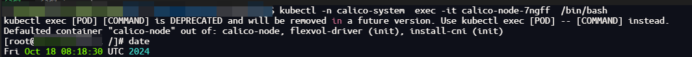

# 1. 备份
## 1.1 备份策略
- 通过Kubernetes启动Postgresql容器进行现有PG数据库全量备份
  - 每天凌晨2点定时全量备份
  - 删除30天以上备份数据
  - nodeSelector: 指定集群内一台服务器作为备份数据存放主机
  - hostPath: 主机上存放备份数据目录
  - namespace: 命名空间
```yaml
apiVersion: batch/v1
kind: CronJob
metadata:
  name: postgres-backup
  namespace: test
spec:
  schedule: "0 2 * * *" # 每天凌晨2点执行备份
  jobTemplate:
    spec:
      template:
        spec:
          containers:
          - name: postgres-backup
            image: postgres:14
            command:
            - /bin/sh
            - -c
            - set -eux;
              BACKUP_NAME=$(date +%Y%m%d%H%M%S)-backup.sql;
              BACKUP_DIR=/backup;
              PGPASSWORD=$POSTGRES_PASSWORD pg_dumpall -U $POSTGRES_USER -h $POSTGRES_HOST > $BACKUP_DIR/$BACKUP_NAME;
              chmod 777 $BACKUP_DIR;
              ls $BACKUP_DIR;
              find $BACKUP_DIR -type f -name "*.sql" -mtime +30 -exec rm {} \;; # 删除超过30天的.sql文件  
            env:
            - name: POSTGRES_HOST
              valueFrom:
                configMapKeyRef:
                  name: pg-cm
                  key: pg.host
            - name: POSTGRES_USER
              valueFrom:
                configMapKeyRef:
                  name: pg-cm
                  key: pg.username
            - name: POSTGRES_PASSWORD
              valueFrom:
                configMapKeyRef:
                  name: pg-cm
                  key:  pg.password
            volumeMounts:
            - name: backup-storage
              mountPath: /backup
          nodeSelector:
            key: pgbackup
          restartPolicy: OnFailure
          volumes:
          - name: backup-storage
            hostPath:
              path: /data/pg_backup
              type: DirectoryOrCreate
          - name: pg-cm
            configMap:
              name: pg-cm
          imagePullSecrets:
          - name: regcred
```

## 1.2 备份规划
### 1.2.1 集群
> 172.16.x.xx1~xx3
- 备份数据所在主机打上标签: node1
```bash
kubectl label nodes node1 key=pgbackup
```
- 备份数据所在主机创建目录：
```bash
mkdir -p /data/pg_backup
```
- 备份主机创建PG对应的configmap参数
  pg.host: postgres-service.test
  pg.password: test.2024
  pg.username: root
- 备份主机执行`1.1`的备份策略对应文件
```bash
kubectl create-f pg-backup.yaml
```

# 2. 恢复
- 将需要备份的备份文件传至待恢复的PG数据库所在容器内
  - 进入容器执行以下命令
  - 该命令为全量恢复数据库数据
```bash
psql -f 20241018031106-backup.sql postgres
```

# 3. 故障排查
## 3.1 定时任务不执行
- 调试时将定时任务的时间调成当前时间2分钟以后执行，发现到时间并不执行
- 调试时将定时任务的时间调成每分钟执行，发现到时间执行
- 因此，猜测是否跟时区有关系
### 3.1.1 查看k8s系统时间
- 进入k8s系统应用，查看时区
  - 发现是`UTC`时区
```bash
kubectl -n calico-system  exec -it calico-node-7ngff  /bin/bash

# 进入后，执行date
date
```

### 3.1.2 查看系统时区
- 登陆服务器，查看时区
  - 发现是`CST`时区
  

### 3.1.3 更正
- 方案一：将系统及K8S时区更正为`CST`时区
- 方案二：换算`CST`时区为`UTC`时区对应时间，进行测试及设置定时任务时间