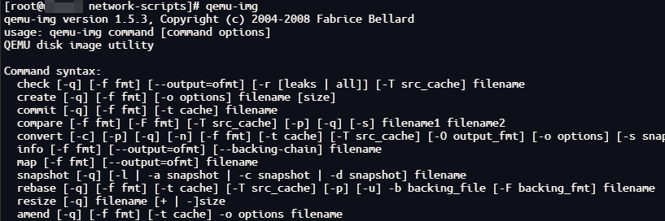
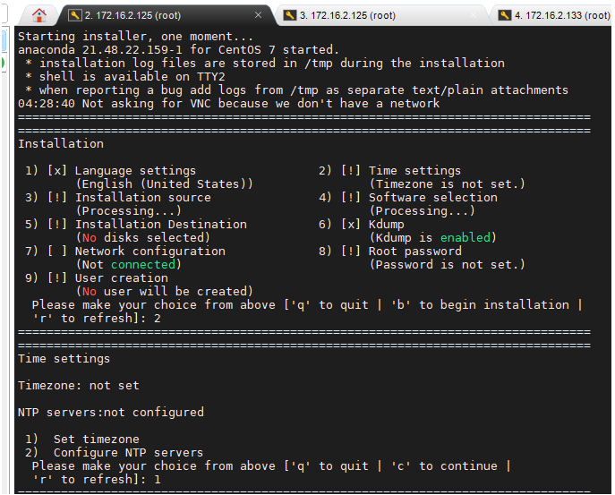
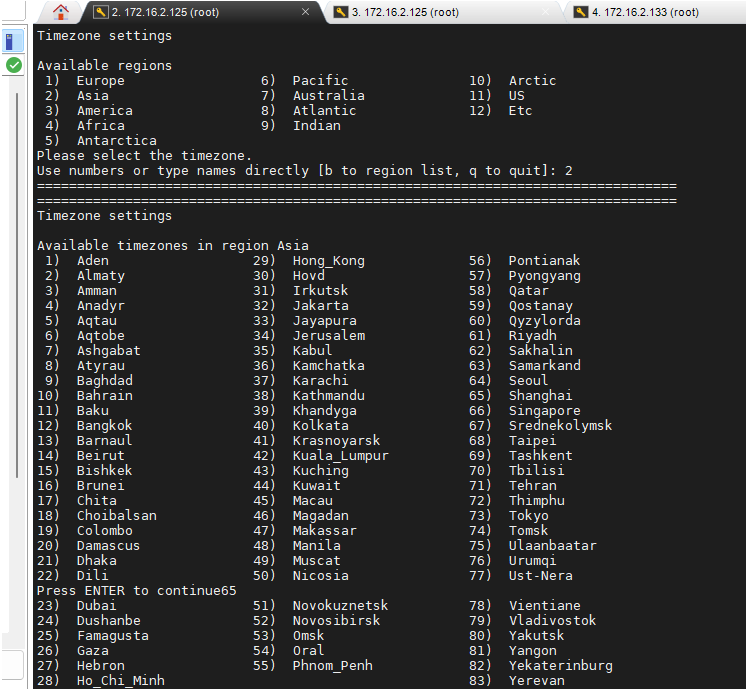
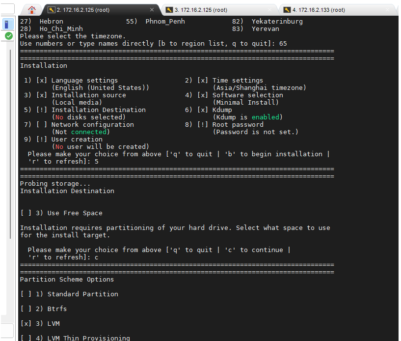
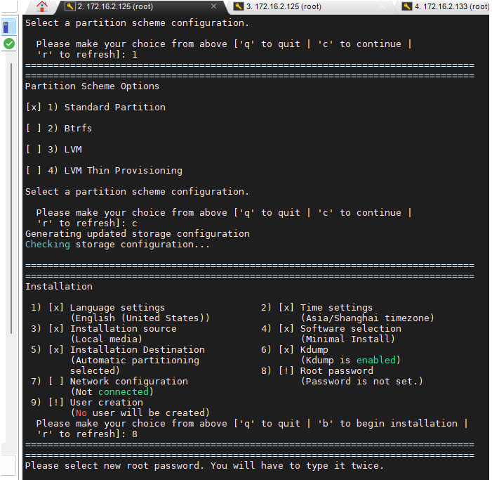
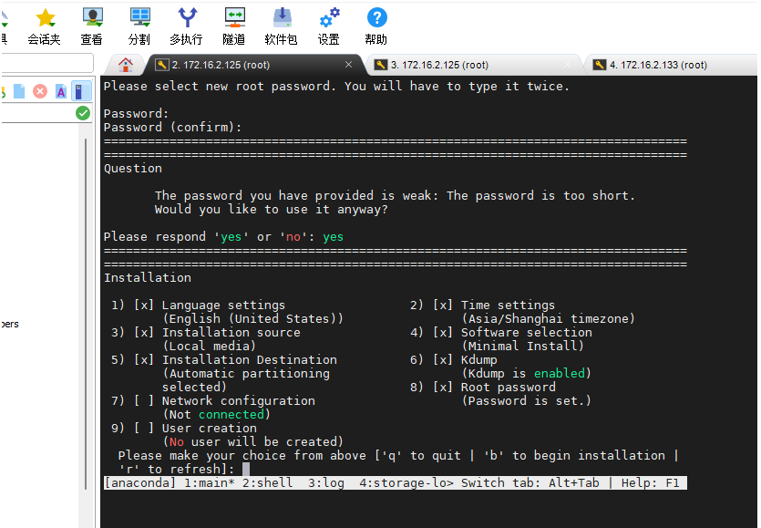

！！！仅供参考，如有数据丢失，网络损坏，概不负责

# 1. 安装KVM
## 1.1 安装kvm及初始化操作
- qemu-kvm: 
  - 提供对cpu，内存（KVM负责），IO设备（QEMU负责）的虚拟。[弥补 KVM 的缺陷. 同时提高 QEMU 虚拟出来的虚拟硬件设备性能]
  - 对各种虚拟设备的创建，调用进行管理（QEMU负责）
- libvirt: 
  - 由应用程序编程接口库、libvirtd 守护进程、virsh CLI 组成. 其中 libvirtd 守护进程负责调度管理虚拟机
- virt-install:
  - 一个命令行工具，能够为KVM、Xen或其它支持libvrit API的hypervisor创建虚拟机
```bash
systemctl stop firewalld

setenforce 0

yum -y install qemu-kvm libvirt virt-install
```
- 通过命令查看`qemu-img`是否安装成功，出现版本号等信息，说明成功


# 2. 安装虚拟机
## 2.1 创建虚拟机磁盘
- centos-01：对应虚拟机名称
```bash
qemu-img create -f qcow2 ./centos-01.qcow2 300G
```
## 2.2 创建虚拟机
- -r: 对应内存
- --vcpus：对应核数
- --disk：对应虚拟机硬盘位置
- centos-01：对应虚拟机名称
```bash
virt-install -n centos-01 -r 12288 --vcpus 4 --disk ./centos-01.qcow2 --location /home/data1/CentOS-7-x86_64-DVD-2009.iso --nographics --network bridge=br0 --network bridge=br0 --os-type linux --os-variant rhel7 --console pty,target_type=serial --extra-args 'console=ttyS0,115200n8 serial'
```

### 2.2.1 从已有硬盘启动（第一次创建，无需使用）
```
virt-install -n centos-01 -r 12288 --vcpus 4 --disk ./centos-01.qcow2  --nographics --network bridge=br0 --boot hd  --virt-type kvm --network bridge=br0 --noautoconsole --autostart
```
## 2.3 安装过程配置
### 2.3.1 设置时区
- 2->1->2->65




### 2.3.2 设置磁盘分区


### 21.3.3 设置密码


# 3. 配置网络
## 3.1 物理机配置kvm桥接网络（物理机上执行）
- 网卡状态查看(本状态为设置桥接网络后的状态，仅供参考)
  - ip addr
```bash
[root@work03 network-scripts]# ip addr
1: lo: <LOOPBACK,UP,LOWER_UP> mtu 65536 qdisc noqueue state UNKNOWN group default qlen 1000
    link/loopback 00:00:00:00:00:00 brd 00:00:00:00:00:00
    inet 127.0.0.1/8 scope host lo
       valid_lft forever preferred_lft forever
    inet6 ::1/128 scope host 
       valid_lft forever preferred_lft forever
2: em3: <BROADCAST,MULTICAST,UP,LOWER_UP> mtu 1500 qdisc mq master br0 state UP group default qlen 1000
    link/ether xx:xx:xx:xx:xx:xx brd ff:ff:ff:ff:ff:ff
3: em1: <BROADCAST,MULTICAST,UP,LOWER_UP> mtu 1500 qdisc mq state UP group default qlen 1000
    link/ether xx:xx:xx:xx:xx:xx brd ff:ff:ff:ff:ff:ff
    inet 192.168.1.xxx/24 brd 192.168.1.255 scope global noprefixroute em1
       valid_lft forever preferred_lft forever
    inet6 xx:xx:xx:xx:xx:xx/64 scope link noprefixroute 
       valid_lft forever preferred_lft forever
4: em4: <NO-CARRIER,BROADCAST,MULTICAST,UP> mtu 1500 qdisc mq state DOWN group default qlen 1000
    link/ether xx:xx:xx:xx:xx:xx brd ff:ff:ff:ff:ff:ff
5: em2: <BROADCAST,MULTICAST,UP,LOWER_UP> mtu 1500 qdisc mq state UP group default qlen 1000
    link/ether xx:xx:xx:xx:xx:xx brd ff:ff:ff:ff:ff:ff
    inet 192.168.1.xxx/24 brd 192.168.1.255 scope global noprefixroute em2
       valid_lft forever preferred_lft forever
    inet6 xx:xx:xx:xx:xx:xx/64 scope link noprefixroute 
       valid_lft forever preferred_lft forever
68: docker0: <NO-CARRIER,BROADCAST,MULTICAST,UP> mtu 1500 qdisc noqueue state DOWN group default 
    link/ether xx:xx:xx:xx:xx:xx brd ff:ff:ff:ff:ff:ff
    inet 172.17.0.1/16 brd 172.17.255.255 scope global docker0
       valid_lft forever preferred_lft forever
    inet6 xx:xx:xx:xx:xx:xx/64 scope link 
       valid_lft forever preferred_lft forever
69: docker_gwbridge: <NO-CARRIER,BROADCAST,MULTICAST,UP> mtu 1500 qdisc noqueue state DOWN group default 
    link/ether xx:xx:xx:xx:xx:xx brd ff:ff:ff:ff:ff:ff
    inet 172.18.0.1/16 brd 172.18.255.255 scope global docker_gwbridge
       valid_lft forever preferred_lft forever
70: br-602ee7d67674: <NO-CARRIER,BROADCAST,MULTICAST,UP> mtu 1500 qdisc noqueue state DOWN group default 
    link/ether xx:xx:xx:xx:xx:xx brd ff:ff:ff:ff:ff:ff
    inet 172.19.0.1/16 brd 172.19.255.255 scope global br-602ee7d67674
       valid_lft forever preferred_lft forever
111: br-26b5b5def7af: <NO-CARRIER,BROADCAST,MULTICAST,UP> mtu 1500 qdisc noqueue state DOWN group default 
    link/ether xx:xx:xx:xx:xx:xx brd ff:ff:ff:ff:ff:ff
    inet 172.20.0.1/16 brd 172.20.255.255 scope global br-26b5b5def7af
       valid_lft forever preferred_lft forever
    inet6 v/64 scope link 
       valid_lft forever preferred_lft forever
236: vnet2: <BROADCAST,MULTICAST,UP,LOWER_UP> mtu 1500 qdisc pfifo_fast master br0 state UNKNOWN group default qlen 1000
    link/ether xx:xx:xx:xx:xx:xx brd ff:ff:ff:ff:ff:ff
    inet6 xx:xx:xx:xx:xx:xx/64 scope link 
       valid_lft forever preferred_lft forever
237: vnet3: <BROADCAST,MULTICAST,UP,LOWER_UP> mtu 1500 qdisc pfifo_fast master br0 state UNKNOWN group default qlen 1000
    link/ether xx:xx:xx:xx:xx:xx brd ff:ff:ff:ff:ff:ff
    inet6 xx:xx:xx:xx:xx:xx/64 scope link 
       valid_lft forever preferred_lft forever
243: br0: <BROADCAST,MULTICAST,UP,LOWER_UP> mtu 1500 qdisc noqueue state UP group default qlen 1000
    link/ether xx:xx:xx:xx:xx:xx brd ff:ff:ff:ff:ff:ff
    inet 172.16.2.xxx/24 brd 172.16.2.255 scope global noprefixroute br0
       valid_lft forever preferred_lft forever
    inet6 xx:xx:xx:xx:xx:xx/64 scope link noprefixroute 
       valid_lft forever preferred_lft forever
244: virbr0: <NO-CARRIER,BROADCAST,MULTICAST,UP> mtu 1500 qdisc noqueue state DOWN group default qlen 1000
    link/ether 7a:30:df:c2:7e:aa brd ff:ff:ff:ff:ff:ff
```
### 3.1.1 配置桥接网络配置配件
- 桥接网络配置文件`ifcfg-br0`：以em3为模板复制并修改br0
```ini
STP=no
TYPE=Bridge
PROXY_METHOD=none
BROWSER_ONLY=no
BOOTPROTO=none
IPADDR=172.16.2.xxx
PREFIX=24
GATEWAY=172.16.2.1
DNS1=172.16.1.xxx
DNS2=114.114.114.114
DEFROUTE=yes
IPV4_FAILURE_FATAL=no
IPV6INIT=yes
IPV6_AUTOCONF=yes
IPV6_DEFROUTE=yes
IPV6_FAILURE_FATAL=no
IPV6_ADDR_GEN_MODE=stable-privacy
NAME=br0
DEVICE=br0
ONBOOT=yes
AUTOCONNECT_SLAVES=yes
```
- 被桥接的网卡`ifcfg-em3`
  - 加上`br0`
```ini
TYPE="Ethernet"
PROXY_METHOD="none"
BROWSER_ONLY="no"
BOOTPROTO="none"
DEFROUTE="yes"
IPV4_FAILURE_FATAL="no"
IPV6INIT="yes"
IPV6_AUTOCONF="yes"
IPV6_DEFROUTE="yes"
IPV6_FAILURE_FATAL="no"
IPV6_ADDR_GEN_MODE="stable-privacy"
NAME="em3"
UUID="e6bf6588-ab3c-4c68-a60e-fcf5bff22e6b"
DEVICE="em3"
BRIDGE=br0
```
### 3.1.2 刷新物理机网络
```bash
systemctl restart network
```

### 3.1.3 查看虚拟机网卡连接信息并修改
- 有的服务器是`vnet0`、`vnet1`
```bash
brctl show

virsh domiflist centos-01

#  vnet0上的网线从virbr0断开
brctl delif virbr0  vnet2 vnet3

brctl show

brctl addif br0 vnet2 vnet3

brctl show
```


## 3.2 虚拟机网络配置（虚拟机上执行）
### 3.2.1 虚拟机网卡配置
- vi /etc/sysconfig/network-scripts/ifcfg-eth0
```ini
TYPE=Ethernet
PROXY_METHOD=none
BROWSER_ONLY=no
BOOTPROTO=static
DEFROUTE=yes
IPV4_FAILURE_FATAL=no
IPV6INIT=yes
IPV6_AUTOCONF=yes
IPV6_DEFROUTE=yes
IPV6_FAILURE_FATAL=no
IPV6_ADDR_GEN_MODE=stable-privacy
NAME=eth0
UUID=33f89684-c087-4dd5-abba-2b74d652a394
DEVICE=eth0
ONBOOT=yes
IPADDR=172.16.2.228
PREFIX=24
GATEWAY=172.16.2.1
DNS1=114.114.114.114
```

### 3.2.2 重启网络服务
```bash
systemctl restart network
```

### 3.2.3 设置主机名
```bash
hostnamectl set-hostname centos-01
```

### 3.2.4 配置yum源
#### 3.2.4.1 华为源
- `/etc/yum.repos.d/CentOS-Base.repo`
  - 推荐：采用华为源
```ini
# CentOS-Base.repo
#
# The mirror system uses the connecting IP address of the client and the
# update status of each mirror to pick mirrors that are updated to and
# geographically close to the client.  You should use this for CentOS updates
# unless you are manually picking other mirrors.
#
# If the mirrorlist= does not work for you, as a fall back you can try the 
# remarked out baseurl= line instead.
#
#

[base]
name=CentOS-$releasever - Base - repo.huaweicloud.com
baseurl=https://repo.huaweicloud.com/centos/$releasever/os/$basearch/
#mirrorlist=https://mirrorlist.centos.org/?release=$releasever&arch=$basearch&repo=os
gpgcheck=1
gpgkey=https://repo.huaweicloud.com/centos/RPM-GPG-KEY-CentOS-7

#released updates 
[updates]
name=CentOS-$releasever - Updates - repo.huaweicloud.com
baseurl=https://repo.huaweicloud.com/centos/$releasever/updates/$basearch/
#mirrorlist=https://mirrorlist.centos.org/?release=$releasever&arch=$basearch&repo=updates
gpgcheck=1
gpgkey=https://repo.huaweicloud.com/centos/RPM-GPG-KEY-CentOS-7

#additional packages that may be useful
[extras]
name=CentOS-$releasever - Extras - repo.huaweicloud.com
baseurl=https://repo.huaweicloud.com/centos/$releasever/extras/$basearch/
#mirrorlist=https://mirrorlist.centos.org/?release=$releasever&arch=$basearch&repo=extras
gpgcheck=1
gpgkey=https://repo.huaweicloud.com/centos/RPM-GPG-KEY-CentOS-7

#additional packages that extend functionality of existing packages
[centosplus]
name=CentOS-$releasever - Plus - repo.huaweicloud.com
baseurl=https://repo.huaweicloud.com/centos/$releasever/centosplus/$basearch/
#mirrorlist=https://mirrorlist.centos.org/?release=$releasever&arch=$basearch&repo=centosplus
gpgcheck=1
enabled=0
gpgkey=https://repo.huaweicloud.com/centos/RPM-GPG-KEY-CentOS-7
```
- 更新
```bash
yum clean all
yum makecache
```

#### 3.2.4.2 网络下载源
- 备用
```bash
mv /etc/yum.repos.d/CentOS-Base.repo /etc/yum.repos.d/CentOS-Base.repo.bk
cd /etc/yum.repos.d

# 新虚拟机无get，需在别的服务器下好 传过来
wget -nc http://mirrors.aliyun.com/repo/Centos-7.repo

mv Centos-7.repo CentOS-Base.repo
yum clean all
yum list
yum makecache
```

### 3.2.5 关闭防火墙
```bash
systemctl stop firewalld.service
systemctl disable firewalld.service
```

# 4. 虚拟机磁盘自动挂载配置
```bash
# 格式化磁盘为ext4文件系统类型
mkfs.ext4   /dev/vdb

# 查看格式化后的磁盘uuid
blkid 

# 将磁盘uuid信息写入fstab文件开启开机自启
# UUID=a104ed6d-59c2-48b0-9303-00a3908a719a /data1                  ext4    defaults        0 0
vim /etc/fstab 

# 创建待挂载的目录
mkdir /data1

# 执行挂载命令
mount -a

# 查看挂载效果
df -h
```

# 5. 虚拟机克隆
```bash
virt-clone -o centos-01 -n centos-02 -f /home/xxx/kvmadmin/xxx/centos-02.qcow2  --auto-clone
```
克隆后的虚拟机，网卡配置
```bash
主要修改三个唯一标识符：UUID、IPADDR、HWADDR。

UUID 不能和虚拟机的原先的 UUID 一样，可以把最后一个数字改成其他数字；

IPADDR 也不能相同，一般在最后一个点后面的数字基础+1 变成新的 IP；

HWADDR 需要修改成重新生成的MAC地址，这个配置也可以不用写在网卡配置文件中，默认值就是VMware虚拟机设置中的MAC地址。
```

# 6. 虚拟机销毁
## 6.1 找到虚拟机对应的磁盘
```bash
virsh domblklist centos-01
```
## 6.2 删除虚拟机
```bash
# 停止虚拟机
virsh shutdown centos-01

# 取消域定义,如果该虚拟机有快照则需要先删除快照才能取消域定义
virsh undefine centos-01

# 删除快照命令
# 查看快照
virsh snapshot-list centos-01

# 删除快照, 如有则删
# virsh snapshot-delete CentOSES01213 1703005539

# 取消域定义之后改虚拟机的xml文件会删除，该文件在以下文件夹
/etc/libvirt/qemu
# 虚拟机的磁盘不会删除
```
## 6.3 删除虚拟机磁盘
- `6.1`中列出的待删除虚拟机所有磁盘
```bash
rm -rf /home/xxx/kvmadmin/xxx/centos-02.qcow1 
```