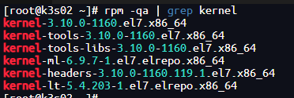

# 1. 参考网站
[centos7 离线升级/在线升级操作系统内核_centos7 red hat enterprise-CSDN博客](https://blog.csdn.net/yaxuan88521/article/details/129946104?spm=1001.2101.3001.6650.2&utm_medium=distribute.pc_relevant.none-task-blog-2%7Edefault%7ECTRLIST%7ERate-2-129946104-blog-136274022.235%5Ev43%5Econtrol&depth_1-utm_source=distribute.pc_relevant.none-task-blog-2%7Edefault%7ECTRLIST%7ERate-2-129946104-blog-136274022.235%5Ev43%5Econtrol&utm_relevant_index=5)

# 2. 内核下载网站
[http://mirrors.coreix.net/elrepo-archive-archive/kernel/el7/x86_64/RPMS/](http://mirrors.coreix.net/elrepo-archive-archive/kernel/el7/x86_64/RPMS/)

# 3. 配置rpm仓库及下载内核rpm包

-  内核包下载好，kernel-ml代表主线版本，总是保持主线最新的内核，kernel-lt代表长期支持版本，支持周期更长，如果你要追求最新的版本，直接选择带ml的rpm包即可，如果你要追求稳定且更长的支持周期，直接选择lt版本即可。  
```bash
rpm -Uvh http://mirrors.coreix.net/elrepo-archive-archive/kernel/el7/x86_64/RPMS/elrepo-release-7.0-8.el7.elrepo.noarch.rpm

# 6.9.7版本：http://mirrors.coreix.net/elrepo-archive-archive/kernel/el7/x86_64/RPMS/kernel-ml-6.9.7-1.el7.elrepo.x86_64.rpm
wget http://mirrors.coreix.net/elrepo-archive-archive/kernel/el7/x86_64/RPMS/kernel-lt-5.4.203-1.el7.elrepo.x86_64.rpm
```

# 4. 安装(Centos7系统)
```bash
rpm -ivh kernel-lt-5.4.203-1.el7.elrepo.x86_64.rpm
```

## 4.1 修改内核启动顺序

- 修改文件：/etc/default/grub
   - 使 GRUB_DEFAULT=0
```bash
GRUB_TIMEOUT=5
GRUB_DISTRIBUTOR="$(sed 's, release .*$,,g' /etc/system-release)"
# 改GRUB_DEFAULT=saved为0
GRUB_DEFAULT=0
GRUB_DISABLE_SUBMENU=true
GRUB_TERMINAL_OUTPUT="gfxterm"
GRUB_CMDLINE_LINUX="rhgb quiet nomodeset"
GRUB_DISABLE_RECOVERY="true"
```

-  设置默认启动内核，grub2-set-default 0和/etc/default/grub文件里的GRUB_DEFAULT=0意思一样  
```bash
grub2-set-default 0
```

- 查看所有内核
```bash
awk -F\' '$1=="menuentry " {print i++ " : " $2}' /boot/grub2/grub.cfg
```

- 重新生成grub配置文件
```bash
grub2-mkconfig -o /boot/grub2/grub.cfg
```

- 重启并查看内核板板
```bash
reboot

uname -r 
```

## 4.2 多余内核删除
在 CentOS 7 中删除多余内核的步骤通常如下：
>     在执行删除操作时务必小心，确保你不会误删当前正在使用的内核，否则可能导致系统无法正常启动。如果不确定哪些内核可以安全删除，建议仅删除明确标记为旧版本且确认未被当前系统使用的内核。


##  4.3 确认当前使用的内核版本
- 打开终端，输入以下命令来查看当前系统正在使用的内核版本：
```bash
uname -r
```

## 4.4 查询已安装的所有内核版本
- 使用 rpm 命令列出所有与内核相关的包：
```bash
rpm -qa | grep kernel
```
 这将列出包括当前正在使用的内核在内的所有内核版本。


## 4.5 确定要删除的内核
>   确保不要删除当前正在使用的内核版本。通常，安全的做法是至少保留一个或两个旧内核作为备用。
>     删除多余的内核
- 使用 yum 命令来删除不再需要的内核版本。例如，如果你要删除 kernel-3.10.0-1127.el7.x86_64 这个版本，可以运行：
```bash
 sudo yum remove kernel-ml-6.9.7-1.el7.elrepo.x86_64
```
 对于每个不需要的内核重复此步骤。

## 4.6 更新引导加载器配置
- 删除内核后，需要更新 GRUB 配置以反映这些更改：
```bash
sudo grub2-mkconfig -o /boot/grub2/grub.cfg
```

## 4.7 重启系统
-（可选）如果你确信没有删除正在使用的内核，并且所有操作都已完成，可以选择重启系统以应用更改
```bash
reboot
```


