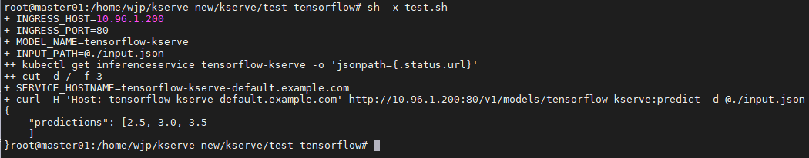
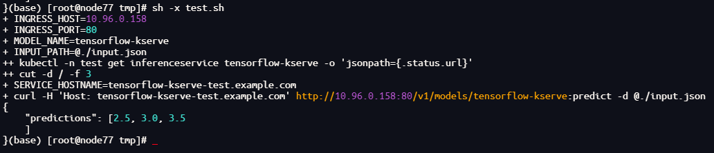

# 1. kserve-0.10.0版本安装
## 1.1 kserve与依赖版本对应
| K8s | v1.22.15 |
| --- | --- |
| [KServe](https://github.com/kserve/kserve/releases/download/v0.10.0/kserve.yaml/) | v0.10.0 |
| [Cert-manager]() | v1.11.0 |
| [Ingress-nginx](https://kubernetes.github.io/ingress-nginx/deploy/#quick-start)（[与k8s版本对应关系](https://github.com/kubernetes/ingress-nginx#supported-versions-table)） | v1.3.0 |
## 1.2 部署ingress-nginx
> 采用RawDeployment模式，因此不需要按照官网要求安装Istio（Istio较重）
- 通过管理Ingress，控制路由，因此部署 Ingress-Nginx 即可。
```bash
kubectl apply -f nginx-ingress-1.3.1.yml
```
## 1.3 部署CertManager 
```bash
kubectl apply -f https://github.com/cert-manager/cert-manager/releases/download/v1.11.0/cert-manager.yaml
```
## 1.4 部署Kserve
- 需修改kserve.yaml中`ingressClassName`为创建的`IngressClass`（本例为nginx）
```
ingress: |-
{
    "ingressClassName" : "nginx",
}
```
```bash
# 下载
wget https://github.com/kserve/kserve/releases/download/v0.10.0/kserve.yaml

# 修改以后部署
kubectl apply -f kserve.yaml

# 下载
wget https://github.com/kserve/kserve/releases/download/v0.10.0/kserve-runtimes.yaml

kubectl apply -f kserve-runtimes.yaml
```
- 修改`inferenceservice-config`部署模式为`RawDeployment`
```bash
kubectl patch configmap/inferenceservice-config -n kserve --type=strategic -p '{"data": {"deploy": "{\"defaultDeploymentMode\": \"RawDeployment\"}"}}'
```
## 1.5 测试
### 1.5.1 配置模型crd
- demo-tensorflow.yaml
   - name：tensorflow-kserve
   - storageUri：[http://172.16.2.132:9999/00000123.tar](http://172.16.2.132:9999/00000123.tar)（采用文件服务器形式提供模型文件tar包或zip包，服务会自动解压）
   - [模型下载链接，tags2 4](https://drive.filen.io/d/6a3895ad-5200-4af6-9574-5d6b60db9e67#CqoscfaWspU5Kta3VQrSlwZTgYYmm420)
```yaml
apiVersion: "serving.kserve.io/v1beta1"
kind: "InferenceService"
metadata:
  name: "tensorflow-kserve"
spec:
  predictor:
    tensorflow:
      storageUri: "http://172.16.2.132:9999/00000123.tar"
```
### 1.5.2 使用ingress测试
- INGRESS_HOST：10.96.1.200（Ingress-nginx地址）
- MODEL_NAME：`1.5.1`定义的name
- INPUT_PATH：模型入参
```bash
#!/bin/bash

# nginx ingress 的访问地址
INGRESS_HOST=10.96.1.200
INGRESS_PORT=80

MODEL_NAME=tensorflow-kserve
INPUT_PATH=@./input.json
SERVICE_HOSTNAME=$(kubectl get inferenceservice ${MODEL_NAME} -o jsonpath='{.status.url}' | cut -d "/" -f 3)

curl -H "Host: ${SERVICE_HOSTNAME}" http://${INGRESS_HOST}:${INGRESS_PORT}/v1/models/$MODEL_NAME:predict -d $INPUT_PATH
```
- input.json
```json
{
"instances":[1,2,3]
}
```
- 结果如下



# 2. kserve-0.13.0版本安装
## 2.1 kserve与依赖版本对应
| K8s | v1.29.7 |
| --- | --- |
| [KServe](https://github.com/kserve/kserve/releases/download/v0.13.0/) | v0.13.0 |
| [Cert-manager]() | v1.15.3 |
| [Ingress-nginx](https://kubernetes.github.io/ingress-nginx/deploy/#quick-start)（[与k8s版本对应关系](https://github.com/kubernetes/ingress-nginx#supported-versions-table)） | v1.11.2 |
## 2.2 部署ingress-nginx
> 采用RawDeployment模式，因此不需要按照官网要求安装Istio（Istio较重）
- 通过管理Ingress，控制路由，因此部署 Ingress-Nginx 即可。
- 本版本ingress-nginx采用helm安装
```bash
wget https://github.com/kubernetes/ingress-nginx/releases/download/helm-chart-4.11.2/ingress-nginx-4.11.2.tgz

tar -zxf ingress-nginx-4.11.2.tgz

helm install ingress-nginx ./ingress-nginx --namespace ingress-nginx --create-namespace
```
- 安装成功信息
```bash
(base) [root@node77 ingress-nginx]# kubectl get service --namespace ingress-nginx ingress-nginx-controller --output wide --watch
NAME                       TYPE           CLUSTER-IP    EXTERNAL-IP   PORT(S)                      AGE   SELECTOR
ingress-nginx-controller   LoadBalancer   10.96.1.190   <pending>     80:32702/TCP,443:32064/TCP   37s   app.kubernetes.io/component=controller,app.kubernetes.io/instance=ingress-nginx,app.kubernetes.io/name=ingress-nginx
```
## 2.3 部署 CertManager 
```bash
kubectl apply -f https://github.com/cert-manager/cert-manager/releases/download/v1.15.3/cert-manager.yaml
```
## 2.4 部署Kserve
- 需修改kserve.yaml中`ingressClassName`为创建的`IngressClass`（本例为nginx）
```
ingress: |-
{
    "ingressClassName" : "nginx",
}
```
- 需要注意的是在kserve v0.13.0版本中`kserve-runtimes.yaml`组件改名为`kserve-cluster-resources.yaml`
```bash
# 下载
wget https://github.com/kserve/kserve/releases/download/v0.13.0/kserve.yaml

# 修改以后部署
kubectl apply -f kserve.yaml

# 下载
wget https://github.com/kserve/kserve/releases/download/v0.13.0/kserve-cluster-resources.yaml

kubectl apply -f kserve-cluster-resources.yaml
```
- 修改`inferenceservice-config`部署模式为`RawDeployment`
```bash
kubectl patch configmap/inferenceservice-config -n kserve --type=strategic -p '{"data": {"deploy": "{\"defaultDeploymentMode\": \"RawDeployment\"}"}}'
```
## 2.5 测试
### 2.5.1 配置模型crd
- 创建namespace
```bash
kubectl create namespace test
```
- demo-tensorflow.yaml
   - ~~注意：在kserve v0.13.0版本中，模型发布需要发布在非default命名空间或是kserve具有权限的命名空间中，否则模型对应Pod会报错`No such file or directory: '/mnt/models'`，初步怀疑跟`2.3`部署的CertManager配置有关系，暂未深究~~
   - 注意：kserve创建的模型发布不能发布在kserve命名空间以及没有权限的命名空间中，否则模型对应Pod会报错`No such file or directory: '/mnt/models'`，这是kserve的webhook检查导致的，具体可以参考[这个issue](https://github.com/kserve/kserve/issues/3473)
   - name：tensorflow-kserve
   - storageUri：[http://172.16.2.132:9999/00000123.tar](http://172.16.2.132:9999/00000123.tar)（采用文件服务器形式提供模型文件tar包或zip包，服务会自动解压）
   - [模型下载链接，tags2 4](https://drive.filen.io/d/6a3895ad-5200-4af6-9574-5d6b60db9e67#CqoscfaWspU5Kta3VQrSlwZTgYYmm420)
```yaml
apiVersion: "serving.kserve.io/v1beta1"
kind: "InferenceService"
metadata:
  name: "tensorflow-kserve"
  namespace: "test"
spec:
  predictor:
    tensorflow:
      storageUri: "http://172.16.2.132:9999/00000123.tar"
```
### 2.5.2 使用ingress测试
- INGRESS_HOST：10.96.0.158（Ingress-nginx地址）
- MODEL_NAME：`2.5.1`定义的name
- INPUT_PATH：模型入参
```bash
#!/bin/bash

# nginx ingress 的访问地址
INGRESS_HOST=10.96.0.158
INGRESS_PORT=80

MODEL_NAME=tensorflow-kserve
INPUT_PATH=@./input.json
SERVICE_HOSTNAME=$(kubectl -n test get inferenceservice ${MODEL_NAME} -o jsonpath='{.status.url}' | cut -d "/" -f 3)

curl -H "Host: ${SERVICE_HOSTNAME}" http://${INGRESS_HOST}:${INGRESS_PORT}/v1/models/$MODEL_NAME:predict -d $INPUT_PATH
```
- input.json
```json
{
"instances":[1,2,3]
}
```
- 结果如下
