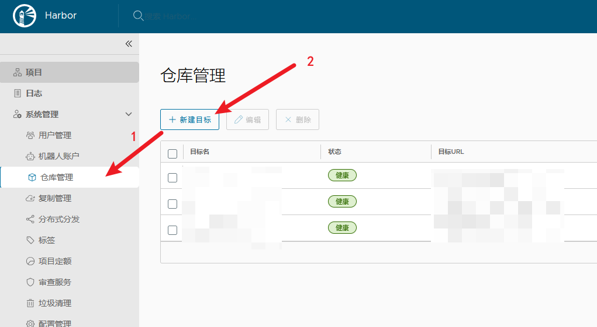
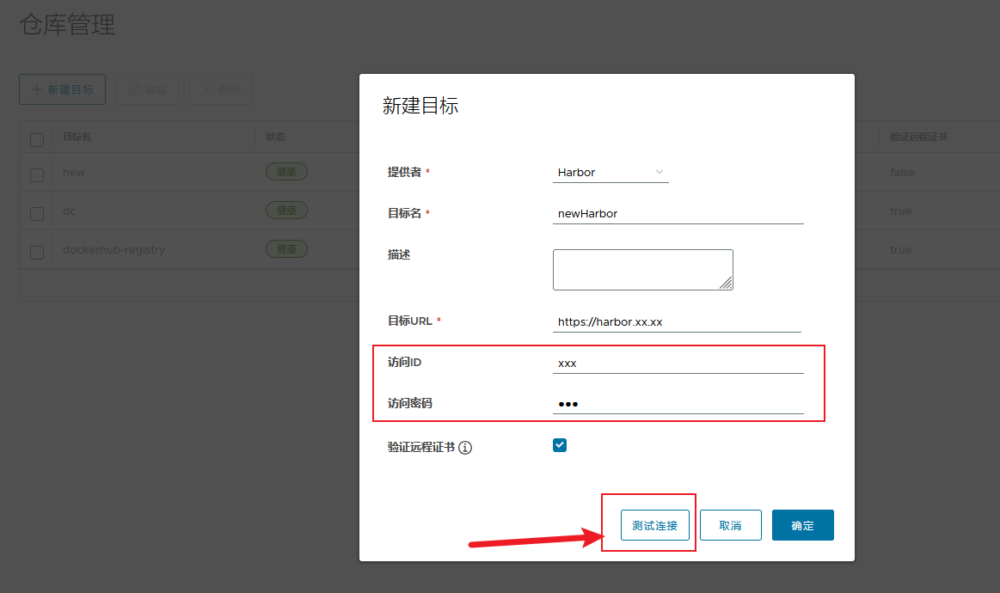
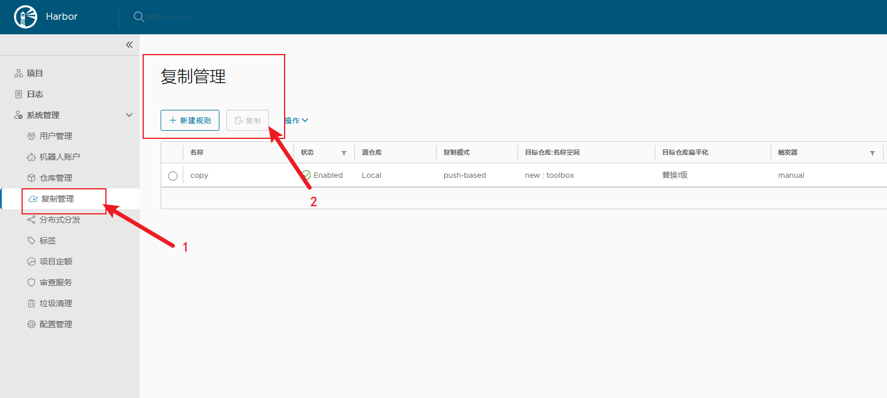
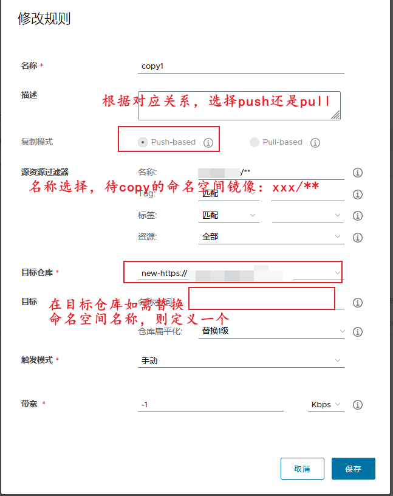
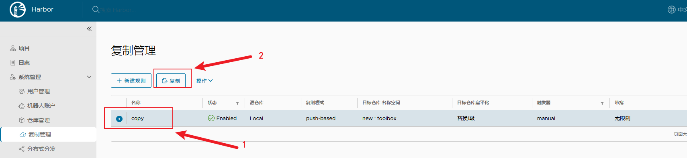
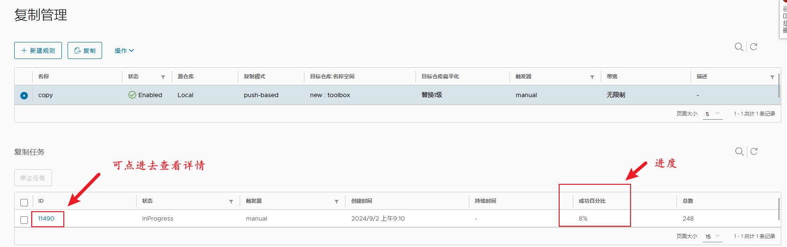

"无聊望见了犹豫, 达到理想不太易~"


# 1. 待迁移Harbor仓库配置
## 1.1 通过仓库管理添加新Harbor仓库关联

- 新建目标
  - 添加对应Harbor仓库信息
  - 添加具有创建空间权限的用户名、密码
  - 测试连接是否成功
  - 保存

## 1.2 通过复制管理添加待复制空间的规则

- 新建规则
  - 选择复制模式
  - 配置资源过滤器条件：不填，则默认复制全部镜像，可定义单个命名空间: xxx/**
  - 选择目标仓库（1.1中增加的仓库）
  - 选择触发模式（默认手动）

# 2. 开始迁移
- 选中复制管理里新建的规则，点击复制按钮开始复制

- 查看进度
