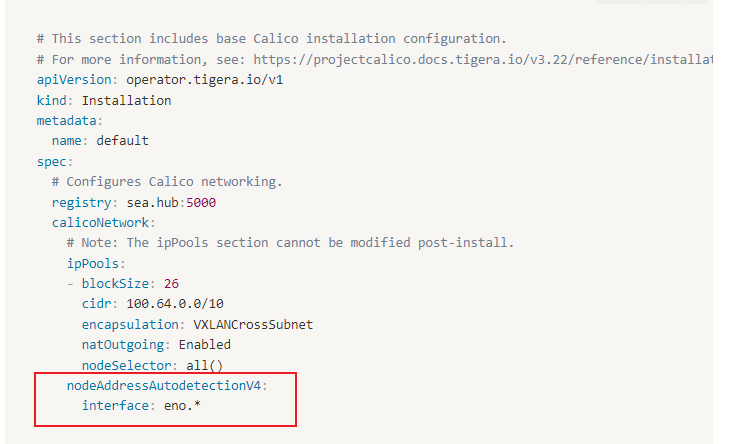

k8s网络问题解决记录

<!--more-->

# 1. **k8s(1):calico网络问题排查，IP_AUTODETECTION_METHOD**

引用： https://zhuanlan.zhihu.com/p/488034895?utm_id=0

- 问题描述：

4个节点的k8s集群，忽然有个节点上的pod无法访问其他节点的k8s域名了

- 排查
    - ①查看coredns服务状态，发现正常，排除内部dns解析问题
    - ②查看发现异常pod节点对应的[calico-node-rdw97](http://172.16.2.132:30880/clusters/mem/projects/calico-system/pods/calico-node-rdw97)服务异常，出现了非正常使用网卡信息
    - ③查看calico配置发现，网卡配置为P_AUTODETECTION_METHOD： first_found，这样很容易选错网卡
- 解决：查看并修改calico node的daemonset配置：(vim环境)

kubectl edit  DaemonSet calico-node  -n calico-system

发现: IP_AUTODETECTION_METHOD 这个[环境变量](https://zhida.zhihu.com/search?q=%E7%8E%AF%E5%A2%83%E5%8F%98%E9%87%8F)

的值是first_found，我的机器网上eth0并不是第一个，这样可能有问题。因此修改成 value: "interface=eth0" 并保存退出，居然没生效。

原因是：

该方法命令虽然可以执行，但是我这里ds么没有生效。k8s 1.22，通过operator生成的calico，不是calico.yaml，如果是calico.yaml，直接修改文件中的参数即可。（[calico-node报错Readiness
 probe failed: calico/node is not ready: BIRD is not ready: Error 
querying BIRD: unable to connect to BIRDv4 socket - Wghdr's Blog!](https://link.zhihu.com/?target=https%3A//wghdr.top/archives/97)）

- 解决2：

因此要用另一种方法来修改：

我的custom-resources.yaml 如下，加上红色部分：



- custom-resources.yaml
    - nodeAddressAutodetectionV4:
          interface: eno.*

```yaml

# This section includes base Calico installation configuration.
# For more information, see: https://projectcalico.docs.tigera.io/v3.22/reference/installation/api#operator.tigera.io/v1.Installation
apiVersion: operator.tigera.io/v1
kind: Installation
metadata:
  name: default
spec:
  # Configures Calico networking.
  registry: sea.hub:5000
  calicoNetwork:
    # Note: The ipPools section cannot be modified post-install.
    ipPools:
    - blockSize: 26
      cidr: 100.64.0.0/10
      encapsulation: VXLANCrossSubnet
      natOutgoing: Enabled
      nodeSelector: all()
    nodeAddressAutodetectionV4:
      interface: eno.*

---

# This section configures the Calico API server.
# For more information, see: https://projectcalico.docs.tigera.io/v3.22/reference/installation/api#operator.tigera.io/v1.APIServer
apiVersion: operator.tigera.io/v1
kind: APIServer
metadata:
  name: default
spec: {}
```

然后[重新执行](https://zhida.zhihu.com/search?q=%E9%87%8D%E6%96%B0%E6%89%A7%E8%A1%8C)： kubectl apply -f custom-resources.yaml
然后再：

```bash
kubectl set env ds/calico-node -n calico-system IP_AUTODETECTION_METHOD=interface=eno3
```

- 可能会出现的问题，[calico-apiserver-5787fcd448-s56vz](http://172.16.2.132:30880/clusters/mem/projects/calico-apiserver/pods/calico-apiserver-5787fcd448-s56vz)出现异常，并报ImageNameError,查找发现yaml中定义的ImageName不知为何少了一个/，添加后重启服务即可