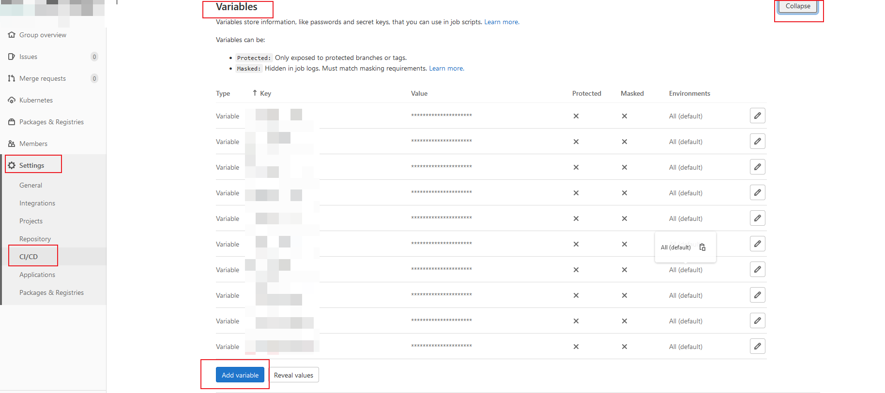

# 1. 前言
> 参考：[gitlab-runner学习资料大全](https://blog.csdn.net/github_35631540/category_10804590.html)

本方案CI采用的是gitlab-ci，通过启动gitlab-runner去构建实现，理论上可以构建任意形式的制品，包括且不限于镜像、前端静态文件压缩包等。

## 1.1 [K8s 部署 Gitlab CI Runner](https://www.cnblogs.com/lb477/p/15173133.html)
- K8s 版本：1.20.10
- GitLab CI 最大的作用是管理各个项目的构建状态。因此，运行构建任务这种浪费资源的事情交给一个独立的 Gitlab Runner 来做就会好很多，而且 Gitlab Runner 可以安装到不同的机器上
- 只要在项目中添加一个.gitlab-ci.yml文件，然后添加一个 Runner ，即可进行持续集成
- 官方文档：[Install GitLab Runner | GitLab](https://docs.gitlab.com/runner/install/)
## 1.2 介绍

- **Pipeline**：相当于一次构建任务，里面可以包含多个流程，如安装依赖、运行测试、编译、部署测试服务器、部署生产服务器等。任何提交或者 Merge Request 的合并都可以触发 Pipeline 构建
- **Stages**：表示一个构建阶段。一次 Pipeline 中可定义多个 Stages
   - 所有 Stages 会顺序运行，即当一个 Stage 完成后，下一个 Stage 才会开始
   - 只有当所有 Stages 完成后，该构建任务才会成功
   - 如果任何一个 Stage 失败，那么后面的 Stages 不会执行，该构建任务失败
- **Jobs**：表示构建工作，即某个 Stage 里面执行的工作。一个 Stage 中可定义多个 Jobs
   - 相同 Stage 中的 Jobs 会并行执行
   - 相同 Stage 中的 Jobs 都执行成功时，该 Stage 才会成功
   - 如果任何一个 Job 失败，那么该 Stage 失败，即该构建任务失败
- **Runner**：执行 Gitlab CI 构建任务


# 2. gitlab-ci缓存配置
本项目通过minio的s3接口为gitlab-ci提供诸如maven依赖等缓存
## 2.1 minio安装
minio的helm包下载
```bash
helm repo add bitnami https://charts.bitnami.com/bitnami
helm repo update
helm pull bitnami/minio
tar -xvf minio-14.7.5.tgz
```
minio配置修改
- values.yaml
```yaml
mode: distributed
......
auth:
  ## @param auth.rootUser MinIO&reg; root username
  ##
  rootUser: minio
  ## @param auth.rootPassword Password for MinIO&reg; root user
  ##
  rootPassword: "minio123"
......
  resourcesPreset: "2xlarge"
......
statefulset:
## @param statefulset.replicaCount Number of pods per zone (only for MinIO&reg; distributed mode). Should be even and `>= 4`
  ##
  replicaCount: 4
......
persistence:
  ## @param persistence.enabled Enable MinIO&reg; data persistence using PVC. If false, use emptyDir
  ##
  enabled: true
  ## @param persistence.storageClass PVC Storage Class for MinIO&reg; data volume
  ## If defined, storageClassName: <storageClass>
  ## If set to "-", storageClassName: "", which disables dynamic provisioning
  ## If undefined (the default) or set to null, no storageClassName spec is
  ##   set, choosing the default provisioner.  (gp2 on AWS, standard on
  ##   GKE, AWS & OpenStack)
  ##
  storageClass: ""
  ## @param persistence.mountPath Data volume mount path
  ##
  mountPath: /bitnami/minio/data
  ## @param persistence.accessModes PVC Access Modes for MinIO&reg; data volume
  ##
  accessModes:
    - ReadWriteMany
  ## @param persistence.size PVC Storage Request for MinIO&reg; data volume
  ##
  size: 30Gi
```
minio安装
- 命名空间指定：-n minio
```bash
#通过命令行设置密码不生效
#helm install -n minio minio bitnami/minio --set accessKey=minio,secretKey=minio123
helm install -n minio minio bitnami/minio -f ./values.yaml
```
## 2.2 minio数据迁移（如果之前配置过）
- minio客户端下载
```bash
wget https:// dl.minio.org.cn/client/mc/release/linux-amd64/mc && chmod -x mc && mv mc /usr/bin
```
- minio服务端别名设置
```
mc alias set minio1 http://172.16.2.xx1:3xxx1 minio minio123 
mc alias set minio2 http://172.16.2.xx2:3xxx2  minio minio123 
```
- 数据通过命令迁移（如果配置低的话，会导致失败）
```bash
mc mirror minio1/gitlabrb minio2/gitlabrb
```
- 数据下载后迁移（无视minio配置）,  因minio性能差，无法直接mc cp所有项目到minio仓库中，因此采用bash脚本逐个子项目上传
  - 拷贝源minio仓库到本地：mc cp --recursive minio1/gitlabrb ./
  - 拷贝本地仓库到minio仓库：mc cp $i  minio2/gitlabrb/gitlabruner/project  --recursive
  - --recursive：递归cp目录
  - list中为原minio上`gitlabrb/gitlabruner/project`下的子目录
```bash
#!/bin/bash

list=(1040 1196 1197 1198 1199 1205 1222 1239 1271 1272 1273 1274 1279 1294 1304 1311 1314 1326 1334 1335 1336 1338 1342 1357 1360 1460 1476 1483 275 357 361 362 368 370 374 
375  376 377 378 379  381  382 383 406 407)

for i in ${list[@]};do
 mc cp $i  minio2/gitlabrb/gitlabruner/project  --recursive
 sleep 5
done
```
# 3. gitlab-runner安装
- gitlab-runner.yaml
  - gitlab地址：CI_SERVER_URL
  - runner并发数：RUNNER_REQUEST_CONCURRENCY
  - minio-bucket地址：CACHE_PATH
  - minio地址：CACHE_S3_SERVER_ADDRESS
  - 允许http的minio服务：CACHE_S3_INSECURE: "true"
  - gitlab-group的密钥，需经过base64处理(`echo xxxxxxs | base64 -w0`)：GITLAB_CI_TOKEN
    - http://gitlab.south.com/admin/runners -> xxxs
```yaml
apiVersion: v1
kind: ServiceAccount
metadata:
  name: gitlab-ci
  namespace: gitlab
---
kind: Role
apiVersion: rbac.authorization.k8s.io/v1
metadata:
  name: gitlab-ci
  namespace: gitlab
rules:
  - apiGroups: [""]
    resources: ["*"]
    verbs: ["*"]
---
kind: RoleBinding
apiVersion: rbac.authorization.k8s.io/v1
metadata:
  name: gitlab-ci
  namespace: gitlab
subjects:
  - kind: ServiceAccount
    name: gitlab-ci
    namespace: gitlab
roleRef:
  kind: Role
  name: gitlab-ci
  apiGroup: rbac.authorization.k8s.io

---
apiVersion: v1
kind: ConfigMap
metadata:
  labels:
    app: gitlab-ci-runner
  name: gitlab-ci-runner-cm
  namespace: gitlab
data:
  REGISTER_NON_INTERACTIVE: "true"
  REGISTER_LOCKED: "false"
  METRICS_SERVER: "0.0.0.0:9100"
  CI_SERVER_URL: "https://git.xxx.cn"  # *
  RUNNER_REQUEST_CONCURRENCY: "6"
  RUNNER_EXECUTOR: "kubernetes"
  KUBERNETES_NAMESPACE: "gitlab"  # *
  KUBERNETES_PRIVILEGED: "true"
  KUBERNETES_CPU_LIMIT: "2"
  KUBERNETES_MEMORY_LIMIT: "10Gi"
  KUBERNETES_MEMORY_REQUEST: "8Gi"
  KUBERNETES_SERVICE_CPU_LIMIT: "1"
  KUBERNETES_SERVICE_CPU_REQUEST: "1"
  KUBERNETES_SERVICE_MEMORY_LIMIT: "10Gi"
  KUBERNETES_SERVICE_MEMORY_REQUEST: "8Gi"
  KUBERNETES_HELPER_CPU_LIMIT: "1000m"
  KUBERNETES_HELPER_CPU_REQUEST: "500m"
  KUBERNETES_HELPER_MEMORY_LIMIT: "3000Mi"
  KUBERNETES_HELPER_MEMORY_REQUEST: "2000Mi"
  KUBERNETES_PULL_POLICY: "if-not-present"
  KUBERNETES_TERMINATIONGRACEPERIODSECONDS: "10"
  KUBERNETES_POLL_INTERVAL: "5"
  KUBERNETES_POLL_TIMEOUT: "360"
  CACHE_TYPE: "s3"
  CACHE_PATH: "gitlabruner"
  CACHE_SHARED: "true"
  CACHE_S3_SERVER_ADDRESS: "10.96.1.175:9000"
  CACHE_S3_ACCESS_KEY: "minio"
  CACHE_S3_SECRET_KEY: "minio123"
  CACHE_S3_BUCKET_NAME: "gitlabrb"
  CACHE_S3_INSECURE: "true"
---
apiVersion: v1
kind: Secret
metadata:
  name: gitlab-ci-token
  namespace: gitlab
  labels:
    app: gitlab-ci-runner
data:
  GITLAB_CI_TOKEN:  xxxxaXZjxxxxxxhUV25txxxx  # echo xxxxf4SxxxT7fqxHSxxxx | base64 -w0
---
apiVersion: v1
kind: ConfigMap
metadata:
  labels:
    app: gitlab-ci-runner
  name: gitlab-ci-runner-scripts
  namespace: gitlab
data:
  run.sh: |
    #!/bin/bash
    unregister() {
        kill %1
        echo "Unregistering runner ${RUNNER_NAME} ..."
        /usr/bin/gitlab-ci-multi-runner unregister -t "$(/usr/bin/gitlab-ci-multi-runner list 2>&1 | tail -n1 | awk '{print $4}' | cut -d'=' -f2)" -n ${RUNNER_NAME}
        exit $?
    }
    trap 'unregister' EXIT HUP INT QUIT PIPE TERM
    echo "Registering runner ${RUNNER_NAME} ..."
    /usr/bin/gitlab-ci-multi-runner register -r ${GITLAB_CI_TOKEN} --tls-ca-file /opt/gitlab-runner/certs/gitlab.crt
    #/usr/bin/gitlab-ci-multi-runner register -r ${GITLAB_CI_TOKEN} --tls-ca-file /opt/gitlab-runner/certs/gitlab.crt  --docker-volumes "/var/run/docker.sock:/var/run/docker.sock" --docker-volumes "/usr/bin/docker:/usr/bin/docker" 
    sed -i 's/^concurrent.*/concurrent = '"${RUNNER_REQUEST_CONCURRENCY}"'/' /home/gitlab-runner/.gitlab-runner/config.toml
    echo "Starting runner ${RUNNER_NAME} ..."
    /usr/bin/gitlab-ci-multi-runner run -n ${RUNNER_NAME} &
    wait

---
apiVersion: apps/v1
kind: StatefulSet
metadata:
  name: gitlab-ci-runner
  namespace: gitlab
  labels:
    app: gitlab-ci-runner
spec:
  updateStrategy:
    type: RollingUpdate
  replicas: 6
  serviceName: gitlab-ci-runner
  selector:
    matchLabels:
      app: gitlab-ci-runner
  template:
    metadata:
      labels:
        app: gitlab-ci-runner
    spec:
      volumes:
      - name: mypvc
        hostPath:
          path: /data/gitlab-runner/certs
      - name: gitlab-ci-runner-scripts
        projected:
          sources:
          - configMap:
              name: gitlab-ci-runner-scripts
              items:
              - key: run.sh
                path: run.sh
                mode: 0755
      serviceAccountName: gitlab-ci
      securityContext:
        runAsNonRoot: true
        runAsUser: 999
        supplementalGroups: [999]
      containers:
      - image: xxx/gitlab-runner:latest
        name: gitlab-ci-runner
        command:
        - /scripts/run.sh
        envFrom:
        - configMapRef:
            name: gitlab-ci-runner-cm
        - secretRef:
            name: gitlab-ci-token
        env:
        - name: RUNNER_NAME
          valueFrom:
            fieldRef:
              fieldPath: metadata.name
        ports:
        - containerPort: 9100
          name: http-metrics
          protocol: TCP
        #securityContext:
          #runAsUser: 0
        #securityContext: {}
        volumeMounts:
        - name: gitlab-ci-runner-scripts
          mountPath: "/scripts"
          readOnly: true
        - name: mypvc
          mountPath: /opt/gitlab-runner/certs
        #- name: gitlab-runner-pv
          #mountPath: /opt/cache
        #- name: docker-sock
          #mountPath: /var/run/docker.sock
          #readOnly: true
        #- name: docker-use
          #mountPath: /usr/bin/docker
          #readOnly: true
      restartPolicy: Always
```
# 4. ci使用
- 在git项目中配置gitlab-ci.yml
- 提交git项目,自动触发
## 4.1 gitlab-ci中环境变量设置
- 通过管理员账号设置`Variables`后，ci运行时可获得对应变量值

## 4.2 maven项目配置缓存
- 缓存目录: .m2/*
  - maven仓库缓存配置(maven镜像中设置了repository为当前路径下的.m2/repository):  .m2/repository
  - maven工程产生的结果zip文件缓存配置: .m2/xxx-server-1.0.0-SNAPSHOT.zip
```yaml
image: nnntln/3.6.1-jdk-8:latest

variables:
   MAVEN_OPTS: -Dmaven.repo.local=/cache/maven.repository
cache:
   key: PortalReportBackend
   paths:
     - .m2/repository

stages:
  - build
  - execute

build:
  stage: build
  cache:
    key: PortalReportBackend
    paths:
      - .m2
  script: /usr/lib/jvm/java-8-openjdk-amd64/bin/javac Hello.java
  artifacts:
    paths:
     - Hello.*

execute:
  stage: execute
  script: /usr/lib/jvm/java-8-openjdk-amd64/bin/java Hello
```
## 4.3 node项目配置缓存
```
cache:
  key: 项目名
  paths:
    - $(pwd)/.yarn-cache
    - node_modules/

install:
  image: node:latest
  stage: Install
  script:
    - echo  'nameserver 223.5.5.5'>>/etc/resolv.conf
    - yarn config set registry 'https://registry.npm.taobao.org'
    - yarn config set sass_binary_site "https://npm.taobao.org/mirrors/node-sass/"
    - yarn config set phantomjs_cdnurl "http://cnpmjs.org/downloads"
    - yarn config set electron_mirror "https://npm.taobao.org/mirrors/electron/"
    - yarn config set sqlite3_binary_host_mirror "https://foxgis.oss-cn-shanghai.aliyuncs.com/"
    - yarn config set profiler_binary_host_mirror "https://npm.taobao.org/mirrors/node-inspector/"
    - yarn config set chromedriver_cdnurl "https://cdn.npm.taobao.org/dist/chromedriver"
    - yarn config set cache-folder $(pwd)/.yarn-cache
```

# 5. gitlab-ci报错排查
## 5.1 Job's log exceeded limit of 4194304 bytes
- 该问题是因为gitlab runner默认日志大小为4096 kB，修改第3步gitlab-runner.yaml配置
  - 新增默认配置：`RUNNER_OUTPUT_LIMIT`, 该配置不设置时默认为`4096`，对应到配置文件`/home/gitlab-runner/.gitlab-runner/config.toml`中为`[[runners]]`下的output_limit配置
```yaml
......
---
apiVersion: v1
kind: ConfigMap
metadata:
  labels:
    app: gitlab-ci-runner
  name: gitlab-ci-runner-cm
  namespace: gitlab
data:
  REGISTER_NON_INTERACTIVE: "true"
  REGISTER_LOCKED: "false"
  METRICS_SERVER: "0.0.0.0:9100"
  CI_SERVER_URL: "https://git.jshcbd.com.cn"  # *
#  CI_REPOSITORY_URL: "http://172.16.2.120:10081/wjp/test4c.git"  # *
 # CI_PROJECT_URL: "http://172.16.2.120:10081/wjp/test4c"  # *
  RUNNER_REQUEST_CONCURRENCY: "4"
  RUNNER_EXECUTOR: "kubernetes"
  RUNNER_OUTPUT_LIMIT: "8192"
......
```
- 对应的`/home/gitlab-runner/.gitlab-runner/config.toml`配置
```toml
......
[[runners]]
  name = "gitlab-ci-runner-0"
  output_limit = 8192
  request_concurrency = 4
  url = "https://git.jshcbd.com.cn"
  id = 834
  token = "sPoYY9fe1Xp7zcozVKHs"
  token_obtained_at = 2024-09-14T07:42:21Z
  token_expires_at = 0001-01-01T00:00:00Z
  tls-ca-file = "/opt/gitlab-runner/certs/gitlab.crt"
  executor = "kubernetes"
  [runners.custom_build_dir]
......
```
- 修改配置后，重装gitlab-runner
```bash
k delete -f gitlab-runner.yaml

k apply -f gitlab-runner.yaml
```