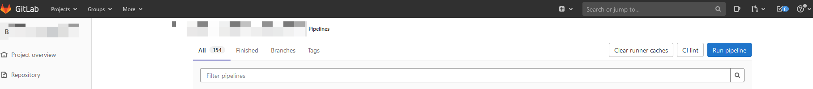

# 1.自动化构建
- 通过在需要自动化的步骤，指定rules对应commit分支即可，自动触发该步骤
```yaml
stages:
  - build_docker

build_docker:
  stage: build_docker
  image:
    name: ${KANIKO_IMAGE}
  script: |
    echo "自动化构建"
  rules:
  - if: '$CI_COMMIT_REF_NAME == "master"'
```


# 2. 半自动化构建(参考友人方案）
- 设定好需要执行的commit分支以及触发半自动化构建的变量及值
  - 该变量`RUN_PIPELINE`初始化值为`false`
```yaml
variables:
  RUN_PIPELINE: 'false'

stages:
  - build_docker

build_docker:
  stage: build_docker
  image:
    name: ${KANIKO_IMAGE}
  script: |
    echo "自动化构建"
  rules:
  - if: '$CI_COMMIT_REF_NAME == "dev" && $RUN_PIPELINE == "true"'
```
- 在项目根目录下创建`git-push-ci.sh`文件
```bash
#!/bin/bash

# 检查当前分支是否为 dev
current_branch=$(git rev-parse --abbrev-ref HEAD)
if [ "$current_branch" != "dev" ]; then
    echo "Error: This script should only be run on the dev branch."
    exit 1
fi

# 设置 CI 变量并推送
git push origin dev -o ci.variable="RUN_PIPELINE=true"

echo "Pushed to dev branch with pipeline trigger."
```

- 在全局用户git配置末尾添加
  - windows默认路径：C:\Users\Administrator\\.gitconfig
```conf
[alias]
  push-ci = "!sh ./git-push-ci.sh"
```
- 提交代码时，使用`git push-ci`代替`git push`，即可触发CICD流程

# 3. 手动构建
- 通过在需要手动执行的步骤，指定rules对应参数
```yaml
stages:
  - build_docker

build_docker:
  stage: build_docker
  image:
    name: ${KANIKO_IMAGE}
  script: |
    echo "手动构建"
  rules:
  - if: '$EXECUTE_MODE == "manual"' 
```
- 在gitlab界面，手动点`Run pipeline`按钮进去

- 选择需要执行的分支，输入上一步定义变量及值

- 即可手动执行CICD流程