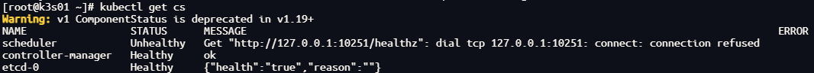
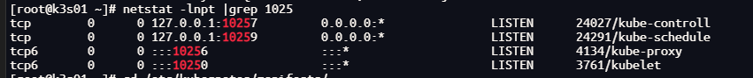
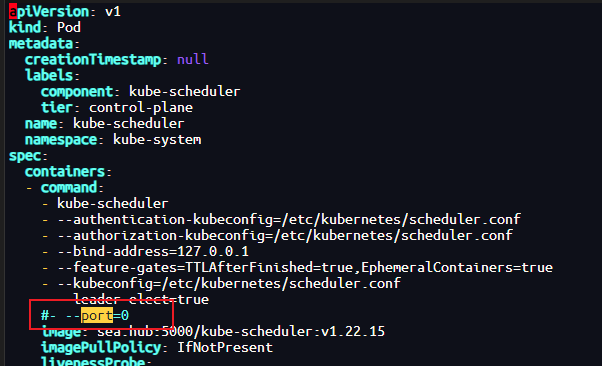
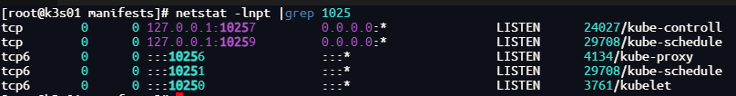
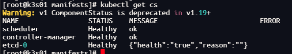
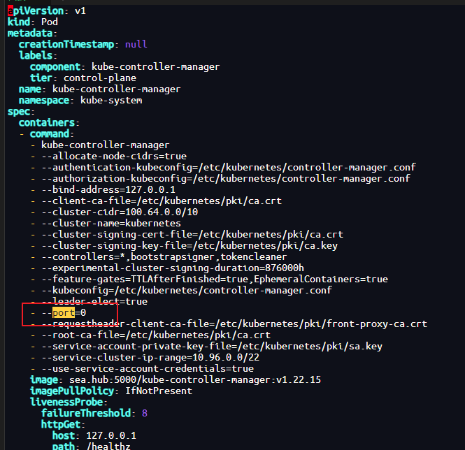

本文解决了k8s健康检查时提示unhealthy的问题。

<!--more-->

# 1.kubectl get cs组件状态异常
- 报错信息提示10251端口拒绝连接
```bash
Get "http://127.0.0.1:10251/healthz": dial tcp 127.0.0.1:10251: connect: connection refused
```


# 2. 查看端口状态
- 服务确实未启动
```bash
netstat -lnpt |grep 1025
```


# 3. 修改kube-scheduler.yaml,注释port=0
查看scheduler配置文件是否禁用非安全端口。文件路径在/etc/kubernetes/manifests
```bash
cd /etc/kubernetes/manifests
vim kube-scheduler.yaml
```


# 4. 再次检查端口及服务
- 一切正常
```bash
netstat -lnpt |grep 1025
```

```bash
kubectl get cs
```


# 5.其它情况
因为本次仅遇到了scheduler的unhealthy的问题，所以仅修改了一个文件，根据经验之谈，如果contoller也是unhealthy的情况
## 5.1 contoller也是unhealthy解决方案
其它步骤同上，文件需要修改，注释port=0
- /etc/kubernetes/manifests/


## 5.2 重启服务
本文操作时并未重启服务，修改文件即可，如修改文件不生效，可手动重启服务
```bash
systemctl restart kubelet.service
```