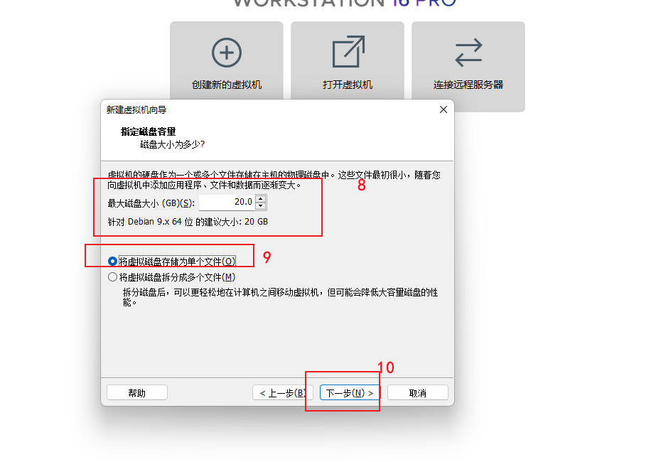
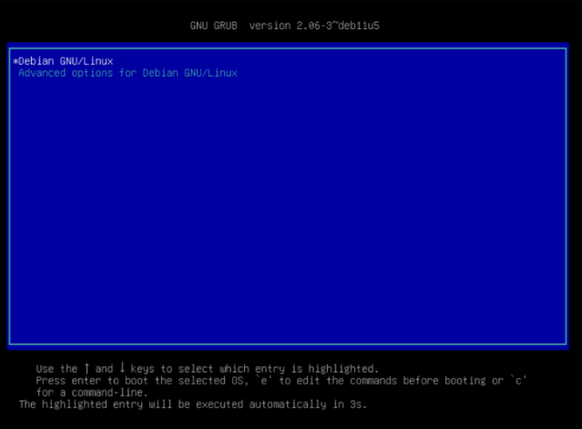

# 0. 前言
飞牛云推出的飞牛云nas操作系统，FnOS基于最新 Linux 内核（Debian 发行版）深度开发，兼容主流 x86 硬件，自由组装 NAS，灵活扩展外部存储
[飞牛云官网](https://www.fnnas.com/download?key=fnos)

# 1. 安装步骤
本文通过vmware虚拟机进行FnOS的安装操作，主打体验
## 1.1 创建虚拟机
- 点击vmware主页创建新的虚拟机

- 选择稍后安装操作系统

- 选择Linux操作系统
  - 选择Debian 9.x（FnOS基于此开发）

- 选择虚拟机所在目录

- 给虚拟机分配存储空间

- 给虚拟机分配内存、cpu等资源

- 设置合适的内存、cpu大小

- 给虚拟机选择操作系统镜像

- 选择提前下载好的`trim.iso`镜像文件

- 点击开启此虚拟机，进行虚拟机的安装操作

- 选择分配好的虚拟硬盘

- 设置系统分区大小，根据硬盘富裕程度分配

- 格式化该虚拟硬盘

- 等待安装

- 安装完成

- 等待几秒自动进入系统

- 弹出系统终端界面，安装成功
  - 然后可以将vmware虚拟机最小化了，接下来操作都将在浏览器完成
  - 根据终端给出给出的Web UI地址（默认端口是8000）去浏览器访问

# 2. 使用步骤
## 2.1 第一次登陆
- 浏览器输入第一步安装完成后给出的WebUI地址
  - 第一次登陆，设置用户名/密码
  - 此步骤设置的用户名密码即为FnOS底层debian系统的管理员用户与密码

## 2.2 第二次登陆
- 浏览器输入第一步安装完成后给出的WebUI地址
  - 输入设置好的用户名/密码

## 2.3 享受国产Nas吧