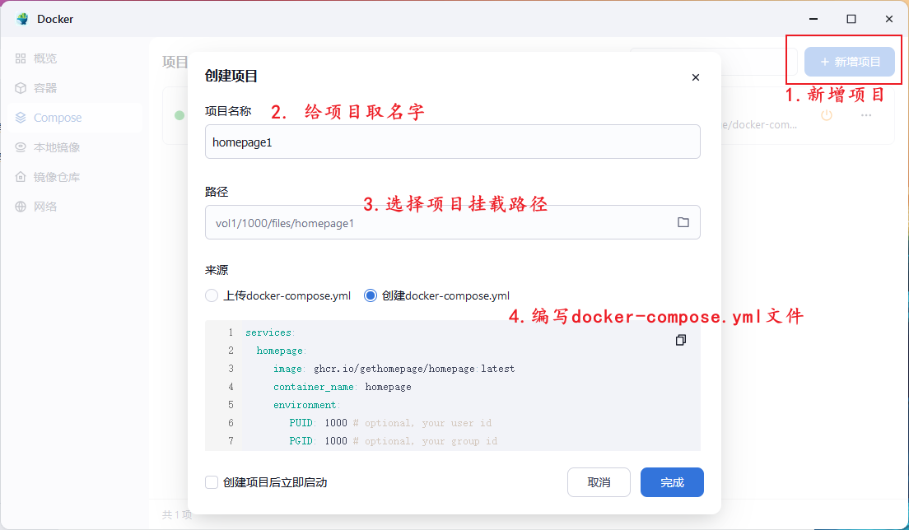
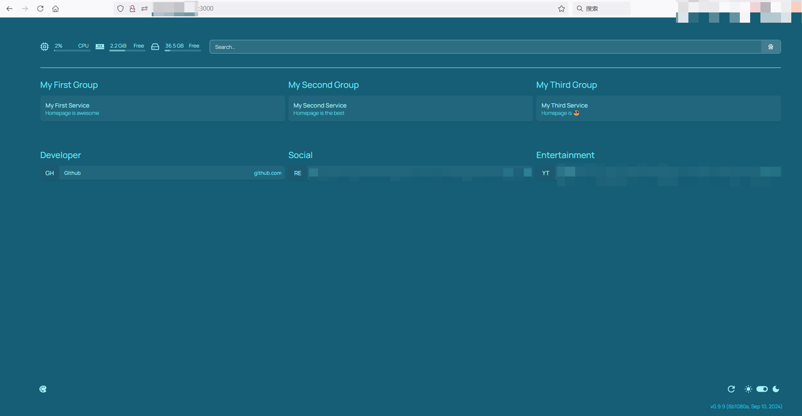
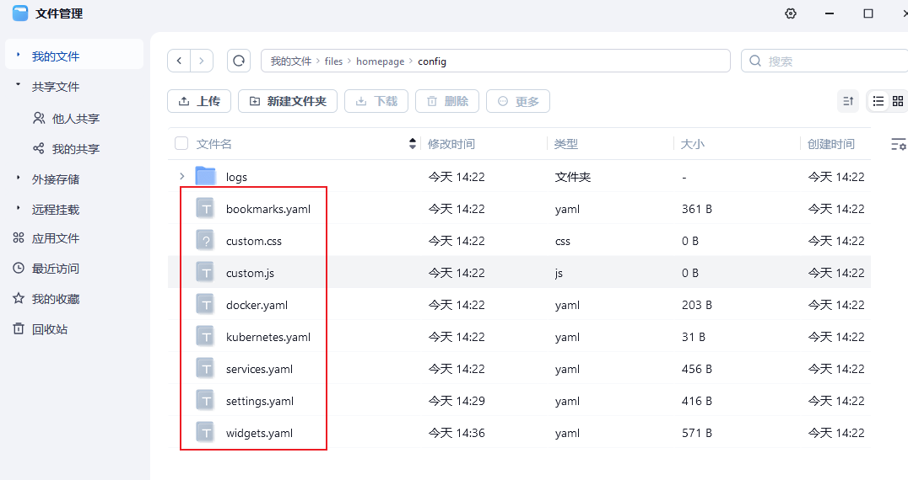
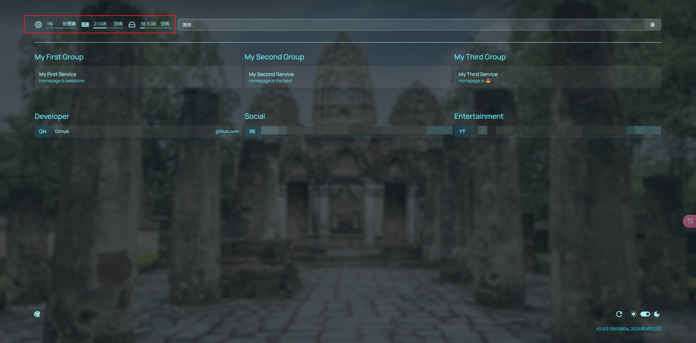
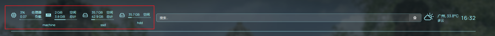
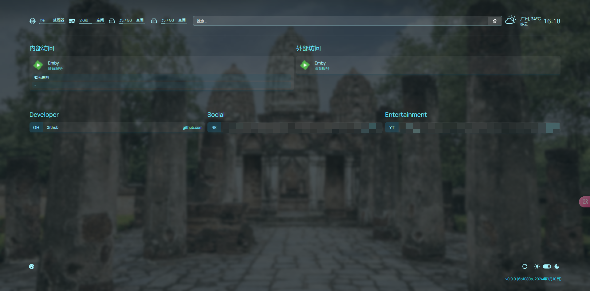
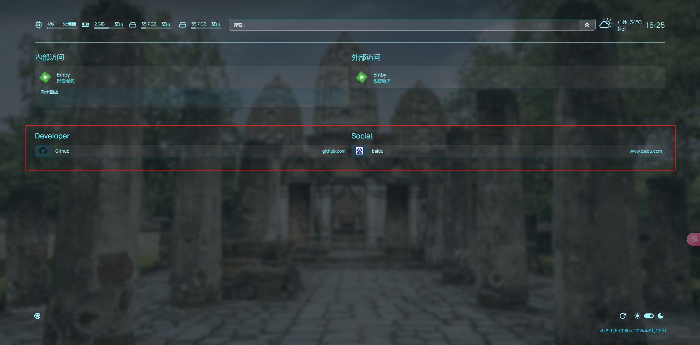

# 1. 介绍
> [homepage](https://gethomepage.dev/latest): 一个现代、完全静态、快速、安全、完全代理、高度可定制的应用程序仪表板，集成了100多 种服务和多种语言的翻译。通过YAML文件或docker标签发现轻松配置。
## 1.1 特征
Homepage具有快速搜索、书签、天气支持、广泛的集成和小部件、优雅现代的设计以及对性能的关注等功能，是您一天的理想开始，也是整个一天的便捷伴侣。
- Fast（快速）-站点在构建时静态生成，以便立即加载。
- 安全-对后端服务的所有API请求都是代理的，从而隐藏您的API密钥。社区不断审查安全性。
- 面向所有人-为 AMD64、ARM64、ARMv7 和 ARMv6 构建的映像。
- 完整的i18n-支持 40 多种语言。
- 服务和网络书签-在主页上添加自定义链接。
- Docker集成-容器状态和统计信息。通过标签自动发现服务。
- 服务集成-超过 100 种服务集成，包括流行的 starr 和自托管应用程序。
- 信息和实用工具小部件-天气、时间、日期、搜索等。
- 还有更多...

# 2. 飞牛云（FnOS）NAS部署homepage
项目地址：https://github.com/gethomepage/homepage?tab=readme-ov-file
## 2.1 创建Docker项目

## 2.2 编写docker-compose.yml
- 从github上copydocker-compose.yml内容到Docker编辑器内
  - 修改volumes内容，将容器内配置`/app/config`的路径映射到创建项目时创建的路径`/vol1/1000/files/homepage1`
```yml
services:
  homepage:
    image: ghcr.io/gethomepage/homepage:latest
    container_name: homepage
    environment:
      PUID: 1000 # optional, your user id
      PGID: 1000 # optional, your group id
    ports:
      - 3000:3000
    volumes:
      - /vol1/1000/files/homepage1:/app/config # Make sure your local config directory exists
      - /var/run/docker.sock:/var/run/docker.sock:ro # optional, for docker integrations
    restart: unless-stopped
```
## 2.3 启动homepage项目

## 2.4 查看效果
- 输入nas-ip:3000,查看部署后效果


# 3. homepage配置优化
- 所有配置都在`2.2`配置的路径下面：
  - 修改对应yaml文件后，刷新浏览器更改实时生效

## 3.1 settings.yaml配置更改（整体配置）
> 更多配置请参考：https://gethomepage.dev/latest/configs/settings
- 更改语言
  - language: zh-CN
- 更改网站标题
  - title: test's HomePage
- 更改网站背景图
  - image: xxx(找一些图片api接口)
```yaml
---
# For configuration options and examples, please see:
# https://gethomepage.dev/latest/configs/settings

providers:
  openweathermap: openweathermapapikey
  weatherapi: weatherapiapikey

language: zh-CN
title: test's HomePage

background:
  image: https://www.bing.com/th?id=OHR.WatSriSawai_ZH-CN7688908090_1920x1080.jpg&rf=LaDigue_1920x1080.jpg&pid=hp
  blur: sm
  saturate: 50
  brightness: 50
  opacity: 50
```
- 效果

## 3.2 widgets.yaml配置更改(顶部导航栏)
> 导航栏的组件显示内容，可以根据个人爱好，调整yaml中的先后顺序即可。
> 
> 更多配置请参考：https://gethomepage.dev/latest/configs/service-widgets
- label: 对资源进行标签分组展示
- 展示详细信息：`expanded: true`
- 全部硬盘容量显示设置
  - 将主机硬盘对应根目录映射到容器的`/diskx`路径下：/mnt/dev1:/disk1
  - 设置容量对应关系，有几块盘就设置几个：disk: /disk1
- 设置默认搜索引擎为`百度`
- openmeteo: 设置天气组件，根据[Open-Meteo](https://open-meteo.com/en/docs)获取经纬度
- 设置时间显示
```yaml
---
# For configuration options and examples, please see:
# https://gethomepage.dev/latest/configs/service-widgets

- resources:
    label: machine
    expanded: true
    cpu: true
    memory: true

- resources:
    label: ssd
    expanded: true
    disk: /

- resources:
    label: hdd
    disk: /disk1

- search:
    provider: baidu
    focus: true
    target: _blank

- openmeteo:    
    label: 广州 # optional    
    latitude: 23.18
    longitude: 113.37
    timezone: Asia/Shanghai # optional    
    units: metric # or imperial    
    cache: 5 # Time in minutes to cache API responses, to stay within limits

- datetime:    
    text_size: xl    
    format:      
      timeStyle: short
```
- 效果


## 3.3 services.yaml配置更改（服务配置）
> 更多配置请参考：https://gethomepage.dev/latest/configs/services
- 本次配置修改对应如下图内容

- 可以根据使用场景进行应用分组，这里分成了内部访问和外部访问
- 内部访问中，可以设置emby的key，则直接可以在界面查看当前emby浏览记录
- 外部访问中，不设置widget，仅展示入口
```yaml
---
# For configuration options and examples, please see:
# https://gethomepage.dev/latest/configs/services

- 内部访问:
  - Emby:
      icon: https://emby.media/favicon-16x16.png
      href: http://xxxx:xx
      description: 影音服务
      widget:
        type: emby
        url: http://xxx:xxx
        key: xxx

- 外部访问:
  - Emby:
      icon: https://emby.media/favicon-16x16.png
      href: http://xxxx:xx
      description: 影音服务
```
- 效果


## 3.4 bookmarkss.yaml配置更改（底部配置）
> 更多配置请参考：https://gethomepage.dev/latest/configs/bookmarks
- 根据个人喜好，设定常用书签，可以是外部网站，也可以是自定义服务
```yaml
---
# For configuration options and examples, please see:
# https://gethomepage.dev/latest/configs/bookmarks

- Developer:
    - Github:
      - icon: https://github.com/favicon.ico
        href: https://github.com/

- Social:
    - baidu:
        - icon: https://www.baidu.com/favicon.ico
          href: https://www.baidu.com
```
