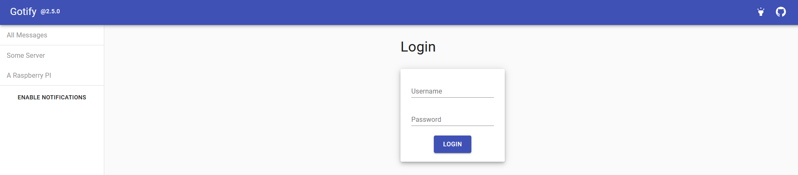
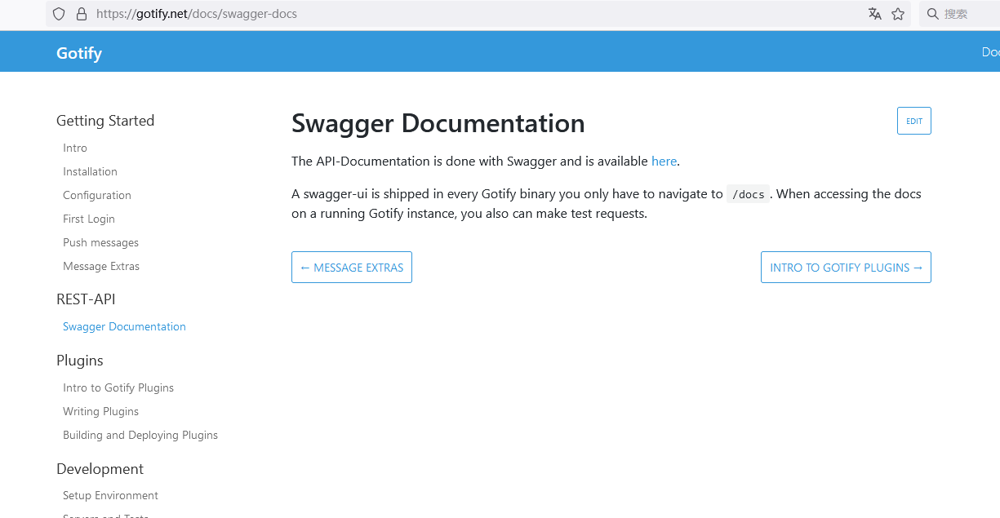

# 1. 介绍
> [gotify](https://github.com/gotify/server): Gotify是一个极简的免费开源消息推送服务器。
## 1.1 特征
Gotify基于Websocket协议，可以轻松集成到任何具有HTTP客户端能力的平台上，如Web应用、移动应用或物联网设备。它的主要特点包括：
- 轻量级：由于其简单的架构和小体积，Gotify在资源有限的环境中也能运行良好。
- 可扩展：通过插件系统可以方便地增加新功能，满足各种定制需求。
- 跨平台：支持多种操作系统，包括Linux、macOS、Windows以及Android等。
- 易部署：提供一键安装脚本和Docker镜像，支持快速部署到本地或云端。

Gotify作为一个消息推送服务器，提供了以下核心功能：
- 实时消息推送：通过Websocket协议实现实时消息推送，确保用户能够及时收到通知。
- 多平台支持：提供Web服务端、Android客户端以及命令行工具，方便用户在不同平台上使用。
- 用户管理：支持创建和管理用户账户，可以设置不同用户的权限和通知偏好。
- 应用管理：允许用户创建多个应用，用于区分不同来源或类型的消息推送。
- 消息历史记录：保存消息历史记录，方便用户随时查看和回顾。

Gotify的用途非常广泛，包括但不限于：
- 开发工具：开发人员可以将Gotify作为构建/测试通知的服务，当代码构建成功或失败时，自动发送消息到开发者的手机或电脑。
- 服务器监控：与Prometheus、Grafana等监控工具配合，Gotify可以在出现性能问题或警报时立即通知运维人员。
- 物联网应用：实时推送设备状态更新或警告信息，提高响应速度。
- 个人任务管理：创建自己的提醒服务，如待办事项、日程提醒等。
- 企业通讯：小型团队可以用它构建内部的通知系统，替代传统邮件或IM。

# 2. 安装
## 2.1 docker-compose配置文件
- docker-compose.yml
```yaml
version: '3.9'
services:
  gotify:
    image: gotify/server:latest
    container_name: Gotify
    ports:
      - 8999:80    # 冒号前面端口不冲突即可
    restart: unless-stopped  # 设置为 unless-stopped，表示除非手动停止，否则会自动重启
    volumes:
      - /home/projects/gotify/gotify-data:/app/data:rw    # 冒号前面映射gotify文件夹路径
    environment:
      GOTIFY_DEFAULTUSER_NAME: admin    # 管理员账号
      GOTIFY_DEFAULTUSER_PASS: admin    # 管理员密码
      TZ: Asia/Shanghai
```
## 2.2 启动命令
```bash
docker-compose -f docker-compose.yml up -d
```


## 2.3 使用文档
- swagger-docs
  - 在域名后+/docs

