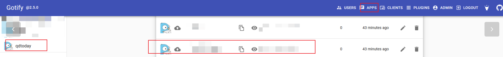
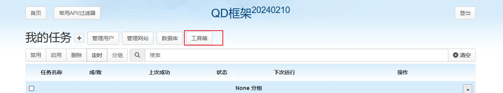
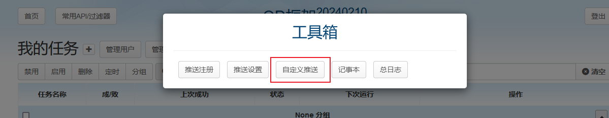
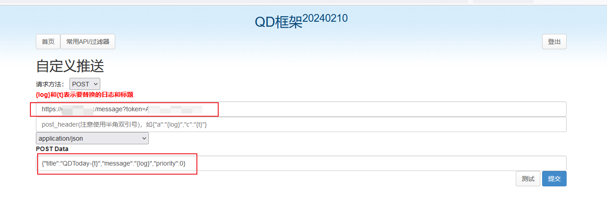
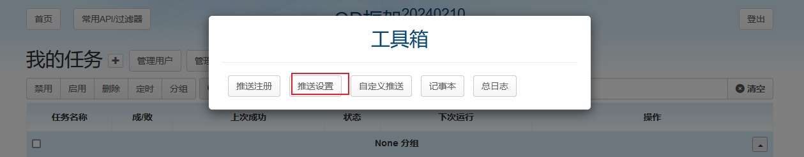
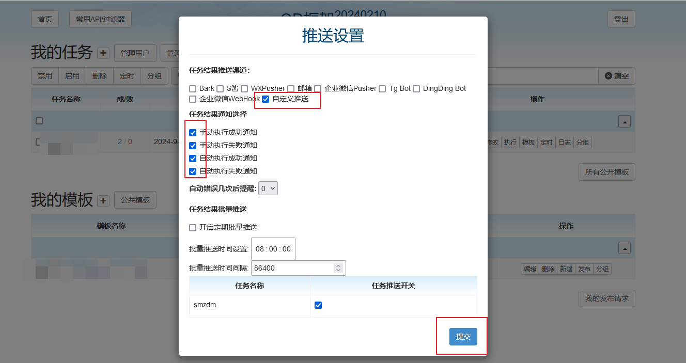

> QD [v20240210] —— HTTP请求定时任务自动执行框架 base on HAR Editor and Tornado Server 

# 1. qd-today部署
- docker-compose.yaml
```yaml
services:
  qd:
    image: qdtoday/qd:latest
    container_name: qd
    ports:
      - "8923:80"
    volumes:
      - /data/docker-files/qdtoday-files/qd:/usr/src/app/config
```
- 登陆后输入`Email 地址`和`密码`，点击`注册`按钮进入面板
- 初次`注册账号`后没有完整管理员权限，需先登出后再登陆即可获取完整权限

# 2. gotify中创建qdtoday应用
在[QD框架](https://github.com/qd-today/qd)中配置gotify通知.
- 在gotify页面的`APPS`下面创建qdtoday应用
  - 记录对应的`token`备用


# 3. qdtoday中创建自定义通知推送
## 3.1 创建自定义推送
- `工具箱` -> `自定义推送`


- 配置gotify的地址以及token
  - `t`：标题
  - `log`：通知内容

```bash
# POST Url
https://gotify.xxx.xxx/message?token=xxxxxxx

# Post Data
{"title":"QDToday-{t}","message":"{log}","priority":0}
```

## 3.2 开启自定义推送
- `工具箱` -> `推送设置`

- 勾选自定义推送以及任务结果通知


