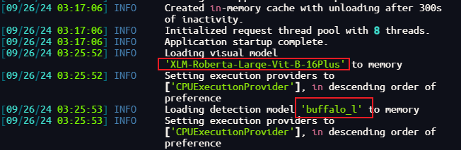

# 1. 配置国内镜像站下载huggingface
> [镜像站: https://hf-mirror.com/](https://hf-mirror.com/)
> 
> hf-mirror.com用于镜像huggingface.co。作为一个公益项目，致力于帮助国内AI开发者快速、稳定的下载模型、数据集。

## 1.1 镜像站命令行下载工具：hfd
hfd是`padeoe`开发的[(]huggingface专用下载工具](https://gist.github.com/padeoe/697678ab8e528b85a2a7bddafea1fa4f)，基于成熟工具`git+aria2`，可以做到稳定下载不断线。
### 1.1.1 准备工作
```bash
# 管理员用户通过ssh连接到FnOS服务器
# 安装
sudo apt install git-lfs
```

### 1.1.2 hfd下载
```bash
wget https://hf-mirror.com/hfd/hfd.sh && chmod a+x hfd.sh
```

### 1.1.3 设置镜像源环境变量
- ~/.bashrc
```bashrc
export HF_ENDPOINT=https://hf-mirror.com
```

### 1.1.4 immich模型下载
- 智能搜索模型：`immich-app/XLM-Roberta-Large-Vit-B-16Plus`
```bash
./hfd.sh immich-app/XLM-Roberta-Large-Vit-B-16Plus --tool aria2c -x 4
```
- 人脸识别模型：`immich-app/buffalo_l`
```bash
./hfd.sh immich-app/buffalo_l --tool aria2c -x 4
```

### 1.1.5 数据集下载(immich不需要，仅提供给需要的人)
- 数据集：wikitext
```bash
./hfd.sh wikitext --dataset --tool aria2c -x 4
```

### 1.1.6 针对需要登陆的模型下载方案
需先前往Hugging Face官网登录、申请许可，在官网获取[Access Token](https://huggingface.co/settings/tokens)后回镜像站用命令行下载。
```bash
hfd meta-llama/Llama-2-7b --hf_username YOUR_HF_USERNAME --hf_token hf_***
```

# 2. 替换immich模型
## 2.1 将模型移动至immich-machine-learning容器映射的模型目录
- 如果网络条件允许，则可跳过本步骤，直接进行2.2，会自动下载模型
```bash
# 创建智能搜索模型目录
mkdir /vol1/docker/volumes/immich_model-cache/_data/clip

# 创建人脸识别模型目录
mkdir /vol1/docker/volumes/immich_model-cache/_data/facial-recognition

# 移动智能搜索模型到clip目录下
cp -r XLM-Roberta-Large-Vit-B-16Plus /vol1/docker/volumes/immich_model-cache/_data/clip

# 移动人脸识别模型到facial-recognition目录下
cp -r buffalo_l /vol1/docker/volumes/immich_model-cache/_data/facial-recognition
```

## 2.2 immich模型替换
- 打开管理界面

- 打开机器学习设置

- 修改模型为指定模型并保存：`XLM-Roberta-Large-Vit-B-16Plus`
  - 人脸识别模型为默认`buffalo_l`，则不用修改

- 重跑智能搜索任务
  - 重跑人脸识别任务

- 查看`immich-machine-learning`容器日志
  - 如果未出现下图日志，可重启模型后，运行智能搜索任务查看对应日志
```bash
sudo docker logs -f immich_machine_learning
```


# 3. 关于模型下载的另外方案
- 全局替换`immich-machine-learning`容器中Python包`huggingface_hub`中的地址
  - `huggingface.co` -> `hf-mirror.com`
- 容器中`huggingface_hub`路径
  - /opt/venv/lib/python3.11/site-packages/huggingface_hub

- 替换完成后保存容器为镜像，通过新镜像重新启动`immich-machine-learning`容器
