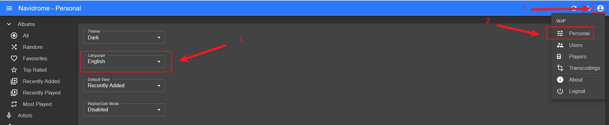
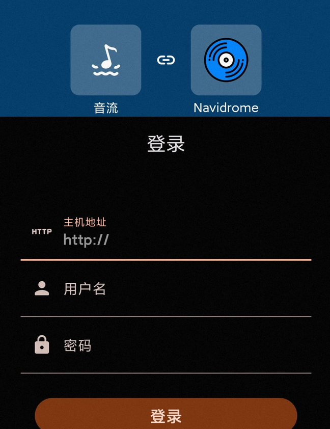

因为FnOS未自带音乐软件，因此通过音乐库`Navidrome` + 客户端`音流`的组合提供音乐服务

# 1. 安装音乐库软件Navidrome
- 通过Docker安装
  - 需提前创建好/vol1/1000/navidrome目录
```yaml
version: "3"
services:
  navidrome:
    image: deluan/navidrome:latest
    ports:
      - "4533:4533"
    restart: unless-stopped
    environment:
      ND_SCANSCHEDULE: 1h
      ND_LOGLEVEL: info
      ND_SESSIONTIMEOUT: 24h
      ND_BASEURL: ""
    volumes:
      - "/vol1/1000/navidrome/data:/data"
      - "/vol1/1000/navidrome/Music:/music:ro"
```
## 1.1 更改语言为中文
- 登陆地址：`192.xx.xx.xx:4533`
- 登陆后按图所示，将语言切换为`简体中文`

## 1.2 导入音乐
- 将提前准备好的音乐及歌词，导入到`Navidrome`映射到FnOS物理目录的路径`/vol1/1000/navidrome/Music`
## 1.3 扫描音乐
- 通过`Navidrome`界面扫描按钮，手动扫描目录下音乐


# 2. 安装客户端音流
- 下载地址：(音流)[https://music.aqzscn.cn/docs/versions/latest/]
  - 安卓手机版本：Arm64
## 2.1 配置音乐库源
- 主页选择音乐库源为: `Navidrome`
  - 填写外网可以访问的`Navidrome`地址
  - 填写用户名/密码


尽情享受吧~