因为FnOS目前备份功能较为简陋，因此通过网盘挂载神器`alist` + 同步软件`taosync`的组合提供加密备份功能

# 1. alist操作
> [alist](https://github.com/alist-org/docs)是一个支持多种存储，支持网页浏览和 WebDAV 的文件列表程序，由 gin 和 Solidjs 驱动。

- 通过Docker安装
  - 需提前创建好/vol1/1000/taosync_alist目录
  - 将Nas本地需要备份的文件夹挂载进来，本文备份: `/vol1/1000/navidrome/Music`
```yaml
version: "3"
services:
  alist:
    image: xhofe/alist:latest
    container_name: alist
    restart: always
    ports:
      - 5244:5244   # http端口，左侧端口为主机映射端口
      # - 5245:5245   # https端口，左侧端口为主机映射端口，如有https需求可打开注释
    volumes:
      - /vol1/1000/taosync_alist/alist/data:/opt/alist/data
      - /vol1/1000/navidrome/Music:/Music
```
## 1.1 通过日志查看默认密码
- 安装完成并启动后，通过日志查看自动生成默认密码，登陆界面后通过`个人资料`模块修改默认密码
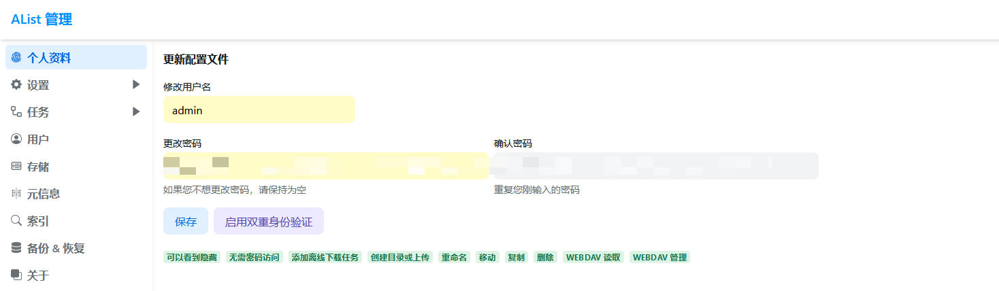

## 1.2 挂载网盘
本文挂载了`阿里云盘open`，具体挂载方法参考[alist官网](https://alist.nn.ci/zh/guide/drivers)
- 设置网盘在alist显示路径
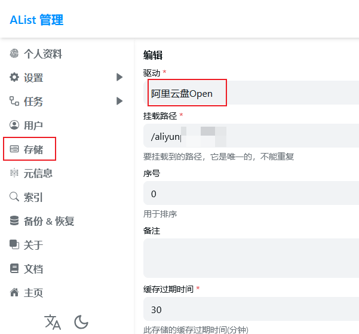
- 设置网盘本身挂载路径，本文为`root`
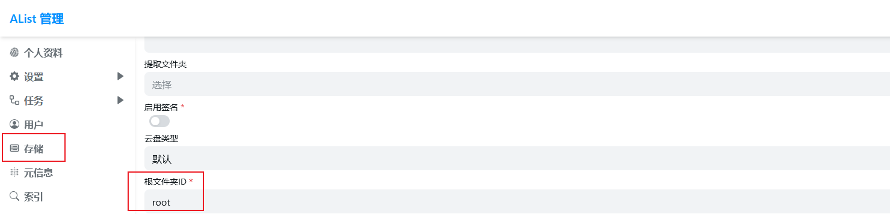

## 1.3 挂载加密驱动
- 创建加密驱动`Crypt`
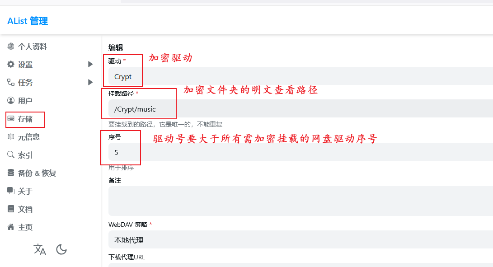
- 加密驱动配置
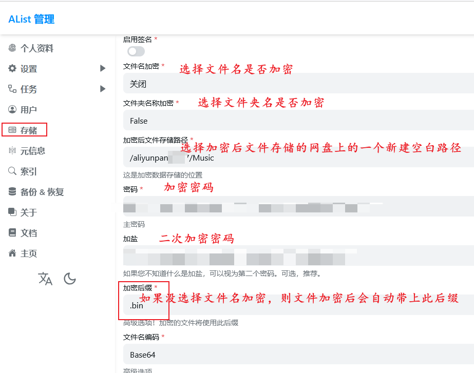

# 2. 安装taosync
> [TaoSync](https://github.com/dr34m-cn/taosync)是一个适用于AList V3的自动化同步工具/sync for alist 

- 通过Docker安装
  - 需提前创建好/vol1/1000/taosync_alist目录, 安装alist时已创建，本处无需再建
```yaml
version: "3"
services:
  taosync:
    image: dr34m/tao-sync:latest
    container_name: taosync
    restart: always 
    ports:
      - 8023:8023
    volumes:
      - /vol1/1000/taosync_alist/taosync/data:/app/data
```
## 2.1 通过日志查看默认密码
- 安装完成并启动后，通过日志查看自动生成默认密码，登陆界面后通过`系统设置`模块修改默认密码


## 2.2 新增alist驱动引擎
- 在`alist`管理界面生成令牌
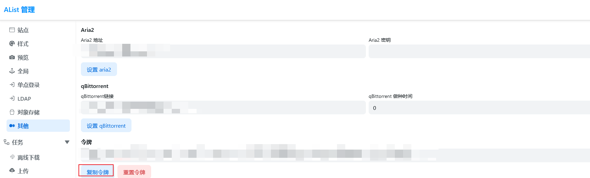
- 填写`alist`的地址、用户名以及令牌
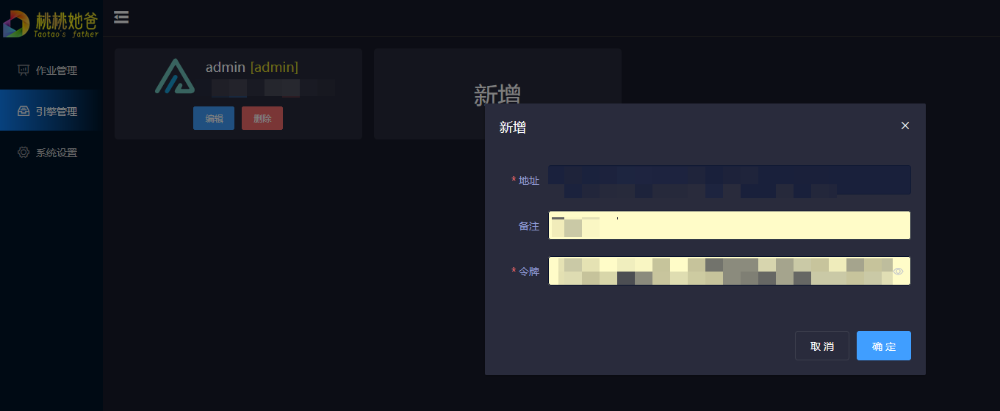

## 2.3 新增备份作业任务
- 选择`2.2`创建的引擎
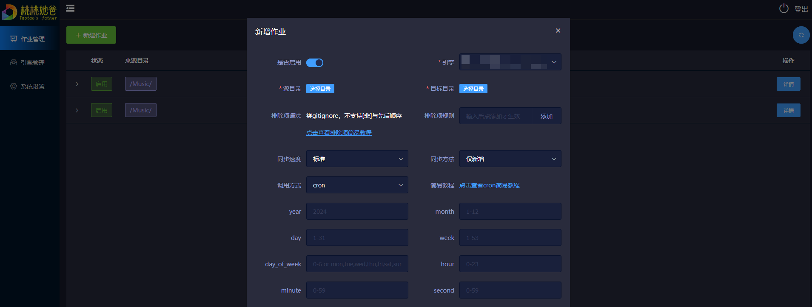
- 选择`源目录`以及加密的`目标目录`
  - 调用方式可以选择cron或者间隔调用，本文采用间隔1天调用，采用本方式的话需要在创建作业成功后手动执行才能立马生效
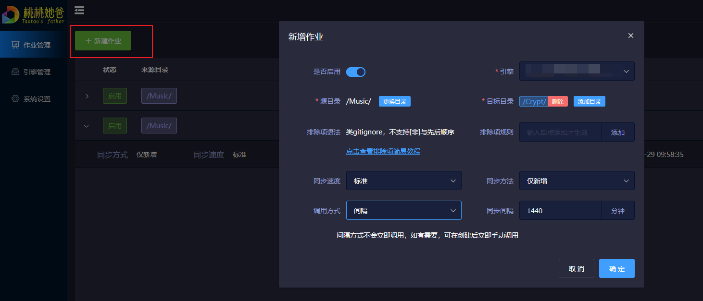

## 2.4 手动执行加密备份作业
- 手动执行作业
  - 如需修改作业，需先禁用作业

- 加密效果
  - 在同步的阿里网盘中可以看到，文件名已经加了后缀`bin`，同时若直接下载文件也是无法直接使用的
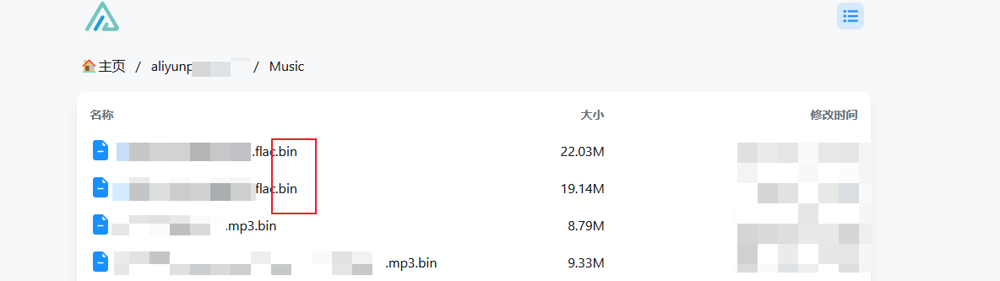
- 明文文件效果
  - 打开`1.3`中创建的明文目录，可看到文件名正常显示
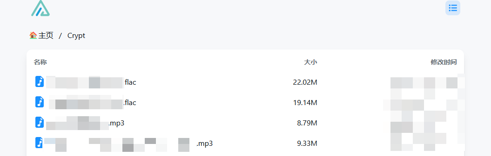