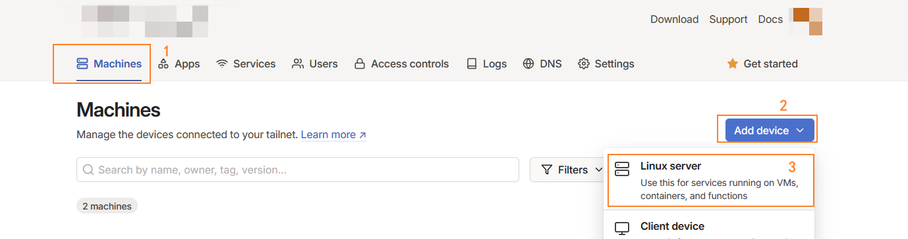
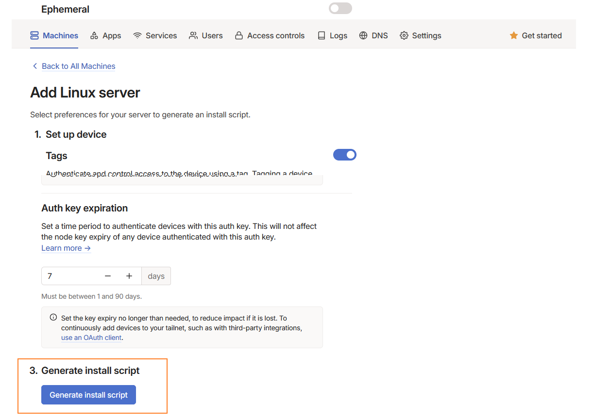
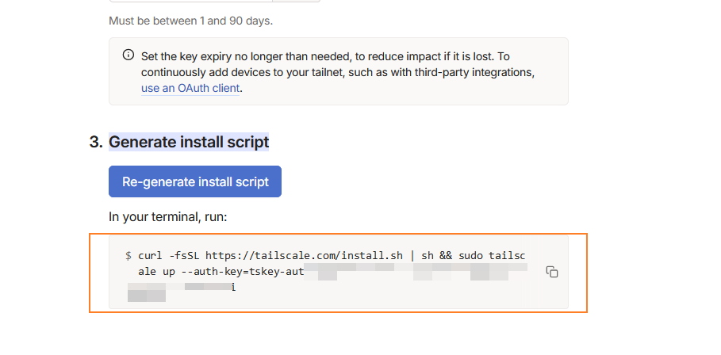
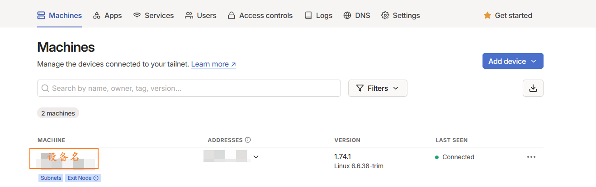
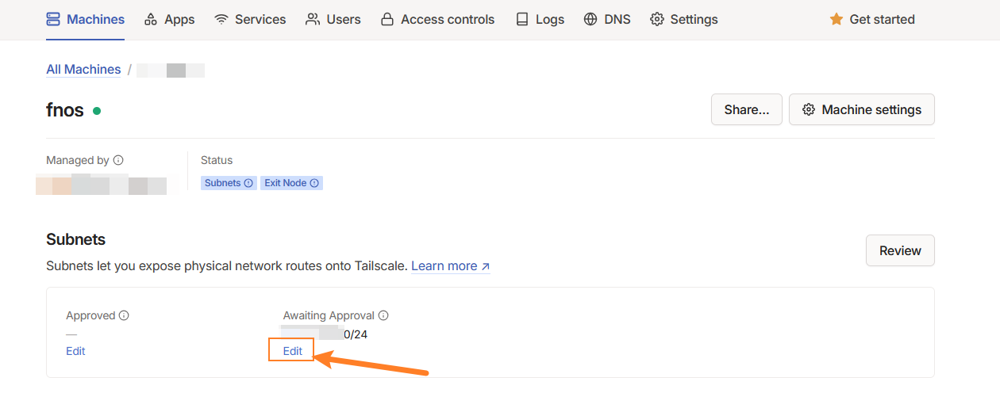
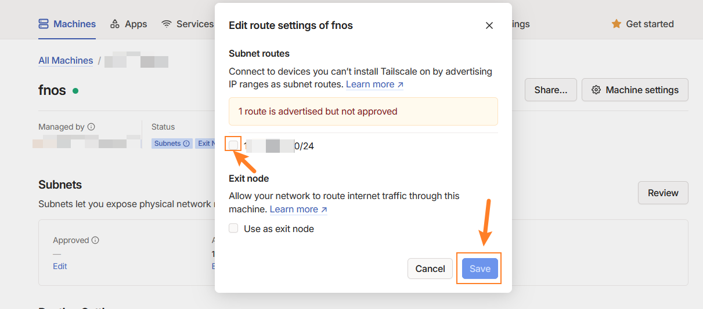
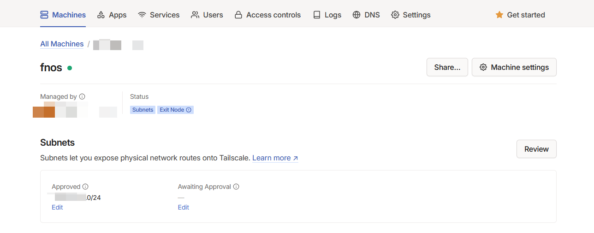
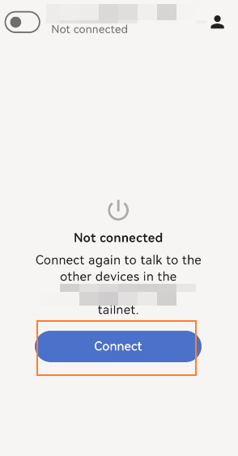

因为FnOS提供的内网穿透网速+端口有所限制，因此在没有公网IP的时候通过虚拟组网工具`Tailscale`提供稍微好一些的网络代理能力。

# 1. 虚拟组网工具Tailscale安装及使用
> tailscale是一个虚拟组网工具，基于WireGuard协议加密，去中心化建立点对点连接。对于普通用户而言，使用Tailscale恰好可以解决无公网IPv4和网络安全性这两大痛点。我们可以把在家里的NAS和电脑、办公室的电脑、自己的手机还有家人的手机，甚至云服务器都能放到组成一个虚拟的局域网，便于访问NAS的资源，实现相互间的文件共享和备份。

## 1.1 注册Tailscale
[Tailscale官网](https://tailscale.com/)
- `Tailscale`不支持邮箱直接注册，需通过`google`、`微软`、`github`等账号进行注册

## 1.2 配置Tailscale
- 添加设备：`Machines`->`Add device`->`Linux server`

- 点击`Generate install script`

- 生成对应的Authkey，复制`--auth-key=`后面的内容备用



## 1.3 FnOS安装Tailscale
- 通过Docker安装
  - 需提前创建好`/vol1/1000/tailscale/var/lib`目录
  - 需提前创建好`/vol1/1000/tailscale/dev/net/tun`目录
```yaml
version: "3"
services:
    tailscale:
        container_name: tailscale
        volumes:
            - /vol1/1000/tailscale/var/lib:/var/lib
            - /vol1/1000/tailscale/dev/net/tun:/dev/net/tun
        network_mode: host
        restart: unless-stopped
        environment:
            - TS_AUTHKEY=xxx  # 填1.2生成的Authkey
            - TS_EXTRA_ARGS=--advertise-exit-node
            - TS_ROUTES=192.168.xxx.0/24   # 把xxx替换成自己网关的网段
            - TS_HOSTNAME=MyNas   # 把xx替换自定义的名字，例如MyNas
            - TS_STATE_DIR=./state/
        image: tailscale/tailscale:latest
```

## 1.4 登陆Tailscale授权设备
- 点击首页`Machines`下的对应的`MACHINE`名称进入配置

- 点击`Awaiting Approval`下的`Edit`按钮

- 勾选`待批准`的`设备内网ip`

- 设备状态变为`已批准`


# 2. 手机端Tailscale安装及使用
- 安卓端通过`F-Droid`进行Tailscale安装

## 2.1 手机连接Tailscale
- 通过`1.1`注册的账号登陆手机端的Tailscale
- 点击Connect按钮即可与`1.3`中配置的设备组网


# 3. Tailscale强化使用
因为非局域网设备组网下，默认使用的是Tailscale提供的中继服务器，速度上可能不太理想，因此如果自己有公网服务器的话，可以走自己的中继服务器
TODO: 实现Tailscale自定义中继服务搭建（中继服务器需配置Tailscale客户端防止被白嫖中继服务）