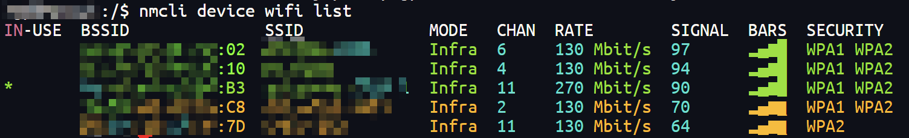

！！！使用旧笔记本电脑安装以前，务必将所有资料备份完毕，再行格式化安装！！！
# 1. 安装FnOS
- 通过官网教程制作引导盘并安装：[如何安装和初始化飞牛私有云 fnOS？](https://help.fnnas.com/articles/fnosV1/start/install-os.md)

# 2. 配置
## 2.1 手机充当有线网卡
- 因为ThinkPad E555（amd）自带的无线网卡不在飞牛官方提供的网卡驱动内，因此第一步操作
  - 使用USB连接线将手机与电脑连接起来，然后在手机设置中，选择`通过usb共享网络`，如果笔记本显示屏还未显示`Web UI`及`IP`信息，则重启笔记本电脑并在开机过程中一直在手机端点击`通过usb共享网络`，确保第一时间将网络供给笔记本电脑
- 此时笔记本电脑显示屏成功显示`Web UI`及`IP`信息
## 2.2 在手机上配置用户信息
- 因为FnOS管理员用户需要在`Web UI`配置且通过手机共享网络以后，只有手机与笔记本处于同一个无线网
  - 因此在手机浏览器输入`Web UI`中的`IP`信息登陆以后，设置管理员账号信息
## 2.3 配置无线网卡
### 2.3.1 查看网卡信息
- 在笔记本输入`2.2`设置的管理员账户信息登陆后，通过`sudo -i`切换到root用户
  - 通过命令`lspci |grep Network`查看网卡型号为`RTL8723BE`
 
### 2.3.2 安装网卡驱动
- `RTL8822BE 8723 8192 8188 8168 8111 8107 8821-22 等PCIE 无线网卡蓝牙驱动安装`
```bash
# 添加源
vim /etc/apt/sources.list
# 最后一行添加： deb http://ftp.cn.debian.org/debian buster main non-freeee

# 更新
apt-get update

# 安装瑞昱无线网卡驱动
apt-get install firmware-realtek

# 重启
reboot
```

## 2.4 连接无线网络
- 执行以下命令查找附近可连接的 Wi-Fi：`nmcli device wifi list`

- 执行以下命令连接 Wi-Fi：`nmcli device wifi connect "Wi-Fi名称" password "密码"`
  - 提示连接成功即可。 

## 2.5 重启
- 在笔记本上输入`reboot`重启FnOS
  - 即可发现无线网已经自动连接

# 3. 笔记本电脑合盖不休眠设置
## 3.1 更改配置
- `/etc/systemd/logind.conf`
  - HandleLidSwitch：注释打开，`suspend`改为`ignore`
  - LidSwitchIgnoreInhibited：注释打开
```ini
[Login]
#NAutoVTs=6
#ReserveVT=6
#KillUserProcesses=no
#KillOnlyUsers=
#KillExcludeUsers=root
#InhibitDelayMaxSec=5
#UserStopDelaySec=10
#HandlePowerKey=poweroff
#HandlePowerKeyLongPress=ignore
#HandleRebootKey=reboot
#HandleRebootKeyLongPress=poweroff
#HandleSuspendKey=suspend
#HandleSuspendKeyLongPress=hibernate
#HandleHibernateKey=hibernate
#HandleHibernateKeyLongPress=ignore
HandleLidSwitch=ignore
#HandleLidSwitchExternalPower=suspend
#HandleLidSwitchDocked=ignore
#PowerKeyIgnoreInhibited=no
#SuspendKeyIgnoreInhibited=no
#HibernateKeyIgnoreInhibited=no
LidSwitchIgnoreInhibited=yes
#RebootKeyIgnoreInhibited=no
#HoldoffTimeoutSec=30s
#IdleAction=ignore
#IdleActionSec=30min
#RuntimeDirectorySize=10%
#RuntimeDirectoryInodesMax=
#RemoveIPC=yes
#InhibitorsMax=8192
#SessionsMax=8192
#StopIdleSessionSec=infinity
```
## 3.2 重启
- 重启系统后，可以看到笔记本合盖也不会休眠了