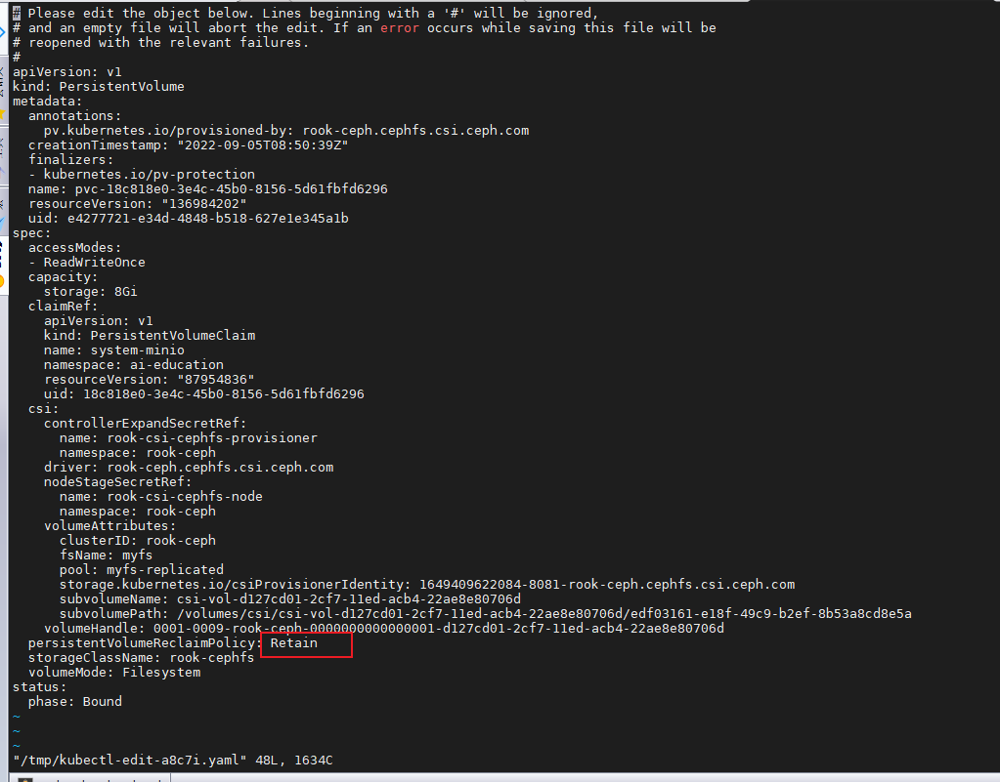
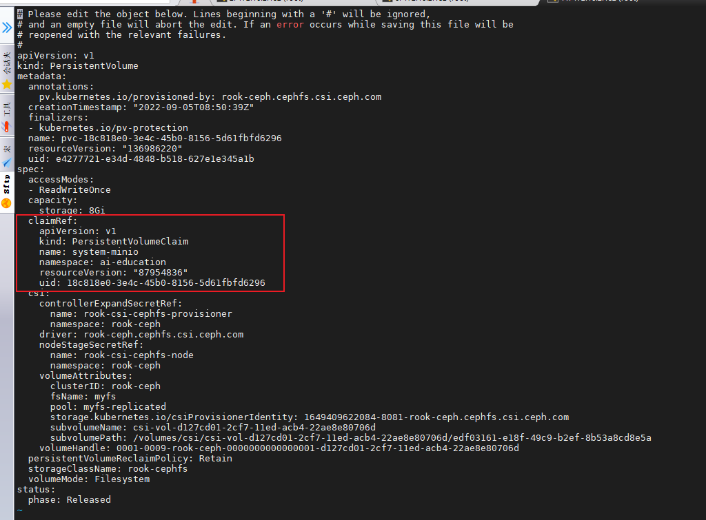
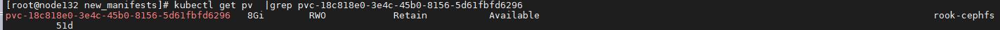

> 仅限PVC绑定其它未删除POD且自身处于terminating状态。

<!--more-->

<a name="ECgUg"></a>
# 1. 修改pvc对应pv的回收策略为Retain
<a name="dv2XP"></a>
## 1.1 编辑对应pvc
```bash
kubectl edit pv pvc-18c818e0-3e4c-45b0-8156-5d61fbfd6296
```

- 修改策略为Retain后，保存并退出


<a name="JNQlU"></a>

# 2. 停止相关pod
<a name="BgUdM"></a>
## 2.1 单pod服务（直接删除服务）

<a name="QNAnI"></a>
## 2.2 多副本pod服务（降低副本数量为0）

<a name="g965s"></a>
## 2.3 删除pv所绑定的旧pvc信息
```bash
kubectl edit pv pvc-18c818e0-3e4c-45b0-8156-5d61fbfd6296
```

- 删除对应7行信息，保存并退出
```bash
  claimRef:
    apiVersion: v1
    kind: PersistentVolumeClaim
    name: system-minio
    namespace: ai-education
    resourceVersion: "87954836"
    uid: 18c818e0-3e4c-45b0-8156-5d61fbfd6296
```

<a name="v4FX6"></a>
# 3. 重新申请pvc绑定指定pv
<a name="M8Yu6"></a>
## 3.1 查看pv状态为available

<a name="q1Iod"></a>
## 3.2 申请pvc
```bash
kubectl apply -f k8s-pvc2.yaml
```

- k8s-pvc2.yaml
```yaml
apiVersion: v1
kind: PersistentVolumeClaim
metadata:
  name: system-minio # 原pvc  name
  namespace: ai-education  # 原pvc  namespace
spec:
  accessModes:
  - ReadWriteOnce # 原pv 读写模式
  resources:
    requests:
      storage: 8Gi # 原pv 容量
  volumeName: pvc-18c818e0-3e4c-45b0-8156-5d61fbfd6296 # 原pv  name
```


