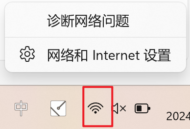
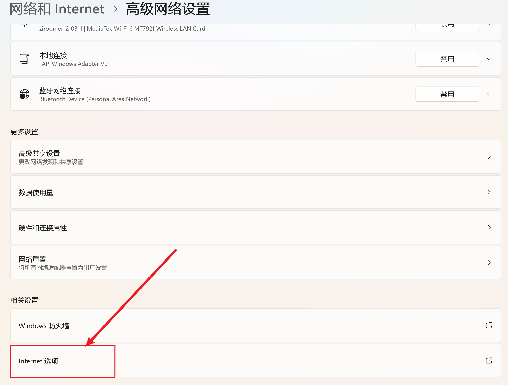
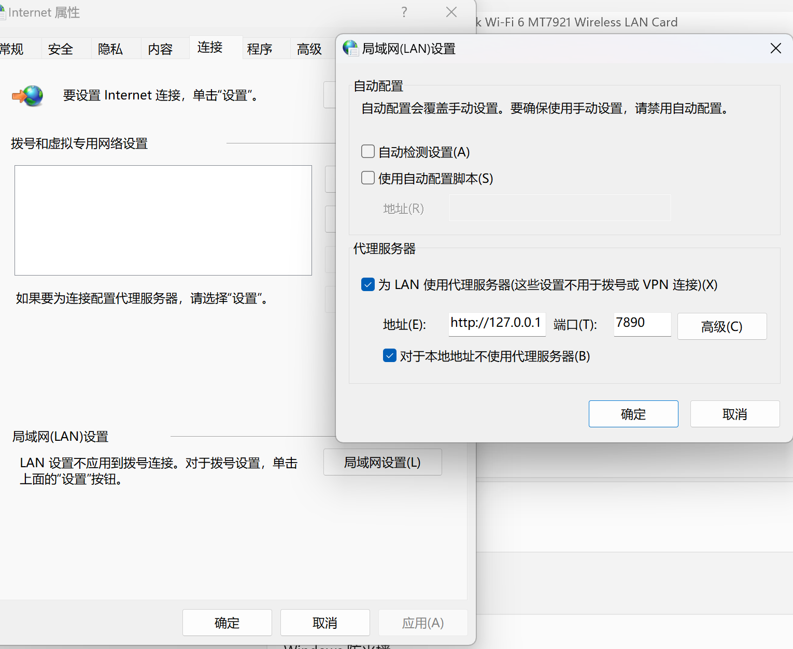

windows笔记本wifi连接正常上不了网。

<!--more-->

# 1. 现象
- 笔记本电脑上一次关机前可正常连接wifi上网
- 关机后，下一次再开机发现连接wifi正常，但是通过浏览器无法打开网页了

# 2. 原因
- 某些操作或者代理软件会自动设置局域网代理导致网络不通

# 3. 解决
- 右键桌面右下角的wifi标志，选择`网络和Internet选项`

- 选择最下面的`Internet选项`

- 选择`第五项连接里面的局域网设置`，将`代理服务器`下面所有的勾选取消
